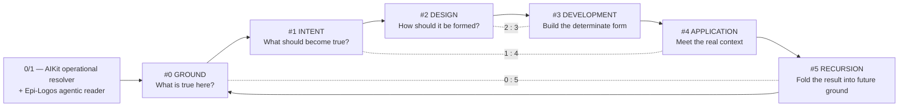
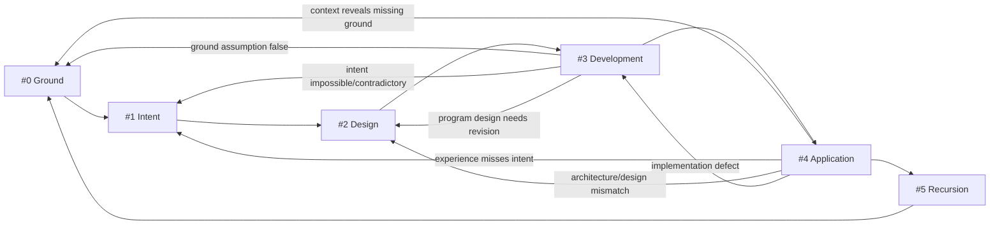
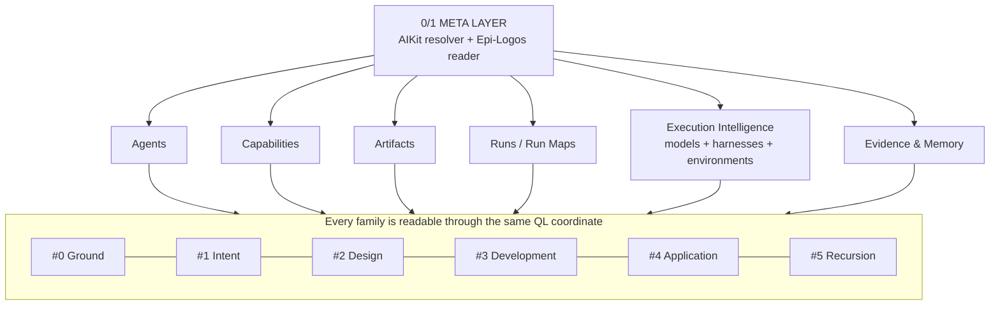
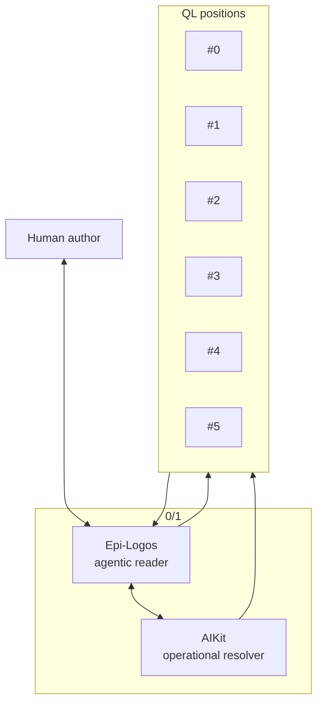
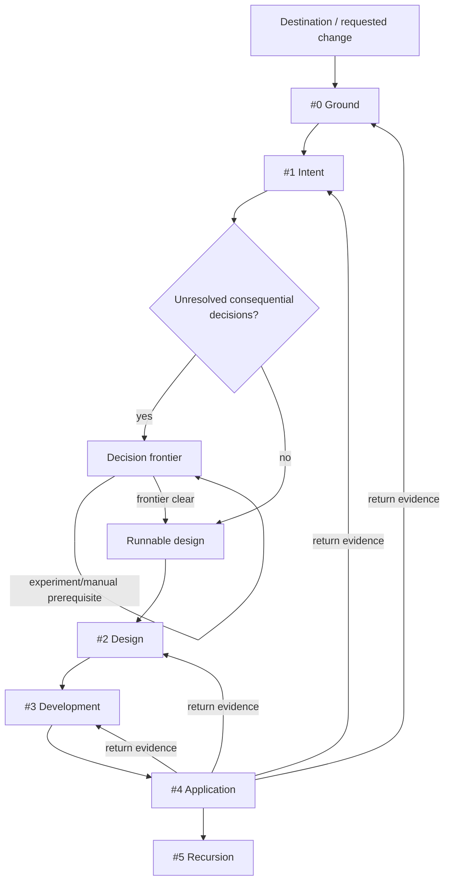
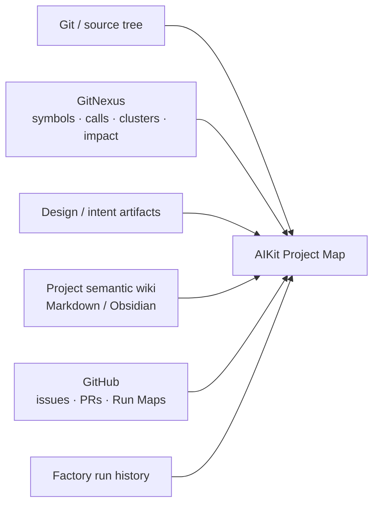
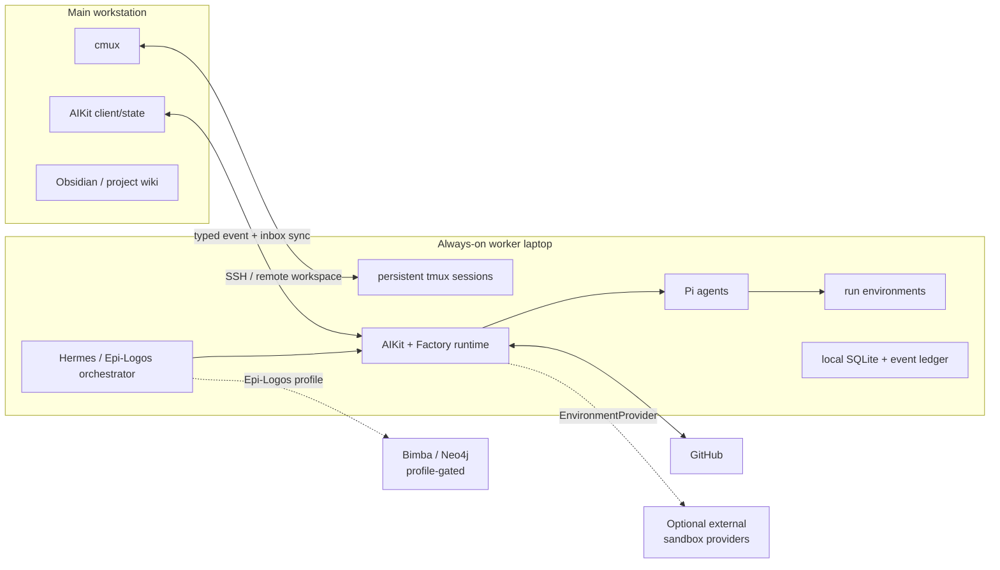
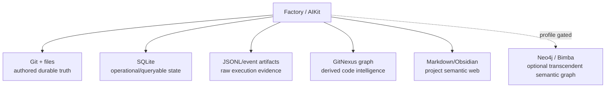
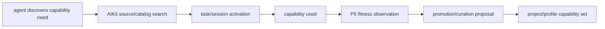

# QL Software Factory — Constitutional Architecture Specification

**Status:** Product/architecture ratification draft  
**Date:** 2026-08-11  
**Primary pipeline:** `ground : intent : design : development : application : recursion`  
**Scope:** Software Factory + embedded/co-developed AIKit + canonical Epi-Logos agent skeleton + reusable upstream integrations  
**Next document:** Primitive Algebra — exact relations, ownership, cardinalities, lifecycle invariants, and schemas between the primitives named here.

> **AST-100 note.** The literal AST-100 rubric text was not retrievable from the connected repositories, project files, or public sources available during this pass. This specification therefore applies the function requested of it rather than inventing a standard: every architectural claim is attached to an explicit purpose, surface, artifact, integration, interface, evidence path, and ratification criterion; vocabulary is fixed; diagrams carry structure; source reuse is named down to repositories and implementation seams. When the canonical AST-100 rubric is available, it should be applied as a writing/quality overlay without changing the architecture established here.

---

## 0. Executive specification

The Software Factory is a **QL-organised agentic engineering system** for taking software from its present ground through intended form into developed, applied, and recursively improved reality.

Its canonical technological pipeline is:

```text
ground : intent : design : development : application : recursion
   #0       #1       #2          #3           #4          #5
```

Each position is simultaneously:

1. a stage in a software-development traversal;
2. a typed input/output contract;
3. a semantic coordinate available to agents, capabilities, artifacts, models, and evidence;
4. a return destination when later evidence reveals that an earlier determination must be revised.

The six positions are **invariant in form and developable in content**. Better project ground, better design artifacts, better skills, better models, better code intelligence, and better accumulated evidence improve what passes through the pipeline without requiring the workflow itself to be reinvented.

The system is built from two complementary products.

- **AIKit** is the context-scoped operating substrate: projects, profiles, sessions, tmux/cmux, capability discovery and projection, trust, Procedures, inbox, harness/client integration, host awareness, and the resolution of what is available *here and now*.
- **Software Factory** is the QL developmental runtime: Run Maps, position contracts, canonical agent roles, typed artifacts, source-fidelity rules, execution and sandbox coordination, application/review surfaces, telemetry, and recursive learning.

Epi-Logos provides the canonical six-agent identity of the system:

| QL | Canonical agent | Factory position |
|---|---|---|
| `#0` | Anuttara | Ground |
| `#1` | Paramasiva | Intent |
| `#2` | Parāśakti | Design |
| `#3` | Mahāmāyā | Development |
| `#4` | Nara | Application |
| `#5` | Epii | Recursion |

The **Epi-Logos orchestrator** reads and composes the six at the agentic `0/1` meta-level. AIKit supplies the operational meta-level that resolves capabilities, models, harnesses, sessions, hosts, environments, and project/profile context.

The system remains useful for any software project. The Epi-Logos project profile activates the fuller canonical identity, including optional Bimba/Neo4j access; a generic project can use the entire Factory without any dependency on Bimba or Epi-Logos ontology.

### 0.1 The experiential north star

The product is successful when this is ordinary:

```text
$ aikit open nara
```

A cmux workspace appears or is resumed. The correct project, profile, capabilities, model/harness options, persistent worker session, Project Map, Run Maps, application panes, and inbox are already in context.

The user can then say:

```text
improve the identity matrix interaction
```

or simply:

```text
improve this
```

The request is meaningful because the Factory can compare:

```text
project intention
      ↕
design state
      ↕
code + runtime state
      ↕
application evidence
      ↕
recursion/history
```

The system discovers the most relevant discrepancy, forms or resumes a Run Map, asks the human only for consequential authorial decisions, develops one or more candidates in appropriate environments, makes the result directly experienceable, and folds the accepted change back into the project's code, design, semantic map, telemetry, and future ground.

### 0.2 The constitutional diagram



The complementary pairs are operational:

- **`#0 ↔ #5` — ground / recursion:** what was learned and integrated becomes the next traversal's ground.
- **`#1 ↔ #4` — intent / application:** the applied software is assessed against the experience and outcome that were intended.
- **`#2 ↔ #3` — design / development:** code is evaluated as the implementation of an explicit program design rather than as an isolated patch.

---

# 1. Product constitution

## 1.1 Product thesis

The Factory treats **software development as an intelligible chain of durable transformations**.

A run does more than produce code. It preserves why the change exists, how the design was determined, how it entered the codebase, what happened when it was applied, and what the system learned from the traversal.

The durable product of a run is therefore a coherent relation among:

```text
intention
  ↕
design
  ↕
code
  ↕
application
  ↕
knowledge
```

The codebase becomes progressively easier for agents and humans to enter because each successful run improves the surfaces from which later runs begin.

## 1.2 AI-native engineering principle

The Factory places judgement where judgement belongs and executable certainty where executable certainty belongs.

Agentic intelligence is used for:

- discovery and interpretation;
- domain and product reasoning;
- design;
- decomposition;
- source selection;
- model/capability selection where evidence informs the choice;
- implementation;
- diagnosis;
- semantic review;
- synthesis and learning.

Deterministic machinery is used for:

- state transitions;
- identifiers and provenance;
- schema parsing;
- permissions;
- known commands;
- test execution;
- source-control operations;
- environment lifecycle;
- event recording;
- immutable artifacts;
- trust and policy enforcement;
- reproducible gates.

This adopts one of SSSF's strongest working principles directly: a known command such as a test or lint invocation is a code operation, while an agent is used where reading and deciding are required.

## 1.3 Source fidelity

Open-source systems incorporated by the Factory are treated as **working source assets**.

Every substantial upstream integration has a `SourceIntegration` record containing:

```toml
id = "source/gitnexus"
upstream = "https://github.com/nxpatterns/gitnexus"
revision = "<pinned revision>"
mode = "cli+mcp+adapter"

adopt = [
  "gitnexus analyze",
  "gitnexus context",
  "gitnexus impact",
  "gitnexus trace",
  "gitnexus detect-changes"
]

augment = [
  "AIKit Project Map binding",
  "QL capability metadata",
  "project semantic-wiki references"
]

verify = [
  "integration smoke test",
  "upstream version check",
  "real indexed-repository acceptance test"
]
```

The available integration modes are:

| Mode | Meaning |
|---|---|
| **direct dependency** | Link or import the upstream package/library directly. |
| **CLI adapter** | Execute the upstream program through its documented CLI and structured output. |
| **protocol adapter** | Use an upstream protocol such as MCP, RPC, JSONL, or HTTP. |
| **capability source** | Import upstream skills/capabilities through AIKit source management. |
| **vendored fork** | Preserve the upstream implementation and history while making deliberate local changes. |
| **source mount** | Co-develop an adjacent/nested repository while preserving its independent repository identity. |
| **reference implementation** | Reuse algorithms/design selectively when direct execution is inappropriate, with the copied seam named explicitly. |

A design that names an upstream product must name which mode is being used. Development evidence must show that the actual integration seam is exercised.

---

# 2. The QL technological pipeline

## 2.1 The six positions

| Position | Name | Primary question | Factory transformation | Primary output |
|---|---|---|---|---|
| `#0` | **Ground** | What is actually true here? | Establish the relevant present state and discrepancy. | `GroundArtifact` |
| `#1` | **Intent** | What should become true? | Crystallise user/product intention into observable experience and outcomes. | `IntentArtifact` |
| `#2` | **Design** | Through what form and sequence? | Determine architecture, program design, interfaces, tree changes, and vertical order. | `DesignArtifact` |
| `#3` | **Development** | Can the design be built coherently? | Develop one or more executable candidates from the design. | `DevelopmentArtifact` |
| `#4` | **Application** | What is the developed thing in its real field? | Run, test, compare, experience, and contextualise the candidate. | `ApplicationArtifact` |
| `#5` | **Recursion** | What now becomes part of the system? | Integrate the accepted change and turn its trajectory into future capability and ground. | `RecursionArtifact` |

## 2.2 QL is a return topology

The pipeline is ordered but not one-way.

A later stage can return evidence to the stage that owns the decision now shown to be wrong.



Every return carries structured evidence:

```ts
type PositionReturn = {
  from: QLPosition
  to: QLPosition
  reason: string
  evidence: Ref[]
  affected_decisions: Ref[]
}
```

This turns retries into learning. A failed candidate can refine ground, intent, or design rather than merely asking the same builder to “try again”.

## 2.3 QL recursion inside positions

A sufficiently complex position can unfold its own QL traversal.

A difficult design problem can therefore be expressed as:

```text
#2 Design
  └── #2.0 ground
      #2.1 intent
      #2.2 design
      #2.3 development/prototype
      #2.4 application/evaluation
      #2.5 recursion/decision
```

The outer position remains `#2`; the nested path records how that determination was reached.

```ts
type QLAddress = {
  arc: "day" | "night"
  path: number[] // e.g. [2, 3], [2, 4], [4, 2, 5]
}
```

This gives the system a recursive form without forcing every small task through ceremonial sub-agents.

---

# 3. The six constitutional families

The system contains six QL-addressable families. Each family is organised **across** `#0–#5`; its members carry affinities and use-types rather than being placed into one exclusive bucket.

The six families are:

1. **Agents**
2. **Capabilities**
3. **Artifacts**
4. **Runs**
5. **Execution Intelligence**
6. **Evidence & Memory**



## 3.1 Family I — Agents

The canonical family is:

```text
0/1  Epi-Logos reader/orchestrator

#0   Anuttara
#1   Paramasiva
#2   Parāśakti
#3   Mahāmāyā
#4   Nara
#5   Epii
```

These identities are persistent and developable. A run receives a fresh or resumable execution session whose context is assembled from the canonical identity, project/profile, QL position, Run Map, and selected capabilities.

The canonical six are the native skeleton of the Factory. Other projects may substitute or augment agents while preserving the position contracts.

An agent definition therefore has at least:

```ts
type AgentDefinition = {
  id: AgentRef
  canonical_position?: QLPosition
  ql_affinity: QLAffinity
  identity: ArtifactRef
  default_capability_sets: CapabilitySetRef[]
  supported_harnesses: HarnessRef[]
  model_preferences?: ModelRequirement[]
}
```

## 3.2 Family II — Capabilities

**Skills and tools share one capability language.**

AIKit already has the correct primitive: the **capsule** is packaging; a catalogued capsule becomes a capability. The Factory extends this with QL and use-type metadata.

A capability can represent:

- a skill;
- CLI;
- script;
- MCP server/tool;
- Pi extension;
- hook;
- deterministic verifier;
- browser operation;
- GitHub operation;
- diagram generator;
- research method;
- semantic graph query;
- composite skill-set.

Example:

```toml
id = "capability/code/gitnexus-impact"
kind = "cli"

[ql_affinity]
ground = 0.95
intent = 0.10
design = 0.75
development = 0.65
application = 0.90
recursion = 0.55

use_types = [
  "code-discovery",
  "impact-analysis",
  "change-validation"
]

[provider]
source = "gitnexus"
command = ["gitnexus", "impact"]
```

`ql_affinity` is a **description of suitability**, not an activation rule. AIKit's existing profile/project/session/task resolution decides what is active; the QL vector helps selection and explanation.

Capability selection is resolved from:

```text
project/profile
+ canonical agent
+ QL position
+ current task
+ session overlay
+ platform/host
+ trust/policy
+ observed fitness
+ explicit user choice
```

### Core Factory capability foundation

The default Factory profile should compose a curated foundation from real sources:

```text
factory-foundation/
├── ground/
│   ├── GitNexus code intelligence
│   ├── research
│   └── repository/project discovery
├── intent/
│   ├── Dexter/HumanLayer product-design discipline
│   ├── HTML experience prototyping
│   ├── domain modelling
│   └── grilling
├── design/
│   ├── Run Map / Wayfinder-derived mapping
│   ├── codebase design
│   ├── architecture diagrams
│   ├── program-design trees/signatures
│   └── vertical-slice design
├── development/
│   ├── Pi coding harness
│   ├── implementation/TDD capabilities
│   └── source-integration discipline
├── application/
│   ├── deterministic test/gate execution
│   ├── browser/runtime testing
│   ├── GitNexus impact analysis
│   └── semantic/adversarial review
└── recursion/
    ├── documentation
    ├── project wiki maintenance
    ├── Git/PR integration
    ├── event/telemetry interpretation
    └── capability/model fitness learning
```

The folder is a skill-set/projection convenience; each member retains its own trust, source, use-types, and multi-position affinity.

## 3.3 Family III — Artifacts

Artifacts are the typed, inspectable products of reasoning and execution.

The six canonical artifact classes are:

```text
#0  GroundArtifact
#1  IntentArtifact
#2  DesignArtifact
#3  DevelopmentArtifact
#4  ApplicationArtifact
#5  RecursionArtifact
```

Each can contain multiple files and structured records.

The artifact system supports:

- Markdown;
- HTML;
- Mermaid;
- ASCII;
- JSON/YAML/TOML typed envelopes;
- source-code patches;
- test/evidence records;
- images/screenshots/video where useful;
- Git references;
- issue references;
- runnable prototypes;
- semantic-wiki notes.

The **artifact header** is common:

```ts
type ArtifactHeader = {
  id: ArtifactRef
  project: ProjectRef
  run: RunRef
  ql: QLAddress
  type: string
  version: number
  parents: ArtifactRef[]
  sources: Ref[]
  producer: {
    agent?: AgentRef
    model?: ModelRef
    harness?: HarnessRef
    capabilities: CapabilityRef[]
    host?: HostRef
    environment?: EnvironmentRef
  }
  created_at: Timestamp
}
```

## 3.4 Family IV — Runs

A Run is one QL transformation of a project.

Its durable semantic object is the **Run Map**.

Wayfinding, planning, development, review, and recursion are states/content of the same Run Map rather than separate map types.

A run can begin in either condition:

```text
RUN MAP
   │
   ├── route already determinate ───────────────► runnable
   │
   └── unresolved consequential decisions
           │
           ├── grilling
           ├── research
           ├── prototype
           ├── experiment
           └── manual prerequisite
                     │
                     ▼
                  runnable
```

The map continues through execution; it does not disappear when planning clears.

## 3.5 Family V — Execution Intelligence

Execution Intelligence answers:

> Which model, harness, host, environment, and execution shape best fit the artifact we need now?

It contains:

- model profiles;
- harness providers;
- model/harness compatibility;
- host capabilities;
- sandbox/environment providers;
- candidate fan-out strategies;
- task demand profiles.

Models are described by measured and curated fitness across QL use-types rather than permanently assigned to one stage.

```ts
type ModelProfile = {
  id: ModelRef
  modalities: string[]
  harnesses: HarnessRef[]
  ql_fitness: QLAffinity
  use_fitness: Record<UseType, Assessment>
  observed: FitnessObservation[]
  failure_patterns: FailurePattern[]
  provider_characteristics: ProviderCharacteristic[]
}
```

A request for execution becomes:

```ts
type ExecutionDemand = {
  ql: QLAddress
  artifact_type: string
  use_types: UseType[]
  modalities: string[]
  tool_requirements: CapabilityRef[]
  context_characteristics: string[]
  independence_from?: ModelRef[]
  user_constraints?: Constraint[]
}
```

AIKit resolves candidates; the Factory records why a selection was made.

Cost, latency, token use, and context occupancy are **measured axes**. They become constraints when the user or environment makes them relevant rather than existing as arbitrary per-stage budgets.

## 3.6 Family VI — Evidence & Memory

Evidence makes claims inspectable. Memory makes repeated work cumulative.

The six evidence orientations are:

| QL | Evidence question |
|---|---|
| `#0` | What proves this ground statement? |
| `#1` | What makes the intended outcome explicit and recognisable? |
| `#2` | What makes the design determinate enough to develop? |
| `#3` | What demonstrates what was actually developed and changed? |
| `#4` | What happened when the candidate met its runtime/user/context? |
| `#5` | What should be retained as durable learning and future ground? |

Evidence includes deterministic results, source references, runtime traces, human decisions, model judgements, screenshots, diffs, GitNexus impact results, application URLs, and run telemetry.

P5 interprets the completed evidence stream and updates model/capability/agent/project learning.

---

# 4. The meta-layer: 0/1

The six positions are read through a meta-layer rather than supplemented by a seventh stage.

There are two complementary meta functions.

## 4.1 AIKit — operational meta

AIKit resolves the actual operating context:

```text
user
+ host
+ project
+ project profile
+ worktree/directory
+ session
+ pane/task
+ target client/harness
+ invocation override
          │
          ▼
effective capability + execution view
```

The existing AIKit already implements much of this as a Rust control plane with:

- `aikit-core`;
- `aikit-store`;
- `aikit-adapters`;
- `aikit-tui`;
- `aikit-cli`;
- context-scoped capability resolution;
- immutable generations;
- Procedures;
- project/profile/session/task layering;
- tmux and cmux adapters;
- SQLite operational state and events;
- an inbox;
- foreign skill discovery and trust;
- capability skill-sets.

The Factory extends these existing seams rather than re-creating them.

## 4.2 Epi-Logos — agentic meta

The Epi-Logos orchestrator is the canonical reader of the six agents and six-position Run Map.

Its work includes:

- choosing which position needs activity;
- asking AIKit for the capabilities/execution environment appropriate to that activity;
- maintaining the coherent Run Map;
- presenting authorial decisions to the human;
- interpreting returns from later positions;
- coordinating recursive sub-runs;
- bringing P5 output back into P0 ground.

The orchestrator remains an agent and therefore makes interpretive decisions. AIKit remains the deterministic resolver and operating substrate.



---

# 5. Human experience and authority

## 5.1 The two high-energy apertures

The human experience is concentrated around two authorial boundaries.

### Aperture A — Commission: Ground → Intent

The user supplies or recognises what should become true.

A request already containing sufficient intention passes directly.

```text
"Add keyboard navigation to the model selector."
```

A broad request such as:

```text
"Improve the model selector."
```

may produce several grounded discrepancies. When choosing among them changes the intended product, the Factory creates an inbox decision.

The Commission Packet contains:

```ts
type CommissionPacket = {
  run: RunRef
  current_ground: ArtifactRef
  proposed_intent?: ArtifactRef
  question: string
  recommendation?: string
  alternatives: DecisionOption[]
  why_human: string
  evidence: Ref[]
  prototypes?: Ref[]
}
```

### Aperture B — Recognition: Application → Recursion

P4 makes the result tangible. The human can inspect or use the actual candidate and its most relevant explanatory artifacts.

The Recognition Packet contains:

```ts
type RecognitionPacket = {
  run: RunRef
  intent: ArtifactRef
  candidate: ArtifactRef
  application: ArtifactRef
  environment?: EnvironmentRef
  previews: Ref[]
  evidence: Ref[]
  design_delta: Ref[]
  proposed_recursion: Ref[]
  unresolved: string[]
}
```

The normal actions are:

```text
recognise
return
discuss
compare candidates
defer
```

Recognition is the point at which the human says that the applied form belongs to the project they intend.

## 5.2 AIKit inbox as the canonical human channel

AIKit already contains an inbox abstraction. The Factory extends its kinds to carry run-boundary requests:

```rust
enum FactoryInboxKind {
    IntentDecision,
    DesignDecision,
    PrototypeReview,
    ApplicationReview,
    RecognitionReview,
    AuthorityRequest,
    RunNotice,
    Breakage,
    AgentProposal,
}
```

An inbox request must explain **why the human is the correct resolver**.

```ts
type HumanRequest = {
  id: InboxRef
  project: ProjectRef
  run: RunRef
  ql: QLAddress
  kind: string
  question: string
  recommendation?: string
  alternatives: DecisionOption[]
  why_human: string
  consequence: string
  evidence: Ref[]
  artifacts: Ref[]
  environments: EnvironmentRef[]
  blocking: boolean
}
```

The same request can be projected into:

- the AIKit TUI;
- cmux notifications/panes;
- Hermes conversation;
- Telegram via Hermes;
- a GitHub issue/comment;
- a future web review surface.

The **InboxItem is canonical; the channels are projections**.

## 5.3 Decision sovereignty

The Factory distinguishes four authority modes:

| Mode | Resolution |
|---|---|
| **agent judgement** | Reversible, local reasoning and implementation choices are made by the responsible agent. |
| **evidence determination** | Facts with deterministic tests or inspectable evidence are resolved by code/evidence. |
| **authorial decision** | Product meaning, significant UX direction, scope, or foundational architectural choices route to the human when existing intent does not determine them. |
| **recognition** | Material changes to the experienced product or canonical project identity are presented for human recognition at the application/recursion boundary. |

This keeps human attention concentrated where it carries the greatest authorship.

---

# 6. Position contracts

## 6.1 #0 — Ground

### Intention

Ground establishes the relevant state from which the run proceeds.

### Input

```ts
type GroundInput = {
  project: ProjectRef
  seed: RunSeed
  project_map: ProjectMapRef
  revision: GitRef
  existing_runs: RunRef[]
  runtime_refs?: Ref[]
}
```

A `RunSeed` can be:

```ts
type RunSeed =
  | { kind: "intent"; text: string }
  | { kind: "improve"; scope?: Ref }
  | { kind: "issue"; issue: Ref }
  | { kind: "bug"; report: Ref | string }
  | { kind: "incident"; evidence: Ref[] }
  | { kind: "explore"; question: string }
  | { kind: "maintenance"; scope?: Ref }
```

### Active sources

Ground can draw from:

- repository state;
- Git history;
- existing intent/design docs;
- Project Map;
- GitNexus code graph;
- project semantic wiki;
- GitHub issues/PRs;
- runtime/incident evidence;
- prior Factory runs;
- optional Bimba semantic context when the active project/profile grants it.

### Output — `GroundArtifact`

```ts
type GroundArtifact = {
  request: NormalizedRunSeed
  scope: Ref[]

  established_facts: GroundFact[]
  existing_intent: Ref[]
  existing_design: Ref[]
  relevant_code: Ref[]
  relevant_runtime: Ref[]

  constraints: Constraint[]
  decisions_already_made: Ref[]
  unresolved_questions: Question[]

  discrepancies: DesignRealityDelta[]
  improvement_candidates: ImprovementCandidate[]

  source_evidence: Ref[]
  map_coverage: CoverageAssessment
}
```

### Ground gate

P0 is complete when the run has enough verified ground to determine whether:

1. the requested intent is already clear;
2. an authorial choice is needed;
3. further research/discovery is needed.

A generic “improve” run selects candidates from **documented project intention × actual project state**, not from free-floating model taste.

---

## 6.2 #1 — Intent

### Intention

Intent defines the observable reality the project is trying to bring about.

### Input

```ts
type IntentInput = {
  seed: NormalizedRunSeed
  ground: ArtifactRef<GroundArtifact>
  existing_intent: Ref[]
  authorial_decisions: Ref[]
}
```

### Output — `IntentArtifact`

```ts
type IntentArtifact = {
  intention: string
  problem: string
  target_users_or_actors: string[]

  desired_experience: ExperienceState[]
  scenarios: Scenario[]
  observable_outcomes: ObservableOutcome[]
  success_signals: SuccessSignal[]

  scope: Ref[]
  exclusions: Ref[]

  prototypes: Ref[]
  html_views: Ref[]
  flows: Ref[]
  language_decisions: Ref[]

  unresolved_authorial_decisions: Ref[]
}
```

### Design-driven product practice

The Factory foundation imports and adapts the HumanLayer/Dexter discipline:

- product requirements and user pain before technical design;
- measurable/observable success;
- rough HTML artifacts for interaction/UI questions;
- product review before expensive implementation when misunderstanding would be costly.

For small, already-determined changes, the artifact can be correspondingly small. The **schema stays invariant; the fidelity scales to the run**.

### Intent gate

P1 is complete when an informed reader can answer:

> “If I experienced the finished change without reading its code, what would make me recognise that the intended change occurred?”

---

## 6.3 #2 — Design

### Intention

Design converts intention into a determinate technical and programmatic form.

### Input

```ts
type DesignInput = {
  ground: ArtifactRef<GroundArtifact>
  intent: ArtifactRef<IntentArtifact>
  project_map: ProjectMapRef
  prior_design: Ref[]
  source_integrations: SourceIntegrationRef[]
}
```

### Output — `DesignArtifact`

```ts
type DesignArtifact = {
  architecture_delta: Ref[]
  program_design: Ref[]

  system_views: {
    mermaid: Ref[]
    ascii: Ref[]
    html: Ref[]
  }

  domain_model_delta: Ref[]
  module_designs: ModuleDesign[]
  interface_contracts: InterfaceContract[]

  tree_delta: TreeDelta
  call_paths: CallPathDesign[]
  key_types_and_signatures: SignatureDesign[]

  source_integrations: SourceIntegrationPlan[]
  vertical_slices: VerticalSlice[]
  application_plan: ApplicationPlan

  unresolved_decisions: DecisionRef[]
}
```

### Program design standard

The design artifact should make the code shape cheap to understand before P3 spends implementation context.

For applicable changes it includes:

**File-tree delta**

```text
src/
└── session/
    +── runtime.rs         # lifecycle interface
    +── recovery.rs        # snapshot/recovery implementation
    ~── mod.rs             # public surface
```

**Call-path tree**

```text
resume_session
  SessionRuntime.resume
    load_snapshot
    validate_snapshot
    instantiate_session
    publish_ready
```

**Types and signatures**

```rust
pub trait SessionRuntime {
    fn resume(&self, id: SessionId) -> Result<Session, ResumeError>;
}
```

**Interface semantics**

An interface includes what a caller must know to use it correctly: signatures, invariants, ordering constraints, error modes, configuration, and material performance characteristics.

### Source fidelity gate

Every named external system has a concrete integration plan:

```text
source
revision/pin strategy
integration mode
exact API/CLI/protocol/path being reused
local augmentation
verification
upgrade path
```

### Design gate

P2 is ready for development when the first vertical slice can be implemented without P3 having to silently invent product or architecture decisions.

---

## 6.4 #3 — Development

### Intention

Development constructs the determinate design in testable vertical increments.

### Input

```ts
type DevelopmentInput = {
  run: RunRef
  design: ArtifactRef<DesignArtifact>
  slice: VerticalSlice
  checkout: CheckoutRef
  environment: EnvironmentRef
  resolved_capabilities: CapabilityRef[]
  execution: ExecutionSelection
}
```

### Output — `DevelopmentArtifact`

```ts
type DevelopmentArtifact = {
  slice: SliceRef
  candidate: CandidateRef

  revision: GitRef
  patch: Ref
  changed_files: Ref[]
  changed_symbols: Ref[]

  tests_added_or_changed: Ref[]
  deterministic_results: Ref[]
  runtime_refs: Ref[]

  source_integrations_exercised: SourceIntegrationRef[]
  design_deviations: DesignDeviation[]
  trace: Ref
}
```

### Vertical development

The default development form is a sequence that can be touched and tested at each increment.

Example:

```text
slice 1  contract + mock endpoint
slice 2  visible consumer using mock
slice 3  wire service path
slice 4  wire persistence
slice 5  harden domain/error paths
```

The exact order is determined by P2, but each slice produces an executable or otherwise inspectable state.

### Candidate fan-out

When uncertainty warrants comparison, the same DevelopmentInput can produce multiple candidates:

```text
DesignArtifact
     │
     ├── Candidate A — model/harness/config A
     ├── Candidate B — model/harness/config B
     └── Candidate C — alternate implementation
                    │
                    ▼
                Application
```

Parallelism is applied at the position where uncertainty exists rather than duplicating the entire run by default.

### Development gate

P3 completes when the candidate is coherent enough to be applied and tested according to the P4 plan, with every material design deviation surfaced.

---

## 6.5 #4 — Application

### Intention

Application places the developed candidate into the field where its consequences can be observed.

### Input

```ts
type ApplicationInput = {
  ground: ArtifactRef<GroundArtifact>
  intent: ArtifactRef<IntentArtifact>
  design: ArtifactRef<DesignArtifact>
  development: ArtifactRef<DevelopmentArtifact>
  environment: EnvironmentRef
}
```

### Output — `ApplicationArtifact`

```ts
type ApplicationArtifact = {
  candidate: CandidateRef
  environment: EnvironmentRef

  deterministic_evidence: Ref[]
  runtime_evidence: Ref[]
  experience_evidence: Ref[]
  architecture_evidence: Ref[]
  regression_evidence: Ref[]
  impact_evidence: Ref[]

  intent_conformance: Assessment
  design_conformance: Assessment

  review_surfaces: Ref[]
  comprehension_material?: Ref[]

  verdict:
    | { kind: "ready_for_recognition" }
    | { kind: "return"; to: QLPosition; evidence: Ref[] }
}
```

### Application surface

For applications with a UI, P4 should make candidates directly openable.

```text
candidate A  → browser/app pane
candidate B  → browser/app pane
current main → comparison pane
```

For APIs/CLIs/services, the equivalent surface may be:

- live endpoint;
- curl transcript;
- state visualiser;
- test environment;
- trace;
- benchmark;
- terminal walkthrough.

### Application checks

P4 evaluates both complementary relations:

```text
#2 Design  ↔ #3 Development
"Did we build the designed form?"

#1 Intent  ↔ #4 Application
"Did the resulting software produce the intended experience/outcome?"
```

### Application gate

A candidate is ready for recognition when its evidence is sufficiently strong and the result is directly intelligible at the level appropriate to the change.

---

## 6.6 #5 — Recursion

### Intention

Recursion integrates the recognised result and makes the whole trajectory available to future runs.

### Input

```ts
type RecursionInput = {
  ground: ArtifactRef<GroundArtifact>
  intent: ArtifactRef<IntentArtifact>
  design: ArtifactRef<DesignArtifact>
  development: ArtifactRef<DevelopmentArtifact>
  application: ArtifactRef<ApplicationArtifact>
  human_recognition?: Ref
  project_map: ProjectMapRef
}
```

### Output — `RecursionArtifact`

```ts
type RecursionArtifact = {
  accepted_revision: GitRef
  pull_request?: Ref
  release?: Ref

  documentation_delta: Ref[]
  project_map_delta: Ref[]
  semantic_wiki_delta: Ref[]
  code_index_refresh: Ref[]

  telemetry_assessment: Ref
  model_fitness_updates: Ref[]
  capability_fitness_updates: Ref[]
  agent_fitness_updates: Ref[]

  reusable_knowledge: Ref[]
  source_integration_updates: Ref[]

  new_ground_delta: Ref
}
```

### Recursion equation

```text
Ground(n+1) = Fold(Recursion(n), Ground(n))
```

P5 owns **interpretation of telemetry and learning**. Event collection itself is continuous and deterministic.

---

# 7. The Run Map

## 7.1 One map from intention through recursion

The Run Map is the canonical work object for one transformation.

It combines the useful mechanics of Wayfinder with the full Factory traversal.



## 7.2 Invariant structure, developable content

The Run Map schema remains stable:

```ts
type RunMap = {
  id: RunRef
  project: ProjectRef
  destination: string
  ql_state: QLAddress
  status: RunStatus

  ground: ArtifactRef[]
  intent: ArtifactRef[]
  design: ArtifactRef[]
  development: ArtifactRef[]
  application: ArtifactRef[]
  recursion: ArtifactRef[]

  decisions: DecisionNode[]
  dependencies: DecisionEdge[]
  frontier: DecisionRef[]

  source_integrations: SourceIntegrationRef[]
  issue_projection?: TrackerRef
  events: EventStreamRef
}
```

Its artifacts are versioned/refined as the run develops.

## 7.3 Decision frontier

Wayfinder contributes four strong mechanisms that are adopted and extended:

- a named destination;
- unresolved fog;
- decision tickets/nodes;
- a frontier of currently resolvable work.

The Factory generalises decision nodes to:

| Type | Typical resolver | Purpose |
|---|---|---|
| `grill` | human + agent | resolve an authorial/design determination by dialogue |
| `research` | agent | establish an external or local fact |
| `prototype` | human + concrete artifact | answer how something should look/behave |
| `experiment` | agent + evidence | resolve a technical uncertainty empirically |
| `manual` | human or agent | perform a prerequisite that unblocks a decision |

A map can be ready immediately. “Wayfinding” is therefore a condition of the Run Map, not a different workflow class.

## 7.4 GitHub projection

GitHub Issues are the preferred distributed, inspectable projection for significant Run Maps.

The projection uses:

- one parent map issue;
- linked decision issues where separate discussion/history is useful;
- blocking/dependency relationships;
- implementation slice issues when desired;
- links back to Factory artifacts, branches, prototypes, and runs.

AIKit/Factory owns the semantic Run Map schema. GitHub is a first-class projection and collaboration surface.

---

# 8. Design-driven engineering foundation

## 8.1 The artifact descent

The Factory adopts the useful four-part design descent articulated in HumanLayer's 2026 “Why Software Factories Fail” material and integrates it into the QL pipeline.

```text
Product Requirements     → #1 Intent
System Architecture      → #2 Design / upper
Program Design           → #2 Design / lower
Vertical Slices          → #2 → #3 development contract
```

These are not four extra stages. They are artifact fidelities inside the QL form.

## 8.2 Product/experience artifacts

Applicable P1 outputs should prefer directly experienceable artifacts:

- rough HTML screens;
- state/interaction prototypes;
- user flows;
- terminal transcripts;
- API consumer examples;
- screenshots/images;
- simple before/after comparisons.

A visual question should be answered visually when that reduces ambiguity.

## 8.3 Architecture artifacts

P2 architecture artifacts may include:

- Mermaid sequence diagrams;
- component/service/store relationships;
- endpoint and message contracts;
- schema/table changes;
- integration boundaries;
- network/runtime topology.

## 8.4 Program-design artifacts

P2 program design should include enough code shape to preserve authorial/design decisions before implementation:

- file-tree diffs;
- call-path trees;
- module responsibilities;
- public interfaces;
- key types/signatures;
- invariants;
- error modes;
- data flows;
- vertical-slice order.

These artifacts are deliberately cheap for both humans and models to read.

## 8.5 Prototypes as evidence

The Matt Pocock `prototype` skill is incorporated as a capability used when a design question gains more from a concrete artifact than from further discussion.

Its particularly useful upstream forms are retained:

- self-contained HTML for state/logic interaction;
- substantially different UI variants;
- a narrow question named before the prototype;
- the prototype retained as evidence while its answer is folded into the durable design.

---

# 9. AIKit as the Factory operating substrate

## 9.1 Existing AIKit foundation

The current `EpiLogos/ai-kit` implementation is already a production-oriented Rust alpha with the correct lower-level shape:

```text
crates/
├── aikit-core
├── aikit-store
├── aikit-adapters
├── aikit-tui
└── aikit-cli
```

Its current architecture already supplies:

- context-scoped capability resolution;
- project bindings and project profiles;
- session/task overlays;
- immutable generations;
- trust and quarantine;
- Procedures for reviewable/reversible world mutation;
- an inbox as a system communication channel;
- tmux and cmux integration;
- capability/skill discovery and skill-sets;
- SQLite operational state/events;
- client projections;
- a daemonless CLI surface;
- stable machine-readable output conventions.

The Software Factory should be built **into and beside these real seams**.

## 9.2 AIKit extensions required by the Factory

The Factory drives the following AIKit evolution.

### QL metadata

Capabilities, agents, models, artifacts, and evidence policies gain QL affinity/use-type metadata.

### Factory project profile

A Factory-enabled project has a project specification that can resolve:

```text
factory foundation capability set
Project Map
Run Map provider
code-index provider
semantic-wiki provider
agent roster
harness providers
model providers
host/environment providers
inbox projections
tracker projection
```

### Run awareness

AIKit can list/open a project's active and historical Factory runs:

```text
aikit run list
aikit run show <id>
aikit run open <id>
aikit map <id>
```

### Worker/host awareness

AIKit host context expands into a first-class remote execution surface, while preserving local per-host state.

### Code intelligence

GitNexus becomes a native `CodeIndexProvider`.

### Project semantic map

A project-local Markdown/Obsidian semantic-wiki capability is available as part of the core Factory foundation.

### Execution selection

AIKit resolves model/harness/environment candidates and explains why they fit the requested output.

## 9.3 AIKit remains the universal product

Factory-specific capabilities are profiles/sets on top of AIKit.

AIKit remains useful for:

- ordinary terminal work;
- tmux/cmux sessions;
- capability discovery;
- scripts/hooks/skills;
- Claude/Codex/Pi/Hermes or future harnesses;
- projects that never invoke the Factory.

The Factory reveals and extends AIKit's telos: **the inspectable operating substrate through which humans and agents enter a project with the right powers, context, and execution environment already resolved.**

---

# 10. Project Map: structural and semantic project intelligence

## 10.1 Project Map role

The Project Map is an AIKit-side project service.

It answers:

> What is this project, how is it structured, what is it trying to be, and where should an agent enter?

It combines multiple indexed sources without collapsing them into one database.



## 10.2 GitNexus built into AIKit

GitNexus should be integrated as actual executable code via its current CLI/MCP seams.

The current upstream already provides:

```text
gitnexus analyze
gitnexus context
gitnexus impact
gitnexus trace
gitnexus detect-changes
gitnexus query
gitnexus wiki
gitnexus mcp
```

and locally indexes repositories with Tree-sitter into a persistent graph.

AIKit's adapter should therefore focus on:

```ts
trait CodeIndexProvider {
  fn index(project: ProjectRef) -> Result<IndexRef>;
  fn status(project: ProjectRef) -> Result<IndexStatus>;
  fn context(symbol_or_path: Ref) -> Result<CodeContext>;
  fn impact(symbol_or_diff: Ref) -> Result<ImpactGraph>;
  fn trace(from: Ref, to: Ref) -> Result<TraceGraph>;
  fn changed(project: ProjectRef, revision: GitRef) -> Result<ChangeImpact>;
}
```

GitNexus remains responsible for code graph extraction and graph queries. AIKit adds project resolution, capability gating, stable references, QL use metadata, and connections to design/wiki/run artifacts.

## 10.3 Code as map

The codebase itself remains a primary discovery surface.

AIKit already has a strong existing standard:

- crate/module roots are maps;
- module headers state the invariant/responsibility they own and why the seam exists;
- public surfaces are curated;
- code uses the project's domain vocabulary.

The Factory extends this convention lightly.

Example:

```rust
//! # session_runtime
//!
//! Owns creation, suspension and recovery of Nara sessions.
//!
//! Interface: `SessionRuntime`
//! Design: `docs/design/session-runtime.md`
//! Semantic: `wiki/session-runtime.md`
```

The header is an **entry aperture**, not a documentation database. It tells an agent enough to decide whether to read deeper and gives it stable pointers when richer context is wanted.

Natural exploration remains:

```text
tree
grep
open
follow import
GitNexus context/impact
read design when needed
```

## 10.4 Project semantic wiki

Each project may enable a `project-wiki` capability that maintains a local Markdown semantic web compatible with Obsidian.

Its purpose is to keep the project's **language, intent, design concepts, modules, decisions, and references mutually navigable**.

Suggested shape:

```text
wiki/
├── index.md
├── concepts/
├── modules/
├── flows/
├── decisions/
├── experiences/
└── glossary.md
```

A note may use plain Markdown properties and wiki links:

```markdown
---
type: module
ql: [2, 3, 4]
design: ../docs/design/session-runtime.md
code: ../src/session/runtime.rs
---

# Session Runtime

Implements [[Resumable Session]].

Depends on [[Session Snapshot]] and [[Identity Context]].

See also [[ADR-0012 Session Recovery]].
```

The semantic-wiki agent can run alongside P0/P1/P2 and is normally reconciled in P5.

### Division of labour

```text
GitNexus
  structural code graph
  symbols / calls / impact / process flows

Project semantic wiki
  language / meaning / design / domain / authored cross-reference

Project Map
  AIKit index joining the navigational surfaces

Bimba / Neo4j
  optional cross-project/transcendent semantic graph
```

The project wiki is useful with any Markdown reader and does not require Neo4j.

---

# 11. Harness and agent runtime architecture

## 11.1 Harness-agnostic Factory

A Factory agent is invoked through a `HarnessProvider` interface.

```ts
trait HarnessProvider {
  fn capabilities() -> HarnessCapabilities;
  fn start(spec: AgentExecutionSpec) -> Result<AgentSessionRef>;
  fn resume(session: AgentSessionRef, input: Ref) -> Result<AgentRunRef>;
  fn stream(run: AgentRunRef) -> EventStream;
  fn stop(run: AgentRunRef) -> Result<()>;
}
```

The Run Map, artifact contracts, position semantics, inbox, and telemetry do not depend on a particular harness.

## 11.2 Pi as the primary Factory harness

Pi is the preferred initial worker harness because its current design is unusually compatible with this architecture.

It provides:

- JSON output mode;
- line-oriented RPC mode with streamed events;
- a programmatic SDK;
- project/global skills;
- TypeScript extensions;
- custom tools and lifecycle event interception;
- multiple model/provider support.

The first Factory implementation should **reuse the SSSF Pi adapter** where it is already proven, then deepen the integration behind the same `HarnessProvider`.

### Pi integration levels

```text
Level 1  SSSF-style Pi subprocess / JSONL
Level 2  Pi RPC adapter
Level 3  Factory/AIKit Pi extension
Level 4  optional direct Pi SDK integration where a Node/TS service is useful
```

These can coexist.

### AIKit Pi extension

A Factory-specific Pi package/extension can expose:

```text
aikit.capabilities
aikit.project
aikit.map
aikit.inbox
aikit.evidence
aikit.run
```

and can:

- inject resolved project/run context;
- publish Pi lifecycle/tool events into Factory telemetry;
- provide an in-agent view of the Run Map;
- enforce/reflect AIKit capability and permission decisions;
- emit inbox proposals;
- expose Project Map/GitNexus context without duplicating tools.

The extension is a deep integration path; the Factory protocol remains usable through another harness.

## 11.3 Hermes as the personal orchestrator surface

Hermes is well suited to the persistent personal-orchestrator role because it already supports:

- project workdirs;
- skills;
- profiles;
- scheduled jobs;
- messaging delivery including Telegram;
- MCP integration.

The Factory uses Hermes as an **agentic front door** into AIKit and the Epi-Logos orchestrator rather than as the sole runtime definition.

Typical personal topology:

```text
Telegram / local Hermes CLI
          │
          ▼
Epi-Logos orchestrator
          │
          ▼
AIKit / Factory
          │
          ├── Pi worker agents
          ├── Run Maps
          ├── inbox
          └── environments
```

## 11.4 cmux and tmux

AIKit already treats tmux and cmux as first-class semantic adapters.

Factory UX builds on that foundation.

On the main workstation, a Factory project workspace can expose:

```text
workspace
├── orchestrator / Hermes
├── Run Map
├── active agent lanes
├── application/browser candidate
├── tests/logs
└── AIKit inbox
```

cmux currently offers an SSH workspace mode and browser panes that route through the remote host network, which is particularly well matched to a remote worker laptop.

Remote tmux remains useful as the persistent process/session substrate on the worker.

---

# 12. Host and sandbox architecture

## 12.1 EnvironmentProvider

Execution is independent of where the environment lives.

```ts
trait EnvironmentProvider {
  fn prepare(spec: EnvironmentSpec) -> Result<EnvironmentRef>;
  fn exec(env: EnvironmentRef, command: CommandSpec) -> Result<ExecutionRef>;
  fn expose(env: EnvironmentRef, service: ServiceSpec) -> Result<ServiceRef>;
  fn snapshot(env: EnvironmentRef) -> Result<SnapshotRef>;
  fn collect(env: EnvironmentRef) -> Result<EvidenceBundle>;
  fn stop(env: EnvironmentRef) -> Result<()>;
  fn destroy(env: EnvironmentRef) -> Result<()>;
}
```

Providers may include:

```text
local-shared
local-worktree
ssh-host
container
local-vm
remote-vm
exe-dev
custom
```

A project's profile selects its normal provider; a run can request stronger/different isolation where appropriate.

## 12.2 Personal deployment: second laptop

The preferred personal configuration treats the spare laptop as the persistent Factory worker host.



The laptop is a **default deployment profile**, not an architectural requirement.

It can itself host:

- shared project checkouts;
- Git worktrees;
- containers;
- local VMs;
- test services.

The same Factory can later target exe.dev or another sandbox provider without altering the QL Run Map or position contracts.

## 12.3 External sandbox adapter

exe.dev is a useful reference adapter because its current API is deliberately simple: VMs can be created and driven over SSH/HTTPS, and Pi/Codex/Claude are available on agent-oriented VM images.

An `ExeDevEnvironmentProvider` should use the real API/SSH interface rather than copy its provisioning model.

The architecture equally supports alternatives.

## 12.4 Candidate environments

P3/P4 can map candidate branches to isolated runtime surfaces:

```text
run 184

candidate A
  revision: run/184/a
  env: env_184_a
  service: app-a

candidate B
  revision: run/184/b
  env: env_184_b
  service: app-b
```

`aikit run open 184` can ask the mux adapter to expose both applications for comparison.

---

# 13. State and database architecture

## 13.1 Five complementary stores

The system deliberately uses different stores for different forms of truth.



### Git/files — authored durable truth

Stores:

- intent docs;
- architecture docs;
- program design;
- source code;
- tests;
- ADRs;
- module headers;
- project wiki where the project chooses to version it;
- canonical project configuration.

### SQLite — operational truth and query mirror

AIKit already uses `~/.aikit/state/aikit.sqlite3`.

Factory tables should extend that operational store rather than create one physical database per agent.

Logical namespaces identify:

```text
project
run
position
agent
host
session
environment
model
capability
```

SQLite holds:

- project/host bindings;
- sessions;
- runs and phases/positions;
- inbox items and responses;
- environment leases;
- event index;
- model/capability observations;
- active agent sessions;
- artifact index;
- process state.

### Raw event/artifact ledger

Following the strong SSSF pattern:

```text
raw files = reconstructable execution record
SQLite    = queryable mirror/index
```

Raw JSONL and typed envelopes remain available even if the operational index is rebuilt.

### GitNexus — derived structural graph

GitNexus owns the generated symbol/call/process graph.

It is rebuildable from the source tree and therefore treated as a derived project index.

### Project wiki — local semantic web

The Markdown/Obsidian layer carries project language, design meaning, conceptual links, and human/agent navigability.

### Neo4j/Bimba — transcendent semantic capability

Bimba remains an orchestrator-level capability, activated principally by the Epi-Logos project/profile.

A single semantic graph can contain namespaces for the six canonical agents and wider Bimba coordinates.

The Factory does not require one Neo4j database per agent or per project. Agent/project namespace is semantic; database partitioning remains an operational deployment choice.

## 13.2 Per-host operational state

Each host owns its local AIKit SQLite database and raw ledger.

Cross-machine synchronisation exchanges typed events/messages/artifact references rather than sharing SQLite pages over a network filesystem.

```text
main host                           worker host
---------                           -----------
aikit.sqlite3                       aikit.sqlite3
inbox                               outbox/events
      \                              /
       \---- typed sync stream -----/
```

This permits temporary disconnection and deterministic replay.

---

# 14. Telemetry and recursive learning

## 14.1 SSSF observability as the kernel reference

SSSF already implements a particularly valuable observability path:

```text
agent JSONL/tool stream
      │
      ▼
tracer
      │
      ├── raw session files
      └── SQLite query mirror
```

Its current event vocabulary includes:

```text
phase_start
agent_start
tool_call
handoff
gate_pass
gate_fail
log
agent_end
phase_end
error
```

and records:

- nested span/parent IDs;
- phase and run IDs;
- gate checks and violations;
- model/context/token/cost data;
- agent sessions;
- process IDs;
- envelopes;
- live streamed tool calls.

The Factory should lift this real implementation into its telemetry kernel and extend the schema rather than redesigning basic tracing.

## 14.2 QL event vocabulary

Factory events add QL/project/host semantics:

```ts
type FactoryEvent = {
  id: EventRef
  sequence: number
  timestamp: Timestamp

  host: HostRef
  project: ProjectRef
  run: RunRef
  ql: QLAddress

  agent?: AgentRef
  harness?: HarnessRef
  model?: ModelRef
  capability_snapshot?: Ref
  environment?: EnvironmentRef

  kind: string
  parent?: EventRef

  input_refs: Ref[]
  output_refs: Ref[]

  usage?: UsageRecord
  status?: string
  error?: StructuredError
}
```

Additional event kinds include:

```text
run.created
run.returned
decision.opened
decision.resolved
human.requested
human.responded
capabilities.resolved
model.selected
environment.prepared
candidate.created
application.exposed
recognition.requested
recognition.received
recursion.integrated
run.finished
```

## 14.3 P5 owns interpretation

The tracer records what happened continuously.

P5 produces the `RunAssessment`:

```ts
type RunAssessment = {
  outcome_quality: Assessment
  intent_fidelity: Assessment
  design_fidelity: Assessment

  returns: PositionReturn[]
  human_interventions: HumanIntervention[]
  decision_density: Assessment

  model_observations: FitnessObservation[]
  capability_observations: FitnessObservation[]
  harness_observations: FitnessObservation[]
  agent_observations: FitnessObservation[]

  context_observations: ContextObservation[]
  recurring_failure_patterns: FailurePattern[]
  reusable_learning: Ref[]
}
```

This is the foundation for model and capability orchestration to improve over time.

## 14.4 Fitness, not static budgets

The execution selector learns from real outcomes.

Example:

```text
Model A
  excellent #2 architecture coherence
  weak #4 visual inspection
  strong Rust P3 tool reliability

Capability Set B
  lowers P3→P2 return rate on large TypeScript changes

Pi + Model C
  high tool reliability
  frequent context compaction on repo-wide #0 discovery
```

The system can then select intelligently for the next output demand.

Optional OpenTelemetry export can make the QL-native event stream interoperable with external observability systems while retaining Factory semantics as the canonical vocabulary.

---

# 15. Source integration ledger

This ledger is part of the architecture, not bibliography. Each source has an intended mode of incorporation.

## 15.1 AIKit

**Repository:** [EpiLogos/ai-kit](https://github.com/EpiLogos/ai-kit)

**Role:** operational meta substrate and co-developed product.

**Use directly:**

- Rust workspace and crate boundaries;
- resolver/effective-view model;
- capsule/capability model;
- profiles/project/session/task scopes;
- immutable generations;
- Procedures;
- inbox;
- trust;
- SQLite/event store;
- tmux/cmux adapters;
- capability skill-sets;
- project/client projections.

**Augment:**

- QL affinity/use-type metadata;
- Factory Run Maps;
- agent/model/harness/environment registries;
- GitNexus Project Map adapter;
- remote host/event sync;
- Factory review/inbox kinds;
- Pi/Factory integration;
- project semantic-wiki integration;
- Factory-specific TUI projections.

**Repository relationship:** the Factory workspace contains an AIKit source mount/co-development checkout. The exact Git mechanism (submodule, subtree, or workspace source mount) is ratified during repository program design; AIKit retains its independent upstream identity and can be changed in tandem with Factory work.

---

## 15.2 SSSF

**Reference clone examined:** [az9713/sssf-demo](https://github.com/az9713/sssf-demo)

**Role:** executable Factory kernel source.

**Reuse at source-code level:**

```text
adws/adw_modules/
├── runner.py
├── data_types.py
├── agents.py
├── agent_pi.py
├── gates.py
├── permissions.py
├── tracer.py
├── session.py
├── quality.py
├── changes.py
├── git_helper.py
└── prompts.py
```

and the contracts in:

```text
.claude/skills/sssf/references/
├── config.md
├── handoff.md
└── observability.md
```

**Retain:**

- thin workflow/orchestration scripts;
- typed envelopes;
- same-session JSON/gate correction;
- deterministic code phases;
- explicit `writes` boundaries;
- protected Factory machinery;
- `run.finish(accepted=...)`;
- raw files + SQLite query mirror;
- streamed Pi events;
- gate evidence;
- process tracking;
- agent-session/model tracking.

**Augment/QL-transform:**

- ADW phase semantics → QL position contracts;
- fixed roster → AIKit-resolved canonical agents/execution;
- linear handoff → Run Map + position returns;
- local engineer input → AIKit inbox/remote human channel;
- SSSF config → AIKit project/profile/capability/model resolution;
- per-repo observability → harmonised per-host AIKit/Factory event store plus project/run namespace.

A pinned SSSF source should be kept accessible in the Factory repository so agents can compare the fork with upstream code during implementation and upgrades.

---

## 15.3 Pi

**Repository:** [badlogic/pi-mono](https://github.com/badlogic/pi-mono)

**Role:** preferred initial worker agent harness.

**Use directly:**

- coding-agent binary;
- JSON/RPC mode;
- SDK where beneficial;
- extensions API;
- skills/packages;
- model/provider/auth system;
- session persistence.

**Augment through:**

- SSSF-compatible harness adapter;
- AIKit/Factory Pi extension/package;
- Factory telemetry adapter;
- AIKit capability projection.

**Constitutional status:** default harness, not protocol owner.

---

## 15.4 Matt Pocock skills

**Repository:** [mattpocock/skills](https://github.com/mattpocock/skills)

**Role:** curated capability source and forkable engineering disciplines.

### Wayfinder

Adopt:

- destination;
- map;
- fog;
- frontier;
- dependency/blocking graph;
- decision tickets;
- research/prototype/grilling distinction.

Factory augmentation:

- same Run Map continues through development/application/recursion;
- maps may be single-session or multi-session;
- async human inbox;
- decision types extended with experiments;
- QL stage/artifact slots.

### Grilling

Adopt:

- design tree;
- dependency-aware frontier;
- facts vs authorial decisions;
- recommendations attached to decisions;
- shared-understanding completion.

Factory augmentation:

- async inbox mode;
- QL-boundary authority policy;
- automatic research/prototype dispatch;
- durable DecisionNode records.

### Prototype

Adopt:

- one question per prototype;
- HTML/state/UI variants;
- prototype retained as primary evidence;
- answer folded into durable design.

### Research, domain modelling, codebase design

Use as P0/P1/P2 capabilities and vocabulary sources.

AIKit already has a real source-management path for importing and trust-gating the Matt Pocock skill pack; Factory should use that existing mechanism and maintain local overlays/forks as explicit AIKit capability sources.

---

## 15.5 HumanLayer / Dexter software-design discipline

**Source:** [Why Software Factories Fail](https://github.com/humanlayer/advanced-context-engineering-for-coding-agents/blob/main/wsff.md) and [12-Factor Agents](https://github.com/humanlayer/12-factor-agents)

**Role:** design-driven Factory foundation.

Adopt into Factory capabilities:

- product requirement alignment;
- architecture artifacts;
- program-design trees/signatures/file placement;
- vertical slices/tracer bullets;
- rough HTML where user experience is the question;
- front-loading consequential design while changes are cheap;
- context discipline.

Factory augmentation:

- map artifacts into QL #1/#2;
- use the human inbox at authorial boundaries;
- carry the artifact chain through P4/P5 instead of ending at code review;
- integrate Project Map/code graph/wiki so design remains navigable over time.

---

## 15.6 GitNexus

**Repository:** [nxpatterns/gitnexus](https://github.com/nxpatterns/gitnexus)

**Role:** built-in code intelligence for AIKit Project Map.

**Use directly:**

- local analysis/index;
- Tree-sitter parsing;
- symbol/dependency/call graph;
- context;
- impact;
- trace;
- detect-changes;
- MCP/CLI interfaces;
- optional generated wiki as an input/reference.

**AIKit augmentation:**

- project/profile lifecycle;
- stable Project Map references;
- QL capability metadata;
- source freshness/staleness handling;
- semantic links to design/wiki/run artifacts.

---

## 15.7 cmux

**Repository:** [manaflow-ai/cmux](https://github.com/manaflow-ai/cmux)

**Role:** preferred main-workstation visual/session surface.

Use current upstream functions through AIKit's existing cmux adapter and extend Factory projections for:

- workspaces;
- panes;
- agent notifications;
- project commands;
- remote SSH workspaces;
- browser/application panes;
- run/application comparison.

---

## 15.8 Hermes

**Repository:** [NousResearch/hermes-agent](https://github.com/NousResearch/hermes-agent)

**Role:** persistent personal orchestrator and messaging gateway.

Use upstream:

- profiles;
- project workdirs;
- skills;
- MCP;
- scheduled tasks;
- Telegram/other delivery.

Factory augmentation:

- AIKit/Factory commands as capabilities;
- Epi-Logos orchestrator identity;
- inbox review/decision projection;
- worker host control.

---

## 15.9 Obsidian-compatible project wiki

**Documentation:** [Obsidian Help](https://help.obsidian.md/)

**Role:** navigable project-local semantic web.

Use standard Markdown/frontmatter/wiki-link conventions and optional Obsidian URI launching.

Factory/AIKit owns the agent skill and semantic conventions; the project remains readable without Obsidian.

---

## 15.10 Neo4j / Bimba

**Documentation:** [Neo4j documentation](https://neo4j.com/docs/)

**Role:** optional transcendent semantic graph for Epi-Logos and other profiles that explicitly enable it.

Use through a capability/connector granted by AIKit project/profile resolution.

The canonical Factory remains project-store agnostic.

---

## 15.11 Sandbox providers

**Reference external provider:** [exe.dev agent sandboxes](https://exe.dev/docs/use-case-agent)

**Role:** one `EnvironmentProvider` implementation among local/SSH/container/VM providers.

The personal default remains the second laptop worker profile.

---

# 16. The repository architecture

A first constitutional workspace shape:

```text
software-factory/
│
├── README.md
├── CONSTITUTION.md
├── SOURCE-INTEGRATIONS.toml
│
├── spec/
│   ├── 0-ground/
│   ├── 1-intent/
│   ├── 2-design/
│   ├── 3-development/
│   ├── 4-application/
│   └── 5-recursion/
│
├── ai-kit/                         # co-development source mount/repo
│
├── factory/
│   ├── kernel/                     # SSSF-derived deterministic runtime
│   ├── contracts/                  # QL artifacts/envelopes
│   ├── runmap/                     # run + decision graph
│   ├── inbox/                      # factory human-request integration
│   ├── telemetry/                  # event model + P5 assessment inputs
│   ├── execution/                  # harness/model/env selection
│   └── integrations/
│       ├── aikit/
│       ├── pi/
│       ├── gitnexus/
│       ├── github/
│       ├── hermes/
│       ├── obsidian/
│       ├── neo4j/
│       └── environments/
│
├── agents/
│   ├── 0-anuttara/
│   ├── 1-paramasiva/
│   ├── 2-parashakti/
│   ├── 3-mahamaya/
│   ├── 4-nara/
│   ├── 5-epii/
│   └── epi-logos/
│
├── capabilities/
│   ├── factory-foundation/
│   ├── ql/
│   ├── product-design/
│   ├── project-wiki/
│   └── source-integration/
│
├── upstream/
│   ├── sssf.lock.toml
│   ├── mattpocock-skills.lock.toml
│   ├── gitnexus.lock.toml
│   ├── pi.lock.toml
│   └── humanlayer.lock.toml
│
├── wiki/                           # Factory's own semantic project wiki
├── docs/
│   ├── design/
│   ├── architecture/
│   └── adr/
│
└── tests/
    ├── integration/
    ├── acceptance/
    └── fixtures/
```

The exact language/package boundaries are a P2 program-design task. The source topology above establishes the ownership and integration surfaces that the implementation must preserve.

---

# 17. Abstraction primitives

This specification names the primitives required by the full product. Their exact relational algebra is intentionally deferred to the next document.

| Primitive | Purpose |
|---|---|
| **Ref** | Stable address for any inspectable entity. |
| **QLAddress** | Position/path coordinate within the QL form. |
| **Scope** | Context over which a declaration or authority applies. |
| **Project** | Durable software identity bound to one or more checkouts/repositories and a project profile. |
| **Profile** | Declarative lens selecting/configuring capabilities for a context. |
| **Capsule** | AIKit packaging unit for reusable capability payloads. |
| **Capability** | A catalogued, selectable skill/tool/integration/script/hook/operation. |
| **CapabilitySet** | Projection grouping of capabilities. |
| **Agent** | Canonical or contextual actor identity. |
| **Model** | LLM/model resource with observed capability/fitness profile. |
| **Harness** | Agent runtime interface such as Pi, Codex, Claude Code, Hermes. |
| **Host** | Physical/virtual machine context. |
| **Session** | Persistent human/agent interaction or mux context. |
| **Pane/Task** | Scoped unit within a session. |
| **Environment** | Runtime execution/sandbox context. |
| **EnvironmentProvider** | Adapter that provisions and operates environments. |
| **Checkout** | Source working state: shared tree, worktree, branch, remote clone, etc. |
| **Run** | One project transformation through QL positions. |
| **RunMap** | Inspectable map of the run, its stage artifacts, decisions, frontier, and returns. |
| **DecisionNode** | A consequential unresolved/resolved determination within a Run Map. |
| **Artifact** | Typed durable or semi-durable product of a position/operation. |
| **Evidence** | Inspectable support for a claim or gate. |
| **Gate** | Deterministic or semantic condition on progression. |
| **HumanRequest** | Addressable request for authorial/recognition input. |
| **Message** | Directed communication between system actors/hosts/channels. |
| **Event** | Append-only occurrence in execution history. |
| **Trace** | Ordered/nested event view of a run or operation. |
| **Procedure** | AIKit's planned, reviewable, reversible mutation of external state. |
| **Projection** | Target-specific view of resolved state, map, capability set, or inbox item. |
| **Generation** | Immutable AIKit materialisation of an effective capability view. |
| **Store** | Persistence implementation for operational/authored/derived/semantic state. |
| **CodeIndex** | Derived symbol/call/process graph of a project. |
| **ProjectMap** | AIKit's navigational index across code, design, wiki, issues, and runs. |
| **SemanticWiki** | Project-local Markdown semantic web. |
| **SourceIntegration** | Pinned contract for incorporating an external source/system. |
| **ExecutionDemand** | Description of the model/harness/environment properties required by an operation. |
| **FitnessObservation** | Evidence used to refine future execution/capability selection. |

The next specification should define these as an explicit algebra: identities, cardinalities, ownership, lifetimes, state machines, reference rules, persistence locations, and permissible edges.

---

# 18. Capability language

## 18.1 Unified capability description

AIKit's existing capsule/capability model becomes the universal language for what an agent can *know how to do* or *invoke*.

A richer Factory-aware manifest can carry:

```toml
schema = 2
id = "capability/factory/program-design"
kind = "skill"

description = "Produce file-tree, call-path and interface-level program design."

use_types = [
  "program-design",
  "architecture",
  "vertical-slicing"
]

[ql_affinity]
ground = 0.15
intent = 0.30
design = 1.00
development = 0.55
application = 0.25
recursion = 0.30

[provenance]
source = "factory"
upstream = "humanlayer/wsff"

[requirements]
capabilities = [
  "capability/code/project-map"
]
```

A CLI or MCP capability can use the same metadata.

## 18.2 Agent-led discovery and curation

AIKit already has source discovery, trust, promotion, skill-sets, and inbox mechanics. The Factory adds a feedback loop:



The normal mutation scope is local to the task/session. Repeated usefulness can generate a P5/inbox proposal to promote the capability to the project or profile.

Trust and activation remain handled by AIKit's existing mechanisms.

---

# 19. Model and execution selection

## 19.1 Demand-led selection

The Factory asks for outputs, not model names.

Example:

```yaml
execution_demand:
  ql: 2
  artifact: DesignArtifact
  use_types:
    - architecture
    - program-design
  context:
    - repo-wide
    - diagram-heavy
  modalities:
    - text
  independence_from: []
```

AIKit can explain:

```text
selected: model X via Pi
because:
  + strongest observed program-design fitness in this project family
  + high tool reliability with project-map/GitNexus capabilities
  + context characteristics fit
  + available on worker-laptop
alternatives:
  model Y
  model Z
```

## 19.2 P4 independence

P4 may deliberately select an independent model/harness where review diversity is valuable.

Independence itself is an `ExecutionDemand`, not a permanent rule.

## 19.3 Empirical refinement

P5 observations update model/capability profiles but do not overwrite immutable run history. The selector can always explain which evidence informed a choice.

---

# 20. Public product surfaces

## 20.1 CLI

The exact verbs are refined during UX/program design, but the constitutional surface should support:

```text
aikit open <project>
aikit project ...
aikit session ...
aikit capabilities ...
aikit inbox ...

aikit run "<intent>"
aikit run improve [scope]
aikit run list
aikit run show <run>
aikit run open <run>
aikit run resume <run>

aikit map project
aikit map run <run>

aikit env list
aikit env open <ref>

aikit agent list
aikit agent open <ref>

aikit explain <ref>
aikit events <ref>
```

Every substantive operation should expose structured machine output in keeping with AIKit's existing `--json` standard.

## 20.2 TUI / cmux

The visual product should remain thin and transient.

Useful Factory views:

```text
Project
Run Map
Inbox
Agents
Candidates
Application
Events
Capabilities
```

These are projections over the same services used by CLI/agents.

## 20.3 Agent surface

An agent should be able to perform the same discovery headlessly:

```text
aikit project show --json
aikit capabilities resolve --json
aikit map run <id> --json
aikit inbox list --json
aikit explain <ref> --json
```

The human and agent inhabit the same operating substrate.

---

# 21. Project adoption and portability

A Factory project can be created from any existing coding project.

The flow is:

```text
existing repository
      │
      ▼
AIKit project bind/adopt
      │
      ├── detect repo/runtime/tests/docs
      ├── GitNexus index
      ├── discover existing skills/config
      ├── create initial Project Map
      └── identify missing intent/design/wiki surfaces
      │
      ▼
Factory-ready project
```

No complete up-front rewrite of project documentation is required.

The Project Map and semantic wiki can deepen incrementally as runs touch parts of the codebase.

A mature imported project can therefore move from:

```text
code only
```

toward:

```text
code
+ structural graph
+ intent/design
+ semantic wiki
+ run history
+ evidence
```

through normal use.

---

# 22. Epi-Logos profile and Bimba

## 22.1 Generic Factory profile

A generic project receives:

```text
Factory foundation
Run Map
Project Map
GitNexus
project semantic wiki
model/harness selection
environment providers
telemetry
human inbox
```

## 22.2 Epi-Logos profile

The Epi-Logos project profile additionally resolves:

```text
canonical six agents
Epi-Logos orchestrator identity
Bimba/Neo4j connector
Epi-Logos capability sets
canonical project ontology
specialised symbolic/theoretical skills
```

This makes the Factory the native home of Epi-Logos without making Epi-Logos ontology a dependency of generic software engineering.

## 22.3 Long-term canonical-agent refactor

The existing Epi-Logos system can be migrated progressively into:

```text
agent identity
+ QL position contract
+ curated capability sets
+ project/profile context
+ semantic graph namespace
+ measured run history
```

The Factory skeleton therefore becomes the technological form into which the canonical agents can mature over time.

---

# 23. Security, trust, and execution authority

The Factory inherits AIKit's existing trust and Procedure principles and combines them with SSSF's write-boundary enforcement.

The security model has four layers.

## 23.1 Capability trust

AIKit decides whether a capability revision is:

```text
unseen
quarantined
reviewed
trusted
blocked
superseded
```

Skill-sets aggregate capabilities without transferring trust.

## 23.2 Agent write authority

An agent execution receives an explicit repository write scope.

SSSF's working `writes`/`protected_files` design should be lifted so that tool availability is not confused with mutation authority.

## 23.3 Environment authority

`EnvironmentSpec` controls:

- filesystem/project mount;
- network access;
- secret/integration access;
- process/runtime limits where provided;
- lifecycle;
- external service exposure.

## 23.4 External mutation

Changes to user-owned configuration or external state occur through AIKit Procedures, preserving preview, reversibility, and auditability.

---

# 24. Meta-build: building the Factory with the Factory's own form

The repository should be built through the same six-position standard it defines.

## #0 Ground — source and current-system inventory

Ratification artifacts:

- current AIKit architecture/state;
- SSSF source/code inventory;
- Pi integration inventory;
- Matt Pocock capability source inventory;
- GitNexus interface inventory;
- cmux/Hermes/environment-provider inventory;
- current Epi-Logos agent source locations;
- current worker-laptop capabilities;
- source-license/revision ledger.

**Exit condition:** every proposed upstream integration names real source and an executable seam.

## #1 Intent — experiential product specification

Produce actual experience artifacts for:

1. **Open a project**
2. **Say “improve this”**
3. **Resolve an intent/design decision**
4. **Watch/inspect a remote agent**
5. **Compare running candidates**
6. **Recognise/return a result**
7. **Inspect what P5 learned**
8. **Adopt an existing project**
9. **Open the same work from Telegram/Hermes**
10. **Traverse the project wiki/code map**

Use:

- terminal transcripts;
- HTML mockups;
- cmux workspace mockups;
- inbox examples;
- candidate-comparison prototypes.

**Exit condition:** the intended product can be judged without reading implementation architecture.

## #2 Design — system and program design

Produce:

- Rust/Python/TypeScript package boundaries;
- SSSF fork/module plan;
- AIKit extension plan;
- event/storage schema;
- remote protocol;
- Run Map schema;
- artifact types;
- inbox extension;
- HarnessProvider;
- EnvironmentProvider;
- GitNexus adapter;
- semantic-wiki skill;
- Pi extension;
- model selector;
- exact repository layout;
- vertical slices.

**Exit condition:** P3 agents do not need to invent foundational architecture.

## #3 Development — vertical meta-build

Recommended initial tracer slices:

### Slice A — one local QL run

```text
AIKit project
→ Factory Run Map
→ #0/#1/#2 typed artifacts
→ Pi #3
→ deterministic #4 test
→ #5 record
```

### Slice B — observable run

Lift SSSF tracer/event code and display the live run through AIKit.

### Slice C — human inbox

Generate a real IntentDecision and RecognitionReview through AIKit's existing inbox.

### Slice D — GitNexus Project Map

Index the Factory itself; expose symbol context/impact through AIKit.

### Slice E — worker laptop

Run a Pi development phase remotely, stream events back, and attach with cmux/tmux.

### Slice F — application candidate

Expose a real test app/candidate from worker to main-machine review.

### Slice G — recursion

P5 updates:

- run assessment;
- project wiki;
- model/capability observation;
- design/run references;
- Git integration.

### Slice H — self-improvement

Run:

```text
improve the Factory's own Run Map UX
```

through the assembled system.

## #4 Application — whole-system validation

The system is applied successfully when the user can:

- open any bound coding project;
- request improvement from high-level intent;
- see a single invariant Run Map;
- receive only consequential human decisions;
- inspect agents live in cmux or remotely;
- use a second laptop as the default worker;
- switch to another EnvironmentProvider without changing the run protocol;
- compare candidate applications;
- inspect source integration provenance;
- traverse code via tree/header/GitNexus;
- traverse project semantics via the Markdown/Obsidian wiki;
- see why a model/capability was selected;
- recognise a change and have it integrated.

## #5 Recursion — self-ratification

A meta-build is complete when the Factory's own first successful run:

1. produces a P5 `RunAssessment`;
2. updates its Project Map;
3. updates its semantic wiki;
4. records capability/model observations;
5. refreshes its GitNexus index;
6. writes durable design/history references;
7. forms the next GroundArtifact from those updates.

At that point the product demonstrates its core proposition on itself.

---

# 25. Ratification criteria

The architecture is ratified when all of the following can be said positively and demonstrated.

## Product

- A project can be opened as one coherent AIKit/cmux session space.
- “Improve this” is grounded by project intention and actual state.
- Design intent is represented through direct, high-bandwidth artifacts.
- Human decisions concentrate at Commission and Recognition boundaries.
- A user can inspect and intervene without living inside agent transcripts.

## QL

- Every run is addressable through `ground : intent : design : development : application : recursion`.
- Every canonical position has a typed artifact contract.
- Returns name the position whose determination must change.
- Nested QL paths are representable.
- P5 output demonstrably becomes P0 input.

## AIKit

- Factory functionality is expressed through existing AIKit project/profile/session/capability/inbox abstractions wherever they already fit.
- Factory additions deepen the real Rust product rather than establishing parallel state.
- Capabilities from skills, CLIs, MCPs, hooks and extensions are handled in one language.
- QL affinity is metadata used for resolution/explanation, not a taxonomy box.

## Source integration

- Every upstream system has a pinned source/integration record.
- Integration tests execute the actual upstream seam.
- Local augmentation is distinguishable from upstream code.
- Upgrade/rebase procedures are defined for forks/vendor sources.
- Agents can inspect the upstream source during development.

## Code/project intelligence

- GitNexus is callable through AIKit on the actual project.
- File/module headers provide cheap entry context.
- Project Map links structural code intelligence to design/wiki/run context.
- The semantic wiki is navigable in plain Markdown and Obsidian.

## Execution

- Pi works as the first production harness.
- A different harness can satisfy the same `HarnessProvider`.
- The second laptop works as a first-class worker host.
- A different sandbox can satisfy the same `EnvironmentProvider`.
- Candidate applications can be opened from the main machine.

## Evidence and recursion

- Live agent/tool/gate events are recorded.
- Raw execution evidence and queryable state are both retained.
- P5 produces a structured RunAssessment.
- Model/capability fitness observations influence later selection.
- A completed run increases the project's available ground.

---

# 26. Deliberately deferred: Primitive Algebra

This architecture names the primitives and their purposes.

The next document should lock the exact formal relations among:

```text
Ref
Scope
Project
Profile
Capsule
Capability
CapabilitySet
Agent
Model
Harness
Host
Session
Pane/Task
Environment
Checkout
Run
RunMap
DecisionNode
Artifact
Evidence
Gate
HumanRequest
Message
Event
Trace
Procedure
Projection
Generation
Store
CodeIndex
ProjectMap
SemanticWiki
SourceIntegration
ExecutionDemand
FitnessObservation
```

That follow-on should specify:

- identity and address syntax;
- ownership;
- cardinalities;
- lifetimes;
- canonical vs derived state;
- state machines;
- reference integrity;
- host/project boundaries;
- event causality;
- persistence;
- synchronisation;
- QL-address propagation;
- authority and permission edges;
- artifact supersession;
- version compatibility.

This keeps the present document at the correct level: **the complete positive product and architecture vision, with its technological form, integration strategy, sixfold organisation, and self-ratification path established before the lower algebra is frozen.**

---

# Appendix A — Architecture at a glance

```text
                                      HUMAN
                                        │
                          Commission / Recognition
                                        │
                                        ▼
                 ┌──────────────────────────────────────┐
                 │          0/1 EPI-LOGOS              │
                 │         agentic orchestrator         │
                 └──────────────────┬───────────────────┘
                                    │
                 ┌──────────────────▼───────────────────┐
                 │             AIKIT                     │
                 │ context · project · profile · session │
                 │ capabilities · models · harnesses     │
                 │ inbox · mux · hosts · procedures      │
                 └──────────────────┬───────────────────┘
                                    │
               ┌────────────────────▼────────────────────┐
               │              RUN MAP                    │
               │                                         │
               │  #0 → #1 → #2 → #3 → #4 → #5          │
               │  G     I     D     D     A     R        │
               │  r     n     e     e     p     e        │
               │  o     t     s     v     p     c        │
               │  u     e     i     e     l     u        │
               │  n     n     g     l     i     r        │
               │  d     t     n     o     c     s        │
               │                    p     a     i        │
               │                    m     t     o        │
               │                    e     i     n        │
               │                    n     o              │
               │                    t     n              │
               └────────────────────┬────────────────────┘
                                    │
          ┌─────────────────────────┼─────────────────────────┐
          │                         │                         │
          ▼                         ▼                         ▼
   PROJECT INTELLIGENCE      EXECUTION / SANDBOX          EVIDENCE
  Git + GitNexus + wiki      Pi + other harnesses       SSSF-derived trace
  design + issues + runs     worker laptop / VM         SQLite + JSONL
          │                         │                         │
          └─────────────────────────┼─────────────────────────┘
                                    │
                                    ▼
                             #5 RECURSION
                                    │
                         new project ground
```

---

# Appendix B — Six-family matrix

| Family | `0/1` meta | `#0 Ground` | `#1 Intent` | `#2 Design` | `#3 Development` | `#4 Application` | `#5 Recursion` |
|---|---|---|---|---|---|---|---|
| **Agents** | Epi-Logos reader | Anuttara | Paramasiva | Parāśakti | Mahāmāyā | Nara | Epii |
| **Capabilities** | AIKit resolver | discovery/research/code-index | product/domain/prototype | mapping/architecture/program-design | coding/build/source integration | test/browser/review/impact | docs/wiki/git/learning |
| **Artifacts** | artifact registry/schema | GroundArtifact | IntentArtifact | DesignArtifact | DevelopmentArtifact | ApplicationArtifact | RecursionArtifact |
| **Runs** | Run Map orchestrator | establish state | commission destination | resolve form/route | execute slices | apply/evaluate | integrate/reseed |
| **Execution Intelligence** | selector | discovery-fit execution | semantic/UX-fit execution | architecture-fit execution | coding/tool-fit execution | review/runtime-fit execution | synthesis/learning-fit execution |
| **Evidence & Memory** | evidence policy/learner | source/provenance | experience criteria/decisions | design determinacy | diff/tests/trace | runtime/context/user evidence | run assessment/history/fitness |

The rows are interoperable through the QL column. A capability, model, artifact subtype, or evidence source may have useful affinity with several columns.

---

# Appendix C — Primary source links

### Current project

- [EpiLogos/ai-kit](https://github.com/EpiLogos/ai-kit)
- [AIKit architecture](https://github.com/EpiLogos/ai-kit/blob/main/docs/ARCHITECTURE.md)
- [AIKit Procedures and Inbox](https://github.com/EpiLogos/ai-kit/blob/main/docs/SPEC-II-PROCEDURES-AND-INBOX.md)
- [AIKit Skill-sets and Frecency](https://github.com/EpiLogos/ai-kit/blob/main/docs/SPEC-III-SKILLSETS-AND-FRECENCY.md)
- [AIKit Agent Harness Integration](https://github.com/EpiLogos/ai-kit/blob/main/docs/AGENT-HARNESS-INTEGRATION.md)
- [AIKit Standards](https://github.com/EpiLogos/ai-kit/blob/main/STANDARDS.md)

### Factory/runtime sources

- [SSSF reference clone](https://github.com/az9713/sssf-demo)
- [Pi coding agent](https://github.com/badlogic/pi-mono)
- [Pi RPC documentation](https://github.com/badlogic/pi-mono/blob/main/packages/coding-agent/docs/rpc.md)
- [Pi SDK documentation](https://github.com/badlogic/pi-mono/blob/main/packages/coding-agent/docs/sdk.md)
- [Pi extensions documentation](https://github.com/badlogic/pi-mono/blob/main/packages/coding-agent/docs/extensions.md)

### Design/mapping sources

- [Matt Pocock Skills](https://github.com/mattpocock/skills)
- [Wayfinder](https://github.com/mattpocock/skills/blob/main/docs/engineering/wayfinder.md)
- [Grilling](https://github.com/mattpocock/skills/blob/main/docs/productivity/grilling.md)
- [Prototype](https://github.com/mattpocock/skills/blob/main/docs/engineering/prototype.md)
- [Codebase Design](https://github.com/mattpocock/skills/blob/main/docs/engineering/codebase-design.md)
- [HumanLayer — Why Software Factories Fail](https://github.com/humanlayer/advanced-context-engineering-for-coding-agents/blob/main/wsff.md)
- [HumanLayer — 12-Factor Agents](https://github.com/humanlayer/12-factor-agents)

### Code/project intelligence and UI

- [GitNexus](https://github.com/nxpatterns/gitnexus)
- [cmux](https://github.com/manaflow-ai/cmux)
- [Hermes Agent](https://github.com/NousResearch/hermes-agent)
- [Obsidian Help](https://help.obsidian.md/)
- [Neo4j documentation](https://neo4j.com/docs/)
- [exe.dev agent sandbox documentation](https://exe.dev/docs/use-case-agent)
- [OpenTelemetry](https://opentelemetry.io/docs/)
