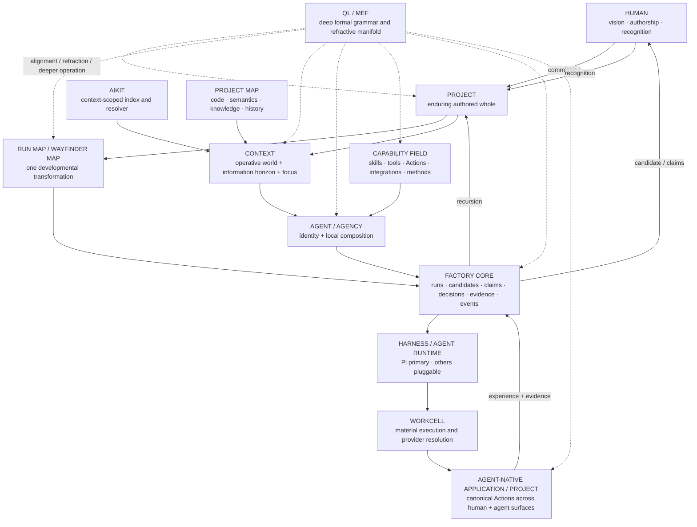
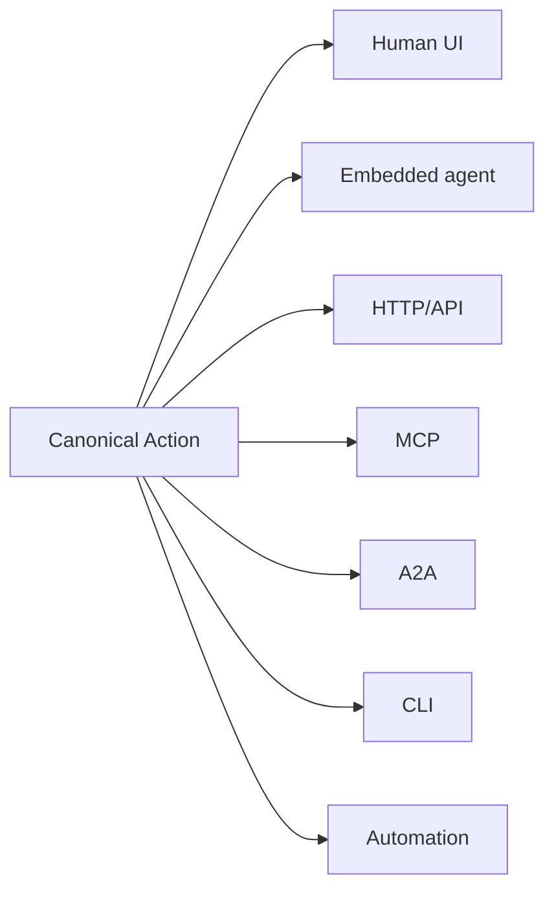
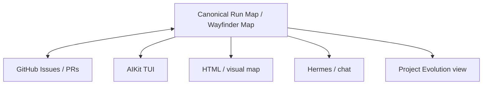
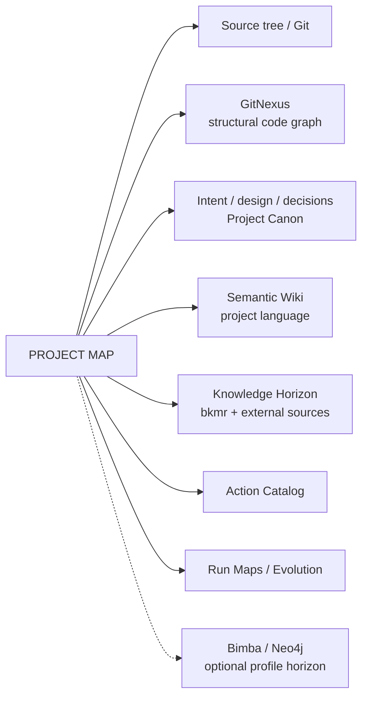
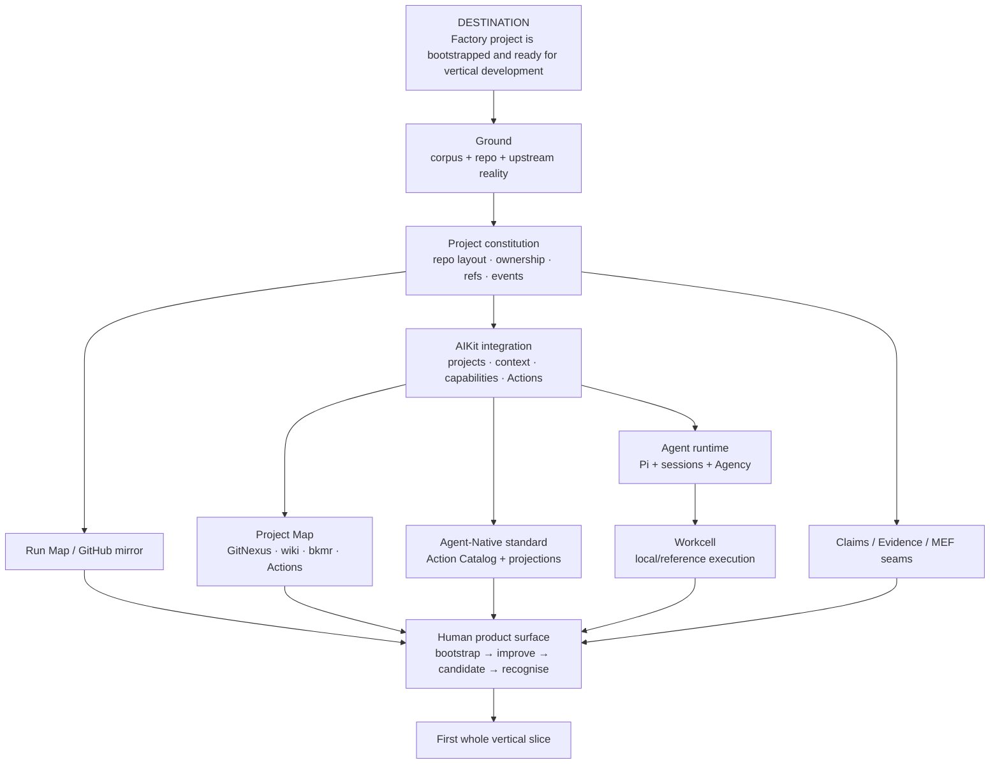
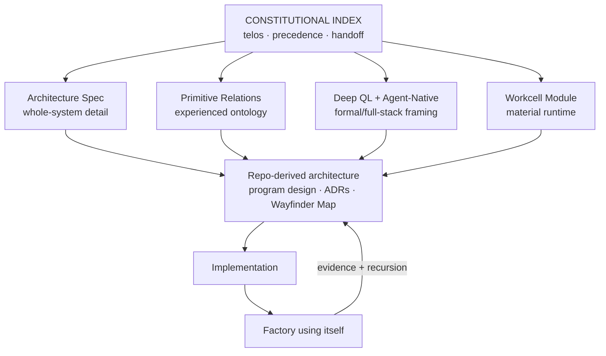

# QL Software Factory — Constitutional Index, Developmental Control Body & Repository Handoff

**Status:** Suite-level governing document  
**Date:** 2026-08-11  
**Role:** Front door, architectural control body, document-precedence map, developmental landscape, and handoff to the repo-based design/build phase  
**Read first:** This file  
**Companion specifications:**

1. `QL-SOFTWARE-FACTORY-ARCHITECTURE-SPEC.md`
2. `QL-SOFTWARE-FACTORY-PRIMITIVE-RELATIONS.md`
3. `QL-SOFTWARE-FACTORY-WORKCELL-MODULE-SPEC.md`
4. `QL-SOFTWARE-FACTORY-DEEP-QL-INTEGRATION-FOUNDATIONS.md`

---

## 0. What this document is

This document is more than an index.

It is the **central body around the current Software Factory design corpus**. It establishes the purpose from which the architecture should be read; the relation between the major systems; the intended human and agent experience; the status and precedence of the accompanying specifications; the developmental threads which now need to be brought into one repository; and the shape of the first Wayfinder / Run Map that should be produced by the agent which receives this package.

The suite has been developed progressively. That is a strength rather than a defect. Earlier documents contain real architectural determinations, source work, useful diagrams, and detailed subsystem specifications. Later work has also clarified the meaning of some earlier names and introduced concepts which did not yet exist when the first files were written. The correct repo-level design process is therefore **developmental reconciliation**, not literal concatenation.

The governing relation is:

```text
this index
    │
    ├── preserves the architecture already settled
    ├── states later refinements explicitly
    ├── distinguishes constitutional design from research claims
    ├── gives each subsystem a clear owner and boundary
    └── tells the next agent how to turn the corpus into a living project
```

A statement in an earlier file is not made false merely because its vocabulary was later refined. It remains part of the design history and may still contain the best detailed account of a subsystem. Where terminology or ontology has developed, **this index states the current relation and the later governing formulation**.

The repo should ultimately make these relations machine-readable enough that agents do not have to infer precedence from document dates alone.

---

# Part I — Telos and experiential constitution

## 1. The thing being built

The Software Factory is a software system for **developing software through sustained collaboration between human vision, agentic judgement, deterministic machinery, executable environments, evidence, and recursively retained project knowledge**.

Its purpose is not merely to automate coding.

The user-facing telos is twofold:

1. **keep the human in the visioning, creative, experiential, and authorial space;**
2. **give the human materially more free time away from babysitting the agentic coding process.**

The architecture therefore exists to move routine orientation, codebase reading, source discovery, decomposition, implementation, testing, environment management, evidence gathering, context reconstruction, and developmental bookkeeping into a system which agents and software can carry responsibly.

Human attention should rise primarily where human authorship actually matters:

- what is worth making;
- what kind of experience is intended;
- which genuine alternative is preferred when several coherent futures remain;
- whether an encountered result is recognisable as the thing that should become real;
- what discovered possibility deserves to alter the project's future direction.

The original experiential intent remains a governing statement for the whole project:

> **I want to use and develop a system which has integrity at the level of its archetypal form in code, both deterministic and non-deterministic applications thereof. I want to use and build software that has epistemic depth relative to the psychoid logic I'm developing, and code that tests and explores its speculative intents.**

That statement should not be relegated to philosophy around the implementation. It determines the product architecture.

The Factory should therefore make it ordinary for a human to move from:

```text
vision
  ↓
recognisable intended experience
  ↓
agent-led developmental work
  ↓
direct encounter with candidate realities
  ↓
recognition / redirection
  ↓
a project which now knows more than it did before
```

without requiring the human to supervise every tool call, code edit, shell session, test invocation, context switch, or intermediate decomposition.

---

## 2. The experience to preserve through every technical decision

The north-star interaction remains simple.

A user should be able to enter or create a project in one of three ways:

```text
GitHub repository ─┐
                   │
local project ─────┼──► PROJECT BOOTSTRAP
                   │
fresh project ─────┘
```

The Factory then develops the project into a **visioned and agent-operable authored whole**. If foundational intention, design, semantic orientation, action surfaces, or project context already exist, the system discovers and adopts them. If they do not exist, Project Bootstrap initiates the appropriate sessions and developmental work to establish them.

The ordinary later experience can then be as compressed as:

```text
$ aikit open <project>

> improve this
```

or:

```text
> improve the identity matrix interaction
```

The system should be able to orient itself from the project rather than treating every request as an isolated prompt.

It should know or be able to discover:

```text
what the project is
what it is trying to become
what its users experience
what its code currently does
what its design says
what previous runs decided
what Actions it exposes
what capabilities are available
what relevant knowledge can be retrieved
what environments can be materialised
what evidence is required
what remains genuinely unresolved
```

It forms or resumes a **Run Map / Wayfinder Map**, performs the work through agents and deterministic systems, develops one or more coherent Candidates when appropriate, and returns to the human at consequential points with experienceable realities rather than implementation debris.

The recognition surface should feel more like:

```text
Identity Matrix improvement

Candidate A      Candidate B      Candidate C
   Open             Open             Open

claims            claims            claims
evidence          evidence          evidence
trade-offs        trade-offs        trade-offs

           Compare · Discuss · Recognise
```

than:

```text
agent log 1
agent log 2
agent log 3
shell output
test output
42 implementation notes
```

The latter remain available as provenance. They are not the default human experience.

---

## 3. Human authority: commission and recognition

Human participation is concentrated around two high-energy apertures.

### Commission

The human supplies or ratifies the intended direction when the existing project canon and prompt do not already determine it.

A sufficiently determinate initiating request can itself constitute commission. The system should not ask the human to repeat decisions already present in the request, project canon, prior design, or recognised history.

### Recognition

The human encounters an applied result and determines whether it should become part of the project's durable reality when that determination is materially authorial.

Recognition is broader than code approval. It can distinguish:

```text
intended result achieved
failure revealed
better alternative discovered
unexpected possibility disclosed
intent itself should develop
```

The Factory should therefore preserve a crucial asymmetry:

> **agents carry judgement through the developmental body; humans retain authorship over consequential meaning and recognition.**

Routine technical choices, reversible local decisions, source inspection, ordinary tests, environment allocation, and implementation mechanics should not be escalated merely because a human exists.

This is central to the promise of giving the human time back.

---

# Part II — The system in one architectural picture

## 4. Constitutional whole



The architecture should be read from the outside in and from the inside out.

From the **human side**, it is a system for entering projects, articulating intent, encountering possible realities, making consequential decisions, and remaining free of routine supervision.

From the **agent side**, it is a rich operating environment in which project identity, context, actions, capabilities, claims, evidence, developmental history, source integrations, and execution worlds are already addressable.

From the **software side**, it is an ordinary robust system whose deterministic and non-deterministic components can operate without every operation depending upon QL machinery.

From the **QL side**, it is software already grown in structural sympathy with the invariant seed, increasingly able to expose, use, test, and deepen those relations as the executable QL kernel and MEF integration develop.

---

## 5. The constitutional centres

The system has several centres which should remain distinct rather than being collapsed into one universal service.

### Project

The enduring authored whole.

A Project may contain one repository, several repositories, external sources, semantic artifacts, actions, design canon, run history, project-specific knowledge sources, and runtime descriptions. Repository is a constituent, not the definition of Project.

### Run / Run Map

A Run is one intended developmental transformation. The Run Map — also the Wayfinder Map — is the canonical inspectable topology of that transformation.

### Context

The resolved world available to an actor now:

```text
Context
  = Operative World
  + Information Horizon
  + Focus
```

### Agent / Agency

Agent is enduring identity. Agency is a scoped/local determination of that identity through role, stance, capability composition, identity modulation, project, task, and context. Model and harness are execution choices rather than identity.

### Capability / Action

Capability is the broad power language of the system. Action is a first-class domain operation exposed by an application/project and shared across human and agent surfaces.

Capabilities are broader than Actions. Actions belong inside the actor-available power field and should be indexed/resolved alongside skills, tools, scripts, MCP services, methods, and other powers without being reduced to them.

### Artifact / Claim / Evidence

Artifacts carry durable work. Claims are the fundamental epistemic statements advanced by agents, humans, artifacts, tests, sources, and applications. Evidence supports, challenges, contextualises, or transforms Claims.

### Candidate

A coherent possible project reality: source state, developed form, materialised execution world, claims, evidence, and application surface considered together.

### Project Map

The navigational index over the project's distinct forms of intelligence: code structure, semantic language, canonical design, knowledge horizon, run/evolution history, external sources, and Actions.

### AIKit

The context-scoped control/index/resolution substrate through which projects, profiles, agents/agencies, capabilities, Actions, sources, sessions, hosts, harnesses, and learned usage become available to actors.

### Workcell

A modular runtime subsystem which materialises execution requirements using provider bindings. Its internal primitives remain module-local. It does not redefine the Factory ontology.

### QL / MEF

QL is the deep formal seed. MEF is the complete refractive manifold through which Claims and the other canonical objects can be more adequately disclosed. QL alignment deepens over time without making ordinary software execution hostage to unfinished formal experimentation.

---

# Part III — Document authority and suite topology

## 6. The documents are a developmental corpus

The suite should be treated as a **structured history of architectural determination**.

Each file contains claims. Some are constitutional and remain current. Some are detailed subsystem designs. Some terminology has been refined later. Some experimental pasted material supplied inputs which were useful precisely because they were provisional.

The repo should therefore recognise at least these statuses:

| Status | Meaning |
|---|---|
| **constitutional** | Governing architectural intent or invariant unless explicitly superseded. |
| **current design** | Current detailed design determination; may be refined by later program design. |
| **module specification** | Authoritative within its module boundary, subordinate to suite-level constitution. |
| **refined by** | Earlier statement remains useful but later document gives the governing interpretation. |
| **superseded** | Do not implement the earlier formulation as canonical. Preserve it as design history. |
| **experimental / research claim** | Candidate reasoning, exploration, or experiment material; evidence for design, not requirement by formatting alone. |
| **reference/source material** | External or upstream material used to ground integration decisions. |

The final repository may encode these through frontmatter, an index manifest, or another mechanism chosen during program design.

The conceptual rule is already fixed:

> **No agent should flatten the corpus into a bag of simultaneous requirements.**

---

## 7. Governing read order

### 7.1 This file — constitutional index and control body

Read first.

It supplies:

- product telos;
- current system picture;
- terminology hierarchy;
- document precedence;
- subsystem boundaries;
- current developmental landscape;
- repo handoff;
- Wayfinder / Run Map expectations.

### 7.2 `QL-SOFTWARE-FACTORY-ARCHITECTURE-SPEC.md`

**Primary role:** complete first constitutional/product architecture.

Still the richest source for:

- original experiential north star;
- six constitutional families;
- detailed developmental position contracts;
- human authority apertures;
- Run Map design;
- design-driven engineering discipline;
- actual AIKit state discovered at the time;
- Project Map / GitNexus / semantic wiki;
- Pi, Hermes, cmux/tmux;
- storage and telemetry;
- direct source-integration ledger;
- repository layout;
- meta-build and vertical slices.

**Important refinement:** its `ground : intent : design : development : application : recursion` language remains valuable as the first Factory developmental contract, but should not be treated as the invariant semantic names of QL positions. The later QL framing distinguishes invariant QL positions, MEF readings, and Factory-native developmental contracts.

The detailed contracts beneath those names remain highly valuable and should be reconciled into repo-level design rather than discarded.

### 7.3 `QL-SOFTWARE-FACTORY-PRIMITIVE-RELATIONS.md`

**Primary role:** experienced ontology and relations among the Factory's canonical objects.

Governing for:

- Project as enduring authored whole;
- Project Bootstrap;
- Context as Operative World + Information Horizon + Focus;
- Run, Session Space, Agent Session;
- Agent / Agency distinction;
- Capability/Profile/Scope relations;
- Artifact/Claim/Evidence architecture;
- Decision/HumanRequest/Gate;
- Candidate;
- Project Canon;
- Project Map;
- Ref/addressability;
- execution concepts;
- event/trace/projection;
- Procedures;
- frecency, fitness, trust, and learned ergonomics.

**Current extension:** `Action` was established later as a first-class product primitive. It should be added to the canonical primitive field during repo design. Actions inhabit the wider Capability field without exhausting it.

**QL refinement:** the file's early `QL Core / QL Form / QL Address` treatment should be read through the later deep-QL document. Factory terms do not define the invariant QL positions; QL/MEF alignment is deeper and more general.

### 7.4 `QL-SOFTWARE-FACTORY-WORKCELL-MODULE-SPEC.md`

**Primary role:** modular infrastructure/runtime specification.

Governing inside the Workcell boundary for:

- Workcell abstraction;
- providers;
- requirements/preferences;
- capability offers;
- bindings;
- binding graph;
- materialised execution world;
- State/Agency/Projects/Fabric Workcell planes;
- control/data plane;
- networking relationships;
- persistence semantics;
- candidate materialisation;
- desired/observed state;
- deployment profiles;
- reference Ubuntu worker laptop;
- Redis/live coordination seam.

**Boundary:** Workcell-local terms do not expand the canonical Factory primitive ontology merely because they are primitives inside this module.

The Workcell is the infrastructure component beneath semantic Context/materialisation; AIKit resolves semantic availability, the Workcell supplies the material bindings.

### 7.5 `QL-SOFTWARE-FACTORY-DEEP-QL-INTEGRATION-FOUNDATIONS.md`

**Primary role:** governing deep-form framing and Agent-Native standard.

Current governing source for:

- QL as bimba and software as pratibimba;
- Factory as meta-software, not the only pratibimba;
- invariant canon versus executable QL kernel/service;
- alignment rather than translation;
- MEF as complete manifold of disclosure;
- lensing of canonical primitives as first-class design intent;
- L0 Investigative role;
- L1 causal role;
- L2 logical role;
- L3/L3′ Processual/Chronological Run Map reading;
- L4′ knowledge-work language using **Prompts → Traces → Challenges → Patterns → Discovery → Insight**;
- L5/Vāk articulation role;
- Claims as the primary epistemic seam;
- Agent-Native as a Factory-wide standard;
- Action as first-class primitive;
- AIKit Action/resource indexing;
- QL compatibility across agents, Factory, applications, and runtime;
- QL kernel seam remaining pluggable.

This document refines earlier attempts to treat QL as a software taxonomy.

---

## 8. Research notes and experimental material

The pasted exploratory documents which informed the suite should be retained in the repository as research/design evidence if useful, but they are **not constitutional merely because an LLM wrote them in specification form**.

Their correct status is something like:

```text
research/
  workcell-origin-notes.md
  ql-index-language-exploration.md
  ql-agent-loop-experiment-notes.md
```

They can seed future Runs, QL research, module design, or experiments.

The governing epistemic principle is the same one used inside the Factory:

> **Every such statement is a Claim with provenance, not truth by formatting.**

This applies equally to generated design documents, source documentation, agent analyses, tests, human assertions, and the system's own previous conclusions.

---

# Part IV — Current terminology hierarchy and refinements

## 9. QL positions, Factory contracts, and lens language

The suite has passed through several useful but partially overlapping vocabularies. The repo design should preserve their functions while removing ambiguity.

### 9.1 Invariant QL form

At the deepest level:

```text
P0 P1 P2 P3 P4 P5
P0′ P1′ P2′ P3′ P4′ P5′
```

are invariant positions/faces prior to any one software appellation.

QL supplies distinctions, positions, complement/conjugation, relations, harmonic structure, and other operators developed in the formal canon.

### 9.2 MEF

MEF supplies the complete twelve-lens semantic/refraction manifold.

No currently useful software role elevates one lens into “the computational MEF”. All lenses remain first-class; role discovery is an active part of design.

Some roles are already clear enough to work with:

```text
L0    Investigative — questioning, search, research, prompt/self-orientation
L1    Causal — constitution and causal account
L2    Logical — four-corner logical disposition and relation
L3    Processual — becoming, transformation, process topology
L3′   Chronological — actual unfolding, sequence, developmental history
L4′   Scientific / Knowledge Work — Prompts, Traces, Challenges,
                                    Patterns, Discovery, Insight
L5    Vāk / articulation — expression, crystallisation, return to substrate
```

The remaining lens roles are not “deferred because unimportant”. The repo design phase should actively refract the canonical primitives through the whole MEF and allow the relations to emerge without forcing false symmetry.

### 9.3 Factory developmental language

The original:

```text
ground : intent : design : development : application : recursion
```

remains a useful Factory-native account of developmental responsibilities and artifact contracts.

It is **not the universal semantic definition of P0–P5**.

Repo-level design can preserve these terms as contracts, views, artifact families, or functional glosses where they remain useful while aligning the deeper QL/MEF semantics correctly.

### 9.4 L4′ naming refinement

Where earlier exploratory material says `Questions`, the current Factory-aligned L4′ term is:

```text
Prompts
```

thus:

```text
Prompts → Traces → Challenges → Patterns → Discovery → Insight
```

This is the governing vocabulary for L4′ in this suite.

---

## 10. Run Map and lens alignment

The Run Map / Wayfinder Map is a canonical Factory object. It should not be reduced to any lens.

Its most natural current MEF readings are:

```text
L3    processual reading
      what is becoming?
      what transforms what?
      where are branches, returns, nested processes, concrescences?

L3′   chronological reading
      what actually happened?
      in what sequence?
      what branch preceded another?
      how has the run/project unfolded through time?

L4′   knowledge-work reading
      what Prompts, Traces, Challenges, Patterns, Discoveries and Insights
      constitute the intelligence of the run?

L1    causal reading
      what causes/conditions constitute this change?
```

This alignment is additive: one canonical Run Map supports multiple meaningful readings.

The same principle governs MEF application generally:

> **a lens reveals a dimension of the object; it does not replace the object with the lens.**

---

# Part V — Canonical primitives after the full suite

## 11. Product primitives

The canonical experienced/product field entering repo design is:

```text
Project
Context
Run
Run Map / Wayfinder Map
Decision
Agent
Agency
Capability
Action
Artifact
Claim
Evidence
Candidate
Human Request
Project Map
Source Integration
```

`Action` is the principal addition after the Primitive Relations document.

### Action and Capability

The clean relation is:

```text
Capability
= any power which can be made available to an actor

Action
= a canonical domain operation exposed by an app/project
  and shareable across human and agent surfaces
```

An Action may become an actor-available capability through AIKit and may use other capabilities internally.

Examples:

```text
Capability
  product-design method
  GitNexus query
  browser
  shell
  code skill
  MCP integration
  model feature
  Action from the current application

Action
  createCandidate
  scheduleMeeting
  approveDecision
  addIdentitySystem
  sendInvoice
  updateClaim
```

The vocabulary should therefore remain one field with typed powers rather than two disconnected registries.

---

## 12. Resolution and execution concepts

These support the product primitives without normally becoming the concepts a human has to reason from:

```text
Profile
Scope
Capability Set
Action Set
Execution
Model
Harness
Agent Session
Session Space
Host
Environment
Checkout
Gate
Procedure
Projection
```

The exact program types are for the repo design phase. The conceptual relationships are established.

---

## 13. Substrate concepts

These make the system addressable, observable, reproducible, and cumulative:

```text
Ref
QL coordinate / refraction metadata
Event
Trace
Generation/materialised resolution
Store
Code Index
Usage Signal
Fitness Observation
```

Workcell-internal `Provider`, `Binding`, `Requirement`, and related terms remain inside the Workcell module unless the repo design discovers a genuine cross-module abstraction that warrants promotion.

---

# Part VI — Agent-Native as a full-stack standard

## 14. The standard

Agent-Native is a **Factory-wide architectural standard**, not an optional style reserved for future applications.

The governing principle is:

> **A meaningful domain operation should be defined canonically once and made available through the human and agent surfaces that require it.**

The current Builder.io / Steve Sewell Agent-Native work provides a strong external precedent: one typed Action can project to UI/client hooks, embedded agent tool use, HTTP, MCP, A2A, CLI, and automation while retaining common schema, caller lineage, approval, and audit semantics.

The Factory should adopt the principle without coupling itself to one framework implementation.



This is not merely convenient API generation. It changes what it means for an application to be inhabitable by agents.

An agent should increasingly be able to encounter an application through its **semantic/action field**, not by reverse-engineering a human UI from pixels or duplicating a second tool API by hand.

---

## 15. Action Catalog and AIKit

Every adopted project should move toward a discoverable **Action Catalog**.

For an Agent-Native project, this may already exist in framework-native form. AIKit should index/discover it rather than reimplement it.

For a legacy project, Project Bootstrap may recover candidate Actions from:

- existing APIs;
- service boundaries;
- CLI commands;
- UI operations;
- domain methods;
- MCP tools;
- application events;
- documented workflows.

Recovered Actions are Claims until verified against the code/application.

AIKit's role becomes:

```text
Project
  ├── capabilities
  ├── Action Catalog
  ├── agent resources
  ├── context sources
  ├── profiles
  └── learned usage/fitness
        │
        ▼
  context-scoped resolution
```

The same Action can then be selected by a human interface, an internal agent, an external agent, automation, or another application without separate implementations silently drifting apart.

---

## 16. Agent resources belong in the project surface

Agent-Native applications increasingly treat instructions, skills, memories, agents/sub-agents, MCP connections, scheduled work, and related agent resources as first-class project/application resources.

This overlaps directly with AIKit's intended scope.

The Factory should therefore design AIKit so that its capability/context model spans:

```text
development harness
      ↕
project context
      ↕
application agent resources
```

rather than ending at “tools available in this terminal”.

That is one of the major reasons to co-develop AIKit inside the Factory.

---

# Part VII — QL, MEF, and software

## 17. QL as bimba; software as pratibimba

The governing deep relation is:

```text
                         QL
                       BIMBA
             invariant generative form
                         │
                         │ articulation
                         ▼
                  SOFTWARE FIELD
                    PRATIBIMBA
                         │
       ┌─────────────────┼─────────────────┐
       ▼                 ▼                 ▼
     agents            apps             services
                         │
                         ▼
                      Factory
                  meta-software case:
               software developing software
```

All software is pratibimba relative to the QL kernel/canon. The Factory is simply the meta case: software whose object includes the building and development of other software.

This removes the temptation to make the Factory the privileged definition of QL.

The invariant QL core is set at its proper formal level. Our executable **QL kernel/service** can continue deepening in how adequately it operationalises and exposes that core.

Software experience, agent traces, applications, and experiments can reveal richer technological manifestations of QL without being allowed to redefine the canon merely by convenience.

---

## 18. Alignment rather than translation

The Factory does not need a cumbersome translation layer which says:

```text
Factory primitive X literally equals QL position Y
```

The system has already been designed in a QL-consonant form.

The correct operation is **alignment and refraction**.

A Project remains a Project.

A Claim remains a Claim.

An Action remains an Action.

MEF can reveal different dimensions of each without destroying object identity.

This creates a system which is:

```text
Factory-native in ordinary operation
QL-rooted in deep form
MEF-refractable in understanding
Agent-Native across interaction surfaces
```

The architecture should become progressively more explicit about those relations during repo design.

---

## 19. MEF over the canonical primitives is first-class design work

The next design phase should deliberately lens:

```text
Project
Context
Run
Run Map
Decision
Agent
Agency
Capability
Action
Artifact
Claim
Evidence
Candidate
Human Request
Project Map
Source Integration
```

through the complete MEF.

This is not a postponed optional research exercise.

It is an **initial architectural planning activity** because the relations are expected to expose natural places for search, causal analysis, process/history views, logic, articulation, perspective, and other functions throughout the system.

The requirement is not that every primitive receive twelve artificial labels.

The requirement is that the design work gives the full manifold a real opportunity to disclose useful relations before the program structure freezes around a shallower ontology.

A useful working principle is:

> **MEF supplies the lenses through which the wholeness of a thing can become increasingly visible.**

Claims are the clearest initial object because language already sits at the centre of agent reasoning, but the generalisation to all canonical primitives is part of the design intent from the beginning.

---

## 20. Claims and epistemic depth

Claim remains the epistemic seam between humans, agents, source material, deterministic systems, and MEF.

The system does not silently promote model text or documentation into “fact”. It retains:

```text
Claim
  statement
  provenance
  scope
  mode
  supporting/challenging Evidence
  relation to other Claims
  assessment
```

This language should exist **inside agent context**, not only in storage.

An agent should be able to receive:

```text
established claims
open claims
competing claims
intent claims
observed claims
claims requiring evidence
claims contradicted by application
```

and know that its own durable output will participate in the same epistemic architecture.

MEF then gives multiple ways of disclosing the Claim without pretending that one lens exhausts it.

This architecture directly serves the telos of software with epistemic depth.

---

# Part VIII — The Run Map / Wayfinder Map as developmental spine

## 21. One canonical map

**Run Map and Wayfinder Map are the same object.**

The Factory owns the canonical Run Map.

GitHub Issues are the default rich mirror/projection because they allow work to live close to hosted code, branches, PRs, discussions, and agent activity. The TUI, HTML views, Hermes, and other interfaces are additional projections.



The Run Map is not merely a plan created before development.

It continues through:

```text
orientation
intent/design determination
implementation
candidate fan-out
application
returns/rework
human decisions
recognition
recursion
```

and therefore becomes the canonical developmental record of that change.

---

## 22. Decision frontier

A Run Map can be immediately runnable or contain fog/frontier.

A frontier item can require:

```text
investigation
research
grilling
prototype
experiment
human authorship
external prerequisite
```

The map should make dependencies and unresolved consequential determinations explicit without converting every engineering choice into a human approval.

Agents should autonomously resolve what existing intent, evidence, source inspection, or reversible engineering judgement can resolve.

Human requests appear only where the unresolved determination is genuinely authorial or where recognition is required.

---

## 23. Run Maps become project history

Aggregated Run Maps form a derived **Project Evolution view**.

This is one of the strongest long-term UX surfaces of the Factory.

A human returning after six months should be able to see:

```text
where the project came from
what major branches were considered
which branches died
what decisions changed direction
what repeatedly reopened
which candidates were accepted
what discoveries altered intent
what the current developmental frontier is
```

without reconstructing the story from commit messages.

L3/L3′ are especially promising for this surface:

```text
L3    process topology
L3′   chronological unfolding
```

while L4′ reveals the knowledge-work contents of those runs.

---

# Part IX — Project Bootstrap: every project enters as an authored whole

## 24. Three entrances

Project adoption should support:

```text
GitHub repository
local directory / copied project
fresh project
```

All converge on **Project Bootstrap**.

Bootstrap is itself developmental work, not an installer wizard bolted beside the Factory.

Its job is to establish enough project identity, intention, design, context, action surface, project map, and runtime knowledge that agents can subsequently act from a coherent project rather than from a bare directory.

---

## 25. Bootstrap behaviour

For an existing mature repository, Bootstrap should discover rather than interrogate unnecessarily.

It should inspect:

- code and Git history;
- README/design/ADR/product docs;
- existing issue/PR history;
- existing actions/APIs/CLIs/UI operations;
- build/test/runtime commands;
- current AI/agent resources;
- external sources and documentation;
- existing semantic/project maps;
- deploy/runtime configuration;
- source integrations.

It then produces Claims about what exists and asks for human authorship only where the project cannot be coherently recovered from evidence.

For a fresh project, Bootstrap naturally contains more visioning and product/design work.

The target state is not “Factory metadata installed”.

It is:

> **a visioned project which both humans and agents can enter meaningfully.**

---

## 26. Bootstrap should produce the first Wayfinder Map

The agent which receives this specification suite and the eventual repository should create the first root **Wayfinder / Run Map** as part of Project Bootstrap.

It should not simply turn every heading in every document into an issue.

Its first task is to determine:

```text
current project ground
constitutional intent
existing implementation state
source integrations actually present
open architectural determinations
module dependencies
which earlier design claims are superseded
which claims require repo inspection
what can be built as vertical slices
what requires human authorship
what can proceed autonomously
```

The result should become the canonical developmental control map for building the Factory itself.

A proposed root shape appears later in this document.


# Part X — Context, Project Map, and the information horizon

## 27. Context is what the actor can meaningfully inhabit now

Context is the nexus between the Project and an act.

```text
Context
  = Operative World
  + Information Horizon
  + Focus
```

### Operative World

What can act here and what can it use?

```text
Project / profile
Agent / Agency
Capabilities
Actions
models
harnesses
sessions
permissions
hosts/environments
```

### Information Horizon

What can be known or retrieved from here?

```text
repository
Project Map
semantic wiki
GitNexus
bkmr-indexed sources
websites
documentation
papers
other projects
prior runs
Bimba / Neo4j where profile-enabled
```

### Focus

What matters to the present act?

```text
Run
Run Map node / frontier
MEF reading when active
Decision
Claim
Artifact target
current Action / task
```

This prevents “context” from becoming a synonym either for a prompt dump or for a runtime configuration object.

The actor should experience a coherent world whose larger information horizon can be progressively queried rather than preloaded wholesale.

---

## 28. Project Map

The Project Map is the navigational index into the authored whole.

It joins distinct sources of project intelligence without pretending to replace them with one universal graph database.



The division of labour matters.

### Source / Git

What code and authored files actually exist?

### GitNexus

How is code structurally connected? What symbols, dependencies, call paths, impact relationships, and change surfaces exist?

GitNexus should be incorporated as the actual structural code-intelligence engine, not rewritten as a weaker internal approximation.

### Semantic Wiki

What do project concepts mean? How do domain terms, design ideas, modules, experiences, decisions, and project language relate?

The wiki should remain Markdown/Obsidian-compatible and project-local.

### Knowledge Horizon / bkmr

What relevant source material can be indexed and retrieved beyond the codebase itself?

The bkmr shim should allow AIKit/project context to index not merely “files” but:

- websites;
- external documentation;
- papers;
- related projects;
- notes;
- agent memories where appropriate;
- other context sources.

### Action Catalog

What can the project/application do in a canonical domain sense, and through which human/agent surfaces is each Action exposed?

### Run history / Evolution

How did the project become what it is?

### Bimba / Neo4j

An optional transcendent semantic horizon, especially for the Epi-Logos profile. It is not a generic project dependency or operational database.

---

## 29. Code remains its own portal

The project should be agent-readable without inventing a second synthetic representation of every module.

The codebase should carry small, high-value orientation surfaces:

```rust
//! # session_runtime
//!
//! Owns creation, suspension and recovery of Nara sessions.
//!
//! Design: docs/design/session-runtime.md
//! Semantic: wiki/session-runtime.md
```

The natural agent exploration path remains:

```text
tree
  ↓
grep/search
  ↓
open file
  ↓
follow imports/references
  ↓
GitNexus context / impact / trace
  ↓
design/wiki/run history where useful
```

This keeps code as code while making entry progressively easier.

---

# Part XI — AIKit: co-developed operating substrate

## 30. AIKit's place

AIKit is not a magical finished dependency.

It is a real existing Rust project with substantial intended architecture and some implemented functionality, and it is also a **co-development workstream of the Factory**.

The suite should therefore distinguish for AIKit exactly as it does elsewhere:

```text
intended
observed
verified
```

README claims and design documents are source Claims. Repo inspection and acceptance behaviour determine what is actually present.

The Factory should lean confidently into **AIKit's intended role** while using the Factory itself to improve AIKit toward that role.

The current TUI, for example, is an implementation datum rather than a product boundary. The TUI should be redesigned around the richer Project / Run / Action / Context experience as the architecture crystallises.

---

## 31. AIKit's intended full role

AIKit should become the universal context-scoped resolver/index for:

```text
Projects
Profiles
Scopes
Session Spaces
Agents
Agencies
Capabilities
Capability Sets
Actions
Action Sets
agent resources
context sources
models
harnesses
hosts/workcells
Procedures
inbox items
asset memory / learned ergonomics
```

Its defining question is:

> **what world of powers, resources, knowledge, identities, and execution possibilities exists for this actor here and now?**

It should expose that answer both to humans and headless agents.

---

## 32. AIKit and Actions

AIKit should not become the owner of application business logic.

Where a project already defines canonical Actions, AIKit indexes and resolves them.

It may provide adapters for:

```text
Agent-Native framework Actions
OpenAPI operations
gRPC/domain methods
CLI commands
MCP tools
custom project action manifests
legacy recovered Actions
```

but the source Action remains owned by the project/application.

This extends the existing principle that AIKit should index and project real capabilities rather than reimplementing them.

---

## 33. AIKit and learned ease

The operating environment should learn from use for both humans and agents.

Signals remain distinct:

```text
frecency
    what is repeatedly/recently used?

contextual relevance
    where does it tend to be useful?

fitness
    how well did it perform for this kind of demand?

preference
    what has the human/project explicitly chosen?

trust
    what is permitted?

availability
    what is actually reachable now?
```

These signals can attach to:

```text
Capabilities
Actions
Agents / Agencies
Models
Harnesses
Projects
Context sources
Commands
Run patterns
Environments
```

The result should feel analogous to a shell that learns the routes its user takes, extended to a mixed human/agent operating environment.

An agent should increasingly be able to resolve a complex action with the same fluency that a human gains from history-aware shell navigation.

---

# Part XII — Agents, Agencies, harnesses, and personal orchestration

## 34. Agent identity survives execution composition

The canonical relationship is:

```text
Agent
  enduring identity
      │
      ▼
Agency
  local/scoped determination
      │
      ▼
Agent Session / Execution
  concrete act using model + harness + capabilities + context
```

This matters for generic software agents and for the eventual Epi-Logos refactor.

A canonical agent can change models, capability sets, tools, roles, and local stances without ceasing to be that Agent.

An Agency can represent a more dynamic local identity such as:

```text
architecture-design agency
investigative agency
conjugate/critical agency
UI-experience agency
source-integration agency
```

with optional richer identity/profile detail.

---

## 35. Epi-Logos profile

The Factory remains usable without the Epi-Logos ontology.

The Epi-Logos profile activates the canonical six-agent constellation and deeper project-specific semantics:

```text
#0 Anuttara
#1 Paramasiva
#2 Parāśakti
#3 Mahāmāyā
#4 Nara
#5 Epii
```

These are canonical identities in the Epi-Logos system, not universal definitions of Factory stages.

The Epi-Logos orchestrator remains the agentic meta reader/composer of the six.

Over time existing Epi-Logos subsystems can be refactored into the general Agent → Agency → Execution form without generic projects depending on Epi-Logos.

Bimba access is profile-gated rather than universal.

---

## 36. Harness architecture

The Factory should remain harness-agnostic.

Pi is the preferred initial harness because it is minimal, extensible, supports interactive/print/JSON/RPC/SDK modes, and can be deeply integrated while remaining understandable.

The conceptual interface is still:

```text
HarnessProvider
  capabilities
  start
  resume
  stream
  stop
```

Pi-specific extensions can expose AIKit/Factory functions, stream tool/lifecycle events, and later host deeper QL loop experiments.

The Factory does not depend on those experiments succeeding.

It simply preserves the seam so an alternate QL-native loop can plug into the same Project, Context, Capability, Run, Claim, Evidence, and Workcell architecture.

---

## 37. Session Space and Agent Session

These remain different.

```text
Session Space
    the human/terminal workspace:
    cmux / tmux / panes / persistent remote workspace

Agent Session
    a resumable harness/model conversational execution context

Run
    the durable developmental transformation which can outlive both
```

A Run may span machines, session spaces, Agent Sessions, models, and days.

That is essential to the promise that the human can leave the system working without becoming responsible for preserving the agent's fragile conversational state manually.

---

## 38. Hermes, cmux, and tmux

Hermes is a strong personal orchestrator/front-door candidate for persistent interaction, remote messaging, schedules, profiles, and agent access. It should remain an interface/orchestration surface rather than the definition of the Factory harness.

cmux is the preferred rich local control surface, especially for the main workstation, with remote workspace/SSH support useful for the worker-laptop topology.

tmux remains a powerful persistent remote-session substrate and is already part of AIKit's intended portability story.

The user should be able to move between:

```text
cmux
terminal
Hermes/chat
GitHub
AIKit TUI
application preview
```

without those surfaces creating separate truths about the project or Run.

---

# Part XIII — Workcell: modular material execution

## 39. Workcell boundary

The Workcell is intentionally modular.

It exists to answer:

> **given this semantic execution demand, what executable world can be materialised here?**

The higher layers request affordances.

The Workcell resolves providers and bindings.

```text
Factory / AIKit
  semantic Context + Execution Demand
              │
              ▼
          Workcell
  provider selection + binding + lifecycle
              │
              ▼
     material execution world
```

Workcell internals can contain:

```text
Provider
Requirement / Preference
Capability Offer
Binding
Binding Graph
execution/materialisation descriptions
State / Agency / Projects / Fabric planes
```

Those remain module-local unless future design finds a genuine reason to promote one across the whole system.

---

## 40. Reference personal topology

The preferred personal reference deployment remains:

```text
MAIN WORKSTATION
  cmux
  AIKit client / UI
  Obsidian
  human interaction
       │
       │ SSH / Factory control
       ▼
UBUNTU WORKER LAPTOP — REFERENCE WORKCELL
  Workcell runtime
  Docker
  Arrakis where useful
  Git/worktrees
  persistent tmux
  Pi
  Hermes
  project runtimes
  search/context services
  local operational SQLite/event ledger
  optional project/shared state
       │
       ├── GitHub
       ├── external services
       └── optional Bimba/Neo4j
```

The laptop is the reference specimen because it exercises nearly the whole semantic architecture at one-node physical scale.

It is not the ontology.

The same Workcell contract should support local Docker, proper servers, cloud VMs, external sandbox providers, or distributed environments by changing bindings/providers rather than changing Project meaning.

---

## 41. Candidate materialisation

Candidate is the product concept.

Environment is its material support.

A best-of-N run can therefore request several candidate worlds without exposing infrastructure mechanics to the human or the reasoning agent:

```text
Candidate A
  source/revision A
  materialised world A
  claims/evidence

Candidate B
  source/revision B
  materialised world B
  claims/evidence

Candidate C
  source/revision C
  materialised world C
  claims/evidence
```

The Workcell determines whether that means Arrakis MicroVMs, Docker/Compose worlds, worktrees, remote VMs, or some future provider.

The human sees the lineup.

---

# Part XIV — Storage, evidence, and observability

## 42. Different stores own different truths

The architecture deliberately avoids one universal database.

### Git / authored files

Own authored durable project truth:

```text
code
design
intent
ADRs
wiki
configuration
tests
canonical project artifacts
```

### SQLite

Owns local/host operational truth and queryable mirrors:

```text
runs
sessions
inbox
events index
agent sessions
environment leases
asset observations
procedures
```

One physical AIKit/Factory operational SQLite per host is the default. Do not place one shared SQLite database on a network filesystem to coordinate machines.

### Raw event / artifact ledger

Preserves reconstructable execution evidence, including JSONL/tool/event traces.

### GitNexus

Owns derived structural code indexing.

### Semantic Wiki

Owns transparent authored project semantics in Markdown.

### bkmr / knowledge index

Indexes the retrievable information horizon without becoming the source of truth for the material indexed.

### Neo4j / Bimba

Optional transcendent interconnected semantic graph, primarily activated by Epi-Logos and other projects which explicitly want that horizon.

---

## 43. Event, Trace, Evidence

These remain distinct.

```text
Event
    one occurrence

Trace
    organised temporal history of events

Evidence
    material selected because it bears on a Claim
```

The system can therefore preserve exhaustive-ish operational traces while presenting compact claim-oriented evidence to humans and agents.

P5/recursion interprets telemetry; it does not own raw collection.

---

## 44. Claim-oriented application review

A review surface should default to:

```text
Claim
  ↓
Evidence
  ↓
open Candidate / source / trace if desired
```

Example:

```text
✓ The intended interaction is present
  evidence: candidate B + flow test

✓ Existing session recovery still works
  evidence: deterministic acceptance suite

? Provider-specific model switching remains unverified
  evidence: one provider has not been exercised
```

This is an epistemically clearer surface than a generic “green build”.

---

# Part XV — Source fidelity and upstream integration

## 45. Real systems are reused as real systems

The Factory must resist a common agent failure mode: naming an integration and then quietly implementing a weaker imitation of it.

Every significant source integration should record:

```text
upstream identity
pinned revision
integration mode
actual API / CLI / protocol / source paths used
local augmentation
evidence that the seam is exercised
upgrade path
```

Supported modes include:

```text
direct dependency
CLI adapter
protocol adapter
capability source
vendored fork
source mount
reference implementation
```

The architecture spec contains the initial source-integration ledger for:

- AIKit;
- SSSF;
- Pi;
- Matt Pocock skills including Wayfinder/Grilling/Prototype;
- HumanLayer/Dexter design discipline;
- GitNexus;
- cmux;
- Hermes;
- Obsidian-compatible project wiki;
- Neo4j/Bimba;
- sandbox providers.

Repo Ground should verify every relevant source and revision rather than assuming the design-time inspection is still current.

---

## 46. SSSF as runtime reference, not theology

SSSF contributes particularly strong implementation patterns:

```text
deterministic sequencing around agent judgement
typed envelopes
same-session correction
gates that emit evidence
real command execution
bounded writes
thin workflows
raw + SQLite observability
agent/process session tracking
```

These should be lifted/adapted from the actual upstream implementation where appropriate.

The Factory's QL, Run Map, Agent/Agency, model resolution, and human-authority architecture remain its own.

---

# Part XVI — The developmental landscape

## 47. The Factory is now a set of interlocking development threads

The repo should not be approached as one giant implementation ticket.

The following threads are distinct enough to own, yet coupled enough to be coordinated through one root Wayfinder Map.

---

## 48. Thread A — Factory Core

**Owns:**

```text
Project
Run
Run Map
Decision
Candidate
Artifact
Claim
Evidence
Human Request
Event/Trace
recognition/recursion
```

**Current design maturity:** high at product/ontology level.

**Next repo work:** settle exact module boundaries, state machines, identity/ref rules, event contracts, canonical storage, and minimal vertical execution path.

**Key dependency:** must remain ordinary and robust even when deep QL services are absent.

---

## 49. Thread B — AIKit co-development

**Owns:** context-scoped resolution and indexing.

**Primary development fronts:**

```text
Project identity/adoption
Action indexing
Capability/Action sets
agent resources
bkmr context-source shim
Project/profile/session/task context resolution
Agents/Agencies
model/harness selection
Workcell awareness
asset memory
TUI/CLI/headless surfaces
```

**Important posture:** inspect actual implementation before assuming intended features work.

---

## 50. Thread C — Run Map / Wayfinder / GitHub mirror

**Owns:** the canonical developmental topology of a Run.

**Development fronts:**

```text
canonical Run Map data/relations
frontier and dependencies
Decision nodes
Candidate branches
returns/reopenings
GitHub issue/PR projection
HTML/TUI rendering
Project Evolution aggregation
L3/L3′ views
L4′ knowledge-work view
```

This is likely one of the earliest highly visible product slices because it simultaneously improves human orientation, agent coordination, GitHub-native development, and project history.

---

## 51. Thread D — Project Map and knowledge horizon

**Owns:** project intelligibility.

**Development fronts:**

```text
GitNexus adapter
source tree/code-as-map
semantic wiki
bkmr project-source shim
Action Catalog
Run/Evolution lens
intent/design canon indexing
optional Bimba horizon
```

The Project Map is an index joining these surfaces, not a database attempting to replace them.

---

## 52. Thread E — Agent-Native standard

**Owns:** shared domain-operation architecture across human and agent surfaces.

**Development fronts:**

```text
Action identity
Action schema/manifest
Action Catalog
surface exposure policy
UI/agent/API/MCP/A2A/CLI projection
caller lineage
approval
Action events/audit
legacy project recovery
AIKit Action indexing
agent-resource discovery
```

This is a full-stack standard for the Factory and its produced software, not a future optional add-on.

---

## 53. Thread F — Workcell runtime

**Owns:** material execution.

**Development fronts:**

```text
Workcell daemon/core
provider interfaces
Docker provider
Arrakis provider where useful
workspace provider
project runtime provider
bindings
control/data-plane separation
candidate materialisation
capability discovery
reference laptop deployment
```

The Workcell module can progress largely independently once the Factory/AIKit demand contract is fixed.

---

## 54. Thread G — Claims, MEF, and epistemic plumbing

**Owns:** deeper epistemic/refraction surfaces.

**Development fronts:**

```text
Claim representation
Evidence relations
agent-facing Claim language
full MEF first-pass over canonical primitives
compact lens/refraction objects
synthesis of multiple lens readings
L0 investigative orientation
L1 causal reading
L2 logical reading
L3/L3′ Run Map views
L4′ Prompts→Insight reading
L5 articulation reading
```

This should begin during design, not after the rest of the architecture has fossilised.

---

## 55. Thread H — QL kernel/service seam

**Owns:** executable access to QL formal relations without making Factory Core depend on experimental semantics.

**Current requirement:** stable seam, object references, refraction requests, trace/event compatibility, and enough openness for future deeper agent-loop operation.

The specific QL-native agent-loop experiments remain outside this programme and can plug into Pi or another harness independently.

The Factory is designed so those experiments do not require architectural surgery.

---

## 56. Thread I — Agent / Agency / harness surfaces

**Owns:** how agent identity becomes actual work.

**Development fronts:**

```text
Agent identity
Agency profiles
sixfold identity extension seam
Pi integration
agent sessions
conjugate/fresh-context capability where needed
Hermes front door
cmux/tmux persistence
model/harness demand resolution
agent event streaming
```

Generic agents and Epi-Logos canonical agents share the same architecture.

---

## 57. Thread J — Telemetry, fitness, and learned ergonomics

**Owns:** learning from actual use without collapsing preference, trust, fitness, and frecency.

**Development fronts:**

```text
portable event envelope
model observations
Capability observations
Action observations
Agency observations
human intervention metrics
run outcome assessment
context retrieval observations
frecency and suggestions
P5 integration
```

The product goal is increasingly fluent operation for both human and artificial actors.

---

## 58. Thread K — Project Bootstrap and adoption

**Owns:** turning arbitrary source material into a Factory-native authored project.

This thread crosses nearly every other subsystem and is therefore an excellent integrative product slice.

It should prove:

```text
repository/local/new project ingestion
source/code inspection
intent/design recovery
Action recovery
Project Map creation
AIKit project/profile creation
context-source registration
runtime discovery
first Wayfinder Map creation
human commission only where necessary
```

---

## 59. Thread L — Source integration and reproducibility

**Owns:** keeping the Factory grounded in real upstream code and reproducible seams.

The first repo Ground pass should pin/verify integrations, licences, source paths, APIs, and acceptance tests.

This thread protects all others from agent-generated reimplementation drift.

---

# Part XVII — What is present now, what must be designed now, and what can deepen later

## 60. Present constitutional foundation

The following are sufficiently established to be treated as design foundations:

```text
human vision/recognition as product centre
Project > repository
Project Bootstrap
Context = Operative World + Information Horizon + Focus
Run independent of sessions/hosts
Run Map / Wayfinder canonical in Factory
GitHub mirror by default
Agent identity separate from Agency and execution
Capability unified across tools/skills/integrations
Action first-class within the broader capability field
Agent-Native full-stack standard
Artifact / Claim / Evidence architecture
Candidate as coherent possible reality
Project Map as joined navigation surface
AIKit as co-developed context resolver/index
GitNexus structural code intelligence
Markdown/Obsidian semantic wiki
bkmr information-horizon role
Pi-first but harness-agnostic runtime
Workcell modular material execution
second laptop as reference Workcell
per-host operational state
source-fidelity integration
MEF as whole refractive manifold
all software as pratibimba relative to QL bimba
Factory as meta-software case
```

---

## 61. Must be designed in the repo before broad implementation

The first repo design programme should resolve:

```text
exact package/module boundaries
canonical IDs/Refs and ownership
Run Map state/graph representation
GitHub mirror semantics
Action standard and Catalog
AIKit extension seams
Project Bootstrap contract
Claim/Evidence storage and agent-facing representation
MEF/refraction representation
Project Map joins
bkmr adapter
Workcell demand/binding protocol
storage/event schemas
source-integration lock/verification format
security/authority boundaries
first vertical slices and acceptance surfaces
```

These are program-design questions, not reasons to reopen the product architecture from scratch.

---

## 62. Must have sockets now, even if implementation deepens later

The architecture should explicitly leave room for:

```text
full MEF roles as they emerge
richer QL kernel/service
QL-aware orchestration
native/conjugate agent loops
nested QL agent work
harmonic computational operators
cross-application QL semantic interoperability
Bimba-expanded semantic horizons
additional Workcell providers
additional harnesses
richer Agent identity forms
```

The correct move is neither to implement every possibility now nor to postpone thinking about them until incompatible foundations have hardened.

We design the seams now.

---

## 63. Research remains allowed to surprise the architecture

The system explicitly exists to test speculative intent.

Therefore some deep QL/software relationships should be treated as active research Claims whose computational meaning may emerge from real traces and use.

A later discovery can legitimately:

```text
add a QL service operator
add a MEF lens role
refine a mapping
change an orchestration heuristic
introduce a new derived view
```

without requiring the Factory's ordinary ontology to be replaced.

The architecture is designed for this kind of deepening.


# Part XVIII — Repository handoff and the first Wayfinder Map

## 64. The next agent's mandate

The agent which first receives this document suite inside the repository should **not treat itself as a code-generation worker receiving a finished ticket queue**.

Its mandate is to perform the first real Project Bootstrap of the Software Factory itself.

That means:

```text
read the constitutional corpus
        ↓
inspect the actual repositories/code/sources
        ↓
separate intended / observed / verified
        ↓
construct Project Map and source/action/capability inventories
        ↓
reconcile terminology and document precedence
        ↓
build the root Wayfinder / Run Map
        ↓
identify the first executable vertical slices
        ↓
ask the human only where authorship is genuinely unresolved
```

This is deliberately different from converting each section of these documents into a backlog item.

The next agent should reason from **destination and dependency**, not heading count.

---

## 65. Repo Ground pass

The first agent should establish a grounded project state which includes at least:

### Corpus inventory

- every design/specification file;
- status and governing relation of each file;
- research/experimental notes;
- source references;
- explicit supersession/refinement claims from this index.

### Repository inventory

- current Software Factory repo state, if already created;
- AIKit repo and actual implementation status;
- any existing Epi-Logos code which is intentionally in scope;
- current branch/worktree structure;
- current CI/tests;
- current GitHub issues/PRs;
- current automation or agent infrastructure.

### Upstream inventory

Verify the actual current/pinned sources intended for:

```text
AIKit
SSSF
Pi
GitNexus
Matt Pocock skills
HumanLayer/Dexter materials
cmux
Hermes
bkmr
Agent-Native precedent / adapters where used
Neo4j/Bimba
Workcell providers
```

### Project capability inventory

Record what powers are actually available to the design/build agents now.

### Action inventory

For the Factory/AIKit code already present, identify existing operations which could become canonical Actions, but retain them as recovery Claims until source/runtime verification establishes them.

### Knowledge-source inventory

Register relevant design docs, upstream docs, websites, research sources, related repositories, and project materials into the initial Information Horizon.

The Ground pass should produce an **evidence-backed discrepancy report** between design and current implementation.

---

## 66. The root Wayfinder Map

The first canonical Wayfinder Map should have one destination:

> **Turn the current design corpus and real code state into a coherent, buildable Software Factory project whose first complete vertical slice proves the constitutional experience without closing off the deeper QL and Agent-Native architecture.**

Its shape should be developed from actual repo inspection, but it should at minimum represent the following fronts.



This is a **starting developmental topology**, not a mandatory implementation ordering.

The agent should refine it from evidence and use actual dependency edges, Decision nodes, and vertical-slice boundaries.

---

## 67. Map the active fronts, not every future possibility

The root map should distinguish:

```text
ACTIVE NOW
    necessary to make the first system real

OPEN SOCKET
    interface/seam must be preserved now;
    implementation can deepen later

RESEARCH CLAIM
    potentially important relation;
    does not block current system

EXTERNAL DEPENDENCY
    upstream/source/hardware/service prerequisite

HUMAN AUTHORSHIP
    consequential choice not determined by current intent/evidence
```

This classification is especially important around deep QL work.

For example:

```text
MEF over canonical primitives
    ACTIVE NOW — design/refraction work

QL service interface
    ACTIVE NOW — seam definition

specific QL-native Pi loop
    RESEARCH / PLUGGABLE — does not block Factory

harmonic runtime operator whose computational semantics are not yet established
    RESEARCH CLAIM / OPEN SOCKET
```

The result is a map which preserves ambition without turning the whole research horizon into a prerequisite chain.

---

## 68. First product slices should be vertical and experienceable

The architecture spec already proposed useful meta-build slices. The repo agent should revisit them from the newer architecture rather than blindly preserving their old labels.

A strong sequence is likely to include variants of:

### Slice 1 — Adopt and enter one real project

Prove:

```text
repository/local project
  → Project Bootstrap
  → AIKit project/profile
  → Project Map skeleton
  → Action/Capability/context inventory
  → persistent Session Space
```

### Slice 2 — One canonical Run Map mirrored to GitHub

Prove:

```text
human prompt
  → Run
  → Wayfinder Map
  → GitHub issue projection
  → agent can read/update canonical map
```

### Slice 3 — One agent carries a change through a real Candidate

Prove:

```text
Context resolution
  → Agency + capabilities + Actions
  → Pi session
  → source change
  → tests
  → Candidate
```

### Slice 4 — Human opens and recognises the Candidate

Prove:

```text
Candidate
  → material execution world
  → direct human experience
  → claim-oriented evidence
  → recognition / return
```

### Slice 5 — Recursion genuinely changes future project entry

Prove:

```text
recognised result
  → code/canon/wiki/run history updates
  → GitNexus/context refresh
  → next project Context sees the retained difference
```

### Slice 6 — Agent-Native Action surface

Prove one domain Action can be invoked coherently from more than one surface, ideally human UI + agent + one external protocol/CLI projection.

### Slice 7 — Reference Workcell

Move the same semantic Run/Candidate flow onto the Ubuntu worker without changing the Project/Run/Action ontology.

The exact order can differ when repo reality shows better dependency structure.

The invariant is that each slice should produce a **touchable developmental capability**, not only a horizontal backend layer.

---

## 69. GitHub mirror strategy

The first repo design should settle a deliberately simple GitHub projection.

A useful default model is:

```text
Root Wayfinder Map
    ↔ parent GitHub issue / project view

Decision / frontier nodes
    ↔ child issues where independent discussion/work is useful

vertical slices
    ↔ implementation issues / branches / PRs

Candidate
    ↔ branch/PR/runtime reference

recognition
    ↔ explicit state/event, not inferred solely from merge
```

GitHub should be useful enough that substantial coding can happen against hosted branches/issues/PRs without requiring the human to manipulate local files continuously.

But GitHub remains a projection.

Local/offline runs and alternate future trackers must not become semantically second-class.

---

## 70. The agent should preserve the human's altitude

When the first repo agent encounters a decision, it should ask:

```text
Can existing intent determine this?
Can project evidence determine this?
Can source inspection determine this?
Is this reversible local engineering judgement?
Can a prototype/candidate answer it better than a question?
```

Only after those routes fail should it ask the human.

And when it asks, the question should be posed at the **highest meaningful experiential/architectural level**, not in incidental implementation vocabulary.

Prefer:

> Should the candidate comparison experience emphasise simultaneous side-by-side running applications, or quick sequential switching on smaller screens?

rather than:

> Should we use three React panels or tabs?

The system exists specifically so the human can stay in the former register.

---

# Part XIX — Human UX constitution

## 71. Human experience is not a presentation layer

UX is constitutional because it determines what the architecture must make legible and what complexity the system itself must absorb.

The human-facing system should privilege:

```text
projects
intent
prompts
runs
frontiers
meaningful decisions
candidates
claims
evidence
application experience
recognition
project evolution
```

and suppress by default:

```text
provider IDs
container names
model plumbing
raw event volumes
port forwarding
workspace paths
agent continuation mechanics
intermediate tool selections
routine source-control operations
```

The latter remain inspectable when diagnosis or expertise calls for them.

---

## 72. Primary human journeys

The repo design should explicitly prototype these journeys before broad backend implementation.

### Journey A — Start from an existing GitHub repo

```text
Select/import repo
  → Bootstrap shows what it recovered
  → only meaningful gaps require authorship
  → project opens visioned and navigable
```

### Journey B — Start a fresh project

```text
Create project
  → visioning / product exploration
  → experiential intent becomes durable
  → design and Action surfaces develop
  → first executable candidate
```

### Journey C — Return after months away

```text
Open project
  → current state
  → Project Evolution view
  → active frontier
  → key decisions and rationale
  → resume without archaeological work
```

### Journey D — “Improve this”

```text
Prompt
  → system orients itself
  → map appears
  → agents work
  → human is interrupted only if authorship is necessary
  → candidate lineup
  → recognition
```

### Journey E — Work remotely / asynchronously

```text
leave workstation
  → persistent Run continues on worker
  → meaningful request can arrive via Hermes/inbox
  → user answers from appropriate surface
  → later returns to same canonical Run state
```

### Journey F — Inspect why the system believes something

```text
Claim
  → evidence
  → source / test / trace / candidate
  → lens readings where useful
```

These journeys should be the main test of program design quality.

---

## 73. Candidate lineup as a core interaction

Best-of-N is not merely an internal agent strategy.

It naturally creates a product surface:

```text
possible realities
    ↓
experience them
    ↓
compare claims/evidence
    ↓
recognise one / return all / synthesise
```

The human should be able to open a candidate directly in the medium appropriate to the software — browser, app, terminal, API interaction, or another experience surface.

Where an agent can make the comparison itself, the same Candidate objects and evidence remain available from the agent perspective.

---

## 74. Inbox as authorial channel

The AIKit/Factory inbox should become the canonical asynchronous human-attention surface.

Other channels — Hermes, Telegram-like messaging, cmux notifications, GitHub — can project the same Human Request.

A Human Request should answer:

```text
what determination is needed?
why does this require a human?
what are the meaningful alternatives?
what does the system recommend, if anything?
what consequence follows?
what evidence/candidates can I inspect?
is the run blocked?
```

Once resolved, the durable object is the Decision/recognition, not the transient inbox conversation.

---

# Part XX — Agent UX constitution

## 75. The agent is a first-class user of the Factory

The system should be designed with the agent's lived operating perspective as deliberately as the human UI.

An agent should be able to enter a Context and understand:

```text
who am I?
what Agency am I currently enacting?
which Project is this?
what Run / frontier am I in?
what Claims are established/open?
what Actions can this project perform?
what Capabilities can I use?
what information horizon can I query?
what design/canon governs this work?
what evidence already exists?
what source integrations must be reused?
what counts as meaningful completion?
what human authority is available and when should I invoke it?
```

The architecture is successful when the agent does not have to infer these from arbitrary prompt prose on every session.

---

## 76. Claims are an agent language, not merely a database schema

Agent prompts/context should explicitly distinguish epistemic modes.

For example:

```text
PROJECT CLAIMS
  recognised intent
  observed implementation
  verified behaviour

OPEN CLAIMS
  ...

COMPETING CLAIMS
  ...

REQUIRED EVIDENCE
  ...

CURRENT DECISIONS
  ...
```

This gives agents a language in which their own reasoning can align with the durable project architecture.

The same applies to MEF when active: lens information should be compact enough to guide reasoning rather than arrive as ceremonial theory text.

---

## 77. Actions let agents inhabit applications

An agent-native application should expose its canonical Action Catalog in a form agents can discover and invoke with the same semantic identity used by human surfaces.

This avoids a common split:

```text
human app
   one semantics

agent tools
   second, weaker imitation
```

Instead:

```text
canonical domain operation
      │
      ├── human affordance
      ├── agent affordance
      └── external protocol affordance
```

A QL-aware agent may additionally receive MEF/QL readings of the Action, Claims, Run, or Project without the Action itself depending on QL to execute.

---

## 78. Context should be progressive, not maximal

The full Project information horizon can be very large.

The agent should begin with enough context to orient accurately and possess clear ways to retrieve more:

```text
Project Map
GitNexus
bkmr/search
semantic wiki
source tree
Run history
Action Catalog
external docs
```

This is better than either starving the model or stuffing the entire project into its context window.

The architecture should make context retrieval itself visible enough that fitness/telemetry can learn what information actually helped.

---

# Part XXI — The Factory's recursive development of itself

## 79. The Factory should be its own first serious project

This suite is intentionally positioned so the Factory can be built through the same product form it intends to provide.

That does not require pretending the current system already exists.

It means the development process should progressively instantiate its own abstractions:

```text
Project Bootstrap
Run Map
Claims
Source Integration
Agent/Agency
Actions
Candidates
Application
Recognition
Recursion
```

as soon as each becomes sufficiently functional.

The implementation should therefore generate **useful self-hosting pressure**:

- AIKit gets improved because the Factory needs better context resolution;
- Run Map gets improved because the Factory's own development depends on it;
- Project Map gets improved because agents repeatedly enter the Factory repo;
- Action standard gets tested through Factory operations;
- Workcell gets tested by moving Factory development onto the worker laptop;
- telemetry gets tested by actual model/capability/Agency selection;
- MEF/QL integration gets tested against real Claims/Runs rather than synthetic demos.

---

## 80. “Improve” as the recursive operator

The project's deepest product verb remains:

> **bring reality closer to the dream, to let it become more than one could have ever dreamt of.**

Operationally, this means the Factory should be able to detect and work on consequential discrepancy among:

```text
Project Canon / intended experience
actual code
runtime/application reality
current evidence
project history
newly disclosed possibility
```

Improvement is not merely optimisation against a frozen target.

Application can disclose new possibility.

Recursion can therefore return both:

```text
new ground
and
newly imaginable future intent
```

without silently rewriting authored intention.

New possibility can become an explicit Claim/proposal for recognition.

---

## 81. Deterministic and non-deterministic integrity

The Factory deliberately spans two computational registers.

### Deterministic machinery

Owns things which should remain repeatable and enforceable:

```text
IDs
state transitions
permissions
known commands
tests
source-control mutations
environment lifecycle
schema validation
event recording
trust boundaries
```

### Agentic/non-deterministic machinery

Owns things which benefit from interpretation and judgement:

```text
investigation
search/research
product thinking
design
decomposition
coding choices
diagnosis
comparison
synthesis
semantic review
learning
```

QL is relevant to both. The architecture seeks integrity at the level of archetypal form across deterministic and non-deterministic expressions rather than confining QL to “agent reasoning”.

This remains a core research/development ambition of the project.

---

# Part XXII — Document supersession and reconciliation map

## 82. Current governing refinements

The following relations should be encoded explicitly when the files move into the repo.

| Earlier formulation | Current relation |
|---|---|
| `ground : intent : design : development : application : recursion` presented as QL position names | Retain as Factory developmental contracts/first technological reading. Do not treat as invariant QL semantic appellations. Deep QL framing governs. |
| Architecture spec maps canonical Epi-Logos agents directly to those Factory position names | Retain as the Epi-Logos profile's useful first Factory role mapping, not universal definitions of the agents or QL positions. |
| Primitive Relations canonical primitive list lacks `Action` | Extend canonical product primitives with first-class `Action`; Deep QL/Agent-Native doc governs the relation to Capability. |
| Primitive Relations `QL Core / QL Form` software-oriented semantics | Refined by Deep QL document: invariant QL positions/faces are prior to Factory semantics; MEF supplies semantic refraction. |
| Earlier L4′ wording uses `Questions` | Current Factory-aligned L4′ term is `Prompts`. |
| Run Map earlier understood primarily through developmental-stage axis | Canonical Run Map remains plain Factory object; L3/L3′ now provide the leading processual/chronological MEF reading, with L4′ as knowledge-work view. |
| Workcell exploratory notes appear to add new global primitives | Workcell specification governs: these are module-local primitives/contracts beneath Factory semantic context. |
| QL-native agent-loop exploratory designs read like required architecture | Treat as research/experimental Claims. Main architecture preserves the plug-in seam but does not depend on experiments. |
| AIKit documentation claims a feature exists | Treat as intended/source Claim until repo/acceptance evidence verifies actual behaviour. |
| “QL conformance/certification” framing | Governing concept is compatibility/alignment/operative depth rather than a binary certification hierarchy. |

Future refinements should be added to this table or its machine-readable successor rather than silently overwriting design history.

---

## 83. Relative authority rule

When two documents appear to conflict:

1. check this index for an explicit refinement;
2. prefer the later document on the domain it explicitly owns;
3. preserve detailed subsystem content from an earlier document when the later text only changes framing or terminology;
4. treat experimental/research notes as Claims rather than requirements;
5. use actual repo/runtime evidence to resolve implementation-state claims;
6. escalate to the human only when the conflict changes product intent or architecture in a genuinely authorial way.

The repo agent should record any unresolved material conflict as a Decision node on the root Wayfinder Map.

---

# Part XXIII — Proposed repository knowledge layout

## 84. Design corpus placement

The exact repo layout belongs to program design, but the following semantic separation is recommended:

```text
software-factory/
│
├── README.md
├── CONSTITUTIONAL-INDEX.md        # this document / refined repo version
│
├── docs/
│   ├── constitution/
│   │   ├── architecture.md
│   │   ├── primitive-relations.md
│   │   └── deep-ql-agent-native.md
│   │
│   ├── modules/
│   │   └── workcell.md
│   │
│   ├── design/                    # repo-derived architecture/program design
│   ├── adr/
│   └── reference/
│
├── research/
│   ├── ql/
│   ├── experiments/
│   └── source-notes/
│
├── wiki/                          # project semantic web
├── spec/ or factory/              # exact program design to decide
├── upstream/                      # source-integration locks/pins
└── ...
```

The point is not these filenames.

The point is that an agent can immediately distinguish:

```text
constitutional intent
current design
module design
research claims
source references
semantic project knowledge
actual code
```

without relying on human memory.

---

## 85. The final repo README should be experiential

The repo README should not begin with an ontology dump.

It should answer:

```text
What is this?
Why would I use it?
What experience is it trying to create?
How do I enter the project?
Where is the architecture?
Where is the current Wayfinder Map?
What can I run today?
```

This constitutional index can remain the deeper control body behind that simpler front door.

---

# Part XXIV — Acceptance of the architecture before code-scale commitment

## 86. Product ratification

The architecture is still aligned only if the program design can make the following experiences credible without heroic user supervision.

### Existing project adoption

A repo made outside the Factory can be brought in, interpreted, visioned where needed, and turned into an agent-operable Project.

### Human altitude

The human can remain primarily in vision, experience, creative judgement, and recognition rather than code-management babysitting.

### Agent autonomy with legibility

Agents can perform substantial work independently while their decisions, Claims, Actions, evidence, and developmental route remain inspectable.

### Candidate encounter

Materially different implementations can be experienced as coherent candidate realities.

### Return after absence

The Project Map and Evolution/Run history make the project intelligible after long periods away.

### Remote persistence

Runs survive the local session and can continue on the reference worker or other Workcell.

### Agent-Native parity

The same meaningful domain operations can be exposed coherently to human and agent surfaces.

### Epistemic depth

The system preserves Claims, Evidence, perspective, history, and MEF refraction rather than collapsing AI output into unqualified truth.

### QL depth without fragility

The Factory remains functional as ordinary software while deeper QL alignment can become operationally consequential over time.

---

## 87. Architectural ratification

Before broad implementation, the repo-level design should be able to draw and explain, without handwaving, the exact relations among:

```text
Project
Project Bootstrap
Context
Project Map
Run / Run Map
Agent / Agency / Agent Session
Capability / Action
AIKit
Pi/harness
Candidate
Claim / Evidence
Workcell
GitHub projection
Project Canon / recursion
QL / MEF seam
```

It should also establish which system owns identity, which owns canonical state, and which surfaces are projections.

A recurring constitutional pattern is:

```text
logical identity survives contingent materialisation
```

Examples:

```text
Agent survives model/harness change
Run survives sessions/hosts
Ref survives live bindings
Run Map survives GitHub/TUI projections
Project survives repository topology changes
Candidate survives a particular environment binding
Action survives surface projection
Claim survives lens refraction
QL object survives Factory-specific reading
```

This pattern should be preserved deliberately.

---

# Part XXV — Meta-principles for the repo agents

## 88. Software owns certainty; agents own judgement

Use deterministic code where the operation is known and correctness should be repeatable.

Use agents where interpretation, synthesis, search, design, diagnosis, comparison, or semantic judgement is actually required.

Do not ask a model to simulate deterministic infrastructure logic because “the system is agentic”.

Do not hard-code judgement because “determinism is safer”.

---

## 89. Source code is evidence

Repository documentation, design docs, READMEs, and this corpus contain Claims.

When a question is about what a current system actually does, inspect the source/runtime/tests.

This applies especially to AIKit and integrated upstream systems.

---

## 90. Reuse upstream systems faithfully

Before implementing a feature which resembles a named source integration, inspect the actual upstream code/API/CLI/protocol and decide explicitly whether to depend, adapt, fork, mount, or reference it.

Do not build a weaker imitation because it is easier for the agent to write fresh code than to understand existing code.

---

## 91. Design for actor experience

For every major primitive, ask three questions:

```text
What does the human experience?
What does the agent experience?
What machine invariant makes both experiences true?
```

This is especially important for:

```text
Project
Context
Run Map
Decision
Candidate
Claim
Action
Capability
Project Map
Human Request
```

---

## 92. Do not confuse projection with canon

Examples:

```text
GitHub Issue          projection of Run Map
TUI                    projection of Project/Run state
inbox conversation     projection of a Human Request
GitNexus               derived code graph
Project Evolution map  derived view from Run Maps/history
MEF reading             refraction of an object
Workcell Binding        material resolution of a logical demand
```

Projections can be rich and bidirectional where appropriate. Their convenience should not quietly make them the only place the system's meaning lives.

---

## 93. Preserve developmental memory without drowning the project

Run-local artifacts, traces, agent outputs, and raw evidence remain accessible as history.

Project Canon remains selective.

Recognition/recursion promotes what deserves to orient future work.

This keeps both memory and clarity.

---

## 94. Let the system learn ease

Human and agent use should progressively improve resolution and suggestion without conflating familiarity with correctness.

Frecency is not fitness.

Fitness is not trust.

Trust is not user preference.

Preference is not availability.

Keep the signals distinct and let resolution combine them transparently.

---

## 95. QL depth should have operative meaning

Do not decorate ordinary software with QL words and call the work complete.

Where a QL relation is claimed to be operational, traces/behaviour should make that relation visible.

At the same time, do not require every beautiful QL/harmonic relation to become a software primitive immediately.

The architecture exists so such relations can be explored, tested, and promoted when their computational meaning is actually disclosed.

---

# Part XXVI — Final suite map

## 96. The four principal companion specifications

### Constitutional Architecture Specification

**File:** `QL-SOFTWARE-FACTORY-ARCHITECTURE-SPEC.md`

Use for detailed original architecture, positional artifact contracts, source integrations, runtime/harness/source design, meta-build slices, and first product-system account.

### Primitive Relations and Experienced Ontology

**File:** `QL-SOFTWARE-FACTORY-PRIMITIVE-RELATIONS.md`

Use for canonical object relations, lifetimes, ownership concepts, Context, Agent/Agency, Claims/Evidence, Candidates, Project Map, Refs, events, and asset memory.

Read with this index's `Action` addition and later QL framing refinements.

### Workcell Runtime Module Specification

**File:** `QL-SOFTWARE-FACTORY-WORKCELL-MODULE-SPEC.md`

Use for deployment/materialisation architecture: Workcell, providers, bindings, networking, persistence, candidate environments, reference laptop, and infrastructure boundaries.

### Deep QL Integration & Agent-Native Foundations

**File:** `QL-SOFTWARE-FACTORY-DEEP-QL-INTEGRATION-FOUNDATIONS.md`

Use for the current deep-form account: QL bimba/software pratibimba, MEF, lens roles, Claims/refraction, Agent-Native standard, Action/Capability relation, AIKit Action/resource indexing, and QL service seam.

---

## 97. Recommended agent read sequence

An agent beginning repo-level design should read in this order:

```text
1. Constitutional Index / Control Body
       ↓
2. Constitutional Architecture Spec
       ↓
3. Primitive Relations
       ↓
4. Deep QL + Agent-Native Foundations
       ↓
5. Workcell Module Spec
       ↓
6. Relevant upstream/source docs + actual repos
       ↓
7. Research notes only where the active Wayfinder frontier calls for them
```

This order begins with telos and current precedence, then restores detail, then deepens the ontology/QL understanding, and only then descends into material runtime.

The agent should not wait until it has memorised every research note before acting.

It should be able to retrieve them through the Project information horizon when a Run requires them.

---

## 98. Suite dependency picture



The next layer of authority will increasingly live in **repo-derived design and verified implementation**, not in endlessly expanding standalone design documents.

That is the intended transition after this suite.

---

# Part XXVII — Closing constitutional statement

## 99. The whole development in one movement

The Software Factory is being built so a human can remain close to the dream and far from routine supervision.

A Project is not a folder handed to a stateless coding bot. It is an authored whole with intention, semantics, executable Actions, a knowledge horizon, developmental history, and an intelligible relation between what exists and what is trying to become.

A Run is not a chat transcript. It is an addressable transformation whose Wayfinder Map remains legible through investigation, design, implementation, candidate branching, application, return, recognition, and recursion.

An Agent is not its current model. Identity persists through Agencies, capabilities, Actions, harnesses, sessions, and environments. Agents inhabit the same Project reality as the human rather than receiving a thin textual shadow of it.

A Capability is any power which can be made available to an actor. An Action is the Agent-Native domain operation through which applications become equally inhabitable by human interfaces and agents. AIKit indexes and resolves these powers in context and learns how humans and agents actually use them.

A Candidate is not a branch name. It is a possible reality which can be experienced.

A Claim is not automatically true because an LLM emitted it, a README stated it, or a field was called `fact`. Claims keep provenance and evidence; MEF gives the system a manifold through which the wholeness of Claims and the other canonical objects can be disclosed more deeply.

The Project Map means a human or agent need not repeatedly rediscover the project. GitNexus carries structural code intelligence; the semantic wiki carries project language; bkmr broadens the information horizon; Run Maps carry development through time; the Action Catalog carries the project's operational surface; Bimba can extend the semantic field where the project calls for it.

The Workcell keeps physical computation modular. The reference worker laptop is a rich first specimen, not a hidden architectural assumption. Candidates can move across Docker, Arrakis, remote hosts, or future providers while Project and Run meaning remain stable.

QL is the bimba. Software is pratibimba. The Factory is the meta-software case: software which builds software, already rooted in the invariant seed while leaving its executable QL kernel free to deepen. MEF is not a decorative taxonomy over the Factory; it is the available refractive manifold through which what the software is doing can become more whole to agents and humans.

The produced applications need not become copies of the Factory. They can nevertheless inherit the deeper architectural advantage: Agent-Native operational surfaces, durable Claims and context, developmental intelligibility, and increasing compatibility with the same QL language spanning agent, runtime, application, and project.

The system is therefore neither a workflow engine with mystical labels nor a metaphysical research project with some code attached.

It is a software architecture in which formal integrity, epistemic depth, human creative sovereignty, agent autonomy, executable evidence, and recursive development are designed to reinforce one another.

The practical promise is simple:

```text
Human
  remains in vision, experience, authorship and recognition

Agents
  carry sustained investigative, design and development work

Software
  carries durable Actions, Claims, evidence, context and history

Factory
  makes the developmental whole inspectable and repeatable

QL / MEF
  supplies the deep formal and perspectival field through which
  the whole can continue to become more coherent and more capable
```

And the first proof of that promise is the next step itself:

> **take this corpus, bootstrap the Software Factory as its own first Project, construct the root Wayfinder Map from real repo evidence, and let the system begin becoming the thing these documents describe.**

