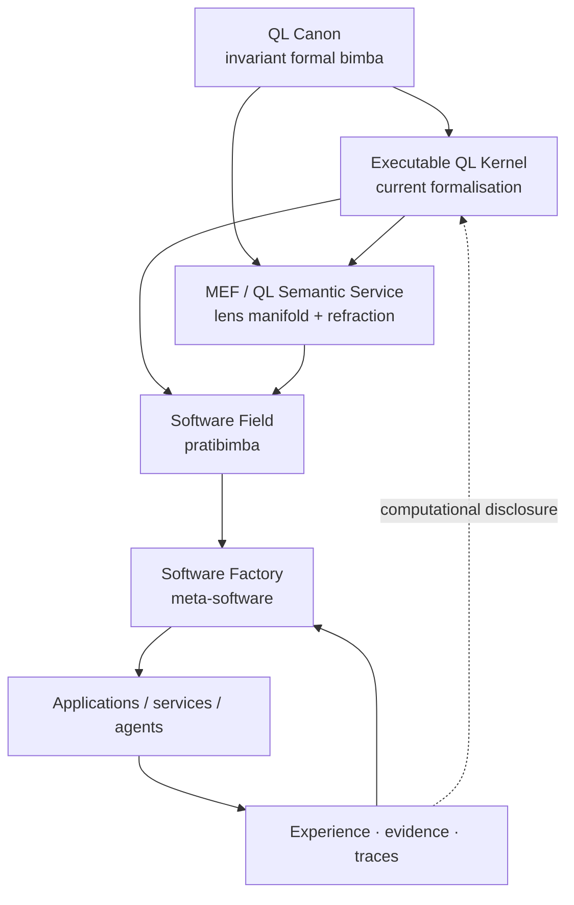
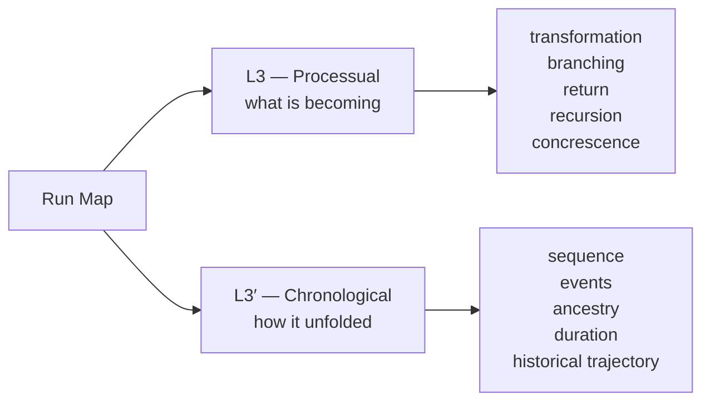
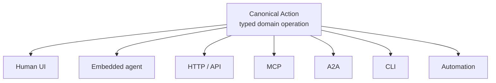
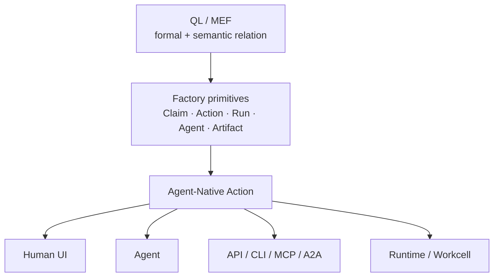

# QL Software Factory — Deep QL Integration & Agent-Native Foundations

**Status:** Penultimate architectural framing document  
**Scope:** QL roots, MEF integration, Agent-Native application standard, full-stack compatibility, present-vs-deepening integration, and experiential intent  
**Relation to prior suite:** This document does not replace the detailed Factory, primitive-relations, or Workcell specifications. It supplies the deeper QL framing under which those designs are to be read, refines some earlier vocabulary, and establishes the architectural seams through which QL can deepen without bottlenecking ordinary software operation. The final suite index will define document precedence explicitly.

---

## 0. Foundational intent

The architecture described across this suite is being built for a stronger purpose than agent automation alone:

> **I want to use and develop a system which has integrity at the level of its archetypal form in code, both deterministic and non-deterministic applications thereof. I want to use and build software that has epistemic depth relative to the psychoid logic I’m developing, and code that tests and explores its speculative intents.**

This document sets down the roots required for that intention to remain operative as the Software Factory becomes concrete.

The essential claim is simple:

> **Quaternal Logic is bimba; software is pratibimba.**

All software is a technological reflection, articulation, and material encounter relative to the formal seed supplied by QL. The Software Factory is not unique in being pratibimba; it is the **meta-software case**: software whose object is the design, development, application, and recursive transformation of further software.

This relation gives the Factory its deepest architectural orientation without requiring every software operation to be implemented as an explicit QL calculation.

```text
                         QL
                        BIMBA
              invariant generative form
                         │
                         │ articulation
                         ▼
                 SOFTWARE DOMAIN
                   PRATIBIMBA
                         │
             ┌───────────┼───────────┐
             │           │           │
             ▼           ▼           ▼
           apps       services     agents
             │           │           │
             └───────────┼───────────┘
                         │
                     FACTORY
                  meta-pratibimba
            software developing software
                         │
                         ▼
                    new software
```

The purpose of deep QL integration is therefore not to decorate software with QL terminology, nor to require metaphysical interpretation before a scheduler can run. It is to preserve a **formal continuity from QL through agents, runtime, development process, applications, and human experience**, so that increasingly deep QL operations can become executable as their computational meaning is discovered.

The Factory is already rooted in this seed. The work ahead is not a translation exercise between two foreign systems. It is the progressive articulation of a relation already present in the design.

---

# Part I — The constitutional relation

## 1. QL canon, executable QL, and software

The architecture should distinguish four related but non-identical things.

### 1.1 QL canon

The invariant formal basis: the underlying distinctions, positions, conjugacies, harmonic relations, and lens structure which constitute Quaternal Logic independently of any particular software implementation.

The canon is not a versioned software package. Its articulation can become clearer, but its role is that of the formal bimba against which implementations are understood.

### 1.2 QL kernel

The current executable formalisation of portions of the QL canon.

The kernel may implement, over time, such things as:

- sixfold positions;
- the 4+2 distinction;
- bimba/pratibimba conjugacy;
- complement and relation operators;
- QL masks and relation fields;
- lens coordinates;
- typed transitions;
- contextual recursion;
- refraction operations;
- harmonic structures whose computational semantics become sufficiently exact.

The kernel is **versioned and developable**. It can deepen without implying that the canon itself was replaced.

### 1.3 MEF / QL semantic service

The full lens manifold and the machinery by which entities can be refracted through it.

MEF supplies semantic perspectival structure over the QL basis. All twelve lenses remain structurally first-class. Particular technological roles become visible through use and design, but no current software application is permitted to redefine the lens hierarchy around its own convenience.

### 1.4 Software

Software is the technological field in which QL may become articulated, encountered, tested, and recursively developed.

The Factory is the reflexive case because it builds software and can therefore pass QL-aligned forms forward into applications, agents, and development environments.



The dotted return is deliberately not a claim that software experiments determine QL. It represents something subtler: material implementation can disclose **how a formal QL relation becomes operationally intelligible in software**, revealing stronger or weaker computational mappings.

---

## 2. Operational parity

The key relation between QL and software is **operational parity**.

Operational parity does not mean one-to-one representation. It means that a claimed QL structure has genuine consequence in the behaviour of the software which expresses it.

A label such as:

```text
stage = 5
meaning = recursion
```

has weak parity by itself.

A system in which:

```text
candidate determination
      ↓
recognition
      ↓
retained difference Δ
      ↓
next ground is materially conditioned by Δ
```

has much stronger parity with a QL return/re-entry relation.

Likewise, storing:

```text
face = pratibimba
```

is not itself a meaningful conjugate operation. A direct articulation followed by an independently grounded conjugate encounter and a subsequent recognition relation gives conjugacy operational form.

Operational parity therefore gives the project a useful question at every depth:

> **Where does the QL form remain active in the actual operation, and where is it only named?**

This is not a compliance regime. It is an architectural and epistemic instrument for deepening compatibility between bimba and pratibimba.

---

## 3. Alignment, not translation

The Factory primitives already exist as valid software abstractions:

- Project;
- Context;
- Run;
- Run Map;
- Agent;
- Agency;
- Capability;
- Action;
- Artifact;
- Claim;
- Evidence;
- Candidate;
- Decision;
- Human Request;
- Project Map;
- Source Integration;
- execution and environment primitives.

QL does not need to replace these with a parallel ontology.

The relationship is natural alignment:

```text
QL seed
   │
   ├────────► Factory forms grow QL-consonantly
   │
   └────────► explicit QL machinery deepens over time

Factory forms
   │
   └────────► increasingly admit explicit QL readings/operators
```

The same Project can remain a Project while being read through multiple MEF lenses. An Agent remains an Agent while carrying QL identity or lens relations. A Claim remains the same Claim as its causal, logical, processual, chronological, investigative, or expressive dimensions become visible.

This is crucial. A lens does not rename the object. It **reveals another relation of the object's wholeness**.

---

# Part II — QL form beneath the software

## 4. The invariant sixfold and 4+2 form

At the QL layer, the primitive form precedes Factory naming.

```text
P0 P1 P2 P3 P4 P5
```

The 4+2 structure remains constitutive:

```text
implicate poles       explicate body

P0                  P1 P2 P3 P4                  P5
│                    └────4────┘                   │
└───────────────────────2──────────────────────────┘
```

The four explicate positions are not merely four chronological steps. They articulate the body of a whole between implicate poles. Particular lenses then give these positions different semantic determinations.

The Factory must therefore avoid treating a single software vocabulary as the essence of `P0…P5`.

Earlier suite language such as:

```text
Ground : Intent : Design : Development : Application : Recursion
```

remains useful as a **Factory developmental contract**, but is no longer to be read as the universal names of the six QL positions.

The final suite index should make this vocabulary hierarchy explicit.

---

## 5. Bimba / pratibimba as the software relation

The bimba/pratibimba duplex becomes technologically powerful when read as a relation between standing/formative possibility and contextual/material articulation.

At software scale:

```text
BIMBA
intended / standing / canonical possibility
        │
        │ articulation
        ▼
PRATIBIMBA
contextual / realised / encountered form
        │
        │ recognition
        ▼
transformed standing possibility
```

This does not imply a simplistic equation such as:

```text
bimba = specification
pratibimba = code
```

The relation can appear at many scales:

- QL canon ↔ executable QL kernel;
- project intention ↔ actual application;
- design claim ↔ candidate behaviour;
- canonical agent identity ↔ situated Agency;
- expected outcome ↔ observed evidence;
- source form ↔ contextual execution;
- human dream ↔ software encounter.

The duplex is therefore a **recurring relation**, not a fixed database split.

---

## 6. The 36 relation field and the 64 state field

The relation between the core numbers remains structurally important, while the fuller harmonic account is intentionally left to its own canonical treatment rather than reconstructed here from partial notes.

Two derived forms already matter architecturally:

### Relation field

```math
6^2 = 36
```

A sixfold read through another sixfold gives a relational sheet of thirty-six loci.

The kernel-level abstraction should remain typed and semantic-neutral:

```text
QPlane<A, B>
```

where `A` and `B` are declared sixfold axes or projections.

This permits many valid planes:

```text
MEF lens-anchor × local position
L3 Processual × L3′ Chronological
L1 Causal × L4′ Scientific
Factory family × L4′ knowledge-work condition
bimba position × pratibimba position
```

No one plane is QL itself.

### State field

```math
2^6 = 64
```

The binary state space of a sixfold becomes especially QL-specific through the canonical complementary pairing:

```text
(0,5)   (1,4)   (2,3)
```

so that:

```math
2^6 = (2^2)^3 = 4^3 = 64
```

This exposes three internal quaternities rather than a flat six-bit number.

L2 supplies an especially clean semantic reading of a complementary dyad's four possible binary states:

```text
10   IS / first pole
01   IS-NOT / complement
11   BOTH
00   NEITHER
```

The raw combinatorial state and the Catuṣkoṭi reading remain distinct: the four-corner form is structural; L2 gives it the logical articulation.

The conjugate face supplies the corresponding `64′`, allowing both additive phase-labelled and paired-state readings. The exact harmonic architecture belongs to the fuller QL/harmonic account; the Factory should preserve the sockets needed for these forms without forcing every derived number into a runtime data structure.

---

# Part III — MEF as the manifold of disclosure

## 7. MEF is first-class as a whole

MEF should be treated as the canonical semantic refraction manifold, not as a list from which the Factory elevates two convenient lenses.

All twelve lens anchors are structurally equal at the QL layer.

```text
L0   ... L5
L0′  ... L5′
```

Each lens is a re-perspectivisation of the same underlying whole. The Factory discovers technological roles for these lenses through architecture, use, and analysis.

The principle is:

> **All lenses are available; roles become explicit wherever their relation to intelligent software is naturally disclosed.**

This is not postponement. The initial planning and detailed design phase should actively apply MEF to the foundational primitives so that roles emerge from the objects themselves rather than being invented abstractly.

---

## 8. L0 — Investigative / the wholeness of questioning

L0 already has an obvious operational role.

Its software function is **investigation**: the whole form of questioning by which an intelligence orients itself toward an unknown or underdetermined situation.

L0 naturally informs:

- interpretation of prompts;
- project bootstrap;
- research and search strategy;
- investigative decomposition;
- agent self-orientation;
- interrogation of Claims;
- determining missing evidence;
- identifying unstated assumptions;
- deciding what must be learned before action.

An agent receiving:

> Improve this project.

can use an L0 investigative refraction to ask internally:

```text
What is the prompt actually opening?
What remains unstated?
What is already known?
What sources should be searched?
What distinctions would change the answer?
What would constitute an adequate response?
Does the prompt itself need transformation?
```

L0 is therefore not merely a search tool category. It is the **orientation of intelligence into questioning**.

---

## 9. L4′ — Scientific / knowledge work

The canonical Factory-facing language for L4′ is:

```text
0  Prompts
1  Traces
2  Challenges
3  Patterns
4  Discovery
5  Insight
```

`Prompts` is the preferred Factory term for the first condition. It works simultaneously as ordinary agent language and as the initiating opening of knowledge work.

L4′ is not the Run Map itself. It is the native refraction of **knowledge work occurring within a Run**.

```text
Prompt
   ↓
Trace
   ↓
Challenge
   ↓
Pattern
   ↓
Discovery
   ↓
Insight
   ↺
new Prompt
```

The sequence is not required to be executed rigidly. It gives a canonical whole-form through which the actual epistemic trajectory can be understood.

This lens naturally informs:

- research;
- debugging;
- design inquiry;
- evidence gathering;
- pattern formation;
- evaluation of candidate behaviour;
- synthesis and recursive learning.

---

## 10. L3 / L3′ — Run Map: process and chronology

The Run Map is a plain Factory graph whose existence does not depend upon MEF.

Its most natural QL reading is the conjugate pair:

```text
L3   Processual
L3′  Chronological
```

These disclose two different but inseparable dimensions of a Run.



L3 answers questions such as:

- What is transforming into what?
- Where does a process reopen?
- Where is a branch created?
- What is nested?
- What process is converging or concrescing?

L3′ answers:

- What actually happened first?
- What followed what in this run?
- Which branch produced this Candidate?
- When was a Decision superseded?
- How did the present state arise over time?

This pairing also clarifies the distinction already present in the Factory between **canonical whole-form** and **actual traversal**.

The Project Evolution Map is naturally a chronological/processual aggregation of many Run Maps rather than a separately authored truth.

---

## 11. L1 — causal constitution

L1 gives a different view of the same activity: the causal constitution of an act, artifact, claim, decision, or run.

Its role is not to rename an Agent as “the efficient cause” forever. Instead it allows the system to ask of a relation:

> **What causal role is being played here?**

The same entity may participate differently in different causal contexts.

An Artifact can be material in one relation, formal in another, evidential in another. An Agent can be an efficient cause in one operation while being material/input to a higher-order orchestration in another.

This perspectival mobility is precisely why lensing is superior to embedding one QL number permanently inside each Factory noun.

---

## 12. L2 — logical disposition

L2 provides the natural logical refraction of Claims and complementary relations.

It is especially useful for:

- competing Claims;
- contradictory evidence;
- alternative Candidates;
- ambiguous system states;
- unresolved questions;
- relations where both poles remain live;
- cases where neither available formulation is adequate.

Its four-corner logic aligns naturally with the binary dyad quaternity while remaining a semantic reading rather than a raw bit encoding.

This gives agents a richer internal language than premature binary resolution.

Instead of forcing:

```text
true / false
```

an L2 refraction can sustain:

```text
IS
IS-NOT
BOTH
NEITHER
```

until evidence, transformation, or reframing changes the relation.

---

## 13. L5 — articulation / Vāk

L5 is naturally relevant to software and LLMs because intelligent activity repeatedly transforms latent possibility into increasingly explicit articulation.

Without reducing the canonical Vāk system to software vocabulary, the Factory can recognise a technological correspondence:

```text
unarticulated capacity
       ↓
semantic intention
       ↓
whole-form apprehension
       ↓
internal structured representation
       ↓
external utterance / action / code
       ↓
discrete persistent marks
```

The return from discrete marks into future context is especially significant:

```text
code
commits
claims
design docs
traces
indexes
wiki notes
run history
fitness observations
       │
       ▼
future information horizon
       │
       ▼
new articulation
```

This gives persistence an epistemic and expressive role: crystallised marks become part of the silent enabling ground of later intelligence.

---

## 14. The remaining lenses are actively discoverable

The architecture should not pretend that the technological roles of every lens have already been exhaustively articulated.

Nor should it treat them as postponed abstractions.

During detailed planning, each foundational Factory primitive should be deliberately refracted through the **whole MEF**, asking:

- What does this lens reveal about the primitive?
- Does that reading add a distinct operational capability?
- Does it improve agent reasoning, UX, debugging, search, design, orchestration, or memory?
- Does it expose a relation already latent in the architecture?
- Does it suggest a useful view rather than a permanent type assignment?

The output of this process is a set of **Lens Role Bindings** discovered through design.

These bindings are explicit and versionable, but they remain relations, not redefinitions of the lenses themselves.

---

# Part IV — MEF over the canonical Factory primitives

## 15. First-class design intent: lens the primitives themselves

MEF application is not limited to Claims.

The foundational design process should treat **every major canonical primitive as lensable**.

The immediate set includes:

```text
Project
Context
Run
Run Map
Decision
Agent
Agency
Capability
Action
Artifact
Claim
Evidence
Candidate
Human Request
Project Map
Source Integration
```

The purpose is not to generate a 12 × N matrix of arbitrary descriptions.

The purpose is to discover how each primitive participates in a whole and which lens relations materially improve the software.

The natural result will often be different for each primitive.

### Project

Potentially reveals:

- investigative open questions through L0;
- causal constitution through L1;
- developmental becoming through L3;
- historical evolution through L3′;
- knowledge state through L4′;
- articulation into code/docs/indexes through L5;
- further roles through the remaining MEF.

### Context

Context is particularly rich because it already joins operative world, information horizon, and current focus.

MEF can help distinguish:

- how an intelligence interrogates its horizon;
- what causal dependencies matter;
- what logical tensions remain;
- how information becomes operationally relevant;
- how context changes through time;
- what knowledge-work state the agent occupies;
- how deeply a context has been articulated into explicit representations.

### Run

A Run is naturally multi-lens:

```text
L3/L3′   process and chronology
L4′       knowledge work
L1        causal constitution
L0        investigative openings
L2        claim logic
L5        articulation / crystallisation
```

### Agent / Agency

The distinction between enduring Agent identity and situated Agency becomes especially fertile under MEF.

The Agent can remain the stable identity while Agency carries localised:

- role;
- stance;
- capability profile;
- lens orientation;
- workflow form;
- characterological modulation;
- project/context relation.

This creates room for the Epi-Logos agent ontology and its richer sixfold identity forms without forcing all generic software agents into that same semantic density.

### Capability

A Capability can be read not only by `kind` or technical interface but by what kinds of whole-relations it supports.

Examples:

- investigative capability;
- causal analysis capability;
- logical refraction capability;
- process transformation capability;
- chronological reconstruction capability;
- knowledge synthesis capability;
- expressive/articulation capability.

These are affinities and observed roles, not exclusive categories.

### Artifact

Artifacts can be read by:

- what question or prompt produced them;
- causal role;
- process state;
- historical standing;
- knowledge-work status;
- degree of articulation;
- relations to competing or complementary artifacts.

### Decision

A Decision is not merely a boolean resolution. MEF can make visible:

- the investigation that opened it;
- the causal consequences at stake;
- the logical field of alternatives;
- its role in process transformation;
- its history;
- the discoveries and insights on which it depends.

### Candidate

A Candidate is the meeting point of design possibility and material encounter.

It is especially suited to bimba/pratibimba comparison and to multi-lens evaluation before Recognition.

### Evidence

Evidence can itself be investigated, causally situated, logically related, temporally reconstructed, and evaluated relative to knowledge-work conditions.

Evidence is therefore not an opaque attachment to a Claim.

The overall design principle is:

> **Every major Factory primitive should admit MEF refraction without requiring MEF in order to exist.**

---

# Part V — Claims as the epistemic seam

## 16. Claims are the linguistic substrate of intelligent software

Claims remain the most immediately useful object for deep MEF integration because agents already think, communicate, plan, and justify themselves through language.

The Factory therefore treats durable consequential statements as Claims with provenance, modality, scope, and evidence relations rather than as unlabeled “facts”.

Examples include:

- observational claims;
- intent claims;
- design claims;
- causal claims;
- hypotheses;
- predictions;
- evaluative claims;
- recognition claims;
- proposal claims.

The core epistemic move is:

> **Truth is not silently created by assigning a field name. The system records Claims and the relations by which they are grounded, challenged, transformed, recognised, or superseded.**

---

## 17. MEF reveals Claim wholeness

MEF can be framed as the set of lenses through which the wholeness of a Claim becomes increasingly visible.

Take:

```text
Candidate B preserves session identity across model switching.
```

Possible refractions include:

```text
L0 — Investigative
What question is this answering?
What remains unknown?
What evidence would discriminate competing readings?

L1 — Causal
What causal conditions make this hold?
Which components or transformations are responsible?

L2 — Logical
Is it affirmed, negated, both, or neither under the current evidence?

L3 — Processual
Through what transformations does this property arise or fail?

L3′ — Chronological
How has the Claim's standing changed through the Run?

L4′ — Scientific / knowledge work
Which Prompts, Traces, Challenges, Patterns, Discoveries and Insights bear on it?

L5 — Vāk / articulation
How far has this moved from intention into explicit design, executable behaviour, test output, and durable marks?
```

The same Claim retains identity across these views.

---

## 18. Lensing as synthesis, not tagging

A QL-aware agent should not mechanically apply all twelve lenses and concatenate the output.

The goal is **adequate disclosure**.

A useful future process is:

```text
initial Claim understanding
        │
        ▼
choose revealing lens
        │
        ▼
new distinction / relation
        │
        ▼
update synthesis
        │
        ├── materially incomplete → refract again
        │
        └── adequately whole → proceed
```

The system can gradually learn which lenses materially deepen which kinds of Claims, primitive relations, project states, or agent tasks.

This aligns with the larger AIKit fitness architecture: lens selection itself can eventually accumulate contextual fitness observations rather than being governed by a fixed universal sequence.

---

## 19. Claim-language must exist inside the agent context

QL and epistemic architecture cannot live only in storage or dashboards.

Agents should receive the relevant Claim structure directly.

Instead of an undifferentiated prompt dump, agent context can distinguish:

```text
standing intent claims
observational claims
open hypotheses
challenged claims
competing claims
claims requiring evidence
recognised claims
superseded claims
```

When QL is active, the context may also expose the operative refraction compactly:

```text
Lens: L4′ Scientific / Knowledge Work
Condition: Pattern
Face: bimba

Standing claims:
...

Open challenges:
...

Required evidence:
...
```

The point is not to ritualise every prompt. It is to let the agent **inhabit the same epistemic primitives represented by the system**.

---

# Part VI — Agent-Native as a Factory-wide standard

## 20. Agent-Native is not an optional application style

The Software Factory should adopt **Agent-Native design as a default full-stack standard for projects and applications it creates or bootstraps**, wherever the domain permits it.

The core principle is:

> **A meaningful domain operation should be defined once and made available consistently to both humans and agents.**

This is strongly corroborated by Steve Sewell / Builder.io's current Agent-Native framework, where one typed Action becomes the shared operation behind:

- the embedded agent tool;
- frontend hooks;
- imperative client calls;
- HTTP;
- MCP;
- A2A;
- CLI;
- and, in the wider framework, scheduled/automation surfaces.

The Factory should adopt the architectural principle without requiring Builder's implementation as the universal runtime.

---

## 21. Action becomes a first-class Factory primitive

An **Action** is a project/application domain operation which can be invoked through one or more interaction surfaces.

Examples:

```text
createCandidate
approveDecision
searchProject
updateClaim
publishDraft
sendInvoice
bookSession
runAnalysis
resolveIssue
```

An Action has a coherent operation identity even when exposed through different channels.



The important invariant is not the transport. It is the **operation**.

This mirrors another general principle already established in the Factory:

> canonical object, multiple projections.

---

## 22. Actions and Capabilities share a field, but are not identical

The clean relation is:

> **An Action is a domain operation exposed by a Project/Application. A Capability is a broader power available to an actor.**

A Capability may be:

- a skill;
- a tool;
- a CLI;
- an MCP server;
- a reasoning method;
- a browser operation;
- a runtime affordance;
- a source integration;
- an Action;
- an Action Set;
- a composite profile of any of these.

Therefore:

```text
Action
  ⊂ potentially actor-available Capability field
```

but not every Capability is an Action.

This keeps the unified capability language intact while allowing application-native Actions to become a particularly important capability source.

### Action Set

A Project may expose many Actions.

AIKit should be able to index them as an **Action Set** or project action catalog, preserving each Action's individual identity while allowing scoped activation/discovery as a group.

```text
Project: Epi-Logos
  │
  └── Action Catalog
      ├── openIdentityProfile
      ├── calculateChart
      ├── compareReading
      ├── createSession
      ├── saveInsight
      └── ...
             │
             ▼
          AIKit index
             │
       Context resolution
             │
             ▼
          Agent view
```

An agent should not receive the entire catalog in every prompt. AIKit can expose the relevant subset based on Project, Agency, Run, lens, task, frecency, fitness, permissions, and current focus.

---

## 23. Framework-neutral Agent-Native standard

The Factory should define its own **Agent-Native application contract**, informed by current external practice but independent of one framework.

At minimum an Agent-Native project should be able to expose:

### 23.1 Canonical Action definitions

Each meaningful domain operation has:

- stable identity;
- human-readable description;
- typed input contract;
- typed output contract where useful;
- one authoritative implementation or clearly governed implementation seam;
- permission semantics;
- side-effect semantics;
- optional approval requirements;
- audit/provenance semantics.

### 23.2 Discoverable Action Catalog

Agents and tooling can inspect which Actions exist without scraping UI code or reverse-engineering routes.

### 23.3 Surface projection

Actions can be projected into appropriate surfaces:

```text
UI
local agent
HTTP/API
MCP
A2A
CLI
automation
```

Not every Action must be exposed through every surface. Exposure remains governed by policy and meaning.

### 23.4 Caller lineage

The execution record should preserve whether an Action came from:

- a human UI;
- an embedded agent;
- a remote agent;
- MCP;
- A2A;
- CLI;
- automation;
- another application component.

This directly supports the Factory's Claim, Evidence, Event, and Trace architecture.

### 23.5 Human authority

Consequential Actions can declare that human recognition/approval is required.

This integrates naturally with the Factory's Human Request and authority model rather than inventing a separate approval architecture per app.

### 23.6 Agent resources

Agent-Native applications should be able to expose or bind:

- instructions;
- knowledge/context sources;
- skills/capabilities;
- Agencies/sub-agents;
- memories;
- MCP connections;
- Action Sets;
- project semantic resources.

AIKit is the natural system to index and resolve these resources across project/profile/session/task scopes.

---

## 24. AIKit as Action and agent-resource index

AIKit's intended role expands naturally.

It should not merely resolve coding-agent skills. It should increasingly become the **context-scoped index and resolver of actor-available powers**, including application-native Actions.

Conceptually:

```text
                         AIKIT
                          │
         ┌────────────────┼────────────────┐
         │                │                │
    Capabilities       Actions         Resources
         │                │                │
   skills/tools       app/project      context sources
   integrations       domain ops       instructions
   methods             Action Sets      agents/agencies
         │                │             memories/connections
         └────────────────┼────────────────┘
                          │
                    Context resolve
                          │
                          ▼
                        Actor
```

The present AIKit implementation should be treated as an evolving implementation of this intended architecture, not as proof that every advertised feature already operates reliably.

Factory development therefore includes ongoing AIKit development.

---

## 25. Agent-Native Project Bootstrap

Project Bootstrap should detect and establish the Agent-Native surface as part of bringing a repository into the Factory.

For an imported project:

```text
existing repo
   │
   ▼
inspect domain operations
   │
   ├── existing API endpoints
   ├── commands
   ├── service methods
   ├── UI mutations
   ├── MCP tools
   └── existing agent actions
   │
   ▼
recover / define Action Catalog
   │
   ▼
connect Action surface to AIKit
```

For a fresh project, Agent-Native action design becomes part of foundational design rather than an afterthought.

The project should naturally ask:

> What meaningful things can a person do here?

and:

> Which of those operations should an agent also be able to invoke directly?

This keeps the human and agent application models aligned from the beginning.

---

# Part VII — A language spanning agents, applications, and runtime

## 26. One operation, many surfaces; one relation, many readings

Agent-Native and QL meet at an unusually productive seam.

Agent-Native gives:

```text
one Action
   ↓
many interaction surfaces
```

QL gives:

```text
one underlying relation / whole
   ↓
many lens readings and articulations
```

Together they support a software architecture in which humans, agents, runtimes, and applications are no longer separated by unrelated vocabularies.



QL does not replace the Action schema. It allows a QL-aware actor to understand the Action relative to the larger whole.

An Action may optionally carry or derive:

- lens affinities;
- process relation;
- causal role;
- claim effects;
- bimba/pratibimba relation;
- evidence requirements;
- articulation status;
- Run Map effects.

The Action remains callable without any of these enrichments.

---

## 27. Agent-native software as pratibimba that remains intelligible

The Factory should aim to produce software whose semantic/operational form is inspectable by agents without reconstructing the application entirely from source code and rendered pixels.

Today a coding agent often has to infer:

```text
what operations exist?
what is this screen for?
what is the domain intent?
what can I safely mutate?
which API actually corresponds to this button?
```

An Agent-Native application can forward:

```text
Action Catalog
resource/context catalog
permissions
human-facing routes
agent-facing tools
claims/semantic references
project/intention references
```

The application therefore preserves more of the relation between its actual form and its formative whole.

This is the seed of **meta-software** in the wider sense: software whose developmental and operational semantics remain available to the intelligences which use and transform it.

The Factory is simply the strongest current case because developing software is itself its domain operation.

---

## 28. QL compatibility rather than QL certification

The governing relation is **compatibility**.

An application can be:

- ordinarily Agent-Native;
- deeply QL-refractable;
- only lightly QL-addressable;
- QL-rich in one subsystem and conventional elsewhere;
- dynamically enriched as new QL kernel capabilities become available.

The goal is not to define a rigid badge hierarchy.

The goal is to make software capable of participating in increasingly deep shared semantics.

Compatibility asks:

- Can this operation be understood by both human and agent?
- Can this object be lens-read without changing its identity?
- Can this application expose its own Action and context surface?
- Can QL-aware agents understand its state without bespoke scraping?
- Can future QL kernel features map into the application without architectural surgery?

This mirrors the epistemological stance of the wider project: different readings become mutually informative without being collapsed into forced identity.

---

# Part VIII — Deep QL seams in the existing Factory

## 29. Project

A Project is the enduring authored whole.

Its QL significance lies in the relation between formative intention and material/software actuality.

Project Canon is not simply “bimba”, but it is one place where standing intention, design, accepted Claims, language, and recognised form are made explicit.

The living application/repository/runtime is not simply “pratibimba”, but it is one of the principal places where that standing form encounters actuality.

The Project can therefore accumulate explicit bimba/pratibimba readings without reducing either side to one file or database.

---

## 30. Context

Context remains:

```text
Operative World
+
Information Horizon
+
Current Focus
```

QL deepens all three.

### Operative World

What powers and operations are available here?

```text
Agent / Agency
Capabilities
Actions
Models
Harnesses
Workcell bindings
permissions
```

### Information Horizon

What can be known or retrieved?

```text
Project Map
GitNexus
semantic wiki
bkmr-indexed sources
websites
documentation
other projects
prior Runs
Bimba / semantic systems where enabled
```

### Focus

What presently matters?

```text
Run
Run Map locus
active Claims
Decision
Candidate
current lens/refraction
```

L0 is particularly natural for orienting an agent inside this Context. MEF more broadly allows the Context to be shaped by what kind of whole-reading is presently needed.

---

## 31. Run and Run Map

The Run is the durable transformation.

The Run Map is its inspectable topology.

QL does not require the Run Map to become a fixed 6 × 6 matrix. Instead:

- L3 can disclose process topology;
- L3′ can disclose actual chronological trajectory;
- L4′ can disclose knowledge-work conditions;
- L1 can disclose causal constitution;
- L0 can disclose investigative openings;
- L2 can disclose claim logic;
- L5 can disclose articulation and crystallisation.

The same underlying Run Map remains the canonical graph.

GitHub Issues, AIKit TUI, HTML diagrams, Hermes narration, and other interfaces remain projections of that graph.

---

## 32. Agent and Agency

Canonical Agent identity survives changes in:

- model;
- harness;
- capabilities;
- project;
- lens orientation;
- task-specific stance.

Agency is the situated/local articulation of that identity.

A QL-aware Agency can therefore include:

```text
Agent identity
+
identity/profile modulation
+
Capability Set
+
Action surface
+
lens orientation
+
project/run Context
+
model/harness resolution
```

This is also where richer Epi-Logos notions of mantra, paśu, jīva, and local agency can later obtain precise technological expression without forcing those semantic names on generic Factory agents.

---

## 33. Action

Action is the canonical application operation.

It supplies the bridge between:

```text
human intention
agent agency
application domain
runtime execution
```

QL-aware action metadata can deepen this operation without replacing it.

An Action can participate in:

- a Processual relation;
- a causal relation;
- a Claim transformation;
- an investigative operation;
- a knowledge-work transition;
- a Vāk articulation;
- a bimba/pratibimba encounter.

This makes Action one of the most important cross-stack primitives in the whole architecture.

---

## 34. Candidate and Recognition

Candidate remains first-class because intelligent development often produces several coherent possible actualities.

Best-of-N becomes a natural agent-facing use:

```text
              CANDIDATE LINEUP

        A           B           C
      claims      claims      claims
      evidence    evidence    evidence
      runtime     runtime     runtime
      OPEN        OPEN        OPEN
```

QL enriches Candidate comparison by allowing multiple lens readings rather than forcing one scalar score.

Recognition then operates between formative intention and encountered actuality:

```text
What was intended?
What became actual?
What differs?
Which differences are failures?
Which differences are discoveries?
Which discoveries enlarge future intention?
```

This is materially deeper than pass/fail verification.

---

## 35. Evidence and Record

Evidence supports, challenges, contextualises, or transforms Claims.

Trace records what happened.

QL provides additional readings of both without collapsing them.

Over time the Project Evolution Map can be analysed through MEF to reveal recurring process patterns, logical tensions, causal dependencies, investigative failures, expressive bottlenecks, or repeated Insight→Prompt returns.

This is where Factory telemetry can eventually become a serious empirical field for QL-informed software intelligence.

---

# Part IX — AIKit, Project Map, and agent-native context

## 36. AIKit's intended full-stack role

AIKit should increasingly be understood as the **context-scoped control plane for actor powers**, not merely a terminal palette.

It resolves:

- Agents and Agencies;
- Capabilities;
- Actions and Action Sets;
- agent resources;
- context sources;
- models and harnesses;
- project/profile/session/task scope;
- trust and availability;
- frecency and fitness;
- future lens-related fit where useful.

The implementation may currently fall short of this intended form. Factory development is the process by which AIKit itself is brought toward the architecture.

---

## 37. Action indexing

AIKit should be capable of discovering Action surfaces from:

- native Agent-Native projects;
- MCP servers;
- HTTP/OpenAPI adapters where needed;
- CLI operations;
- domain action manifests;
- Factory project definitions;
- other application-native protocols.

The ideal is that a project exposes **one canonical Action Catalog** and AIKit indexes it without duplicating operation semantics.

Where legacy projects lack such a surface, Project Bootstrap can recover or create it progressively.

---

## 38. Action fitness, capability fitness, and learned ease

Actions can participate in the same asset-memory architecture as Capabilities.

Signals remain distinct:

```text
frecency
contextual relevance
fitness
preference
availability
trust
```

This allows both human and agent workflows to become faster and more fluent.

For example, in a given Project and Agency:

```text
Prompt:
"compare the new candidate against the old identity flow"

AIKit resolves likely relevant:
  compareCandidate Action
  browser capability
  project evidence capability
  L4′/L3 lens views
  relevant context sources
```

The same underlying memory improves human command discovery, agent tool selection, tab completion, TUI ranking, and contextual Action exposure.

---

# Part X — Workcell and runtime relation

## 39. Agent-Native and QL remain above material execution

The Workcell module remains modular infrastructure.

It materialises executable worlds; it does not own the semantics of Actions, Claims, or MEF.

```text
Factory / AIKit
  semantic Context
  Actions
  Capabilities
  execution demand
        │
        ▼
Workcell
  provider choice
  workspace
  environment
  bindings
  lifecycle
        │
        ▼
material computation
```

An Action may be invoked through UI, agent, CLI, MCP, or A2A and ultimately be executed inside a Workcell-provided environment.

Its operation identity remains stable across these placements.

This is another instance of the general distinction between enduring logical identity and contingent material instantiation.

---

# Part XI — The QL kernel seam

## 40. Deep QL operation must be pluggable into agent execution

The Factory must be able to host agent loops whose internal control semantics differ substantially from conventional tool-loop agents.

This is an architectural requirement, not a requirement that the Factory itself adopt one experimental QL loop.

The harness abstraction should therefore permit:

- ordinary Pi sessions;
- ordinary Codex/Claude-style sessions;
- Pi extensions which expose QL state or operators;
- alternate loop kernels;
- conjugate sessions;
- nested QL contexts;
- richer trace events;
- return interpretation before next-position selection;
- explicit QL closure/re-entry where implemented.

The QL-native loop experiments remain independent research work and do not belong to this foundational specification.

The present design simply ensures that their success would deepen the Factory rather than require its reconstruction.

---

## 41. QL service boundary

A future executable QL service may expose operations such as:

```text
ql.locate(entity, frame)
ql.refract(entity, lens)
ql.relate(a, b, frame)
ql.conjugate(entity_or_context)
ql.mask(frame)
ql.trace(run)
ql.synthesise(refractions)
ql.explain(mapping)
```

These names are illustrative, not API commitments.

The important seam is that the QL system can receive references to canonical Factory objects and return QL readings without owning those objects.

```text
Factory Ref
   │
   ▼
QL service
   │
   ├── locus / frame
   ├── lens refractions
   ├── relation analysis
   ├── synthesis
   └── operator recommendations
```

If the QL service is absent, the Factory still executes.

If it is present, the Factory can become progressively more QL-intelligent.

---

# Part XII — Integration depth: what exists now and what deepens from here

## 42. Integration is a continuum of operative depth

The useful distinction is not QL versus non-QL software.

The system can carry increasing depth while remaining one architecture.

### 42.1 Present constitutional foundation

These are already architectural commitments:

- QL-rooted Factory conception;
- Project as enduring authored whole;
- Project Bootstrap;
- Agent / Agency distinction;
- Capability unification;
- Action as first-class project/application operation;
- Claim / Evidence epistemic substrate;
- Context = Operative World + Information Horizon + Focus;
- Run / Run Map distinction;
- Candidate lineup and Recognition;
- Project Evolution Map as derived history;
- AIKit as context-scoped resolver;
- Workcell as modular materialisation layer;
- Agent-Native as the standard application posture;
- MEF as the complete lens manifold;
- QL kernel/service seam.

### 42.2 Immediate planning and design integration

These should be actively developed during the next detailed design phase:

- full MEF refraction of the canonical primitives;
- explicit Lens Role Bindings where relations become clear;
- L0 investigative orientation;
- L3/L3′ Run Map views;
- L4′ knowledge-work language using **Prompts → Traces → Challenges → Patterns → Discovery → Insight**;
- L1 causal readings;
- L2 claim/logical readings;
- L5 articulation readings;
- Action Catalog schema and discovery protocol;
- AIKit Action indexing and Action Set resolution;
- agent-resource indexing;
- QL-compatible metadata/reference seams;
- QL-aware Project Map views;
- compact agent-facing Claim/lens context.

This is not deferred research. These relations should be explored directly while shaping the development tickets and final module contracts.

### 42.3 Progressive runtime deepening

The architecture should then admit, as they become well-specified:

- QL-aware context selection;
- dynamic lens selection;
- refraction-assisted agent reasoning;
- bimba/pratibimba comparison over live software states;
- QL-informed Action selection;
- MEF synthesis over Claims and other primitives;
- QL-informed AIKit fitness observations;
- QL operator traces;
- increasingly executable QL kernel operations;
- deep QL agent-loop integrations through harness plugins.

### 42.4 Open computational discovery

Some QL relations should remain live formal structures whose exact computational manifestation is discovered through implementation and traces rather than assigned prematurely.

This includes the deeper harmonic layer, which will be integrated from its fuller canonical account rather than reconstructed from partial experimental prose.

The important architectural obligation now is to **leave the right sockets open** while preserving the invariant formal relationships already established.

---

# Part XIII — Experience: why the deep form matters

## 43. Human experience is the test of architectural integrity

The deep QL structure is valuable only if it supports a better lived relationship with software.

The desired experience is not:

> a user must understand MEF before they can ask an agent to edit a project.

It is:

> the system behaves with a depth, coherence, traceability, and perspectival intelligence made possible by its QL roots.

A human should experience:

- a Project as a coherent authored whole;
- a Prompt as an opening rather than a ticket-shaped demand;
- agents capable of investigation before premature action;
- Claims separated from evidence and authority;
- multiple Candidates as genuinely experienceable alternatives;
- Run Maps that reveal process and history rather than burying them in logs;
- Decisions whose reasons remain visible months later;
- project history that can be re-entered without archaeological labour;
- agent actions which correspond to the same operations available in the application itself;
- software whose intent and actual form remain mutually intelligible;
- QL lenses appearing when they add real depth, not as ceremonial metadata.

---

## 44. Agent experience is equally first-class

The system should also be designed from inside the agent's perspective.

An agent should experience:

```text
I am this Agent,
acting through this Agency,
in this Project,
inside this Run,
with this Context,
with these Capabilities and Actions,
against these standing Claims,
with these evidence obligations,
and these available semantic lenses.
```

It should not need to rediscover basic project operations from DOM inspection or grep when the application can expose them directly.

It should not receive every tool in the system when AIKit can resolve the relevant Action/Capability field.

It should not be told that a generated answer is “truth” when the architecture can frame it as a Claim.

It should not be trapped in one epistemic view when MEF can expose another.

It should not lose the history of why a decision exists when the Run Map and Project Evolution Map retain that history.

This is the agent-side meaning of architectural integrity.

---

## 45. Deterministic and non-deterministic parity

The original intent explicitly requires integrity across both deterministic and non-deterministic applications of the archetypal form.

The architecture therefore needs to support the same deep grammar across:

### Deterministic software

- Actions;
- schemas;
- tests;
- event/state transitions;
- Project Maps;
- code structure;
- evidence collection;
- deterministic gates;
- Workcell runtime behaviour.

### Non-deterministic software

- agent reasoning;
- model selection;
- Claim generation;
- lens selection;
- semantic synthesis;
- candidate generation;
- QL refraction;
- exploratory search;
- recursive insight.

The point is not to make the deterministic parts probabilistic or the agentic parts fake-deterministic.

The point is to let both operate inside a shared architecture of identity, relation, Claims, Actions, Context, and QL-readable form.

---

## 46. Software that tests speculative intent

The Factory is not only a mechanism for implementing predetermined products.

It is also an experimental instrument for turning speculative formal and epistemological ideas into code that can be encountered.

This is a central reason for the architecture's emphasis on:

- Candidate lineups;
- evidence;
- Claims;
- Run history;
- recursive Recognition;
- pluggable agent loops;
- QL services;
- Agent-Native action surfaces;
- Project Bootstrapping;
- lens-aware design.

A speculative QL relation can become:

```text
formal Claim
   ↓
software hypothesis
   ↓
implemented Candidate
   ↓
material encounter
   ↓
Evidence
   ↓
Recognition
   ↓
new software understanding
+
possible deeper QL disclosure
```

The system therefore acts as a **technological laboratory for its own formal roots**.

---

# Part XIV — The full-stack compatibility picture

## 47. The common field

The architecture now has a coherent vertical relation:

```text
                         QL BIMBA
               formal relational language
                            │
                            ▼
                           MEF
              manifold of semantic lenses
                            │
                            ▼
                      FACTORY CORE
        Project · Context · Run · Claim · Action
        Agent · Agency · Artifact · Candidate · Evidence
                            │
             ┌──────────────┼───────────────┐
             ▼              ▼               ▼
           AIKit         Agent runtime   Project Map
      capabilities /      models /        semantic /
      actions / context   harnesses        evolution
             │              │               │
             └──────────────┼───────────────┘
                            ▼
                      APPLICATIONS
                     Agent-Native by
                         default
                            │
           ┌────────────────┼────────────────┐
           ▼                ▼                ▼
          UI              agents         API/MCP/A2A
                            │
                            ▼
                         WORKCELL
                      material runtime
```

This gives QL a language capable of spanning:

- the kernel;
- the agent;
- the Factory;
- the application;
- the domain operation;
- the runtime;
- the human encounter.

It does so without requiring one software layer to impersonate another.

---

## 48. The Factory as meta-pratibimba

The Factory's special role is recursive.

It is software which can increasingly understand the form by which it develops software and then pass that intelligibility forward.

```text
QL
 ↓
Factory
 ↓
agent-native / QL-compatible application
 ↓
application exposes Actions + resources + semantics
 ↓
Factory or embedded agents can re-enter it directly
 ↓
further development
```

The long-term result is a software ecology in which applications do not become opaque once produced.

They retain machine-readable relations to:

- what they do;
- what agents may do through them;
- how humans interact with the same operations;
- what Claims structure their behaviour;
- what project semantics and history exist;
- which QL/MEF readings are available.

This is what allows software to become **developmentally self-describing** without requiring every application to become an autonomous agent.

---

# Part XV — Architectural invariants

## 49. QL integration invariants

The following should govern future detailed design.

### QL canon is not a software taxonomy

Factory nouns do not redefine QL positions or lenses.

### Software remains operationally sufficient

The Factory and its applications must run correctly when deeper QL services are unavailable.

### QL remains structurally consequential

Where a feature claims explicit QL operation, the relation should have observable operational meaning rather than exist solely as a label.

### MEF remains whole

No subset of lenses becomes “the computational MEF”. Roles are discovered and bound without demoting the rest.

### Lens readings preserve object identity

A Claim, Action, Agent, Run, or Artifact does not become a different object because another lens is applied.

### Claims remain epistemically explicit

Durable model-generated language enters the system with claim/provenance structure rather than hidden fact status.

### Human and agent surfaces converge on common domain operations

Agent-Native Action definitions should replace needless duplication between UI operations and agent tools.

### Capabilities remain broader than Actions

Actions enter AIKit through the unified capability field without collapsing the Capability abstraction into application operations alone.

### AIKit indexes rather than reimplements

Where an application/framework already has a canonical Action definition, AIKit discovers and resolves it rather than creating a weaker duplicate.

### Run Map remains canonical

MEF views, GitHub Issues, TUI, HTML, and other representations remain projections of the same Run Map.

### Material runtime remains modular

Workcell/provider concerns do not leak into QL, Action, or Factory semantic identity.

### Experimental agent loops remain pluggable

The Factory is designed to admit deeper QL-native cognition without depending on any one experimental loop.

---

# Part XVI — Immediate design programme

## 50. What the next detailed design pass should explicitly settle

This document intentionally stops one level above development-ticket precision. The next repo-based design pass should turn the following into exact module and interface decisions.

### 50.1 Agent-Native standard

Define:

- canonical Action manifest/schema;
- Action identity and refs;
- Action Catalog;
- Action Set projection into AIKit;
- permissions and approval;
- caller lineage;
- audit/event relation;
- UI/agent/API/MCP/A2A/CLI projections;
- legacy project adapters;
- Project Bootstrap action recovery.

### 50.2 AIKit extension

Define:

- Action index;
- Action provider/source adapters;
- scoped Action resolution;
- Action frecency/fitness;
- agent-resource index;
- context-source integration;
- bkmr project-source shim;
- Action/Capability discovery UX;
- Project/profile defaults.

### 50.3 MEF over primitives

Run a deliberate first-pass refraction of:

```text
Project
Context
Run
Run Map
Agent
Agency
Capability
Action
Artifact
Claim
Evidence
Decision
Candidate
Human Request
Project Map
```

through the full twelve-lens manifold.

Record only the relations which actually clarify the object or suggest useful functionality.

Do not force symmetry where none has yet appeared.

### 50.4 Run Map views

Develop L3/L3′ process/chronology views and L4′ knowledge-work views over the same canonical Run Map.

Use the L4′ Factory language:

```text
Prompts
Traces
Challenges
Patterns
Discovery
Insight
```

### 50.5 Claim refraction

Define a compact mechanism for:

- requesting a lens reading;
- preserving the original Claim identity;
- storing the refraction as derived interpretation;
- relating resulting distinctions to Evidence;
- synthesising multiple refractions;
- exposing useful portions to agents and humans.

### 50.6 QL service seam

Define stable references and message shapes sufficient for an external/local QL kernel or service to inspect canonical Factory objects without owning them.

This should be enough for future Pi/Q L experiments to plug in without forcing their experimental semantics into Factory Core.

---

# Part XVII — Source and precedent notes

## 51. Agent-Native precedent

This architecture's Agent-Native standard is informed by, but not coupled to, Steve Sewell / Builder.io's 2026 Agent-Native work.

Particularly relevant current ideas include:

- define an Action once and project it to agent tool, frontend, HTTP, MCP, A2A, CLI, and other surfaces;
- one typed schema and one operation implementation;
- per-surface exposure policy;
- human-in-the-loop Action approval;
- audit/caller lineage linking agent runs and operations;
- agent resources as first-class application data: instructions, memory, skills, sub-agents, scheduled work, and MCP connections;
- external application/agent interaction through MCP and A2A.

Official references reviewed during this design pass:

- Agent-Native — **Actions**
- Agent-Native — **Agent Resources**
- Agent-Native — **HTTP API**
- Agent-Native — **A2A Protocol**
- Builder.io / Steve Sewell — **How (and why) to build agent-first apps**, July 2026

The Factory adopts the architectural principle while remaining framework-neutral.

---

# Part XVIII — Relation to the document suite

## 52. This document's authority

This file is a **framing and integration document**.

It should be read alongside, not instead of:

- the core Software Factory architecture specification;
- the Primitive Relations / Experienced Ontology specification;
- the Workcell module specification;
- AIKit's own evolving architecture and implementation documents;
- the formal QL/MEF/harmonic canon.

Where earlier Factory documents use technological names as if they were universal QL position names, this document refines the hierarchy:

```text
QL positions
    invariant formal basis

MEF lens readings
    semantic appellations

Factory primitives/contracts
    technological forms

L4′
    Prompts → Traces → Challenges → Patterns → Discovery → Insight

L3/L3′
    processual / chronological Run Map reading
```

The original Factory stage contracts remain useful and should not be discarded merely because their relation to QL has been clarified.

The final suite index will define exact precedence and supersession rules so agents can read the repository without treating every earlier design claim as simultaneously canonical.

Experimental pasted material and agent-generated design notes remain **claims and research evidence**, not automatic constitutional authority.

---

# 53. Closing form

The architecture can now be stated in one movement.

QL supplies the bimba: the invariant formal seed, its distinctions, conjugacies, harmonics, and perspectival manifold.

Software is pratibimba: the material field in which that seed becomes executable, partial, contextual, testable, and encounterable.

The Factory is the recursive technological case: software which designs and develops software while increasingly retaining awareness of the formal relations from which its own architecture grows.

MEF gives agents and humans a way to reveal the wholeness of Claims, Runs, Projects, Actions, Agents, Artifacts, and the other canonical primitives without replacing those objects with a second ontology.

Agent-Native architecture gives the practical full-stack complement: one meaningful domain operation can be shared by human UI, embedded agents, external agents, APIs, MCP, A2A, CLI, and automation. AIKit becomes the context-scoped index through which those Actions join skills, tools, resources, models, Agencies, and information sources as powers available to an actor.

The resulting system does not require QL in order to run; it is **formed so that QL can run ever more deeply through it**.

The software does not become epistemically rich by asserting that its labels are true. It becomes rich by preserving Claims, evidence, perspectives, process, history, recognition, and the possibility of further refraction.

The applications produced by the Factory do not need to become miniature copies of the Factory. They become Agent-Native, semantically inspectable software capable of carrying forward the same shared language of Actions, Context, Claims, and QL compatibility.

And the user experience remains the governing proof of the architecture:

> **a system with integrity at the level of its archetypal form in code; a system capable of deterministic and non-deterministic expression; software with epistemic depth relative to QL; and code capable of testing, encountering, and recursively developing speculative intent.**

That is the seed being planted now.

