# QL Software Factory — Primitive Relations and Experienced Ontology

**Status:** Vision/architecture ratification draft  
**Date:** 2026-08-11  
**Companion to:** `QL-SOFTWARE-FACTORY-ARCHITECTURE-SPEC.md`  
**Primary pipeline:** `ground : intent : design : development : application : recursion`  
**Scope:** Primitive identity, relation, lifecycle, authority, context, canon, projection, and experienced UX across the Software Factory and co-developed AIKit  
**Purpose:** Fix the shape of the system at the level humans and agents inhabit, so implementation schemas can be derived from the architecture rather than determining it.

---

## 0. Executive specification

The Software Factory is organised around an **experienced ontology**, not around its eventual database tables, Rust types, process boundaries, or API routes. The architectural question is therefore not first *how a primitive is implemented*, but:

> **What is this thing to encounter, what can it point to, what can contain it, what can transform it, what survives when the current process disappears, and how does the same thing appear to a human and to an agent?**

The resulting system has one central developmental sentence:

> **A Project, entered through a resolved Context, undergoes a Run whose Run Map traverses Ground → Intent → Design → Development → Application → Recursion; at each position an Agent, locally determined as an Agency, uses resolved Capabilities through an Execution arrangement to transform Artifacts, advance or challenge Claims, accumulate Evidence, and resolve Decisions. Accepted development becomes experienceable as Candidates; recognised outcomes are selectively folded into Project Canon; the accumulated Run Maps become the intelligible evolutionary history from which future Context and Ground are assembled.**

The canonical technological traversal remains:

```text
ground : intent : design : development : application : recursion
   #0       #1       #2          #3           #4          #5
```

The ontology is designed for **two first-class UX subjects**:

1. **the human**, who authors intention, recognises experience, navigates project history, compares candidates, and intervenes where genuine authorship is required;
2. **the agent**, which must itself experience the system's primitives directly — projects, context horizons, claims, evidence, decisions, capabilities, candidates, references, and QL positions — rather than merely emitting prose which some later adapter converts into structured state.

Both subjects inhabit the same underlying machine invariants.

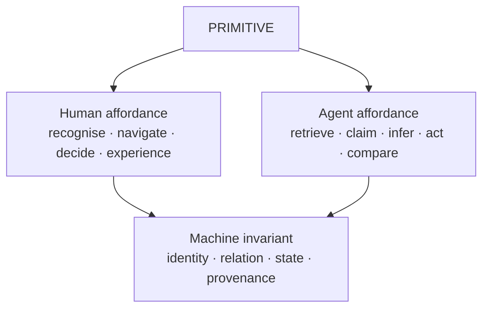

This gives the Factory a strong quality criterion:

> **A result is not complete because the producing model is satisfied. It is complete when the human-facing experience, the agent-facing claim/evidence structure, and the machine-recorded state agree sufficiently for the relevant QL position.**

---

## 0.1 The whole shape

At the highest level:

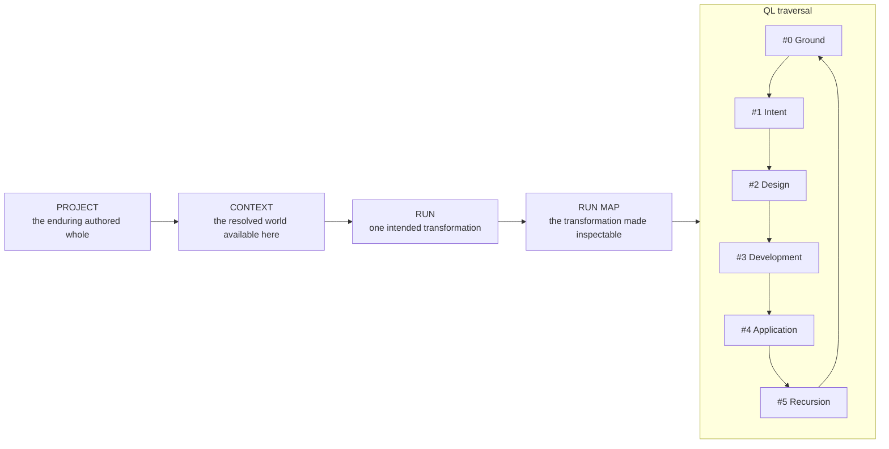

Each active QL position has a repeatable internal form:

```text
                             AGENT
                               │
                            AGENCY
                               │
                       CAPABILITY VIEW
                               │
                               ▼
    INPUT ARTIFACTS ─────► POSITION WORK ─────► OUTPUT ARTIFACTS
                               │
                               ├──── Claims
                               ├──── Evidence
                               ├──── Decisions
                               └──── Events
                                    │
                             EXECUTION CONTEXT
                        model / harness / environment
```

Or, abstractly:

\[
Position(q) =
Agent + Agency + Context + Capabilities + Execution + Inputs
\rightarrow
Artifacts + Claims + Evidence + Decisions
\]

The six constitutional families from the architecture specification remain dimensions crossing the same six QL positions:

| Constitutional family | Contribution at a QL position |
|---|---|
| **Agents** | who is interpreting and acting |
| **Capabilities** | what powers, methods, tools, sources, and integrations are available |
| **Artifacts** | what durable or inspectable form enters and leaves |
| **Runs / Maps** | what transformation is occurring and where it currently stands |
| **Execution Intelligence** | what model, harness, host, session, and environment instantiate the act |
| **Evidence & Memory** | what supports claims and what is retained as learning |

These six families do **not** map one-to-one to the six QL positions. They cross them. The result is a `6 × 6` constitutional grammar rather than six workflow buckets.

---

## 0.2 Three registers of primitives

The primitive set becomes easier to reason about when divided by the level at which it should be experienced.

### Register A — product primitives

These are the things a human or agent should be able to think *in* directly:

```text
Project
Context
Run
RunMap
Decision
Agent
Agency
Capability
Artifact
Claim
Evidence
Candidate
HumanRequest
ProjectMap
SourceIntegration
QLForm
```

### Register B — resolution and execution primitives

These instantiate the product primitives. They are inspectable, but normal UX should compose them into meaningful higher-level experiences:

```text
Profile
Scope
CapabilitySet
Execution
Model
Harness
AgentSession
SessionSpace
Host
Environment
Checkout
Gate
Procedure
Projection
```

### Register C — substrate primitives

These guarantee addressability, observability, persistence, and cumulative learning:

```text
Ref
QLAddress
Event
Trace
Generation
Store
CodeIndex
FitnessObservation
UsageSignal
```

The hierarchy is deliberate:

> **Product primitives define the world. Resolution primitives instantiate the world. Substrate primitives make the world trustworthy and recoverable.**

Implementation may add more low-level structures, but they should not casually become new product ontology.

---

# 1. Project — the enduring authored whole

## 1.1 Project is larger than repository

A repository is a major source constituent of a Project, but it is not the Project itself.

A Project is:

> **An enduring authored identity around which source, intention, design, semantic knowledge, capabilities, history, environments, and developmental work are gathered.**

A Project may contain one repository, several repositories, or — particularly during genesis — no repository yet.

```text
PROJECT
│
├── Source Constituents
│   ├── repository / repositories
│   ├── imported local material
│   ├── external source material
│   └── references to neighbouring projects
│
├── Project Canon
│   ├── foundational intent
│   ├── experiential / product design
│   ├── architecture / program design
│   ├── recognised decisions
│   └── project language
│
├── Project Map
├── Semantic Wiki
├── Project Profile
├── Context Sources
├── Run History
├── current Ground
└── normal Session Space(s)
```

This allows a project such as Epi-Logos to be a coherent authored whole while containing multiple software repositories, data resources, semantic systems, and project-local knowledge.

The Project therefore has an identity that survives repository restructuring. A monorepo can become several repositories; several repositories can merge; a new UI repository can appear; historical source can be archived. The Project remains the same authored entity so long as its continuity is recognised.

---

## 1.2 Project genesis is a native Factory process

The product journey is:

```text
GitHub repository ─┐
                   │
Local directory ───┼──► PROJECT BOOTSTRAP ──► VISIONED PROJECT ──► DEVELOPMENT
                   │
Fresh project ─────┘
```

A repository created before the Factory should not remain second-class. Importing it initiates a **Project Bootstrap Run** that discovers what already exists and develops whatever foundational Ground, Intent, Design, project semantics, profile, and session shape are absent.

Likewise, a fresh project does not need a separate setup wizard followed by a later development process. Its setup *is itself the first Factory traversal*.

### Bootstrap as a QL run

```mermaid
flowchart LR
    IN["GitHub repo<br/>local source<br/>fresh project"]
    Q0["#0 Ground<br/>discover what already exists"]
    Q1["#1 Intent<br/>recover or vision what it is for"]
    Q2["#2 Design<br/>establish experiential + architectural form"]
    Q3["#3 Development<br/>materialise project infrastructure"]
    Q4["#4 Application<br/>enter it as human + agent"]
    Q5["#5 Recursion<br/>recognise Project Canon + Ground₁"]
    READY["Visioned Project"]

    IN --> Q0 --> Q1 --> Q2 --> Q3 --> Q4 --> Q5 --> READY
```

The bootstrap should be **evidence-led and non-redundant**. Existing README material, code structure, ADRs, Git history, issues, prototypes, tests, deployment surfaces, and prior design documents all contribute claims about the project. The system should recover and synthesise those before asking the human to restate what can already be grounded.

An imported repository may therefore enter bootstrap at different degrees of articulation:

```text
mature repository with good design canon
    → light bootstrap / mostly adoption

working code with weak intent/design documentation
    → substantial #1/#2 recovery

prototype or experimental repository
    → clarify intended status and future form

fresh project
    → full visioning traversal
```

The outcome is always the same kind of thing: a **Project that can be coherently entered by both human and agent**.

---

## 1.3 Project identity, ownership, and continuity

A Project owns or canonically gathers:

- its recognised Intent and Design artifacts;
- its Project Map and semantic wiki;
- its Project Profile and context-source declarations;
- its Run Maps and recognised decisions;
- references to source constituents and integrations;
- the durable identity of project-local Agencies and capability preferences;
- the evolving Ground from which later Runs begin.

A Project **references** rather than owns globally reusable assets such as models, general capabilities, harnesses, and externally hosted upstream repositories.

The project boundary is therefore semantic and authorial rather than merely filesystem-based.

---

# 2. Context — operative world, information horizon, and focus

## 2.1 Context is the nexus primitive

In common agentic usage, context means the information horizon available to a model. In AIKit, context also naturally includes the operative environment resolved from project, profile, host, session, and capability scope. The Factory should preserve both senses and make their relation explicit.

A Context is:

> **The resolved world available to a particular actor for a particular act: what can operate, what can be known or retrieved, and what currently matters.**

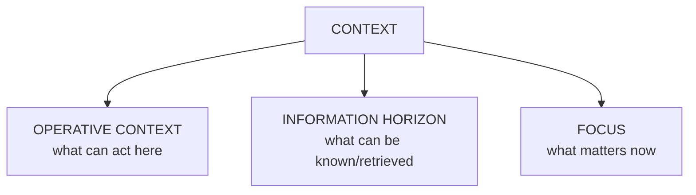

Conceptually:

\[
Context = OperativeWorld + InformationHorizon + CurrentFocus
\]

This is an architectural composition, not a requirement that all three be flattened into one prompt.

---

## 2.2 Operative Context

The operative aspect answers:

> **What powers and execution possibilities exist here?**

It may resolve:

```text
Project
Profile
Scope chain
Agent / Agency
Capabilities
Capability Sets
Model possibilities
Harnesses
Host
Environment
Permissions / trust
Session Space
Agent Session
```

A human should experience this in compact terms such as:

```text
Parāśakti · Epi-Logos · Design
worker-laptop · Pi
GitNexus + product-design + Mermaid + source-integration
Bimba available through project profile
```

An agent should receive the same world as a machine-readable and prompt-visible capability/context declaration.

---

## 2.3 Information Horizon

The informational aspect answers:

> **What can this actor discover from here without pretending that all potentially relevant information is already loaded?**

The Project can declare relevant context sources that are addressable and indexable:

```text
repository source
Project Map
semantic wiki
design canon
prior Run Maps
GitHub issues / PRs
websites
documentation sites
papers
local document trees
other Projects
external repositories
personal/project notes
Bimba where profile-gated
```

The Factory should distinguish **availability** from **prompt inclusion**. A large information horizon is desirable; indiscriminately stuffing that horizon into a model context is not.

The agent receives a navigable horizon and progressively retrieves what its current claims and decisions require.

---

## 2.4 bkmr as a Project knowledge-horizon adapter

The intended integration is to give AIKit a project-aware shim around `bkmr` so that project context can include not merely files but heterogeneous knowledge sources: sites, documentation, local trees, neighbouring projects, notes, and other reference material.

Architecturally, `bkmr` should sit behind an information-horizon interface rather than becoming the definition of Context itself:

```text
Project
│
└── Context Sources
    ├── official documentation
    ├── design references
    ├── website / article
    ├── /path/to/reference-project
    ├── another AIKit Project
    ├── personal/project notes
    └── imported knowledge tree
              │
              ▼
        bkmr-backed index
              │
              ▼
       retrieval into Context
```

This preserves replaceability and lets other information providers coexist.

The broad Project Map then gains a **knowledge lens** alongside code, semantics, design, and evolution.

---

## 2.5 Focus

Focus answers:

> **Which part of the available world matters to this act?**

Typical focus coordinates are:

```text
Run
QL position
Decision
Candidate
Artifact under review
claim requiring evidence
current task
```

Focus is the mechanism by which a broad project horizon becomes a tractable working context.

A useful relation is therefore:

```text
Project + Profile + Scope + Actor + Run + QL position
                          │
                          ▼
                       Context
                          │
          ┌───────────────┼────────────────┐
          ▼               ▼                ▼
      capabilities    information       current
      & execution       horizon          focus
```

AIKit's eventual generation/materialisation machinery is implementation beneath this. **Context is the concept the human and agent inhabit; Generation is one technical snapshot of how it was resolved.**

---

# 3. Run, Run Map, Session Space, and Agent Session

## 3.1 Run

A Run is:

> **One durable intended transformation of a Project.**

The transformation can be tiny or extensive. It can begin as a direct instruction, an improvement proposal, a bootstrap, a bug, a design exploration, a refactor, or a recursively discovered opportunity.

A Run is more durable than the interface currently exposing it.

It can:

- outlive a cmux workspace;
- continue on another host;
- suspend while waiting for a human decision;
- resume tomorrow or next month;
- use several agent sessions;
- produce several Candidates;
- return from later QL positions to earlier ones;
- be mirrored into GitHub while remaining canonically owned by the Factory.

This makes `Run` one of the strongest persistence boundaries in the system.

---

## 3.2 Session Space

A Session Space is:

> **A human-operable workspace through which one or more project/run surfaces are viewed and controlled.**

Examples include:

- local cmux workspace;
- remote tmux session;
- terminal workspace;
- a future richer Factory application workspace.

A Session Space **views or controls Runs**; it does not own them.

---

## 3.3 Agent Session

An Agent Session is:

> **A resumable conversational/execution context maintained by a particular harness for an Agent or Agency.**

Examples include a Pi conversation or another harness session.

An Agent Session can be attached to a Run and QL position, but the Run survives replacement or loss of that session because the Run's durable state exists in typed artifacts, claims, decisions, traces, and references.

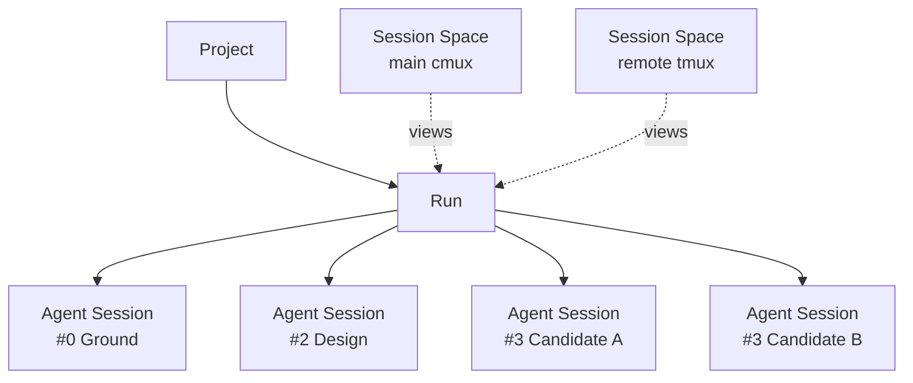

---

## 3.4 Run Map

A Run Map is:

> **The canonical inspectable topology of one Run across its complete QL traversal.**

It is more than a plan. It contains the development of the plan, the determinations made, the unresolved frontier, the returns, the candidate branches, the evidence, and the eventual recursion.

Its invariant conceptual shape is:

```text
RunMap
│
├── destination
├── #0 Ground
├── #1 Intent
├── #2 Design
├── #3 Development
├── #4 Application
├── #5 Recursion
├── Decisions
├── dependencies
├── frontier
├── returns
├── Candidates
├── Artifacts
├── Claims
├── Evidence
└── Events / references to Trace
```

A run can be immediately runnable or can contain unresolved fog requiring:

```text
grill
research
prototype
experiment
manual prerequisite
authorial decision
```

These are **decision-node modes inside the same Run Map**, not separate workflow systems.

---

## 3.5 Factory canonical; GitHub mirror by default

The Factory owns the canonical Run Map.

GitHub Issues should be a **clear, simple, bidirectional default projection**:

```text
                         CANONICAL RUN MAP
                               │
               ┌───────────────┼────────────────┐
               ▼               ▼                ▼
          AIKit / Factory   GitHub Issues      Hermes
               TUI          default mirror     dialogue
```

This gives coding work a natural home in GitHub-hosted source and social/code-review infrastructure without making GitHub's issue schema the constitutional ontology of the Factory. Where a Run can be developed cleanly through hosted branches, pull requests, remote workers, and GitHub-native review surfaces, the Factory should be comfortable leaving the canonical repository remote and materialising local Checkouts only when an Execution or Candidate actually needs them. Local files are an execution materialisation, not the definition of participation in the Project.

This also lets Run Maps generate richer views — including HTML, graph, timeline, and dedicated UI projections — while preserving the GitHub mirror as an ordinary durable collaborative surface.

A Run Map can therefore project to:

- parent issue for the transformation;
- child issues for decisions or vertical slices;
- dependency links;
- candidate/branch/PR references;
- HTML or bespoke Run Map views;
- AIKit TUI surfaces;
- human inbox items;
- Hermes summaries.

The same canonical Run remains available when offline, on a local-only project, or through another issue tracker later.

---

# 4. Project evolution — history as intelligible developmental topology

## 4.1 Run Maps aggregate into history

Because each Run Map already records decisions, branches, returns, candidates, and outcomes, the Factory can derive a larger **Project Evolution Map** without inventing another source of truth.

```text
                             Project Origin
                                  │
                          Bootstrap Run
                                  │
                  ┌───────────────┴──────────────┐
                  │                              │
               Run 12                         Run 13
                  │                              │
             Decision A                    Candidate A
              /      \                    /           \
           path 1   path 2             B accepted    C dead
             │        ✕                   │
           Run 18                         │
             │                            │
        returned to #1 ◄────── Run 21 ────┘
             │
             ▼
           Run 29
             │
          current
```

The evolution lens can show:

- live branches;
- dead or abandoned branches;
- loops and returns;
- superseded decisions;
- accepted Candidates;
- prototypes that informed later design;
- human recognition points;
- Git revisions and PRs;
- major canonical promotions;
- recursively generated future opportunities.

This becomes the answer to:

> **What happened to this project while I was away, and why is it now shaped this way?**

That is a much more useful historical question than merely “what commits landed?”

---

## 4.2 Decision history, not inbox history

The enduring semantic object is the **Decision**, not the message through which a decision was obtained.

A human may answer through Telegram, cmux, GitHub, or the AIKit inbox. Those are projections of a request. Six months later the Project Evolution view should foreground:

```text
Question / determination
alternatives considered
claims and evidence available at the time
who or what resolved it
resolution
consequence
later supersession if any
```

The conversation channel remains available as trace/evidence where useful, but it does not define the history.

---

# 5. Agent, Agency, identity, and local composition

## 5.1 Agent as enduring identity

An Agent is:

> **A persistent identity and functional orientation that survives changes in model, harness, local capability set, host, and individual session.**

For Epi-Logos the canonical identities remain:

| QL | Agent | Factory projection |
|---|---|---|
| `#0` | Anuttara | Ground |
| `#1` | Paramasiva | Intent |
| `#2` | Parāśakti | Design |
| `#3` | Mahāmāyā | Development |
| `#4` | Nara | Application |
| `#5` | Epii | Recursion |

The identity is not equivalent to a particular model:

```text
Parāśakti ≠ GPT-X
Parāśakti ≠ Pi session 184
Parāśakti ≠ one static capability bundle
```

The same canonical Agent can be instantiated through different execution arrangements while retaining its identity and relation to the larger system.

---

## 5.2 Agency as the middle layer

The missing compositional term is **Agency**.

An Agency is:

> **A local, scoped determination of an Agent's identity for a particular kind of act, formed from identity modulation, function, attitude, capability profile, workflow orientation, and context.**

```text
CANONICAL AGENT
persistent identity
       │
       ▼
    AGENCY
local/scoped determination
       │
       ▼
AGENT SESSION / EXECUTION
concrete act
```

For example:

```text
Parāśakti
   │
   ├── architecture-design agency
   ├── interface-form agency
   ├── symbolic-analysis agency
   └── adversarial-design agency
```

These do not require four new canonical agents.

They are dynamically composed local agencies of Parāśakti.

This resolves agent composition without forcing identity to collapse into capability configuration.

---

## 5.3 Epi-Logos interpretation: mantra, paśu, jīva, agency

Within the Epi-Logos profile, Agency can support a richer native interpretation in which localised capacities, attitudes, and functional determinations can be developed through the project's own language — including the relation of **mantra / paśu / jīva** as forms of localised agency.

The generic Factory primitive remains `Agency`. The Epi-Logos project may elaborate that primitive semantically through its own `QLForm`, wiki, and agent-identity canon.

This is precisely the kind of extension the architecture should permit: a generic stable primitive with a richer project-native ontology layered through explicit forms rather than hard-coded into every software project.

---

## 5.4 Agency Profile and sixfold identity

AIKit profiles can expand beyond capability resolution to optionally carry small or substantial identity determinations.

Conceptually:

```text
Agency Profile
│
├── capability disposition
├── operational settings
├── workflow orientation
└── identity form
    ├── #0
    ├── #1
    ├── #2
    ├── #3
    ├── #4
    └── #5
```

For an ordinary coding agency these identity fields may be minimal.

For a characterological or canonical agent they can become substantial.

The exact semantics of the sixfold identity form are intentionally defined through a versioned `QLForm`, allowing Epi-Logos to develop them without destabilising the generic Factory ontology.

---

## 5.5 Execution is an act, not an identity

The concrete act should be understood as:

```text
Agent
  + Agency
  + Context
  + AgentSession
  + Model
  + Harness
  + Capabilities
  + Environment
  = Execution
```

An Agent survives an Execution.

An Agency may be reused across Executions.

An Agent Session may contain several Executions.

A Run may contain many Executions by many Agencies or Agents.

This keeps identity, local composition, conversational continuity, and actual acts distinct.

---

# 6. Capability, Capability Set, Profile, and Scope

## 6.1 Capability is the unified power primitive

A Capability is:

> **Something an actor can be given the ability to use.**

The architectural category deliberately unifies distinctions that matter to implementation but should not fragment the agent's experienced world:

```text
reasoning method
skill
CLI
script
MCP tool/server
hook
Pi extension
browser operation
GitNexus query
Bimba/Neo4j connector
diagram generator
deterministic checker
source-integration workflow
composite capability bundle
```

The implementation `kind` remains useful, but the product meaning is one thing: **a power available for action**.

Capabilities are not assigned permanently to one QL position. They have **affinities** and **use-types**.

```text
GitNexus impact analysis

use-types:
  code-discovery
  impact-analysis
  change-validation

QL affinity:
  #0 █████████
  #1 █
  #2 ███████
  #3 ██████
  #4 █████████
  #5 █████
```

Affinity is descriptive suitability, not activation.

---

## 6.2 Capability Set

A Capability Set is:

> **A reusable composition of capabilities that can be resolved into a Context or Agency without changing the identity of its members.**

Sets are useful for:

- workflows;
- agencies;
- recurring project functions;
- project defaults;
- temporary task contexts;
- learned frequently co-used groups.

A set should never launder trust. If a member capability is untrusted or unavailable, membership in a trusted set does not magically change that fact.

---

## 6.3 Profile

A Profile is:

> **A reusable disposition or policy for how Context should usually resolve.**

A project profile can express things such as:

```text
preferred capabilities
available integrations
Agency identity details
model/harness preferences
information-horizon sources
Bimba enabled/disabled
session-space defaults
environment preferences
```

A profile is not the resolved Context. It is one of the things from which Context is resolved.

---

## 6.4 Scope

Scope answers:

> **Where does this determination apply?**

Typical scopes are:

```text
user/global
host
project
session space
run
task/position
invocation
```

Scope is primarily a resolution concern. A human or agent should be able to inspect *why* a capability or preference is present without having to reason in scope precedence during ordinary use.

---

## 6.5 Context resolution relation

The high-level relation is:

```text
Profiles + scoped declarations + Agent/Agency + Run + QL focus
                                │
                                ▼
                             Resolve
                                │
                                ▼
                             Context
```

AIKit is the natural operational owner of this resolution layer, but the Factory specifies what the resolved Context must mean to the rest of the system.

---

# 7. Artifact, Claim, Evidence, and epistemic architecture

## 7.1 Artifact

An Artifact is:

> **An inspectable produced form that can persist beyond the immediate token stream or process which created it.**

Artifacts include:

- intent documents;
- design documents;
- diagrams;
- prototypes;
- source changes;
- generated reports;
- application review surfaces;
- run assessments;
- semantic wiki notes;
- machine-readable envelopes;
- test reports;
- candidate manifests.

Artifacts can contain prose, code, images, structured data, links, or mixed forms.

The key distinction is that an Artifact is a **form**, while a Claim is an epistemic assertion made in or about that form.

---

## 7.2 Claim is the fundamental epistemic primitive

The Factory does not elevate statements to truth merely because a field is named `facts` or because an agent produced them confidently.

A Claim is:

> **A proposition asserted within a scope, carrying provenance, modality, relations, and potentially supporting or challenging evidence.**

Examples:

```text
"The file exists."
  observational claim

"The current TUI supports project restoration."
  implementation-status claim

"This architecture will remain coherent across multiple hosts."
  predictive / architectural claim

"Users should be able to open Candidates in one action."
  intent claim

"Candidate B satisfies that intended interaction."
  evaluative claim

"An Agency layer may simplify canonical-agent composition."
  hypothesis / design claim
```

Conceptually a Claim carries:

```text
Claim
│
├── statement
├── mode / modality
├── provenance
├── scope
├── QL address/form where relevant
├── supporting evidence
├── challenging evidence
├── relations to other claims
└── current assessment / status
```

This allows the architecture to distinguish:

- observed;
- intended;
- inferred;
- hypothesised;
- predicted;
- evaluated;
- recognised;
- refuted;
- superseded.

The epistemic status lives in the relation, not in rhetorical confidence.

---

## 7.3 Claims must be agent-facing language

Claim structure is not only a persistence schema.

The agent should itself receive Context framed through the same language:

```text
Supported claims
Open claims
Intent claims
Design claims
Competing claims
Claims requiring evidence
Claims challenged by application
Claims refuted during this run
```

Likewise, agents should be invited to produce consequential outputs as claims, relations, evidence requests, decisions, and artifacts rather than as untyped prose that is structured only after the fact.

This creates continuity between:

```text
agent tokens
    ↓
operational language
    ↓
Factory primitives
    ↓
durable state
```

The system therefore represents the agent's actual medium — language — instead of pretending that the epistemic layer begins only after language has been transformed into data.

A constitutional rule follows:

> **Every consequential sentence entering durable Factory state enters as a Claim or as explicit artifact content whose claim-status can be recovered, not as truth-by-assignment.**

---

## 7.4 Evidence

Evidence is:

> **An addressable observation, artifact, trace fragment, source, or human experience selected because it bears on a Claim.**

Examples:

```text
source-code location
Git history
external documentation
runtime trace
test result
screenshot
browser interaction
GitNexus impact analysis
prototype response
human recognition
another Claim with stronger grounding
```

Evidence is purposive. It is not identical to the complete Trace.

```text
Events ───────────────► Trace
   │
   └──── selected / interpreted ───► Evidence ───► Claim
```

A Trace answers:

> What happened?

Evidence answers:

> What bears on this Claim?

---

## 7.5 Intended, observed, verified

The Claim architecture gives the Factory the correct stance toward its own components, including AIKit.

Documentation may claim that a feature exists. Source inspection may show code corresponding to it. A real acceptance run may demonstrate that it works.

These are different evidential states:

```text
INTENDED
what design/specification says should exist

OBSERVED
what inspection or runtime observation shows is present

VERIFIED
what relevant evidence demonstrates works sufficiently for the claim
```

Thus:

```text
Claim:
  "AIKit restores cmux project sessions correctly."

possible evidence:
  documentation
  implementation inspection
  automated acceptance test
  real cmux restoration run

assessment:
  intended / observed / partially verified / verified / challenged
```

This is especially important because the Factory and AIKit are being developed together. Existing AIKit documentation should be treated as valuable intent and source claims, not as proof that every advertised function is already operationally complete. The Factory therefore develops **with** AIKit rather than merely “depending on” it: gaps in resolver behaviour, project adoption, learned asset memory, projections, and especially the present TUI are legitimate Factory development work. AIKit's intended architecture is a strong design source; its current implementation is Ground to inspect, test, improve, and progressively bring into correspondence with that intention.

---

## 7.6 Artifact as structured claim-bearing form

Artifacts and Claims therefore relate like this:

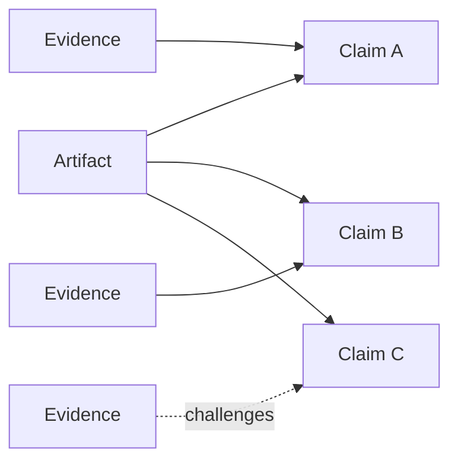

An Artifact is not reducible to its Claims — a prototype, visual design, or running application can communicate more than a proposition list — but the Factory can still make explicit the consequential Claims that artifact advances.

This supports both human review and agent reasoning.

---

# 8. Decision, Human Request, and Gate

## 8.1 Decision

A Decision is:

> **A durable semantic determination that changes or fixes the route of a Run or Project.**

A Decision can concern:

- product intention;
- design direction;
- architecture;
- candidate selection;
- implementation strategy where consequential;
- source integration;
- recognition/promotion;
- future project direction.

A Decision may be open, resolved, superseded, or reopened.

Conceptually:

```text
Decision
│
├── question / determination
├── alternatives
├── relevant Claims
├── relevant Evidence
├── resolver class
├── resolution
├── rationale
├── consequence
└── supersession / reopening relation
```

---

## 8.2 Resolver classes

Not all Decisions require the human.

A Decision can be resolved by:

```text
agent judgement
  reversible/local determination

evidence determination
  empirical/deterministic question

human authorship
  unresolved consequential intention or meaning

prototype + human recognition
  experiential determination that needs encounter
```

This lets the Factory remain agentically powerful without converting human authority into constant approval prompts.

---

## 8.3 Human Request

A Human Request is:

> **A request-channel object used when a Decision genuinely requires human authorship, recognition, or material intervention.**

The Decision is durable semantics.

The Human Request is how the system obtains the determination.

```text
Decision
"Should model switching retain conversation history?"
             │
             │ resolver = human
             ▼
HumanRequest
             │
     ┌───────┼─────────┐
     ▼       ▼         ▼
   inbox   Hermes     cmux
```

When the human answers, the Human Request resolves and the Decision remains in project/run history.

This distinction enables future interfaces without fragmenting decision history by channel.

---

## 8.4 Human authority as two high-energy apertures

Human involvement is concentrated around two main apertures.

### Commission aperture — Ground / Intent

The human authors intended reality.

If the initiating request already determines the important outcome, the request itself satisfies authority. The system should not ask for redundant confirmation.

If materially different outcomes remain, the Run contains an authorial Decision and a Human Request can surface it.

### Recognition aperture — Application / Recursion

The human encounters what has become real and recognises, returns, compares, or develops it further.

Again, not every technical completion requires a ritual approval. Recognition is important where the result materially affects project canon, user experience, direction, or consequential state.

The system may request human input elsewhere when a genuinely authorial determination is discovered, but those are exceptions caused by real uncertainty rather than stage gates.

---

## 8.5 Gate

A Gate is:

> **A rule or assessment that determines whether available Claims and Evidence satisfy the transition demanded by a Run Map.**

A Gate does not merely emit `pass/fail`. It should preserve:

```text
claim assessed
evidence considered
checks performed
result
unmet condition
return target if failed
```

A Gate can be deterministic, agent-assessed, human-recognised, or composite depending on the kind of Claim.

For example:

```text
P2 → P3 gate
  claim: program design is determinate enough to develop
  evidence: file tree, call path, interface contract, vertical slice definition

P3 → P4 gate
  claim: Candidate is runnable and internally coherent
  evidence: build/test/runtime checks

P4 → P5 gate
  claim: Candidate sufficiently realises recognised Intent/Design
  evidence: runtime experience, regression checks, human recognition where required
```

---

# 9. Candidate — coherent possible reality

## 9.1 Candidate is first-class

A Candidate is:

> **A coherent possible version of the Project produced within a Run and made sufficiently concrete to inspect, compare, test, or experience as a whole.**

A Candidate binds:

```text
Candidate
│
├── source/revision state
├── DesignArtifact(s) it realises
├── DevelopmentArtifact(s)
├── runtime Environment
├── application surface
├── Claims
├── Evidence
├── provenance / producing Executions
└── assessment state
```

A Candidate is therefore more than a branch and more than an Artifact. It is an addressable possible reality assembled from several primitives.

---

## 9.2 Candidate is first-order for best-of-N

From the agent's perspective, Candidate is especially important because best-of-N generation naturally yields a **Candidate Set**.

```text
Candidate Set
├── Candidate A
│   ├── approach claims
│   ├── implementation
│   └── evidence
├── Candidate B
│   ├── approach claims
│   ├── implementation
│   └── evidence
└── Candidate C
    ├── approach claims
    ├── implementation
    └── evidence
```

The agent can compare them before a human is involved.

The human may later meet the same set as a **lineup**:

```text
Run 184 — Candidate lineup

A   Open · Evidence
B   Open · Evidence   ← recommended
C   Open · Evidence

Compare · Discuss · Recognise · Return
```

The same primitive supports both UX subjects.

---

## 9.3 Candidate lifecycle

A Candidate can move through states such as:

```text
proposed
  ↓
building
  ↓
runnable
  ↓
under application
  ↓
recognised ─────► promoted/integrated
  │
  ├─────────────► returned for revision
  │
  └─────────────► discarded / retained historically
```

A discarded Candidate does not vanish from history if it informed a consequential Decision or later branch. Its source/runtime environment may be destroyed, while its Ref, claims, evidence, and lineage remain.

---

## 9.4 Candidate, Checkout, Environment, Host

The human-facing spatial model is intentionally simple:

> **Which possible version am I looking at?** — Candidate  
> **Where is it physically running?** — Host  
> **What isolated/runtime world does it have?** — Environment

Implementation relationships sit underneath:

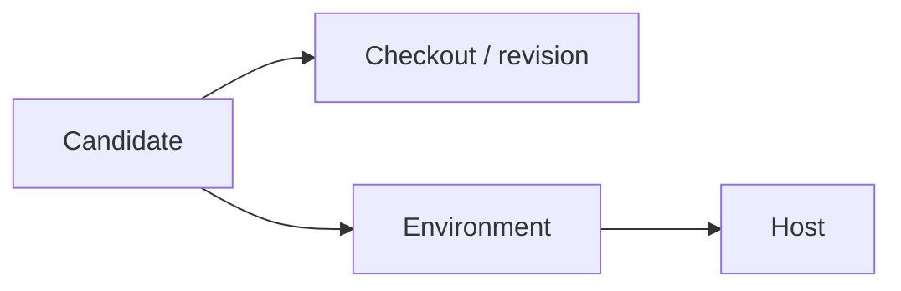

A Candidate can be moved or recreated on another Host while retaining its Candidate identity if it still represents the same coherent possible version.

---

# 10. Artifact durability and Project Canon

## 10.1 Artifact lifecycle

Artifacts need a durability/status dimension because working artifacts and canonical project artifacts are not equivalent.

A useful conceptual lifecycle is:

```text
working
   ↓
run-durable
   ↓
recognised
   ↓
project-canonical
```

Not every Artifact traverses every state.

Examples:

```text
prototype.html
  run-durable
  retained as evidence

intent.md
  recognised
  project-canonical

raw-agent-output.jsonl
  run-durable
  never project-canonical

design-experiment-C
  run-durable
  superseded but historically useful
```

---

## 10.2 P5 as selective promotion

Recursion does not mean dumping all Run output into the Project.

P5 performs selective foldback:

```text
RUN WORLD
all traces, candidates, artifacts, claims, experiments
                         │
                         │ recognise / interpret / promote
                         ▼
PROJECT CANON
selected durable intent, design, code, semantics, decisions
```

This is why the repository and semantic wiki do not become clogged with every intermediate artifact.

The full Run remains reconstructable in history. The Project Canon remains curated and developmental.

---

## 10.3 Canon is recognised durable orientation

Project Canon should contain the material future Runs need to treat as current authoritative orientation, while still preserving claim provenance and supersession history.

Canon may include:

- recognised Intent;
- current Design;
- active architecture decisions;
- canonical source state;
- project semantic definitions;
- accepted project profile declarations;
- recognised source integrations;
- current ground summaries.

Canon is not metaphysically infallible. It is **the recognised current orientation of the Project**, open to future challenge and supersession through new Runs.

---

# 11. Project Map — one navigational index over distinct lenses

## 11.1 Project Map is an index, not a universal graph database

The Project Map answers:

> **Where should I enter in order to understand or act on this Project?**

It joins several distinct lenses without flattening their meanings:

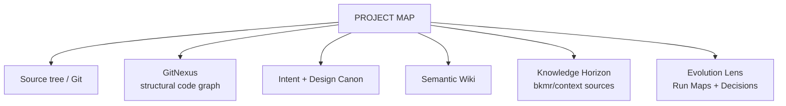

Each lens answers a different question.

### Source tree / Git

> What actually exists in source and revision history?

### GitNexus / Code Index

> What is structurally connected in code, and what is likely affected by change?

### Intent and Design Canon

> What is this supposed to be, and how is it supposed to be formed?

### Semantic Wiki

> What do the project's concepts mean and how do they relate?

### Knowledge Horizon

> What external/internal knowledge can be retrieved to understand this project or task?

### Evolution Lens

> How did the project become what it is, which branches were explored, and why were consequential decisions made?

---

## 11.2 Code remains its own portal

The source itself remains a first-class entry surface.

Small module/file headers should provide enough orientation to decide whether deeper reading is worthwhile and where related design/semantic material lives.

```text
module
  ↕
design artifact
  ↕
semantic note
  ↕
GitNexus structural context
```

The Project Map connects these surfaces; it does not require humans or agents to abandon normal code exploration for a proprietary portal.

---

## 11.3 Semantic Wiki

The project-local Markdown/Obsidian-compatible wiki is the semantic side of the Project Map.

Its purpose is:

> **Maintain the project-local language and meaning graph in a form both humans and agents can read, edit, link, version, and traverse.**

A simple shape remains:

```text
wiki/
├── index.md
├── concepts/
├── modules/
├── flows/
├── decisions/
├── experiences/
└── glossary.md
```

The wiki can link to code, designs, Run Maps, sources, and other semantic notes.

It is not merely documentation after the work. It participates in Ground, Intent, Design, and Recursion.

---

## 11.4 Bimba as optional transcendent semantic horizon

For generic projects:

```text
Project semantics
  └── local Markdown/wiki + code/design references
```

For an Epi-Logos profile:

```text
Project semantic web
        │
        │ optional profile-gated relation
        ▼
      Bimba
```

Bimba/Neo4j is therefore an orchestrator/project-profile capability rather than a universal dependency of the Factory.

---

# 12. Source Integration

A Source Integration is:

> **A durable declaration that the Project intentionally incorporates or depends upon an external codebase, system, protocol, knowledge source, or tool through a named real seam.**

It exists to protect the Factory from a common agent failure mode: saying “integrate X” while actually recreating an approximate weaker version of X.

Conceptually a Source Integration records:

```text
upstream identity
pinned revision/version where appropriate
integration mode
actual seam used
local augmentation
verification/evidence
upgrade path
project ownership boundary
```

Integration modes can include:

```text
direct dependency
CLI adapter
protocol adapter
capability source
vendored fork
source mount
reference implementation
```

Source Integration is visible to both human and agent.

The human sees:

> “This feature uses GitNexus through its real CLI/MCP seam at revision X.”

The agent sees:

> “Do not reimplement structural code graph logic; inspect and call the declared integration.”

This is part of the information and capability Context available during Ground, Design, Development, and Application.

---

# 13. QL Core, QL Form, and QL Address

## 13.1 QL Core

The Factory's use of QL must remain structurally operative while also remaining capable of development.

The invariant basis is the **QL Core**:

```text
0/1 parent relation
sixfold 0 1 2 3 4 5 articulation
recursive addressability
complementary/conjugate relations
```

The Factory technological form is one projection of that core:

```text
#0 Ground
#1 Intent
#2 Design
#3 Development
#4 Application
#5 Recursion
```

The canonical agent form is another:

```text
#0 Anuttara
#1 Paramasiva
#2 Parāśakti
#3 Mahāmāyā
#4 Nara
#5 Epii
```

The architecture should neither freeze all future QL expression into the Factory labels nor permit arbitrary extensions that lose the core relation.

---

## 13.2 QL Form

A QL Form is:

> **A named, versioned projection of the invariant QL Core into a particular domain.**

Examples:

```text
QLForm: factory-development
  0 Ground
  1 Intent
  2 Design
  3 Development
  4 Application
  5 Recursion

QLForm: canonical-agent
  0 Anuttara
  1 Paramasiva
  2 Parāśakti
  3 Mahāmāyā
  4 Nara
  5 Epii

QLForm: agent-identity
  versioned sixfold identity schema

QLForm: capability-affinity
  six-position suitability interpretation
```

Forms can be refined, superseded, or extended through explicit version relations while retaining their derivation from the core.

This is the mechanism by which QL can evolve inside the Factory **without becoming incoherent or merely decorative tagging**.

---

## 13.3 QL Address

A QL Address locates something inside a QL Form.

It can be used in several distinct modes that should remain explicit.

### Position

Where work currently occurs:

```text
Run position = factory-development:#3
```

### Provenance

Where an artifact or determination was produced:

```text
DesignArtifact provenance = factory-development:#2
```

### Recursive position

Where a nested traversal occurs:

```text
factory-development:#2.3
```

meaning a Development movement nested within a Design determination.

### Affinity

A Capability, Model, or Agency may carry a vector of suitability across a Form rather than one exclusive address.

These meanings should not be conflated. **Position is location; provenance is origin; affinity is disposition.**

---

## 13.4 Propagation of QL-form change

Because dependent primitives reference a named/versioned QL Form rather than silently encoding labels, changes can propagate coherently:

```text
QL Core
   │
   ▼
QL Form v1 ─────► QL Form v2
   │                  │
   ▼                  ▼
addresses         migrated / interpreted addresses
artifacts          capabilities
agencies           UI labels
```

A Form update can therefore specify:

- equivalence;
- renaming;
- refinement;
- split/merge where valid;
- supersession;
- migration guidance;
- compatibility constraints.

The next implementation design can choose how such propagation is materialised. The ontology only requires that QL meaning be explicitly versioned and referentially coherent.

---

# 14. Execution Intelligence — Model, Harness, Host, Environment, Checkout

## 14.1 Execution

An Execution is:

> **One concrete act of an Agent/Agency inside a resolved Context.**

It binds the durable semantic world to the transient computational world:

```text
Execution
│
├── Agent
├── Agency
├── Run / QL focus
├── AgentSession
├── Model
├── Harness
├── Capability view
├── Host
├── Environment
├── input Artifact/Claim references
└── output Artifact/Claim/Event references
```

Executions are numerous and disposable relative to Projects and Runs.

---

## 14.2 Model

A Model is a selectable intelligence substrate with observed characteristics and contextual fitness.

Models should be chosen against an **Execution Demand**, not permanently assigned to QL positions.

An Execution Demand can express needs such as:

```text
large-context code understanding
visual/interface judgement
fast deterministic edit loop
architectural synthesis
adversarial critique
low-latency interaction
particular provider/tool support
```

The model selector can combine declared capability with observed Factory fitness without turning one historical metric into universal rank.

---

## 14.3 Harness

A Harness is:

> **The agent-runtime surface through which model interaction, tools, sessions, streaming, and lifecycle control are exposed.**

Pi is the preferred initial Factory worker harness, but the ontology remains harness-independent.

The human should not normally have to think from the Harness primitive. They may inspect it when relevant:

```text
Candidate B produced by:
  Parāśakti / design agency
  Pi
  model X
```

The agent should know what its harness supports because those powers affect its operative Context.

---

## 14.4 Host

A Host is:

> **A physical or virtual machine capable of carrying Session Spaces, harness processes, indexes, stores, or Environments.**

The user's preferred personal topology is:

```text
MAIN MACHINE
  human control surface
  cmux
  editor / browser / Obsidian
  AIKit client/state

WORKER LAPTOP
  persistent Factory runtime
  Hermes/Epi-Logos orchestration
  tmux
  Pi workers
  candidate environments
  local operational store

OPTIONAL EXTERNAL HOSTS
  cloud VMs / sandbox providers
```

The architecture does not depend on that topology. It makes that topology a first-class, pleasant deployment of the generic Host relation.

---

## 14.5 Environment

An Environment is:

> **An isolated or otherwise bounded runtime world in which a Candidate or execution can operate.**

Its implementation may be:

```text
local shared process
worktree-based development environment
SSH host process
container
local VM
remote VM
custom provider
```

The user thinks in the experience:

> “Open Candidate B.”

The Factory resolves the Environment beneath it.

---

## 14.6 Checkout

A Checkout is:

> **The concrete source/revision materialisation used by a Candidate or Execution.**

It can correspond to a Git worktree, clone, branch/revision, or other source materialisation.

Checkout is deliberately below Candidate in the ontology:

```text
Candidate = possible product reality
Checkout = source materialisation used to realise it
```

---

# 15. Ref — universal durable addressability

## 15.1 Ref

A Ref is:

> **A stable logical identity through which an addressable Factory object can be located or discussed independently of its current process, projection, host, or storage representation.**

Examples:

```text
project:epi-logos
run:01K...
candidate:...
agent:parashakti
agency:parashakti/architecture-design
artifact:...
claim:...
decision:...
env:...
capability:...
```

Human-facing names remain expressive; Refs provide stable composability beneath them.

The same Ref can be passed through CLI, agent prompts, Run Maps, GitHub mirrors, logs, and APIs.

---

## 15.2 Universal operations over Refs

A strong AIKit/Factory affordance is that many operations can become reference-oriented:

```text
show <ref>
open <ref>
explain <ref>
history <ref>
relations <ref>
evidence <ref>
events <ref>
```

The exact command vocabulary is later product design; the architectural principle is that **addressability is uniform even when object behaviour differs**.

---

## 15.3 Ref and Redis

Redis can have a useful relation to Refs without defining their identity.

```text
                  REF
          durable logical identity
                   │
                   ▼
             Ref Resolver
                   │
       ┌───────────┼────────────┐
       ▼           ▼            ▼
   durable DB     Git       remote host
       │
       └──── optional Redis live directory
```

An optional Redis layer can answer live questions such as:

```text
Where is this object currently active?
Which worker owns this Environment?
Which AgentSession is attached?
Which lease is current?
Which live projection should update?
What is the current ephemeral status?
```

Redis may therefore serve as a **hot Ref directory, lease/coordination surface, and optional live event transport** in a distributed topology.

It should remain subordinate to durable identity:

> **If Redis disappears, the Ref still exists and durable state remains reconstructable.**

The personal single-user deployment should not require Redis merely to make the ontology work.

---

# 16. Event, Trace, Store, Generation, and Projection

## 16.1 Event

An Event is:

> **One timestamped occurrence in the operational history of the Factory.**

Examples:

```text
run.created
phase/position entered
agent started
tool/capability invoked
claim produced
candidate created
gate passed
human requested
human responded
candidate exposed
recognition received
recursion integrated
run finished
```

Events are fine-grained and append-oriented.

---

## 16.2 Trace

A Trace is:

> **An organised causal/temporal history assembled from Events and related execution records.**

Trace is the substrate for:

- debugging;
- reconstruction;
- observability;
- provenance;
- evidence extraction;
- P5 learning.

Trace should be richly available to agents while remaining drill-down material for humans unless the trace itself is the subject of review.

---

## 16.3 Store

A Store is a persistence role, not a universal database abstraction with one technology.

The constitutional storage division remains:

| Store role | Appropriate durable material |
|---|---|
| **Git / authored files** | source, design, intent, ADRs, semantic wiki, tests, durable project config |
| **SQLite per host** | operational/query state, run index, sessions, inbox, event index, leases, observations |
| **raw event/artifact ledger** | reconstructable execution evidence and streams |
| **GitNexus index** | derived structural code graph |
| **bkmr/index provider** | derived/retrievable information-horizon index |
| **Neo4j/Bimba** | optional transcendent semantic graph |
| **Redis, optional** | live routing, leases, ephemeral Ref/status directory, optional event transport |

The primitive relations determine what is canonical; storage technology implements those relations.

---

## 16.4 Generation

A Generation is:

> **A materialised snapshot of a resolved operational view at a point in time.**

It can answer:

> “Exactly what capability/profile/context resolution did this execution receive?”

Generation is therefore useful for provenance, reproducibility, and debugging, but it is **derived from Context resolution** rather than replacing the semantic Context primitive.

---

## 16.5 Projection

A Projection is:

> **A representation of a canonical primitive through another interface or system, retaining a reversible relation to its source identity where bidirectional behaviour is intended.**

Examples:

```text
RunMap        → GitHub issue tree
HumanRequest  → Telegram/Hermes message
HumanRequest  → AIKit inbox item
ProjectMap    → TUI view
Candidate     → browser/application pane
Context       → harness prompt/tool projection
CapabilitySet → Pi/Codex/Claude skill/tool projection
```

A core constitutional rule follows:

> **Canonical objects are singular in meaning; interfaces multiply through Projections.**

This prevents the system from quietly creating several competing “truths” because the same object appears in several products.

---

# 17. Procedure — controlled mutation of the operating world

A Procedure remains distinct from a Run.

A Run changes the Project according to developmental intention.

A Procedure changes the **operating world through which development occurs**.

Examples:

```text
Run:
  Improve the project selector experience.

Procedure:
  Install or update the cmux integration.

Procedure:
  Adopt this external capability source.

Run:
  Integrate GitNexus-backed code impact exploration into AIKit.
```

A Run can discover the need for a Procedure.

P5 can propose a Procedure such as:

```text
This project repeatedly uses capability X successfully.
Proposal: promote X into the project profile.
```

The Procedure can be planned, reviewed, executed, and reversed according to AIKit's operational mutation discipline.

This preserves a useful distinction:

> **Project development and control-plane mutation can interact without becoming the same kind of change.**

---

# 18. Asset memory — frecency, relevance, fitness, preference, trust

## 18.1 Every fundamental asset can learn from use

The Factory should accumulate usage and outcome signals across addressable assets such as:

```text
Projects
Agents
Agencies
Capabilities
Capability Sets
Models
Harnesses
Sources
commands/actions
Run patterns
Environments
perhaps Artifact types and review surfaces
```

This creates an operating environment that becomes faster and more intuitive for **both humans and agents**.

The analogy is a shell/navigation tool that learns frequently used paths, but here the memory is profile-, task-, project-, QL-, and outcome-conditioned.

---

## 18.2 UsageSignal

A Usage Signal is:

> **A low-level observation that an asset was selected, invoked, resumed, accepted, rejected, completed, or otherwise participated in work.**

Examples:

```text
capability invoked
agency selected
candidate opened
command repeated
model chosen
source retrieved
run pattern reused
```

Usage Signals can support frecency and suggestion without themselves claiming quality.

---

## 18.3 FitnessObservation

A Fitness Observation is:

> **A contextual assessment of how well an asset or composition served a particular Execution Demand or Run outcome.**

Example:

```text
Context:
  #2 program design
  Rust project
  large codebase

Selection:
  Parāśakti architecture agency
  Pi
  Model X
  capability set Y

Outcome:
  design accepted
  no P3 → P2 return
  one human correction

Observation:
  strong fit for this kind of design work
```

Fitness is contextual. It is not a universal scalar rank.

---

## 18.4 Keep the signals distinct

Asset memory should preserve independent dimensions:

```text
frecency
  how recently and often used

contextual relevance
  where it tends to be selected

fitness
  how well it tends to perform for a demand

preference
  explicit human/project choice

availability
  whether it can currently be used

trust
  whether it is permitted / sufficiently reviewed
```

These can jointly influence suggestions and resolution without collapsing into one opaque score.

In particular:

> **Familiar is not necessarily fit. Fit is not necessarily trusted. Trusted is not necessarily preferred.**

---

## 18.5 Learned human and agent ergonomics

The eventual AIKit experience can use this memory in both directions.

For the human:

```text
project-conditioned suggestions
autosuggestion
tab completion
recent/frequent agencies
likely Run/Project refs
common commands
```

For the agent:

```text
preferred capability routes
known successful Agency compositions
relevant sources surfaced earlier
model/harness suggestions
common project operations
```

This is where AIKit can evolve from a capability router toward a **learned operating environment for human and artificial actors**, while still grounding every suggestion in inspectable signals.

---

# 19. Primitive ownership and cardinality — conceptual relations

This section fixes the architectural multiplicities without prescribing database schema.

## 19.1 Project-centred relations

```text
Project
  1 ── owns/gathers ── * Run
  1 ── has ─────────── 1..* source constituent
  1 ── has ─────────── 1 ProjectMap
  1 ── has ─────────── 0..1+ semantic wiki roots
  1 ── has ─────────── 1 current Project Canon
  1 ── has ─────────── 0..* Profiles / project declarations
  1 ── declares ────── 0..* Context Sources
  1 ── references ──── 0..* Source Integrations
  1 ── contains ────── 0..* project-local Agencies
```

A Project may reference global Agents, Capabilities, Models, Harnesses, and Hosts without owning them.

---

## 19.2 Run-centred relations

```text
Run
  1 ── has ─────────── 1 canonical RunMap
  1 ── belongs to ──── 1 Project
  1 ── creates ─────── 0..* Decisions
  1 ── produces ────── 0..* Artifacts
  1 ── produces ────── 0..* Claims
  1 ── produces ────── 0..* Candidates
  1 ── contains ────── 1..* Executions over its lifetime
  1 ── emits ───────── 0..* Events
  1 ── may use ─────── 0..* AgentSessions
  1 ── may be viewed by 0..* SessionSpaces
```

The Run Map references these objects where they bear on the transformation; they do not need to be physically embedded in one document.

---

## 19.3 Agent-centred relations

```text
Agent
  1 ── can have ────── 0..* Agencies
  1 ── can participate in * Runs

Agency
  * ── derives from ── 1 Agent
  * ── may use ─────── * Capability Sets
  * ── may be scoped to 0..1 Project / Profile / Run context
  * ── can instantiate * AgentSessions / Executions
```

Canonical agent identity is therefore one-to-many with local agencies.

---

## 19.4 Claim-centred relations

```text
Artifact
  1 ── may advance ─── * Claims

Claim
  * ── may appear in ─ * Artifacts
  * ── supported by ── * Evidence
  * ── challenged by ─ * Evidence
  * ── relates to ──── * Claims
  * ── may inform ──── * Decisions

Decision
  1 ── considers ───── 1..* Claims/alternatives as relevant
  1 ── may request ─── 0..* HumanRequests over its lifecycle
```

A Human Request may need to be re-issued or projected through several channels while still resolving one Decision.

---

## 19.5 Candidate-centred relations

```text
Run
  1 ── produces ────── 0..* Candidates

Candidate
  1 ── represents ──── 1 coherent possible project state
  1 ── uses ────────── 1..* source/revision refs
  1 ── may use ─────── 0..1 live Environment at a given exposure
  1 ── relates to ──── 1..* Design/Development Artifacts
  1 ── advances ────── * Claims
  1 ── accumulates ─── * Evidence
```

The same Candidate may be recreated in a new Environment without becoming a new Candidate if its relevant state has not changed. A materially different implementation/form becomes a new Candidate or a new Candidate revision according to later versioning design.

---

# 20. Canonical, derived, materialised, and projected

One of the most important relational distinctions is **what kind of existence a thing has**.

## 20.1 Canonical

Canonical means the authoritative semantic object for that concern.

Examples:

```text
Project identity
RunMap
Decision
recognised Project Canon artifact
Candidate identity
Claim identity
```

---

## 20.2 Derived

Derived means reconstructable from canonical or durable source material.

Examples:

```text
Project Evolution Map
GitNexus structural index
search index
fitness aggregate
frecency rank
suggestion ordering
```

Derived state can be rebuilt.

---

## 20.3 Materialised

Materialised means a concrete snapshot or runtime instantiation of a conceptual/canonical relation.

Examples:

```text
Context → Generation
Candidate → running Environment
Project source → Checkout
Agent identity → AgentSession/Execution
```

---

## 20.4 Projected

Projected means shown or controlled through another interface/system.

Examples:

```text
RunMap → GitHub Issues
HumanRequest → Hermes
ProjectMap → TUI
Candidate → browser pane
CapabilitySet → harness tool projection
```

---

## 20.5 The general pattern

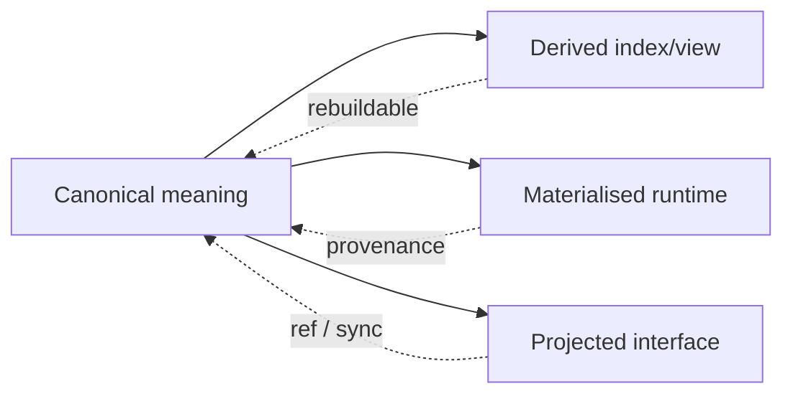

This pattern prevents a recurring class of architectural confusion: treating a useful representation of a thing as though it were the thing itself.

---

# 21. Lifetimes — what survives what

The ontology gains clarity by explicitly ordering lifetimes.

A typical persistence hierarchy is:

```text
Project identity                      years / enduring
Project Canon                         enduring, versioned
Agent identity                        enduring
QL Forms                              enduring, versioned
Source Integrations                   enduring, versioned

Run                                   hours → months, durable history thereafter
RunMap                                same durable history
Decision                              durable history
Candidate identity                    run lifetime + historical residue
run-durable Artifact                  durable history

Session Space                         hours → weeks, resumable
AgentSession                          minutes → days/weeks, harness-dependent
Environment                           minutes → days/weeks, recreatable
Checkout                              environment/run lifecycle
Execution                             seconds → hours
Generation                            snapshot

live process / lease / port           ephemeral
Redis presence/status                 ephemeral
```

The architecture should ensure that shorter-lived primitives never accidentally become the only place where longer-lived meaning exists.

For example:

- a Decision must not exist only in a chat transcript;
- a Run must not exist only in a Pi session;
- a Candidate must not exist only as a running container;
- Context provenance must not exist only in process memory;
- Project identity must not be inferred solely from current directory.

---

# 22. The dual-UX contract

Every major product primitive should be tested through three questions:

1. **What does the human experience?**
2. **What does the agent experience?**
3. **What invariant lets both be talking about the same thing?**

| Primitive | Human experience | Agent experience | Machine invariant |
|---|---|---|---|
| **Project** | “the thing I entered/am making” | semantic/work boundary | stable Ref + canon + constituents |
| **Context** | “what is available here” | capabilities + retrievable horizon + focus | resolved declarations/generation refs |
| **Run** | “this change/exploration” | durable objective/transformation | Run Ref + RunMap |
| **RunMap** | navigable progress/history | work topology/frontier | canonical graph/state |
| **Decision** | consequential choice and rationale | branch/resolution constraint | durable decision record |
| **Agent** | recognisable persistent intelligence | persistent role/identity | Agent Ref + identity form |
| **Agency** | specialised mode where surfaced | local identity/capability disposition | scoped composition |
| **Capability** | available power | callable/useable power | capsule/source identity + trust |
| **Artifact** | inspectable output | structured durable working form | Artifact Ref + provenance |
| **Claim** | assertion worth understanding | explicit epistemic unit | Claim Ref + modality/relations |
| **Evidence** | why a claim is credible | support/challenge input | Evidence Ref + provenance |
| **Candidate** | openable comparable version | alternative possible state | Candidate Ref + state bundle |
| **HumanRequest** | one meaningful ask | waiting authorial dependency | request linked to Decision |
| **ProjectMap** | “where should I enter?” | navigational index | references into distinct lenses |

This table is not merely UX documentation. It is an ontology validation method.

If a primitive only makes sense from the backend's perspective, it probably belongs in Register B or C.

---

# 23. “Improve” — the developmental operator

## 23.1 Definition

The Factory's high-level operation `improve` means:

> **Bring reality closer to the dream, to let it become more than one could have ever dreamt of.**

This is intentionally richer than optimisation.

The Factory begins from actual Ground and recognised Intent, but Application can disclose possibilities not contained in the original articulation of Intent.

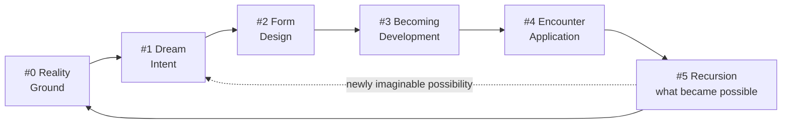

---

## 23.2 Improvement begins with discrepancy, but does not end there

A useful first movement is:

```text
recognised Intent / Design
           ↕
current Ground / Application
           │
           ▼
consequential discrepancies
```

Those discrepancies can seed Runs.

But a merely discrepancy-minimising system would make Intent static and treat software development as convergence to a fixed target.

The Factory instead allows Application and Recursion to reveal **emergent possibility**.

Examples:

- a prototype exposes a simpler interaction than originally imagined;
- an implementation reveals that a broader feature has become cheap;
- a user encounter discloses a need not captured in the initial scope;
- a source integration makes a previously impossible architecture available;
- a Candidate demonstrates a quality that should become part of future Intent.

---

## 23.3 Emergent possibility does not silently rewrite authorship

P5 can produce a Claim such as:

```text
Emergent possibility:
  The candidate interaction suggests X could become a project-wide pattern.

Grounding:
  observed during Application of Candidate B

Proposed relation:
  future Intent / Design

Authorial status:
  unrecognised
```

The system can surface this in future Ground or an improvement proposal.

It does not silently promote aspiration into authored Intent.

Thus recursion can update Ground while widening the horizon of possible Intent:

\[
(G_{n+1}, I^{*}_{n+1}) = Fold(R_n, G_n, I_n)
\]

where \(I^{*}_{n+1}\) is a **newly disclosed horizon of imaginable intention**, not automatically canonical Intent.

This preserves both agent creativity and human authorship.

---

# 24. Full relational diagram

The complete conceptual field can now be drawn as follows.

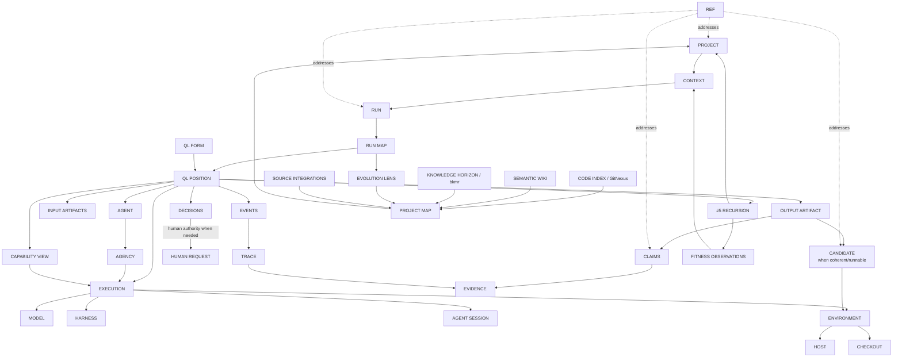

The diagram should be read as a relation field, not a prescribed process implementation.

---

# 25. State transitions across the principal primitives

## 25.1 Project lifecycle

A Project is not “created” in one atomic step. It is progressively established.

```text
source/new idea
   ↓
bootstrap pending
   ↓
bootstrapping
   ↓
visioned / operable
   ↓
active development
   ↓
recursive development over many Runs
```

A Project may later become dormant, archived, forked, merged, or transferred, but its historical identity remains addressable.

The important transition is **bootstrap → visioned/operable**: the point at which the Project has enough Ground, Intent, Design, Context Sources, mapping, profile, and working surface for ordinary Factory Runs to make sense.

---

## 25.2 Run lifecycle

```text
seeded
  ↓
grounded
  ↓
intent-determinate
  ↓
designed
  ↓
developing
  ↓
candidate(s) available
  ↓
under application
  ↓
recognised / returned / branched
  ↓
recursing
  ↓
finished
```

This is not a one-way finite-state machine. QL returns are constitutional:

```text
P4 discovers design mismatch → return to P2
P3 discovers scope ambiguity → return to P1
P2 discovers ground assumption false → return to P0
P5 discovers new possibility → seed future P1 while folding current P5 into P0
```

The Run Map records the topology rather than hiding returns as failure noise.

---

## 25.3 Decision lifecycle

```text
identified
   ↓
open
   ├── evidence resolves ───────► resolved
   ├── agent judgement ─────────► resolved
   ├── human request ───────────► resolved
   └── prototype/experiment ────► evidence ─► resolved
                                      │
                                      ▼
                              later superseded/reopened
```

A Decision can remain unresolved while other independent branches continue if its dependency position permits.

---

## 25.4 Claim lifecycle

Claims do not need one rigid universal status machine, but the common development is:

```text
asserted / proposed
      ↓
open for support/challenge
      ↓
assessed
  ┌────┼────────┐
  ▼    ▼        ▼
supported challenged unresolved
  │      │
  ▼      ▼
verified refuted
   \      /
    \    /
   may later be superseded
```

Intent Claims are not “verified” in the same way observational Claims are; their authority comes from recognition/authorship. The Claim mode determines what kinds of Evidence or authority are relevant.

---

## 25.5 Artifact lifecycle

```text
working
  ↓
run-durable
  ├── retained as history/evidence
  ├── superseded
  └── recognised
         ↓
   project-canonical
         ↓
   later superseded by canonical successor
```

No destructive promotion is implied. Historical versions remain referentially recoverable.

---

# 26. Project Bootstrap — worked experiential shape

Consider a repository imported from GitHub that predates the Factory.

The human experience should be approximately:

```text
Add project

Source:
  github.com/example/existing-app

Factory discovers:
  ✓ working application
  ✓ substantial code history
  ✓ README and setup notes
  ~ product intention partly documented
  ~ architecture only implicit in code
  ✕ no Project Map
  ✕ no semantic wiki
  ✕ no Factory profile/context sources

Bootstrap Run ready

Open map · Begin · Adjust vision
```

The system then performs a real developmental traversal.

### #0 Ground

Agents inspect source, history, docs, GitHub, runtime, existing issues, code graph, and any supplied external knowledge.

The output is claim-oriented:

```text
supported observations
existing intent claims recovered from docs/history
architecture claims inferred from code
open contradictions
missing project-language definitions
sources worth indexing into the information horizon
```

### #1 Intent

The system attempts to recover the project's dream from its existing evidence before asking the human to restate it.

The human may see something like:

```text
Recovered project intention

1. ...
2. ...
3. ...

Open authorial questions
  • Is X still a desired audience?
  • Is Y a prototype limitation or intended constraint?
```

Only unresolved consequential authorship becomes a Human Request.

### #2 Design

Existing architectural form is made explicit and experiential gaps are resolved.

This can produce:

- experiential/product design;
- architecture diagrams;
- program structure;
- Source Integration declarations;
- Project Map structure;
- initial semantic wiki shape;
- normal Run/application expectations.

### #3 Development

Bootstrap-specific project infrastructure is created:

```text
Project identity/configuration
Project Profile
Context Source declarations
wiki skeleton/content
Project Map bindings
GitNexus indexing setup
bkmr project shim/index declarations
GitHub Run Map mirror setup
session-space defaults
Factory/AIKit metadata
```

### #4 Application

The result must actually be enterable:

```text
Open Project
  → correct source is present
  → map is navigable
  → important project meaning is visible
  → agent can retrieve relevant context
  → session space can be created/resumed
  → a new Run can be started coherently
```

### #5 Recursion

Recognised bootstrap output becomes the first Factory-native Project Canon and Ground.

The imported repository has now become a **visioned Project** without losing its history or pretending it began inside the Factory.

---

# 27. Ordinary improvement — worked experiential shape

Once bootstrapped, a human can enter the Project and say:

```text
improve this
```

The phrase is meaningful because the system can assemble:

```text
current Ground
+ recognised Intent
+ Design Canon
+ Project Map
+ source/code structure
+ information horizon
+ prior decisions/runs
+ runtime/application evidence
```

The system can then surface one or more Run seeds such as:

```text
1. Intent discrepancy
   The design says candidate comparison should be immediate;
   the current UI forces several navigation steps.

2. Application discrepancy
   Session recovery works technically but obscures which Project resumed.

3. Emergent opportunity
   Recent Candidate work suggests the same comparison surface could
   generalise to best-of-N design experiments.
```

Where enough intention already exists, the best-supported Run can begin autonomously.

Where the alternatives imply materially different authored futures, the system asks the human to determine direction.

The Run then traverses the same map, produces a Candidate lineup where useful, exposes those Candidates in real environments, frames review through Claims and Evidence, and folds recognised outcomes back into canon.

---

# 28. Agent-perspective walkthrough

The Factory should also make sense if described from the agent's inside perspective.

A Parāśakti design Agency may receive something conceptually like:

```text
You are:
  Agent: Parāśakti
  Agency: architecture-design
  QL Form/Position: factory-development:#2

You are acting within:
  Project: Software Factory
  Run: candidate-lineup-review

Current Context
  Operative:
    capabilities: GitNexus, product-design, source-integration, Mermaid, project-wiki
    harness: Pi
    environment: design workspace

  Information horizon:
    Project Canon
    source repository
    GitNexus code graph
    semantic wiki
    prior Run Maps
    selected HumanLayer/SSSF/Pi integration sources

  Focus:
    establish the design contract for Candidate comparison

Supported claims:
  ...

Open claims:
  ...

Intent claims:
  ...

Decisions:
  ...

Required output:
  Design Artifact
  consequential Claims
  evidence references
  unresolved Decisions only where genuinely underdetermined
```

This is the key sense in which the Factory is not an orchestration system standing outside model intelligence.

It gives the agent **its own operational ontology as language**.

The agent can then ask for a Ref, inspect a Claim, retrieve evidence from the information horizon, invoke a Capability, create a Decision node, or compare Candidates using the same conceptual forms visible elsewhere in the product.

---

# 29. The Project as recursive authored organism

Putting the relations together, the Project becomes:

```text
PROJECT
│
│    PROJECT CANON
│    dream / design / language / recognised form
│          ▲
│          │ P5 selective promotion
│          │
├──── RUN MAPS ─────────────────────────────────────┐
│         │                                         │
│         ├─ Decisions                              │
│         ├─ Candidates                             │
│         ├─ Claims / Evidence                      │
│         ├─ returns / loops                        │
│         └─ emergent possibilities                 │
│                                                   │
├──── PROJECT EVOLUTION LENS ◄──────────────────────┘
│
├──── PROJECT MAP
│       ├─ source structure       Git / tree
│       ├─ code relations         GitNexus
│       ├─ semantic structure     Wiki
│       ├─ knowledge horizon      bkmr / Context Sources
│       ├─ intention / design     Project Canon
│       └─ evolution              Run Maps
│
├──── SOURCE WORLD
│       ├─ repositories
│       ├─ external knowledge
│       ├─ neighbouring Projects
│       └─ Source Integrations
│
└──── CONTEXT RESOLUTION
        ├─ Profile / Scope
        ├─ Agents / Agencies
        ├─ Capabilities
        ├─ Models / Harnesses
        ├─ Hosts / Environments
        └─ current Focus
```

The Project is therefore neither a folder nor a database namespace.

It is an **authored developmental continuity** whose source, meaning, execution, history, and future possibility are made mutually navigable.

---

# 30. Constitutional invariants

The following invariants should be treated as architecture-level commitments unless deliberately revised through a later ratified design.

### 30.1 Project invariant

**Project identity is larger than repository identity.** Repositories are constituents of an authored Project.

### 30.2 Bootstrap invariant

**Adoption/setup is itself a Factory traversal.** Existing projects are grounded and visioned rather than merely registered.

### 30.3 Context invariant

**Context means both operative possibility and information horizon, narrowed by focus.** A large horizon is retrievable, not indiscriminately injected.

### 30.4 Run invariant

**A Run survives its interfaces, sessions, and hosts.** It is a durable intended transformation.

### 30.5 Run Map invariant

**The Factory owns the canonical Run Map.** GitHub and other products are projections/mirrors.

### 30.6 Evolution invariant

**Project history is derivable as developmental topology from Run Maps, Decisions, Candidates, and Git history.** It is not merely a commit log.

### 30.7 Agent invariant

**Agent identity survives changes in model, harness, capability composition, and session.**

### 30.8 Agency invariant

**Local identity/function/capability compositions are Agencies, not new canonical Agents.**

### 30.9 Capability invariant

**Skills and tools share one capability language.** Type affects implementation; capability expresses available power.

### 30.10 Claim invariant

**Consequential knowledge is represented as Claims with provenance and epistemic relations.** The architecture does not create truth by naming a field `fact`.

### 30.11 Agent-language invariant

**Claims, Evidence, Decisions, Refs, and Context are agent-facing operational language as well as stored data.**

### 30.12 Evidence invariant

**Evidence bears on Claims; Trace reconstructs events.** They are related but not identical.

### 30.13 Decision invariant

**Decision is durable semantics; HumanRequest is a mechanism for obtaining human determination.**

### 30.14 Authority invariant

**Human attention concentrates around genuine authorship and recognition rather than routine engineering approval.**

### 30.15 Candidate invariant

**Materially distinct developed alternatives become addressable Candidates.** Best-of-N is naturally expressed as a Candidate lineup.

### 30.16 Canon invariant

**P5 selectively promotes recognised material into Project Canon while preserving the fuller Run history elsewhere.**

### 30.17 Project Map invariant

**Project Map joins distinct navigational lenses without pretending they are one universal graph store.**

### 30.18 Source-fidelity invariant

**Declared Source Integrations use real upstream seams and carry evidence of actual reuse.**

### 30.19 QL invariant

**QL Core is constitutional; QL Forms are named, versioned domain projections; QL Addresses are interpreted through Forms.**

### 30.20 Ref invariant

**Refs are durable logical identities independent of live routing/storage.** Redis may accelerate resolution but does not define identity.

### 30.21 Memory invariant

**Usage, relevance, fitness, preference, availability, and trust remain distinct signals.** The system learns without collapsing experience into one score.

### 30.22 Dual-UX invariant

**Every product primitive must make sense from both human and agent perspectives over one machine invariant.**

### 30.23 Improvement invariant

**Improvement develops reality toward recognised intention while allowing Application and Recursion to disclose possibilities beyond previously articulated intention.** Emergent possibility can be proposed by agents but does not silently rewrite human authorship.

---

# 31. What this document intentionally leaves to implementation design

This specification fixes identity, relation, ownership, experienced meaning, and conceptual lifecycle. It intentionally does **not** decide implementation details whose correct form should follow from these relations.

Examples include:

- exact Rust/Python/TypeScript type definitions;
- relational tables and indexes;
- serialization formats;
- event-bus technology;
- exact Redis adoption timing;
- API route structure;
- process boundaries;
- exact GitHub issue-field mapping;
- exact bkmr shim implementation;
- specific UI component hierarchy;
- exact Ref syntax and encoding;
- QLForm migration file format;
- exact Candidate revision semantics;
- exact profile precedence syntax;
- exact algorithm for model/capability fitness ranking.

Those decisions should now be much easier because the implementation has a clear test:

> **Does this technical choice faithfully materialise the primitive relations established here, or is the implementation quietly changing the ontology?**

---

# 32. Ratification summary

The Factory now has a coherent primitive field.

At its centre is the **Project** as an enduring authored whole. Projects enter the system through a native **Bootstrap Run**, whether they begin as GitHub repositories, local source, or fresh ideas. Bootstrap establishes the minimum Ground, Intent, Design, Project Map, semantic knowledge, Context Sources, profile, and session shape necessary for humans and agents to enter the Project coherently.

Within a Project, **Context** is the resolved nexus of operative possibility, retrievable information horizon, and current focus. AIKit is the natural resolver of the operative side; a project-aware `bkmr` shim expands the knowledge horizon; GitNexus, the semantic wiki, source integrations, prior Run Maps, and optional Bimba each provide distinct complementary access to project reality.

A **Run** is one durable intended transformation. Its canonical **Run Map** belongs to the Factory and can be mirrored by default into GitHub Issues while also appearing through TUI, HTML, Hermes, or future interfaces. Aggregated Run Maps form a derived **Project Evolution Map**, giving humans and agents an intelligible history of live and dead branches, decisions, loops, returns, Candidates, and recognised changes.

An **Agent** is persistent identity. **Agency** is the local determination of that identity through function, attitude, capability disposition, and context. This allows canonical agents to survive changing local powers and supports richer Epi-Logos identity forms without turning every capability combination into a new agent. Models, harnesses, sessions, hosts, and environments instantiate the act; they do not define the identity.

A **Capability** is any usable power, regardless of whether its implementation is called a skill, CLI, script, tool, MCP, hook, or extension. Profiles and scopes dispose capabilities and identity; resolved Context makes them available. Over time, AIKit can remember how both humans and agents navigate this world using distinct frecency, relevance, fitness, preference, availability, and trust signals.

An **Artifact** is a produced form. A **Claim** is the fundamental epistemic assertion advanced within or about such forms. **Evidence** supports or challenges Claims. **Decisions** commit routes among consequential alternatives. **Human Requests** surface only those Decisions requiring authorship, recognition, or material human action. This language extends directly into prompts and agent-facing Context, so the model participates in the same epistemic architecture the system stores.

A **Candidate** is a coherent possible project reality, addressable as a whole and particularly natural for best-of-N work. Agents can reason over Candidate Sets; humans can encounter Candidate lineups. Hosts, Environments, and Checkouts materialise Candidates without defining their identity.

At **Recursion**, the full Run is preserved as history while recognised Artifacts, decisions, code, semantics, and design are selectively promoted into **Project Canon**. The next Ground therefore contains what has become real, while P5 may also articulate newly disclosed possibilities for future Intent.

The core developmental operation is therefore correctly named by the vision:

> **Improve: bring reality closer to the dream, to let it become more than one could have ever dreamt of.**

The Factory does this without replacing authorship with model preference. It allows agents to discover and substantiate possibilities beyond the prior dream, then presents those possibilities as Claims and Candidates which can become future intention through recognition.

That closes the primitive architecture at the level of vision and relation. The next design work can descend into exact program boundaries, schemas, adapters, APIs, state machinery, and build slices while remaining answerable to this shape rather than inventing it from below.

---

## Appendix A — compact primitive glossary

| Primitive | Architectural meaning |
|---|---|
| **Project** | enduring authored whole containing source, canon, semantics, runs, and context declarations |
| **Context** | resolved operative world + information horizon + current focus |
| **Run** | one durable intended transformation of a Project |
| **RunMap** | canonical inspectable topology of that transformation across QL |
| **Decision** | durable semantic determination changing/fixing a route |
| **Agent** | persistent identity/function independent of model/harness/session |
| **Agency** | local scoped determination of Agent identity/function/capability disposition |
| **Capability** | any usable power made available to an actor |
| **Artifact** | inspectable produced form persisting beyond immediate tokens/process |
| **Claim** | epistemic proposition with provenance, modality, relations, and assessment |
| **Evidence** | selected material bearing on a Claim |
| **Candidate** | coherent possible version of the Project suitable for comparison/experience |
| **HumanRequest** | request mechanism for Decisions requiring human authorship/recognition |
| **ProjectMap** | navigational index joining code, semantics, knowledge, canon, and evolution |
| **SourceIntegration** | explicit real reuse/dependency relation to an upstream source/system |
| **QLForm** | named/versioned domain projection of invariant QL Core |
| **Profile** | reusable disposition/policy informing Context resolution |
| **Scope** | boundary within which a declaration applies |
| **CapabilitySet** | reusable composition of Capabilities |
| **Execution** | one concrete act of an Agent/Agency within Context |
| **Model** | selectable intelligence substrate |
| **Harness** | runtime surface exposing model sessions/tools/lifecycle |
| **AgentSession** | resumable harness conversation/execution context |
| **SessionSpace** | human-operable workspace viewing/controlling Runs |
| **Host** | physical/virtual machine carrying runtime components |
| **Environment** | bounded runtime world for Candidate/Execution |
| **Checkout** | concrete source/revision materialisation |
| **Gate** | assessment of whether Claims/Evidence satisfy a transition |
| **Procedure** | controlled mutation of the operating/control-plane world |
| **Projection** | representation of canonical meaning in another interface/system |
| **Ref** | stable logical identity/address |
| **QLAddress** | location/provenance within a named QL Form |
| **Event** | one operational occurrence |
| **Trace** | organised causal/temporal history of Events |
| **Generation** | materialised snapshot of resolved Context/configuration |
| **Store** | persistence role used to materialise durable/derived state |
| **CodeIndex** | derived structural code graph/index, e.g. GitNexus |
| **FitnessObservation** | contextual outcome assessment for an asset/composition |
| **UsageSignal** | low-level observation of selection/use/resumption/etc. |

---

## Appendix B — canonical relation shorthand

```text
Project
  contains source constituents
  owns Project Canon
  owns Runs
  owns ProjectMap
  declares Context Sources
  references SourceIntegrations
  scopes local Agencies and Profiles

Context
  resolves from Project + Profile + Scope + Actor + Run/QL Focus
  contains Operative Context
  exposes Information Horizon
  narrows through Focus

Run
  belongs to Project
  owns canonical RunMap
  contains Executions
  produces Artifacts / Claims / Decisions / Candidates / Events

Agent
  persists across Executions
  gives rise to Agencies

Agency
  composes local identity + function + capability disposition
  instantiates through AgentSession / Execution

Artifact
  advances or contains Claims
  accumulates durability status
  may be promoted to Project Canon

Claim
  is supported/challenged by Evidence
  relates to other Claims
  informs Decisions

Decision
  changes route
  may require HumanRequest
  remains after request/channel is gone

Candidate
  binds coherent source state + design/development + environment + evidence
  belongs to a Run
  may enter a CandidateSet / lineup

RunMaps
  aggregate into derived Project Evolution Map

ProjectMap
  joins source tree + CodeIndex + Canon + Wiki + Knowledge Horizon + Evolution

Ref
  addresses durable identities independently of storage/live routing

QLForm
  projects invariant QL Core into a versioned domain form
  gives meaning to QLAddresses

P5 Recursion
  interprets Run outcome
  promotes recognised material to Project Canon
  emits FitnessObservations
  expands future Ground
  may disclose proposed future Intent
```

