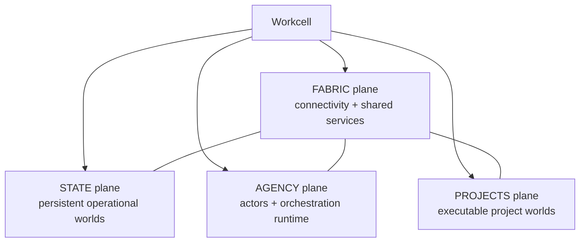
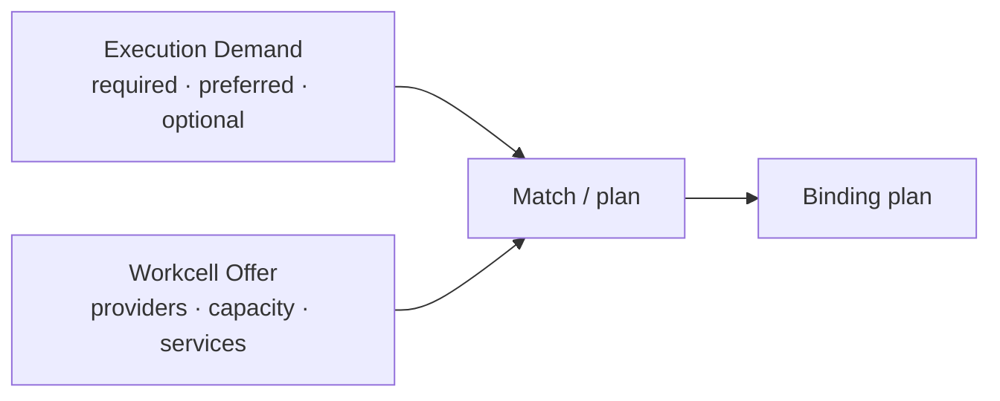
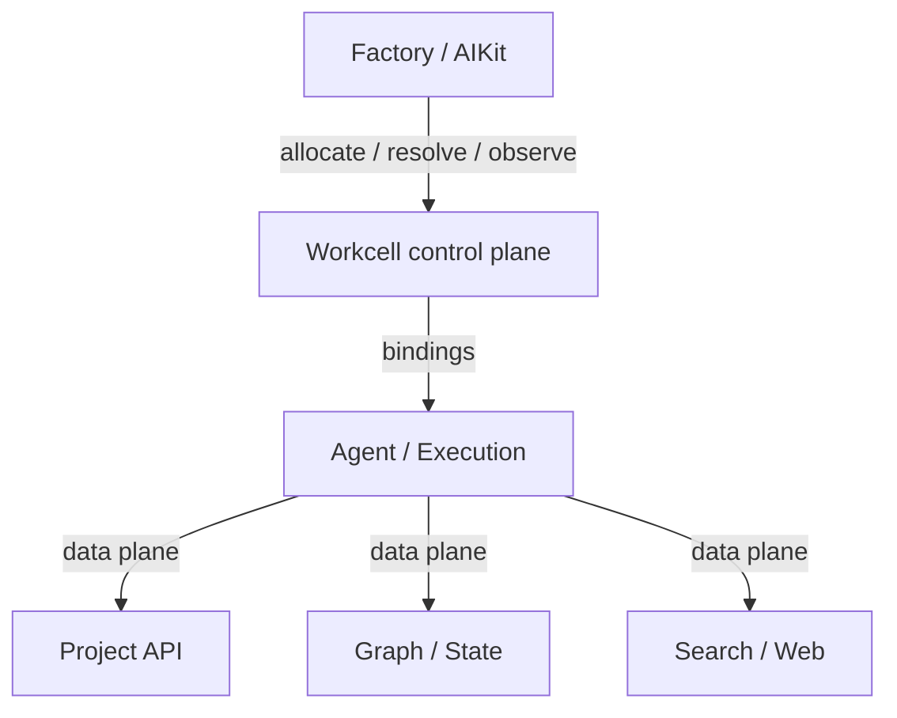
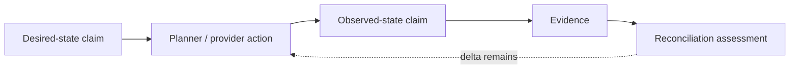
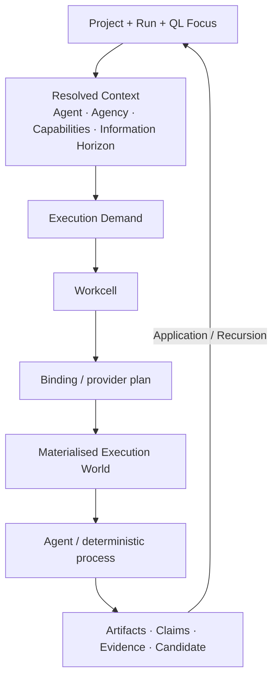

# QL Software Factory — Workcell Runtime Module Specification

> **Status:** companion infrastructure specification to the Constitutional Architecture and Primitive Relations documents  
> **Register:** modular execution/infrastructure subsystem; not an extension of the Factory's canonical primitive ontology  
> **Primary reference deployment:** one Ubuntu worker laptop with Docker, an optional MicroVM execution provider such as Arrakis, Git/worktrees, local services, and remote control from the main workstation  
> **Architectural requirement:** the reference deployment must instantiate a portable Workcell contract rather than define that contract

---

## 0. Executive specification

The Workcell is the Factory's **materialisation module**: the bounded operational subsystem which turns an execution demand into a reachable, inspectable world in which an agent, candidate, project runtime, or deterministic process can actually act.

It sits beneath the Factory's canonical semantic architecture. It does not redefine `Project`, `Run`, `Context`, `Agent`, `Agency`, `Candidate`, `Capability`, `Claim`, `Evidence`, `Environment`, `Host`, or the QL process. Those remain defined by the central architecture and primitive-relations specifications.

The Workcell instead owns a narrower question:

> **Given a semantically resolved Factory action, what computational world can this deployment provide, and how should that world be materialised, addressed, connected, observed, reconciled, and eventually released?**

The central architectural cut is therefore:

```text
Factory / AIKit
    understands meaning, project, run, agency, capability demand,
    information horizon, QL position, claims, candidate purpose

            │
            │ execution / materialisation demand
            ▼

Workcell
    understands hosts, providers, workspaces, runtime placement,
    service reachability, resource bindings, lifecycle, capacity

            │
            │ materialised execution world
            ▼

Physical computation
    Docker, MicroVM, VM, host process, remote service, cloud machine,
    storage, networks, Git checkout, browser endpoint, databases, etc.
```

The Workcell is therefore **not the architecture of the Factory** and is not a universal ontology layer. It is a replaceable module whose internal vocabulary is allowed to remain infrastructure-specific while satisfying a stable external contract.

This distinction is deliberate. The Factory should remain intelligible if Docker, Arrakis, Ubuntu, a particular cloud provider, or even the first Workcell implementation disappear. Equally, the Workcell should not need to understand the higher-order reason a Run exists, the metaphysical identity of an Epi-Logos agent, or whether a Candidate represents a product, research, or symbolic-system change.

The stable relation is:

```text
semantic demand
      ↓
Workcell contract
      ↓
provider bindings
      ↓
physical execution
      ↓
evidence / observed state
      ↑
Factory
```

The Workcell's first implementation should be modest and concrete. The Ubuntu/Arrakis laptop is a particularly useful reference specimen because it is physically comprehensible while exercising most of the important seams: persistent services, project runtimes, isolated execution, workspaces, browser-accessible candidates, networking across substrates, local search/state, remote control, and recovery after restart. It should prove the abstraction rather than become the abstraction.

---

# 1. Architectural placement

## 1.1 The Workcell belongs below canonical Context

The Factory's canonical `Context` remains:

```text
Context
=
Operative World
+ Information Horizon
+ Focus
```

The Workcell contributes to the **Operative World**. It does not own the whole Context.

A fully resolved Context may include:

```text
CONTEXT
│
├── Focus
│   ├── Project
│   ├── Run
│   ├── QL position
│   ├── Decision frontier
│   └── target Artifact / Candidate
│
├── Information Horizon
│   ├── repository
│   ├── Project Map
│   ├── semantic wiki
│   ├── bkmr-indexed sources
│   ├── GitNexus
│   ├── documentation / websites
│   ├── prior Runs
│   └── optional Bimba horizon
│
└── Operative World
    ├── Agent / Agency
    ├── resolved capabilities
    ├── model / harness
    ├── permissions
    ├── workspace
    ├── reachable services
    ├── execution environment
    ├── candidate runtime
    └── credential / artifact bindings
```

The Workcell primarily materialises the latter half of the Operative World:

```text
Factory / AIKit semantic Context
              │
              │ materialisation request
              ▼
           Workcell
              │
              ├── workspace
              ├── environment
              ├── runtime
              ├── service bindings
              ├── resource bindings
              └── live endpoints
```

This prevents infrastructure from colonising the meaning of Context while still giving agents an exact, reproducible description of the world in which they act.

## 1.2 AIKit resolves; Workcell materialises

AIKit and the Workcell are adjacent but distinct.

AIKit's intended role is to resolve the **operational identity of a context**:

- which Project and profile are active;
- which Agent or Agency is acting;
- which Capabilities should be available;
- which scopes and trust decisions apply;
- which model/harness choices are suitable;
- which information and tools should be projected into the actor's environment;
- which preferences, history, fitness observations, and local overrides affect resolution.

The Workcell's role begins when those semantic requirements need a place to become real:

- create or select a workspace;
- ensure a project runtime;
- choose an execution provider;
- allocate resources;
- establish logical connectivity;
- resolve service dependencies;
- expose browser/application surfaces;
- describe actual live bindings;
- observe health;
- reconcile desired state;
- collect outputs;
- release temporary resources.

The boundary can therefore be stated as:

```text
AIKit asks:
"What should this actor be able to do here?"

Workcell asks:
"How can this deployment make that true?"
```

Neither side should silently absorb the other's job.

## 1.3 The Workcell is not a new constitutional family

The Workcell does not add a seventh Factory family or a new QL position. It is an implementation module predominantly serving **Execution Intelligence**, while supporting Artifacts, Runs, Evidence, and Capabilities through material infrastructure.

Its internal terms—such as provider, binding, resource offer, lifecycle, service plane, or deployment profile—are **module vocabulary**. They may be formal and stable within the Workcell implementation without becoming canonical primitives of the overall Factory.

This modularity is important. The Factory can eventually possess more than one Workcell implementation, or replace the Workcell module entirely, while preserving the canonical ontology and Run semantics.

---

# 2. Workcell definition

## 2.1 Definition

A **Workcell** is a reachable operational domain capable of satisfying a subset of Factory execution/materialisation demands by resolving logical requirements into concrete computational resources.

A Workcell may be physically small or distributed.

Valid examples include:

```text
single workstation
└── existing Docker engine

Ubuntu worker laptop
├── Docker
├── MicroVM execution provider
├── Git/worktrees
└── local search/state/services

cloud VM
└── Docker / host processes / remote services

large server
├── Docker
├── VM/MicroVM pool
├── GPUs
└── persistent state services

distributed operational domain
├── compute host(s)
├── state host(s)
├── project runtime host(s)
├── remote managed services
└── artifact/storage service
```

The defining property is not co-location. It is **coherent operational resolution**.

## 2.2 What remains stable

The Workcell abstraction should remain intelligible across radically different physical arrangements.

Stable concerns include:

```text
capability / affordance discovery
execution demand matching
workspace materialisation
runtime materialisation
logical service resolution
resource binding
network relationship realisation
persistence scope
candidate exposure
health / lifecycle
observability
cleanup / reconciliation
```

Variable concerns include:

```text
Docker vs MicroVM vs VM vs host process
local vs remote machine
single host vs several hosts
local Postgres vs managed Postgres
local filesystem vs object storage
local browser endpoint vs remote preview
Linux laptop vs server vs cloud VM
```

## 2.3 The abstraction test

A provider or physical technology has leaked into the Workcell contract when a Project, Run, Agent, or Candidate has to know vendor-specific deployment details in order to express its intent.

Examples of leakage:

```text
Project requires "Arrakis"
Run hardcodes Docker bridge names
Agent knows a fixed host IP
Candidate identity includes a forwarded port
Project manifest contains /home/<user>/...
Factory logic opens /var/run/docker.sock directly
```

Preferred forms express requirements and relationships:

```text
requires isolated execution
prefers snapshot support
requires project:self connectivity
requires state:graph
requires browser-accessible application
requires writable project workspace
```

The Workcell may then satisfy those requirements using whichever provider bindings are appropriate for the deployment.

---

# 3. Module-internal vocabulary

This section defines the Workcell's own working concepts. They are intentionally **local to this module** unless a separate Factory specification explicitly promotes one into the canonical ontology later.

## 3.1 Workcell

The operational domain itself: identity, provider inventory, capacity, service inventory, deployment bindings, desired state, and lifecycle surface.

## 3.2 Provider

A provider is a concrete implementation capable of satisfying a class of material requirement.

Conceptual provider families may include:

```text
ExecutionProvider
WorkspaceProvider
ProjectRuntimeProvider
ServiceProvider
ArtifactProvider
SecretProvider
StorageProvider
```

The exact implementation taxonomy can remain flexible. The important relation is:

```text
Requirement
    │
    ▼
Provider
    │
    ▼
Binding / material resource
```

Examples:

```text
isolated execution → Arrakis execution provider → MicroVM instance
isolated execution → Docker execution provider  → container
workspace          → Git worktree provider      → path + revision
project runtime    → Compose provider           → running app stack
artifact storage   → filesystem provider        → persistent path
artifact storage   → object-store provider      → bucket/prefix
```

## 3.3 Requirement and preference

The Workcell consumes a material demand whose individual requirements may be:

```text
required
preferred
optional
```

These qualifiers express **semantic necessity**, not provider configuration.

Example:

```text
required
    writable project source
    shell
    Git
    internet

preferred
    strong execution isolation
    snapshot / rollback
    browser surface

optional
    GPU
```

A Workcell may satisfy the request with a degraded-but-valid path when preferred or optional affordances are unavailable. It must not silently ignore a required affordance.

## 3.4 Capability offer

A Workcell describes the operational affordances it can currently supply.

This offer is related to the Factory's general Capability language but should not force every infrastructure affordance to become a globally authored AIKit Capability capsule.

The conceptual correspondence is:

```text
Factory Capability language
    describes powers available to actors

Workcell capability offer
    describes powers materially supplyable by this deployment
```

Examples of Workcell-level offers:

```text
shell execution
internet
browser exposure
container isolation
MicroVM isolation
snapshot / rollback
persistent project runtime
GPU
local graph service
local search service
object storage
remote ingress
```

The Workcell should expose enough structured information for matching without requiring the higher-level Factory to know the provider brand which supplies the affordance.

## 3.5 Binding

A **Binding** is the Workcell's most useful internal relational concept.

It is the current material resolution of a logical requirement or reference into something concrete and reachable.

Examples:

```text
state:graph
    → neo4j://state-neo4j:7687

search:web
    → http://searxng:8080

workspace:run-184
    → /srv/factory/worktrees/run-184

candidate:run-184/B
    → environment arrakis-173
    → frontend https://...
```

Bindings are generally more ephemeral than the logical references they realise.

This distinction should be preserved:

```text
Ref / logical resource identity
    durable enough to survive material relocation

Binding
    current resolution of that identity in a Workcell
```

This is also the clean point at which an optional live coordination layer such as Redis may eventually participate: live bindings, leases, presence, ownership, and routing can be cached or announced without making Redis the identity system or durable Factory database.

## 3.6 Binding graph

A Workcell materialisation usually resolves several related resources at once. Their bindings form a graph:

```text
execution:run-184-B
│
├── workspace:run-184-B
├── internet
├── search:web
├── project:self
│   ├── frontend
│   └── api
├── state:graph
└── artifacts:run-184-B
```

The Binding Graph is the Workcell's deployment answer to a logical execution demand.

It should remain inspectable because it answers:

> **What world did this execution actually inhabit?**

## 3.7 Materialised execution world

The rough Workcell notes used terms such as “Execution Context” or “Task Context Bundle”. In the central Factory architecture, `Context` already has a broader semantic meaning. This module should therefore avoid creating a competing Context primitive.

For this specification, **Materialised Execution World** is a descriptive phrase for the complete operational result of Workcell preparation:

```text
Materialised Execution World
│
├── Workcell identity
├── selected providers
├── workspace binding
├── environment / execution binding
├── project runtime binding
├── service bindings
├── network relationships
├── source revision / checkout
├── credential references
├── artifact channels
├── exposed application/browser endpoints
└── observed resource state
```

This object or envelope may receive a shorter implementation name later. The important architectural point is that it is a **component of canonical Context**, not a second meaning of Context.

---

# 4. Workcell logical planes

The original design usefully separated `STATE`, `AGENCY`, `PROJECTS`, and `FABRIC`. These remain useful when understood as **Workcell topology**, not as new Factory-level ontological primitives.

## 4.1 State plane

Persistent operational worlds and stores which may be shared across Runs or Projects according to policy.

Examples:

```text
Postgres
Neo4j
Redis / Valkey
vector stores
artifact indices
persistent caches
```

The Workcell does not assume all state is shared. Project-local state can remain project-local. The plane simply groups persistent operational state concerns.

## 4.2 Agency plane

Longer-running process infrastructure serving agents and orchestration.

Examples:

```text
Hermes
Factory worker processes
Pi servers / RPC processes
MCP/tool services
schedulers
persistent tmux sessions
agent-facing background services
```

This plane **hosts** Factory Agents and Agencies; it does not redefine the canonical `Agency` primitive.

## 4.3 Projects plane

Executable project worlds:

```text
Compose stacks
project services
preview runtimes
application databases when project-owned
frontend/backend runtime
long-lived development environments
```

A Project itself is larger than this plane. The plane hosts executable constituents of Projects.

## 4.4 Fabric plane

Shared connective/platform services:

```text
search
service gateway / routing
observability
DNS/service discovery
network bridges
artifact transfer
host metrics
```

The four-plane model helps make a one-host reference deployment intelligible while permitting later physical separation.



Logical separation need not imply physical separation. In the reference laptop, all four may live on one Ubuntu host while using several execution substrates.

---

# 5. External Workcell contract

The higher-level Factory should need a deliberately small surface.

Conceptually, it needs to ask:

```text
Who are you?
What can you currently provide?
Can you satisfy this demand?
Prepare an executable world.
What bindings were created?
Is that world healthy?
Expose its candidate/application surfaces.
Collect artifacts and evidence.
Release or preserve the world.
Reconcile persistent desired state.
```

The precise HTTP/RPC/CLI/API schema belongs to later program design. The architectural operations are more important than endpoint names.

A useful conceptual contract is:

```text
discover()
    → identity + offers + capacity + health

plan(demand)
    → satisfiable / unsatisfiable + proposed provider/binding plan

prepare(demand)
    → materialised execution world

observe(ref)
    → observed-state claims + health + resource usage

expose(ref)
    → candidate/application endpoints or interaction surfaces

collect(ref)
    → artifacts + logs + evidence references

release(ref, retention-policy)
    → cleaned / suspended / snapshotted / preserved

reconcile(desired-state)
    → observed-state delta + actions
```

These operations are intentionally provider-neutral.

---

# 6. Execution demand

## 6.1 Factory-owned semantic demand

The Workcell should not infer high-level purpose from scratch. The Factory and AIKit should provide an **Execution Demand** derived from the already-resolved semantic Context.

Conceptually:

```text
ExecutionDemand
│
├── Project / Run / Candidate references
├── required affordances
├── preferred affordances
├── optional affordances
├── resource requirements
├── logical connectivity relationships
├── workspace semantics
├── persistence semantics
├── application exposure requirements
├── execution trust/isolation requirement
└── retention / cleanup expectation
```

This demand says what kind of world is wanted without prescribing its provider.

## 6.2 Matching



A valid planner must make degradation explicit.

Example:

```text
Demand:
  required: shell, git, writable workspace, internet
  preferred: snapshot, browser, MicroVM isolation

Reference laptop:
  chooses MicroVM execution
  all preferred affordances available

Minimal local machine:
  chooses Docker execution
  snapshot unavailable
  browser available
  valid degraded plan
```

The Factory can then decide whether the degraded plan remains suitable for the Run or Candidate purpose.

---

# 7. Control plane and data plane

The original Workcell plan correctly distinguishes **control** from **data**. This should remain a core module invariant.

## 7.1 Control plane

The Factory interacts with the Workcell to allocate, resolve, configure, observe, and release resources.

Examples:

```text
create workspace
start project runtime
allocate isolated execution
resolve state dependency
expose candidate endpoint
snapshot environment
observe health
release resources
```

## 7.2 Data plane

Once a resource is bound, the workload should generally interact with it directly.

```text
Agent ───────────────► GitHub
Agent ───────────────► Neo4j
Agent ───────────────► search service
Agent ───────────────► project API
Browser ─────────────► candidate frontend
```

The Workcell should not become a universal proxy through which all application data flows.



This keeps the abstraction narrow, avoids needless plumbing, and leaves native protocols intact.

---

# 8. Networking as relationships

Projects and Runs should express **logical connectivity relationships**, not deployment-specific network names or IP addresses.

Example demand:

```text
connect:
  - internet
  - search:web
  - state:graph
  - state:cache
  - project:self
```

A Workcell may realise those relationships differently according to its physical topology.

```text
Minimal local:
    Docker bridge networks

Reference laptop:
    Docker networks + host/VM bridge + routing

Remote server:
    routed bridge / host networking

Cloud:
    private subnet / security policy / managed endpoints
```

The logical relationship remains stable.

## 8.1 Relationships are part of provenance

The materialised execution world should retain enough information to later answer:

```text
What could this execution reach?
Which project services were available?
Was public internet available?
Which state dependencies were bound?
Which candidate endpoint was exposed?
```

This is not merely networking detail; it belongs to execution provenance and therefore to later Evidence when relevant.

---

# 9. Persistence semantics

Like networking, persistence should be expressed semantically rather than in storage technology names.

Useful scopes include:

```text
ephemeral
    disappears with process / environment

task-or-run
    retained for one Run or execution lineage

candidate
    retained while Candidate remains inspectable

project
    belongs to enduring Project world

workcell
    operational state local to Workcell

factory
    durable across Workcells where configured

external
    owned outside the Factory
```

Example:

```text
source workspace
    project-derived + run-local writable copy

scratch
    ephemeral / run

candidate database
    candidate scope

recognised artifact
    project/factory durable

Workcell cache
    workcell scope
```

The provider maps those semantics to physical media:

```text
local filesystem
Docker volume
MicroVM disk/overlay
persistent VM disk
object store
managed database
external service
```

The Workcell should preserve the semantic scope even when the material implementation changes.

---

# 10. Project runtime modes

A deployment-neutral Project may expose several runtime modes without making the Workcell understand product meaning.

Examples:

```text
development
test
agent
preview
production-ish
```

The Workcell consumes the requested mode and delegates to the configured ProjectRuntimeProvider.

Conceptually:

```text
project.ensure(epi-logos, mode="agent")
```

rather than requiring an Agent to know a sequence of Compose flags, service names, or environment variables.

The Project specification remains the source of project-specific runtime knowledge. The Workcell supplies the deployment-specific means to instantiate it.

---

# 11. Candidate materialisation and best-of-N

The Workcell becomes particularly valuable when `Candidate` is treated as first-class.

A Candidate is semantically owned by the Factory. The Workcell supplies the material runtime in which that Candidate can be experienced.

```text
Candidate
│
├── semantic identity
├── source/revision state
├── design / development claims
├── materialised execution world
│   ├── Workcell
│   ├── workspace
│   ├── environment
│   ├── project runtime
│   └── service/application bindings
└── Application evidence
```

## 11.1 Candidate lineup

Best-of-N development can request several independently materialised Candidates:

```text
RUN — Improve Identity Matrix

┌────────────────┬────────────────┬────────────────┐
│ Candidate A    │ Candidate B    │ Candidate C    │
│                │                │                │
│ Open           │ Open           │ Open           │
│ Evidence       │ Evidence       │ Evidence       │
│ Trace          │ Trace          │ Trace          │
└────────────────┴────────────────┴────────────────┘
```

The Workcell decides whether those become:

```text
three Git worktrees + Compose namespaces
three MicroVMs
three containers
a mixture across Workcells
```

The human and agent continue to reason in Candidates, not infrastructure allocations.

## 11.2 Candidate retention

Candidate materialisation should be separable from Candidate semantic identity.

A Candidate may remain in Run history after its live environment is destroyed. The Workcell binding can later be rematerialised if sufficient source and runtime information remains.

This follows the wider architectural pattern:

```text
Candidate identity persists
Binding changes
Environment may disappear
```

---

# 12. Desired state, observed state, and Claims

Infrastructure reconciliation should fit the Factory's Claim-based epistemic architecture rather than introducing an unqualified notion of “actual truth”.

A Workcell may receive a desired-state claim such as:

```text
Project runtime epi-logos should be running in agent mode.
```

It then acts and observes:

```text
Observed claim:
frontend service reports healthy

Evidence:
health probe + process/runtime inspection
```

The reconciliation loop is therefore:



The Workcell can use ordinary deterministic infrastructure checks while still returning their epistemic status to the wider Factory as claims supported by evidence.

This is especially useful for P4 Application, where infrastructure health is one part of the evidence for a Candidate but never substitutes for human/product recognition.

---

# 13. Reconciliation and lifecycle

## 13.1 Declarative desired state where useful

The Workcell should favour desired-state declarations for persistent operational resources when this improves recovery and comprehensibility.

Example:

```text
services:
  search: running
  graph: running

projects:
  epi-logos: stopped

executions:
  run-184-B: allocated
```

The Workcell can compare desired and observed state and apply provider actions.

This does not require building Kubernetes. It is simply a lifecycle discipline.

## 13.2 Lifecycle classes

Useful lifecycle states may include conceptually:

```text
planned
preparing
ready
active
suspended
retained
releasing
released
failed
```

Exact state machines belong to the later module implementation spec.

## 13.3 Recovery

After host restart or Workcell daemon restart, durable desired state should permit the Workcell to reconstruct persistent services and discover surviving resources.

Ephemeral Runs need not all auto-resume blindly. Recovery should respect the semantic retention policy carried by each allocation.

---

# 14. Capability discovery and capacity

A Workcell should provide a machine-readable self-description suitable for both agents and schedulers.

Conceptually:

```yaml
workcell: reference-worker
runtime:
  os: linux
  arch: amd64

capacity:
  cpu:
    total: 12
    available: 7
  memory:
    total: 32Gi
    available: 21Gi

providers:
  execution:
    - id: microvm
      isolation: microvm
      snapshot: true
      internet: true
    - id: docker
      isolation: container
      snapshot: false
      internet: true

  project_runtime:
    - compose

  workspace:
    - git-worktree

services:
  search:
    available: true
  graph:
    available: true
```

This example is descriptive, not a ratified schema.

The point is that scheduling should eventually be able to reason from **offers and current capacity**, rather than hardcoded host names.

```text
Need:
    browser
    >=16GiB free memory
    snapshot preferred

main workstation   insufficient capacity
reference laptop   valid
GPU server         valid
```

The Factory may then choose according to preference, locality, fitness history, or user policy.

---

# 15. Workcell description, Project description, and execution instance

The rough plan correctly separates environment-specific, project-specific, and execution-specific information. The exact file format can wait, but the three levels should remain.

## 15.1 Workcell description

Describes the deployment's material offers and bindings:

```text
identity
hosts
providers
capacity
persistent services
network capabilities
artifact/storage capabilities
execution affordances
health
```

It is Workcell-specific.

## 15.2 Project runtime description

Describes the Project's deployment-neutral executable needs:

```text
runtime modes
services
ports / application surfaces
commands
state relationships
bootstrap command where relevant
workspace expectations
execution affordance requirements
```

It must not hardcode the reference laptop, provider-specific network names, or physical addresses.

## 15.3 Execution instance description

Records the actual meeting of Run/Candidate + Project + Workcell:

```text
run / candidate refs
project
workcell
workspace binding
source revision
selected providers
environment binding
project runtime binding
service bindings
credential refs
artifact channels
exposed endpoints
observed state
```

This execution instance description is an important part of reproducibility and provenance.

---

# 16. Reproducibility

The Workcell module should explicitly reject the weak equation:

```text
reproducible = identical machine
```

There are several useful layers.

## 16.1 Architectural reproducibility

Different deployments satisfy the same Workcell contract.

## 16.2 Project reproducibility

The same Project runtime description can be materialised across suitable Workcells without changing its semantic definition.

## 16.3 Execution reproducibility

A Run/Candidate has sufficient recorded source, demand, bindings, provider selections, and configuration to explain and, where feasible, reconstruct its operative world.

## 16.4 Deployment reproducibility

A particular Workcell profile can itself be reconstructed with infrastructure provisioning/configuration where desired.

These layers allow:

```text
Laptop != Cloud VM physically
```

while still allowing:

```text
Workcell(laptop) ≅ Workcell(cloud)
```

with respect to the Factory-visible affordances needed by a particular demand.

---

# 17. Deployment profiles

The module should support a continuous scale rather than a sequence of unrelated architectures.

## 17.1 Collapsed local-development profile

The smallest useful form may be:

```text
Developer machine
│
├── Workcell control process
├── existing Docker engine
└── local Git repositories/worktrees
```

Possible characteristics:

```text
execution          Docker container / host process
project runtime    Compose
state              local/project-local
search             external API or absent
workspace           directory/worktree
artifacts           filesystem
network             local/Docker bridge
isolation           container
```

This mode should require minimal ceremony and can be useful for Factory development itself.

## 17.2 Minimal standalone Workcell

```text
Linux host
│
├── Workcell runtime
└── Docker
    ├── state services
    ├── agent runtime
    ├── project runtime
    └── task execution containers
```

It satisfies the same external contract with fewer affordances.

## 17.3 Reference Workcell — Ubuntu worker laptop

The personal reference machine is the middle profile and should deliberately exercise the important seams.

```text
                    MAIN WORKSTATION
                           │
                  AIKit / cmux / UX
                           │
                           ▼
                Factory control channel
                           │
                           ▼
╔══════════════════════════════════════════════════╗
║          REFERENCE WORKCELL — UBUNTU LAPTOP      ║
║                                                  ║
║  Workcell runtime                               ║
║      │                                           ║
║      ├── Docker                                  ║
║      │   ├── STATE services                     ║
║      │   ├── AGENCY services                    ║
║      │   ├── FABRIC services                    ║
║      │   └── PROJECT runtimes                   ║
║      │                                           ║
║      ├── MicroVM execution provider             ║
║      │   └── ephemeral / snapshot-capable runs  ║
║      │                                           ║
║      ├── Git / worktrees                        ║
║      ├── host storage                           ║
║      ├── networking / bridges                   ║
║      └── persistent tmux / worker services      ║
╚══════════════════════════════════════════════════╝
```

Likely service roles include, depending on the eventual profile:

```text
Hermes / persistent orchestrator
Pi worker harness
SearXNG or comparable local search
Neo4j/Bimba when Epi-Logos profile enables it
Postgres / Redis or Valkey where projects/runtime need them
project Compose stacks
candidate environments
```

These are **reference-profile choices**, not Workcell invariants.

## 17.4 Larger single-server profile

A larger server may provide:

```text
more CPU/RAM
GPU
larger execution pool
long-running agents
larger persistent databases
more candidate concurrency
```

No conceptual migration occurs.

## 17.5 Cloud VM profile

A cloud VM can instantiate the same contract using locally or remotely bound providers.

If strong local isolation is unavailable, execution can use Docker or delegate to a remote execution provider.

## 17.6 Distributed / maximal profile

Maximum scale means **placement and services may be distributed**, not “the architecture becomes Kubernetes”.

```text
Workcell control domain
│
├── state host(s)
├── compute host(s)
├── GPU host(s)
├── project runtime host(s)
├── managed external services
└── artifact/object storage
```

Possible implementations might eventually involve cluster systems, cloud APIs, Incus/Nomad/Kubernetes-like systems, bare Docker, remote SSH adapters, or technologies not yet chosen.

Those are provider choices beneath the same Workcell contract.

---

# 18. The reference laptop as an architectural test

The Ubuntu worker should intentionally test portability rather than accumulate convenient hardcoded assumptions.

Avoid letting reference implementation shortcuts leak upward:

```text
hardcoded localhost assumptions
fixed bridge addresses in Project config
fixed /home/<user> paths
Project manifests naming Arrakis
agents directly managing Docker socket
container names as durable identity
host-specific credentials embedded in project files
```

The reference implementation should prove these seams instead:

```text
capability/affordance discovery
provider selection
workspace materialisation
project runtime materialisation
logical service resolution
binding graph construction
network relationship realisation
persistence scopes
candidate exposure
artifact collection
health / desired-state reconciliation
remote control from main workstation
```

If these seams work on one physically comprehensible machine, later scale-out becomes mainly a provider and binding problem rather than a redesign of Factory semantics.

---

# 19. Relationship to Project Bootstrap

Project Bootstrap remains a Factory Run, not a Workcell workflow. The Workcell supports its material steps.

Example:

```text
Fresh GitHub repository / local folder / new project
              │
              ▼
        Factory Bootstrap Run
              │
      #0 Ground / #1 Intent / #2 Design
              │
              ▼
      material requirements arise
              │
              ▼
           Workcell
              │
      workspace / runtime / previews
              │
              ▼
      #3 Development / #4 Application
              │
              ▼
      #5 Project Canon established
```

The Workcell must therefore be able to create enough of an execution world for a repo which has not yet been Factory-native. It should not require the repository to already contain every final Project manifest or runtime convention before bootstrap can begin.

This may imply a small generic fallback path:

```text
adopt source
create workspace
inspect repository
run safe known commands
expose generated design/prototype artifacts
```

The more complete project runtime description can then emerge as a product of Bootstrap and be promoted into Project Canon at P5.

---

# 20. Relationship to Source Integration

A Workcell provider is itself subject to the Factory's source-fidelity discipline when implemented from an upstream system.

For example, if the MicroVM provider uses Arrakis, the integration should name:

```text
upstream source
pinned revision/version
integration mode
actual APIs/protocols used
local adapter surface
verification tests
upgrade path
```

The Workcell contract should prevent Arrakis terminology from leaking into Project semantics while the Source Integration record should prevent the implementation from becoming an ungrounded weaker imitation of Arrakis.

The same applies to Docker, Git, remote SSH, artifact stores, and future providers.

---

# 21. Observability and evidence

The Workcell should emit operational events into the Factory's existing telemetry/evidence architecture rather than inventing a separate observability ontology.

Useful events may include:

```text
workcell.discovered
materialisation.planned
workspace.prepared
provider.selected
binding.created
service.resolved
environment.ready
candidate.exposed
health.changed
snapshot.created
resource.released
reconciliation.failed
```

Events should carry the canonical refs available to them:

```text
Project
Run
Candidate
Host / Workcell
Environment
AgentSession where relevant
```

P4 can then select particular operational observations as Evidence for Claims such as:

```text
Candidate B was reachable in the intended application mode.
The backend dependency was healthy during the review.
The test environment had internet disabled as required.
The runtime was isolated using the requested class of provider.
```

Raw infrastructure telemetry remains drill-down material rather than the default human review surface.

---

# 22. Redis and live coordination

The Workcell architecture does not require Redis.

If the deployment later benefits from a live coordination layer, Redis/Valkey-like infrastructure is most naturally placed around **ephemeral live bindings and coordination**, for example:

```text
current binding directory
resource leases
worker presence
live allocation ownership
short-lived status/cache
streamed distributed operational events
```

Durable identity remains elsewhere:

```text
Ref      ≠ Redis key as ontology
Binding  may be cached / announced in Redis
```

Likewise, durable reconstruction should remain supported by the Factory's canonical stores, event ledger, Git/files, and per-host operational databases according to the main architecture.

Redis can make a distributed Workcell livelier without becoming its foundation.

---

# 23. Security and trust boundary

The Workcell should provide a useful machine boundary without turning the whole Factory into a security product.

The key architectural security property is **mediation of privileged host operations**.

Agents should generally receive scoped operational affordances rather than raw host control such as unrestricted access to the Docker socket.

The Workcell boundary can own:

```text
provider credentials
host-level container/VM APIs
workspace creation
network setup
port exposure
resource limits
secret resolution
cleanup
```

while an Agent receives only the resulting scoped world and the tools deliberately projected into its Context.

Different deployment profiles can choose different trust/isolation levels. A personal Workcell may intentionally be permissive compared with a multi-user shared server while still satisfying the same semantic contract.

---

# 24. One-host and multi-Workcell Factory topology

The first Factory may have one rich Workcell. The architecture should naturally permit more.

```text
Factory
│
├── reference-worker
│   general purpose / MicroVM / persistent services
│
├── main-workstation-local
│   fast local development
│
├── gpu-workcell
│   local inference / large compute
│
└── cloud-workcell
    public previews / persistent remote workloads
```

A demand can be matched according to:

```text
required affordances
capacity
availability
locality
profile preferences
historical fitness
cost, where relevant
human policy
```

The semantic Run and Candidate do not change when placement changes.

---

# 25. Human and agent experience

The module must respect the wider Factory rule that important structures have both a human and an agent affordance over the same underlying state.

## 25.1 Human experience

The human should normally encounter:

```text
Candidate B — Ready
Open
Compare
Evidence
Environment: reference worker
```

not:

```text
container id
bridge IP
forwarded port
volume id
KVM tap interface
```

Those remain inspectable when needed.

## 25.2 Agent experience

An Agent should encounter an intelligible operative world:

```text
Project: Epi-Logos
Run: 184
Position: #3 Development
Agency: architecture-development

You have:
  writable workspace
  project runtime
  GitNexus
  web/search access
  browser-accessible candidate
  state:graph
  artifact output channel

Constraints:
  source writes limited to workspace
  candidate must remain independently runnable
```

It should not need to reason from the accidental deployment topology unless debugging that topology is itself the task.

## 25.3 System provenance

Underneath both experiences, the Factory retains enough exact provenance to know:

```text
which Workcell
which provider
which source revision
which workspace
which environment
which services
which connectivity
which resource state
which candidate endpoint
```

This preserves inspectability without making infrastructure the actor's primary language.

---

# 26. The central operational flow

The resulting relationship with the larger Factory is intentionally simple.



Operationally:

```text
1. Factory understands the work.
2. AIKit resolves actor/capability/execution preferences.
3. Factory emits material Execution Demand.
4. Workcell matches the demand against current offers and capacity.
5. Workcell selects providers and produces a binding plan.
6. Workcell materialises workspace/runtime/environment/services.
7. Agent receives the resulting world as part of Context.
8. Work proceeds through native data-plane protocols.
9. Workcell emits operational observations and preserves provenance.
10. Factory collects Artifacts, Claims, Evidence, and Candidate state.
11. Workcell retains, suspends, snapshots, or releases resources according to policy.
```

---

# 27. Module boundaries and non-responsibilities

The Workcell should remain deliberately narrow.

It does **not** own:

```text
Project meaning
Run Map semantics
QL process
Intent
Design
human authorship
Candidate semantic evaluation
Agent identity
Agency characterology
capability trust policy in general
Project semantic wiki
GitNexus semantics
bkmr information-horizon selection
Bimba ontology
model fitness interpretation
Project Canon promotion
```

It **does** own or mediate:

```text
provider inventory
material capability offer
capacity
workspace provisioning
execution isolation
project runtime placement
service resolution
bindings
network realisation
persistence realisation
candidate endpoints
resource health
lifecycle
cleanup
infrastructure-level reconciliation
```

This is the architectural cut to defend.

---

# 28. Implementation posture

The Workcell should be built as a modest infrastructure kernel, not a second software factory.

A useful internal shape is conventional ports-and-adapters:

```text
                 WORKCELL CORE
                      │
          demand / plan / bindings
                      │
       ┌──────────────┼──────────────┐
       │              │              │
   execution       workspace     project runtime
       │              │              │
   providers        providers       providers
       │              │              │
   Docker          Git worktree    Compose
   MicroVM         directory       remote runtime
   remote exec     remote Git      future adapters
```

Provider-specific logic should remain behind adapter seams. Higher Factory layers should never instantiate provider implementations directly.

## 28.1 First implementation sequence

A sensible implementation order is:

```text
1. Workcell identity + discovery
2. execution-demand shape
3. provider matching
4. Git worktree workspace provider
5. Docker project/runtime provider
6. Docker execution fallback
7. binding graph / execution-world record
8. candidate endpoint exposure
9. operational events / health
10. reference Ubuntu deployment
11. MicroVM/Arrakis provider
12. persistence and restart reconciliation
13. optional remote Workcell / multi-Workcell scheduling
```

This sequence proves the abstraction before adding the richest provider.

It also allows the Factory to develop against a collapsed local Workcell on the main development machine before the Ubuntu worker is fully provisioned.

---

# 29. Questions deliberately deferred

This specification establishes the Workcell's architectural role without prematurely fixing implementation details. The following belong to later P2 module/program design:

```text
exact daemon/process boundaries
Rust vs other implementation language
HTTP vs RPC vs CLI composition
provider trait signatures
exact manifest schema
binding identifier syntax
exact desired-state state machine
network bridge implementation
credential brokerage mechanism
artifact transfer protocol
remote Workcell authentication
cross-host event transport
whether Redis/Valkey is useful in the first deployment
whether the main workstation is itself a Workcell or only a control client
exact Arrakis integration revision/API seam
exact browser exposure/routing mechanism
how candidate ports/domains are allocated
resource quota policy
snapshot semantics across providers
```

These are real design questions, but none should be allowed to rewrite the module's semantic boundary.

---

# 30. Constitutional invariants of the Workcell module

The following statements summarise the module and should be treated as its architectural invariants.

### 30.1 Workcell is modular

The Workcell is a relatively standalone infrastructure subsystem beneath the Factory's canonical primitives. Its internal primitives remain local to the module unless explicitly promoted later.

### 30.2 Logical meaning survives provider replacement

```text
Docker can disappear.
A MicroVM provider can disappear.
Ubuntu can disappear.
A particular cloud provider can disappear.

The Workcell contract remains.
```

### 30.3 The reference laptop is a specimen, not the ontology

The Ubuntu worker is the richest first reference profile because it exposes important real seams at one-node scale. It does not define the universal topology.

### 30.4 Factory meaning remains above materialisation

The Factory and AIKit understand Project, Run, QL, Agent, Agency, Capability demand, information horizon, Claims, Candidates, and human authority. The Workcell does not recreate those concepts internally.

### 30.5 Workcell materialisation remains below Context

The Workcell materialises the operational portion of Context. It does not become the canonical owner of Context.

### 30.6 Demand is affordance-oriented

Higher layers express required, preferred, and optional affordances and relationships. They do not prescribe provider brands unless the provider itself is intentionally under test.

### 30.7 Bindings separate identity from placement

Durable logical identities and refs may survive changing live Bindings. A resource can move without becoming a different Project, Run, Candidate, or logical service.

### 30.8 Control and data are distinct

The Workcell controls allocation and resolution. Native data-plane communication should generally proceed directly after binding.

### 30.9 Networking and persistence are semantic before physical

Projects declare relationships and persistence scopes. Workcell providers decide how those semantics are materially realised.

### 30.10 Reproducibility does not mean identical machines

Reproducibility is preserved across architectural, project, execution, and deployment layers. Equivalent Factory-visible behaviour can be realised by different physical profiles.

### 30.11 Candidate is the human/agent concept; environment is its material support

Humans and agents should reason primarily in Candidate and Context terms. Provider allocations remain exact but secondary.

### 30.12 Infrastructure observations remain Claims with Evidence

The Workcell can use deterministic health checks and state inspection while returning them into the Factory's Claim/Evidence architecture rather than creating an epistemic exception for infrastructure.

### 30.13 AIKit is not the Workcell

AIKit resolves the contextual powers and preferences of actors. The Workcell realises material resources. Their integration should remain explicit and narrow.

### 30.14 The Workcell should stay boring

Its sophistication belongs in clean resource semantics, provider substitution, binding provenance, and reliable lifecycle behaviour—not in duplicating agent orchestration, Project semantics, QL reasoning, or product intelligence already owned elsewhere.

---

# 31. Final architectural picture

```text
╔════════════════════════════════════════════════════════════════════╗
║                     QL SOFTWARE FACTORY                           ║
║                                                                    ║
║ Project · Run Map · QL · Agent · Agency · Artifact                ║
║ Claim · Evidence · Decision · Candidate · Project Canon            ║
╚══════════════════════════════════╤═════════════════════════════════╝
                                   │
                                Context
                                   │
╔══════════════════════════════════▼═════════════════════════════════╗
║                    AIKIT / CONTEXT RESOLUTION                      ║
║                                                                    ║
║ Scope · Profile · Capability Sets · Asset Memory · Model/Harness   ║
║ Information Horizon projection · execution preferences             ║
╚══════════════════════════════════╤═════════════════════════════════╝
                                   │
                            Execution Demand
                                   │
╔══════════════════════════════════▼═════════════════════════════════╗
║                         WORKCELL MODULE                            ║
║                                                                    ║
║ Offer · Capacity · Provider matching · Bindings · Lifecycle        ║
║ Workspace · Runtime · Services · Network · Persistence · Health    ║
╚══════════════════════════════════╤═════════════════════════════════╝
                                   │
                    Materialised Execution World
                                   │
╔══════════════════════════════════▼═════════════════════════════════╗
║                     PHYSICAL COMPUTATION                          ║
║                                                                    ║
║ Docker · MicroVM · VM · Host · SSH · Storage · Network · Service  ║
╚════════════════════════════════════════════════════════════════════╝
```

The relation is a controlled descent:

```text
meaning
   ↓
contextual resolution
   ↓
material demand
   ↓
Workcell binding
   ↓
physical computation
   ↓
observed state / evidence
   ↑
application and recognition
```

At the personal reference scale, this becomes:

```text
Main workstation
    human control surface
    AIKit / cmux / Obsidian
           │
           ▼
Ubuntu reference Workcell
    persistent worker world
    Docker + optional MicroVM provider
    Git/worktrees
    project runtimes
    agent services
    local search/state where useful
           │
           ▼
Candidate / execution worlds
           │
           ▼
human experience + agent work + evidence
```

At another scale, the physical composition can change while the semantic path remains intact.

That is the role of the Workcell: **not to become another centre of the Factory, but to provide the stable socket through which the Factory's meaningful, agent-facing worlds become materially real.**
