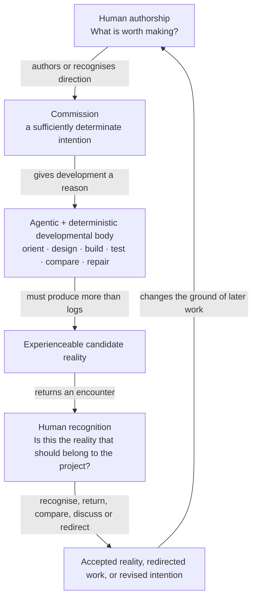
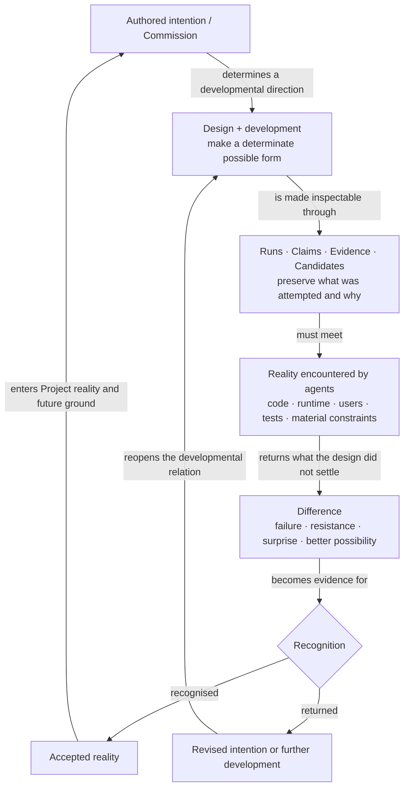
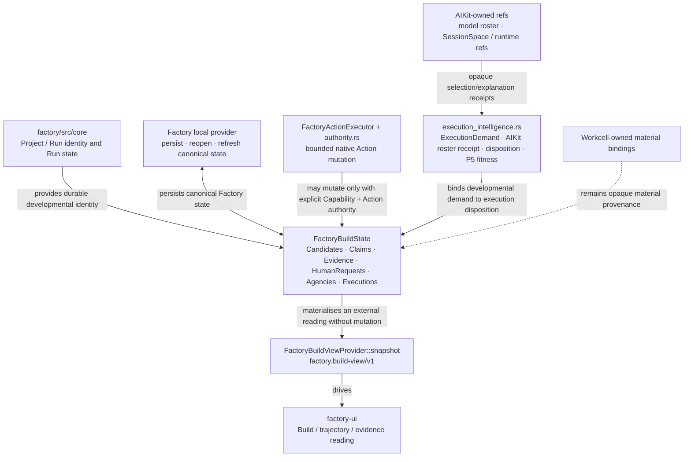

# Software Factory Visual Product Understanding

**Status:** canonical product-understanding surface, subordinate to the Constitutional Index where precedence conflicts  
**Architecture status:** accepted `main`, including the live Rust Factory core, Build view/provider, bounded Action authority, AIKit model-roster round trip, and Factory UI  
**Sources:** `QL-SOFTWARE-FACTORY-CONSTITUTIONAL-INDEX.md`, `QL-SOFTWARE-FACTORY-ARCHITECTURE-SPEC.md`, `QL-SOFTWARE-FACTORY-PRIMITIVE-RELATIONS.md`, current programme amendments, and live `factory/` implementation.

The Factory is not a project-manager dashboard. Its product relation is developmental: human-authored intention is carried through agentic and deterministic work into realities that can resist the plan, be encountered, recognised, and become revised ground.

## 1. Experience — human authorship stays high while development becomes deep

Agents are not drawn as dumb workers because the middle is precisely where interpretation, design, decomposition, implementation, diagnosis and synthesis occur. Human attention stays high because routine developmental depth no longer requires continuous supervision, not because judgement has been removed from the system.

## 2. Product / conceptual relation — development as a return from reality

A Run is therefore not a task ticket whose success is “agent finished”. It is a durable transformation in which Claims and Evidence keep contact between intention, implementation and encountered reality. Recognition is not code approval by another name; it is the point where an applied reality may become part of the authored Project.

## 3. Architecture — current live Factory seams

The live producer matters here. `FactoryBuildView` is no longer merely a fixture: current `main` has canonical `FactoryBuildState`, a persistent local provider, `FactoryBuildViewProvider::snapshot`, and a real bounded `Request more evidence` Action round trip. The architecture does not claim that AIKit SessionSpace or Workcell bindings are Factory-owned simply because the Build view can reference them.

## 4. Diagram audit

| Existing visual | Class | Disposition |
|---|---|---|
| Constitutional `ground : intent : design : development : application : recursion` loops | specialist developmental / historical constitutional | **Preserve, but do not use as the sole first product diagram.** Later canon explicitly distinguishes this Factory contract language from invariant QL position names. |
| constitutional six-family diagrams | conceptual architecture | **Preserve.** They explain the ontology after the human developmental relation is understood. |
| Primitive Relations Project → Context → Run → RunMap and per-position forms | conceptual/architecture | **Preserve.** Valuable specialist maps; too noun-dense for first contact. |
| Commission / Recognition packet diagrams | experiential specialist | **Preserve.** The new experience diagram gives their whole relation; packet details remain authoritative below it. |
| Build GUI / SSSF trajectory diagrams and fixtures | implementation / source-fidelity | **Preserve.** They explain the accepted Build surface and source reuse, not the whole Factory telos. |
| deep QL relation diagrams | research / formal | **Preserve with research status.** They are not required to understand ordinary Factory development. |

## 5. Verification

**Semantic:** the reader can explain the Factory without first learning the six constitutional families. The arrows distinguish commission, determination, material encounter, returned difference, recognition, acceptance and reopening.

**Implementation:** the architecture is grounded in current `factory/src/core`, `build.rs`, `build_provider.rs`, `authority.rs`, `execution_intelligence.rs`, and the accepted Factory UI. It does not promote draft persistent-agency design or future QL experimentation into current code truth.

**Cross-product:** Factory is not a generic project manager: it owns developmental transformation and its evidence. AIKit resolves the operative horizon; Actuation defines first-class agency/Return; Workcell owns material reality. Factory can consume all three without swallowing their semantics.

## 6. Public-site projection

The public/design surface should project the **human-authorship / candidate-reality / Recognition** relation, because that is the clearest product promise. A deeper visual can reinterpret the conceptual development-return loop. The Build-state component architecture belongs in technical docs and developer-facing Explain surfaces, not the first public encounter.