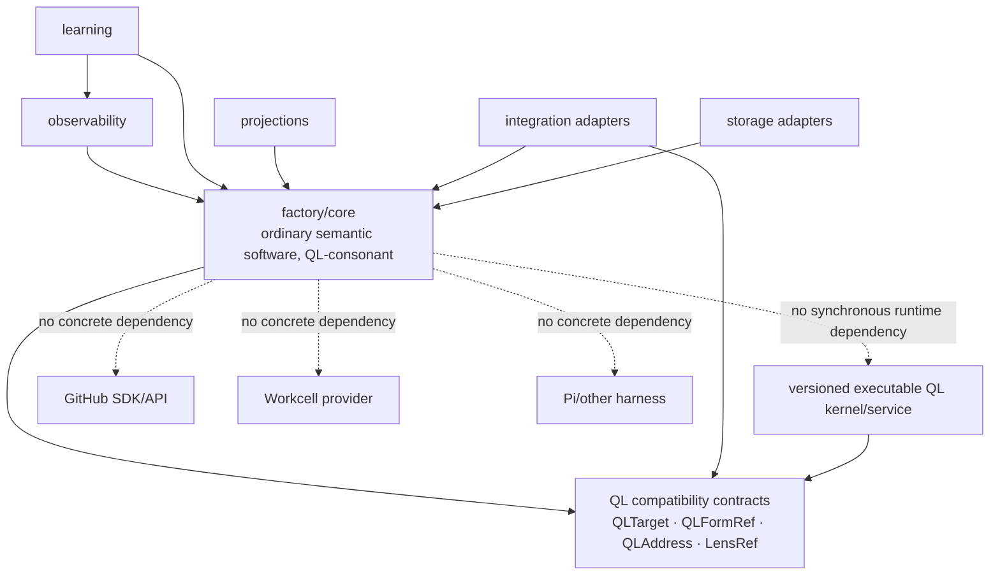
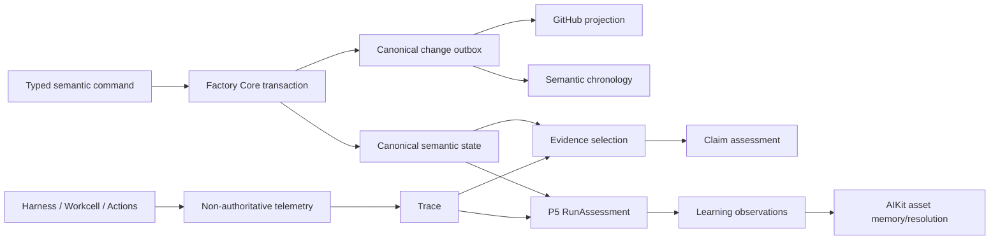
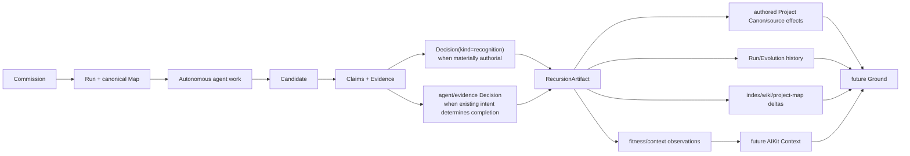
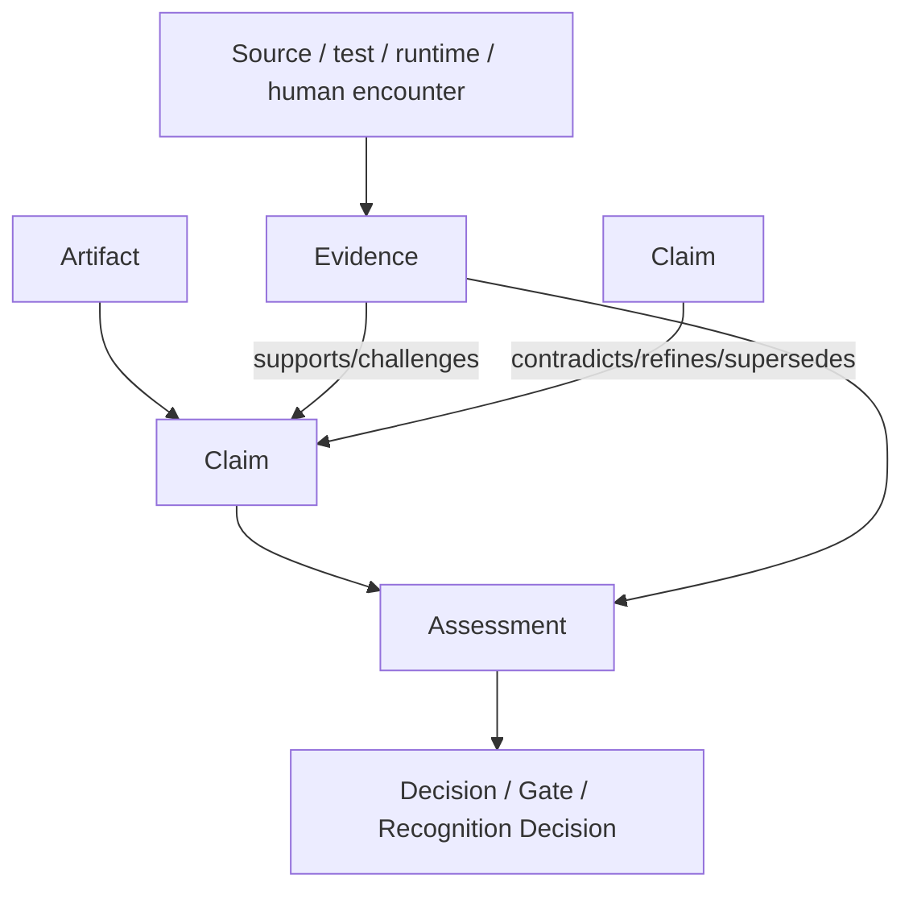

# QL Software Factory — Wayfinder Map 1
## Factory Semantic Core, Run Spine, Epistemics & Learning

**Status:** regenerated harmonised repo-design map for combined threads `A · C · G · J`  
**Authority:** `QL-SOFTWARE-FACTORY-CONSTITUTIONAL-INDEX.md` governs precedence. The five companion specifications provide constitutional/current/module/deep-form determinations according to the Index. The previous Wayfinder is treated only as a strong architectural Claim-set.  
**Scope:** Factory semantic/developmental state, one canonical Run topology, Decision/Recognition authority, Claim/Evidence epistemics, Event/Trace observability, RecursionArtifact effects, Project Evolution, and learned ergonomics.  
**Executable namespace:** `A.* · C.* · G.* · J.*`  
**Primary proof:** `Commission → autonomous work → Candidate → Claim-oriented Recognition Decision → RecursionArtifact → retained difference → altered future Ground/Context`.

---

# 0. Constitutional territory

## 0.1 Source precedence and status

This map treats the supplied corpus as a developmental body rather than a flat requirement list.

1. **Constitutional Index** — governing telos, current terminology, precedence, thread boundaries and repo handoff.
2. **Primitive Relations** — governing experienced ontology: identity, ownership, lifetimes, canon/derived/materialised/projected distinctions, Claims/Evidence, Refs, Events/Trace and asset memory.
3. **Deep QL Integration Foundations** — governing QL/MEF framing, current operational lens roles, Claim refraction and the rule that ordinary Factory objects retain identity independent of QL.
4. **Architecture Specification** — richest earlier detail for position contracts, source/store topology, Run Map, telemetry kernel, human apertures and repository shape; later terminology refinements in the Index govern where they differ.
5. **Workcell Module Specification** — authoritative only inside the materialisation boundary and for the Workcell-facing semantic contract.

Anything not fixed by that order is classified in the Decision Ledger rather than silently invented by an implementation ticket.

## 0.2 What A/C/G/J jointly are

The four threads form one **developmental memory circuit** without becoming one universal store or one authority object:

```text
Authored Project Canon / source truth
          │
          ▼
Project + current Ground
          │
          ▼
      durable Run
          │
          ▼
 canonical Run Map ───────────► Decisions / Candidates
          │                         │
          │                         ├── Decision(kind=recognition)
          │                         │       ▲
          ├──────────────► Claims ↔ Evidence
          │                         │       │
          ▼                         ▼       │
 operational changes          applied encounter
          │                                 │
          ├──── non-authoritative Event/Trace
          │                                 │
          └──────────────► RunAssessment ───┘
                                  │
                                  ▼
                         RecursionArtifact
                                  │
                  ┌───────────────┼────────────────┐
                  ▼               ▼                ▼
            canon/source       history/index    learning/context
              deltas             deltas          observations
                  └───────────────┼────────────────┘
                                  ▼
                       future Context / Ground
```

The unity is semantic. Authority remains deliberately plural:

1. **Git / authored files / versioned wiki / project config** own authored durable Project Canon and source truth.
2. **Factory/AIKit operational SQLite** owns mutable operational semantic state, Run/Decision/Claim/Candidate records, local indexes, projection bindings and transactional change sequencing for the host implementation.
3. **raw event/artifact ledger** owns reconstructable execution evidence and high-volume streams.
4. **GitNexus / bkmr / similar providers** own derived indexes, not the material indexed.
5. **Workcell** owns material bindings and observed operational state, never Candidate or Run identity.
6. **GitHub / UI / Hermes / TUI** are projections.
7. **QL canon / MEF** provide constitutional formal orientation; a versioned executable QL kernel/service is a pluggable interpreter, not the owner of Factory objects.

No projection, index, trace, learned ranking, executable refraction or local database row is allowed to become an undeclared second source of authored Project truth.

## 0.3 Constitutional invariants

The combined map MUST preserve:

- Project identity is larger than repository identity.
- A Run is a durable intended transformation and survives AgentSession, SessionSpace, harness and host changes.
- Exactly one canonical Run Map / Wayfinder Map belongs to each Run; GitHub is a rich bidirectional projection, never ontology.
- `Agent → Agency → AgentSession → Execution` are distinct; model, harness, host and Environment do not define Agent identity.
- The Epi-Logos profile activates `0/1` Epi-Logos orchestrator plus `#0 Anuttara · #1 Paramasiva · #2 Parāśakti · #3 Mahāmāyā · #4 Nara · #5 Epii` through the generic Agent/Agency runtime; those names are not universal Factory stage names and are not the optional sixfold Agency identity profile.
- Artifact is a produced form; Claim is an epistemic assertion; Evidence bears on a Claim; Assessment records standing under criteria; Event is an occurrence; Trace is an organised causal/temporal history.
- `intended · observed · verified` remain distinct epistemic relations.
- Consequential agent output enters durable state as Claims/relations/artifacts, not truth-by-field-name.
- Candidate is a coherent possible reality, independent of branch, PR, Environment, Workcell, Checkout or provider identity.
- Decision is the durable semantic determination. HumanRequest is a request/channel object. Recognition is a **specialised Decision determination**, not a parallel authority primitive.
- Recognition retains the encounter semantics `recognise · return · defer · compare/select · direct synthesis into a new/revised Candidate or future Run`; synthesis never silently manufactures canonical state.
- Human attention is concentrated at genuine authorship and materially authorial Recognition. Routine engineering completion is not ritual approval.
- P5 output is canonically a `RecursionArtifact`; any implementation-level `RecursionRecord` is only its persistence representation.
- RunAssessment is a typed assessment/artifact contributing to Recursion, not a new ontology centre.
- Recursion selectively promotes retained difference. Unrecognised emergent possibility remains Claim/proposal/future Intent horizon rather than silently rewriting authored Intent.
- `trust · fitness · preference · frecency · contextual relevance · availability` remain independent signals.
- QL canon/bimba is constitutional formal orientation; Factory is QL-consonant pratibimba; QL Forms/Addresses/MEF relations supply explicit readability; the executable QL kernel/service may be absent/degraded/upgraded without breaking ordinary semantic mutation.
- MEF applies in principle to all canonical primitives and all twelve lenses remain first-class. Software roles are named only where the corpus or supplied QL source grounds them.
- Workcell materialisation remains beneath semantic Context and never owns Candidate or Run identity.
- Telemetry failure never rolls back or invalidates authored Project Canon or committed operational semantic state.
- Project Evolution is a derived developmental reading over Run history, not an independently authored truth.

# 1. Ground + Intent artifacts

## 1.1 Intent

Build a semantic spine in which humans and agents inhabit the same durable developmental reality: a Project has addressable Runs; each Run has a canonical topology; work advances Claims against Evidence; materially distinct possibilities become Candidates; consequential results are recognised or returned; retained differences are folded into future project entry; operational history improves later navigation without rewriting authorship.

The semantic core must be useful with:

```text
QL service unavailable
GitHub unavailable
Workcell unavailable
one local host only
one simple harness
no Bimba/Neo4j
```

Those systems enrich or project the core; none defines it.

## 1.2 Success conditions

The map is successful when all of the following are demonstrable with fixtures and executable acceptance tests:

1. External repository adoption can produce Bootstrap state, Project Map linkage and the first Run without confusing repository with Project.
2. A human Prompt can commission a canonical Run Map and GitHub mirror without redundant confirmation.
3. An agent receives a semantic `AgentRunView` containing Agent/Agency identity, Project, Run/frontier, Decisions, Claims/Evidence, relevant Artifacts/Candidates, imported Actions/Capabilities, authority policy and allowed semantic mutation commands.
4. The same Agent survives changed model/harness/host/AgentSession and may enact multiple Agencies.
5. Agents can autonomously create Candidates and advance/evaluate Claims using imported Action/Capability and Execution contracts.
6. A Candidate can be materialised through Workcell using shared `ExecutionDemand` semantics and encountered without Candidate identity changing.
7. Human encounter defaults to consequential Claims/Evidence and openable Candidate realities, not infrastructure chatter.
8. Recognition is recorded as a typed Decision determination and can `recognise`, `return`, `defer`, `compare/select`, or direct synthesis into a new/revised Candidate/future Run.
9. A `RecursionArtifact` records explicit recognised effects and makes the next Context/Ground materially different through inspectable deltas.
10. Unrecognised discoveries can become Claims/proposals/future-run seeds without silently changing Project Canon or Intent.
11. The Run Map remains coherent through branches, returns, reopenings, nested child Runs and parallel Candidates.
12. GitHub can disappear and later return without becoming the ontology; projection conflicts remain projection conflicts unless they expose a genuine semantic Decision.
13. Raw telemetry can be incomplete or corrupt while authored source/Canon and committed operational semantic state remain valid.
14. The system can explain an asset suggestion through distinct trust, availability, preference, contextual relevance, fitness and frecency facets.
15. MEF refraction enriches an existing Ref without replacing its identity or becoming operational truth.
16. The executable QL service can be absent, degraded or upgraded while ordinary semantic operations continue; QL-compatible Refs/forms/sockets remain structurally present.
17. The Epi-Logos profile activates its orchestrator and six named Agents without forking the generic runtime, while a generic project has no dependency on Epi-Logos ontology.
18. A human returning after months away reconstructs the developmental why from canonical Run/Decision/Claim/Candidate history plus clearly marked Trace/projection gaps rather than performing archaeology.

## 1.3 Principal human journeys

### H1 — Commission and leave

```text
Open Project
  → prompt “improve X”
  → system shows destination + inferred Ground/Intent
  → no authorial ambiguity: Run becomes active
  → human leaves
```

The user does not approve routine decomposition, tool use, environment selection or reversible local engineering choices.

### H2 — Resolve a consequential Decision

```text
Run blocked at an authorial frontier
  → one HumanRequest surfaces
  → meaningful alternatives + rationale + evidence/prototype
  → human resolves at product/architectural altitude
  → Decision persists; request channel becomes historical provenance
```

### H3 — Compare and recognise Candidates

```text
Candidate lineup
  → open Candidate A/B/C
  → read consequential Claims
  → inspect supporting/challenging Evidence
  → Recognition Decision:
       recognise
       return
       defer
       compare/select
       direct synthesis into a new/revised Candidate or future Run
```

Merge state, test greenness and agent confidence are evidence, not substitutes for Recognition. A synthesis outcome which materially creates another possible reality MUST create/revise a Candidate and pass through ordinary Claims/Evidence/Application/Decision semantics before any canonical promotion.

### H4 — Return after months away

```text
Open Project
  → current Ground
  → active frontier
  → “since you last viewed” change summary
  → live/dead branches
  → decisive Decisions and Returns
  → recognised Candidates
  → current open Claims
```

The human does not reconstruct history from commits or chat transcripts.

### H5 — Ask “why?”

```text
Claim / change / suggestion
  → why is this here?
  → provenance
  → supporting/challenging Evidence
  → Decision/Run lineage
  → Trace drill-down only if desired
```

## 1.4 Principal agent journeys

### AG1 — Enter a Run

Agent receives a compact `AgentRunView` containing:

```text
Agent identity Ref
Agency Ref + role/stance summary
Project Ref
Run Ref + canonical revision
Destination
active frontier + dependency explanations
blocking/open Decisions including any Recognition Decision
standing Intent/Design Claims
open/challenged Claims
required Evidence/Gates
relevant Artifacts/Candidates
resolved ActionRefs / ActionInvocation affordances
resolved Capability refs
source/ProjectMap refs from ContextResolution
allowed semantic mutation commands
human-authority / resolver policy
```

### AG2 — Update topology

Agent does not edit a graph file. It issues typed Run commands against an expected Run revision. Failed optimistic concurrency returns the current revision and a semantic conflict.

### AG3 — Make epistemic progress

Agent asserts a Claim with mode/provenance, requests or attaches Evidence, may challenge another Claim, and produces a separate Assessment. It cannot transform its own confident prose directly into “verified”.

### AG4 — Develop/compare Candidates

Agent creates Candidate identities before physical materialisation, associates source/design/development refs, asks Workcell for a material world when required, and records observed behaviour as Evidence-bearing Claims.

### AG5 — Recurse

P5-oriented agent receives the complete semantic Run plus available Trace and Recognition/other Decision refs, produces a typed `RunAssessment`, then proposes a `RecursionArtifact` with an explicit `RecursionEffectSet`. Only effects authorised by the governing Decisions/Recognition policy are integrated. Suggestions and fitness/context observations do not silently mutate Project Canon, trust or explicit preference.

---

# 2. Architectural form

## 2.1 Module/package boundary

The first implementation should use one cohesive semantic core with explicit internal ownership rather than a field of tiny mutually dependent packages. Names below are design boundaries; actual crate/package layout requires source inspection.

```text
factory/
├── core/
│   ├── identity/        shared Ref contract, typed IDs, revisions, tombstones
│   ├── project/         Project identity + authored-canon/source references
│   ├── run/             Run lifecycle + authority epoch
│   ├── runmap/          canonical topology + graph invariants
│   ├── decision/        Decision, Recognition payload, HumanRequest relation
│   ├── candidate/       Candidate identity/lineage/state
│   ├── artifact/        Artifact metadata + canonical artifact families incl. RecursionArtifact
│   ├── epistemics/      Claim, Evidence, Assessment, relations
│   ├── recursion/       RecursionEffectSet validation/integration around RecursionArtifact
│   └── ports/           persistence/read/projection/imported-contract ports only
│
├── observability/
│   ├── envelope/        portable Event envelope
│   ├── telemetry/       non-authoritative runtime event ingestion
│   ├── trace/           causal/temporal Trace construction
│   └── export/          optional external telemetry adapters
│
├── learning/
│   ├── assessment/      typed RunAssessment production
│   ├── observations/    Usage/Fitness/Context observations
│   └── suggestion/      transparent multi-factor ranking contract
│
├── projections/
│   ├── github/          Run/Decision/Candidate projection + reconcile
│   └── surface/         read models for TUI/HTML/Hermes/product UI
│
├── integrations/
│   ├── aikit/           imported ContextResolution / learning contracts
│   ├── project-map/     imported ProjectMap contracts
│   ├── actions/         imported Action/ActionInvocation
│   ├── harness/         imported Agent/Agency/AgentSession/Execution + Pi adapter
│   ├── workcell/        imported ExecutionDemand/MaterialisedExecutionWorld/Binding
│   ├── source-integration/ imported SourceIntegration
│   └── ql/              QLTarget/Refraction adapter; no object ownership
│
└── storage/
    ├── sqlite/          V1 operational semantic/query state implementation
    ├── ledger/          raw event/artifact ledger implementation
    └── files-git/       authored project-canon/source adapters and Ref resolution
```

### Dependency direction



Core may preserve/version QL compatibility references because QL structural continuity is constitutional. No ordinary semantic command is allowed to require a successful executable QL-service response.

## 2.2 Shared Ref contract and revision semantics

### Identity invariant — CONSTITUTIONAL/CROSS-MAP

Every cross-map canonical object requires a stable Ref independent of host, path, provider, GitHub entity, branch, model and runtime materialisation. **Maps B–L MUST import this identity contract rather than invent competing encodings.**

### V1 encoding — CURRENT DESIGN

V1 uses immutable typed, locally generatable, time-sortable 128-bit identifiers with a ULID-compatible textual representation. The encoding is a current design decision, not a QL or constitutional truth.

Canonical examples:

```text
project:<id>
run:<id>
decision:<id>             # Recognition is decision:<id> with kind=recognition
candidate:<id>
artifact:<id>             # RecursionArtifact and RunAssessment use Artifact identity
claim:<id>
evidence:<id>
human-request:<id>
event:<id>
projection-binding:<id>
```

There is intentionally no independent `recognition:<id>` or `recursion:<id>` identity family in the product ontology.

### Shared semantic form

```text
Ref {
  kind
  id
}

VersionedRef {
  ref
  revision
}
```

Human names/slugs are aliases and MAY change. IDs never encode host, repository, GitHub number, path, branch, model, harness, Environment, Workcell or provider.

### Revision — CURRENT DESIGN

Mutable operational canonical objects carry an integer `revision`, starting at `1`, advanced by successful semantic mutation. A version-specific reference is `(Ref, revision)`; serialisation MAY use `ref@revision` without changing base identity.

### No ID reuse — CURRENT DESIGN supporting constitutional continuity

Archived/tombstoned IDs are never reused. A materially distinct Candidate receives a new Candidate ID; rematerialising the same Candidate does not.

## 2.3 Aggregate ownership and authority domains

| Object | Semantic owner | Mutation authority | Lifetime / persistence domain |
|---|---|---|---|
| Project | Factory Project identity + authored project surfaces | Project commands; authored Canon changes occur through Git/files/wiki/config and relevant authority | enduring; identity operationally indexed, authored truth versioned in project sources |
| Run | `core/run` | Run commands with revision/authority policy | active hours–months; history enduring in operational state/export |
| Run Map | `core/runmap`, exactly 1:1 child of Run | Run commands only | same semantic lifetime as Run |
| Decision | `core/decision` | resolver class declared on Decision; Recognition is `kind=recognition` | historical enduring |
| HumanRequest | `core/decision` channel/request object | system creates; channel response proposes/resolves its Decision | request lifetime shorter; durable summary/provenance retained |
| Candidate | `core/candidate`, owned by Run | Run/candidate commands | semantic history enduring; material world optional/ephemeral |
| Artifact metadata | `core/artifact` | producer creates; promotion/integration by typed commands | by class/policy; authored/canonical content may live in Git/files/wiki |
| RecursionArtifact | canonical Artifact subtype | P5 produces; effect integration validates Decision/Recognition authority and authored-store ownership | enduring as Run/P5 artifact; integrated deltas persist in their owning domains |
| RunAssessment | typed Assessment/Artifact | P5/assessor produces from semantic state + available Trace | retained with Recursion evidence policy |
| Claim | `core/epistemics` | authorised actor asserts; statement immutable | historical enduring unless privacy purge |
| Evidence | `core/epistemics` relation over captured material | capture/attach commands; source material remains owned by its native store | policy-scoped |
| Assessment | `core/epistemics` | authorised assessor/gate/human; append/supersede | historical enduring |
| Event | observability / transactional semantic outbox according to class | committed mutation or runtime observer emits | retention-class dependent |
| Trace | derived `observability/trace` | rebuilt, never directly authored as semantic truth | rebuildable; may be partial |
| ProjectionBinding | projection adapter operational state | adapter reconcile under field-authority rules | as long as projection exists/history needs mapping |

**No row above means “SQLite owns all truth”.** Storage responsibility is divided explicitly in §2.5.

## 2.4 Run lifecycle is not the developmental graph

A single stage enum cannot represent parallel branches, returns and nested processes. V1 therefore separates **Run lifecycle** from **Run Map node state**.

### Run lifecycle

```text
seeded
  ↓
active ───────► waiting_human
  │                 │
  │                 └────► active
  ├──────────► suspended ─► active
  ├──────────► finishing ─► finished ─► archived
  └──────────► aborted ────────────────► archived
```

`waiting_human` is derived when all runnable frontier is blocked by human-authority Decisions; it MAY be persisted as a cached lifecycle state but MUST be derivable.

### Developmental position

Ground/Intent/Design/Development/Application/Recursion are **Factory developmental contracts** attached to map nodes. They are not the invariant semantic names of QL positions. A core node may also carry optional `ql_ref` metadata understood only through the QL seam.

## 2.5 Authority/storage domains and V1 transaction rule

### 2.5.1 Authored durable Project truth — CONSTITUTIONAL

```text
Git / authored files / versioned wiki / project config
  → code
  → recognised intent/design/ADRs
  → semantic wiki authored content
  → tests and durable project configuration
  → canonical project artifacts whose natural representation is authored/versioned source
```

SQLite MUST NOT become a shadow replacement for these authored truths. Operational records reference authored content by stable Ref/source revision/content identity.

### 2.5.2 Factory/AIKit operational SQLite — CURRENT DESIGN

Per-host SQLite is the V1 mutable/queryable operational store for:

```text
Project identity/index records
Runs + RunMap operational topology
Decisions + HumanRequests
Candidates
Claim/Evidence/Assessment metadata and relations
Artifact metadata/content refs
ProjectionBindings/conflicts
AgentSession/session/inbox indexes where owned by AIKit
asset/learning observations
canonical semantic change sequence/outbox
```

This is a host implementation and CURRENT DESIGN, not the universal ontological store. One shared SQLite database on a network filesystem is prohibited for coordination.

### 2.5.3 Raw event/artifact ledger — CONSTITUTIONAL ROLE

Stores reconstructable execution evidence and high-volume event/tool streams. It may be JSONL/content-addressed files or another inspected implementation. Loss/corruption may reduce Trace completeness but cannot invalidate committed semantic state or authored Project Canon.

### 2.5.4 Provider-owned derived indexes — CONSTITUTIONAL ROLE

```text
GitNexus → derived code/structural index
bkmr/similar → derived information-horizon index
other ProjectMap providers → derived views
```

Derived index loss causes rebuild/staleness, not authored-data loss.

### 2.5.5 Workcell material state — IMPORTED FROM F

Workcell owns current `MaterialisedExecutionWorld` and `Binding` state plus observed operational claims/evidence. It never owns Candidate, Run, Project or Claim identity.

### 2.5.6 Projections — CONSTITUTIONAL

GitHub, UI, TUI, Hermes and HTML own presentation/provider state only. Bidirectional projection means permitted external intent is translated into typed semantic commands under explicit field authority.

### 2.5.7 V1 transactional semantic change outbox — CURRENT DESIGN

A mutable semantic command on the current write-owning host commits:

```text
operational semantic state mutation
+ canonical_change record/outbox
```

in one SQLite transaction. This compact change record is required for projection reconciliation, portable chronology and host transfer. It is deliberately separate from high-volume telemetry.

### 2.5.8 V1 single-writer active Run — CURRENT DESIGN

An active Run has one `write_owner` host and one `authority_epoch`. Other hosts/projections may read or queue mutation intents but cannot concurrently commit that Run.

```text
checkpoint portable Run bundle
  → seal old authority epoch
  → import/verify on target host
  → advance authority epoch
  → resume writes
```

Every operational semantic mutation uses `(run_ref, expected_revision, command_id)` for optimistic concurrency and idempotency.

### 2.5.9 Portable Run bundle — CURRENT DESIGN

A portable bundle restores semantic validity without requiring raw telemetry:

```text
Project Ref + authored-source/canon references
Run + exactly one RunMap
Decisions, including Recognition Decisions + typed payloads
HumanRequest summaries
Candidates
Artifact metadata + content/source refs
RecursionArtifact + RunAssessment refs/content
Claims + Evidence metadata + Assessments
Projection bindings/conflicts
canonical semantic change sequence
schema/version manifest
content hashes
```

Raw token streams, transient Workcell resources, host PIDs and ephemeral availability probes are not required to restore semantic validity.

# 3. Exact primitive semantics

## 3.1 Project

Project is the enduring authored whole. Core stores identity, status, source constituent Refs, current Canon refs, Run refs and policy refs. It does not store a universal flattened copy of source/wiki/Project Map data.

Lifecycle:

```text
bootstrap_pending → bootstrapping → operable → active ↔ dormant → archived
```

Archive is normal; hard deletion is a separate explicit destructive Procedure.

## 3.2 Run

Run owns:

```text
Run identity
Project Ref
destination
lifecycle
authority epoch/write owner
1 canonical RunMap
created/finished metadata
human-authority/Recognition policy Ref
Decision refs (including Recognition determinations)
RecursionArtifact refs
```

Run references Decisions, Candidates, Artifacts, Claims, Evidence and Events but does not duplicate their bodies.

## 3.3 Decision

Decision is the **durable semantic determination which changes or fixes a route of a Run or Project**.

```text
identified → open → resolved
                 ↘ superseded/reopened → open
```

Canonical conceptual form:

```text
Decision {
  id
  project_ref
  run_ref?
  kind = general | recognition | commission | architecture | design | source | other_typed_kind
  question_or_determination
  alternatives[]
  relevant_claim_refs[]
  relevant_evidence_refs[]
  resolver_class
  resolution
  rationale
  consequence_refs[]
  typed_payload?
  supersedes_or_reopens_refs[]
}
```

Resolver classes are canonically:

```text
agent-resolved        reversible/local determination
 evidence-resolved     empirical/deterministic determination
 human-authorial       consequential intention/meaning when canon does not decide
 recognition           specialised encounter with applied Candidate/result
```

Resolution history is retained when reopened/superseded. A Decision may be resolved by evidence or agent judgement without a HumanRequest.

## 3.4 HumanRequest

HumanRequest is the **request-channel object** used when one durable Decision genuinely requires human authorship, Recognition, or material intervention.

It references exactly one Decision. Recognition therefore does not require a second authority identity.

```text
Decision(kind=recognition)
       │
       ▼
HumanRequest
  ├── AIKit inbox
  ├── Hermes
  ├── cmux/TUI
  ├── GitHub projection
  └── future product surface
```

States:

```text
queued → delivered → answered | withdrawn | expired
```

A channel response becomes a typed attempt to resolve the referenced Decision under authority policy. Channel deletion/failure never deletes the Decision. Minimal durable request/response provenance remains after channel-specific retention.

## 3.5 Candidate

States:

```text
proposed → building → runnable → under_application
                                  ├─ recognised → integrated
                                  ├─ returned → building | discarded
                                  └─ discarded
```

Candidate identity binds a coherent possible reality through source/revision refs, design/development artifact refs, Claims/Evidence, producing Executions and optional current materialisation. Environment/Checkout changes do not change identity unless the represented product state materially changes.

## 3.6 Artifact

Artifact has immutable content-addressed revisions and mutable lifecycle metadata:

```text
working → run_durable → recognised → project_canonical
              └────────► superseded / retained_history
```

A new content body is a new Artifact revision, never silent in-place replacement.

## 3.7 Claim

### Claim representation

```text
Claim {
  id
  project_ref
  run_ref?
  statement
  mode
  scope
  subject_refs[]
  provenance
  asserted_at
  ql_ref?            # optional; opaque to core
  supersedes?[]
}
```

`mode` is semantic, not confidence:

```text
intent
observation
design
causal
hypothesis
prediction
evaluation
recognition
proposal
```

Claim statement/provenance are immutable after assertion. Correction creates a new Claim with `supersedes`/`refines` relation.

### Claim relations

Small canonical vocabulary:

```text
supports       # Claim-to-Claim argumentative support
contradicts    # Claims cannot both hold in stated scope without qualification
refines        # later/more precise formulation
supersedes     # later Claim becomes governing formulation while history remains
specialises    # narrower scope
corresponds_to # explicitly non-identity relation; use sparingly
```

No generic semantic `related_to` edge is allowed in core epistemics.

### Assessment

Claim standing is represented by append-only Assessments, not by changing the Claim statement:

```text
unassessed
supported
challenged
unresolved
verified
refuted
superseded
```

Assessment records assessor, criteria, supporting/challenging Evidence relations and time. “Verified” always means verified **for a stated claim, scope and criterion**, not metaphysical truth.

### Intended / observed / verified

These remain three different things:

```text
intended
  = an intent/design Claim establishes what should be true

observed
  = an observation Claim states what inspection/runtime actually showed

verified
  = an Assessment concludes that relevant Evidence sufficiently supports a Claim under explicit criteria
```

A derived `EpistemicTriadView(subject)` MAY show all three side by side. It MUST NOT store them as one status field.

## 3.8 Evidence

Evidence is immutable captured material selected because it bears on a Claim.

```text
Evidence {
  id
  kind
  source_ref
  captured_at
  provenance
  integrity_hash?
  sensitivity
  retention_class
  availability_state
}

EvidenceRelation {
  claim_ref
  evidence_ref
  polarity = supports | challenges
  rationale
  scope
  created_by
}
```

Deterministic tests do not write `claim.verified=true`. A test run emits an observation Claim such as “suite X exited successfully against revision Y”, backed by the test output Evidence. A separate Gate/Assessment may use it to verify a higher-level Claim.

## 3.9 Recognition as a specialised Decision determination

Recognition is a distinctive **semantic mode of Decision**, not a parallel authority primitive and not an inference from merge/green CI.

Conceptual form:

```text
Decision(kind=recognition) {
  resolver_class = recognition
  typed_payload = RecognitionPayload {
    candidate_refs[]
    intent_claim_refs[]
    application_artifact_refs[]
    evidence_refs[]
    unresolved_refs[]
    outcome
    selection?
    return_target?
    synthesis_directive?
    authorised_effect_classes[]
  }
}
```

The outcome vocabulary preserves the human/application semantics:

```text
recognise
return
defer
compare_select
synthesise
```

Rules:

1. `recognise` may authorise specified Recursion effects; it does not itself mutate Project Canon.
2. `return` creates/uses an explicit RunMap `returns_to` relation with reason Claim/Evidence.
3. `defer` leaves the semantic question open without pretending failure or acceptance.
4. `compare_select` records the comparative determination and selected Candidate(s) where appropriate.
5. `synthesise` is a directive to form a new/revised Candidate or future Run/Intent proposal. It MUST NOT silently merge properties of Candidates into canonical state.
6. Human Recognition is required only where the applied result is materially authorial. Routine engineering completion may be evidence-/agent-resolved under existing Intent and Gates.
7. Merge state, test greenness, model confidence and Workcell health are Evidence/observations, never Recognition by implication.

A dedicated Recognition read model/payload is encouraged because the encounter is distinctive; authority identity remains the Decision Ref.

## 3.10 RecursionArtifact and retained difference

The canonical P5 output is the **`RecursionArtifact`** defined by the Architecture artifact family. This map retains the previous explicit-effect machinery by making it the artifact's structured body.

```text
RecursionArtifact {
  artifact_ref
  run_ref
  decision_refs[]                  # including governing Recognition Decision(s)
  run_assessment_ref?
  recursion_effect_set
  project_canon_deltas[]
  source_revision_deltas[]
  documentation_deltas[]
  semantic_wiki_deltas[]
  project_map_deltas[]
  source_integration_deltas[]
  index_invalidations[]
  learning_observations[]
  context_observations[]
  reusable_knowledge_refs[]
  future_run_proposals[]
  new_ground_delta
  integrated_at?
}
```

`RunAssessment` is a typed Assessment/Artifact feeding this artifact. If implementation benefits from a database structure named `RecursionRecord`, that type is explicitly the persistent representation/index of `RecursionArtifact`, **not a new product primitive or authority centre**.

### RecursionEffectSet

Effects are explicit and routed to the domain that actually owns the truth:

```text
PromoteCanonArtifact          → authored project store / versioned canon
PromoteDecision               → authored decision/canon representation where policy requires
AdoptSourceRevision           → Git/source owner
UpdateProjectSemanticRef      → authored semantic/wiki/config owner
PublishRunHistory             → Run/Evolution history/index
InvalidateDerivedIndex        → GitNexus/bkmr/ProjectMap providers rebuild
EmitFitnessObservation        → J → AIKit learned state
EmitContextObservation        → J → AIKit/context memory
ProposeProfileChange          → proposal only; AIKit Procedure/authority required
SeedFutureRun                 → proposal/Prompt/Claim; does not silently author Intent
RegisterSourceIntegrationDelta→ SourceIntegration owner
```

The retained-difference circuit is:

```text
Decision(kind=recognition or other governing determination)
  → RecursionArtifact
      ├─ authored/source effects ─────► Project Canon/source truth
      ├─ history effects ─────────────► Run/Project Evolution horizon
      ├─ index invalidations ─────────► rebuilt ProjectMap/code/knowledge views
      ├─ learning observations ───────► AIKit contextual resolution
      └─ future proposals ────────────► Claims/Prompts/future Run frontier
                                           │
                                           ▼
                                   future resolved Context
                                           │
                                           ▼
                                     future Ground
```

An emergent possibility that was not recognised as authored Intent may be retained as a Claim, proposal, reusable knowledge or future-run seed. It cannot silently rewrite standing Intent or Project Canon.

# 4. Canonical Run Map / Wayfinder

## 4.1 One Run, one map identity

`RunMap` is a 1:1 owned component of Run and is addressed as `run:<id>/map`; it does not receive a second independent global identity. This prevents Run and Run Map from drifting into duplicate authorities.

## 4.2 Topology nodes

Only things which participate in developmental topology are first-class map nodes.

```text
DestinationNode   exactly one root intent/destination statement
PositionNode      Factory developmental contract position; optional QL Ref
WorkNode          executable/decomposable work whose completion changes the route
DecisionNode      references one canonical Decision
CandidateNode     references one canonical Candidate
GateNode          transition criterion/assessment point
AuthorityNode     commission/recognition/other explicit human-authority aperture
NestedRunNode     references one child Run
```

Artifacts, Claims, Evidence, HumanRequests, Traces and source refs are **attachments** to nodes/edges, not default topology nodes. They remain independently addressable canonical objects.

## 4.3 Work/Position node state

```text
planned
ready
active
blocked
waiting
satisfied
returned
superseded
abandoned
```

Decision/Candidate/Authority node status is read from the referenced canonical object rather than duplicated inside the map.

## 4.4 Edge vocabulary

The canonical process graph uses a deliberately small typed edge set:

```text
requires      A requires B; dependency direction A → B
branches_to   A creates a materially distinct developmental branch B
returns_to    later node returns responsibility to earlier node; carries reason/Evidence refs
nests         parent node delegates a durable sub-transformation to child Run
converges_to  two or more branches feed a synthesis/integration node
realises      Candidate realises a design/work branch
supersedes    newer topology node replaces prior route while preserving history
```

Attachments use separate roles:

```text
input_artifact
output_artifact
advances_claim
requires_evidence
evidenced_by
human_request
trace
source
```

No generic `edge.type = "related"` is permitted.

## 4.5 Graph invariants

1. Exactly one DestinationNode.
2. Every non-root process node is reachable from Destination through topology edges ignoring `returns_to` back-edges.
3. `requires` edges are acyclic within one snapshot; loops are represented by `returns_to`, not dependency cycles.
4. A `NestedRunNode` references a different Run and the child records `parent_run_ref`; recursive self-reference is prohibited.
5. Every CandidateNode references a Candidate owned by the same Run unless explicitly marked imported-comparison.
6. Every DecisionNode references one Decision; no inline duplicate alternatives/resolution.
7. A closed/abandoned branch remains addressable.
8. A branch cannot be physically deleted while referenced by a Decision, Claim, Evidence, Candidate or RecursionArtifact.
9. `frontier` is derived, never a second manually curated list.
10. Project Evolution is derived from Run Maps/semantic changes, never authored as an independent historical truth.

## 4.6 Frontier

A node is in the executable frontier when:

```text
node state ∈ {planned, ready}
AND all `requires` prerequisites are satisfied
AND no governing open Decision blocks it
AND no parent branch is abandoned/superseded
AND actor policy/authority allows execution
```

The human frontier view groups:

```text
Runnable now
Waiting on evidence/external dependency
Waiting on human authorship
Active agent work
```

## 4.7 Branch liveness

Derived branch state:

```text
live        has active/ready descendants or recognised Candidate
waiting     no executable descendant but unresolved dependency remains
returned    route explicitly sent back to earlier responsibility
superseded  later route replaced it
abandoned   explicit termination
historical  completed/dead route retained only for lineage
```

## 4.8 Reopening and return

A return is not “set stage backwards”. It is a durable `returns_to` edge plus:

```text
reason Claim
Evidence refs
responsible target node
affected Decision/Claim refs
originating Candidate/Application refs
```

The target may be reopened or a successor revision node may be created. Historical topology remains visible.

## 4.9 Nested processes

Use a `NestedRunNode` only when the sub-process merits its own durable destination, Decisions, Claims, Candidates or independent resumption. Small decomposition stays within WorkNodes. This avoids ceremonial recursive Runs.

## 4.10 Canonical vs derived views

| View | Status | Derivation |
|---|---|---|
| Run Map process graph | canonical topology | core RunMap state |
| frontier | derived | node state + `requires` + Decision state |
| live/dead branch view | derived | topology + object states |
| L3 Processual | derived refraction | transformations/branches/returns/nesting/convergence |
| L3′ Chronological | derived | canonical change sequence + available telemetry |
| L4′ Knowledge Work | derived/refraction | Prompt/Trace/Challenge/Pattern/Discovery/Insight markers over Claims/Events/Artifacts |
| Project Evolution | derived | Runs + Decisions (including Recognition) + RecursionArtifacts + selected Git/source refs |
| GitHub mirror | projected | Projection bindings |
| HTML/TUI view | projected | read models |

---

# 5. L3, L3′ and L4′ views

## 5.1 L3 Processual

L3 asks “what is becoming?” and should emphasise:

```text
transformations
branch creation
returns/reopenings
nested Runs
candidate divergence
branch convergence
recursion/foldback
```

The L3 view hides chronological noise by default. It is the best agent/human view for understanding process shape.

## 5.2 L3′ Chronological

L3′ combines the canonical semantic change order with runtime events without pretending distributed wall clocks are perfect.

Ordering rules:

1. canonical mutation sequence orders semantic changes;
2. `causation_ref` orders causally linked Events;
3. per-stream `sequence` orders local events;
4. timestamps are display/tie-break information, not the sole source of causality.

The view marks telemetry gaps explicitly rather than inventing missing history.

## 5.3 L4′ Knowledge Work

Canonical conditions:

```text
Prompts → Traces → Challenges → Patterns → Discovery → Insight
```

They are a refraction of intelligence within the Run, **not a second workflow**.

Operational binding:

| L4′ condition | Factory material |
|---|---|
| Prompts | initiating prompts, research questions, Decision questions, proposal Claims |
| Traces | retrieval/execution Trace refs and source/evidence trails relevant to inquiry |
| Challenges | failed Gates, contradictory Claims, unresolved Decisions, returned branches |
| Patterns | repeated structures/failure patterns, pattern Claims, clustered observations |
| Discovery | newly established evidence-backed facts/relations/possibilities |
| Insight | synthesised Claims or Recursion learnings which change understanding/future orientation |

A `KnowledgeMarker` MAY persist an agent/human annotation that a specific Ref exemplifies one condition. The original objects remain canonical; markers are derived/refraction metadata.

---

# 6. GitHub bidirectional projection

## 6.1 Projection identity

```text
ProjectionBinding {
  id
  canonical_ref
  canonical_subref?       # e.g. run node
  provider = github
  repository_ref
  entity_kind = issue | pull_request
  external_id
  projection_schema_version
  last_synced_canonical_revision
  last_seen_remote_revision
  state = healthy | pending | stale | diverged | orphaned | unreachable
}
```

A hidden machine-readable marker in the GitHub entity MUST carry the canonical Run/node Ref and projection schema so mapping can be re-established after local projection-index loss. Display title/number never defines identity.

## 6.2 Default mapping

```text
Run / Destination        ↔ parent issue
independent Decision     ↔ child issue when discussion/work merits it
vertical Work slice      ↔ issue
Candidate implementation ↔ branch/PR references
Candidate                ↔ one or more PR/runtime refs, never identical to PR
Recognition Decision      ↔ Decision(kind=recognition); may be summarised to GitHub
```

A merged PR is an observed fact/evidence. It is not Recognition and does not finish a Run by implication.

## 6.3 Field authority

### Canonical-only semantic fields

GitHub may display but not implicitly own:

```text
Refs/identity
node kind
Decision resolver/resolution
Candidate identity
Recognition Decision payload/outcome
Claim/Evidence relations
return edges
Recursion effects
Project/Run ownership
```

Remote edits to these must arrive as explicit typed Factory commands or become a projection conflict/proposal.

### Round-trippable collaborative fields

```text
display title
human-readable description/notes
work-node open/closed status
non-semantic tags
assignee hints
comments/discussion refs
```

Closing an issue that mirrors a WorkNode can satisfy that WorkNode only when configured acceptance/gate criteria are already met; otherwise it becomes an incoming “close requested” intent and the canonical node remains unsatisfied.

### Remote-only fields

Provider-specific metadata with no canonical meaning remains remote and may be indexed for UX without entering core state.

## 6.4 Outgoing sync

```text
canonical command commits
  → canonical_change outbox
  → projection adapter computes idempotent patch
  → remote apply
  → ProjectionBinding advances sync revisions
```

Network failure sets `pending/stale`; it never rolls back canonical state.

## 6.5 Incoming sync

Webhook or poll results become `ProjectionIntent` records. The adapter:

1. resolves binding by embedded canonical marker/external ID;
2. classifies changed fields by authority;
3. converts allowed edits into typed core commands;
4. rejects/records canonical-only mutations not expressed as valid commands;
5. advances remote revision only after successful reconcile.

No remote webhook writes the canonical store directly through SQL.

## 6.6 Conflict handling

For each round-trippable field, reconcile from the pair:

```text
last_synced canonical revision
last_seen remote revision
```

Rules:

- one side changed: apply that change;
- append-only comments/tags: merge when semantically commutative;
- both changed same scalar field: preserve canonical current value, create `ProjectionConflict`, retain remote value as a note/proposal;
- canonical-only field diverged remotely: canonical wins; emit visible sync warning;
- external entity deleted: binding becomes `orphaned`; canonical object remains intact;
- mapping marker missing/ambiguous: do not guess by title; require deterministic recovery or explicit human link.

ProjectionConflict is operational state, not automatically a human-authorial Decision. It blocks only the affected projection field unless semantic intent is genuinely ambiguous.

## 6.7 Offline and partial operation

The canonical Run remains fully operable offline. Outgoing projection changes queue by canonical revision. Incoming changes are reconciled when connectivity returns.

If GitHub is unavailable for a week, agents can still create/resolve Decisions, develop Candidates, record Claims/Evidence and recognise/return work locally.

## 6.8 Reconstruction after long absence

```text
load canonical Run + ProjectionBindings
fetch remote entities changed since last-seen revision
validate embedded canonical markers
reconcile round-trippable fields
record conflicts/orphans
re-emit missing outbound patches
produce a human/agent sync report
```

If canonical Factory state is lost but GitHub remains, the mirror can recover a **projection skeleton** and external history where markers exist. It cannot truthfully reconstruct Claims, Evidence, Recognition Decisions, returns or RecursionArtifacts that were never projected. Recovery MUST label such material `recovered/observed`, not pretend GitHub was canonical.

---

# 7. Claim/Evidence epistemic plumbing

## 7.1 Agent-facing Claim Context

Every serious agent invocation should receive a structured epistemic section in addition to ordinary prose/artifacts:

```text
RECOGNISED INTENT CLAIMS
OBSERVED IMPLEMENTATION CLAIMS
VERIFIED BEHAVIOUR CLAIMS
OPEN / HYPOTHESIS CLAIMS
CHALLENGED / CONTRADICTORY CLAIMS
CLAIMS REQUIRING EVIDENCE
CURRENT DECISIONS
REQUIRED GATES
```

The packet includes stable Refs so the agent can operate on the same Claims the human later sees.

## 7.2 Claim-oriented output contract

Consequential agent output should be able to emit:

```text
assert_claim
challenge_claim
relate_claims
attach_evidence
request_evidence
propose_assessment
propose_decision
produce_artifact
```

Free prose remains allowed; the harness/agent prompt asks the agent to explicitly elevate consequential statements rather than relying on post-hoc extraction.

## 7.3 Contradiction/refutation/supersession

- Contradiction is a Claim↔Claim relation.
- Challenging Evidence does not automatically refute a Claim.
- Refutation is an Assessment with criteria/evidence.
- Supersession preserves the old Claim and points to its successor.
- A refuted Claim can remain valuable historical Evidence for why a route changed.

## 7.4 Gates are Claim assessments

A Gate defines:

```text
claim being assessed
criteria
required Evidence classes
assessor type = deterministic | agent | human | composite
result
unmet conditions
return target on failure
```

The gate result is itself an observation/evaluation Claim plus Assessment. `pass/fail` alone is not sufficient provenance.

---

# 8. MEF refraction architecture

## 8.1 QL constitutional continuity and executable-service independence

QL is not an optional annotation system. The governing relation is:

```text
QL canon / bimba
    → constitutional formal orientation

Factory
    → QL-consonant software pratibimba

versioned QL Forms / Addresses / MEF relations
    → explicit compatibility and readable coordinates

executable QL kernel/service
    → pluggable/versioned interpreter; may be absent, degraded or upgraded
```

Core semantic mutation MUST NOT synchronously depend on the executable QL service. Core MAY store/transport versioned QL compatibility refs because preserving the seam and formal continuity is architectural intent.

MEF remains whole and applies in principle to all canonical primitives. Refraction is derived interpretation and never operational truth merely because a QL service produced it.

## 8.2 Shared QLTarget / RefractionRequest

Avoid a competing “QL object identity”. The target is always an existing canonical Factory Ref plus optional QL coordinates/frame.

```text
QLTarget {
  subject_ref                 # canonical Factory Ref
  ql_form_ref?
  ql_address?
  lens_ref?
  frame_ref?
}

RefractionRequest {
  id
  target: QLTarget
  purpose
  context_refs[]
  requested_by
}

RefractionResult {
  id
  target: QLTarget            # same subject identity preserved
  ql_kernel_version?
  ql_form_version
  interpretation_artifact_ref
  distinctions[]
  resulting_claim_refs[]
  evidence_refs[]
  produced_at
  completeness = complete | partial | unavailable
}
```

A service upgrade may produce a new RefractionResult against the same subject Ref. Old results remain provenance-bearing derived interpretations rather than being retroactively rewritten.

## 8.3 Current ratified operational roles

The canonical corpus currently supports these Factory-wide roles:

```text
L0   Investigative — questioning, search, missing evidence, self-orientation
L1   Causal — causal constitution/role within a relation
L2   Logical — IS / IS-NOT / BOTH / NEITHER dispositions and competing Claims
L3   Processual — transformation, branching, return, nesting, convergence
L3′  Chronological — actual unfolding, ancestry, sequence, developmental history
L4′  Knowledge Work — Prompts → Traces → Challenges → Patterns → Discovery → Insight
L5   Articulation / Vāk — movement from latent capacity/intention to explicit marks and their return into future context
```

The remaining five lens anchors are structurally first-class in MEF, but this corpus does not ratify a Factory-wide operational role for each. This map therefore records them as **available refractive coordinates with no invented software label**. The initial design pass must exercise them through the QL/MEF source/service and persist a LensRoleBinding only where a distinct natural operational role is actually disclosed.

## 8.4 Full first-pass refraction ledger

The following ledger records where the currently ratified roles already reveal concrete functionality. Each primitive is still a target for all twelve lenses; “—” for unratified roles means *inspect full MEF source, do not invent symmetry*.

| Primitive | L0 Investigative | L1 Causal | L2 Logical | L3 Processual | L3′ Chronological | L4′ Knowledge | L5 Articulation |
|---|---|---|---|---|---|---|---|
| Project | open questions/gaps | constituent causes/conditions | conflicting project claims | developmental becoming | project evolution | knowledge state | canon/code/wiki crystallisation |
| Context | missing horizon/evidence | what conditions availability/relevance | competing contextual assumptions | context transformation | context-at-time | prompt/retrieval trajectory | projection into prompt/tools/marks |
| Run | investigative frontier | causes/constraints of transformation | competing routes/claims | primary process topology | primary temporal history | whole inquiry trajectory | intent→artifacts→persistent result |
| Run Map | fog/frontier | dependency/causal reading | branch alternative logic | canonical process view | canonical chronology view | knowledge-work overlay | map as explicit durable articulation |
| Decision | what remains unknown | consequences/causal stakes | live alternatives incl BOTH/NEITHER | route change | resolution/reopening history | prompts/challenges/insight basis | resolution crystallised into route |
| Agent | self-orientation | causal role in an act | conflicting agent claims | participation in transformation | execution history | inquiry contributions | utterance/action/code production |
| Agency | stance/capability questions | local causal function | competing stances | local act trajectory | use history | pattern of successful inquiry | situated identity made operational |
| Capability | discovery need | what power produces what effect | contradictory capability claims | invocation in process | use history | trace→fitness learning | tool result becomes marks/artifacts |
| Action | intent/required operation | domain effect | pre/postcondition tensions | domain transformation | invocation history | prompts/traces/challenges | canonical operation across surfaces |
| Artifact | questions it answers/opens | causal role/material/form | contradictory artifact claims | artifact transformations | version lineage | knowledge condition | strongest natural L5 object |
| Claim | missing evidence/questions | causal claims/conditions | primary L2 object | standing changes through process | assessment history | primary L4′ object | proposition→explicit/persistent mark |
| Evidence | what evidence is missing | origin/causal relevance | support/challenge tension | capture/selection process | evidence timeline | Trace/Challenge/Discovery relation | raw occurrence→addressable evidence |
| Candidate | what should be tested | why behaviour arises | alternative candidate dispositions | branch becoming | candidate lineage | experiment/discovery trajectory | design possibility→experienced form |
| HumanRequest | what truly requires human | consequence of response | alternative field | blocking/resolution process | request/respond history | Prompt/Challenge | authorial response→Decision mark |
| Project Map | where to investigate | source/index dependencies | conflicting navigational claims | project relation/process view | evolution view | knowledge navigation | project intelligibility crystallised |
| SourceIntegration | source questions/gaps | upstream/local causality | source claims vs observed reality | integration lifecycle | drift/upgrade history | research/discovery trail | upstream form→local executable seam |

## 8.5 Compact human/agent synthesis

Human surface shows at most the few refractions that materially change understanding:

```text
Claim
  Default synthesis
  Investigative questions (L0)
  Causal account (L1)          [only if useful]
  Logical tension (L2)         [only if live]
  History (L3′)
  Knowledge trajectory (L4′)
```

Agent receives:

```text
active lens/purpose
original target Ref
standing synthesis
new distinctions
claims/evidence changed by the refraction
```

The system never dumps twelve ceremonial paragraphs into every prompt.

---

# 9. Event, Trace and telemetry

## 9.1 Portable Event envelope

```text
EventEnvelope {
  event_ref
  schema_version
  class = domain_change | execution | observation | projection | system
  kind

  occurred_at
  emitted_at
  stream_ref
  stream_sequence

  project_ref?
  run_ref?
  run_node_ref?
  candidate_ref?
  claim_ref?

  actor_ref?
  agency_ref?
  harness_ref?
  model_ref?
  host_ref?
  environment_ref?
  capability_refs[]
  action_ref?

  correlation_ref?
  causation_ref?
  parent_span_ref?

  input_refs[]
  output_refs[]
  payload_ref?
  status?
  error_ref?

  sensitivity
  portability
}
```

IDs/Refs and semantic relations are portable. Host PIDs, absolute paths and secret-bearing payloads are not.

## 9.2 Event classes

### `domain_change`

Small, durable record emitted transactionally after a canonical mutation. Required for projections/semantic chronology. Not high-volume tracing.

Examples:

```text
run.created
run.lifecycle_changed
runmap.node_added
runmap.edge_added
decision.opened
decision.resolved
candidate.created
claim.asserted
evidence.attached
recognition.recorded
recursion.integrated
```

### `execution`

High-volume runtime observability:

```text
agent.started
agent.ended
tool.called
tool.returned
harness.handoff
gate.started
gate.completed
process.error
model.usage
```

### `observation`

Normalized occurrences used to form Claims/learning:

```text
capability.used
action.invoked
context.source_retrieved
candidate.opened
human.intervened
```

### `projection`

GitHub/HTML/Hermes synchronization and conflicts.

## 9.3 Trace construction

Trace is a derived causal/temporal view over Events and execution records.

```text
Trace {
  target_ref
  event_refs[]
  root_event_refs[]
  gap_markers[]
  completeness = complete | partial | known_gap | corrupt_tail
  built_from_ledger_revision
}
```

Construction respects `causation_ref`, `parent_span_ref`, local stream sequence and canonical domain-change order. Missing events yield explicit gap markers.

## 9.4 Continuous collection vs Recursion interpretation

### Continuously recorded (subject to retention/privacy)

```text
canonical domain changes
agent/harness/model/Agency selection
capability/action invocation start/end
context source retrieval
candidate creation/exposure/open
Gate execution/results
human request/respond/intervention
errors/returns
usage/token/cost/resource summary where available
Workcell observed state/evidence refs
projection sync state
```

### Interpreted primarily at Recursion

```text
outcome quality
intent fidelity
design fidelity
return/rework pattern
human-intervention quality/density
model fitness
Capability fitness
Action fitness
Agency fitness
context-source usefulness
recurring failure pattern
reusable Run pattern
suggestion/routing implications
```

### Ephemeral by default

```text
UI redraw events
heartbeat chatter
raw token deltas after final message reconstruction
high-frequency process metrics with no retained diagnostic policy
transient availability probes
```

Structured tool invocations, final messages/artifacts and Gate Evidence remain independently retainable.

## 9.5 Retention / privacy / portability

| Material | Default scope | Portability | Retention |
|---|---|---|---|
| canonical Run/Decision/Claim metadata | project/factory | portable | enduring/history |
| authored Project Canon | project | normal project/source rules | enduring/versioned |
| domain-change sequence | project/run | portable | enduring with Run history |
| normalized execution Events | run | portable after secret stripping | configurable, medium/long |
| raw model/tool payloads | local/run | private by default | configurable/shorter |
| secrets/credentials | never event payload | non-portable | external secret store only |
| host PID/absolute path/resource lease | host | non-portable detail | short/operational |
| Evidence | claim/project/run | portable by Ref when policy permits | per evidence class |
| UsageSignal | user/project/profile/host according to asset | selectively portable | rolling + aggregate |
| FitnessObservation | project/profile/demand | portable normalized form | long enough to learn |
| explicit preference/trust | AIKit user/project scope | policy-controlled | until changed/revoked |

A privacy purge may redact Evidence/raw payload while retaining an immutable tombstone, hash if appropriate, purge reason and affected Assessments. Historical “verified at time T” can remain historical, while current verification views must show required evidence as unavailable when that matters.

---

# 10. RunAssessment and learned ergonomics

## 10.1 RunAssessment

```text
RunAssessment {
  run_ref
  produced_at
  assessor_refs[]
  outcome_quality
  intent_fidelity
  design_fidelity
  returns[]
  human_interventions[]
  model_observations[]
  capability_observations[]
  action_observations[]
  agency_observations[]
  harness_observations[]
  context_observations[]
  failure_patterns[]
  reusable_learning_refs[]
  source_event_range
  trace_completeness
}
```

If Trace is incomplete, Assessment states that limitation. Missing telemetry lowers evidential coverage; it does not invalidate the Run.

## 10.2 Distinct learning signals

### Trust

Categorical permission/review state. Owned operationally by AIKit policy. **Never inferred upward from successful outcomes.**

### Availability

Current reachability/compatibility. Supplied by AIKit/Workcell/providers. Dynamic, often ephemeral.

### Preference

Explicit human/project choice. Typed as `require | prefer | neutral | avoid | forbid`. Only explicit user/project mutation or an approved Procedure changes it.

### Contextual relevance

Derived relation between asset and current demand/context based on scope, prior use and semantic match. Not quality.

### Fitness

Contextual outcome evidence for a demand class. Stored as observations/distributions/assessments, never a universal asset score.

### Frecency

Deterministic recency/frequency memory of use. Familiarity only.

## 10.3 Default suggestion/ranking policy

No opaque weighted mega-score.

```text
1. Eligibility filter
   trust permits AND availability satisfies hard requirements AND no `forbid`

2. Hard/explicit preference
   `require`/pinned project choice where compatible

3. Demand fitness evidence
   prefer assets/compositions with stronger relevant outcome evidence

4. Contextual relevance
   prefer assets historically/semantically relevant to this project/Agency/task

5. Soft preference
   `prefer` before neutral before `avoid`

6. Frecency
   tie-break for ergonomic ordering/autocomplete

7. Stable deterministic ID tie-break
```

Every suggestion exposes the independent facets that produced its ordering.

## 10.4 Observation ownership boundary with AIKit

Factory J owns the **semantic observation models, RunAssessment production and ranking policy contract**. AIKit owns the cross-scope asset index/resolver, storage of user/project trust and preference, live availability resolution and presentation/autocompletion surfaces.

Factory publishes:

```text
UsageSignal
FitnessObservation
ContextObservation
RunPatternObservation
```

AIKit returns:

```text
asset identity
trust state
availability
explicit preference
frecency/context history
ranked/suggested effective view with explanation
```

P5 can propose a profile change; AIKit Procedure/authority must enact it.

---

# 11. Deletion, retention and supersession

## 11.1 General rule

Normal semantic history is append/supersede/archive, not destructive deletion.

## 11.2 Project

`archive` hides from ordinary active views but retains identity/history. Hard purge requires an explicit destructive Procedure and produces tombstone/audit metadata where policy permits.

## 11.3 Run / Run Map

Runs are aborted/finished/archived, never silently deleted if any consequential history exists. Completed map branches remain historical.

## 11.4 Decisions / Claims / RecursionArtifacts

Immutable historical semantics. Corrections happen through supersession/reopening/new records. Privacy/legal purge may redact payload while preserving non-sensitive tombstone/reference integrity.

## 11.5 Candidates

Live Environments/Checkouts may be destroyed. Candidate metadata, lineage, consequential Claims/Evidence and Decision links (including Recognition) remain.

## 11.6 Artifacts / Evidence

Content can follow retention class. If content is collected by GC/purge, the Ref becomes an unavailable/tombstoned historical reference rather than being rebound to new content.

## 11.7 Telemetry

High-volume raw telemetry may expire independently from semantic Run history. Derived fitness observations must retain enough provenance to state the source Run/Trace coverage even after raw payload expiry.

## 11.8 GitHub

Deleting/closing a GitHub entity never deletes canonical Factory state. Projection becomes orphaned or closed according to mapping policy.

---

# 12. Human + agent product surfaces

## 12.1 Run-at-a-glance read model

```text
RUN 184 · Improve session model switching
Active · autonomous work in progress

Destination
  Preserve session identity while allowing provider/model switching.

Frontier
  ✓ Ground recovered
  ✓ Intent recognised
  ● Candidate B application tests
  ◌ Decision D7 — provider-specific fallback (not blocking B)

Branches
  A — discarded: context loss
  B — runnable, current recommendation
  C — returned to Design: persistence mismatch

Claims
  8 supported · 1 challenged · 2 open

Why the route changed
  C returned to Design because Evidence E91 contradicted Claim C44.

Candidates
  [Open B] [Compare A/B/C] [Evidence]
```

## 12.2 Recognition read model

```text
Candidate B

Intent Claim
  “Switching model/provider preserves the logical session.”

Observed
  ✓ session ID stable in provider A→B test
  ✓ recovery suite passes
  ? provider C not exercised

Assessment
  supported / partially verified

Meaningful delta
  + explicit SessionRuntime abstraction
  + recovery contract
  - provider C remains open

[Recognise] [Return] [Defer] [Compare / Select] [Synthesis → New Candidate] [Discuss]
```

## 12.3 Agent Run packet

Machine form MUST include:

```text
agent_ref + agency_ref + AgentSession/Execution provenance refs where available
project_ref
run_ref + revision
writable node/claim/decision/candidate/artifact refs
frontier with dependency explanations
canonical destination
standing Claims grouped by mode/assessment
required Evidence/Gates
Decision resolver/authority policy
Candidate lineage + current materialisation refs as provenance only
source/ProjectMap refs from ContextResolution
resolved ActionRefs/ActionInvocation surfaces + Capability refs supplied by AIKit
allowed semantic mutation command schema
```

Agents never infer mutation authority from prose alone.

---

## 12.4 Generic Agent architecture and Epi-Logos profile fixture

The semantic map imports the Agent architecture from Map I and MUST NOT redefine its implementation surface:

```text
Agent → Agency → AgentSession → Execution
```

`Agent` is enduring identity. `Agency` is the local/scoped determination of identity/function/capability disposition. `AgentSession` is resumable harness continuity. `Execution` is one concrete act with model/harness/context/capabilities/environment.

### Epi-Logos profile

The Epi-Logos profile activates first-class canonical Agent identities:

```text
0/1  Epi-Logos orchestrator — agentic reader/composer of the six
#0   Anuttara
#1   Paramasiva
#2   Parāśakti
#3   Mahāmāyā
#4   Nara
#5   Epii
```

These names are profile-scoped canonical Agent identities. They are not generic Factory stage labels. They are also **not** the optional sixfold identity form an `Agency Profile` may carry through a `QLForm`; that is a different relation.

Required semantic fixtures:

1. `epi-agent-identity-stability`: Parāśakti retains the same Agent Ref across model A→B, Pi→alternate harness, host transfer and AgentSession replacement.
2. `epi-agent-multiple-agencies`: the same Parāśakti Agent enacts architecture-design, interface-form and adversarial-design Agencies without creating three Agents.
3. `epi-profile-activation`: enabling the Epi-Logos profile resolves orchestrator + six Agent identities through generic Agent/Agency interfaces with no profile-specific fork in Run/Claim/Candidate logic.
4. `generic-profile-independence`: a generic repository/project exercises the same Run/Decision/Claim/Candidate/Action/Workcell interfaces with no Epi-Logos ontology loaded.
5. `agency-profile-not-agent-constellation`: optional sixfold Agency identity metadata can be absent/present without changing the canonical six Epi-Logos Agent identities.

# 13. Architecture diagrams

## 13.1 Semantic state and observability



## 13.2 Decision, Recognition and RecursionArtifact



## 13.3 Claim/Evidence



---

# 14. Interface Ledger

Cross-map terms are imported semantically before implementation vocabulary. The `Relation` column classifies overlap as required by the harmonisation pass.

| Name | Owner | Consumers | Relation | Semantic meaning | Identity | Lifetime/cardinality | Authoritative state owner | Mutation authority | Projection/adaptation rules | Failure semantics | Compatibility/version expectations | Unresolved naming issues |
|---|---|---|---|---|---|---|---|---|---|---|---|---|
| `Ref` / `VersionedRef` | A shared identity contract | B–L, all Factory subsystems | **SAME CONCEPT** | stable cross-map identity independent of material/projection placement | typed Ref; V1 ULID-style ID is CURRENT DESIGN | object lifetime; revisions many per mutable object | owning semantic domain, not identity module | owner-specific typed commands | adapters preserve Ref; never substitute provider/path ID | unavailable target is explicit; Ref never silently rebinds | Ref schema version; additive kinds | exact language package name waits repo inspection |
| `ContextResolution` | B/D + AIKit | A/C/G/J, I, agents | **SAME CONCEPT** | resolved Operative World + Information Horizon + Focus for actor/Run | request/result ID + Project/Run/Agency refs | many per Run/Execution | AIKit/context resolver | project/user/profile policy + resolver | projected into Harness as compact Context | missing source/asset explained; Run persists | versioned envelope | do not rename Generation as Context |
| `ProjectMapRunLens` | D consumes C | human/agent Project Map | **COMPLEMENTARY VIEW** | Run/Evolution/Claims navigation inside broader Project Map | Project/Run Refs + view version | derived | Runs/Decisions/Claims remain owners | no direct mutation | TUI/wiki/HTML links | staleness visible/rebuildable | view schema | Project Map not universal graph |
| `ActionRef` / `ActionInvocation` | E Agent-Native Action owner | I/J/G/A | **SAME CONCEPT** | canonical domain operation and one invocation/caller lineage | imported Action Ref + invocation Ref | Action enduring; invocations many | application/project owns Action definition | Action runtime/authority policy | AIKit may expose as Capability; UI/agent/external projections share operation | invocation failure becomes observation/Evidence | Action schema/version | A/C/G/J MUST NOT define second Action type |
| `Agent` / `Agency` / `AgentSession` / `Execution` | I | A/C/G/J, B, F | **SAME CONCEPT** | identity → local determination → resumable harness continuity → concrete act | imported Refs | 1 Agent : many Agencies/Sessions/Executions | I/AIKit according to contract | I-owned lifecycle | A/C/G/J only reference and observe | lost session never deletes Run/Agent identity | versioned agent/harness contract | Epi-Logos names are profile data, not generic types |
| `AgentRunView` | A/C/G read model | I/Harness/agents | **COMPLEMENTARY VIEW** | semantic Run/frontier/Decision/Claim/Candidate/action field visible to agent | Run Ref + revision + Agent/Agency refs | many snapshots | source objects remain owners | read-only; mutations use `AgentMutationCommands` | harness prompt/tool projection | stale revision rejected on write | versioned read model | must not become “context blob” authority |
| `AgentMutationCommands` | A/C/G | I/Harness/agents | **COMPLEMENTARY VIEW** | typed commands for topology, Decisions, Claims, Evidence, Candidates and Artifacts | command ID + expected revision | many | core semantic owners | actor permission + revision/authority epoch | Pi/other harness adapters | conflict returns semantic current revision; no silent merge | versioned commands | no generic manager/orchestrator API |
| `ExecutionDemand` | shared E/F/I boundary, canonical cross-boundary demand | F Workcell, I executions | **SAME CONCEPT** | provider-neutral semantic requirements for a material executable world | demand Ref | many per Execution/Candidate | requesting semantic owner owns demand intent; F owns plan/bindings | requesting system creates; Workcell plans/materialises | provider adapters internal to F | unsatisfied required affordance is explicit | versioned demand schema | A/C/G/J MUST NOT invent unrelated demand type |
| `CandidateMaterialisationDemand` | A uses shared `ExecutionDemand` specialisation; F materialises | F Workcell | **COMPLEMENTARY VIEW** | specialised ExecutionDemand whose subject is Candidate and purpose is encounter/application | Candidate Ref + demand Ref | 0..n materialisations/Candidate | Candidate: A; material world/bindings: F | Factory/Execution requests; Workcell binds | returns MaterialisedExecutionWorld/Binding Refs | failure becomes observation/Evidence; Candidate survives | compatible with base ExecutionDemand | must remain subtype/specialisation, not second primitive |
| `MaterialisedExecutionWorld` / `Binding` | F | A/G/J/I | **SAME CONCEPT** | current material execution world and logical→physical resolution | imported Workcell refs | ephemeral/policy scoped; many bindings | Workcell | Workcell | attached as execution/application provenance | may disappear; semantic identities survive | Workcell schema/version | never call this Candidate/Context itself |
| `WorkcellObservationBundle` | F | G/J/Application | **COMPLEMENTARY VIEW** | observed operational state offered as evidence-bearing material | Execution/Binding refs + observation refs | many | Workcell for observed material; Factory for Claims/Assessments | Workcell emits observations only | normalize to Evidence/observation Claims | partial/unavailable explicitly marked | versioned observation envelope | desired/observed are not truth flags |
| `SourceIntegration` | L | A/G/D | **SAME CONCEPT** | pinned upstream identity, integration mode, exercised seam, verification/update path | imported SourceIntegration Ref | enduring/versioned | L/project source records | SourceIntegration procedures/authorised project changes | ProjectMap/Claims reference it | source unavailable challenges verification, not identity | pinned revision + adapter schema | A/C/G/J consumes evidence, does not redefine integration |
| `SourceIntegrationEvidence` | L/G seam | G/A/D | **COMPLEMENTARY VIEW** | evidence that an actual upstream seam/revision was used | SourceIntegration Ref + Evidence Ref | many | source material native owner; Evidence relation G | verification process captures | linked to Claims/Artifacts | unavailable evidence affects Assessment | source/evidence schema | none |
| `QLTarget` / `RefractionRequest` | H/deep-QL contract; G adapter consumer | G/C/A/D/I | **SAME CONCEPT** | existing Factory subject Ref plus optional QLForm/Address/Lens/frame for derived reading | subject Ref + request Ref | many per subject | subject owner remains unchanged; result owned as derived artifact | caller requests; QL service returns derived result | views choose useful refractions | service absent/degraded → unavailable/partial result; core mutation unaffected | QL form + kernel provenance mandatory | never invent a second QL object identity |
| `GitHubProjectionPort` | C | GitHub/humans/agents | **COMPLEMENTARY VIEW** | Issues/PR projection and allowed bidirectional reconcile of canonical Run semantics | ProjectionBinding Ref | many bindings | Core semantic objects remain authority | adapter translates allowed remote intent to typed commands | field-authority table + embedded canonical marker | offline/stale/diverged/orphaned; no rollback | projection schema + API adapter version | Issue/PR never Run/Candidate identity |
| `HumanAttentionPort` | product surface/AIKit inbox; A Decision owner | Human/Hermes/cmux/GitHub | **COMPLEMENTARY VIEW** | expose one Decision requiring authorship/recognition/material intervention | HumanRequest Ref → exactly one Decision Ref | 0..n channel projections/request | Decision in A; channel projection owner external | human response issues typed resolution command | channel-independent payload/read model | channel failure leaves Decision/request intact | channel schema independent | Recognition request is HumanRequest for Decision(kind=recognition) |
| `LearningObservationFeed` | J semantic contract; AIKit operational index | AIKit resolver | **COMPLEMENTARY VIEW** | usage/outcome/context observations without trust/preference collapse | observation Ref | many per Execution/Run/asset | Factory owns normalized observation; AIKit owns indexes/preferences/trust | P5/observers append; only explicit authority mutates preference/trust | AIKit aggregates/suggests with facet explanations | loss reduces ergonomics only | additive schema | fitness ≠ relevance ≠ frecency |
| `HarnessEventStream` | I/Harness | J/G | **COMPLEMENTARY VIEW** | raw/normalised execution occurrences and outputs | AgentSession/Execution/Event refs | many | harness raw stream; Factory normalized copy | runtime append only | Pi/other adapters | loss → Trace gap, never semantic rollback | adapter version | Agent identity ≠ session/stream |
| `ProjectEvolutionProvider` | C | D/ProjectMap/Human surface | **COMPLEMENTARY VIEW** | derived developmental history from Runs/Decisions/Candidates/RecursionArtifacts | Project Ref + view version | 1 derived view per requested horizon | no separate authority | rebuild only | ProjectMap/TUI/HTML | stale/partial marked | view schema | do not create canonical “Project History” store |

### Cross-map import rule

If Maps B–L already own a term above, A/C/G/J may define validation expectations and read/write semantics **at its seam** but MUST NOT create a local competing product primitive. Implementation names such as adapter structs are allowed only when they visibly adapt the imported semantic contract.

# 15. Decision Ledger

The ledger distinguishes constitutional determination from current V1 design. “RESOLVED BY THIS MAP” means this regeneration is deliberately ratifying a current design choice from the previous map; it does not elevate that mechanism into QL/corpus constitution.

## 15.1 RESOLVED BY CANON

| ID | Determination |
|---|---|
| DC-01 | Project is larger than repository; authored Project Canon/source truth naturally remains in Git/files/wiki/config rather than one universal database. |
| DC-02 | Run is a durable intended transformation and owns exactly one canonical Run Map / Wayfinder Map; GitHub is projection. |
| DC-03 | Agent, Agency, AgentSession and Execution are distinct; model/harness/host do not define Agent identity. |
| DC-04 | Epi-Logos profile activates `0/1` orchestrator + named six Agents without making them generic Factory stage names. |
| DC-05 | Decision is durable semantic determination; HumanRequest is request/channel object; not all Decisions require humans. |
| DC-06 | Recognition is the materially authorial Application→Recursion encounter and is not implied by CI/merge; this map harmonises it as a Decision subtype. |
| DC-07 | Candidate is a coherent possible reality; Environment/Checkout/Workcell/provider materialise it without defining identity. |
| DC-08 | Claim is primary consequential epistemic seam; Evidence bears on Claims; Event and Trace are distinct. |
| DC-09 | `intended · observed · verified` remain distinct. |
| DC-10 | P5/Recursion interprets telemetry and outputs `RecursionArtifact`; retained difference selectively enters future Ground/Context. |
| DC-11 | Trust, fitness, preference, frecency, contextual relevance and availability remain distinct. |
| DC-12 | Project Evolution is derived from Run history, not an independent truth store. |
| DC-13 | QL canon/bimba is constitutional orientation; Factory is QL-consonant pratibimba; executable QL kernel/service is pluggable and non-blocking for ordinary software semantics. |
| DC-14 | MEF is complete/all twelve lenses first-class; explicit software role names are only bound where grounded. |
| DC-15 | Workcell materialises semantic demand and owns bindings/observed operational state, not Factory identities. |
| DC-16 | Human altitude is commission/authorship/encounter/recognition, with routine reversible engineering left to agents/deterministic systems. |

## 15.2 RESOLVED BY THIS MAP — CURRENT DESIGN RATIFICATIONS

### DM-01 — typed immutable locally generated Ref IDs
**Status:** CURRENT DESIGN.  
**Decision:** use ULID-style time-sortable typed IDs under the shared semantic Ref contract.  
**Invariant beneath it:** stable identity independent of host/path/provider/projection.  
**Rationale:** offline creation, host transfer and projection mapping without central allocation.  
**Rejected:** database autoincrement; GitHub number; mutable path/slug identity.

### DM-02 — revision + optimistic command semantics
**Status:** CURRENT DESIGN.  
**Decision:** `(run_ref, expected_revision, command_id)` with idempotent replay and semantic conflict response.  
**Rejected:** blind last-write-wins or SQL access from adapters.

### DM-03 — Run lifecycle separated from developmental graph
**Status:** CURRENT DESIGN implementing constitutional non-linearity.  
**Decision:** small Run lifecycle plus node-level process state; no global “current stage” authority.  
**Rejected:** six-stage FSM as sole Run state.

### DM-04 — one RunMap identity as owned child of Run
**Status:** CURRENT DESIGN.  
**Decision:** address as `run:<id>/map`, avoiding an independently rebindable map aggregate.  
**Rejected:** separate global RunMap identity which can drift from its Run.

### DM-05 — typed process edges and attachment roles
**Status:** CURRENT DESIGN.  
**Decision:** small explicit topology vocabulary; Artifact/Claim/Evidence/HumanRequest/Trace are typed attachments rather than universal process nodes.  
**Rejected:** undifferentiated universal graph / `related_to` everywhere.

### DM-06 — frontier/liveness derived
**Status:** CURRENT DESIGN.  
**Decision:** derive frontier and branch liveness from node/dependency/Decision/authority state.  
**Rejected:** mutable duplicate frontier list.

### DM-07 — transactional semantic change outbox separate from telemetry
**Status:** CURRENT DESIGN.  
**Decision:** commit operational semantic mutation + compact canonical change sequence atomically; high-volume telemetry is separate/fallible.  
**Invariant beneath it:** observability failure cannot invalidate authored/semantic state.  
**Rejected:** event-only telemetry as sole truth; state mutation dependent on tracer health.

### DM-08 — V1 single-writer active Run + host authority epoch
**Status:** CURRENT DESIGN.  
**Decision:** one write owner/epoch, explicit host transfer and portable bundle.  
**Rejected:** silent multi-master merging or shared-network SQLite.

### DM-09 — portable Run bundle
**Status:** CURRENT DESIGN.  
**Decision:** export semantic snapshot/change history sufficient to restore Run validity without raw telemetry/material runtime.  
**Rejected:** recovery that depends on live AgentSession, Workcell or GitHub.

### DM-10 — Claim statement immutable; standing append-only Assessment
**Status:** CURRENT DESIGN strongly implied by provenance requirements.  
**Rejected:** overwriting Claim statement/status; boolean universal `verified`.

### DM-11 — deterministic result becomes observation Claim + Evidence
**Status:** CURRENT DESIGN.  
**Decision:** deterministic results are evidence-bearing scoped observations; Gate/Assessment determines what they verify.  
**Rejected:** `tests_passed=true` as universal acceptance truth.

### DM-12 — Recognition is `Decision(kind=recognition)`
**Status:** CURRENT DESIGN HARMONISATION required by this regeneration prompt and grounded in Primitive Relations Decision sovereignty.  
**Decision:** preserve dedicated Recognition payload/read model but no separate authority identity.  
**Rejected:** standalone Recognition aggregate competing with Decision; infer recognition from merge/CI.

### DM-13 — synthesis produces another possible reality, not silent canon
**Status:** CURRENT DESIGN.  
**Decision:** material synthesis creates/revises Candidate or future Run/Intent proposal and re-enters normal evaluation.  
**Rejected:** direct canonical merge of selected Candidate properties.

### DM-14 — explicit RecursionEffectSet inside canonical `RecursionArtifact`
**Status:** CURRENT DESIGN HARMONISATION.  
**Decision:** retain explicit effects but collapse prior `RecursionArtifact` product primitive into RecursionArtifact persistence.  
**Rejected:** opaque “memory update”; duplicate top-level recursion authority.

### DM-15 — GitHub field-authority contract
**Status:** CURRENT DESIGN.  
**Decision:** canonical-only, round-trippable and remote-only fields with explicit conflicts.  
**Rejected:** whole-issue last-write-wins or projection that cannot accept any useful inbound intent.

### DM-16 — L3/L3′/L4′ are derived readings over one map
**Status:** CURRENT DESIGN directly grounded in deep-QL/Index.  
**Rejected:** three independently authored maps/workflows.

### DM-17 — shared `QLTarget` / `RefractionRequest`
**Status:** CURRENT DESIGN.  
**Decision:** QL interpretation targets an existing Factory Ref plus optional QL coordinates/frame; results retain kernel/form provenance.  
**Rejected:** second “QL object” identity replacing Factory objects.

### DM-18 — no invented operational labels for ungrounded MEF roles
**Status:** CURRENT DESIGN enforcing canon.  
**Rejected:** artificial twelve-label Factory matrix for symmetry.

### DM-19 — ranking uses eligibility + ordered independent facets
**Status:** CURRENT DESIGN.  
**Rejected:** one weighted trust/fitness/preference/frecency/relevance/availability mega-score.

### DM-20 — archive/tombstone/supersede; no ID reuse
**Status:** CURRENT DESIGN supporting developmental continuity.  
**Rejected:** ordinary cascade deletion of consequential semantic history.

### DM-21 — durable nested developmental process gets child Run
**Status:** CURRENT DESIGN.  
**Rejected:** infinitely recursive inline maps or a ceremonial Run for every tiny WorkNode.

## 15.3 REQUIRES CROSS-MAP HARMONISATION

| ID | Need | Required resolution from this map |
|---|---|---|
| XH-01 | AIKit storage/API for trust, preference, frecency, contextual relevance, fitness and availability | J exports distinct observations/facets; AIKit owns explicit trust/preference and resolver/index presentation. No merge into one score. |
| XH-02 | ProjectMap contracts | C exports Run/Evolution/Claim read lenses; D remains broader ProjectMap owner. |
| XH-03 | Action identity/invocation | E owns `ActionRef`/`ActionInvocation`; J observes; A/C/G/J do not redefine. |
| XH-04 | Agent runtime | I owns Agent/Agency/AgentSession/Execution and Pi resume; A/C/G/J references them in AgentRunView/Event envelopes. |
| XH-05 | Workcell demand/materialisation | use shared `ExecutionDemand`; `CandidateMaterialisationDemand` is its Candidate-specialised form; F owns MaterialisedExecutionWorld/Binding. |
| XH-06 | Human+Agent Product Surface | consume Decision/Recognition/Candidate/Claim read models; visual mechanics cannot change semantic authority. |
| XH-07 | SourceIntegration | L owns SourceIntegration; G consumes source-fidelity Evidence. |
| XH-08 | Shared Ref contract | Maps B–L import `Ref`/`VersionedRef`; map-specific alias/provider IDs remain adapters only. |
| XH-09 | QL seam | H owns executable QL service/forms; G imports `QLTarget`/refraction contract and preserves result provenance. |

## 15.4 REQUIRES SOURCE INSPECTION

| ID | Need |
|---|---|
| SI-01 | Actual Factory repository/workspace/language shape before package/crate names are frozen. |
| SI-02 | Actual AIKit SQLite schema/resolver/event/Procedure implementation before migrations are ticketed. |
| SI-03 | SSSF tracer/event code, licence and reusable seams before adapting telemetry implementation. |
| SI-04 | GitHub adapter/library and current Issues/PR relationship/API details before concrete wire schema. |
| SI-05 | Exact current ProjectMap/GitNexus/bkmr implementation APIs before adapter types are frozen. |
| SI-06 | Executable QL kernel/service and versioned QLForm/Address API when available; ordinary core work must not block on it. |

## 15.5 REQUIRES HUMAN AUTHORSHIP

No unresolved human-authorship question blocks this semantic architecture. Visual style, product-surface taste and changes to the constitutional authority policy remain human/product design concerns; coding agents must not improvise them.

## 15.6 RESEARCH / NOT REQUIRED TO BUILD

```text
QL-native/conjugate agent-loop experiments
harmonic runtime operators
new MEF LensRoleBindings beyond source-grounded roles
Bimba-expanded cross-project semantic inference
multi-master distributed semantic state / CRDT Runs
learned automatic lens selection beyond transparent suggestions
```

# 16. Acceptance architecture before implementation

## 16.1 Canonical fixture set

```text
tests/fixtures/semantic-core/
├── root-01-external-repo-bootstrap-first-run/
├── root-02-prompt-runmap-github-autonomy/
├── root-03-context-agency-actions-pi-change-test-candidate/
├── root-04-candidate-workcell-encounter-recognition/
├── root-05-recursion-retained-difference/
├── root-06-action-parity-human-agent-external/
├── root-07-run-session-host-survival/
├── root-08-long-absence-reconstruction/
├── root-09-mef-refraction-identity-preserved/
├── root-10-ql-service-absent-degraded-upgraded/
├── root-11-epi-profile-generic-runtime/
├── run-minimal-success/
├── run-branch-return/
├── run-parallel-candidates/
├── run-nested-child/
├── run-aborted-history/
├── claim-intended-observed-verified/
├── claim-contradiction/
├── claim-refutation-supersession/
├── evidence-expired/
├── github-roundtrip/
├── github-scalar-conflict/
├── github-offline-replay/
├── github-orphaned-remote/
├── event-golden-complete/
├── event-golden-gap/
├── event-corrupt-tail/
├── telemetry-down-core-up/
├── learning-ranking/
├── trust-availability-filter/
├── epi-agent-identity-stability/
├── epi-agent-multiple-agencies/
├── epi-profile-activation/
├── generic-profile-independence/
└── agency-profile-not-agent-constellation/
```

### Root fixture obligations

1. **External repo adoption → Bootstrap → Project Map → first Run.** Proves Project ≠ repository and imports B/D/K contracts without A inventing them.
2. **Human Prompt → canonical Run Map → GitHub mirror → autonomous work.** Proves commission without babysitting and projection ≠ canon.
3. **Context → Agency → Actions/Capabilities → Pi → change → tests → Candidate.** Proves imported B/E/I contracts and Claim-oriented deterministic evidence.
4. **Candidate → Workcell materialisation → human encounter → Claims/Evidence → Recognition.** Proves Candidate identity independence and Decision(kind=recognition).
5. **Recognition → RecursionArtifact → Canon/wiki/index/history/learning effects → subsequent Context/Ground sees retained difference.** Proves explicit effect routing across ownership domains.
6. **Same Action through human, agent and external projection.** Proves Agent-Native parity while E remains Action owner.
7. **Run survives AgentSession/SessionSpace/host change.** Proves durable Run/Agent identity and V1 authority epoch transfer.
8. **Long-absence reconstruction.** Proves Project Evolution derives from canonical history and marks projection/Trace gaps.
9. **MEF refraction enriches an existing Ref without becoming operational truth.** Proves QLTarget identity preservation.
10. **QL service absent/degraded/upgraded without ordinary semantics breaking.** Proves executable-service independence without demoting QL constitutional continuity.
11. **Epi-Logos profile activates orchestrator + six canonical Agents through generic Agent/Agency architecture while generic Factory remains independent.** Proves profile fidelity and generic runtime.

## 16.2 Factory Core contract tests

- Ref round-trip, type safety, non-reuse, alias mutation.
- optimistic revision/idempotent command behaviour.
- aggregate ownership: no cross-aggregate silent mutation.
- Run lifecycle transitions and illegal transitions.
- Decision reopen/supersede history.
- Candidate identity survives Environment rematerialisation.
- Artifact immutable revision and promotion chain.
- Recognition Decision cannot be inferred from PR/CI state.
- RecursionArtifact effects require governing Decision/Recognition authority and correct authored-store ownership.
- `synthesise` Recognition outcome creates/revises Candidate/future Run proposal rather than canonical mutation.
- RecursionArtifact is an Artifact subtype; no separate recursion authority Ref is required.
- hard deletion forbidden through ordinary API.

## 16.3 Run graph invariant tests

- one Destination only;
- every node reachable;
- `requires` acyclic;
- return loop represented only with `returns_to`;
- no self-nesting Run;
- frontier deterministic from same snapshot;
- abandoned/superseded branch excluded from frontier;
- Decision/Candidate node status agrees with canonical referenced object;
- Project Evolution rebuild produces stable equivalent view.

## 16.4 GitHub round-trip fixtures

1. canonical title edit → remote patch → sync revisions advance;
2. allowed remote title edit → typed core command → canonical revision advances;
3. canonical and remote title edit concurrently → ProjectionConflict, no silent last-write-wins;
4. remote closes Work issue with unmet Gate → close-request intent; canonical Work remains unsatisfied;
5. remote deletes issue → orphaned binding; Run remains intact;
6. week offline → queued outbound changes applied idempotently;
7. projection index lost → embedded marker restores mapping;
8. canonical store lost → mirror recovers skeleton only and labels epistemic gaps.

## 16.5 Claim/Evidence fixtures

### `claim-intended-observed-verified`

Proves:

```text
Intent Claim: feature should preserve session identity
Observation Claim: test observed stable ID
Evidence: test artifact
Assessment: verified for provider A/B scope
provider C remains unverified
```

### `claim-contradiction`

Two Claims can remain contradictory while both have support; L2 view shows BOTH/live tension rather than forcing early binary resolution.

### `claim-refutation-supersession`

Refutation does not delete Claim; later refined Claim supersedes it with explicit lineage.

## 16.6 MEF fixtures

- same Claim Ref survives L0/L1/L2/L3/L3′/L4′/L5 refractions;
- refraction unavailable/degraded does not alter Claim/Run;
- synthesis cites resulting Claim/Evidence refs and QL form/kernel provenance;
- all twelve lenses remain addressable; no test expects arbitrary software labels for unratified lens roles;
- L3/L3′/L4′ views over the complex Run fixture agree on object identities.

## 16.7 Golden event streams / Trace tests

- exact normalized envelope sequence for minimal circuit;
- cross-host stream with causal links and skewed timestamps reconstructs same semantic chronology;
- missing `tool.returned` produces gap marker, not invented event;
- corrupt JSONL tail preserves all prior valid events;
- duplicate event ID is idempotently rejected;
- Trace rebuild is deterministic;
- domain state remains complete when telemetry writer is disabled.

## 16.8 RunAssessment/observation fixtures

- repeated P3→P2 return produces contextual negative fitness evidence for a composition without changing trust/preference;
- successful Action use increments frecency and produces usage observation but not fitness until outcome assessed;
- explicit human correction appears in RunAssessment;
- incomplete Trace marks assessment coverage.

## 16.9 Suggestion ranking fixtures

Must prove:

```text
untrusted-but-fit asset excluded
trusted-but-unavailable asset excluded
explicit required preference wins when compatible
high-fitness relevant asset outranks merely frequent asset
frecency breaks otherwise equivalent suggestions
avoid preference lowers ordering but does not imply distrust
stable ID tie-break makes deterministic result
```

## 16.10 Failure/recovery scenarios

- SQLite transaction succeeds, telemetry filesystem unavailable → semantic state valid; warning emitted when possible.
- raw event ledger corrupt → core loads, Trace partial.
- GitHub unreachable → local Run proceeds.
- Workcell Candidate Environment destroyed → Candidate remains rematerialisable/history-valid.
- executable QL service unavailable → core and GitHub mirror work; QL compatibility refs remain valid and refraction reports unavailable.
- QL service upgraded → existing Factory Refs remain identical; old/new RefractionResults coexist with explicit form/kernel provenance.
- AIKit suggestion store unavailable → explicit Context can still be supplied; core Run unaffected.
- host transfer of active Run → authority epoch prevents old host from later committing stale mutations.

## 16.11 Static/type/lint/format

Repo-native checks are mandatory. If implementation is Rust as expected from adjacent architecture, this means formatting, Clippy/lints, tests and type checks with warnings treated according to repo policy; final exact commands require source inspection.

---

# 17. Hard code-health / taste gate

A slice cannot merge unless all are true:

### Responsibility

- every module header states `Owns`, `Does not own`, `Inputs`, `Outputs`, `Invariants`;
- exactly one semantic owner exists for each canonical mutation;
- adapters cannot reach around ports to mutate another module’s database tables.

### Public surfaces

- public APIs expose domain commands/read models, not database rows;
- no wildcard/bulk “update object” mutation for canonical primitives;
- no generic property bags for Claims, map nodes or Evidence relations where a typed vocabulary is defined.

### Naming

- no exported `Manager`, `Orchestrator`, `Service`, `Helper`, `Utils` or `Engine` unless an ADR states exact owned authority and why the name is semantically precise;
- `Run`, `RunMap`, `Trace`, `Evidence`, `Candidate`, `Context`, `Generation`, `Projection`, `Decision`, `Recognition`, `RecursionArtifact` retain the meanings fixed here and in the corpus; Recognition is not promoted back into a parallel authority primitive.

### Dependency direction

- core has zero imports from GitHub/QL/Workcell/Harness/AIKit concrete adapters;
- learning may consume core/Trace read models but cannot mutate Project Canon directly;
- projections mutate only through typed core commands.

### Determinism

- frontier, ranking tie-breaks, Trace reconstruction and Project Evolution builds are deterministic from identical inputs;
- test fixtures do not depend on wall-clock sleeps or live external services except explicitly marked integration suites.

### Source quality

- module/file headers provide cheap entry context and source/upstream provenance where adapted;
- copied/adapted upstream logic names source revision/path and has source-fidelity tests.

### Accidental complexity

- no event bus, cache, Redis, graph database or distributed coordinator is introduced merely because the architecture mentions future distributed operation;
- no speculative generic abstraction without at least a canonical requirement or two concrete consumers;
- no duplicate “status” field when state is derived from a canonical object.

### Semantic authority

Architecture tests MUST fail if:

```text
GitHub issue state is treated as Run authority
Trace writes canonical Claim truth directly
MEF result replaces target identity
Workcell Environment becomes Candidate identity
AIKit preference/trust is inferred from fitness
frontier is separately mutable
Recognition Decision is inferred from merge/CI
```

---

# 18. Vertical development slices

## Slice S0 — Smallest complete semantic circuit

**Goal:** prove the constitutional circuit locally with no GitHub, QL service or Workcell.

```text
human Commission
  → Project + Run
  → RunMap destination/frontier
  → agent emits Artifact + Candidate + Claims/Evidence
  → Decision(kind=recognition) when materially authorial
  → RecursionArtifact + explicit RecursionEffectSet
  → Project Canon/source/history/index/learning effects
  → next Context/Ground fixture includes retained difference
```

Required executable nodes: `A.1 A.2 A.3 A.4 A.5 A.6 G.1 G.2`.

## Slice S1 — Run topology as shared human/agent object

Add typed node/edge commands, derived frontier, returns, Candidate branching, nested child Run and read models. Human and agent views operate over same revision.

Nodes: `C.1 C.2 C.3 C.4`.

## Slice S2 — Claim-oriented Recognition Decision surface

Add EpistemicTriad, contradiction/refutation, Gate assessment and static HTML/TUI-ready read model.

Nodes: `G.3 G.4 G.5`.

## Slice S3 — GitHub rich projection

One Run parent issue + work/decision issues + Candidate PR refs; round-trip, conflict/offline/recovery fixtures.

Nodes: `C.5 C.6 C.7`.

## Slice S4 — Trace and P5 learning

Normalize harness events, reconstruct Trace, survive gaps, build RunAssessment and feed RecursionArtifact/learning observations.

Nodes: `J.1 J.2 J.3 J.4`.

## Slice S5 — Learned ergonomics via AIKit

Publish observations; receive distinct trust/preference/availability/frecency/relevance/fitness facets; deterministic explained suggestions.

Nodes: `J.5 J.6` plus AIKit interface harmonisation.

## Slice S6 — MEF as derived refraction

Implement QLRefractionPort stub + real adapter when source exists; L3/L3′/L4′ views and compact Claim synthesis. Core test suite runs with adapter off.

Nodes: `G.6 G.7 C.8`.

## Slice S7 — Project Evolution / long absence

Aggregate multiple Run histories, recognise live/dead branches and produce “since last seen” read model. GitHub staleness is visible but not authoritative.

Nodes: `C.9 J.7`.

---

# 19. Executable Wayfinder nodes

The following are planning-complete nodes. Local implementation technique is allowed; semantic design is not.

## A.* — Factory Core

### A.1 — Typed identity and revision kernel

- **purpose:** implement immutable typed IDs/Refs, aliases, revisions, tombstones and optimistic command IDs.
- **owner/system:** `factory/core/identity`.
- **inputs:** primitive registry; DM-01/DM-16.
- **outputs:** typed Ref API, revision type, serialization, tombstone metadata.
- **dependencies:** none.
- **interfaces:** all core modules.
- **source basis:** Primitive Relations §15/§20/§21; Index Thread A.
- **acceptance:** Ref round-trip/non-reuse/version tests.
- **test artifacts:** `ref-contract`, `tombstone-fixture`.
- **decisions already resolved:** ULID-style typed IDs; aliases noncanonical.
- **prohibited hidden decisions:** no host/path/GitHub-derived identity; no ID reuse.
- **determination status:** CURRENT DESIGN — shared Ref encoding; invariant stable identity is cross-map/constitutional

### A.2 — Operational semantic store + transactional change outbox

- **purpose:** atomically persist V1 mutable operational semantic state and canonical change records independently of telemetry while authored Project truth remains in its native versioned stores.
- **owner/system:** core persistence ports + `storage/sqlite` V1 adapter.
- **inputs:** A.1; domain aggregates.
- **outputs:** operational transaction API, canonical change sequence, portable Run snapshot/export, authored-source Ref links.
- **dependencies:** A.1.
- **interfaces:** projections, replication/export, semantic chronology.
- **source basis:** Architecture storage; Primitive Store/Event; telemetry-failure requirement.
- **acceptance:** tracer disabled while semantic command succeeds; idempotent command replay.
- **test artifacts:** `telemetry-down-core-up`, `store-recovery`.
- **decisions already resolved:** DM-06/DM-07.
- **prohibited hidden decisions:** no event-only source of truth; no shared-network SQLite; no mirroring authored Project Canon into SQLite as a competing truth.
- **determination status:** CURRENT DESIGN — V1 SQLite/outbox implementation under constitutional multi-store authority

### A.3 — Project and Run aggregates

- **purpose:** implement Project identity/lifecycle and Run lifecycle/ownership without encoding graph stage as Run state.
- **owner/system:** `core/project`, `core/run`.
- **inputs:** A.1/A.2.
- **outputs:** CreateProject/SeedRun/Suspend/Resume/Finish/Abort/Archive commands.
- **dependencies:** A.1 A.2.
- **interfaces:** AIKit Project Ref, C RunMap, Recursion.
- **source basis:** Primitive Relations §§1,3,25,30.
- **acceptance:** Run survives session refs changing; illegal lifecycle transitions rejected.
- **test artifacts:** `run-minimal-success`, `run-aborted-history`.
- **decisions already resolved:** DM-02.
- **prohibited hidden decisions:** no global current QL/Factory stage field as authority.
- **determination status:** CONSTITUTIONAL SEMANTICS + CURRENT DESIGN lifecycle mechanics

### A.4 — Decision sovereignty, Recognition payload + HumanRequest semantics

- **purpose:** durable determination and channel-independent request mechanism.
- **owner/system:** `core/decision`.
- **inputs:** A.3, Claim refs.
- **outputs:** Decision lifecycle/resolver classes, typed RecognitionPayload, HumanRequest lifecycle, authority enforcement.
- **dependencies:** A.3, G.1 refs.
- **interfaces:** HumanAttentionPort, RunMap DecisionNode.
- **source basis:** Primitive Relations §8.
- **acceptance:** one Decision projected to multiple channels resolves once; Recognition uses Decision identity; reopen preserves history; routine evidence/agent Decisions need no HumanRequest.
- **test artifacts:** `decision-lifecycle`, `human-request-multi-channel`.
- **decisions already resolved:** Decision ≠ request/message; Recognition = Decision(kind=recognition), not separate authority primitive.
- **prohibited hidden decisions:** no automatic human escalation for reversible local engineering.
- **determination status:** CONSTITUTIONAL DECISION/HUMANREQUEST semantics + CURRENT DESIGN Recognition harmonisation

### A.5 — Candidate + Artifact durability

- **purpose:** address possible realities independently of runtime, and preserve artifact revision/durability.
- **owner/system:** `core/candidate`, `core/artifact`.
- **inputs:** Run/Design/Development refs.
- **outputs:** Candidate lifecycle/lineage; Artifact revision/promotion metadata.
- **dependencies:** A.3, A.1.
- **interfaces:** Workcell, G Claims/Evidence, product surface.
- **source basis:** Primitive Relations §§9–10; Workcell §11.
- **acceptance:** rematerialised Environment keeps Candidate identity; discarded Candidate history remains.
- **test artifacts:** `run-parallel-candidates`, `candidate-rematerialise`.
- **decisions already resolved:** Candidate ≠ branch/PR/Environment.
- **prohibited hidden decisions:** no provider info in Candidate ID.
- **determination status:** CONSTITUTIONAL SEMANTICS + CURRENT DESIGN lifecycle/revision mechanics

### A.6 — Recognition Decision + RecursionArtifact integration

- **purpose:** preserve Recognition encounter semantics inside Decision sovereignty and fold explicitly authorised retained difference through canonical RecursionArtifact into future project entry.
- **owner/system:** `core/decision`, `core/artifact`, `core/recursion` effect validator/integrator.
- **inputs:** Candidate, Claims/Evidence, Decision(kind=recognition) or other governing Decision, human-authority policy, RunAssessment optional.
- **outputs:** resolved Recognition Decision payload, RecursionArtifact, authorised RecursionEffectSet.
- **dependencies:** A.3 A.5 G.1 G.2.
- **interfaces:** Project Canon, Project Map invalidation, J observations, AIKit Procedure proposals.
- **source basis:** human authority and P5 selective promotion across corpus.
- **acceptance:** minimal semantic circuit changes next Ground through explicit owner-routed effects; unrecognised proposal cannot mutate canon; synthesis creates/revises Candidate/future Run rather than direct canon.
- **test artifacts:** `recursion-future-ground`.
- **decisions already resolved:** DM-12/DM-13/DM-14.
- **prohibited hidden decisions:** merge/CI is not Recognition; no standalone Recognition authority aggregate; no top-level RecursionRecord primitive; learning cannot rewrite preference/canon.
- **determination status:** CONSTITUTIONAL RECURSION/RECOGNITION semantics + CURRENT DESIGN RecursionArtifact effect machinery

### A.7 — Retention/tombstone policy

- **purpose:** preserve Ref integrity while allowing archive, GC and privacy purge.
- **owner/system:** core identity/artifact/epistemics storage policy.
- **inputs:** retention class/sensitivity/purge Procedure.
- **outputs:** archive/tombstone/redaction states.
- **dependencies:** A.1 A.2 G.1 G.2.
- **interfaces:** storage, human product, source/project history.
- **source basis:** Primitive lifetimes/canon; prompt deletion requirement.
- **acceptance:** purged Evidence never rebinds; history clearly marks unavailable content.
- **test artifacts:** `evidence-expired`, `privacy-redaction`.
- **decisions already resolved:** DM-16.
- **prohibited hidden decisions:** no cascade-delete semantic history.
- **determination status:** CURRENT DESIGN supporting constitutional developmental continuity

## C.* — Run Map / Wayfinder / GitHub

### C.1 — Canonical RunMap topology model

- **purpose:** implement exact node/edge/attachment vocabulary and graph invariants.
- **owner/system:** `core/runmap`.
- **inputs:** A.3/A.4/A.5 refs.
- **outputs:** map snapshot + typed mutation commands.
- **dependencies:** A.1 A.3.
- **interfaces:** AgentRunView, human read model, Project Evolution.
- **source basis:** Run Map sections across Index/Architecture/Primitive/Deep QL.
- **acceptance:** invariant suite passes complex fixture.
- **test artifacts:** `run-branch-return`, `run-nested-child`.
- **decisions already resolved:** DM-03/04/17.
- **prohibited hidden decisions:** no generic relation edge; no inline duplicate Decision/Candidate state.
- **determination status:** CURRENT DESIGN implementing constitutional one-Run/one-map invariant

### C.2 — Node-state and return mechanics

- **purpose:** represent readiness/blocking/satisfaction/returns without mutating history away.
- **owner/system:** `core/runmap`.
- **inputs:** C.1, Decision/Gate/Candidate states.
- **outputs:** Work/Position node transitions; Return record/edge.
- **dependencies:** C.1 A.4.
- **interfaces:** Application/Gates, agent commands.
- **source basis:** QL return topology and Run lifecycle corpus.
- **acceptance:** P4→P2 return preserves original route/evidence and reopens correct successor.
- **test artifacts:** `run-branch-return`.
- **decisions already resolved:** returns are topology, not “stage--”.
- **prohibited hidden decisions:** no dependency cycles to represent returns.
- **determination status:** CURRENT DESIGN

### C.3 — Derived frontier and liveness

- **purpose:** deterministic runnable/waiting/live/dead derivation.
- **owner/system:** runmap read model.
- **inputs:** map snapshot + referenced object states.
- **outputs:** frontier/liveness read model with explanations.
- **dependencies:** C.1 C.2.
- **interfaces:** human/agent surfaces.
- **source basis:** Wayfinder frontier + Index UX.
- **acceptance:** same snapshot always yields same frontier; no stored frontier divergence.
- **test artifacts:** `frontier-golden`.
- **decisions already resolved:** DM-05.
- **prohibited hidden decisions:** no manual frontier field.
- **determination status:** CURRENT DESIGN

### C.4 — Human/agent Run read models

- **purpose:** same semantics at different information density.
- **owner/system:** `projections/surface`.
- **inputs:** C.1–C.3, G views.
- **outputs:** Run-at-glance, AgentRunView.
- **dependencies:** C.3 G.3.
- **interfaces:** TUI/HTML/Harness/Product Surface.
- **source basis:** dual-UX invariant.
- **acceptance:** human and agent views reference identical canonical Refs/revision.
- **test artifacts:** snapshot/golden read models.
- **decisions already resolved:** projection ≠ canon.
- **prohibited hidden decisions:** no separate UI-owned status.
- **determination status:** CURRENT DESIGN / cross-map surface contract

### C.5 — GitHub ProjectionBinding + external marker

- **purpose:** durable mapping between canonical refs and GitHub entities.
- **owner/system:** `projections/github`.
- **inputs:** C.1, repository identity.
- **outputs:** bindings/markers/states.
- **dependencies:** A.2 C.1.
- **interfaces:** GitHub adapter.
- **source basis:** canonical mirror requirement.
- **acceptance:** mapping recoverable after local binding-index loss.
- **test artifacts:** `github-roundtrip`.
- **decisions already resolved:** external number/title not identity.
- **prohibited hidden decisions:** no title heuristic auto-link.
- **determination status:** CURRENT DESIGN

### C.6 — GitHub outbound/inbound reconcile

- **purpose:** idempotent bidirectional sync under explicit field authority.
- **owner/system:** `projections/github`.
- **inputs:** canonical_change outbox, webhooks/poll results.
- **outputs:** remote patches, ProjectionIntents, conflicts.
- **dependencies:** A.2 C.5.
- **interfaces:** typed core commands only.
- **source basis:** prompt mirror/conflict/offline requirements.
- **acceptance:** round-trip/conflict/offline fixtures.
- **test artifacts:** `github-scalar-conflict`, `github-offline-replay`.
- **decisions already resolved:** DM-12.
- **prohibited hidden decisions:** no raw SQL/webhook mutation; no global last-write-wins.
- **determination status:** CURRENT DESIGN

### C.7 — GitHub stale/orphan/recovery

- **purpose:** long-absence and partial failure semantics.
- **owner/system:** GitHub projection adapter.
- **inputs:** projection bindings + remote current state.
- **outputs:** health state, recovery report, outbound repairs.
- **dependencies:** C.5 C.6.
- **interfaces:** human/agent sync view.
- **source basis:** offline/long absence constitutional experience.
- **acceptance:** orphaned issue does not alter core; skeleton recovery labels epistemic gaps.
- **test artifacts:** `github-orphaned-remote`, `run-long-absence`.
- **decisions already resolved:** mirror can never fully substitute for lost unprojected semantics.
- **prohibited hidden decisions:** no fabricated Claims/Recognition Decisions from GitHub history.
- **determination status:** CURRENT DESIGN

### C.8 — L3/L3′/L4′ Run views

- **purpose:** derive process, chronology and knowledge-work readings over same map.
- **owner/system:** runmap views + QL adapter seam.
- **inputs:** C.1, canonical changes, Trace, KnowledgeMarkers.
- **outputs:** three views preserving refs.
- **dependencies:** C.1 J.2 G.6.
- **interfaces:** human/agent product surfaces.
- **source basis:** Deep QL §§9–10.
- **acceptance:** fixture identities match across all views.
- **test artifacts:** `mef-run-views-golden`.
- **decisions already resolved:** DM-13.
- **prohibited hidden decisions:** no separate L4′ workflow store.
- **determination status:** CONSTITUTIONALLY GROUNDED DERIVED READINGS + CURRENT DESIGN view contract

### C.9 — Project Evolution aggregation

- **purpose:** derive long-term developmental topology across Runs.
- **owner/system:** C read-model provider consumed by Project Map.
- **inputs:** Runs, Decisions (including Recognition), Returns, Candidates, RecursionArtifacts, selected Git/source refs.
- **outputs:** evolution graph/timeline and “since last seen” delta.
- **dependencies:** C.1 C.8 A.6.
- **interfaces:** Project Map/Product Surface.
- **source basis:** Index/Primitive Evolution sections.
- **acceptance:** rebuild stable; dead branches/rationale recoverable.
- **test artifacts:** `run-long-absence`, `project-evolution-golden`.
- **decisions already resolved:** evolution derived, not separately authored.
- **prohibited hidden decisions:** no commit-log-only history.
- **determination status:** CONSTITUTIONAL derived-history principle + CURRENT DESIGN aggregation contract

## G.* — Claims, Evidence, MEF

### G.1 — Claim + relation + Assessment model

- **purpose:** implement immutable assertion, provenance, mode and append-only standing.
- **owner/system:** `core/epistemics`.
- **inputs:** A.1.
- **outputs:** Claim/ClaimRelation/Assessment commands and read model.
- **dependencies:** A.1 A.2.
- **interfaces:** RunMap attachments, agents, Decisions/Gates.
- **source basis:** Primitive §7; Deep QL Claims.
- **acceptance:** intended/observed/verified fixture.
- **test artifacts:** `claim-intended-observed-verified`, `claim-refutation-supersession`.
- **decisions already resolved:** DM-08.
- **prohibited hidden decisions:** no mutable truth flag; no generic related_to.
- **determination status:** CONSTITUTIONAL EPISTEMIC SEMANTICS + CURRENT DESIGN representation

### G.2 — Evidence capture/relations

- **purpose:** address immutable evidence separately from Trace and attach support/challenge relations.
- **owner/system:** `core/epistemics`.
- **inputs:** source/runtime/test/human refs.
- **outputs:** Evidence/EvidenceRelation records.
- **dependencies:** G.1 A.2.
- **interfaces:** Workcell observations, source integrations, Gates.
- **source basis:** Primitive §7.4/7.5.
- **acceptance:** deterministic test produces observation Claim+Evidence, not truth field.
- **test artifacts:** evidence fixtures.
- **decisions already resolved:** DM-09.
- **prohibited hidden decisions:** Trace ≠ Evidence.
- **determination status:** CONSTITUTIONAL EPISTEMIC SEMANTICS + CURRENT DESIGN representation

### G.3 — Agent Claim Context/output protocol

- **purpose:** make epistemic architecture the language agents actually inhabit.
- **owner/system:** G read model + Harness interface.
- **inputs:** Claims/Evidence/Decisions/Run frontier.
- **outputs:** claim-oriented context packet; typed epistemic commands.
- **dependencies:** G.1 G.2 C.3.
- **interfaces:** Agent/Agency/Harness map.
- **source basis:** Claim-language invariant.
- **acceptance:** agent fixture can challenge/assert/attach without post-hoc NLP extraction.
- **test artifacts:** `agent-claim-context-golden`.
- **decisions already resolved:** structured consequential output is first-class; prose still allowed.
- **prohibited hidden decisions:** no database-only epistemics invisible to agent.
- **determination status:** CONSTITUTIONAL agent-epistemic requirement + CURRENT DESIGN protocol

### G.4 — Gate epistemic contract

- **purpose:** every Gate explains Claim, criteria, Evidence and return target.
- **owner/system:** core epistemics/runmap boundary.
- **inputs:** Claim/Evidence refs, criterion definition.
- **outputs:** Gate result Claim/Assessment.
- **dependencies:** G.1 G.2 C.2.
- **interfaces:** deterministic commands, agent evaluator, Recognition.
- **source basis:** Primitive §8.5; Architecture position gates.
- **acceptance:** pass/fail alone rejected by type/API.
- **test artifacts:** `gate-evidence-contract`.
- **decisions already resolved:** Gate results evidence-bearing.
- **prohibited hidden decisions:** no status-only gate.
- **determination status:** CONSTITUTIONAL Gate/Evidence principle + CURRENT DESIGN contract

### G.5 — Contradiction and EpistemicTriad views

- **purpose:** compact human/agent views for contradictory Claims and intended/observed/verified.
- **owner/system:** epistemics derived views.
- **inputs:** G.1/G.2.
- **outputs:** L2-ready contradiction field; triad read model.
- **dependencies:** G.1 G.2.
- **interfaces:** Recognition surface/agents.
- **source basis:** Deep QL L2; corpus evidential triad.
- **acceptance:** BOTH/NEITHER can remain live without premature collapse.
- **test artifacts:** `claim-contradiction`.
- **decisions already resolved:** contradiction relation ≠ refutation.
- **prohibited hidden decisions:** no boolean truth collapse.
- **determination status:** CONSTITUTIONALLY GROUNDED L2/epistemic distinction + CURRENT DESIGN view

### G.6 — Shared QLTarget / Refraction request-result seam

- **purpose:** stable optional bridge to executable QL/MEF.
- **owner/system:** `integrations/ql` port + derived result store.
- **inputs:** target Ref, lens Ref, purpose/context.
- **outputs:** versioned/provenance-bearing RefractionResult or explicit unavailable/partial result.
- **dependencies:** A.1 G.1.
- **interfaces:** QL kernel/service map.
- **source basis:** Deep QL §§14–19, §50.3–50.6.
- **acceptance:** core works with adapter absent; same target identity preserved.
- **test artifacts:** `refraction-offline`, `refraction-identity`.
- **decisions already resolved:** DM-14.
- **prohibited hidden decisions:** no MEF field required on ordinary objects.
- **determination status:** CONSTITUTIONAL QL/MEF continuity + CURRENT DESIGN QLTarget seam

### G.7 — MEF synthesis/read models

- **purpose:** human/agent synthesis of only materially useful refractions.
- **owner/system:** G derived surface.
- **inputs:** RefractionResults, Claims/Evidence.
- **outputs:** compact synthesis, LensRoleBinding observations.
- **dependencies:** G.6 G.5.
- **interfaces:** Product Surface, learning observations later.
- **source basis:** “synthesis, not tagging” principle.
- **acceptance:** no twelve-paragraph ceremonial output; unratified roles remain unlabeled.
- **test artifacts:** `mef-synthesis-golden`.
- **decisions already resolved:** no forced matrix symmetry.
- **prohibited hidden decisions:** no new canonical lens names from implementation convenience.
- **determination status:** CONSTITUTIONAL MEF wholeness + CURRENT DESIGN compact synthesis surface

## J.* — Telemetry, fitness, learned ergonomics

### J.1 — Portable Event envelope + classifiers

- **purpose:** normalize domain/execution/observation/projection occurrences across hosts/harnesses.
- **owner/system:** `observability/envelope`.
- **inputs:** A change outbox + harness/workcell/action streams.
- **outputs:** versioned EventEnvelope.
- **dependencies:** A.1 A.2.
- **interfaces:** Trace, external telemetry, projection diagnostics.
- **source basis:** Architecture telemetry + Primitive Event.
- **acceptance:** portability/secret-stripping/schema tests.
- **test artifacts:** `event-golden-complete`.
- **decisions already resolved:** domain-change vs telemetry classes.
- **prohibited hidden decisions:** no secrets in payload; no global clock assumption.
- **determination status:** CURRENT DESIGN implementing constitutional Event/Trace distinction

### J.2 — Trace builder and gap semantics

- **purpose:** deterministic causal/temporal reconstruction.
- **owner/system:** `observability/trace`.
- **inputs:** normalized Events/raw ledger.
- **outputs:** Trace + completeness/gaps.
- **dependencies:** J.1.
- **interfaces:** Evidence selection, debugging, RunAssessment, L3′.
- **source basis:** Primitive Trace + SSSF observability pattern.
- **acceptance:** corrupt/incomplete fixtures deterministic.
- **test artifacts:** `event-golden-gap`, `event-corrupt-tail`.
- **decisions already resolved:** Trace is derived and may be partial.
- **prohibited hidden decisions:** no invented missing events.
- **determination status:** CURRENT DESIGN

### J.3 — Continuous observation adapters

- **purpose:** normalize model/Capability/Action/Agency/context/human intervention occurrences.
- **owner/system:** observability adapters.
- **inputs:** harness, AIKit, Workcell, Agent-Native Action events.
- **outputs:** UsageSignals/observation events and Evidence refs when relevant.
- **dependencies:** J.1.
- **interfaces:** cross-map adapters.
- **source basis:** Thread J fronts.
- **acceptance:** same semantic observation shape across two fake harness/providers.
- **test artifacts:** `observation-normalisation`.
- **decisions already resolved:** observation does not itself claim fitness.
- **prohibited hidden decisions:** no provider-specific IDs in semantic asset identity.
- **determination status:** CURRENT DESIGN / imported-adapter harmonisation required

### J.4 — P5 RunAssessment

- **purpose:** interpret completed/recognised Run evidence into outcome/fidelity/fitness observations.
- **owner/system:** `learning/assessment`.
- **inputs:** semantic Run snapshot, Trace coverage, governing Decisions including Recognition where present, Claims/Evidence.
- **outputs:** typed RunAssessment Artifact/Assessment and observation records for RecursionArtifact.
- **dependencies:** A.6 G.1 G.2 J.2.
- **interfaces:** AIKit learning feed, RecursionArtifact.
- **source basis:** Architecture §14.3.
- **acceptance:** incomplete Trace limitation visible; no trust/preference mutation.
- **test artifacts:** `run-assessment-golden`.
- **decisions already resolved:** P5 interprets; tracer does not.
- **prohibited hidden decisions:** no universal model/capability score.
- **determination status:** CONSTITUTIONAL P5 interpretation role + CURRENT DESIGN RunAssessment representation

### J.5 — Asset memory signal contracts

- **purpose:** exact independent representations of usage/frecency/relevance/fitness/preference/trust/availability.
- **owner/system:** semantic contracts in J; operational indexing with AIKit.
- **inputs:** J.3/J.4 + AIKit state.
- **outputs:** inspectable facet set per asset/context.
- **dependencies:** J.3 J.4.
- **interfaces:** AIKit.
- **source basis:** Primitive §18; Index §33/Thread J.
- **acceptance:** each signal changes independently in fixtures.
- **test artifacts:** `trust-availability-filter`, `learning-ranking`.
- **decisions already resolved:** no mega-score.
- **prohibited hidden decisions:** success cannot raise trust or create preference.
- **determination status:** CONSTITUTIONAL signal distinctions + CURRENT DESIGN contracts

### J.6 — Explained suggestion/autocompletion policy

- **purpose:** progressively easier human/agent navigation using ordered independent facets.
- **owner/system:** `learning/suggestion` contract; AIKit surface implementation.
- **inputs:** J.5 + Execution/Context demand.
- **outputs:** ranked suggestions with facet explanation.
- **dependencies:** J.5.
- **interfaces:** AIKit CLI/TUI/headless resolver.
- **source basis:** learned ergonomics corpus.
- **acceptance:** ranking fixture exact/deterministic.
- **test artifacts:** `suggestion-ranking-golden`.
- **decisions already resolved:** DM-15.
- **prohibited hidden decisions:** no opaque weighted score.
- **determination status:** CURRENT DESIGN

### J.7 — Retention/privacy/portability policy

- **purpose:** classify event/trace/observation material by retention and movement scope.
- **owner/system:** observability/learning storage policy.
- **inputs:** Event sensitivity/portability; project/user policy.
- **outputs:** retention decisions/redaction/export bundles.
- **dependencies:** J.1 A.7.
- **interfaces:** storage, host sync, privacy Procedure.
- **source basis:** prompt + per-host architecture.
- **acceptance:** secret payload cannot enter portable export; expired raw telemetry does not delete Run semantics.
- **test artifacts:** `privacy-redaction`, `portable-run-bundle`.
- **decisions already resolved:** table in §9.5.
- **prohibited hidden decisions:** no “retain everything forever” default.
- **determination status:** CURRENT DESIGN constrained by privacy/source ownership

---

# 20. Whole-system contribution and root integration fixtures

The A/C/G/J subsystem is not accepted by a local happy-path test alone. It must participate in all eleven root fixtures below without redefining imported terms.

## 20.1 Root-01 — External repo adoption → Bootstrap → Project Map → first Run

A owns only Project/Run semantic references at this seam. Bootstrap/ProjectMap details are imported from B/D/K. Acceptance proves an external repository becomes one constituent of an authored Project, then its first canonical Run is addressable.

## 20.2 Root-02 — Human Prompt → Run Map → GitHub mirror → autonomous work

```text
Prompt/Commission
  → Run + exactly one RunMap
  → GitHub ProjectionBinding
  → agent receives AgentRunView
  → autonomous Decisions/work until genuine authorship frontier
```

## 20.3 Root-03 — Context → Agency → Actions/Capabilities → Pi → change → tests → Candidate

Imports `ContextResolution`, `Agent/Agency/AgentSession/Execution`, `ActionRef/ActionInvocation` and AIKit Capability resolution. Deterministic test results become observation Claims + Evidence. Candidate identity is minted before/independent of material runtime.

## 20.4 Root-04 — Candidate → Workcell → encounter → Claims/Evidence → Recognition

Uses shared `ExecutionDemand` with `CandidateMaterialisationDemand` specialisation, obtains `MaterialisedExecutionWorld`/Bindings, presents Candidate at human altitude, and records materially authorial outcome as `Decision(kind=recognition)`.

## 20.5 Root-05 — Recognition → RecursionArtifact → retained difference

```text
Recognition Decision
  → typed RunAssessment
  → RecursionArtifact / RecursionEffectSet
      → authored Git/wiki/config/source deltas
      → ProjectMap/index invalidations
      → Run/Evolution history
      → fitness/context observations
      → future-run proposals
  → next Context/Ground visibly incorporates permitted retained difference
```

## 20.6 Root-06 — Same Action through human, agent and external projection

A/C/G/J observes the same imported Action identity/invocation regardless of caller surface. No local Action duplicate may appear.

## 20.7 Root-07 — Run survives AgentSession/SessionSpace/host change

Run and Agent Refs remain stable while AgentSession/Execution/host change. V1 host transfer advances authority epoch; stale old host command fails semantically.

## 20.8 Root-08 — Long-absence reconstruction

Project Evolution rebuilds from Runs/RunMaps/Decisions/Candidates/RecursionArtifacts/source refs; Trace and GitHub gaps are marked rather than guessed. The human sees “why the route changed” without reading chat archaeology.

## 20.9 Root-09 — MEF refraction enriches existing Ref

`QLTarget(subject_ref=claim:X, lens=L2)` returns a derived result against the same Claim identity. Core semantics and current Assessment remain unchanged unless a later actor creates explicit Claims/Decisions from the interpretation.

## 20.10 Root-10 — QL service absent/degraded/upgraded

- absent: ordinary Project/Run/Decision/Claim/Candidate semantics and GitHub projection operate;
- degraded: RefractionResult is partial/unavailable with provenance;
- upgraded: new results coexist with old results against identical Factory Refs;
- in all cases: QL compatibility/form sockets remain present and no service response silently mutates the target.

## 20.11 Root-11 — Epi-Logos profile through generic runtime

Profile activation resolves `0/1` orchestrator + six canonical named Agents through Map I contracts. Parāśakti survives model/harness/host changes and enacts multiple Agencies. Generic project fixture runs with no Epi-Logos ontology.

## 20.12 Minimum local semantic circuit

For fast local development, S0 may use fake imported adapters, but it MUST still prove:

```text
Commission
  → Project/Run/RunMap
  → AgentRunView
  → Artifact + Candidate + Claims/Evidence
  → Decision(kind=recognition) where fixture marks authorial
  → RunAssessment
  → RecursionArtifact
  → owner-routed retained effects
  → next Ground/Context fixture differs
```

Failure variant: disable high-volume telemetry and executable QL service; all authored and operational semantic results above remain correct, with Trace/refraction limitations explicit.

# 21. Status gates

`READY TO BUILD` below means **local semantic design is determinate enough to ticket after repository/source inspection**. It does **not** declare the A/C/G/J subsystem integrated or the whole Factory ready. Cross-map interfaces remain acceptance gates.

## READY TO BUILD

Local architecture is sufficiently determined for implementation mapping of:

```text
A.1 shared Ref/revision kernel              [current design; export contract]
A.2 V1 operational store + change outbox    [after repo/AIKit schema inspection]
A.3 Project/Run aggregate semantics
A.4 Decision/Recognition/HumanRequest semantics
A.5 Candidate/Artifact durability
A.6 RecursionArtifact effect integration
A.7 retention/tombstones
C.1–C.4 RunMap/frontier/read models
G.1–G.5 Claim/Evidence/Gate/epistemic views
J.1–J.2 Event envelope/Trace semantics
fixture skeleton + architecture invariant tests
```

## MUST RESOLVE FIRST

Before claiming subsystem integration readiness:

```text
actual repository/package workspace and existing implementation inventory   [SOURCE INSPECTION]
AIKit current schema/resolver/Procedure/asset-memory seams                 [SOURCE INSPECTION + B]
ProjectMap/ContextResolution exact envelopes                              [B/D CROSS-MAP]
ActionRef/ActionInvocation exact envelope                                 [E CROSS-MAP]
ExecutionDemand + CandidateMaterialisationDemand schema                   [F/I CROSS-MAP]
Agent/Agency/AgentSession/Execution + Pi resume/event schema              [I CROSS-MAP]
SourceIntegration evidence/ref schema                                     [L CROSS-MAP]
Human product read-model/component contract                               [PRODUCT SURFACE CROSS-MAP]
GitHub adapter/API implementation choice                                  [SOURCE INSPECTION]
SSSF tracer source/licence/reusable seam                                  [SOURCE INSPECTION]
```

## OPEN SOCKETS

```text
executable QL/MEF kernel/service adapter implementations
additional source-grounded MEF LensRoleBindings
additional harnesses
additional projection providers
multi-Workcell event aggregation
external OpenTelemetry export
future distributed canonical-state replication beyond V1 authority transfer
```

## RESEARCH CLAIMS

```text
specific QL-native/conjugate agent loops
harmonic operators as computational runtime semantics
learned automatic MEF lens selection
Bimba-derived cross-project epistemic inference
multi-master semantic Run CRDTs
```

## INTEGRATION TESTS REQUIRED

```text
root-01 external adoption/bootstrap/project-map/first-run
root-02 prompt/runmap/github/autonomous-work
root-03 context/agency/action/capability/Pi/change/test/candidate
root-04 candidate/workcell/encounter/claims/evidence/recognition-decision
root-05 recognition/recursionartifact/canon-index-history-learning/future-ground
root-06 Action parity human/agent/external
root-07 AgentSession/SessionSpace/host survival
root-08 long-absence reconstruction
root-09 MEF refraction identity/non-authority
root-10 QL service absent/degraded/upgraded parity
root-11 Epi-Logos profile + generic-runtime independence
GitHub round-trip/offline/conflict/orphan/recovery
telemetry-loss/corrupt-trace resilience
privacy/retention/purge
source-fidelity verification Evidence
```

# 22. Final architectural statement

The semantic centre of the Factory is not an orchestrator object and not one database. It is the **coherence of owned semantic identities, authored truths, operational determinations, epistemic relations and explicit developmental return**.

A Project has durable authored continuity larger than any repository. A Run is one intended transformation. Its exactly-one canonical Run Map makes non-linear development inspectable. Decisions fix, reopen or recognise routes; Recognition is the specialised encounter form of Decision rather than a second authority ontology. Candidates make possible realities addressable independently of their current material worlds. Artifacts carry produced form, including the canonical P5 `RecursionArtifact`. Claims state what is intended, observed, hypothesised, evaluated or proposed; Evidence bears on those Claims; Assessments state standing under explicit criteria. Events and Traces make occurrences reconstructable but never own the authored reality.

Recursion is not an opaque memory operation. A RecursionArtifact names the accepted/retained difference and routes each effect to the domain that actually owns it: source/Git, authored wiki/config, operational Run history, derived indexes, AIKit learning/context observations, or future proposal space. That is how the next Ground/Context changes without either forgetting the Run or silently rewriting authorship.

QL is deeper than an optional annotation layer: the Factory is deliberately QL-consonant pratibimba and preserves versioned Forms/Addresses/MEF sockets. The executable QL service remains pluggable so ordinary software quality does not depend on the availability of experimental formal machinery. MEF can disclose further dimensions of every canonical primitive while preserving object identity and epistemic provenance.

The resulting human altitude remains simple: commission; leave; be interrupted only for genuine authorship; encounter and compare Candidate realities; inspect Claims/Evidence when useful; recognise/return/defer; come back months later without archaeology. The agent inhabits the same semantic world through AgentRunView and imported Action/Capability/Context/Agency contracts rather than a parallel hidden workflow.

---

# 23. Machine-readable harmonisation export

```yaml
wayfinder_map: 1
namespaces: [A, C, G, J]
authority:
  precedence: QL-SOFTWARE-FACTORY-CONSTITUTIONAL-INDEX.md
  previous_wayfinder_status: strong_architectural_claim_set_not_authority

OWNED_TERMS:
  - ProjectRef_and_operational_Project_identity_seam
  - Run
  - RunMap
  - Decision
  - RecognitionPayload_as_Decision_kind
  - HumanRequest
  - Candidate
  - Artifact_metadata_and_RecursionArtifact_effect_integration
  - Claim
  - EvidenceRelation
  - Assessment
  - EventEnvelope_normalisation
  - Trace_read_model
  - RunAssessment_contract
  - ProjectEvolution_derived_view
  - ProjectionBinding_for_GitHub
  - UsageSignal
  - FitnessObservation
  - ContextObservation

IMPORTED_TERMS:
  ActionRef: {from: E, relation: SAME_CONCEPT}
  ActionInvocation: {from: E, relation: SAME_CONCEPT}
  ContextResolution: {from: B_D, relation: SAME_CONCEPT}
  ProjectMap: {from: D, relation: SAME_CONCEPT}
  Agent: {from: I, relation: SAME_CONCEPT}
  Agency: {from: I, relation: SAME_CONCEPT}
  AgentSession: {from: I, relation: SAME_CONCEPT}
  Execution: {from: I, relation: SAME_CONCEPT}
  ExecutionDemand: {from: F_I_shared_boundary, relation: SAME_CONCEPT}
  MaterialisedExecutionWorld: {from: F, relation: SAME_CONCEPT}
  Binding: {from: F, relation: SAME_CONCEPT}
  SourceIntegration: {from: L, relation: SAME_CONCEPT}
  QLFormRef_QLAddress_LensRef: {from: H_deep_QL, relation: SAME_CONCEPT}

EXPORTED_INTERFACES:
  - Ref
  - VersionedRef
  - AgentRunView
  - AgentMutationCommands
  - ProjectEvolutionProvider
  - GitHubProjectionPort
  - HumanAttentionPort
  - LearningObservationFeed
  - QLTarget
  - RefractionRequest
  - RecursionEffectSet
  - CandidateMaterialisationDemand_as_ExecutionDemand_specialisation

CURRENT_DESIGN_DECISIONS:
  - typed_ULID_style_immutable_local_IDs
  - revision_plus_optimistic_commands
  - one_RunMap_identity_owned_by_Run
  - explicit_typed_topology_edges
  - derived_frontier_and_liveness
  - transactional_semantic_change_outbox_separate_from_telemetry
  - V1_single_writer_active_Run_with_host_authority_epoch
  - portable_Run_bundle
  - immutable_Claim_statement_plus_append_only_Assessment
  - deterministic_result_as_observation_Claim_plus_Evidence
  - Recognition_as_Decision_kind
  - synthesis_creates_or_revises_Candidate_or_future_Run
  - explicit_RecursionEffectSet_inside_RecursionArtifact
  - explicit_GitHub_field_authority
  - L3_L3prime_L4prime_as_derived_readings
  - QLTarget_existing_Ref_plus_optional_QL_coordinates
  - explained_multifacet_ranking_not_mega_score
  - archive_tombstone_supersede_no_ID_reuse

CONSTITUTIONAL_DETERMINATIONS:
  - Project_greater_than_repository
  - Run_is_durable_intended_transformation
  - exactly_one_canonical_RunMap_per_Run
  - GitHub_is_projection_not_ontology
  - Decision_is_durable_semantic_determination
  - HumanRequest_is_request_channel_object
  - Candidate_independent_of_material_runtime_identity
  - Claim_is_primary_consequential_epistemic_seam
  - Evidence_Event_Trace_are_distinct
  - intended_observed_verified_are_distinct
  - human_attention_at_genuine_authorship_and_material_Recognition
  - P5_outputs_RecursionArtifact_and_retained_difference_conditions_future_Ground
  - telemetry_non_authoritative
  - ProjectEvolution_is_derived
  - trust_fitness_preference_frecency_relevance_availability_are_distinct
  - QL_canon_is_constitutional_orientation
  - Factory_is_QL_consonant_pratibimba
  - executable_QL_service_is_pluggable_nonblocking
  - MEF_all_twelve_lenses_first_class
  - ordinary_Factory_operation_independent_of_Epi_Logos_profile

OPEN_SOCKETS:
  - executable_QL_kernel_service_adapters
  - additional_source_grounded_MEF_roles
  - additional_harnesses_and_projection_providers
  - distributed_replication_beyond_V1_authority_transfer
  - external_telemetry_export

RESEARCH_CLAIMS:
  - QL_native_conjugate_agent_loops
  - harmonic_runtime_operators
  - learned_automatic_MEF_lens_selection
  - Bimba_cross_project_epistemic_inference
  - multi_master_Run_CRDT

SOURCE_INSPECTION_BLOCKERS:
  - actual_Factory_repo_workspace_and_package_boundaries
  - current_AIKit_SQLite_resolver_Procedure_schemas
  - SSSF_tracer_code_and_licence
  - current_GitHub_adapter_API_capabilities
  - current_ProjectMap_GitNexus_bkmr_adapter_APIs
  - executable_QL_kernel_service_API_when_available

CROSS_MAP_DEPENDENCIES:
  B_D:
    terms: [ContextResolution, ProjectMap]
    relation: SAME_CONCEPT
  E:
    terms: [ActionRef, ActionInvocation]
    relation: SAME_CONCEPT
  F:
    terms: [ExecutionDemand, MaterialisedExecutionWorld, Binding]
    relation: SAME_CONCEPT
  I:
    terms: [Agent, Agency, AgentSession, Execution]
    relation: SAME_CONCEPT
  L:
    terms: [SourceIntegration]
    relation: SAME_CONCEPT
  H_QL:
    terms: [QLFormRef, QLAddress, LensRef]
    relation: SAME_CONCEPT

PROHIBITED_REDEFINITIONS:
  - Recognition_as_parallel_authority_primitive
  - top_level_RecursionRecord_as_product_primitive
  - SQLite_as_universal_or_authored_Project_truth_store
  - GitHub_Issue_or_PR_as_Run_Candidate_or_Decision_identity
  - Environment_Workcell_Binding_as_Candidate_identity
  - second_Action_type_inside_A_C_G_J
  - second_Agent_Agency_Execution_ontology_inside_A_C_G_J
  - unrelated_Candidate_materialisation_demand_outside_shared_ExecutionDemand
  - QL_refraction_result_as_target_operational_truth
  - subset_of_MEF_as_the_whole_MEF
  - weighted_trust_fitness_preference_frecency_relevance_availability_mega_score
  - telemetry_as_canonical_semantic_authority
  - silent_synthesis_into_Project_Canon

overlap_classification:
  Decision_and_Recognition: {classification: COMPLEMENTARY_VIEW, resolution: Recognition_is_typed_Decision_determination}
  RecursionRecord_and_RecursionArtifact: {classification: COMPETING_DESIGN, resolution: RecursionArtifact_is_canonical; RecursionRecord_only_internal_persistence_if_needed}
  SQLite_and_Project_Canon: {classification: DISTINCT_HOMONYM, resolution: operational_state_vs_authored_truth_domains}
  CandidateMaterialisationDemand_and_ExecutionDemand: {classification: COMPLEMENTARY_VIEW, resolution: Candidate_specialisation_of_shared_ExecutionDemand}
  QL_object_identity_and_Factory_Ref: {classification: UNSUPPORTED_INVENTION, resolution: QLTarget_wraps_existing_Factory_Ref}
  Epi_Logos_Agents_and_generic_Factory_positions: {classification: DISTINCT_HOMONYM, resolution: named_Agents_are_profile_scoped_identities_not_stage_names}
  Epi_Logos_named_Agents_and_sixfold_Agency_profile: {classification: DISTINCT_HOMONYM, resolution: separate_identity_layers}
  RunMap_and_L3_L3prime_L4prime: {classification: COMPLEMENTARY_VIEW, resolution: one_map_multiple_derived_readings}
  GitHub_and_RunMap: {classification: COMPLEMENTARY_VIEW, resolution: projection_only}
  Event_and_Trace: {classification: DISTINCT_HOMONYM, resolution: occurrence_vs_derived_history}
  Evidence_and_Trace: {classification: COMPLEMENTARY_VIEW, resolution: Evidence_is_selected_material_bearing_on_Claim}
  QL_canon_and_executable_QL_service: {classification: COMPLEMENTARY_VIEW, resolution: invariant_formal_orientation_vs_versioned_implementation}
```
