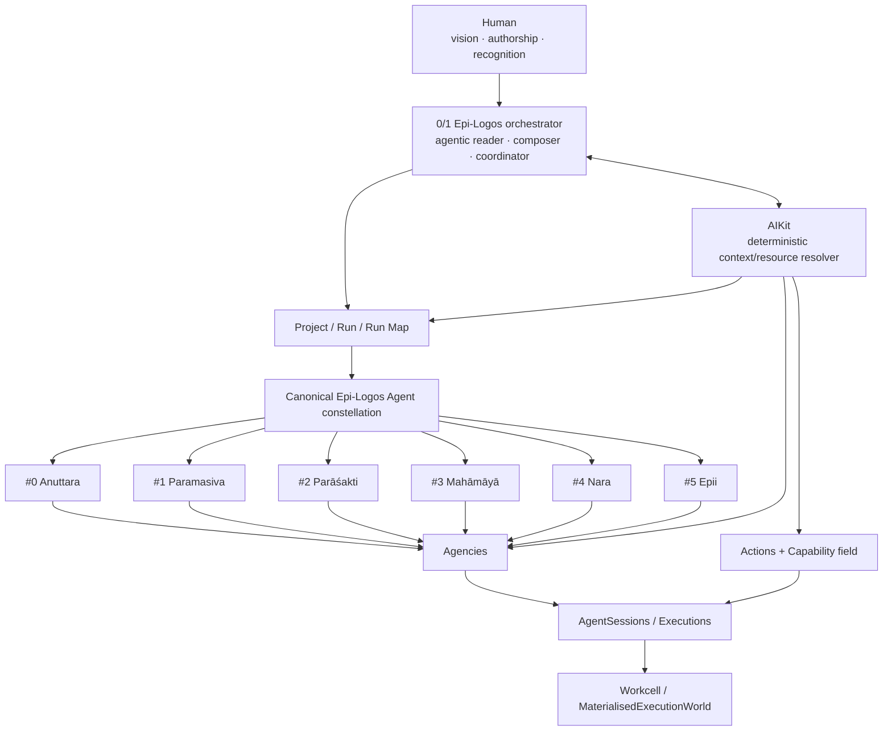
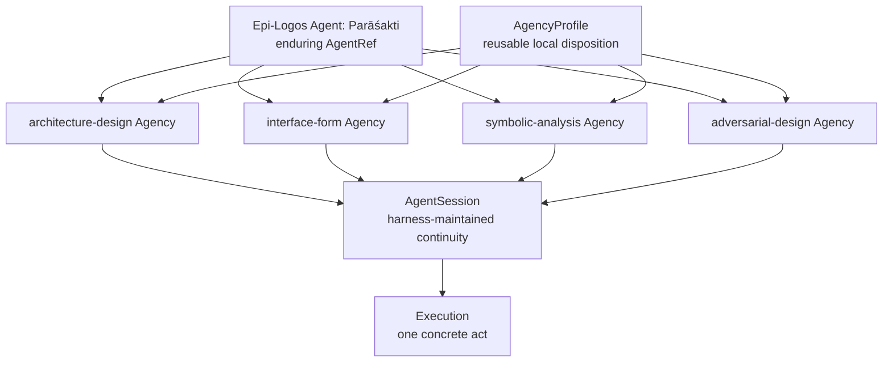
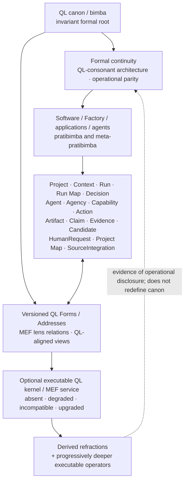
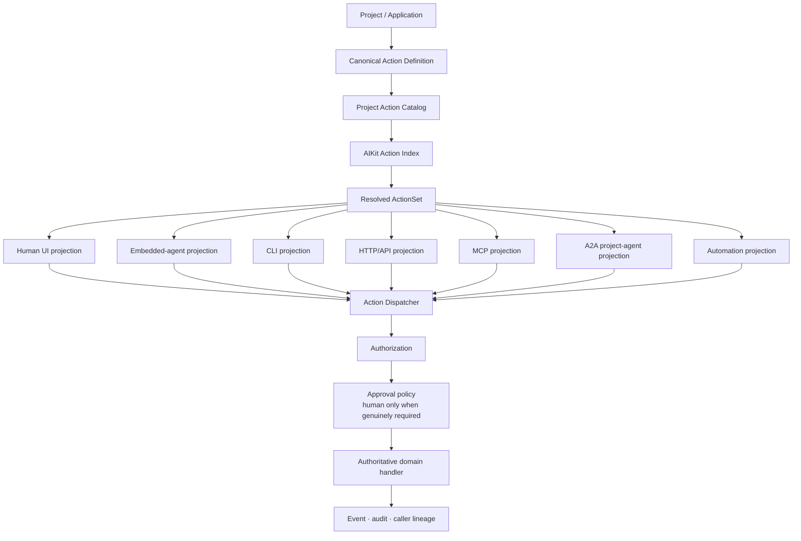
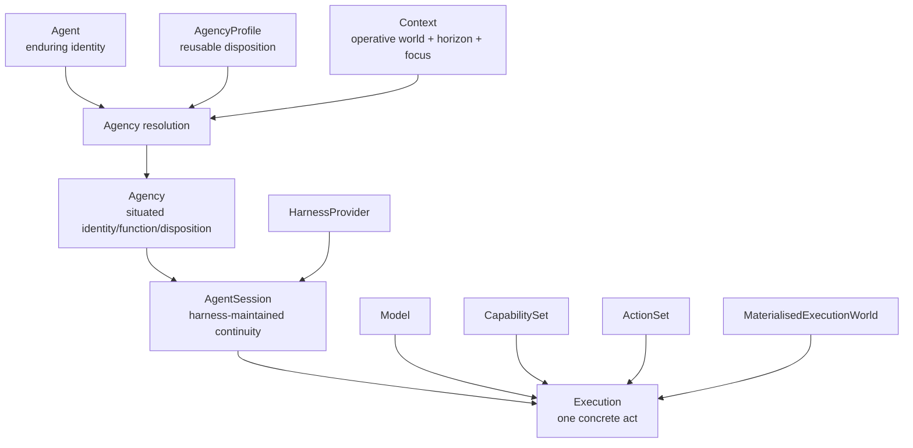
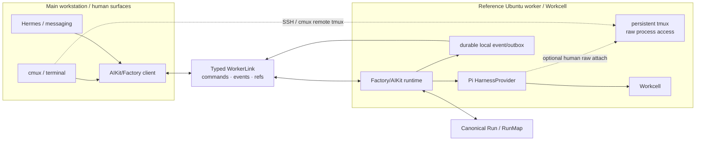
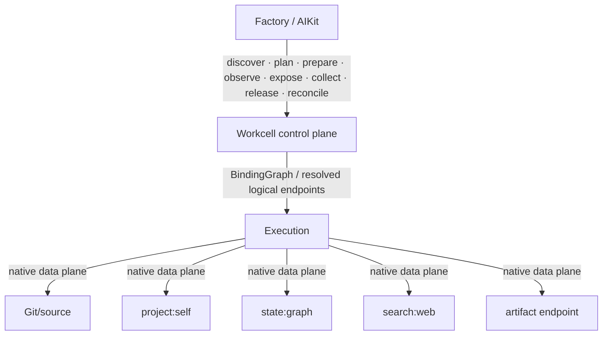
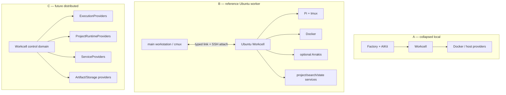
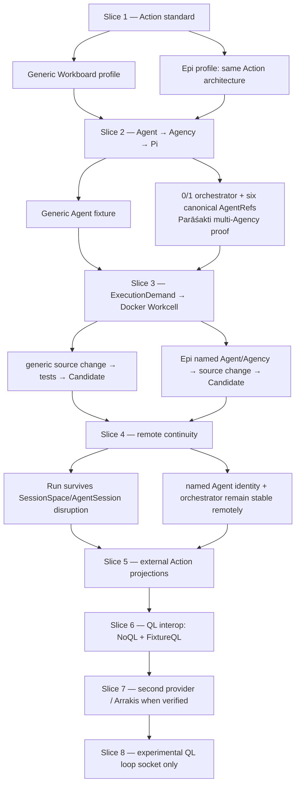

# WAYFINDER MAP — Agentic Execution Body

**Territories:** `E · F · H · I`  
**Status:** clean replacement / repo-entry architecture / development map  
**Regeneration date:** 2026-08-12  
**Governing precedence:** `QL-SOFTWARE-FACTORY-CONSTITUTIONAL-INDEX.md` → Architecture Spec → Primitive Relations → Workcell Module Spec → Deep QL Integration Foundations  
**Supersedes:** the prior `WAYFINDER MAP — Agentic Execution Body.md` as a whole; this is not a patch.

> **Joined question:** How does a persistent actor receive a coherent semantic world, invoke meaningful domain operations, execute through changing models/harnesses/material environments, and remain compatible with progressively deeper QL operation without ordinary software becoming dependent on unfinished QL research?

---

# 0. Constitutional determination

This map owns the **agentic/action/execution body** of the Factory. Its job is not to reduce the wider architecture into one runtime service. It fixes the relations by which:

- Project-owned **Actions** become available coherently to humans and agents;
- enduring **Agent** identity becomes situated **Agency** and concrete **Execution**;
- AIKit resolves the actor's operative world without becoming the actor;
- Harnesses such as Pi provide replaceable conversational/execution machinery;
- Workcell materialises provider-neutral `ExecutionDemand` into a concrete executable world;
- canonical Epi-Logos Agents remain fully present when that profile is active;
- QL remains the bimba/formal root of the architecture while the executable QL kernel/service remains optional, versioned and developable.

The following distinctions are therefore load-bearing:

```text
Action             ≠ Capability
Action             ≠ projection / transport
Agent              ≠ Agency
Agent              ≠ model / harness / session
Agency             ≠ optional sixfold identity metadata alone
AgentSession       ≠ SessionSpace
AgentSession       ≠ Run
Candidate          ≠ Workcell binding / environment
ExecutionDemand    ≠ provider prescription
Factory Ref        ≠ a second QL object identity
QL architecture    ≠ executable QL-service availability
Pi branch/fork     ≠ QL conjugacy
Epi orchestrator   ≠ AIKit
```

## 0.1 The two meta-levels in the Epi-Logos profile

The Architecture Spec establishes two complementary meta functions. They must remain separately visible.



For the Epi-Logos profile:

```text
0/1  Epi-Logos orchestrator / agentic reader-composer
#0   Anuttara
#1   Paramasiva
#2   Parāśakti
#3   Mahāmāyā
#4   Nara
#5   Epii
```

The six named positions are **enduring first-class `Agent` identities**. They are profile-scoped canonical Agents, not universal Factory stage names, not models, not harness sessions, not capability bundles, and not optional `AgencyProfile` fields. The 0/1 Epi-Logos orchestrator is likewise an agentic identity/function at the meta-level: it interprets and composes the six and coordinates the traversal. AIKit remains the deterministic operational resolver that tells those agents what resources, capabilities, Actions, models, harnesses, SessionSpaces and Workcells are available here and now.

A generic Project uses the same generic `Agent → Agency → AgentSession → Execution` architecture but may supply a completely different orchestrator and Agent set, or no special named constellation at all. Nothing in generic Factory execution requires Epi-Logos ontology.

## 0.2 Canonical Agents and optional Agency identity form are different structures

The Primitive Relations specification already distinguishes `QLForm: canonical-agent` from `QLForm: agent-identity`. This map makes that separation executable.



An `AgencyProfile` may carry:

```text
capability disposition
function
attitude / stance
workflow orientation
identity modulation
optional sixfold identity form
other project-native semantic detail
```

That optional form **does not contain or replace the canonical six-agent constellation**. It modulates the situated Agency of an already identified Agent.

## 0.3 QL architectural continuity and executable-service optionality

The entire Factory is deliberately QL-rooted. The optionality boundary sits at the **current executable formalisation/service**, not at QL's architectural relation to the software.



The executable QL service may disappear without breaking ordinary Action dispatch, Agent/Agency resolution, Run progression, Claims/Evidence, Candidate materialisation, Recognition or Recursion. That proves **operational independence**. It does not make the architecture QL-neutral.

All twelve MEF lenses remain structurally first-class. This map uses specific software roles only where the corpus grounds them: L0 Investigative, L1 Causal, L2 Logical, L3 Processual, L3′ Chronological, L4′ Knowledge Work, and L5 articulation/Vāk. The remaining lens anchors stay available as first-class refractive coordinates without invented software labels.

## 0.4 Determination-status vocabulary

Every executable node below carries one of:

| Status | Meaning |
|---|---|
| **CONSTITUTIONAL DETERMINATION** | fixed by the governing suite unless explicitly superseded at suite level |
| **CURRENT DESIGN** | sufficiently determined for implementation after named upstream/root contracts are resolved |
| **SOURCE-INSPECTION BLOCKED** | architecture is known but implementation must inspect/pin real upstream or existing repo source first |
| **OPEN SOCKET** | interface/extension point intentionally preserved; no current implementation semantics implied |
| **RESEARCH CLAIM** | experimental QL/agent semantics explicitly outside ordinary production requirements |

---

# 1. Ground and experiential intent

## 1.1 Human altitude

The execution body exists to give human attention **upward**, not to build a more ornate babysitting console.

Normal flow:

```text
human commissions
      ↓
agent/orchestrator performs substantial independent work
      ↓
Factory asks human only at genuine authorial/security/material boundaries
      ↓
human encounters Candidate reality
      ↓
recognise · return · redirect · compare · defer
```

Routine reversible local engineering, source inspection, test execution, ordinary environment allocation, local refactors within determined design, and recoverable implementation choices should proceed autonomously under policy. Human approval is appropriate when external/destructive consequence, security boundary, irreversible material commitment, or genuine authorship requires it. Approval machinery must never be used merely to compensate for weak agent confidence.

## 1.2 The agent is a first-class user

An active agent should be able to answer from the semantic system rather than reverse-engineering its terminal:

```text
who am I?
what Agency am I enacting?
what Project and Run am I inside?
what frontier / Decision owns the current work?
what Actions and Capabilities are available?
what Claims and Evidence govern the work?
what SourceIntegrations must be reused rather than imitated?
what material world do I inhabit?
what human authority exists?
what counts as completion?
```

## 1.3 Parallel acceptance profiles from the beginning

Two fixtures are mandatory throughout development:

```text
Generic Factory profile
Epi-Logos profile
```

The Generic profile proves the architecture has no hidden dependency on Epi ontology. The Epi-Logos profile proves that genericity has not silently erased the richest canonical case it exists to host.

The Epi fixture must demonstrate, from the first Agent/Agency/Harness vertical slice onward:

```text
0/1 orchestrator remains identifiable
six canonical AgentRefs remain stable
one canonical Agent resolves several Agencies
model/harness/host/provider/capability changes do not change AgentRef
optional Bimba horizon may disappear
executable QL service may disappear
ordinary Run semantics remain
```

---

# 2. Shared execution grammar

## 2.1 Canonical composition

```text
Agent
+ Agency
+ Context
+ AgentSession
+ Model
+ Harness
+ CapabilitySet
+ ActionSet
+ MaterialisedExecutionWorld
──────────────────────────────────────────────
→ Execution
```

`Execution` is one concrete act. The listed constituents are references/provenance of the act; they are not fused into a new enduring identity.

Agent identity must survive:

```text
model change
harness change
host change
SessionSpace replacement
AgentSession replacement where durable Run state permits reconstruction
Workcell/provider change
CapabilitySet change
ActionSet change caused by scoped availability/policy
```

Agency may change without creating a new Agent. AgentSession does not own Run identity.

## 2.2 One cross-map ExecutionDemand

`ExecutionDemand` is the root cross-map demand term for material execution. Earlier documents used the name in a narrower model-selection example; this map harmonises the concept as one semantic execution-demand envelope whose different consumers read only the parts they own.

```ts
type ExecutionDemand = {
  ref: Ref

  subjects: {
    project: ProjectRef
    run?: RunRef
    candidate?: CandidateRef
    agent?: AgentRef
    agency?: AgencyRef
  }

  required: AffordanceRequirement[]
  preferred: AffordanceRequirement[]
  optional: AffordanceRequirement[]

  workspace?: WorkspaceRequirement
  resources?: ResourceRequirement[]
  connectivity?: LogicalConnectionRequirement[]
  exposure?: ExposureRequirement[]
  persistence?: PersistenceRequirement[]
  isolation_trust?: IsolationTrustRequirement
  retention?: RetentionExpectation

  actor_runtime_hints?: {
    modalities?: string[]
    use_types?: string[]
    independence_from?: ModelRef[]
    user_constraints?: Constraint[]
  }
}
```

AIKit/runtime selection may consume `actor_runtime_hints`. Workcell consumes the **meaning-neutral material requirement view** plus subject references for provenance. Workcell never needs to understand why a Candidate exists or what an Epi Agent means.

`CandidateMaterialisationDemand` is a **specialised constructor/view of `ExecutionDemand`**, not a second primitive:

```ts
type CandidateMaterialisationDemand = ExecutionDemand & {
  subjects: {
    project: ProjectRef
    run: RunRef
    candidate: CandidateRef
    agent?: AgentRef
    agency?: AgencyRef
  }
}
```

Provider names do not appear in the semantic requirement set.

---

# 3. Actor / Action architecture



Invariant:

> **Projection adapters translate interaction shape. They do not implement project business logic.**

## 3.1 Action identity

Action identity is semantic and project-owned:

```ts
type ActionRef = {
  project: ProjectRef
  key: string      // stable project-local semantic key
  major: number    // breaking contract generation
}
```

This is the logical identity shape only. The final external serialization/encoding of `ActionRef` is imported from the shared root `Ref` contract and must not be invented in this map.

Transport names are projections:

```text
ActionRef             work_item.update@1
UI                     Save / Update work item
embedded agent         work_item.update
HTTP                   PATCH /work-items/:id
CLI                    work-item update
MCP                    work_item_update
A2A                    project-agent skill/task dispatch
```

No projection identifier becomes Action identity.

## 3.2 Canonical Action manifest

```ts
type ActionManifest = {
  schema_version: 1
  ref: ActionRef
  title: string
  description: string
  input_schema: JsonSchema
  output_schema?: JsonSchema

  effects: {
    class: "read" | "local_write" | "external_write" | "destructive"
    reversibility: "reversible" | "compensatable" | "irreversible"
    idempotency: "idempotent" | "idempotency_key" | "non_idempotent"
    concurrency: "parallel_safe" | "serialized" | "domain_managed"
  }

  authorization_policy: PolicyRef

  approval_policy: {
    mode: "none" | "policy" | "always"
    policy?: PolicyRef
    rationale_class?:
      | "security"
      | "external_consequence"
      | "destructive_irreversible"
      | "human_authorship"
  }

  exposure: {
    ui?: ProjectionPolicy
    embedded_agent?: ProjectionPolicy
    cli?: ProjectionPolicy
    http?: ProjectionPolicy
    mcp?: ProjectionPolicy
    a2a?: ProjectionPolicy
    automation?: ProjectionPolicy
  }

  implementation: DomainOperationRef
}
```

A project policy should ordinarily make reversible local engineering Actions executable without per-call human approval. `always` is exceptional and must name a defensible consequence/authorship class. Authorization answers whether a caller may act; approval answers whether an otherwise-authorised invocation crosses a boundary that requires a human decision.

## 3.3 Invocation and lineage

```ts
type ActionInvocation = {
  ref: InvocationRef
  action: ActionRef
  input: JsonValue

  actor?: AgentRef | HumanRef | ExternalActorRef
  agency?: AgencyRef

  lineage: {
    trace: TraceRef
    run?: RunRef
    agent_session?: AgentSessionRef
    session_space?: SessionSpaceRef
    parent_invocation?: InvocationRef

    surface:
      | "ui"
      | "embedded_agent"
      | "cli"
      | "http"
      | "mcp"
      | "a2a"
      | "automation"

    external?: {
      protocol?: string
      peer?: string
      correlation_id?: string
      identity_assurance: "verified" | "asserted" | "unknown"
    }
  }

  idempotency_key?: string
}
```

All projections normalise into the same invocation envelope **before** validation, authorization, approval and domain dispatch.

---

# 4. E — Agent-Native Standard & Action Architecture

## E.01 — Action identity and manifest

- **id:** `E.01`
- **purpose:** define one project-owned semantic operation with stable identity, typed contract, effect semantics, policy and authoritative implementation reference.
- **owner/system:** Project/Application domain layer.
- **inputs:** `ProjectRef`; stable project-local operation key; schemas; effects; authorization/approval policy; domain handler reference.
- **outputs:** `ActionManifest`; logical `ActionRef`.
- **dependencies:** shared root `Ref`/`ProjectRef`; project domain operation; policy primitives.
- **interfaces:** `ActionProvider.describe(ref)`; catalog ingestion.
- **source basis:** Constitutional Index Agent-Native standard; Deep QL Agent-Native foundations; Builder Agent-Native precedent for one Action powering human/agent/external surfaces.
- **acceptance:** route/tool/CLI names can change without changing Action identity; one handler is demonstrably authoritative.
- **test artifacts:** manifest goldens; breaking-major compatibility fixture; effects-policy validation fixture.
- **decisions already resolved:** `(ProjectRef, stable project-local key, breaking major)` is the semantic identity shape; exact external Ref encoding is imported.
- **prohibited hidden decisions:** deriving identity from transport; adding a second agent-only handler; collapsing Action into generic Capability.
- **determination status:** **CURRENT DESIGN**, blocked only on shared Ref serialization for final wire form.

## E.02 — Project Action Catalog

- **id:** `E.02`
- **purpose:** expose the authoritative discoverable inventory of verified Project/Application Actions.
- **owner/system:** Project/Application.
- **inputs:** native Action providers; verified legacy adapters; manifest revisions; source provenance.
- **outputs:** versioned `ActionCatalogSnapshot` with provider/source provenance.
- **dependencies:** `E.01`; `SourceIntegration` contracts.
- **interfaces:** `ActionProvider.list()`; `ActionProvider.get(ActionRef)`; catalog health.
- **source basis:** Constitutional Index: every adopted project should move toward a discoverable Action Catalog; AIKit indexes rather than reimplements.
- **acceptance:** catalog can be discovered without UI scraping; stale/unavailable provider is explicit; every executable entry resolves to real implementation source.
- **test artifacts:** native-catalog fixture; duplicate ActionRef rejection; stale provider fixture.
- **decisions already resolved:** Project/Application owns semantics; a Catalog may aggregate several project-local providers.
- **prohibited hidden decisions:** making AIKit the Action authoring database; silently promoting inferred Actions.
- **determination status:** **CONSTITUTIONAL DETERMINATION** for ownership; **CURRENT DESIGN** for snapshot/provider shape.

## E.03 — AIKit Action index and ActionSet resolution

- **id:** `E.03`
- **purpose:** index Project Action Catalogs and resolve the currently available/relevant/permitted Action field for an actor.
- **owner/system:** AIKit.
- **inputs:** catalog snapshots; Project/Profile/Scope; Agent/Agency; Run/Focus; trust/permission/availability; learned relevance/frecency as separate signals.
- **outputs:** `ActionSet` / resolution explanation.
- **dependencies:** `E.02`; `I.05` Agency resolution; AIKit context resolver from Map B.
- **interfaces:** `index_action_catalog`; `resolve_action_set`; `explain_action_resolution`.
- **source basis:** Constitutional Index and Deep QL foundations: AIKit indexes/resolves Actions in the wider capability field.
- **acceptance:** same Catalog produces different ActionSets for different Agencies/permissions without changing catalog semantics; missing Actions remain explainable.
- **test artifacts:** human/agent/automation ActionSet fixtures; Generic and Epi profile fixtures; permission omission tests.
- **decisions already resolved:** visibility/discoverability/invocability are distinct; QL affinity may inform but may not hard-code access.
- **prohibited hidden decisions:** one opaque blended relevance score; QL position as exclusive Action taxonomy; AIKit-owned business logic.
- **determination status:** **CURRENT DESIGN**, implementation requires current AIKit source inspection.

## E.04 — Authorization, approval and human-altitude policy

- **id:** `E.04`
- **purpose:** enforce caller authority and genuine human boundaries without turning approval into routine babysitting.
- **owner/system:** Project policy / Action runtime.
- **inputs:** Action effects; principal; Agency; Project policy; Run/Decision context.
- **outputs:** `authorised | denied`; `execute | human_request_required`.
- **dependencies:** `E.01`; shared Policy; `HumanRequest`/`Decision` from Factory Core.
- **interfaces:** `authorize(invocation)`; `evaluate_approval(invocation)`.
- **source basis:** Constitutional human-authority apertures; user-facing telos explicitly says routine technical choices and reversible local decisions should not be escalated merely because a human exists.
- **acceptance:** reversible local fixture executes autonomously; destructive/external/security/authorship fixture correctly generates a HumanRequest before side effects.
- **test artifacts:** policy matrix; autonomous-local fixture; irreversible-delete fixture; external-send fixture; authorial-choice fixture.
- **decisions already resolved:** authorization ≠ approval; approval is consequence/authorship-driven, not uncertainty-driven.
- **prohibited hidden decisions:** `agent => require approval`; automation pre-approved by default; performing effects before approval resolves; escalating ordinary engineering because confidence is low.
- **determination status:** **CONSTITUTIONAL DETERMINATION**.

## E.05 — Action dispatcher, validation, lineage and audit

- **id:** `E.05`
- **purpose:** provide the one trusted dispatch path shared by every projection.
- **owner/system:** Project runtime / reusable Factory Action runtime library.
- **inputs:** `ActionInvocation`; manifest; principal; policy state.
- **outputs:** typed result/error/pending HumanRequest; Action Events; caller lineage.
- **dependencies:** `E.01`; `E.04`; Event/Trace; Claim/Evidence where operation results bear epistemic weight.
- **interfaces:** `dispatch(ActionInvocation)`.
- **source basis:** Action standard requires same schema/permissions/caller-lineage/audit across surfaces.
- **acceptance:** no enabled surface bypasses schema validation, authorization, applicable approval, handler or audit; nested calls preserve parent lineage.
- **test artifacts:** nested invocation chain; audit reconstruction; idempotency replay; concurrency fixture.
- **decisions already resolved:** projection normalisation occurs before policy/handler; external identity assurance remains explicit.
- **prohibited hidden decisions:** surface-specific policy shortcuts; treating remote identity metadata as trusted without verification.
- **determination status:** **CURRENT DESIGN**.

## E.06 — Projection adapters

- **id:** `E.06`
- **purpose:** expose selected Actions through human UI, embedded agent, CLI, HTTP/API, MCP, A2A and automation without duplicating domain semantics.
- **owner/system:** projection layer / project adapter layer.
- **inputs:** Action manifest + projection policy + resolved ActionSet.
- **outputs:** transport/client-specific descriptors and invocation adapters.
- **dependencies:** `E.03`; `E.05`.
- **interfaces:** `ActionProjection.describe`; `ActionProjection.invoke` → canonical dispatcher.
- **source basis:** Constitutional Agent-Native diagram; Builder's current Agent-Native precedent demonstrates one Action powering UI, agent, HTTP, MCP, A2A and CLI.
- **acceptance:** cross-surface parity suite produces semantically equivalent state transition and same `ActionRef` with only caller lineage varying.
- **test artifacts:** UI↔agent↔MCP mandatory parity; HTTP/CLI/A2A additional parity.
- **decisions already resolved:** exposure is opt-in per surface; projections translate surface grammar only.
- **prohibited hidden decisions:** transport-specific business logic; assuming every Action is safe to expose everywhere.
- **determination status:** **CURRENT DESIGN**.

## E.06a — MCP Action projection

- **id:** `E.06a`
- **purpose:** project selected Actions as MCP tools while retaining Factory identity/policy.
- **owner/system:** MCP projection adapter.
- **inputs:** ActionSet; manifests; MCP source/version configuration.
- **outputs:** MCP tool descriptors and tool calls mapped to `ActionInvocation`.
- **dependencies:** `E.05`; verified MCP `SourceIntegration`.
- **interfaces:** current MCP tool discovery/call primitives; protocol extensions only where explicitly supported by the pinned spec.
- **source basis:** current MCP 2026-07-28 specification has a stateless protocol core; MCP is a tool/resource protocol rather than Factory session identity.
- **acceptance:** MCP caller invokes same handler/policy/audit path as UI/embedded agent; reconnect does not create or imply a Factory AgentSession.
- **test artifacts:** MCP conformance fixture; denied caller; approval HumanRequest; stateless reconnect.
- **decisions already resolved:** MCP protocol state never defines Run or AgentSession identity.
- **prohibited hidden decisions:** trusting client metadata as canonical Agent; recreating MCP server semantics locally instead of using official SDK/protocol.
- **determination status:** **CURRENT DESIGN**, source pin required before implementation.

## E.06b — A2A project-agent projection

- **id:** `E.06b`
- **purpose:** let external agents interact with selected Project operations through an A2A-compliant project/application Agent boundary.
- **owner/system:** Project A2A adapter/agent.
- **inputs:** selected ActionSet; Agent Card/Skills; incoming Message/Task; remote identity/security context.
- **outputs:** A2A response/Task backed by audited local Action invocation(s).
- **dependencies:** `E.05`; `I.01–I.07`; verified A2A v1 `SourceIntegration`.
- **interfaces:** A2A v1 Agent Card, Agent Skills, Messages/Parts, Tasks and supported bindings.
- **source basis:** A2A v1 is a stable agent-to-agent standard; it is not another MCP-style Action registry.
- **acceptance:** remote Task and local Run remain distinct linked identities; remote agent does not become a canonical local Agent unless separately adopted.
- **test artifacts:** Agent Card fixture; structured-data invocation; long-running Task; permission denial; cancellation mapping where used.
- **decisions already resolved:** selected Actions are reachable through an application/project agent skill/capability boundary.
- **prohibited hidden decisions:** `A2A Task = Factory Run`; `remote agent = local AgentRef`; duplicating Action handler inside the A2A server.
- **determination status:** **CURRENT DESIGN**, exact SDK/binding pinned by SourceIntegration.

## E.07 — Agent-resource discovery

- **id:** `E.07`
- **purpose:** make project-local agents, instructions, context resources, MCP/A2A endpoints, Actions and capability resources discoverable through one context-scoped AIKit surface.
- **owner/system:** AIKit resource index.
- **inputs:** Project resource providers; profile/scope; source provenance.
- **outputs:** resolved resource descriptors attached to Context.
- **dependencies:** Map B AIKit resource model; `E.03`; `I.05`.
- **interfaces:** generic resource-provider/index seam imported from actual AIKit implementation.
- **source basis:** Deep QL foundations explicitly place agent resources in the Project/AIKit surface.
- **acceptance:** agent sees relevant addressable resources without indiscriminate prompt loading; source/availability remains explainable.
- **test artifacts:** project/profile/session scope fixtures; stale resource fixture.
- **decisions already resolved:** availability ≠ loaded context; progressive retrieval remains valid.
- **prohibited hidden decisions:** inventing a second Project resource registry; dumping every resource into every model prompt.
- **determination status:** **CURRENT DESIGN**, actual AIKit insertion point source-blocked.

## E.08 — Legacy Action recovery

- **id:** `E.08`
- **purpose:** recover candidate domain operations from existing projects without fabricating an Agent-Native surface.
- **owner/system:** Project Bootstrap / analysis agents, with final adoption owned by E Action architecture.
- **inputs:** APIs; service methods; CLI; UI operations; MCP tools; application events; tests/docs; code graph.
- **outputs:** proposed Action Claims + Evidence + suggested native seam.
- **dependencies:** Project Map; Claim/Evidence; SourceIntegration.
- **interfaces:** recovery analyzer; adoption review into `ActionProvider`.
- **source basis:** Constitutional Index: recovered Actions remain Claims until verified against code/application.
- **acceptance:** recovered proposal cannot enter executable catalog until real implementation seam is verified; duplicated business logic is reported rather than normalised silently.
- **test artifacts:** REST app; CLI app; UI-only app; existing MCP app; duplicated-handler fixture.
- **decisions already resolved:** adapt strong native operations instead of replacing them simply to fit Factory taste.
- **prohibited hidden decisions:** generating fake handlers from docs; treating naming similarity as semantic identity.
- **determination status:** **CONSTITUTIONAL DETERMINATION** for Claim status; **CURRENT DESIGN** for recovery workflow.

## E.09 — Reference Agent-Native Workboard fixture

- **id:** `E.09`
- **purpose:** provide the golden cross-surface implementation proof.
- **owner/system:** Factory fixtures/reference projects.
- **inputs:** simple Workboard domain with `work_item.update@1` and read/destructive companions.
- **outputs:** UI, embedded-agent, MCP mandatory projections; CLI/HTTP/A2A where enabled.
- **dependencies:** `E.01–E.08`.
- **interfaces:** all enabled projections through one dispatcher/handler.
- **source basis:** user-required whole-system proof + Agent-Native standard.
- **acceptance:** human, embedded agent and MCP execute one state transition with same ActionRef, schema, handler, policy and coherent lineage.
- **test artifacts:** fixture itself; parity report.
- **decisions already resolved:** fixture is generic and QL-service-independent; QL may later refract the same Action without changing it.
- **prohibited hidden decisions:** granting fixture agents privileged bypasses; separate tool-specific mutation implementation.
- **determination status:** **READY CURRENT DESIGN**.

---
# 5. I — Agent / Agency / Harness & Personal Orchestration

## 5.1 Generic agentic execution topology



This is the common runtime for a generic coding agent, an imported project agent, Anuttara, Paramasiva, Parāśakti, Mahāmāyā, Nara, Epii, and the Epi-Logos orchestrator. The identities and Agency Profiles may be radically richer in Epi-Logos; the runtime relation does not fork.

## I.01 — Generic Agent identity contract

- **id:** `I.01`
- **purpose:** provide enduring actor identity independent of model, harness, host, session, capabilities and material provider.
- **owner/system:** Project for project-local Agents; shared reusable agent registry where explicitly required.
- **inputs:** stable `AgentRef`; identity Artifact/ref; project/profile membership; optional QLForm relations.
- **outputs:** `AgentDefinition`.
- **dependencies:** shared `Ref`; Project; Artifact.
- **interfaces:** agent registry/query; Context references.
- **source basis:** Primitive Relations: Agent is persistent identity and functional orientation surviving model/harness/local capability/host/session changes.
- **acceptance:** identity-survival matrix leaves AgentRef unchanged across all permitted execution substitutions.
- **test artifacts:** generic Agent fixture + every canonical Epi Agent fixture.
- **decisions already resolved:** Agent is not Model, Harness, AgentSession, SessionSpace, CapabilitySet or Agency.
- **prohibited hidden decisions:** encoding model/provider/host into AgentRef; creating one Agent per task stance.
- **determination status:** **CONSTITUTIONAL DETERMINATION**.

## I.02 — Canonical Epi-Logos Agent constellation

- **id:** `I.02`
- **purpose:** preserve the profile-scoped canonical six-agent identity as first-class Agent definitions rather than optional Agency metadata.
- **owner/system:** Epi-Logos Project/Profile.
- **inputs:** `QLForm: canonical-agent`; canonical identity Artifacts; Epi-Logos Project/Profile activation.
- **outputs:** six stable `AgentRef`s: Anuttara, Paramasiva, Parāśakti, Mahāmāyā, Nara, Epii.
- **dependencies:** `I.01`; QL Form/Address imported from shared semantic core; Epi project canon.
- **interfaces:** standard Agent registry and Agency resolution; no separate Epi runtime API.
- **source basis:** Architecture Spec explicitly defines the six as canonical Agents; Primitive Relations separately names `QLForm: canonical-agent` and `QLForm: agent-identity`.
- **acceptance:** all six AgentRefs remain stable while model, harness, host, SessionSpace, AgentSession, Workcell provider and Agency change.
- **test artifacts:** six-agent identity table; multi-Agency fixture per at least Parāśakti, Nara and Epii; provider/model substitution matrix.
- **decisions already resolved:** named Agents are profile-scoped canonical, not universal Factory stage names and not optional identity-extension fields.
- **prohibited hidden decisions:** demoting them into AgencyProfile metadata; treating `#0…#5` as merely labels on anonymous generic workers; hard-coding one Agency per Agent.
- **determination status:** **CONSTITUTIONAL DETERMINATION**.

## I.03 — 0/1 Epi-Logos orchestrator

- **id:** `I.03`
- **purpose:** preserve the Epi-Logos agentic meta reader/composer that interprets and composes the canonical six while remaining distinct from AIKit.
- **owner/system:** Epi-Logos Project/Profile.
- **inputs:** human commission/Recognition; Run/RunMap state; canonical Agent refs; Agent/Agency outputs; Project Context; AIKit resolution results.
- **outputs:** agentic coordination decisions, requests for specific Agent/Agency activity, Run-facing Claims/Decisions/Artifacts according to Factory Core contracts.
- **dependencies:** `I.01`; `I.02`; AIKit; Run Map; Claims/Decisions.
- **interfaces:** ordinary Agent/Agency/Execution interfaces plus orchestration Actions imported from Factory Core; no privileged mutation bypass.
- **source basis:** Architecture Spec §0 and meta-layer: Epi-Logos reads/composes the six at agentic `0/1`; AIKit supplies the operational meta-level.
- **acceptance:** orchestrator remains identifiable as an Agent-level actor while AIKit can be replaced/restarted without becoming the orchestrator; coordination goes through canonical Run/Decision interfaces.
- **test artifacts:** Epi orchestration fixture covering two named Agents; AIKit restart fixture; generic-project fixture showing no requirement for this orchestrator.
- **decisions already resolved:** orchestrator ≠ AIKit; interpretive judgement lives here/agents, deterministic resolution in AIKit.
- **prohibited hidden decisions:** implementing orchestration as hidden AIKit policy; granting the orchestrator direct storage mutation outside Factory semantics.
- **determination status:** **CONSTITUTIONAL DETERMINATION**.

## I.04 — AgencyProfile

- **id:** `I.04`
- **purpose:** represent reusable local dispositions through which an Agent may act without multiplying canonical Agent identities.
- **owner/system:** Project/Profile/AIKit profile surface according to shared ownership rules.
- **inputs:** function; attitude/stance; capability disposition; workflow orientation; identity modulation; optional versioned sixfold identity form; project-native semantic detail.
- **outputs:** `AgencyProfileRef` / reusable profile descriptor.
- **dependencies:** `I.01`; Capability/Action refs; optional `QLForm: agent-identity`.
- **interfaces:** Agency resolver input; profile explainability.
- **source basis:** Primitive Relations: Agency profile can expand beyond capability resolution and may carry small/substantial identity determinations; generic primitive remains Agency.
- **acceptance:** one Parāśakti Agent can instantiate architecture-design, interface-form, symbolic-analysis and adversarial-design Agencies from distinct or composed profiles without creating new Agents.
- **test artifacts:** four Parāśakti AgencyProfile fixtures + generic coder profile.
- **decisions already resolved:** optional sixfold identity form belongs here as one modulation seam and is **not** the canonical Agent constellation.
- **prohibited hidden decisions:** using profile identity form as AgentRef; requiring sixfold identity content for generic agents.
- **determination status:** **CONSTITUTIONAL DETERMINATION** for separation; **CURRENT DESIGN** for exact profile schema after AIKit source inspection.

## I.05 — Agency resolution

- **id:** `I.05`
- **purpose:** determine the situated identity/function/disposition through which a named Agent acts in the current Context.
- **owner/system:** AIKit deterministic resolver + Factory semantic inputs.
- **inputs:** AgentRef; zero/more AgencyProfiles; Project/Profile/Scope; Run/Focus; Action/Capability availability; policy/trust; optional lens orientation.
- **outputs:** `AgencySnapshot` / `AgencyRef`; explanation of resolved composition.
- **dependencies:** `I.01`; `I.04`; `E.03`; Map B Context resolution.
- **interfaces:** `resolve_agency`; `explain_agency`.
- **source basis:** Primitive Relations defines Agency as local/scoped determination of Agent identity/function/capability; AIKit resolves operational context.
- **acceptance:** same Agent may resolve distinct Agencies for distinct acts; equivalent resolver inputs produce reproducible composition subject to explicit learned/policy inputs.
- **test artifacts:** Generic profile and Epi profile matrices; Agency change without Agent change; unavailable capability degradation.
- **decisions already resolved:** Agency is more than capability set; lens orientation or identity modulation may participate without redefining Agent.
- **prohibited hidden decisions:** model selection creating a new Agency unless Agency semantics actually changed; hiding resolver reasons.
- **determination status:** **CURRENT DESIGN**, actual AIKit implementation seam must be inspected.

## I.06 — Execution composition record

- **id:** `I.06`
- **purpose:** record one concrete act without promoting transient execution machinery into actor identity.
- **owner/system:** Factory runtime / Event-Trace substrate.
- **inputs:** AgentRef; AgencyRef; ContextRef; Run/focus; AgentSessionRef; ModelRef; HarnessRef; CapabilitySetRef; ActionSetRef; MaterialisedExecutionWorldRef; input refs.
- **outputs:** `ExecutionRef`; output Artifact/Claim/Event refs; execution provenance.
- **dependencies:** `I.01–I.05`; `F.09`; shared Event/Trace.
- **interfaces:** execution start/finish/status records.
- **source basis:** Primitive Relations defines Execution as one concrete act binding durable semantic world to transient computational world.
- **acceptance:** many Executions may belong to one AgentSession/Run; replacing Model/Workcell changes execution provenance, not Agent identity.
- **test artifacts:** model-switch and provider-switch execution histories.
- **decisions already resolved:** Execution is numerous/disposable relative to Project/Run/Agent.
- **prohibited hidden decisions:** using ExecutionRef as AgentSession or Run identity; placing provider-specific fields into canonical Agent/Run records.
- **determination status:** **CONSTITUTIONAL DETERMINATION** for semantics; exact persistence type imported from Factory Core.

## I.07 — HarnessProvider contract

- **id:** `I.07`
- **purpose:** isolate Agent/Run semantics from the concrete model-facing harness.
- **owner/system:** Factory runtime.
- **inputs:** AgentSession spec; resolved Context projection; execution input.
- **outputs:** opaque provider-session handle; streamed harness events/results.
- **dependencies:** Agent/Agency; Event/Trace; model/harness availability from AIKit.
- **interfaces:** baseline:

```text
capabilities()
start(spec)
resume(session, input)
stream(execution)
stop(session)
```

Negotiated capabilities may include:

```text
interrupt
provider_fork / branch
model_switch
structured_tool_events
```

- **source basis:** Architecture Spec defines HarnessProvider around start/resume/stream/stop; current correction requires additional operations to be negotiated, not assumed.
- **acceptance:** mock provider and Pi pass the same baseline contract; absence of fork/interrupt remains a capability result, not interface failure.
- **test artifacts:** generic harness contract suite; capability-negotiation matrix.
- **decisions already resolved:** provider session handle remains opaque; Harness is an execution choice rather than Agent identity.
- **prohibited hidden decisions:** assuming all harnesses branch, resume identically, expose tool events identically, or support one fixed model.
- **determination status:** **CURRENT DESIGN**.

## I.08 — Pi HarnessProvider

- **id:** `I.08`
- **purpose:** provide the first concrete coding harness while preserving Factory session/identity semantics.
- **owner/system:** Factory Pi adapter; reuse SSSF integration where source inspection proves it.
- **inputs:** AgentSession spec; resolved Context; Pi source/version; existing SSSF adapter source where available.
- **outputs:** Pi provider handle; mapped stream events; execution results.
- **dependencies:** `I.07`; verified Pi `SourceIntegration`; `source/sssf-pi-adapter` inspection.
- **interfaces:** structured Pi RPC/JSONL or direct SDK seam if actual repo/language integration justifies it; no terminal-presentation parser when structured seam is available.
- **source basis:** Pi upstream currently documents headless RPC over strict LF-delimited JSONL and an in-process AgentSession API for Node/TS clients. Architecture Spec requires proven SSSF Pi adapter reuse where available.
- **acceptance:** start/resume/stream/stop; structured events map to Factory trace; Pi session loss cannot erase Run/Decision state.
- **test artifacts:** RPC transcript fixture; subprocess crash; resume where supported; provider capability detection; stdout-protocol integrity fixture.
- **decisions already resolved:** Pi native session identity does not become Factory `AgentSession`; terminal panes are not canonical telemetry.
- **prohibited hidden decisions:** rewriting a proven SSSF adapter before inspection; screen scraping; claiming Pi branching has QL meaning.
- **determination status:** **SOURCE-INSPECTION BLOCKED** for final adapter implementation; contract is **CURRENT DESIGN**.

## I.09 — AgentSession and ordinary session relations

- **id:** `I.09`
- **purpose:** represent harness-maintained conversational/execution continuity while being truthful about what continuity exists.
- **owner/system:** Factory runtime with provider handle delegated to HarnessProvider.
- **inputs:** AgentRef; AgencyRef; Run/focus; HarnessProvider; optional predecessor/session relation.
- **outputs:** Factory `AgentSessionRef` + provider handle/provenance.
- **dependencies:** `I.07`; Run; Context.
- **interfaces:** create/resume/close; relations supported now:

```text
fresh
resumed
provider_forked / provider_branched   // only when harness reports support
alternate_execution
nested_ordinary_execution             // only when ordinary parent/child semantics are explicit
```

- **source basis:** Primitive Relations defines AgentSession as harness-maintained resumable context; correction explicitly removes invented conjugate-session semantics.
- **acceptance:** provider fork is recorded as provider fork; reconstructed new session after loss is not falsely labelled resumed; nested ordinary execution has explicit parent lineage.
- **test artifacts:** fresh/resumed/fork-supported/fork-unsupported/alternate/nested fixtures.
- **decisions already resolved:** `Pi branch ≠ QL conjugacy`; no production `conjugate_of` session semantics are fixed here.
- **prohibited hidden decisions:** “conjugate session is fresh”; automatically copying/withholding sibling transcripts in the name of QL; equating branch ancestry with epistemic conjugacy.
- **determination status:** **CURRENT DESIGN** for ordinary relations; conjugate/native relations are **RESEARCH CLAIM / OPEN SOCKET**.

## I.10 — SessionSpace adapters

- **id:** `I.10`
- **purpose:** project Runs/AgentSessions/Candidates into human-operable workspaces without making workspace state authoritative.
- **owner/system:** AIKit session-space adapters.
- **inputs:** ProjectRef; RunRef; AgentSessionRefs; CandidateRefs; user/workspace preferences.
- **outputs:** SessionSpaceRef/layout/projection bindings.
- **dependencies:** cmux/tmux/terminal SourceIntegrations; AIKit current session implementation.
- **interfaces:** create/reconcile/open/attach/detach/destroy projection.
- **source basis:** Primitive Relations: SessionSpace views/controls Runs and does not own them; cmux can open SSH workspaces/remote tmux; tmux detaches processes while they continue.
- **acceptance:** destroy local cmux workspace and recreate from canonical semantic refs; attach via tmux without changing Run/Agent identity.
- **test artifacts:** cmux recreation; tmux detach/reattach; plain-terminal fallback.
- **decisions already resolved:** `SessionSpace ≠ AgentSession ≠ Run`.
- **prohibited hidden decisions:** pane/tab IDs as AgentSession IDs; terminal contents as source of canonical Run state.
- **determination status:** **CURRENT DESIGN**, exact AIKit adapter insertion source-blocked.

## I.11 — Typed remote WorkerLink and event continuity

- **id:** `I.11`
- **purpose:** let main and worker hosts exchange canonical commands/events/refs while work continues through disconnection.
- **owner/system:** Factory/AIKit host-link layer.
- **inputs:** typed control operations; event/outbox records; artifact refs; host identity/authentication.
- **outputs:** acknowledged/replayed typed streams and remote control results.
- **dependencies:** per-host durable event/outbox storage; HostRef; Run semantics.
- **interfaces:** logical `WorkerLink`; first transport chosen only after repo/network source inspection.
- **source basis:** Architecture Spec favours per-host local state and typed sync rather than network-mounted SQLite; remote control must not depend on screen scraping.
- **acceptance:** disconnect, worker continues, reconnect, idempotent replay, no duplicated canonical mutation.
- **test artifacts:** network partition; duplicate replay; sequence-gap; host restart.
- **decisions already resolved:** semantic continuity comes from canonical Run state + typed events; tmux is process/session substrate, not sync protocol.
- **prohibited hidden decisions:** shared SQLite file; scraping panes for state; transport-specific semantics in Run/Agent objects.
- **determination status:** **CURRENT DESIGN** for semantic contract; transport is **OPEN DECISION** dependent on repo deployment design.

## I.12 — Hermes front door

- **id:** `I.12`
- **purpose:** let the human initiate, inspect, answer and intervene from persistent messaging without turning Hermes into Factory identity/state authority.
- **owner/system:** Hermes projection adapter.
- **inputs:** user message; authenticated Project/Run context; Factory headless Actions/API/MCP surface.
- **outputs:** canonical Factory operations plus human-readable responses.
- **dependencies:** verified Hermes SourceIntegration; Factory orchestration/Action surfaces.
- **interfaces:** narrow headless interface selected after source inspection; Hermes currently supports messaging and profile-scoped agent resources/MCP integrations.
- **source basis:** architecture names Hermes as front door; current upstream provides Telegram and other gateway/profile surfaces.
- **acceptance:** status, commission/resume, HumanRequest answer, Run return/redirect and Candidate-open request alter canonical Factory state through typed operations; Hermes state loss is recoverable from Factory state.
- **test artifacts:** fake gateway client; lost-Hermes-state; remote intervention fixture.
- **decisions already resolved:** Hermes is projection/front door, not canonical Agent/Run/Project store.
- **prohibited hidden decisions:** importing Hermes memory as Project Canon automatically; terminal-manipulation interventions.
- **determination status:** **SOURCE-INSPECTION BLOCKED** for exact adapter seam; architectural role is **CURRENT DESIGN**.

## I.13 — Run/Agent identity survival and recovery

- **id:** `I.13`
- **purpose:** prove durable semantic identity survives transient runtime loss/substitution.
- **owner/system:** Factory runtime.
- **inputs:** Run/RunMap; Agent/Agency refs; durable Artifacts/Claims/Decisions/Events; surviving provider handles where any.
- **outputs:** resumed or reconstructed execution context with truthful continuity classification.
- **dependencies:** `I.01–I.12`; Factory Core persistence.
- **interfaces:** recover/reconstruct/rebind execution.
- **source basis:** Primitive Relations makes Run one of the strongest persistence boundaries and explicitly says it may use several AgentSessions and outlive workspaces/hosts.
- **acceptance:** Run survives AgentSession loss, SessionSpace replacement, host move, model/harness/provider substitution; AgentRef remains stable when semantic Agent is the same.
- **test artifacts:** full identity-survival matrix; crash between events; host failover fixture.
- **decisions already resolved:** reconstructed continuity must not be labelled resumed if provider conversational state was lost.
- **prohibited hidden decisions:** storing the only consequential Decision/frontier in a harness transcript; Agent identity inference from current session.
- **determination status:** **CONSTITUTIONAL DETERMINATION** for lifetime; **CURRENT DESIGN** for recovery interfaces.

## I.14 — Experimental execution-mode socket

- **id:** `I.14`
- **purpose:** reserve runtime attachment points for deeper QL-native/conjugate/nested loop experiments without deciding their semantics in production AgentSession.
- **owner/system:** experimental harness/QL integration boundary.
- **inputs:** experimental operator/form; one or more canonical Agent/Agency/Run refs; harness capabilities.
- **outputs:** experimental Execution/Trace/Artifact/Claim refs with explicit experimental provenance.
- **dependencies:** `I.07`; `H.10`; experimental source/QL canon work.
- **interfaces:** extension registration only; no fixed `conjugate_of` production field semantics.
- **source basis:** Deep QL foundations require experimental agent loops remain pluggable; current correction explicitly classifies conjugate/native loop semantics as research.
- **acceptance:** production AgentSession model remains unchanged when no experiment provider is installed; experimental traces cannot silently mutate canonical Run semantics outside normal APIs.
- **test artifacts:** no-provider fixture; experimental stub provider; explicit “semantics unsupported” result.
- **decisions already resolved:** Pi/harness branch is not QL conjugacy; infrastructure may enable experiments without defining their answer.
- **prohibited hidden decisions:** transcript-copy policy as conjugacy; production control flow driven by speculative operator semantics.
- **determination status:** **OPEN SOCKET / RESEARCH CLAIM**.

---

# 6. Remote continuity and human intervention



Remote intervention uses typed operations against Run/Decision/HumanRequest/Action surfaces. tmux/cmux remain invaluable inspection/control substrates but are never the semantic mutation API.

---
# 7. F — Workcell Runtime

## 7.1 Boundary

The Workcell is the **materialisation module**, not a second Factory ontology.

```text
Factory / AIKit
  understands Project, Run, Candidate, Agent, Agency,
  Capability/Action availability, execution purpose and policy
        │
        │ ExecutionDemand
        ▼
Workcell
  understands operational offers, providers, workspace,
  runtime placement, service reachability, bindings,
  lifecycle, capacity and observed state
        │
        ▼
MaterialisedExecutionWorld
        │
        ▼
physical computation
Docker · MicroVM · VM · host process · remote service · storage · network
```

Workcell never owns:

```text
Project meaning
Run identity / Run Map meaning
Candidate identity
Agent identity
Agency characterology
Claim truth
Recognition
Project Canon
QL process
```

## 7.2 Control and data plane



The Workcell resolves connectivity; it does not become a universal application-data proxy.

## F.01 — Workcell external contract

- **id:** `F.01`
- **purpose:** expose a deliberately small provider-neutral materialisation surface to Factory/AIKit.
- **owner/system:** Workcell Core.
- **inputs:** `ExecutionDemand`; Workcell configuration/current provider inventory.
- **outputs:** Workcell identity/offers; plans; `MaterialisedExecutionWorld`; observations; exposures; collected refs; release/reconciliation results.
- **dependencies:** shared Ref/Host/Environment relation contracts; Event/Claim/Evidence interoperability.
- **interfaces:** `discover`, `plan`, `prepare`, `observe`, `expose`, `collect`, `release`, `reconcile`.
- **source basis:** Workcell Module Spec defines exactly this provider-neutral operational contract.
- **acceptance:** higher semantic layers can perform all reference workflows without naming Docker/Arrakis/bridge/IP/physical path.
- **test artifacts:** interface contract fixture; local fake provider.
- **decisions already resolved:** Workcell is replaceable and module-local; it contributes to canonical Context's Operative World but does not own Context.
- **prohibited hidden decisions:** adding Project/Run/Agent ontology to Workcell; provider APIs leaking upward.
- **determination status:** **CONSTITUTIONAL DETERMINATION**.

## F.02 — ExecutionDemand boundary

- **id:** `F.02`
- **purpose:** express the semantic material world required without prescribing the provider that supplies it.
- **owner/system:** Factory/AIKit → Workcell boundary.
- **inputs:** Project/Run/Candidate/Agent/Agency refs as provenance; required/preferred/optional affordances; workspace/resource/connectivity/exposure/persistence/isolation/retention needs.
- **outputs:** provider-neutral `ExecutionDemand` accepted by Workcell planning.
- **dependencies:** shared root Ref contracts; `I.06` Execution composition.
- **interfaces:** schema + validation; Workcell material-view projection.
- **source basis:** Workcell Module Spec's required/preferred/optional semantic demand; regeneration prompt fixes `ExecutionDemand` as root cross-map term.
- **acceptance:** identical demand can be planned by Docker, Arrakis or fake provider where offers satisfy it; unsatisfied required affordance fails visibly; preferred degradation is reported.
- **test artifacts:** portable demand fixture; required failure; preferred degradation.
- **decisions already resolved:** `CandidateMaterialisationDemand` is a specialised ExecutionDemand use case, not a second unrelated primitive.
- **prohibited hidden decisions:** `provider = arrakis`; fixed IP/bridge/path in semantic demand; hiding a degraded preferred affordance.
- **determination status:** **CURRENT DESIGN**.

## F.03 — OperationalOffer and planning

- **id:** `F.03`
- **purpose:** describe what a Workcell can materially provide now and match that to `ExecutionDemand`.
- **owner/system:** Workcell Core.
- **inputs:** provider capabilities/capacity/health; demand; locality/policy/cost where relevant.
- **outputs:** `OperationalOffer`; satisfiable/unsatisfiable result; provider/binding plan; explicit degradations.
- **dependencies:** `F.01`; `F.02`; provider ports.
- **interfaces:** `discover()`; `plan(demand)`.
- **source basis:** Workcell spec: capability/affordance discovery and required/preferred/optional matching are stable concerns; semantic Run/Candidate do not change when placement changes.
- **acceptance:** planner explains why a requirement matched one provider and what preferred capabilities were omitted.
- **test artifacts:** offer matrix; capacity exhaustion; policy rejection; degraded local profile.
- **decisions already resolved:** infrastructure offer is related to but not automatically identical with globally authored AIKit `Capability` capsules.
- **prohibited hidden decisions:** converting every low-level provider feature into top-level Factory Capability ontology; silently treating optional as required.
- **determination status:** **CURRENT DESIGN**.

## F.04 — Provider ports

- **id:** `F.04`
- **purpose:** contain technology-specific materialisation behaviour behind narrow Workcell-local interfaces.
- **owner/system:** Workcell Core/adapters.
- **inputs:** provider portion of materialisation plan.
- **outputs:** provider-local resource handles converted into generic Workcell Bindings/observations.
- **dependencies:** `F.03`.
- **interfaces:** at minimum where actually required:

```text
WorkspaceProvider
ExecutionProvider
ProjectRuntimeProvider
ServiceProvider
Artifact/StorageProvider
```

Additional ports such as SecretProvider remain implementation-driven rather than constitutional.

- **source basis:** Workcell Module Spec explicitly proposes provider families and says exact taxonomy may remain flexible.
- **acceptance:** provider adapter can be replaced/removed while Factory semantic types remain unchanged; common provider contract suite passes.
- **test artifacts:** fake provider suite; adapter-removal compilation/dependency test.
- **decisions already resolved:** provider vocabulary remains module-local.
- **prohibited hidden decisions:** provider-specific Candidate/Run/Agent variants; expanding port taxonomy without a concrete binding need.
- **determination status:** **CURRENT DESIGN**.

## F.05 — WorkspaceProvider

- **id:** `F.05`
- **purpose:** materialise source/workspace semantics into an inspectable writable/read-only workspace.
- **owner/system:** Workcell.
- **inputs:** source/revision refs; workspace semantics; retention/persistence requirement.
- **outputs:** logical workspace Binding + exact provider provenance.
- **dependencies:** `F.04`; Git/source SourceIntegration.
- **interfaces:** prepare/observe/release/snapshot where provider supports it.
- **source basis:** Workcell reference implementation calls for Git worktree workspace provider while keeping physical path module-local.
- **acceptance:** Git worktree and simpler directory-backed test provider satisfy same logical workspace contract.
- **test artifacts:** dirty source; deleted worktree; rematerialisation; retained candidate workspace.
- **decisions already resolved:** physical path is binding/provenance, not Project or Candidate identity.
- **prohibited hidden decisions:** embedding `/home/...` in semantic Project/demand state.
- **determination status:** **CURRENT DESIGN**, exact source integration imported from Map L/actual repo.

## F.06 — Docker provider path

- **id:** `F.06`
- **purpose:** provide the first broadly available execution/project-runtime materialisation path.
- **owner/system:** Workcell Docker adapters.
- **inputs:** generic provider plan for execution/runtime/network/storage needs.
- **outputs:** generic Bindings/observations backed by Docker Engine/Compose resources.
- **dependencies:** verified Docker SourceIntegration; `F.04`.
- **interfaces:** actual Docker Engine/Compose interfaces selected in implementation; Compose may own project stack services/networks/volumes where a ProjectRuntimeProvider uses it.
- **source basis:** official Docker Compose supports services, networks, volumes and lifecycle; Workcell spec names Docker as the first implementation path.
- **acceptance:** common provider suite; container/network/volume identifiers never escape except inspectable provider provenance; cleanup/restart deterministic.
- **test artifacts:** shell execution; project stack; network relationship; persistence; release/reconcile fixtures.
- **decisions already resolved:** Docker is a provider, not the isolation ontology.
- **prohibited hidden decisions:** direct Docker calls from Agent/Project/Run modules; semantic demand containing bridge names.
- **determination status:** **CURRENT DESIGN**, exact API/version pinned through SourceIntegration.

## F.07 — Arrakis / MicroVM ExecutionProvider

- **id:** `F.07`
- **purpose:** optionally satisfy strong-isolation/snapshot requirements with a MicroVM provider without changing semantic demand.
- **owner/system:** optional Workcell adapter.
- **inputs:** generic execution plan requiring/prefering suitable isolation/snapshot affordances.
- **outputs:** generic execution/workspace/exposure Bindings backed by Arrakis where supported.
- **dependencies:** `F.04`; verified/pinned Arrakis source; host compatibility; licence/API review.
- **interfaces:** upstream REST/API seam preferred where appropriate; Python SDK/MCP may be used only when implementation context justifies and source inspection confirms.
- **source basis:** current Arrakis upstream exposes a REST server for cloud-hypervisor MicroVMs and documents snapshot/restore; Workcell spec treats it as optional.
- **acceptance:** same portable Candidate demand succeeds under Docker and Arrakis where both satisfy required affordances; snapshot remains provider capability/provenance.
- **test artifacts:** provider substitution; snapshot/restore; unavailable KVM; unsupported host; provider removal.
- **decisions already resolved:** Arrakis absence removes an offer; it does not invalidate Candidate/Run/Agent.
- **prohibited hidden decisions:** `Candidate::Arrakis`; Project requires brand rather than affordance; local imitation of MicroVM management.
- **determination status:** **SOURCE-INSPECTION BLOCKED / OPTIONAL CURRENT DESIGN**.

## F.08 — ProjectRuntimeProvider and ServiceProvider

- **id:** `F.08`
- **purpose:** materialise `project:self` runtime modes and named logical dependencies without exposing deployment topology upward.
- **owner/system:** Workcell.
- **inputs:** Project runtime description; requested mode; logical connections such as `project:self`, `state:graph`, `search:web`.
- **outputs:** runtime/service Bindings and logical endpoints.
- **dependencies:** `F.04`; Project runtime contract imported from Project World/Bootstrap.
- **interfaces:** ensure/observe/expose/stop; bind logical service refs.
- **source basis:** Workcell spec explicitly defines Project runtime modes and service-binding semantics.
- **acceptance:** Agent receives logical service names/endpoints and provenance; same logical connection can resolve differently across deployment profiles.
- **test artifacts:** network/service-binding matrix; project mode fixture; missing service requirement.
- **decisions already resolved:** Workcell realises networking as relationships; workload uses native data plane after binding.
- **prohibited hidden decisions:** fixed service IP/bridge in Project semantics; Workcell interpreting product meaning.
- **determination status:** **CURRENT DESIGN**.

## F.09 — BindingGraph and MaterialisedExecutionWorld

- **id:** `F.09`
- **purpose:** record the exact material world produced for an Execution/Candidate while keeping logical identities separate from current bindings.
- **owner/system:** Workcell.
- **inputs:** logical demand; provider allocations; workspace/runtime/service/exposure bindings; observed resource state.
- **outputs:** `BindingGraph`; `MaterialisedExecutionWorldRef`.
- **dependencies:** `F.04–F.08`.
- **interfaces:** query/export/observe/provenance.
- **source basis:** Workcell spec defines Binding as current material resolution of a logical requirement and Materialised Execution World as the operational result of preparation.
- **acceptance:** after live resources are destroyed, retained provenance can still answer what workspace/provider/services/connectivity/endpoints the execution inhabited.
- **test artifacts:** golden BindingGraph; destroyed-world provenance; logical-ref relocation.
- **decisions already resolved:** Binding is more ephemeral than the logical Ref; MaterialisedExecutionWorld is a component of canonical Context, not a second Context primitive.
- **prohibited hidden decisions:** Binding Graph as Project knowledge graph; binding IDs used as Candidate identity.
- **determination status:** **CURRENT DESIGN**.

## F.10 — Candidate materialisation specialisation

- **id:** `F.10`
- **purpose:** materialise an existing semantic Candidate through `ExecutionDemand` without coupling Candidate identity to runtime allocation.
- **owner/system:** Factory Candidate relation + Workcell materialisation.
- **inputs:** CandidateRef; Run/Project refs; source/runtime refs; `CandidateMaterialisationDemand` specialisation.
- **outputs:** zero/more historical/current MaterialisedExecutionWorld refs and application exposures.
- **dependencies:** Candidate contract from Factory Core; `F.02`; `F.09`.
- **interfaces:** prepare/expose/release/rematerialise.
- **source basis:** Primitive Relations: same Candidate may be recreated in a new Environment without becoming new Candidate if relevant state has not changed.
- **acceptance:** destroy Docker materialisation, rematerialise same Candidate under second provider/fake provider, keep CandidateRef; semantically changed source/design produces Candidate revision/new Candidate according to Factory Core, not Workcell.
- **test artifacts:** portability fixture; changed-source negative fixture.
- **decisions already resolved:** Candidate identity is semantic; provider allocation is materialisation provenance.
- **prohibited hidden decisions:** runtime endpoint/container/VM as Candidate key; Workcell deciding Candidate semantic equivalence.
- **determination status:** **CONSTITUTIONAL DETERMINATION** for identity; **CURRENT DESIGN** for materialisation relation.

## F.11 — Desired/observed state and reconciliation

- **id:** `F.11`
- **purpose:** recover persistent operational resources deterministically after drift/restart while returning observations as evidence-bearing state.
- **owner/system:** Workcell reconciler.
- **inputs:** desired operational state; observed provider state; retention policies.
- **outputs:** reconciliation plan/actions; observed-state Claims/Evidence/events.
- **dependencies:** provider ports; durable Workcell local state; Factory Event/Claim integration.
- **interfaces:** `observe`; `reconcile`; provider lifecycle operations.
- **source basis:** Workcell Module Spec explicitly adopts desired/observed state and Claim/Evidence-compatible infrastructure observations.
- **acceptance:** reboot reference worker; persistent declared services return; missing ephemeral execution is reported truthfully rather than recreated as if identical.
- **test artifacts:** reboot; partial drift; orphan cleanup; provider health failure.
- **decisions already resolved:** reconciliation is infrastructure lifecycle, not Project Recursion/Recognition.
- **prohibited hidden decisions:** importing cluster/Kubernetes ontology into semantic Factory without need; claiming health probe = product Recognition.
- **determination status:** **CURRENT DESIGN**.

## F.12 — Deployment profiles

- **id:** `F.12`
- **purpose:** prove the same Workcell contract across collapsed local, reference Ubuntu laptop and later distributed deployment.
- **owner/system:** Workcell deployment configuration.
- **inputs:** provider registrations/capacity/topology.
- **outputs:** deployment manifests, offers and reference diagrams.
- **dependencies:** `F.01–F.11`.
- **interfaces:** provider discovery/registration; WorkerLink where remote.
- **source basis:** Workcell Module Spec says the Ubuntu/Arrakis laptop is a reference specimen that must instantiate rather than define the abstraction.
- **acceptance:** same semantic contract/tests run across all profiles; only available offers/bindings differ.
- **test artifacts:** local profile; Ubuntu profile; distributed fake-provider profile.
- **decisions already resolved:** future distribution is provider/placement extension, not a reason to adopt speculative orchestration framework now.
- **prohibited hidden decisions:** hard-coded worker hostname/IP; Kubernetes prerequisite; reference laptop details in Project semantics.
- **determination status:** **CURRENT DESIGN**.

## 7.3 Materialisation profiles



No Project, Run, Candidate, Agent or Agency schema changes between these profiles.

---

# 8. H — QL Kernel / Service Seam

## 8.1 QL is architectural before it is a service call

The H territory owns the **stable executable interop seam**, but that seam sits inside a larger already-constitutional QL relation.

The Factory is designed for **operational parity**: wherever a feature claims explicit QL operation, the QL relation should matter to operation rather than be a decorative label. At the same time, ordinary software does not wait for speculative operators to become executable.

The current interop seam must therefore satisfy both:

```text
Operational independence
  executable QL provider can be absent/degraded/incompatible/upgraded
  without corrupting ordinary Factory semantics

Architectural continuity
  Factory objects remain QL-lensable / QL-form-addressable where applicable
  all twelve MEF lenses remain first-class
  deeper operators can enter later without replacing core primitives
```

## 8.2 QL target: no second identity system

The service does not receive a new QL-owned object identity. It receives a **refraction target** whose invariant identity is the existing Factory `Ref`.

```ts
type QLTarget = {
  factory_ref: Ref

  ql_form?: QLFormRef
  ql_address?: QLAddress
  lens?: LensRef
  frame?: Ref

  // Include only when the referenced form/service actually defines semantics.
  face?: QLFace
  locus?: QLLocus
}
```

`factory_ref` is the identity. The other fields state a requested/current interpretation context. `face` and `locus` must not become free-form decoration: they are omitted unless actual QL source/service semantics make them meaningful.

## 8.3 Current grounded lens roles

All twelve lenses are structurally first-class. The corpus currently grounds these Factory-facing readings strongly enough to name:

| Lens | Grounded current software reading |
|---|---|
| `L0` | Investigative: questioning, missing evidence, search/research orientation |
| `L1` | Causal: constitution, causal role, dependency/condition reading |
| `L2` | Logical: IS / IS-NOT / BOTH / NEITHER relations and Claim tension |
| `L3` | Processual: becoming, transformation, branches/returns/concrescence |
| `L3′` | Chronological: actual unfolding, ancestry, history, sequence |
| `L4′` | Knowledge Work: `Prompts → Traces → Challenges → Patterns → Discovery → Insight` |
| `L5` | Articulation / Vāk: movement into explicit utterance, code, artifacts and persistent marks |

The other lens anchors remain fully available. This map does not invent software appellations for them simply to fill a table.

MEF can bear on all of:

```text
Project
Context
Run
Run Map
Decision
Agent
Agency
Capability
Action
Artifact
Claim
Evidence
Candidate
HumanRequest
Project Map
SourceIntegration
```

## H.01 — QL architectural continuity contract

- **id:** `H.01`
- **purpose:** encode the architectural invariants that remain true regardless of executable-provider availability.
- **owner/system:** shared Factory architecture/tests.
- **inputs:** canonical primitive model; QLForm/QLAddress relations; MEF lens registry.
- **outputs:** architecture constraints and test assertions.
- **dependencies:** shared semantic core/Ref/QLForm contracts.
- **interfaces:** lint/test boundary rather than live service requirement.
- **source basis:** Deep QL foundations: QL is bimba, software pratibimba; alignment not translation; MEF remains whole; lens readings preserve object identity.
- **acceptance:** core primitive schemas remain singular; multiple QL/MEF readings attach relationally; no-QL runtime profile still retains QL-compatible shapes where intentionally part of shared contracts.
- **test artifacts:** architecture dependency tests; primitive-lensing fixtures.
- **decisions already resolved:** executable service optionality does not remove QL-rooted design.
- **prohibited hidden decisions:** declaring the system QL-neutral because service is absent; hard-coding every primitive to one QL position/lens.
- **determination status:** **CONSTITUTIONAL DETERMINATION**.

## H.02 — QLTarget interop type

- **id:** `H.02`
- **purpose:** let a QL kernel/service inspect or refract a canonical Factory object without creating a second object identity.
- **owner/system:** shared QL interop package.
- **inputs:** Factory `Ref`; optional valid QLForm/Address/lens/frame/face/locus interpretation coordinates.
- **outputs:** serializable `QLTarget`.
- **dependencies:** shared Ref; QLForm/Address; lens registry.
- **interfaces:** serialization/wire envelope only.
- **source basis:** Deep QL service programme requires stable references for an external/local QL service without owning Factory objects.
- **acceptance:** Project/Run/Agent/Action/Claim/Candidate all round-trip with identical `factory_ref`; optional coordinates can be absent.
- **test artifacts:** multi-primitive round-trip; invalid face/locus rejection where schema knows constraints.
- **decisions already resolved:** no `QLObjectRef` identity parallel to Factory Ref.
- **prohibited hidden decisions:** QL-generated replacement ID; face/locus strings without grounded semantics.
- **determination status:** **CURRENT DESIGN**.

## H.03 — QL service capabilities and version boundary

- **id:** `H.03`
- **purpose:** discover what the current executable provider actually implements before asking it to perform QL operations.
- **owner/system:** QL interop client/provider.
- **inputs:** protocol version; requested operations/forms/canon refs/lenses/extensions.
- **outputs:** provider capabilities; kernel implementation/version; supported canon refs/forms/lenses/extensions; compatibility assessment.
- **dependencies:** `H.02`.
- **interfaces:** `capabilities()`.
- **source basis:** Deep QL foundations distinguish invariant canon from versioned/developable kernel and versionable QL Forms.
- **acceptance:** incompatible kernel/form/operation is detected and reported before interpreting response; older derived readings retain provider provenance.
- **test artifacts:** version matrix; unsupported form/lens/extension.
- **decisions already resolved:** kernel has software version; canon is referenced, not semantically replaced by kernel semver.
- **prohibited hidden decisions:** “kernel v2 means QL canon v2”; pretending unsupported operators exist.
- **determination status:** **CURRENT DESIGN**.

## H.04 — Locate / refract / relate / synthesise interop

- **id:** `H.04`
- **purpose:** provide a small initial analytical service surface that supports present QL/MEF depth without claiming complete operator semantics.
- **owner/system:** executable QL provider behind shared interop protocol.
- **inputs:** one/more `QLTarget`s; operation; valid lens/form/address/frame options.
- **outputs:** typed derived readings/warnings/unsupported relations with subject Factory refs.
- **dependencies:** `H.03`.
- **interfaces:** safe current operations:

```text
locate
refract
relate
synthesise
```

- **source basis:** Deep QL programme calls for stable object-reference/refraction request shapes and leaves deeper experimental operations pluggable.
- **acceptance:** response preserves all subject Factory refs; unsupported operation/lens returns explicit non-success rather than fabricated answer.
- **test artifacts:** locate; Claim refraction; Run relation; multi-refraction synthesis; unsupported relation.
- **decisions already resolved:** these operations are interop-v1 analytical calls, not exhaustive QL.
- **prohibited hidden decisions:** inventing `conjugate`, harmonic or nesting runtime semantics to make API look complete.
- **determination status:** **CURRENT DESIGN** for protocol shape; real provider **SOURCE-INSPECTION BLOCKED**.

## H.05 — QL response, provenance and derived standing

- **id:** `H.05`
- **purpose:** make every QL result explicitly derived, provenance-carrying and eligible for ordinary epistemic handling rather than automatic truth status.
- **owner/system:** QL interop + Factory Artifact/Claim layer.
- **inputs:** QL provider response; source targets; kernel/form/lens provenance.
- **outputs:** `QLReading`/Annotation/Artifact and, when propositionally useful, a normal derived `Claim` with Evidence/provenance links.
- **dependencies:** `H.04`; Claim/Evidence from Factory Core.
- **interfaces:** `record_reading`; ordinary Claim creation/promotion mechanisms.
- **source basis:** Deep QL foundations: Claims remain epistemically explicit; service does not own canonical objects; material experiments can disclose operation without determining canon.
- **acceptance:** QL-derived Claim enters same support/challenge/Decision/Recognition machinery as another proposition; no response mutates Project/Run/Action/Agent/Candidate directly.
- **test artifacts:** derived Claim support/challenge; stale reading; kernel upgrade provenance.
- **decisions already resolved:** QL result ≠ automatic fact; direct QL-service canonical mutation edge is prohibited.
- **prohibited hidden decisions:** treating service output as Project Canon; replacing source Claim with refracted version.
- **determination status:** **CONSTITUTIONAL DETERMINATION** for epistemic rule; **CURRENT DESIGN** for recording shape.

## H.06 — MEF over multiple primitive kinds

- **id:** `H.06`
- **purpose:** prove QL/MEF integration is not limited to Claims or post-hoc labels by applying the same refraction infrastructure to several canonical objects.
- **owner/system:** QL/MEF integration layer + primitive-specific views.
- **inputs:** QLTargets for at least Claim, Run/RunMap and one further primitive such as Action, Agency or Candidate.
- **outputs:** derived lens readings/views preserving canonical object identity.
- **dependencies:** `H.02–H.05`; full lens registry.
- **interfaces:** generic refraction request plus view adapters where a role is already grounded.
- **source basis:** Deep QL §15 explicitly requires MEF over Project, Context, Run, Run Map, Decision, Agent, Agency, Capability, Action, Artifact, Claim, Evidence, Candidate, HumanRequest, Project Map and SourceIntegration.
- **acceptance:** same object supports multiple lens readings; L3/L3′ Run views and L4′ knowledge-work view derive from one canonical RunMap; unassigned lens roles remain unlabelled rather than invented.
- **test artifacts:** Claim+Run+Action (or Agency/Candidate) refraction fixture; full twelve-lens capability listing.
- **decisions already resolved:** lens reveals relation of wholeness; it does not rename/clone object.
- **prohibited hidden decisions:** “computational MEF” subset; permanent type assignment from one lens; arbitrary 12×N prose generation.
- **determination status:** **CONSTITUTIONAL DETERMINATION** for full MEF first-classness; individual role bindings beyond grounded set are **OPEN DECISION**.

## H.07 — QL-compatible Event/Trace envelope

- **id:** `H.07`
- **purpose:** let current/future QL operations appear inside ordinary Factory traces without creating a parallel telemetry authority.
- **owner/system:** Event/Trace substrate with optional QL metadata.
- **inputs:** request/result lifecycle; target refs; provider/form/lens provenance.
- **outputs:** ordinary Events/Trace links with optional QL fields.
- **dependencies:** shared Event/Trace; `H.03–H.05`.
- **interfaces:** existing event envelope extension imported from Factory Core.
- **source basis:** Thread H requires trace/event compatibility; Deep QL says experimental loops remain pluggable.
- **acceptance:** trace reconstructs ordinary run whether QL events are present or absent; QL metadata loss does not corrupt authored state.
- **test artifacts:** mixed trace; no-QL trace; experimental extension trace.
- **decisions already resolved:** no QL-only canonical Run/telemetry store.
- **prohibited hidden decisions:** deriving RunMap truth from QL trace alone.
- **determination status:** **CURRENT DESIGN**, exact Event schema imported.

## H.08 — NoQLProvider and FixtureQLProvider

- **id:** `H.08`
- **purpose:** prove both operational independence and architectural continuity continuously in CI.
- **owner/system:** QL interop test/providers.
- **inputs:** same Factory integration suite under two provider modes.
- **outputs:** `NoQLProvider` explicit-unavailable responses; deterministic `FixtureQLProvider` known readings/capabilities.
- **dependencies:** `H.01–H.07`.
- **interfaces:** same provider interface as real QL implementation.
- **source basis:** correction explicitly requires BOTH no-provider parity and fixture/real-provider continuity tests.
- **acceptance:** NoQL: Actions, Agent/Agency, Run, Candidate, Workcell, Claims/Evidence, Recognition, Recursion all pass. FixtureQL: same Refs survive refraction across multiple primitive types with provenance and no automatic truth promotion.
- **test artifacts:** two complete CI lanes.
- **decisions already resolved:** no-service is a supported state; fixture is not presented as the real QL kernel.
- **prohibited hidden decisions:** mocking deep operators and then treating fixture semantics as canon.
- **determination status:** **READY CURRENT DESIGN**.

## H.09 — QL dependency firewall

- **id:** `H.09`
- **purpose:** mechanically prevent live QL provider dependencies from entering ordinary semantic/lifecycle invariants while retaining passive interop/form contracts where appropriate.
- **owner/system:** architecture/CI/lint layer.
- **inputs:** module dependency graph; no-provider test configuration.
- **outputs:** dependency violations / failing CI.
- **dependencies:** module boundaries; `H.08`.
- **interfaces:** build/lint rule + `no-ql` integration lane.
- **source basis:** Deep QL invariant: software remains operationally sufficient; QL remains structurally consequential.
- **acceptance:** no live QL client in Action dispatcher policy path, Agent identity, Run transition correctness, Workcell reconciliation or Recognition correctness; QL-compatible form/Ref types may remain where architecturally intended.
- **test artifacts:** dependency graph assertions; full `NoQLProvider` suite.
- **decisions already resolved:** operational independence and architectural continuity are simultaneously required.
- **prohibited hidden decisions:** achieving “no dependency” by stripping QLForm/lens/refraction sockets from the architecture; retrying QL indefinitely on ordinary execution path.
- **determination status:** **CONSTITUTIONAL DETERMINATION**.

## H.10 — Deeper operator extension socket

- **id:** `H.10`
- **purpose:** preserve explicit growth paths for deeper executable QL operation without inventing V1 semantics.
- **owner/system:** QL interop extension registry / experimental providers.
- **inputs:** extension identifier; canonical Factory refs; versioned form/operator payload.
- **outputs:** typed experimental/extended response with provider/canon/form provenance.
- **dependencies:** `H.03`; experimental QL source; `I.14` for execution-loop experiments.
- **interfaces:** extensible operation namespace negotiated through `capabilities()`.
- **source basis:** Deep QL explicitly names future conjugacy, nesting, harmonic structures and contextual recursion as kernel-deepening possibilities; correction keeps these visible as sockets.
- **acceptance:** unknown extension rejected cleanly; installing no extension changes ordinary runtime; experimental extension cannot mutate canonical state outside normal APIs.
- **test artifacts:** unknown extension; experimental stub; capability-negotiation fixture.
- **decisions already resolved:** socket exists; semantics do not.
- **prohibited hidden decisions:** guessed 36/64/64′ data structures; automatic QL control-loop transitions; declaring harmonic computation complete from numerological resemblance.
- **determination status:** **OPEN SOCKET / RESEARCH CLAIM**.

## H.11 — Operational-parity evaluation

- **id:** `H.11`
- **purpose:** distinguish genuine executable QL consequence from decorative metadata as deeper features are added.
- **owner/system:** QL research/integration test programme.
- **inputs:** claimed QL-aligned feature; baseline behaviour; enabled behaviour; traces/evidence.
- **outputs:** operational-parity Claim/Evidence record.
- **dependencies:** H interop; Claims/Evidence; feature-specific tests.
- **interfaces:** test/evaluation template rather than core runtime service.
- **source basis:** Deep QL §2 defines operational parity as observable consequence rather than labels alone.
- **acceptance:** any future feature marketed/recorded as explicit QL operation names the behavioural consequence and evidence; pure tags are not counted as operational parity.
- **test artifacts:** positive/negative exemplar tests.
- **decisions already resolved:** compatibility is not certification/conformance; this is an epistemic/development instrument.
- **prohibited hidden decisions:** universal compliance score; using “QL-compatible” as gatekeeping certification.
- **determination status:** **CURRENT DESIGN** for evaluation discipline.

---
# 9. Whole actor journeys and P0 intent prototypes

## 9.1 Human journey — commission, autonomy, remote return, Recognition

```mermaid
sequenceDiagram
    actor H as Human
    participant S as cmux / Hermes / UI
    participant O as Orchestrator / active Agent
    participant A as AIKit
    participant R as Factory Run
    participant P as Pi Harness
    participant W as Workcell

    H->>S: improve the identity matrix interaction
    S->>O: commission
    O->>R: create/resume Run through canonical operation
    O->>A: resolve Agent/Agency/Actions/Capabilities/Harness/Workcell availability
    A-->>O: resolved Context resources
    O->>P: start/resume AgentSession
    P->>W: ExecutionDemand materialisation
    W-->>P: MaterialisedExecutionWorld
    P-->>R: typed events, Artifacts, Claims, Evidence

    Note over H,S: Human leaves; no babysitting.

    P-->>R: substantial independent work continues
    R-->>S: meaningful status projection

    H->>S: what changed?
    S->>R: query canonical Run / Candidate state
    R-->>H: Candidate B ready; one true authorial Decision remains

    H->>S: open Candidate B
    S->>W: expose Candidate materialisation
    W-->>H: application surface

    H->>S: return to Design; mobile behaviour misses intent
    S->>R: typed return/Decision
```

For a Generic profile, `O` may be a generic orchestrator/Agent arrangement. For Epi-Logos, `O` is the 0/1 Epi-Logos orchestrator and named canonical Agents may carry position work.

## 9.2 Epi-Logos execution journey

```text
Human commission
  ↓
0/1 Epi-Logos orchestrator
  ↓ interpretive determination
Run / RunMap identifies work needing Design
  ↓
AgentRef: Parāśakti
  ↓ AIKit resolves situated composition
Agency: interface-form
  ↓
ActionSet + CapabilitySet + information horizon
  ↓
Pi AgentSession
  ↓
ExecutionDemand
  ↓
Docker Workcell / MaterialisedExecutionWorld
  ↓
source change → deterministic tests → Candidate
  ↓
Nara may later encounter Candidate through another Agency/Execution
  ↓
Recognition/return occurs through canonical Factory semantics
```

The same Parāśakti AgentRef can later enact architecture-design or adversarial-design Agency through another model/harness/provider without becoming a new Agent.

## 9.3 Agent context intent packet

A harness projection should be compact but semantically complete enough to orient the actor:

```yaml
actor:
  agent: agent:parashakti
  canonical_identity: Parāśakti
  agency: agency:parashakti/interface-form

project:
  ref: project:epi-logos
  run: run:184
  focus: design/identity-matrix

frontier:
  current_work: ref:run-node/...
  blocking_decisions: []
  completion_contract:
    - design artifact accepted by deterministic design gate
    - source change passes project tests
    - Candidate is openable

claims_and_evidence:
  standing_claims:
    - ref:claim/...
  required_evidence:
    - ref:evidence-requirement/...

powers:
  actions:
    - identity_matrix.preview@1
    - project_file.update@1
  capabilities:
    - gitnexus-context
    - browser
    - test-runner
    - source-integration

execution:
  harness: pi
  model: ref:model/...
  materialised_world: ref:world/...
  logical_endpoints:
    project:self: ref:binding/...
    state:graph: ref:binding/...

human_authority:
  routine_local_engineering: autonomous
  authorial_decisions: through HumanRequest/Decision

ql:
  architectural_form: present
  executable_provider: unavailable   # valid state
  available_lens_views: []
```

The `ql` service-status block may be unavailable while the canonical QL-rooted Agent/Run/Forms remain meaningful.

## 9.4 Action HTML intent prototype

```html
<!doctype html>
<html lang="en">
<head>
  <meta charset="utf-8" />
  <title>Factory — Action</title>
  <style>
    body { font-family: system-ui, sans-serif; max-width: 1100px; margin: 40px auto; }
    .grid { display: grid; grid-template-columns: 1.2fr .8fr; gap: 24px; }
    article { border: 1px solid #bbb; border-radius: 12px; padding: 18px; }
    .badge { display:inline-block; border:1px solid #aaa; border-radius:999px; padding:4px 9px; margin:3px; }
    label { display:block; margin-top:12px; }
    input, select { width:100%; padding:8px; }
    button { margin-top:16px; padding:9px 14px; }
    pre { background:#f4f4f4; padding:12px; white-space:pre-wrap; }
  </style>
</head>
<body>
  <h1>work_item.update <small>@1</small></h1>
  <p>One Project-owned operation, many authorised surfaces.</p>
  <div>
    <span class="badge">UI</span>
    <span class="badge">Embedded agent</span>
    <span class="badge">MCP</span>
    <span class="badge">HTTP</span>
    <span class="badge">CLI</span>
    <span class="badge">A2A</span>
  </div>

  <div class="grid">
    <article>
      <h2>Invoke</h2>
      <label>Work item</label><input value="WI-42" />
      <label>Status</label>
      <select><option selected>In review</option><option>Done</option></select>
      <label>Assignee</label><input value="nara" />
      <button>Invoke Action</button>
    </article>
    <article>
      <h2>Semantics</h2>
      <p><strong>ActionRef</strong> project/workboard · work_item.update · major 1</p>
      <p><strong>Effect</strong> local_write · reversible</p>
      <p><strong>Authorization</strong> workboard.editor</p>
      <p><strong>Human approval</strong> none under normal local policy</p>
      <p><strong>Handler</strong> WorkItemService.update</p>
    </article>
  </div>

  <h2>Invocation provenance</h2>
  <pre>Action      work_item.update@1
Actor       agent:nara
Agency      nara/application-review
Surface     embedded_agent
Run         run:184
Result      success</pre>
</body>
</html>
```

## 9.5 Candidate / ExecutionDemand intent prototype

Semantic Candidate:

```yaml
candidate:
  ref: candidate:run-184:B
  run: run:184
  source_revision: ref:git/...
  design_refs:
    - ref:artifact/design/...
  claims:
    - ref:claim/...
```

Candidate materialisation as specialised `ExecutionDemand`:

```yaml
execution_demand:
  subjects:
    project: project:epi-logos
    run: run:184
    candidate: candidate:run-184:B
    agent: agent:mahamaya

  required:
    - shell
    - git
    - writable_project_workspace
    - internet
    - connection:project:self

  preferred:
    - strong_isolation
    - snapshot_restore
    - browser_surface

  workspace:
    mode: candidate
  exposure:
    - browser_application
  persistence:
    workspace: candidate
    scratch: ephemeral
```

Docker result:

```yaml
materialised_execution_world:
  ref: world:9f2
  subject_candidate: candidate:run-184:B
  bindings:
    workspace: ref:binding/ws-9
    project:self: ref:binding/project-19
    browser_application: ref:binding/endpoint-81
  provider_provenance:
    execution: docker
```

Later Arrakis or another provider may yield `world:b13`; `candidate:run-184:B` remains unchanged if the semantic Candidate did not change.

---

# 10. Shared Interface Ledger

| ID | Producer → Consumer | Contract | Ownership invariant | Failure behaviour |
|---|---|---|---|---|
| `E.IF01` | Project → Action runtime | `ActionRef + ActionManifest` | Project owns operation semantics | invalid/unresolved handler blocks Action |
| `E.IF02` | Action providers → Project Catalog | catalog entries + provenance | provider/source remains visible | stale provider flagged, not silently copied |
| `E.IF03` | Project Catalog → AIKit | Action descriptors/refs | AIKit indexes; does not own handler | unavailable Action omitted/explained |
| `E.IF04` | AIKit → actor/harness | `ActionSet` | scoped resolution only | empty set is valid |
| `E.IF05` | any projection → dispatcher | `ActionInvocation` | surface never owns semantics | fail closed on schema/auth; approval only when policy says |
| `E.IF06` | dispatcher → Factory Core | Events / HumanRequest / Claims | normal core semantics authoritative | audit/provenance policy explicit |
| `E.IF07` | Action runtime → MCP | selected Actions as tools | MCP identity is projection | no session inference |
| `E.IF08` | Project agent → A2A | Agent Card/Skills + Message/Task mapping | remote Task ≠ Run | unsupported/unauthorised request explicit |
| `I.IF01` | Agent registry → AIKit/Factory | `AgentRef + AgentDefinition` | identity survives execution composition | missing Agent is explicit |
| `I.IF02` | Epi profile → Agent registry | orchestrator + six AgentRefs | profile-scoped canonical Agents | generic profile remains valid without them |
| `I.IF03` | AgencyProfile → resolver | disposition / identity modulation | profile does not become Agent | missing optional form degrades cleanly |
| `I.IF04` | AIKit/Factory → actor | `AgencySnapshot` | situated determination only | resolution explanation required |
| `I.IF05` | Factory → HarnessProvider | AgentSession spec / context projection | harness handle opaque | capability mismatch explicit |
| `I.IF06` | Pi → Factory | structured RPC/events | Pi session ≠ Factory AgentSession | session loss recoverable from Run state |
| `I.IF07` | Run → SessionSpace | refs/projections | Run canonical | workspace destruction harmless to Run |
| `I.IF08` | main ↔ worker | typed `WorkerLink` events/commands | local durable state + canonical refs | replay after reconnect |
| `I.IF09` | Hermes → Factory | typed headless operations | Hermes is projection | Hermes state loss does not lose Run |
| `F.IF01` | Factory/AIKit → Workcell | `ExecutionDemand` | Factory owns purpose; Workcell materialises | unsatisfied required demand fails visibly |
| `F.IF02` | Workcell → AIKit/Factory | `OperationalOffer` | material offer only | stale health invalidates planning |
| `F.IF03` | Workcell Core → providers | provider-local plan | provider vocabulary module-local | provider failure contained |
| `F.IF04` | Workcell → Execution | `BindingGraph` / logical endpoints | binding ≠ semantic identity | lost binding can be rematerialised |
| `F.IF05` | Candidate → Workcell | Candidate specialisation of ExecutionDemand | Candidate remains Factory-owned | provider change does not change Candidate |
| `F.IF06` | Workcell → Factory Evidence | observed state / provenance | observation supports Claims; not truth by fiat | probe failure explicit |
| `H.IF01` | Factory object → QL client | `QLTarget(factory_ref, optional coordinates)` | Factory Ref remains identity | absent coordinates valid |
| `H.IF02` | QL provider → client | capabilities/kernel/forms/lenses | canon not version-owned by kernel | incompatible provider skipped |
| `H.IF03` | client ↔ QL provider | locate/refract/relate/synthesise | analytical/derived | unsupported relation explicit |
| `H.IF04` | QL result → Claim/Artifact layer | derived reading + provenance | no direct canonical mutation | stale/incompatible reading remains labelled |
| `H.IF05` | QL integration → Trace | optional QL event metadata | normal Trace remains canonical | metadata absence does not invalidate run |

---

# 11. Decision Ledger

| ID | Decision | Status | Consequence |
|---|---|---|---|
| `D.E01` | Action is a Project/Application-owned semantic domain operation | constitutional | AIKit and transports cannot become business-logic owners |
| `D.E02` | Capability is broader than Action | constitutional | Actions join the actor power field without exhausting it |
| `D.E03` | Action identity is independent of transport | constitutional/current design | route/tool/CLI renames do not change ActionRef |
| `D.E04` | one authoritative domain implementation per Action | constitutional | UI/agent/MCP parity becomes testable |
| `D.E05` | authorization ≠ approval; visibility ≠ invocability | constitutional | security and UX do not collapse |
| `D.E06` | human approval is exceptional at true security/material/authorship boundaries | constitutional | routine reversible engineering remains autonomous |
| `D.E07` | MCP is direct Action tool projection | current design | no Factory session semantics derived from MCP |
| `D.E08` | A2A is project/application-agent interoperability over selected powers | current design | A2A Task does not become Factory Run |
| `D.I01` | Agent is enduring identity | constitutional | model/harness/session/provider substitutions preserve AgentRef |
| `D.I02` | canonical Epi six are first-class Agent identities | constitutional | previous Agency-metadata demotion is reversed |
| `D.I03` | 0/1 Epi-Logos orchestrator is agentic meta, AIKit is operational meta | constitutional | neither collapses into the other |
| `D.I04` | optional sixfold Agency identity form belongs to AgencyProfile, not canonical constellation | constitutional | two sixfold structures remain distinct |
| `D.I05` | Agency is situated/local determination between Agent and concrete execution | constitutional | multiple Agencies per Agent are normal |
| `D.I06` | HarnessProvider baseline is minimal; extra operations negotiated | current design | fork/interrupt cannot be assumed universally |
| `D.I07` | Pi structured seam preferred; SSSF adapter inspected before replacement | current design/source gate | no screen scraping or gratuitous rewrite |
| `D.I08` | AgentSession ≠ Run ≠ SessionSpace | constitutional | runtime/UI loss does not erase durable transformation |
| `D.I09` | Pi/harness branch is not QL conjugacy | constitutional correction | conjugate semantics return to research/open socket |
| `D.I10` | remote intervention uses typed canonical operations | constitutional/current design | terminal panes are never semantic control plane |
| `D.F01` | `ExecutionDemand` is root material-execution boundary term | current harmonised design | Candidate demand becomes specialisation, not duplicate primitive |
| `D.F02` | required/preferred/optional affordances are semantic | constitutional/current design | explicit degradation and provider substitution |
| `D.F03` | Workcell provider vocabulary remains module-local | constitutional | Docker/Arrakis do not colonise Factory ontology |
| `D.F04` | Docker first general provider path | current design | reference implementation does not define abstraction |
| `D.F05` | Arrakis optional and source-verified | current design/source gate | stronger isolation can be adopted without dependency |
| `D.F06` | Candidate identity survives equivalent rematerialisation | constitutional | binding/provider changes remain material provenance |
| `D.F07` | Workcell control plane resolves; data plane remains native | constitutional | no universal Workcell proxy |
| `D.H01` | QL is architectural/formal root even when executable provider is absent | constitutional correction | no accidental QL-neutralisation |
| `D.H02` | Factory Ref remains singular identity under refraction | constitutional/current design | `QLTarget` replaces misleading second identity object |
| `D.H03` | all twelve MEF lenses structurally first-class | constitutional | no privileged “computational MEF” subset |
| `D.H04` | only grounded lens software roles are named | constitutional | no forced symmetry/invented labels |
| `D.H05` | QL result is derived and provenance-carrying | constitutional | derived Claim enters normal epistemic machinery |
| `D.H06` | no direct QL service mutation edge into canonical objects | constitutional | service cannot silently author Project/Run/Action/Agent/Candidate |
| `D.H07` | operational independence + architectural continuity are both CI requirements | constitutional correction | NoQL does not imply QL-neutral architecture |
| `D.H08` | deeper loops/operators remain visible extension sockets | constitutional/current design | future depth without V1 invented semantics |

---

# 12. SourceIntegration Ledger

Every implementation node that touches an external/upstream system must resolve a `SourceIntegration` lock containing at minimum:

```text
upstream identity
pinned revision/version
authentic source location
integration mode
adopted seam
local adapter location
licence/status
verification tests
upgrade/drift procedure
```

Current source pass, verified against primary/current upstream surfaces on 2026-08-12:

| ID | Upstream | Adopted real seam | Integration posture | Current state |
|---|---|---|---|---|
| `source/agent-native-precedent` | Builder Agent-Native work | one Action powering human UI, agent, HTTP, MCP, A2A, CLI; source/framework as precedent | reference implementation/precedent, framework-neutral Factory standard | **VERIFIED PRECEDENT** |
| `source/pi` | `badlogic/pi-mono` coding agent | headless RPC using strict LF-delimited JSONL; direct AgentSession API exists for Node/TS clients | protocol/direct adapter selected after repo-language inspection | **VERIFIED; PIN BEFORE BUILD** |
| `source/sssf-pi-adapter` | existing SSSF source named by corpus | reuse proven Pi adapter/tracer seams | inspect first, then reuse/wrap/fork intentionally | **SOURCE NOT PRESENT — BLOCKED** |
| `source/cmux` | cmux | local/SSH workspaces; remote tmux mirroring/attachment | SessionSpace projection/control adapter | **VERIFIED; PIN VERSION** |
| `source/tmux` | tmux | named sessions, detach/reattach with processes continuing | persistent process/session substrate | **VERIFIED; PIN VERSION** |
| `source/hermes` | NousResearch Hermes Agent | messaging gateway; profiles/resources/MCP-capable integration surfaces | front-door projection adapter only | **VERIFIED ROLE; EXACT FACTORY SEAM SOURCE-BLOCKED** |
| `source/docker` | Docker Engine/Compose | services, networks, volumes, lifecycle and engine/container APIs | Workcell providers | **VERIFIED; PIN TOOLCHAIN/API** |
| `source/arrakis` | `abshkbh/arrakis` | REST daemon for cloud-hypervisor MicroVMs; snapshot/restore documented | optional ExecutionProvider | **VERIFIED EXISTENCE; LICENCE/API/HOST REVIEW REQUIRED** |
| `source/mcp` | Model Context Protocol | current 2026-07-28 stateless core; tools and versioned extensions | Action tool projection | **VERIFIED CURRENT SPEC; PIN SDK/SPEC** |
| `source/a2a` | Linux Foundation A2A | stable v1.x protocol; Agent Cards, Agent Skills, Messages/Parts, Tasks | project/application-agent projection | **VERIFIED v1; PIN MINOR/SDK** |
| `source/ql-kernel` | executable QL implementation | real capabilities/forms/refraction/operators once source exists | optional provider behind H seam | **SOURCE/SCHEMA NOT SUPPLIED — BLOCKED** |

No ticket may locally imitate a stronger upstream capability simply to remove a SourceIntegration blocker.

---
# 13. Development topology — generic and Epi proofs in parallel

The previous map's late “Epi enrichment” ordering is rejected. Generic runtime independence and the Epi-Logos richest-native case are proved **in parallel from the first relevant slice**.



## Slice 1 — Agent-Native reference project

Build `E.01–E.06`, `E.09` with mandatory:

```text
human UI
embedded agent
MCP
     ↓
one ActionRef
one schema
one handler
one auth/approval policy
one coherent event/audit lineage
```

Run the generic Workboard fixture and expose the same Action architecture to the Epi fixture where appropriate; neither depends on an executable QL service.

## Slice 2 — persistent actors

Build:

```text
I.01 generic Agent
I.02 canonical Epi six Agents
I.03 0/1 orchestrator
I.04 AgencyProfile
I.05 Agency resolution
I.07 HarnessProvider
I.08 Pi adapter after source gate
I.09 AgentSession ordinary relations
```

Proofs run simultaneously:

```text
Generic Agent → multiple Agencies → Pi
Parāśakti → multiple Agencies → Pi
Anuttara/Paramasiva/Mahāmāyā/Nara/Epii AgentRefs registered and stable
0/1 Epi-Logos orchestrator remains separately identifiable
```

## Slice 3 — real material execution

Build `F.01–F.06`, `F.08–F.11`.

Proof:

```text
Context
→ named Agent
→ Agency
→ Pi
→ ExecutionDemand
→ Docker Workcell
→ source change
→ deterministic tests
→ Candidate
→ openable application
```

Run once with Generic Agent, once with a canonical Epi Agent through the same interfaces.

## Slice 4 — remote continuity

Build `I.10–I.13`, Ubuntu profile `F.12`.

Proof:

```text
commission locally
leave
worker continues
local SessionSpace disappears
Pi AgentSession may be replaced
return remotely
query canonical Run
intervene through typed operation
open Candidate
```

No terminal scraping participates in semantic state mutation.

## Slice 5 — external Action interoperability

Add MCP production projection and A2A project-agent projection after source locks.

Proof:

```text
external MCP caller → same Action handler
external A2A agent → project agent → selected Action(s)
```

with transport/task identity kept distinct from Factory Agent/Run identities.

## Slice 6 — QL continuity and service optionality

Build `H.01–H.09` first against:

```text
NoQLProvider
FixtureQLProvider
```

Then connect a real executable provider only after its source/schema is available.

Mandatory parallel proof:

```text
NoQLProvider:
  ordinary semantic/runtime parity

FixtureQLProvider:
  same Factory Refs survive refraction
  Claim + Run + third primitive are refracted
  provenance retained
  no reading becomes automatic truth
```

## Slice 7 — provider substitution

Add a second real/fake provider; Arrakis only after SourceIntegration clears.

```text
same Candidate
same ExecutionDemand
Docker world A
other provider world B
CandidateRef unchanged
```

## Slice 8 — experimental QL execution

Only after production seams are stable, plug an experimental provider into `I.14/H.10`.

Its purpose is to test, not prejudge:

```text
conjugate execution
QL-native nested execution
native/conjugate loops
operator traces
harmonic computation
```

No production AgentSession semantics are modified merely to make the experiment possible.

---

# 14. Code-health / taste gates

A change fails architecture review when it violates any of these.

## 14.1 Semantic identity

```text
ActionRef must not derive from route/tool/CLI name.
AgentRef must not derive from model/harness/session/host.
CandidateRef must not derive from Workcell/provider/binding/endpoint.
RunRef must not derive from Pi session or SessionSpace.
QLTarget must not introduce a second object identity.
```

## 14.2 Action convergence

```text
UI component does not contain duplicate business logic.
Embedded-agent tool does not contain duplicate business logic.
MCP adapter does not contain duplicate business logic.
A2A adapter delegates to Project Action/runtime semantics.
```

## 14.3 Human altitude

```text
reversible local engineering normally proceeds autonomously
approval is consequence/authorship/policy-driven
low confidence triggers investigation/evidence, not automatic human escalation
human sees Candidate reality and consequential Decisions, not raw execution debris by default
```

## 14.4 Workcell containment

```text
no Docker/Arrakis type in Project/Run/Candidate/Agent semantic types
no bridge/IP/absolute host path in ExecutionDemand
no direct Docker/MicroVM API use from higher semantic modules
no Workcell provider decides Candidate equivalence or Claim truth
```

## 14.5 QL integrity

```text
QL service optionality does not erase QL architectural/form continuity
no live QL call required for ordinary Action/Run/Agent/Workcell correctness
all twelve lenses remain structurally available
only grounded lens roles receive fixed software names
no direct service mutation of canonical Factory objects
no speculative conjugate/harmonic semantics in production AgentSession
```

## 14.6 Upstream fidelity

```text
if upstream exposes the required seam:
  inspect it
  pin it
  call/adapt it
  test the real integration

do not locally approximate it merely to make a ticket green
```

---

# 15. Cross-map harmonisation export

## OWNED TERMS

This map owns the precise execution/action meanings of:

```text
Action identity / manifest
Action Catalog execution-facing contract
ActionSet execution projection
ActionInvocation / caller lineage
Action projection adapters
Agent execution identity contract
Epi-Logos canonical Agent constellation as I execution concern
0/1 Epi-Logos orchestrator as agentic execution concern
AgencyProfile execution-facing shape
Agency resolution execution contract
HarnessProvider
AgentSession
Execution
SessionSpace execution/control relation
WorkerLink execution continuity
ExecutionDemand Workcell boundary
Workcell external materialisation contract
OperationalOffer
Workcell provider ports
Binding / BindingGraph
MaterialisedExecutionWorld
Candidate materialisation relation
QLTarget
QL executable-service interop
NoQL / FixtureQL provider contracts
experimental execution/operator sockets
```

Workcell-local provider/resource nouns remain owned locally by F, not promoted into global ontology.

## IMPORTED TERMS

Imported unchanged in semantic ownership from other maps/root contracts:

```text
Ref / ProjectRef / RunRef / CandidateRef / ClaimRef / EvidenceRef
Project
Context
Run / Run Map / frontier / return
Decision
Candidate
Artifact
Claim
Evidence
HumanRequest
Recognition / Recursion
Project Map
SourceIntegration
Capability / CapabilitySet
Profile / Scope
Model
Host
QLForm / QLAddress / lens registry
Event / Trace
Project Canon
```

This map may define execution-facing interfaces around them but must not redefine their canonical meaning.

## EXPORTED INTERFACES

To other Wayfinder Maps this map exports:

```text
ActionRef logical shape + ActionManifest
ActionCatalog / ActionSet execution contracts
ActionInvocation / projection / lineage semantics
AgentRef identity invariant
canonical Epi Agent registration contract
Epi orchestrator identity/coordination interface
AgencyProfile / AgencySnapshot execution contract
HarnessProvider
AgentSessionRef + ordinary relation vocabulary
Execution record constituents
SessionSpace projection contract
WorkerLink typed continuity contract
ExecutionDemand
OperationalOffer
WorkcellClient discover/plan/prepare/observe/expose/collect/release/reconcile
BindingGraph / MaterialisedExecutionWorld refs
QLTarget
QL provider capabilities + locate/refract/relate/synthesise
NoQL/FixtureQL semantics
experimental extension socket
```

## CURRENT DESIGN

The following are current detailed design determinations rather than deep constitutional identity claims:

```text
ActionRef semantic tuple: ProjectRef + stable key + breaking major
Action manifest effect/reversibility/idempotency/concurrency fields
single Action dispatcher normalisation point
MCP direct Action tool projection
A2A project-agent projection
Agency resolver explainability
HarnessProvider minimal baseline + negotiated extras
Pi structured adapter posture
ordinary AgentSession relation vocabulary
WorkerLink typed replay semantics
ExecutionDemand unified envelope
Workcell provider-port set at current need
Docker first provider path
QLTarget name/shape
QL interop v1 safe operations
NoQLProvider / FixtureQLProvider test providers
```

Exact root Ref encoding, persistence tables, module paths, upstream versions and transport implementation remain imported/source-inspection concerns.

## CONSTITUTIONAL DETERMINATIONS

```text
Epi-Logos six named Agents are first-class enduring Agent identities when profile active.
0/1 Epi-Logos orchestrator is the agentic reader/composer and is distinct from AIKit.
AIKit is deterministic operational resolver.
Generic projects do not require Epi ontology.
Agency is situated/local determination of Agent.
Optional sixfold Agency identity form does not replace canonical Agent constellation.
Agent identity survives model/harness/host/session/provider/capability changes when semantic Agent is the same.
Run is more durable than AgentSession/SessionSpace.
Action is project/application-owned; Capability is broader.
AIKit indexes/resolves Actions rather than owning domain semantics.
Human/agent surfaces converge on the same Action.
Human authority stays at consequential authorship/security/material boundaries.
Workcell vocabulary remains module-local.
Workcell materialises semantic demand; providers remain below contract.
Candidate identity is distinct from material binding.
QL is bimba; software is pratibimba; Factory is meta-software case.
QL architectural continuity remains even when executable provider is absent.
All twelve MEF lenses remain structurally first-class.
Lens readings preserve canonical object identity.
QL service results are derived/provenance-carrying, not automatic truth.
Experimental agent loops remain pluggable rather than production requirements.
```

## OPEN SOCKETS

```text
additional HarnessProviders
Pi direct SDK integration where repo language justifies it
additional SessionSpace clients
additional WorkerLink transports
multi-Workcell placement/scheduling
additional ExecutionProviders / cloud VM / GPU / sandbox providers
additional ProjectRuntimeProviders
additional Action projections/protocols
dynamic MEF lens selection
QL-informed retrieval
QL-informed Action/Capability selection
conjugate execution
QL-native nested execution
native/conjugate loops
operator traces
harmonic computation
36 / 64 / 64′ executable fields
deeper contextual recursion
optional Bimba-backed Epi information horizon
richer Epi Agency identity forms
```

## RESEARCH CLAIMS

```text
precise operational semantics of QL conjugate execution
whether/how a harness should implement QL-native nested loops
whether Pi extension/nesting is the preferred QL experimental harness seam
runtime meaning of harmonic operators and 36/64/64′ structures
learned/dynamic MEF lens selection
QL-informed Action/Capability selection policy
QL operator control over Run transitions
strong operational-parity mappings beyond currently grounded forms
```

## SOURCE-INSPECTION BLOCKERS

```text
actual shared root Ref serialization and module ownership
current AIKit source/module/state layout for E.03/E.07/I.04/I.05/I.10/I.11
existing SSSF Pi adapter/tracer source
exact Hermes↔Factory headless integration seam
exact Arrakis revision/licence/API/host suitability
exact Docker Engine/Compose versions and adapter libraries
pinned MCP 2026-07-28 SDK/spec implementation
pinned A2A v1 minor/SDK/binding
actual executable QL kernel/service source and supported schema
Project runtime/source-mount mechanisms imported from Project World/SourceIntegration maps
```

## CROSS-MAP DEPENDENCIES

| Dependency | Needed from | Used here |
|---|---|---|
| singular typed `Ref` contract | Semantic Core / Map A | every identity and QLTarget |
| Project/Run/RunMap/Decision/Candidate/Claim/Evidence/HumanRequest | Map A/C/G | execution provenance, approvals, recovery, QL readings |
| AIKit Project/Profile/Scope/Context resolution | Map B | ActionSet, Agency, model/harness/Workcell resolution |
| Project Map / context horizon / Action Catalog discovery | Map D/B | actor context and Action indexing |
| SourceIntegration locks | Map L | Pi, cmux, tmux, Hermes, Docker, Arrakis, MCP, A2A, QL provider |
| telemetry / fitness signals | Map J | future model/harness/Agency/Action selection without blended score |
| product Candidate/Recognition surfaces | Map M | human altitude and application encounter |
| MEF/Claim plumbing | Map G/H shared seam | multi-primitive refraction and derived Claims |

## PROHIBITED REDEFINITIONS

```text
I may not redefine Project, Run, RunMap, Candidate, Claim, Evidence, Recognition or Project Canon.
E may not redefine Capability as Action.
AIKit may not become Action semantic owner or Epi orchestrator.
AgencyProfile may not absorb the canonical Epi Agent constellation.
Harness provider session identity may not replace Factory AgentSession/Run identity.
SessionSpace may not become Run persistence.
Workcell may not redefine Context or Candidate.
ExecutionDemand may not encode provider brands.
QLTarget may not create a second object identity.
QL service may not mutate canonical Factory objects directly.
MEF lens application may not clone/rename the underlying primitive.
Pi fork/branch may not be called QL conjugacy without a separately grounded QL operator semantics.
```

## 15.1 Material overlap classification

| Overlap | Classification | Harmonised relation |
|---|---|---|
| canonical Epi-Logos Agents vs optional sixfold Agency identity form | **DISTINCT HOMONYM** | both use sixfold QL-shaped identity language, but `canonical-agent` defines enduring named Agents while `agent-identity` optionally modulates AgencyProfile; never substitute one for the other |
| 0/1 Epi-Logos orchestrator vs AIKit resolver | **COMPLEMENTARY VIEW** | agentic interpretive reader/composer ↔ deterministic operational resolver; both meta, neither collapses the other |
| QL architectural continuity vs executable-service optionality | **COMPLEMENTARY VIEW** | QL-rooted form is constitutional; current executable provider is replaceable/optional |
| `ExecutionDemand` vs Candidate materialisation demand | **SAME CONCEPT** | Candidate materialisation is a specialised use/view of the root ExecutionDemand |
| earlier model-selection `ExecutionDemand` example vs material ExecutionDemand | **COMPETING DESIGN resolved by refinement** | retain one root ExecutionDemand; model/harness hints are a consumer-specific facet, Workcell consumes meaning-neutral material requirements |
| Factory Ref vs QL refraction target | **COMPLEMENTARY VIEW** | `QLTarget.factory_ref` is the same canonical identity viewed under optional interpretation coordinates; no second identity system |
| Pi provider branch/fork vs QL conjugacy | **UNSUPPORTED INVENTION** if equated | provider branching is an ordinary harness capability; conjugate semantics remain research/open socket |
| AgentSession vs Run identity | **COMPLEMENTARY VIEW** | AgentSession materialises harness continuity inside a more durable Run; replacement/loss does not replace Run identity |
| SessionSpace vs AgentSession | **DISTINCT HOMONYM** in the broad everyday word “session” | SessionSpace is human workspace projection; AgentSession is harness-maintained conversational/execution context |
| Action vs Capability | **COMPLEMENTARY VIEW** | Capability is the broader actor power field; Action is a canonical Project/Application domain operation inhabiting that field |
| Workcell Binding vs Candidate identity | **COMPLEMENTARY VIEW** | Binding is current material resolution; Candidate is semantic possible project reality and can survive rematerialisation |
| Workcell `Agency plane` vs Factory `Agency` | **DISTINCT HOMONYM** | Workcell plane hosts agent/orchestration infrastructure; it does not redefine the canonical Agency primitive |
| QL lens reading vs canonical primitive | **COMPLEMENTARY VIEW** | lens reveals relation of one object; reading remains derived and identity-preserving |
| MCP task/extensions vs Factory Run/AgentSession | **DISTINCT HOMONYM** where lifecycle language overlaps | protocol lifecycle is external projection state; Factory Run/session semantics remain canonical |
| A2A Task vs Factory Run | **DISTINCT HOMONYM** | remote agent task identity is linked provenance, not Run identity |

---

# 16. Testing and acceptance programme

## 16.1 Action tests

```text
E-T01 Action manifest golden schema
E-T02 stable ActionRef across route/tool/CLI rename
E-T03 breaking-major compatibility
E-T04 Catalog provenance and stale-provider detection
E-T05 ActionSet permission/scope resolution
E-T06 human UI ↔ embedded agent parity
E-T07 human UI ↔ MCP parity
E-T08 HTTP/CLI parity where enabled
E-T09 A2A project-agent → Action lineage
E-T10 authorization denial parity
E-T11 reversible local Action proceeds without human approval under normal policy
E-T12 destructive/external/security/authorship Action creates HumanRequest before effect
E-T13 idempotency replay
E-T14 concurrency declaration test
E-T15 nested caller-lineage reconstruction
E-T16 legacy API recovery remains Claim until verified
E-T17 legacy UI/CLI/MCP recovery remains Claim until verified
```

## 16.2 Agent / Agency / Harness tests

```text
I-T01 Generic Agent identity fixture
I-T02 Epi 0/1 orchestrator identity fixture
I-T03 six canonical Epi AgentRefs fixture
I-T04 Parāśakti resolves multiple Agencies
I-T05 Nara resolves multiple Agencies
I-T06 Agent survives model switch
I-T07 Agent survives harness switch
I-T08 Agent survives host switch
I-T09 Agent survives Workcell/provider switch
I-T10 Agent survives CapabilitySet/ActionSet change
I-T11 Agency changes without Agent change
I-T12 optional sixfold Agency identity form absent for Generic profile
I-T13 optional sixfold Agency identity form present without altering AgentRef
I-T14 HarnessProvider capability negotiation
I-T15 Pi structured start/stream/stop
I-T16 Pi resume where supported
I-T17 Pi crash → Run survives → reconstructed AgentSession
I-T18 provider fork recorded as provider fork only
I-T19 fresh/alternate/nested ordinary session relations
I-T20 no production conjugate-session semantics fixture
I-T21 SessionSpace destroy/recreate
I-T22 tmux detach/reattach
I-T23 cmux remote attach/mirror where supported
I-T24 WorkerLink disconnect/replay
I-T25 Hermes typed intervention
I-T26 Run survives Hermes/Pi/cmux loss
```

## 16.3 Workcell tests

```text
F-T01 discover OperationalOffer
F-T02 required affordance failure
F-T03 preferred degradation explicit
F-T04 optional affordance omission
F-T05 WorkspaceProvider contract
F-T06 Docker ExecutionProvider path
F-T07 Docker ProjectRuntimeProvider path
F-T08 logical service bindings
F-T09 no provider details in semantic ExecutionDemand
F-T10 MaterialisedExecutionWorld provenance
F-T11 Candidate materialise/destroy/rematerialise
F-T12 same Candidate second-provider portability
F-T13 Arrakis unavailable removes offer only
F-T14 Arrakis snapshot/restore if provider enabled
F-T15 network relationship fixture
F-T16 browser endpoint exposure
F-T17 artifact collection
F-T18 retention/release policy
F-T19 reboot/reconciliation persistent services
F-T20 partial drift/orphan cleanup
F-T21 collapsed local profile
F-T22 reference Ubuntu profile
F-T23 distributed fake-provider profile
```

## 16.4 QL tests

```text
H-T01 QLTarget round-trip for Claim
H-T02 QLTarget round-trip for Run
H-T03 QLTarget round-trip for Action/Agency/Candidate
H-T04 same FactoryRef under multiple lens readings
H-T05 capability/kernel/form negotiation
H-T06 incompatible protocol/form/lens
H-T07 locate
H-T08 refract
H-T09 relate
H-T10 synthesise
H-T11 derived Claim enters normal support/challenge machinery
H-T12 no direct service mutation edge
H-T13 all twelve lenses advertised as structurally first-class where provider supports registry
H-T14 ungrounded lens role remains unnamed in Factory UI/schema
H-T15 NoQLProvider full core parity
H-T16 FixtureQLProvider multi-primitive continuity
H-T17 QL timeout/degraded/malformed response
H-T18 kernel upgrade while Run active
H-T19 stale reading provenance
H-T20 unknown extension
H-T21 no-QL dependency graph gate
H-T22 operational-parity positive/negative exemplar
```

## 16.5 Required whole-system proofs from E/F/H/I

### Proof 1 — One Action, one implementation, several surfaces

```text
human UI ─┐
embedded agent ─┼─► work_item.update@1 ─► one dispatcher ─► one domain handler
MCP/external ───┘
```

All carry same ActionRef, schema, policy, lineage grammar and semantically equivalent state transition.

### Proof 2 — Context → named Agent → Agency → Pi → source change → tests → Candidate

Run twice:

```text
Generic Agent fixture
Epi-Logos named Agent fixture
```

The Epi pass must show canonical AgentRef persistence across the same generic runtime.

### Proof 3 — Candidate → ExecutionDemand → Docker Workcell → openable application

The human opens a Candidate surface without needing provider topology vocabulary.

### Proof 4 — same Candidate rematerialised under another provider

```text
Candidate C + ExecutionDemand D
  ├─ Docker → World A
  └─ provider B / verified Arrakis → World B
```

CandidateRef remains unchanged when semantic Candidate state is unchanged.

### Proof 5 — Run survives AgentSession loss and SessionSpace/host change

Loss/replacement of harness/session/UI materially changes execution provenance but not Run identity; Agent identity remains if the same semantic Agent continues.

### Proof 6 — remote human intervention changes canonical semantics without terminal scraping

Human uses Hermes/cmux/headless surface to perform a typed Run return/Decision/HumanRequest response. Terminal attachment may observe but is not mutation mechanism.

### Proof 7 — QL provider absent/degraded/upgraded with core parity

`NoQLProvider`, timeout/incompatible provider and upgraded provider all leave ordinary core semantics intact.

### Proof 8 — MEF refraction over Claim + Run + at least one further primitive

At minimum:

```text
Claim
Run / RunMap
Action OR Agency OR Candidate
```

share singular canonical identities across lens readings; provenance is explicit.

### Proof 9 — Generic Factory profile has no Epi dependency

No Epi orchestrator, named constellation, Bimba or executable QL provider is needed to run the complete ordinary reference workflow.

### Proof 10 — Epi-Logos profile proves richest native case through same runtime

Must prove:

```text
0/1 orchestrator identifiable
six canonical AgentRefs stable
several Agencies per Agent possible
model/harness/provider changes do not change AgentRef
Bimba may disappear
QL executable service may disappear
ordinary Run semantics remain
```

### Proof 11 — conjugate/native-loop experiment remains experimental

Production AgentSession schema exposes no invented conjugate behaviour. An experimental provider may be attached through `I.14/H.10`; it is explicitly labelled research, has no semantic authority by mere installation, and can be removed without production migrations.

---

# 17. READY TO BUILD

The following are sufficiently determined as architecture and may become implementation tickets **once their imported root contracts/source gates are satisfied**:

```text
E.01 Action identity/manifest
E.02 Project Action Catalog
E.03 AIKit Action index/ActionSet contract
E.04 auth/approval human-altitude policy
E.05 dispatcher/lineage/audit
E.06 projection abstraction
E.06a MCP projection after source pin
E.06b A2A project-agent projection after source pin
E.07 agent-resource discovery contract
E.08 legacy recovery workflow
E.09 reference Workboard fixture

I.01 generic Agent identity
I.02 canonical Epi six Agent registration
I.03 Epi-Logos orchestrator identity/interface
I.04 AgencyProfile separation
I.05 Agency resolution contract
I.06 Execution composition
I.07 HarnessProvider baseline/capabilities
I.09 ordinary AgentSession relations
I.10 SessionSpace contract
I.11 WorkerLink semantic contract
I.13 identity/recovery semantics

F.01 Workcell external contract
F.02 ExecutionDemand
F.03 OperationalOffer/planning
F.04 provider ports
F.05 WorkspaceProvider
F.06 Docker provider design after pin
F.08 ProjectRuntime/Service providers
F.09 BindingGraph/MaterialisedExecutionWorld
F.10 Candidate materialisation relation
F.11 reconciliation
F.12 deployment-profile architecture

H.01 QL architectural-continuity tests
H.02 QLTarget
H.03 capability/version boundary
H.04 locate/refract/relate/synthesise interop envelope
H.05 derived-result/provenance contract
H.06 multi-primitive MEF integration
H.07 Event/Trace compatibility
H.08 NoQLProvider + FixtureQLProvider
H.09 QL dependency firewall
H.11 operational-parity evaluation discipline
```

Notably absent from `READY TO BUILD` as production semantics:

```text
old I.03 optional identity-extension-as-Epi-constellation formulation
conjugate session = fresh/no-sibling-transcript behaviour
QL-native loop control
harmonic runtime operator semantics
```

---

# 18. MUST RESOLVE FIRST

1. **Shared root Ref contract and serialization.** `ActionRef`, `AgentRef`, `AgencyRef`, `ExecutionRef`, `BindingRef` and `QLTarget.factory_ref` must use the common root identity machinery rather than invent local encodings.

2. **Actual AIKit source state.** Before implementing `E.03`, `E.07`, `I.04`, `I.05`, `I.10` or Workcell-aware resolution, inspect the real Rust modules, migrations, profile/scope precedence, capability resolver, inbox, event model, cmux/tmux adapters and JSON/headless surfaces. Do not create parallel AIKit state because the desired seam is easier to imagine than to find.

3. **Existing SSSF Pi adapter/tracer.** The Architecture Spec explicitly asks to reuse the proven integration. Locate and inspect it before writing `I.08` production code.

4. **Executable QL provider source/schema.** `H.01–H.09` can be built around NoQL/Fixture providers, but production `QLKernelProvider` remains blocked until the actual executable source exposes its supported Forms/Addresses/lenses/operators.

5. **Arrakis verification.** Pin revision/version, inspect REST/API behaviour, host requirements, licence and operational/security suitability before enabling `F.07` as production provider. It does not block Workcell V1.

6. **Hermes integration seam.** Verify the exact headless/MCP/gateway integration shape against the selected Hermes revision before choosing adapter code. Hermes's architectural role is settled; the call boundary is not.

7. **Docker/MCP/A2A concrete versions/SDKs.** SourceIntegrations must lock the actual versions and integration tests before production adapter tickets are considered complete.

8. **Project runtime and source/workspace contracts from the Project World/SourceIntegration maps.** F must consume those contracts rather than author new project bootstrap/runtime semantics locally.

---

# 19. OPEN SOCKETS

```text
additional Agent orchestrator arrangements for generic Projects
additional canonical project-specific Agent constellations
additional AgencyProfile identity forms
additional HarnessProviders
Pi in-process/direct SDK adapter where appropriate
Pi extensions for experimental QL execution
additional SessionSpace clients
additional WorkerLink transports
multi-Workcell placement/scheduling
cloud/VM/GPU/sandbox ExecutionProviders
additional ProjectRuntime/Service/Artifact providers
additional Agent-Native projections
MCP extensions beyond the core Action tool seam
A2A richer collaboration extensions
dynamic MEF lens selection
QL-informed information retrieval
QL-informed Action/Capability resolution
conjugate execution
QL-native nested execution
native/conjugate loops
operator traces
harmonic computation
36 / 64 / 64′ executable relation/state fields
deeper contextual recursion
optional Bimba-backed Epi Context horizon
richer mantra/paśu/jīva Agency semantics once explicitly formalised
```

An open socket is an architectural affordance, not a permission slip for coding agents to decide the missing theory.

---

# 20. RESEARCH CLAIMS

1. **Conjugate execution semantics.** The architecture can host an experiment; this map does not decide whether conjugacy requires fresh context, shared standing artifacts, transcript exclusion/inclusion, specific QL operators, paired models, or another relation.

2. **QL-native nested loops.** Ordinary nested execution is clear when there is an explicit parent/child execution or child Run. QL-native recursive operator semantics remain research.

3. **Pi as QL nesting/conjugacy host.** Pi's structured RPC, extensions and provider branching make it promising infrastructure; whether it is the canonical QL experimental harness is an empirical design question.

4. **Automatic MEF lens selection.** Lens choice may eventually become learned/contextual. All twelve lenses remain available before such a selector exists.

5. **QL-informed Action/Capability selection.** Optional QL readings may later improve actor-power resolution, but V1 AIKit resolution must remain ordinary, inspectable and sufficient.

6. **Harmonic computation and 36/64/64′ runtime fields.** The deep QL corpus preserves these forms; exact executable operators must come from the formal/harmonic work, not from Factory convenience.

7. **QL control of Run transitions.** Current Run return/recursion semantics already have operational parity with deeper forms in some respects. Direct kernel control is a later experiment, not current core architecture.

---

# 21. INTEGRATION TESTS REQUIRED

Before this E/F/H/I replacement map can be called ratified in a repository, the integrated system must demonstrate all of the following against real or explicitly labelled fixture providers:

```text
01  One Project-owned Action is invoked by human UI, embedded agent and MCP
    through one authoritative domain implementation.

02  The Action carries one ActionRef, one schema and one auth/approval policy
    across every projection, while caller lineage identifies the originating surface.

03  Reversible local engineering proceeds autonomously under policy; a genuine
    destructive/external/security/authorship boundary generates HumanRequest before effect.

04  Generic Context resolves a named Generic Agent → Agency → Pi → source change
    → deterministic tests → Candidate.

05  Epi-Logos Context resolves the 0/1 orchestrator and six stable canonical Agents;
    at least Parāśakti demonstrates several Agencies through the same runtime.

06  Model, harness, host, CapabilitySet, ActionSet and Workcell/provider substitutions
    do not change AgentRef when the semantic Agent is unchanged.

07  Candidate → specialised ExecutionDemand → Docker Workcell →
    MaterialisedExecutionWorld → openable application succeeds.

08  The same semantic Candidate is rematerialised under another provider without
    Candidate identity change; changed semantic source/form is caught as a negative case.

09  Run survives AgentSession loss, SessionSpace destruction and host change;
    recovery truthfully distinguishes resumed provider state from reconstructed state.

10  cmux/tmux/Hermes remain projections/control surfaces rather than state authorities;
    remote human intervention changes canonical Run/Decision semantics through typed APIs,
    never through terminal scraping.

11  WorkerLink disconnect/reconnect replays typed events idempotently while worker
    execution continues.

12  Workcell required/preferred/optional matching is explicit and no Docker/Arrakis
    brand, bridge, fixed IP or physical path appears in semantic ExecutionDemand fixtures.

13  Reference Ubuntu worker reboot/reconciliation restores declared persistent material
    state and truthfully reports lost ephemeral execution state.

14  NoQLProvider lane proves Action dispatch, Agent/Agency resolution, Run progression,
    Candidate materialisation, Claims/Evidence, Recognition, Recursion and Workcell
    reconciliation all work without an executable QL service.

15  FixtureQLProvider lane proves architectural continuity: the same Factory Ref survives
    refraction; provider/form/lens provenance is retained; no derived result becomes truth
    or canonical mutation automatically.

16  MEF refraction is exercised over Claim + Run/RunMap + at least one of
    Action, Agency or Candidate; multiple readings preserve one canonical identity.

17  All twelve MEF lenses remain available as structural coordinates while only corpus-grounded
    software roles are fixed; no symmetry-filling labels are invented for the rest.

18  QL provider absence, timeout, incompatibility, malformed response and upgrade are
    separately tested and cannot corrupt ordinary canonical state.

19  Generic Factory profile completes the reference journey with no Epi ontology,
    Bimba horizon or executable QL provider.

20  Epi-Logos profile completes the same reference journey while preserving the
    0/1 orchestrator plus six canonical AgentRefs and several Agency compositions.

21  Pi integration exercises the actual pinned structured seam / proven SSSF adapter;
    terminal presentation is not parsed when structured events exist.

22  Docker integration exercises actual pinned Docker APIs/Compose; Arrakis, if enabled,
    exercises the real pinned upstream API rather than a local behavioural imitation.

23  MCP tests target the pinned current 2026-07-28 protocol/SDK behaviour.

24  A2A tests target a pinned v1-compatible protocol/SDK and preserve:
      A2A Task ≠ Factory Run
      remote A2A Agent ≠ canonical local Agent unless explicitly adopted.

25  Experimental conjugate/native-loop fixture uses I.14/H.10 only, is visibly experimental,
    imposes no production AgentSession semantics, and can be removed without core migration.

26  Whole product promise:
      human commissions
      agentic body performs substantial independent work
      human leaves
      worker continues
      human returns remotely
      meaningful Run/Candidate state is immediately available
      human opens Candidate reality
      human recognises / returns / redirects
    without babysitting the terminal or approving routine reversible engineering.
```

---

# 22. Final architectural statement

The E/F/H/I body has one coherent purpose:

> **A persistent actor should be able to inhabit a Project as a meaningful world, act through the Project's real domain operations, survive changes in its computational embodiment, materialise the world it needs without learning provider accidents, and deepen into QL/MEF operation without making unfinished executable QL research a prerequisite for ordinary software.**

For a generic Project this yields a strong agent-native software runtime without Epi-specific ontology.

For Epi-Logos it yields the architecture in its intended full native shape:

```text
Human
  ↓
0/1 Epi-Logos orchestrator
  ↕
AIKit operational resolver
  ↓
Anuttara · Paramasiva · Parāśakti · Mahāmāyā · Nara · Epii
  ↓
multiple situated Agencies per canonical Agent
  ↓
AgentSessions / Executions through Pi or later harnesses
  ↓
Project-owned Actions + wider Capability field
  ↓
ExecutionDemand
  ↓
provider-neutral Workcell
  ↓
Candidate / application encounter
  ↓
Claims · Evidence · Decisions · Recognition · Recursion
```

And around/through that software remains the deeper relation:

```text
QL canon / bimba
  ↓
formal continuity and operational-parity discipline
  ↓
Factory / applications / agents / Actions / Runs / experience
  ↕
versioned QL Forms · Addresses · whole MEF manifold
  ↓
optional executable QL kernel/service
  ↓
refractions today; deeper operators as they become genuinely executable
```

The generic architecture therefore does not erase Epi-Logos, and the Epi-Logos architecture does not make generic software depend on unfinished QL execution research. That is the seam this replacement map is required to preserve.
