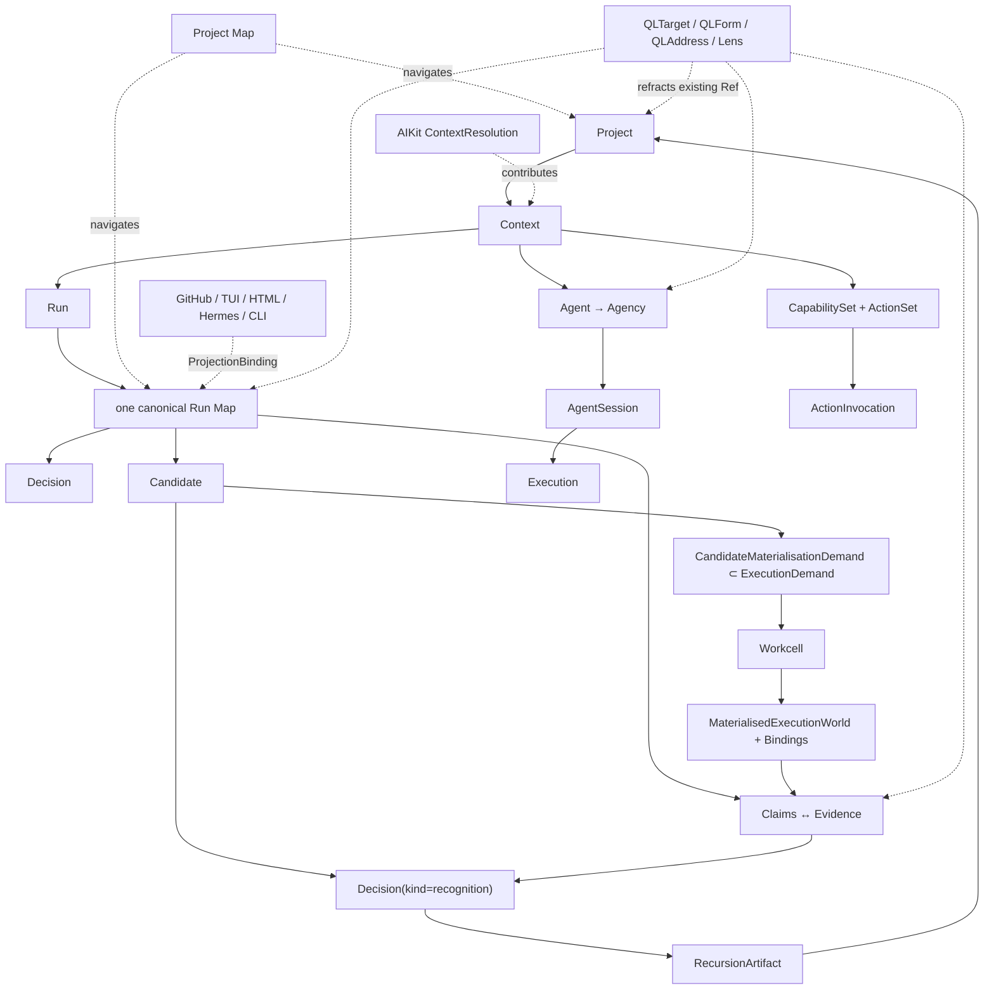
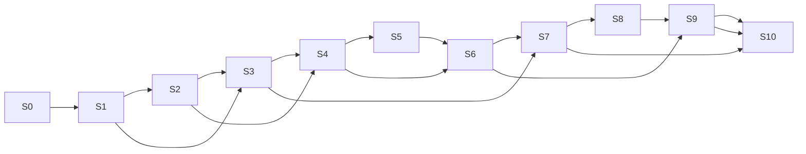

# QL Software Factory — Root Build Program

**File:** `QL-SOFTWARE-FACTORY-ROOT-BUILD-PROGRAM.md`  
**Status:** definitive pre-ticket program-design control file  
**Date:** 2026-08-12  
**Readiness state:** `CONDITIONAL_BUILD_ENTRY`  
**Governing authority:** `QL-SOFTWARE-FACTORY-CONSTITUTIONAL-INDEX.md`

> This file is the authoritative pre-ticket bridge from constitutional intent and harmonised architecture into vertical developmental slices and a closed ticket-source graph. It does **not** make GitHub Issues the ontology; later issue generation should be mechanical from Section 21.

# 1. Destination / Product Constitution
The build destination is a Factory in which a human can remain close to intended experience and consequential authorship while agents and deterministic systems carry substantial developmental work. A Project is entered as an authored whole, not as a repository; a Run is a durable intended transformation; its one canonical Run Map makes the current developmental topology intelligible; agents inhabit the same semantic world of Claims, Evidence, Decisions, Candidates, Actions, capabilities and sources; material Candidates become directly encounterable realities; Recognition routes only explicitly retained difference into future Ground/Context.

The developmental sentence this programme must make executable is:

```text
Project
  → resolved Context
  → Run
  → canonical Run Map
  → Agent / Agency
  → Actions + Capabilities
  → Claims ↔ Evidence
  → Candidate
  → MaterialisedExecutionWorld
  → encounter
  → Decision(kind=recognition)
  → RecursionArtifact
  → explicit retained effects
  → next Context / Ground
```

The same sentence must survive lost sessions, host/provider substitution, projection failure, telemetry loss and executable QL-service absence. Generic Factory operation and the richer Epi-Logos profile must inhabit one runtime. The Epi profile preserves the `0/1` Epi-Logos orchestrator plus `#0 Anuttara · #1 Paramasiva · #2 Parāśakti · #3 Mahāmāyā · #4 Nara · #5 Epii` as first-class Agent identities—not stage labels, models, harness sessions or Agency metadata.


# 2. Authority & Determination Rules
Authority is developmental rather than flat. The Constitutional Index governs. Companion specifications provide detailed current/module/deep-form architecture under the Index. The regenerated Wayfinders are strong architectural Claim-sets and executable decomposition sources; agreement among them is not independent evidence. QL/MEF references establish the meaning of QL concepts where the Factory corpus points to them, but derived QL references do not outrank the Factory Constitutional Index.

The programme uses these determination statuses exactly:

`CONSTITUTIONAL DETERMINATION · CURRENT DESIGN · OBSERVED · VERIFIED · SOURCE-INSPECTION BLOCKED · OPEN DECISION · GENUINE HUMAN AUTHORSHIP · OPEN SOCKET · RESEARCH CLAIM · SUPERSEDED`

Rules:
- no attractive idea → current design promotion without authority/evidence;
- no current design → constitution promotion;
- no documentation claim → OBSERVED promotion;
- no OBSERVED → VERIFIED promotion without appropriate acceptance/integration exercise;
- no research claim → production requirement without a recognised architectural decision;
- no implementation convenience → ontology;
- no provider limitation → permanent product boundary;
- no future socket → speculative current abstraction.

The ticket graph encodes these rules in `RC-001`; every ticket carries its own `determination_status`, `source_basis` and completion evidence.

# 3. Design Temperament / Attitude Vector Matrix
| Vector | Build contract | Acceptance effect | Primary slices |
| --- | --- | --- | --- |
| V1 | Human Altitude & Freedom | Every human interruption must justify authorship/consequence; reversible engineering stays agent/deterministic. | S0,S2,S3,S5,S6,S7,S10 |
| V2 | Experience Leads Architecture | Every product-facing slice names human/agent experience, altitude, progressive disclosure and prototype fixture. | S1–S7,S10 |
| V3 | Semantic Identity & Continuity | Canonical Ref survives sessions, providers, branches, materialisations and projections. | all slices |
| V4 | Agent Autonomy & Shared World | Agent receives Project/Run/Claims/Evidence/Decisions/Candidates/Actions/Capabilities/authority/completion directly. | S1–S4,S6–S10 |
| V5 | Epistemic Integrity & Source Fidelity | Claims/Evidence/statuses are typed; named upstreams are real/pinned/verified or explicitly blocked. | all slices |
| V6 | QL / MEF Formal Integrity | Factory nouns remain themselves; QL has operational consequence; NoQL remains excellent; deeper sockets stay open. | S0,S3,S6,S9,S10 |
| V7 | Modularity, Ownership & Projection Discipline | AIKit indexes, Project Map joins, Workcell materialises, Harness executes, projections project—none steals ontology. | all slices |
| V8 | Engineering Taste & Development Discipline | Deterministic certainty stays deterministic; public semantics fixed before coding; code health and migrations are gates. | all slices |
| V9 | Recursive / Self-Hosting Integrity | Recognition routes retained difference into next Ground; Factory eventually uses its own machinery. | S1,S4,S6,S10 |

# 4. Final Harmonisation Findings
The final Z0-style normalisation resolves shared vocabulary before tickets can consume it:
| Concept | Relation | Root resolution |
| --- | --- | --- |
| ProjectRef / Project | SAME CONCEPT | Factory Core owns enduring authored Project; AIKit ProjectSpec is operational binding material, not Project. |
| RunRef / Run | SAME CONCEPT | Durable intended transformation; survives AgentSession/SessionSpace/host; one canonical RunMap. |
| RunMapRef / Run Map | SAME CONCEPT | Canonical Factory graph; Project Map may navigate and GitHub may mirror; neither owns it. |
| Decision / Recognition | COMPLEMENTARY VIEW | Recognition is Decision(kind=recognition), not parallel authority or identity family. |
| HumanRequest | SAME CONCEPT | Channel/request linked to one Decision; does not itself constitute determination. |
| AgentRef / Agent | SAME CONCEPT | Enduring identity; Epi orchestrator + six canonical Agents are profile-scoped instances of same generic primitive. |
| AgencyRef / Agency / AgencyProfile | COMPLEMENTARY VIEW | Agency is situated Agent composition; AgencyProfile is reusable modulation; neither replaces canonical Agent identity. |
| AgentSession / Execution | DISTINCT HOMONYM resolved | AgentSession is harness continuity; Execution is one act; both shorter-lived than Run/Agent. |
| CapabilityRef / ActionRef | DISTINCT CONCEPTS | Capability is broad power; Action is project-owned canonical domain operation inside the available power field. |
| ActionInvocation | SAME CONCEPT | All projections normalize to one invocation envelope before validation/auth/policy/handler. |
| ArtifactRef / ClaimRef / EvidenceRef | DISTINCT CONCEPTS | Produced form ≠ assertion ≠ purposive material bearing on assertion. |
| CandidateRef / Candidate | SAME CONCEPT | Coherent possible reality; branch/PR/worktree/environment/provider are material/projection facts only. |
| RecursionArtifact | SAME CONCEPT | P5 Artifact family carrying explicit retained effects; standalone RecursionRecord authority is superseded. |
| ProjectMapRef / Project Map | SAME CONCEPT | Navigation/join layer over providers; no universal database or content ownership. |
| SourceIntegrationRef | SAME CONCEPT | Real-upstream declaration/lock/verification/drift relation; documentation claim is not observed integration. |
| ExecutionDemand | SAME CONCEPT | Provider-neutral material demand shared by runtime/Workcell. |
| CandidateMaterialisationDemand | COMPLEMENTARY VIEW | Specialized ExecutionDemand view/constructor with Candidate subject; not second primitive. |
| MaterialisedExecutionWorld / Binding | COMPLEMENTARY VIEW | Workcell-owned material result and ephemeral resolutions; neither defines Candidate/Context identity. |
| Event / Trace / Evidence | DISTINCT CONCEPTS | Occurrence ≠ reconstructed history ≠ purposive epistemic material. |
| ContextResolution / Context | COMPLEMENTARY VIEW | AIKit resolution contributes to Context; it is not the product primitive Context. |
| QLTarget / QLFormRef / QLAddress / LensRef | COMPLEMENTARY VIEW | Versioned refraction/formal references over existing Factory Ref; no parallel QL object ontology. |
| L4′ vocabulary | COMPETING DESIGN resolved | Factory-facing sequence is Prompts → Traces → Challenges → Patterns → Discovery → Insight. Lower-authority 'Questions' tabulation does not rename it. |
| Generic vs Epi runtime | COMPLEMENTARY VIEW | Same Agent→Agency→AgentSession→Execution runtime; Epi profile adds 0/1 orchestrator and six canonical Agents without generic dependency. |
| QL service optionality | SAME CONCEPT | Executable service may be absent/degraded/incompatible/upgraded; architecture remains QL-rooted and sockets remain. |
No competing duplicate remains intentionally live for the listed cross-map interfaces. Where the corpus still contains an older formulation, this programme either marks it `SUPERSEDED`, routes it to a source/decision gate, or preserves it as an explicit research/open socket. In particular, the lower-authority MEF cheat-sheet's `Questions` wording for L4′ does not override the Factory-facing governing sequence `Prompts → Traces → Challenges → Patterns → Discovery → Insight`.

# 5. Canonical Abstraction Registry
No ticket may redefine a registry term locally. “Allowed projections” means identity-preserving views/adapters; it never transfers semantic ownership.
| Term | Definition | Owner | Identity | Lifetime | Mutation authority | Authoritative representation | Allowed projections | Producer | Consumers | Must not be confused with | Implementing tickets |
| --- | --- | --- | --- | --- | --- | --- | --- | --- | --- | --- | --- |
| Project | Enduring authored whole around source, intention, design, knowledge, Actions, history and development. | Factory Core / Project domain | ProjectRef | Project lifetime; survives repository restructuring | Project-authorial commands and recognised Recursion effects | authored Project Canon + canonical Project record | TUI/HTML/CLI/agent/GitHub/Hermes/protocol views where applicable; projections retain canonical Ref | Factory Core / Project domain | Factory subsystems named by consuming tickets/interfaces; agents/humans where product-facing | repository; AIKit ProjectSpec/ProjectBinding | RC-002, RC-003, S2-003 |
| Context | Resolved world for an actor/act: Operative World + Information Horizon + Focus. | Shared product primitive | composition/snapshot identity where persisted; not prompt identity | act/session/run-relative | owning context policies and source/resource resolvers contribute; no single provider owns meaning | composed canonical read model from authoritative constituents | TUI/HTML/CLI/agent/GitHub/Hermes/protocol views where applicable; projections retain canonical Ref | Shared product primitive | Factory subsystems named by consuming tickets/interfaces; agents/humans where product-facing | loaded prompt; AIKit Generation; ContextResolution | RC-009, S2-002 |
| Run | One durable intended transformation of a Project. | Factory Core | RunRef | durable across sessions, hosts and projections | typed Run commands under revision/authority policy | operational semantic store + authored linked artifacts | TUI/HTML/CLI/agent/GitHub/Hermes/protocol views where applicable; projections retain canonical Ref | Factory Core | Factory subsystems named by consuming tickets/interfaces; agents/humans where product-facing | AgentSession; GitHub issue; process | RC-003, S1-001 |
| Run Map / Wayfinder Map | Exactly one canonical inspectable topology for one Run, including frontier, dependencies, returns, Candidates and epistemic refs. | Factory Core / RunMap | RunMapRef scoped one-to-one to Run | Run lifetime + historical retention | typed revisioned topology commands | canonical operational RunMap record | TUI/HTML/CLI/agent/GitHub/Hermes/protocol views where applicable; projections retain canonical Ref | Factory Core / RunMap | Factory subsystems named by consuming tickets/interfaces; agents/humans where product-facing | GitHub issue graph; Project Map view; L3 object | RC-003, S1-001, S7-001 |
| Decision | Durable semantic determination under explicit authority. | Factory Core / Decision | DecisionRef | Run/Project history | authorised resolver; human only where policy/authorship requires | canonical Decision record | TUI/HTML/CLI/agent/GitHub/Hermes/protocol views where applicable; projections retain canonical Ref | Factory Core / Decision | Factory subsystems named by consuming tickets/interfaces; agents/humans where product-facing | HumanRequest; approval UI | RC-004, S1-003 |
| Recognition | Specialised Decision determination made from encounter with Candidate reality; outcomes include recognise/return/defer/compare-select/direct synthesis routing. | Factory Core / Decision | same DecisionRef with kind=recognition | Decision lifetime | recognition authority, normally human where materially authorial | Decision record with recognition payload | TUI/HTML/CLI/agent/GitHub/Hermes/protocol views where applicable; projections retain canonical Ref | Factory Core / Decision | Factory subsystems named by consuming tickets/interfaces; agents/humans where product-facing | parallel authority object; merge approval | RC-004, S1-003, S5-003 |
| HumanRequest | Request/projection channel asking a human to resolve one Decision and explaining why human authorship is required. | Factory Core / attention channel | HumanRequestRef | until resolved/cancelled then provenance | system may create/cancel under attention policy; human resolves Decision, not request | operational request record linked exactly one Decision | TUI/HTML/CLI/agent/GitHub/Hermes/protocol views where applicable; projections retain canonical Ref | Factory Core / attention channel | Factory subsystems named by consuming tickets/interfaces; agents/humans where product-facing | Decision; generic task; safety theatre | RC-004, S5-002 |
| Agent | Enduring actor identity independent of model, harness, capability set, session, host and Workcell. | Agent registry | AgentRef | project/profile/global identity lifetime | Agent registry / authorised profile canon | canonical Agent definition | TUI/HTML/CLI/agent/GitHub/Hermes/protocol views where applicable; projections retain canonical Ref | Agent registry | Factory subsystems named by consuming tickets/interfaces; agents/humans where product-facing | model; harness; AgentSession; Agency | RC-007, S3-002 |
| Agency | Situated composition of an enduring Agent with role/stance/profile/Context/authority/capability disposition for work. | Agency resolver | AgencyRef or revisioned snapshot tied to AgentRef | situated work interval; may recur | Agency resolution policy + project/profile authored constraints | AgencySnapshot plus provenance | TUI/HTML/CLI/agent/GitHub/Hermes/protocol views where applicable; projections retain canonical Ref | Agency resolver | Factory subsystems named by consuming tickets/interfaces; agents/humans where product-facing | Agent; capability bundle; Epi canonical Agent | RC-007, S3-002 |
| AgencyProfile | Reusable authored disposition/modulation used when resolving Agency; may include optional richer identity form. | Agent/Agency domain | AgencyProfileRef | profile/version lifetime | profile/project author | versioned profile declaration | TUI/HTML/CLI/agent/GitHub/Hermes/protocol views where applicable; projections retain canonical Ref | Agent/Agency domain | Factory subsystems named by consuming tickets/interfaces; agents/humans where product-facing | canonical Agent constellation | RC-007, S3-002 |
| AgentSession | Replaceable resumable conversational/execution continuity maintained by a harness for an Agent/Agency. | Harness boundary | AgentSessionRef + opaque harness handle | harness/session lifetime; shorter than Run | HarnessProvider lifecycle operations | Factory session binding + harness state provenance | TUI/HTML/CLI/agent/GitHub/Hermes/protocol views where applicable; projections retain canonical Ref | Harness boundary | Factory subsystems named by consuming tickets/interfaces; agents/humans where product-facing | Run; Agent; SessionSpace | RC-007, S3-003 |
| SessionSpace | Human-operable workspace that views/controls Projects/Runs and hosts surfaces; tmux/cmux are replaceable bindings. | AIKit/session adapter | SessionSpaceRef + projection bindings | workspace lifetime | AIKit/session-space adapter | AIKit/session record + binding metadata | TUI/HTML/CLI/agent/GitHub/Hermes/protocol views where applicable; projections retain canonical Ref | AIKit/session adapter | Factory subsystems named by consuming tickets/interfaces; agents/humans where product-facing | Run; AgentSession; tmux/cmux ID | RC-007, S3-005 |
| Execution | One concrete act composed from Agent, Agency, Context, session, model, harness, capabilities, Actions and material world refs. | Factory runtime | ExecutionRef | one concrete act | runtime executor; semantic effects through owned domain commands | execution provenance/event references | TUI/HTML/CLI/agent/GitHub/Hermes/protocol views where applicable; projections retain canonical Ref | Factory runtime | Factory subsystems named by consuming tickets/interfaces; agents/humans where product-facing | AgentSession; Run | RC-007, S3-003 |
| Capability | Any actor-available power: skill, tool, method, script, service, resource or ability. | AIKit resource field / provider owner | CapabilityRef | resource/version availability lifetime | capability/source owner; AIKit resolves availability | source declaration/catalog descriptor | TUI/HTML/CLI/agent/GitHub/Hermes/protocol views where applicable; projections retain canonical Ref | AIKit resource field / provider owner | Factory subsystems named by consuming tickets/interfaces; agents/humans where product-facing | Action; Capsule packaging | RC-008, S2-002 |
| CapabilitySet | Resolved/authored set of CapabilityRefs for a scope/actor/context. | AIKit resolution | CapabilitySetRef or resolved-view revision | resolution/profile/session lifetime | profile/scope policy + resolver | AIKit declarations/resolution result | TUI/HTML/CLI/agent/GitHub/Hermes/protocol views where applicable; projections retain canonical Ref | AIKit resolution | Factory subsystems named by consuming tickets/interfaces; agents/humans where product-facing | ActionSet; Agent identity | RC-008, S2-002 |
| Action | Canonical project-owned domain operation authored once and projected to human, agent and external surfaces. | Project/Application domain | ActionRef = stable project-local semantic identity + contract major under shared Ref encoding | project/application contract lifetime | Project/Application domain owner | Action manifest + authoritative domain handler | TUI/HTML/CLI/agent/GitHub/Hermes/protocol views where applicable; projections retain canonical Ref | Project/Application domain | Factory subsystems named by consuming tickets/interfaces; agents/humans where product-facing | Capability; HTTP route; CLI command; MCP tool | RC-008, S3-001 |
| ActionSet | Context-resolved set of available ActionRefs for actor/context. | AIKit resolution over Project Actions | resolved set identity/revision | resolution lifetime | Project supplies; AIKit filters/resolves | ContextResolution/Action resource view | TUI/HTML/CLI/agent/GitHub/Hermes/protocol views where applicable; projections retain canonical Ref | AIKit resolution over Project Actions | Factory subsystems named by consuming tickets/interfaces; agents/humans where product-facing | CapabilitySet | RC-008, S3-001 |
| ActionInvocation | One normalised call to an Action with actor/Agency/run/session/surface lineage and idempotency context. | Action runtime | InvocationRef | invocation/audit lifetime | dispatcher validates; domain handler owns semantic effect | invocation record + resulting domain mutations/events | TUI/HTML/CLI/agent/GitHub/Hermes/protocol views where applicable; projections retain canonical Ref | Action runtime | Factory subsystems named by consuming tickets/interfaces; agents/humans where product-facing | transport request; domain implementation | RC-008, S3-001, S7-002 |
| Artifact | Produced durable or inspectable form with provenance; not inherently an assertion. | Factory Core / Artifact | ArtifactRef | retention policy/project history | artifact-producing domain under policy | artifact metadata + referenced material | TUI/HTML/CLI/agent/GitHub/Hermes/protocol views where applicable; projections retain canonical Ref | Factory Core / Artifact | Factory subsystems named by consuming tickets/interfaces; agents/humans where product-facing | Claim; Evidence; Trace | RC-006, S1-003 |
| Claim | Epistemic assertion with mode, provenance and subject; standing is not truth by field name. | Factory epistemics | ClaimRef | until superseded/archived; historical provenance retained | author/agent/source may assert; standing changes through evidence/assessment policy | epistemic store | TUI/HTML/CLI/agent/GitHub/Hermes/protocol views where applicable; projections retain canonical Ref | Factory epistemics | Factory subsystems named by consuming tickets/interfaces; agents/humans where product-facing | Artifact; Event; verified fact field | RC-005, S1-002 |
| Evidence | Purposive material bearing on a Claim, supporting/challenging/contextualising it with provenance. | Factory epistemics | EvidenceRef | claim/project evidence lifetime | evidence capture/curation under provenance rules | evidence record referencing source/artifact/event/test | TUI/HTML/CLI/agent/GitHub/Hermes/protocol views where applicable; projections retain canonical Ref | Factory epistemics | Factory subsystems named by consuming tickets/interfaces; agents/humans where product-facing | Trace; raw log | RC-005, S1-002 |
| Assessment | Typed evaluation of Claim/Candidate/Run standing under explicit criteria; separate from the subject and evidence. | Factory epistemics | AssessmentRef; RunAssessment may also be an Artifact family | evaluation/history lifetime | assessor under declared policy/criteria | assessment record/artifact | TUI/HTML/CLI/agent/GitHub/Hermes/protocol views where applicable; projections retain canonical Ref | Factory epistemics | Factory subsystems named by consuming tickets/interfaces; agents/humans where product-facing | Claim; Decision; verified field | RC-005, S1-002, S6-001 |
| Candidate | Coherent possible Project reality, logically independent of branch, PR, Workcell, Environment or provider. | Factory Core / Candidate | CandidateRef | Run/development/history lifetime | Candidate domain commands; Recognition controls promotion/retained effects | canonical Candidate record + source/design/runtime refs | TUI/HTML/CLI/agent/GitHub/Hermes/protocol views where applicable; projections retain canonical Ref | Factory Core / Candidate | Factory subsystems named by consuming tickets/interfaces; agents/humans where product-facing | branch; PR; container; worktree | RC-006, S1-003, S4-003 |
| RecursionArtifact | Canonical P5 Artifact recording explicit recognised retained effects and routing them into future Project Ground/Context. | Factory Core / Artifact/recursion | ArtifactRef with family=recursion | durable developmental history | effects validated against Decision/Recognition authority | Artifact + RecursionEffectSet | TUI/HTML/CLI/agent/GitHub/Hermes/protocol views where applicable; projections retain canonical Ref | Factory Core / Artifact/recursion | Factory subsystems named by consuming tickets/interfaces; agents/humans where product-facing | parallel RecursionRecord authority | RC-006, S6-001 |
| Project Map | Canonical join/navigation contract over distinct project intelligence providers; does not own their contents. | Project Map domain | ProjectMapRef + declaration revision | Project lifetime; provider views rebuildable | Project Map declaration/provider configuration; content owners remain separate | small declaration + derived provider views | TUI/HTML/CLI/agent/GitHub/Hermes/protocol views where applicable; projections retain canonical Ref | Project Map domain | Factory subsystems named by consuming tickets/interfaces; agents/humans where product-facing | universal graph/database; source truth | RC-009, S2-001 |
| SourceIntegration | Declared relation to a real upstream/source seam with pin, licence/provenance, mode, verification, augmentation and drift path. | Source Integration domain | SourceIntegrationRef | Project/source relationship lifetime | Project/source integration owner; lock updates through verified workflow | source declaration + lock + verification evidence | TUI/HTML/CLI/agent/GitHub/Hermes/protocol views where applicable; projections retain canonical Ref | Source Integration domain | Factory subsystems named by consuming tickets/interfaces; agents/humans where product-facing | local imitation; provider index | RC-011, S0-002 |
| Ref | Stable typed semantic identity independent of material/projection placement. | Shared identity contract | kind + immutable ID; VersionedRef adds revision | object identity lifetime; no reuse after tombstone | identity allocator + owning domain for object creation | shared serialized identity contract | TUI/HTML/CLI/agent/GitHub/Hermes/protocol views where applicable; projections retain canonical Ref | Shared identity contract | Factory subsystems named by consuming tickets/interfaces; agents/humans where product-facing | path; URL; provider ID; Binding | RC-002, S0-001 |
| Event | Portable record that an occurrence happened, with lineage and provenance; non-authoritative for authored truth. | Observability | EventRef | ledger/retention lifetime | append by trusted adapter/runtime; never semantic owner | raw/normalised event ledger | TUI/HTML/CLI/agent/GitHub/Hermes/protocol views where applicable; projections retain canonical Ref | Observability | Factory subsystems named by consuming tickets/interfaces; agents/humans where product-facing | Evidence; Trace; Decision | RC-012, S8-001 |
| Trace | Organised causal/temporal reconstruction over Events/executions/actions with explicit gaps. | Observability | TraceRef or derived view identity | reconstructable historical horizon | trace builder; mostly append/derive | event ledger + derived trace index | TUI/HTML/CLI/agent/GitHub/Hermes/protocol views where applicable; projections retain canonical Ref | Observability | Factory subsystems named by consuming tickets/interfaces; agents/humans where product-facing | Evidence; canonical history | RC-012, S8-001 |
| ExecutionDemand | Provider-neutral semantic envelope of subjects plus required/preferred/optional material affordances. | Factory ↔ Workcell boundary | ExecutionDemandRef | materialisation request/planning lifetime | Factory/runtime demand owner; Workcell may not rewrite semantics | versioned demand contract | TUI/HTML/CLI/agent/GitHub/Hermes/protocol views where applicable; projections retain canonical Ref | Factory ↔ Workcell boundary | Factory subsystems named by consuming tickets/interfaces; agents/humans where product-facing | provider prescription; Candidate identity | RC-010, S4-001 |
| CandidateMaterialisationDemand | Specialised constructor/view of ExecutionDemand requiring Project+Run+Candidate subjects; not a second primitive. | Factory ↔ Workcell boundary | same ExecutionDemandRef / specialised schema view | same demand lifetime | Factory Candidate/runtime owner | ExecutionDemand payload satisfying candidate constraints | TUI/HTML/CLI/agent/GitHub/Hermes/protocol views where applicable; projections retain canonical Ref | Factory ↔ Workcell boundary | Factory subsystems named by consuming tickets/interfaces; agents/humans where product-facing | parallel demand identity | RC-010, S4-003 |
| MaterialisedExecutionWorld | Provider-specific operational result satisfying an ExecutionDemand: workspace/environment/services/endpoints/bindings/observed state. | Workcell | MaterialisedExecutionWorldRef | materialisation lifecycle; shorter than Candidate | Workcell | Workcell state + BindingGraph | TUI/HTML/CLI/agent/GitHub/Hermes/protocol views where applicable; projections retain canonical Ref | Workcell | Factory subsystems named by consuming tickets/interfaces; agents/humans where product-facing | Context; Candidate; Environment identity | RC-010, S4-003 |
| Binding | Current material resolution of a durable logical Ref/requirement to location/provider/external entity; intentionally replaceable. | Workcell / projection domains | BindingRef or ProjectionBindingRef | ephemeral/rebindable | binding owner (Workcell/projection adapter) | binding store/cache with provenance | TUI/HTML/CLI/agent/GitHub/Hermes/protocol views where applicable; projections retain canonical Ref | Workcell / projection domains | Factory subsystems named by consuming tickets/interfaces; agents/humans where product-facing | canonical Ref; source identity | RC-010, RC-012, S4-003 |
| Projection | External/surface representation of canonical semantic state preserving identity/authority relation. | Projection layer | ProjectionBindingRef + external ID | surface/provider lifetime | canonical domain emits; adapter manages representation/reconcile only | projection binding + external state | TUI/HTML/CLI/agent/GitHub/Hermes/protocol views where applicable; projections retain canonical Ref | Projection layer | Factory subsystems named by consuming tickets/interfaces; agents/humans where product-facing | canonical object/store | RC-012, S7-004 |
| ContextResolution | AIKit-produced resolved resource envelope contributing principally to Context Operative World and addressable Information Horizon; not Context itself. | AIKit | resolution request/result identity + subject refs | many per Run/Execution/context change | AIKit resolver under project/profile/scope policy | AIKit operational resolution state | TUI/HTML/CLI/agent/GitHub/Hermes/protocol views where applicable; projections retain canonical Ref | AIKit | Factory subsystems named by consuming tickets/interfaces; agents/humans where product-facing | Context; Generation; loaded prompt | RC-009, S2-002 |
| QLTarget | Envelope naming an existing Factory subject Ref plus requested formal/refraction coordinates; creates no parallel object identity. | QL interop | subject Ref + request identity | request/read lifetime | Factory QL adapter; provider only derives results | interop request envelope | TUI/HTML/CLI/agent/GitHub/Hermes/protocol views where applicable; projections retain canonical Ref | QL interop | Factory subsystems named by consuming tickets/interfaces; agents/humans where product-facing | new QL identity for subject | RC-013, S9-001 |
| QLForm | Versioned formal form identity used to name a QL structure available to refraction/interop without renaming Factory objects. | QL canon/provider contract | QLFormRef | formal/provider version lifetime | QL formal source/provider; Factory references only | versioned QL form registry/provider descriptor | TUI/HTML/CLI/agent/GitHub/Hermes/protocol views where applicable; projections retain canonical Ref | QL canon/provider contract | Factory subsystems named by consuming tickets/interfaces; agents/humans where product-facing | Factory primitive identity; software taxonomy | RC-013, S9-001 |
| QLAddress | Typed coordinate/path locating a QL position/form relation; a value, not a Factory object owner. | QL formal coordinate | value coordinate; may be paired with form/version | as long as referenced form/version remains interpretable | QL formal source/provider | value in QL-compatible contracts | TUI/HTML/CLI/agent/GitHub/Hermes/protocol views where applicable; projections retain canonical Ref | QL formal coordinate | Factory subsystems named by consuming tickets/interfaces; agents/humans where product-facing | Run stage label; object identity | RC-013, S9-001 |
| Lens | First-class MEF refractive perspective; all twelve remain available, with software roles only where grounded. | MEF / QL formal source | LensRef + version/canonical designation | formal semantic lifetime | MEF/QL canon/provider | lens registry/formal reference | TUI/HTML/CLI/agent/GitHub/Hermes/protocol views where applicable; projections retain canonical Ref | MEF / QL formal source | Factory subsystems named by consuming tickets/interfaces; agents/humans where product-facing | bucket/tag assigned permanently to object | RC-013, S9-002 |

# 6. Canonical Semantic Relation Graph


Load-bearing non-equivalences:

```text
Project > repository
Run > AgentSession / SessionSpace / host
Agent > model / harness / capability set / session
Candidate > branch / Environment / Workcell / provider
Ref > Binding / path / projection ID
Action > transport/projection
Decision > HumanRequest
Context > ContextResolution > loaded prompt
Run Map > GitHub issue graph
Evidence ≠ Trace
Capability ≠ Action
QL reading ≠ Factory object identity
```


# 7. System / Package Dependency Architecture
The programme fixes semantic dependency direction but deliberately does **not** ratify a concrete root package tree before `SI-001` inspects the actual repository. Conceptual ownership is:

```text
root-contracts / shared identity
        ↓
Factory Core
  Project · Run · RunMap · Decision · Candidate · Artifact
        ↓
epistemics
  Claim · Evidence · Assessment
        ↓
ports
  Context · Actions · Agent/Harness · Workcell · Source · Projection · QL
        ↓
adapters
  AIKit · Pi · GitHub · GitNexus · bkmr · Docker/Arrakis · cmux/tmux/Hermes · MCP/A2A · QL provider
        ↓
product read models / projections
        ↓
observability + learning (observe; never author)
```

Rules enforced by `AG-001`:
- Core does not depend on concrete GitHub, Workcell, harness, AIKit or QL providers.
- AIKit imports/indices Factory identities; it does not own Project or Action meaning.
- Project Map depends on provider contracts and canonical Refs, not provider storage schemas.
- Workcell consumes `ExecutionDemand` and returns material worlds/bindings; provider vocabulary stops at its boundary.
- Harness adapters own session/execution machinery but never Agent/Run identity.
- Projection adapters translate shape and reconcile; they do not implement domain operations.
- Observability can fail independently of committed semantic state.


# 8. Final Interface Ledger
| ID | Interface | Producer → consumer | Canonical contract | Owner | Versioning | Identity relation | Failure behaviour | Compatibility/migration | Producer ticket | Consumer ticket | Integration-test ticket |
| --- | --- | --- | --- | --- | --- | --- | --- | --- | --- | --- | --- |
| IF-01 | AuthorityManifest | program/canon → all subsystems | authority+status+precedence manifest | Owning semantic domain in Section 5 | schema/contract version; additive changes unless major/breaking migration declared | canonical subject Ref survives adapter/provider | explicit unavailable/stale/conflict; no silent rebinding or authority promotion | versioned migration or compatibility adapter; no duplicate truth | RC-001 | RC-002 | AG-001 |
| IF-02 | RefVersioning | identity core → all canonical owners/adapters | Ref + VersionedRef + revision/tombstone rules | Owning semantic domain in Section 5 | schema/contract version; additive changes unless major/breaking migration declared | canonical subject Ref survives adapter/provider | explicit unavailable/stale/conflict; no silent rebinding or authority promotion | versioned migration or compatibility adapter; no duplicate truth | RC-002 | S0-001 | AG-002 |
| IF-03 | RunCommand | Factory Core → agents/UI/projections | typed RunMap mutation command + expected revision | Owning semantic domain in Section 5 | schema/contract version; additive changes unless major/breaking migration declared | canonical subject Ref survives adapter/provider | explicit unavailable/stale/conflict; no silent rebinding or authority promotion | versioned migration or compatibility adapter; no duplicate truth | S1-001 | S3-004 | S1-004 |
| IF-04 | RunReadModel | Factory Core → human/agent/ProjectMap | Run/RunMap/frontier/read model | Owning semantic domain in Section 5 | schema/contract version; additive changes unless major/breaking migration declared | canonical subject Ref survives adapter/provider | explicit unavailable/stale/conflict; no silent rebinding or authority promotion | versioned migration or compatibility adapter; no duplicate truth | S1-001 | S5-001 | S1-004 |
| IF-05 | DecisionAttention | Factory Core → inbox/UI/Hermes/agents | Decision/Recognition/HumanRequest/attention rationale | Owning semantic domain in Section 5 | schema/contract version; additive changes unless major/breaking migration declared | canonical subject Ref survives adapter/provider | explicit unavailable/stale/conflict; no silent rebinding or authority promotion | versioned migration or compatibility adapter; no duplicate truth | S1-003 | S5-002 | S5-003 |
| IF-06 | Epistemic | Factory epistemics → agents/gates/UI/QL | Claim/Evidence/Assessment/standing/provenance | Owning semantic domain in Section 5 | schema/contract version; additive changes unless major/breaking migration declared | canonical subject Ref survives adapter/provider | explicit unavailable/stale/conflict; no silent rebinding or authority promotion | versioned migration or compatibility adapter; no duplicate truth | S1-002 | S3-004 | S1-004 |
| IF-07 | ProjectMapProvider | provider adapters → Project Map/AIKit/human/agents | provider navigation + authority/freshness/health | Owning semantic domain in Section 5 | schema/contract version; additive changes unless major/breaking migration declared | canonical subject Ref survives adapter/provider | explicit unavailable/stale/conflict; no silent rebinding or authority promotion | versioned migration or compatibility adapter; no duplicate truth | S2-001 | S2-002 | S2-006 |
| IF-08 | ContextResolution | AIKit → actor/harness/Factory | resolved resource envelope + explanation | Owning semantic domain in Section 5 | schema/contract version; additive changes unless major/breaking migration declared | canonical subject Ref survives adapter/provider | explicit unavailable/stale/conflict; no silent rebinding or authority promotion | versioned migration or compatibility adapter; no duplicate truth | S2-002 | S3-004 | S3-006 |
| IF-09 | ContextLoad | Context/ProjectMap layer → harness/agent/UI | available/retrieved/loaded transition + provenance | Owning semantic domain in Section 5 | schema/contract version; additive changes unless major/breaking migration declared | canonical subject Ref survives adapter/provider | explicit unavailable/stale/conflict; no silent rebinding or authority promotion | versioned migration or compatibility adapter; no duplicate truth | S2-002 | S3-004 | S2-006 |
| IF-10 | ActionCatalog | Project/Application → AIKit/actor/projections | ActionRef/manifest/catalog/ActionSet descriptors | Owning semantic domain in Section 5 | schema/contract version; additive changes unless major/breaking migration declared | canonical subject Ref survives adapter/provider | explicit unavailable/stale/conflict; no silent rebinding or authority promotion | versioned migration or compatibility adapter; no duplicate truth | S3-001 | S2-002 | S3-006 |
| IF-11 | ActionInvocation | projection adapters → Action dispatcher/domain handler | normalized invocation + actor/Agency/lineage | Owning semantic domain in Section 5 | schema/contract version; additive changes unless major/breaking migration declared | canonical subject Ref survives adapter/provider | explicit unavailable/stale/conflict; no silent rebinding or authority promotion | versioned migration or compatibility adapter; no duplicate truth | S7-002 | S3-001 | S7-004 |
| IF-12 | AgentAgency | Agent registry/resolver → AIKit/Factory/harness | AgentRef/definition + AgencyProfile/Snapshot | Owning semantic domain in Section 5 | schema/contract version; additive changes unless major/breaking migration declared | canonical subject Ref survives adapter/provider | explicit unavailable/stale/conflict; no silent rebinding or authority promotion | versioned migration or compatibility adapter; no duplicate truth | S3-002 | S2-002 | S3-006 |
| IF-13 | AgentRunView | Factory Core/context → agent/harness | semantic Run world + typed mutation affordances | Owning semantic domain in Section 5 | schema/contract version; additive changes unless major/breaking migration declared | canonical subject Ref survives adapter/provider | explicit unavailable/stale/conflict; no silent rebinding or authority promotion | versioned migration or compatibility adapter; no duplicate truth | S3-004 | S3-003 | S3-006 |
| IF-14 | HarnessProvider | Factory runtime → Pi/other harness adapters | session create/resume/execute/events/state | Owning semantic domain in Section 5 | schema/contract version; additive changes unless major/breaking migration declared | canonical subject Ref survives adapter/provider | explicit unavailable/stale/conflict; no silent rebinding or authority promotion | versioned migration or compatibility adapter; no duplicate truth | S3-003 | S3-004 | S3-006 |
| IF-15 | SessionWorker | SessionSpace/Worker adapters → Factory/runtime/UI | SessionSpace/WorkerLink bindings and recovery | Owning semantic domain in Section 5 | schema/contract version; additive changes unless major/breaking migration declared | canonical subject Ref survives adapter/provider | explicit unavailable/stale/conflict; no silent rebinding or authority promotion | versioned migration or compatibility adapter; no duplicate truth | S3-005 | S7-003 | S7-004 |
| IF-16 | ExecutionDemand | Factory/actor runtime → Workcell | provider-neutral material requirements + subjects | Owning semantic domain in Section 5 | schema/contract version; additive changes unless major/breaking migration declared | canonical subject Ref survives adapter/provider | explicit unavailable/stale/conflict; no silent rebinding or authority promotion | versioned migration or compatibility adapter; no duplicate truth | S4-001 | S4-003 | S4-005 |
| IF-17 | WorkcellOfferPlan | Workcell providers → Factory/runtime | offers/capacity/plan/degradation explanation | Owning semantic domain in Section 5 | schema/contract version; additive changes unless major/breaking migration declared | canonical subject Ref survives adapter/provider | explicit unavailable/stale/conflict; no silent rebinding or authority promotion | versioned migration or compatibility adapter; no duplicate truth | S4-001 | S4-003 | S4-005 |
| IF-18 | MaterialisedWorld | Workcell → Factory/harness/Candidate surface | BindingGraph + MaterialisedExecutionWorld + endpoints | Owning semantic domain in Section 5 | schema/contract version; additive changes unless major/breaking migration declared | canonical subject Ref survives adapter/provider | explicit unavailable/stale/conflict; no silent rebinding or authority promotion | versioned migration or compatibility adapter; no duplicate truth | S4-003 | S3-003 | S4-005 |
| IF-19 | WorkcellObservation | Workcell → Factory epistemics/Trace | observed-state claims/health/resource evidence | Owning semantic domain in Section 5 | schema/contract version; additive changes unless major/breaking migration declared | canonical subject Ref survives adapter/provider | explicit unavailable/stale/conflict; no silent rebinding or authority promotion | versioned migration or compatibility adapter; no duplicate truth | S4-003 | S1-002 | S4-005 |
| IF-20 | SourceIntegration | Project/source registry → integrations/ProjectMap/Bootstrap/agents | declaration+lock+verification+drift+repro envelope | Owning semantic domain in Section 5 | schema/contract version; additive changes unless major/breaking migration declared | canonical subject Ref survives adapter/provider | explicit unavailable/stale/conflict; no silent rebinding or authority promotion | versioned migration or compatibility adapter; no duplicate truth | S0-002 | S2-004 | AG-003 |
| IF-21 | EventTrace | runtime/adapters → Trace/evidence/observability | portable Event + causal/temporal lineage + gaps | Owning semantic domain in Section 5 | schema/contract version; additive changes unless major/breaking migration declared | canonical subject Ref survives adapter/provider | explicit unavailable/stale/conflict; no silent rebinding or authority promotion | versioned migration or compatibility adapter; no duplicate truth | S8-001 | S1-002 | S8-003 |
| IF-22 | ProjectionBinding | Factory projection layer → GitHub/UI/Hermes/CLI | canonical Ref ↔ external projection binding | Owning semantic domain in Section 5 | schema/contract version; additive changes unless major/breaking migration declared | canonical subject Ref survives adapter/provider | explicit unavailable/stale/conflict; no silent rebinding or authority promotion | versioned migration or compatibility adapter; no duplicate truth | RC-012 | S7-001 | S7-004 |
| IF-23 | GitHubProjection | Factory projection layer → GitHub/reconciler | Run/Decision/Candidate projection and conflict semantics | Owning semantic domain in Section 5 | schema/contract version; additive changes unless major/breaking migration declared | canonical subject Ref survives adapter/provider | explicit unavailable/stale/conflict; no silent rebinding or authority promotion | versioned migration or compatibility adapter; no duplicate truth | S7-001 | S1-001 | S7-004 |
| IF-24 | LearningObservation | observability/learning → AIKit resolver/suggestion UI | usage/fitness/context observations with separate factors | Owning semantic domain in Section 5 | schema/contract version; additive changes unless major/breaking migration declared | canonical subject Ref survives adapter/provider | explicit unavailable/stale/conflict; no silent rebinding or authority promotion | versioned migration or compatibility adapter; no duplicate truth | S6-003 | S2-002 | S8-003 |
| IF-25 | ProjectEvolution | Run/history derivation → ProjectMap/human/agents | derived developmental history over Runs/Decisions/Candidates | Owning semantic domain in Section 5 | schema/contract version; additive changes unless major/breaking migration declared | canonical subject Ref survives adapter/provider | explicit unavailable/stale/conflict; no silent rebinding or authority promotion | versioned migration or compatibility adapter; no duplicate truth | S6-002 | S2-001 | S6-004 |
| IF-26 | QLTargetRefraction | Factory QL adapter → QL provider/MEF views | existing subject Ref + QLTarget/refraction request/result/provenance | Owning semantic domain in Section 5 | schema/contract version; additive changes unless major/breaking migration declared | canonical subject Ref survives adapter/provider | explicit unavailable/stale/conflict; no silent rebinding or authority promotion | versioned migration or compatibility adapter; no duplicate truth | S9-001 | S9-002 | S9-004 |
| IF-27 | QLProviderCapabilities | QL provider → Factory QL adapter | provider version/capabilities/compatibility status | Owning semantic domain in Section 5 | schema/contract version; additive changes unless major/breaking migration declared | canonical subject Ref survives adapter/provider | explicit unavailable/stale/conflict; no silent rebinding or authority promotion | versioned migration or compatibility adapter; no duplicate truth | S9-001 | S9-003 | S9-004 |
| IF-28 | QLDerivedStanding | QL/MEF adapter → Claim/Artifact/read-model layer | derived lens reading + provenance; no canonical mutation | Owning semantic domain in Section 5 | schema/contract version; additive changes unless major/breaking migration declared | canonical subject Ref survives adapter/provider | explicit unavailable/stale/conflict; no silent rebinding or authority promotion | versioned migration or compatibility adapter; no duplicate truth | S9-002 | S1-002 | S9-004 |
| IF-29 | ActionMCP | Action projection → MCP clients | selected Action manifests ↔ MCP tool contracts | Owning semantic domain in Section 5 | schema/contract version; additive changes unless major/breaking migration declared | canonical subject Ref survives adapter/provider | explicit unavailable/stale/conflict; no silent rebinding or authority promotion | versioned migration or compatibility adapter; no duplicate truth | S7-002 | S3-001 | S7-004 |
| IF-30 | ActionA2A | Project agent projection → A2A peers | Action/agent skill/task mapping without Run identity collapse | Owning semantic domain in Section 5 | schema/contract version; additive changes unless major/breaking migration declared | canonical subject Ref survives adapter/provider | explicit unavailable/stale/conflict; no silent rebinding or authority promotion | versioned migration or compatibility adapter; no duplicate truth | S7-002 | S3-001 | S7-004 |
| IF-31 | HumanSurface | Factory product read models → human UI/TUI/HTML/remote | high-altitude Project/Run/Candidate/Decision/Claim views | Owning semantic domain in Section 5 | schema/contract version; additive changes unless major/breaking migration declared | canonical subject Ref survives adapter/provider | explicit unavailable/stale/conflict; no silent rebinding or authority promotion | versioned migration or compatibility adapter; no duplicate truth | S5-001 | PP-005 | S5-003 |
| IF-32 | BootstrapHandoff | Bootstrap Run → Project/AIKit/ordinary Run | recovered canon/surfaces/resources/sources + recognition handoff | Owning semantic domain in Section 5 | schema/contract version; additive changes unless major/breaking migration declared | canonical subject Ref survives adapter/provider | explicit unavailable/stale/conflict; no silent rebinding or authority promotion | versioned migration or compatibility adapter; no duplicate truth | S2-003 | S2-002 | S2-006 |

### Wayfinder Interface Ledger closure
| Wayfinder | Source interface row | Canonical root interface(s) |
| --- | --- | --- |
| A/C/G/J | Ref / VersionedRef | IF-02 |
| A/C/G/J | ContextResolution | IF-08 |
| A/C/G/J | ProjectMapRunLens | IF-07 |
| A/C/G/J | ActionRef / ActionInvocation | IF-10 + IF-11 |
| A/C/G/J | Agent / Agency / AgentSession / Execution | IF-12 |
| A/C/G/J | AgentRunView | IF-13 |
| A/C/G/J | AgentMutationCommands | IF-13 |
| A/C/G/J | ExecutionDemand | IF-16 |
| A/C/G/J | CandidateMaterialisationDemand | IF-16 |
| A/C/G/J | MaterialisedExecutionWorld / Binding | IF-18 |
| A/C/G/J | WorkcellObservationBundle | IF-19 |
| A/C/G/J | SourceIntegration | IF-20 |
| A/C/G/J | SourceIntegrationEvidence | IF-20 + IF-06 |
| A/C/G/J | QLTarget / RefractionRequest | IF-26 |
| A/C/G/J | GitHubProjectionPort | IF-23 |
| A/C/G/J | HumanAttentionPort | IF-05 |
| A/C/G/J | LearningObservationFeed | IF-24 |
| A/C/G/J | HarnessEventStream | IF-21 |
| A/C/G/J | ProjectEvolutionProvider | IF-25 |
| B/D/K/L | B.I01 ProjectBindingResolution | IF-08 |
| B/D/K/L | B.I02 CapabilityResolution | IF-08 |
| B/D/K/L | B.I03 ActorResourceIndex | IF-12 + IF-08 |
| B/D/K/L | B.I04 ActionResourceIndex | IF-10 + IF-08 |
| B/D/K/L | B.I05 ExecutionResourceIndex | IF-08 |
| B/D/K/L | B.I06 ContextSourceIndex | IF-07 + IF-08 |
| B/D/K/L | B.I07 QLResourceIndex | IF-27 + IF-08 |
| B/D/K/L | B.I08 ContextResolution | IF-08 |
| B/D/K/L | B.I09 ContextProjection | IF-08 |
| B/D/K/L | D.I01 ProjectMap | IF-07 |
| B/D/K/L | D.I02 ProviderHealth | IF-07 |
| B/D/K/L | D.I03 SourceNavigation | IF-07 |
| B/D/K/L | D.I04 CodeIntelligence | IF-07 |
| B/D/K/L | D.I05 CanonNavigation | IF-07 |
| B/D/K/L | D.I06 SemanticNavigation | IF-07 |
| B/D/K/L | D.I07 KnowledgeRetrieval | IF-07 |
| B/D/K/L | D.I08 ActionNavigation | IF-07 |
| B/D/K/L | D.I09 EvolutionNavigation | IF-25 + IF-07 |
| B/D/K/L | D.I10 QLRefractionNavigation | IF-26 + IF-07 |
| B/D/K/L | D.I11 ContextLoad | IF-09 |
| B/D/K/L | K.I01 BootstrapRun | IF-32 |
| B/D/K/L | K.I02 BootstrapRecovery | IF-32 |
| B/D/K/L | K.I03 AuthorialFrontier | IF-05 + IF-32 |
| B/D/K/L | K.I04 ProjectSurfaceHandoff | IF-32 |
| B/D/K/L | K.I05 ActionDiscoveryHandoff | IF-32 |
| B/D/K/L | K.I06 RuntimeDiscoveryHandoff | IF-32 |
| B/D/K/L | K.I07 SourcePlanHandoff | IF-20 + IF-32 |
| B/D/K/L | K.I08 BootstrapRecognition | IF-05 + IF-32 |
| B/D/K/L | L.I01 SourceDeclaration | IF-20 |
| B/D/K/L | L.I02 SourceLock | IF-20 |
| B/D/K/L | L.I03 SourceVerification | IF-20 |
| B/D/K/L | L.I04 DriftReport | IF-20 |
| B/D/K/L | L.I05 ReproducibilityEnvelope | IF-20 |
| E/F/H/I | E.IF01 | IF-10 |
| E/F/H/I | E.IF02 | IF-10 |
| E/F/H/I | E.IF03 | IF-10 |
| E/F/H/I | E.IF04 | IF-10 |
| E/F/H/I | E.IF05 | IF-11 |
| E/F/H/I | E.IF06 | IF-21 + IF-05 + IF-06 |
| E/F/H/I | E.IF07 | IF-29 |
| E/F/H/I | E.IF08 | IF-30 |
| E/F/H/I | I.IF01 | IF-12 |
| E/F/H/I | I.IF02 | IF-12 |
| E/F/H/I | I.IF03 | IF-12 |
| E/F/H/I | I.IF04 | IF-12 |
| E/F/H/I | I.IF05 | IF-14 |
| E/F/H/I | I.IF06 | IF-14 + IF-21 |
| E/F/H/I | I.IF07 | IF-15 |
| E/F/H/I | I.IF08 | IF-15 |
| E/F/H/I | I.IF09 | IF-15 |
| E/F/H/I | F.IF01 | IF-16 |
| E/F/H/I | F.IF02 | IF-17 |
| E/F/H/I | F.IF03 | IF-17 |
| E/F/H/I | F.IF04 | IF-18 |
| E/F/H/I | F.IF05 | IF-16 |
| E/F/H/I | F.IF06 | IF-19 |
| E/F/H/I | H.IF01 | IF-26 |
| E/F/H/I | H.IF02 | IF-27 |
| E/F/H/I | H.IF03 | IF-26 + IF-27 |
| E/F/H/I | H.IF04 | IF-28 |
| E/F/H/I | H.IF05 | IF-21 |

**Interface closure:** 80/80 source rows mapped; every root interface above names producer, consumer and integration-test ownership.

# 9. Source Integration Dependency Map
| Upstream | Classification | Current evidence state | Inspection ticket | Dependent work | Boundary |
| --- | --- | --- | --- | --- | --- |
| AIKit | needed now / before S2 | EpiLogos/ai-kit; observed source pin above | SI-002 | S2-002,MR-001,S3-005 | Indexes/resolves resources; does not own Project meaning. |
| SSSF | before dependent S3 adapter | `az9713/sssf-demo@5366c5e86895c21cf0dcf0a13700680a07eea23f` repository identity/main observed; intended Factory tracing/runner seam still requires inspection | SI-003 | S3-003 | Principles/tracing may be reused only through the inspected real source. |
| Pi | needed before S3 | earendil-works/pi; observed source pin above | SI-003 | S3-003 | Harness/session machinery; never Agent/Run identity. |
| GitNexus | needed before S2 code-intelligence provider | nxpatterns/gitnexus; observed repo pin above | SI-004 | S2-004 | Real source-code intelligence provider; derived graph rebuildable. |
| Matt Pocock / Wayfinder / Grilling | reference/capability source before retained reuse | `mattpocock/skills@84fdeffd12f2ee307994d1eb6feb48173b6e0502` repository identity/main observed; exact retained files/capability import seam still to pin | SI-005 | S2-003,S3-001 | Planning/grilling precedent; no authority promotion. |
| HumanLayer / Dexter material | reference/capability source before retained reuse | `humanlayer/advanced-context-engineering-for-coding-agents` and `humanlayer/12-factor-agents` repository identities observed; exact copied/adapted seams and Dexter provenance still to pin | SI-005 | PP-001,PP-004,S2-003 | Product-design/attention precedent; Factory owns semantics. |
| cmux | needed before remote/session projection relying on it | `manaflow-ai/cmux@8952b5e843f3b671f6ef6b821500070f3b7feeb3` repository identity/main observed plus AIKit adapter observed; intended automation/session seam still to verify | SI-006 | S3-005,S7-003 | SessionSpace binding only. |
| tmux | optional/required baseline session provider depending host | AIKit adapter observed; upstream pin to resolve | SI-006 | S3-005,S7-003 | SessionSpace binding only. |
| Hermes | optional provider before S7 remote front door | `NousResearch/hermes-agent@e9579a98966ba022961fba850a6f0f0171aa5f3d` repository identity/main observed; narrow messaging/headless seam remains blocked pending inspection | SI-006 | S7-003 | Projection/front door; no Decision/Run ownership. |
| bkmr | needed before S2 knowledge provider | AIKit integration material observed; upstream exact source blocked | SI-007 | S2-005 | Information-horizon provider/index; never source truth. |
| Agent-Native precedents/adapters | reference before projection implementation | exact retained precedents blocked | SI-008 | S3-001,S7-002 | Inform Action parity; do not import foreign ontology. |
| MCP | needed before MCP Action projection | protocol/version to pin | SI-008 | S7-002 | Projection only. |
| A2A | needed before A2A projection | protocol/version to pin | SI-008 | S7-002 | Remote task/projection; remote task ≠ Run. |
| Neo4j/Bimba | optional Epi provider / S9 | current Epi source/schema to inspect | SI-010 | S9-004 | Optional Epi information/formal horizon; generic Factory independent. |
| Docker | needed before baseline S4 provider | provider/API/version to pin | SI-009 | S4-002 | Material provider only. |
| Arrakis | optional Workcell provider | `abshkbh/arrakis@877231496acbf3b3091ab33340d2d126a251c4d5` repository identity/main observed; exact provider API/licence/runtime smoke still required | SI-009 | S4-004 | MicroVM provider only; must not define Workcell. |
| QL kernel/service | research/optional provider; S9 real adapter if source exists | no executable provider promoted from documentation alone | SI-011 | S9-001,RE-001,RE-002 | Ordinary Factory remains excellent absent/degraded/incompatible/upgraded. |
A source blocker blocks only dependent work. `SI-009` does not stall S1/S2/S3; `SI-006` does not stall semantic Run/Decision work; `SI-011` does not stall ordinary Factory operation. Source inspection completion must update status from `SOURCE-INSPECTION BLOCKED` only with actual revision/licence/seam evidence and the named smoke test.

# 10. Program Slice DAG
| Slice | Developmental outcome | Primary ticket families | Dependency posture |
| --- | --- | --- | --- |
| S0 | Ground / repo / source truth | RC-* + SI-* + S0-* + prototypes | none |
| S1 | Minimum semantic developmental circuit | S1-* + MR-002 + AG-001/005 | S0 root contracts/store |
| S2 | Project entry / Bootstrap / Project Map / AIKit Context | S2-* + MR-001 + AG-003 | S1 semantic core + AIKit/source gates as local deps |
| S3 | Agent / Agency / Action / Harness | S3-* + AG-002 | S2 Context/Project world + Pi/SSSF/cmux gates |
| S4 | Workcell / material Candidate reality | S4-* + MR-003 | S3 runtime + Docker; Arrakis optional |
| S5 | Human Candidate encounter / Recognition | S5-* | S4 openable Candidate + semantic core |
| S6 | Recursion / Evolution / long re-entry | S6-* | S5 Recognition |
| S7 | Projection parity / remote operation | S7-* | S6 + protocol/upstream gates |
| S8 | Telemetry / fitness / learned ergonomics | S8-* | S7 projection parity + S6 learning |
| S9 | QL/MEF explicit interop | S9-* + AG-004 + RE-* | QL-compatible foundations from S0; real provider optional |
| S10 | Factory develops the Factory | S10-* | S6/S7/S9 closure fixtures |


This ordering is deliberately vertical. S1 already makes the semantic developmental circuit real; S2 makes Project entry real; S3 makes agent work real; S4 makes Candidate reality openable. Provider breadth, telemetry depth and explicit QL execution come later without postponing QL-compatible foundations.


# 11. Root Fixture / Journey Architecture
| Journey | Required whole-system proof | Owner ticket(s) |
| --- | --- | --- |
| 1 | External repository → Project Bootstrap → Project Map → first Run. | S2-006 |
| 2 | Fresh Project → recovered/created Intent + Design → operable Project → first Run. | S2-006 |
| 3 | Human Prompt → canonical Run Map → GitHub mirror → substantial autonomous work. | S7-004 |
| 4 | Context → Agent/Agency → Actions/Capabilities → Pi → source change → deterministic tests → Candidate. | S3-006 |
| 5 | Candidate → Workcell → directly experienceable application/world → observed Claims/Evidence. | S4-005 |
| 6 | Candidate lineup → human comparison → Recognition/return/defer/synthesis. | S5-003 |
| 7 | Recognition → RecursionArtifact → explicitly routed retained effects → subsequent Context/Ground changes. | S6-004 |
| 8 | One Action → human UI + embedded agent + external projection → one domain implementation. | S7-002 |
| 9 | Run survives AgentSession, SessionSpace and host loss/change. | S3-003,MR-003 |
| 10 | Candidate survives rematerialisation/provider substitution. | S4-005 |
| 11 | Six-month return reconstructs intention/frontier/history/open Claims without archaeology. | S6-004 |
| 12 | Contradictory Evidence remains representable without premature binary truth collapse. | S1-002 |
| 13 | Project Map provider/index goes stale or disappears without source truth corruption. | S2-001,MR-003 |
| 14 | GitHub projection conflicts with canonical state and reconciles without GitHub becoming ontology. | S7-001 |
| 15 | Telemetry is lost/corrupt while authored and committed semantic state remains valid. | S8-003 |
| 16 | QL service absent/degraded/upgraded without ordinary Factory semantics breaking. | S9-003 |
| 17 | MEF refracts several canonical primitive kinds while preserving subject identity/provenance. | S9-002 |
| 18 | Generic Factory profile works with no Epi ontology/Bimba dependency. | S9-004 |
| 19 | Epi profile activates 0/1 orchestrator + six canonical Agents through same generic runtime. | S3-006,S9-004 |
| 20 | Research/native/conjugate QL execution plugs in experimentally without redefining AgentSession semantics. | RE-001 |
| 21 | SourceIntegration drift/API change fails visibly and produces upgrade path, not local imitation. | AG-003 |
| 22 | Human Decision request explains why human authorship is required and excludes routine reversible engineering. | S5-002 |
| 23 | “Improve this” can move toward standing Intent and disclose a better possibility without silent Intent rewrite. | S5-003 |
| 24 | Software Factory bootstraps itself and completes one genuine self-improvement Run. | S10-002 |
| 25 | Concurrent/stale Run mutations produce semantic conflicts rather than silent last-write-wins. | S1-001 |
| 26 | Derived indexes can be deleted/rebuilt without corrupting source/canonical semantic state. | S2-004,S2-005,MR-003 |
| 27 | Reproducibility evidence can reconstruct the exact upstream/material world used for consequential work. | S0-002,S4-003 |
Journeys 25–27 are added closure proofs required by the combined architecture: concurrency semantics, derived-index rebuildability and exact source/material reproducibility. They prevent three important classes of silent degradation not fully captured by the original 24 journey sentences.

# 12. Ticket Source Manifest
**Ticket count:** 86. Tickets are source units for later mechanical issue generation; they are not themselves GitHub ontology.

### RC-001 — Constitutional authority and determination manifest

- **Kind / slice / status:** `ROOT-CONTRACT` · `S0` · `CONSTITUTIONAL DETERMINATION (program encoding)`
- **Purpose:** Encode precedence, determination statuses, supersession and corpus provenance so implementation never treats generated agreement as authority.
- **Why this exists:** Encode precedence, determination statuses, supersession and corpus provenance so implementation never treats generated agreement as authority.
- **Attitude vectors:** `V1, V2, V3, V5, V6, V7, V8, V9`
- **Owner:** Root semantic contracts
- **Human consequence:** reduces ambiguity and future rework before implementation reaches the human surface
- **Agent consequence:** receives stable contracts, authority/status and source facts instead of reconstructing architecture
- **Dependencies:** none
- **Produces / consumes:** IF-01 / none
- **Resolved semantic boundary:** Public semantic identity/ownership/authority follows the root contracts and Abstraction Registry; reversible private implementation craft remains local.
- **Implementation latitude:** Private helper decomposition and internal function/module organisation after source inspection.; Reversible algorithmic technique and local performance choices within stated invariants.; Private non-semantic names and test implementation details.
- **Acceptance:** A machine-readable authority manifest resolves every governing document/status and rejects silent status promotion.
- **Completion evidence:** contract/integration/failure/static gates appropriate to this ticket plus recorded source/determination status.

### RC-002 — Canonical Ref, revision and tombstone contract

- **Kind / slice / status:** `ROOT-CONTRACT` · `S0` · `CURRENT DESIGN — root contract`
- **Purpose:** Fix stable cross-system identity, revision semantics, aliasing, tombstones and no-ID-reuse across semantic objects.
- **Why this exists:** Fix stable cross-system identity, revision semantics, aliasing, tombstones and no-ID-reuse across semantic objects.
- **Wayfinder basis:** `A.1, A.7`
- **Attitude vectors:** `V3, V5, V7, V8`
- **Owner:** Root semantic contracts
- **Human consequence:** reduces ambiguity and future rework before implementation reaches the human surface
- **Agent consequence:** receives stable contracts, authority/status and source facts instead of reconstructing architecture
- **Dependencies:** `RC-001`
- **Produces / consumes:** IF-02 / IF-01
- **Resolved semantic boundary:** Public semantic identity/ownership/authority follows the root contracts and Abstraction Registry; reversible private implementation craft remains local.
- **Implementation latitude:** Private helper decomposition and internal function/module organisation after source inspection.; Reversible algorithmic technique and local performance choices within stated invariants.; Private non-semantic names and test implementation details.
- **Acceptance:** Round-trip, stale-write and tombstone fixtures prove identity survives path/provider/projection change.
- **Completion evidence:** contract/integration/failure/static gates appropriate to this ticket plus recorded source/determination status.

### RC-003 — Project, Run and canonical Run Map contract

- **Kind / slice / status:** `ROOT-CONTRACT` · `S0` · `CURRENT DESIGN — root contract`
- **Purpose:** Fix Project continuity, durable Run identity, exactly-one canonical Run Map, topology revision and mutation authority.
- **Why this exists:** Fix Project continuity, durable Run identity, exactly-one canonical Run Map, topology revision and mutation authority.
- **Wayfinder basis:** `A.3, C.1, C.2, C.3`
- **Attitude vectors:** `V2, V3, V4, V7, V8, V9`
- **Owner:** Root semantic contracts
- **Human consequence:** reduces ambiguity and future rework before implementation reaches the human surface
- **Agent consequence:** receives stable contracts, authority/status and source facts instead of reconstructing architecture
- **Dependencies:** `RC-001`, `RC-002`
- **Produces / consumes:** none / none
- **Resolved semantic boundary:** Public semantic identity/ownership/authority follows the root contracts and Abstraction Registry; reversible private implementation craft remains local.
- **Implementation latitude:** Private helper decomposition and internal function/module organisation after source inspection.; Reversible algorithmic technique and local performance choices within stated invariants.; Private non-semantic names and test implementation details.
- **Acceptance:** Run survives session/host replacement; duplicate canonical Run Maps and invalid topology mutations are rejected.
- **Completion evidence:** contract/integration/failure/static gates appropriate to this ticket plus recorded source/determination status.

### RC-004 — Decision, Recognition, HumanRequest and human-attention contract

- **Kind / slice / status:** `ROOT-CONTRACT` · `S0` · `CURRENT DESIGN — root contract`
- **Purpose:** Fix Decision sovereignty, Recognition as Decision(kind=recognition), HumanRequest as channel, authorship rationale and interruption policy.
- **Why this exists:** Fix Decision sovereignty, Recognition as Decision(kind=recognition), HumanRequest as channel, authorship rationale and interruption policy.
- **Wayfinder basis:** `A.4, E.04, K.04`
- **Attitude vectors:** `V1, V2, V3, V4, V5, V8`
- **Owner:** Root semantic contracts
- **Human consequence:** reduces ambiguity and future rework before implementation reaches the human surface
- **Agent consequence:** receives stable contracts, authority/status and source facts instead of reconstructing architecture
- **Dependencies:** `RC-001`, `RC-002`
- **Produces / consumes:** none / none
- **Resolved semantic boundary:** Public semantic identity/ownership/authority follows the root contracts and Abstraction Registry; reversible private implementation craft remains local.
- **Implementation latitude:** Private helper decomposition and internal function/module organisation after source inspection.; Reversible algorithmic technique and local performance choices within stated invariants.; Private non-semantic names and test implementation details.
- **Acceptance:** Every request identifies the Decision and why human authorship is necessary; routine reversible engineering cannot require approval by default.
- **Completion evidence:** contract/integration/failure/static gates appropriate to this ticket plus recorded source/determination status.

### RC-005 — Claim, Evidence and Assessment epistemic contract

- **Kind / slice / status:** `ROOT-CONTRACT` · `S0` · `CURRENT DESIGN — root contract`
- **Purpose:** Fix epistemic assertion, purposive evidence, assessment standing, intended/observed/verified separation and contradiction representation.
- **Why this exists:** Fix epistemic assertion, purposive evidence, assessment standing, intended/observed/verified separation and contradiction representation.
- **Wayfinder basis:** `G.1, G.2, G.4`
- **Attitude vectors:** `V2, V4, V5, V6, V8`
- **Owner:** Root semantic contracts
- **Human consequence:** reduces ambiguity and future rework before implementation reaches the human surface
- **Agent consequence:** receives stable contracts, authority/status and source facts instead of reconstructing architecture
- **Dependencies:** `RC-001`, `RC-002`
- **Produces / consumes:** none / none
- **Resolved semantic boundary:** Public semantic identity/ownership/authority follows the root contracts and Abstraction Registry; reversible private implementation craft remains local.
- **Implementation latitude:** Private helper decomposition and internal function/module organisation after source inspection.; Reversible algorithmic technique and local performance choices within stated invariants.; Private non-semantic names and test implementation details.
- **Acceptance:** Contradictory evidence and non-verified confident claims remain representable without truth-by-field-name.
- **Completion evidence:** contract/integration/failure/static gates appropriate to this ticket plus recorded source/determination status.

### RC-006 — Artifact, Candidate and RecursionArtifact contract

- **Kind / slice / status:** `ROOT-CONTRACT` · `S0` · `CURRENT DESIGN — root contract`
- **Purpose:** Fix durable artifacts, Candidate as coherent possible reality, Recognition relation and RecursionArtifact as retained-difference carrier.
- **Why this exists:** Fix durable artifacts, Candidate as coherent possible reality, Recognition relation and RecursionArtifact as retained-difference carrier.
- **Wayfinder basis:** `A.5, A.6`
- **Attitude vectors:** `V1, V2, V3, V5, V8, V9`
- **Owner:** Root semantic contracts
- **Human consequence:** reduces ambiguity and future rework before implementation reaches the human surface
- **Agent consequence:** receives stable contracts, authority/status and source facts instead of reconstructing architecture
- **Dependencies:** `RC-001`, `RC-002`, `RC-004`, `RC-005`
- **Produces / consumes:** none / none
- **Resolved semantic boundary:** Public semantic identity/ownership/authority follows the root contracts and Abstraction Registry; reversible private implementation craft remains local.
- **Implementation latitude:** Private helper decomposition and internal function/module organisation after source inspection.; Reversible algorithmic technique and local performance choices within stated invariants.; Private non-semantic names and test implementation details.
- **Acceptance:** Candidate survives rematerialisation; RecursionArtifact can only route explicitly authorised retained effects.
- **Completion evidence:** contract/integration/failure/static gates appropriate to this ticket plus recorded source/determination status.

### RC-007 — Agent, Agency, AgencyProfile, AgentSession and Execution contract

- **Kind / slice / status:** `ROOT-CONTRACT` · `S0` · `CURRENT DESIGN — root contract`
- **Purpose:** Fix enduring Agent identity, situated Agency, reusable AgencyProfile, replaceable AgentSession and concrete Execution provenance, including Epi profile identities.
- **Why this exists:** Fix enduring Agent identity, situated Agency, reusable AgencyProfile, replaceable AgentSession and concrete Execution provenance, including Epi profile identities.
- **Wayfinder basis:** `I.01, I.02, I.03, I.04, I.06, I.07`
- **Attitude vectors:** `V1, V3, V4, V6, V7, V8`
- **Owner:** Root semantic contracts
- **Human consequence:** reduces ambiguity and future rework before implementation reaches the human surface
- **Agent consequence:** receives stable contracts, authority/status and source facts instead of reconstructing architecture
- **Dependencies:** `RC-001`, `RC-002`
- **Produces / consumes:** none / none
- **Resolved semantic boundary:** Public semantic identity/ownership/authority follows the root contracts and Abstraction Registry; reversible private implementation craft remains local.
- **Implementation latitude:** Private helper decomposition and internal function/module organisation after source inspection.; Reversible algorithmic technique and local performance choices within stated invariants.; Private non-semantic names and test implementation details.
- **Acceptance:** Generic and Epi fixtures share one runtime; model/harness/session/provider changes never rewrite AgentRef.
- **Completion evidence:** contract/integration/failure/static gates appropriate to this ticket plus recorded source/determination status.

### RC-008 — Capability, Action, sets and invocation contract

- **Kind / slice / status:** `ROOT-CONTRACT` · `S0` · `CURRENT DESIGN — root contract`
- **Purpose:** Fix Capability as broad actor-available power and Action as project-owned domain operation with one implementation and many projections.
- **Why this exists:** Fix Capability as broad actor-available power and Action as project-owned domain operation with one implementation and many projections.
- **Wayfinder basis:** `E.01, B.07`
- **Attitude vectors:** `V1, V2, V3, V4, V7, V8`
- **Owner:** Root semantic contracts
- **Human consequence:** reduces ambiguity and future rework before implementation reaches the human surface
- **Agent consequence:** receives stable contracts, authority/status and source facts instead of reconstructing architecture
- **Dependencies:** `RC-001`, `RC-002`, `RC-007`
- **Produces / consumes:** none / none
- **Resolved semantic boundary:** Public semantic identity/ownership/authority follows the root contracts and Abstraction Registry; reversible private implementation craft remains local.
- **Implementation latitude:** Private helper decomposition and internal function/module organisation after source inspection.; Reversible algorithmic technique and local performance choices within stated invariants.; Private non-semantic names and test implementation details.
- **Acceptance:** One ActionRef dispatches through multiple projections with one authoritative domain handler and no Action/Capability collapse.
- **Completion evidence:** contract/integration/failure/static gates appropriate to this ticket plus recorded source/determination status.

### RC-009 — Context, ContextResolution, Project Map and ContextLoad contract

- **Kind / slice / status:** `ROOT-CONTRACT` · `S0` · `CURRENT DESIGN — root contract`
- **Purpose:** Fix Context = Operative World + Information Horizon + Focus; AIKit resolution beneath Context; Project Map join/navigation; available ≠ retrieved ≠ loaded.
- **Why this exists:** Fix Context = Operative World + Information Horizon + Focus; AIKit resolution beneath Context; Project Map join/navigation; available ≠ retrieved ≠ loaded.
- **Wayfinder basis:** `B.05, D.01, D.09`
- **Attitude vectors:** `V2, V3, V4, V5, V7, V8`
- **Owner:** Root semantic contracts
- **Human consequence:** reduces ambiguity and future rework before implementation reaches the human surface
- **Agent consequence:** receives stable contracts, authority/status and source facts instead of reconstructing architecture
- **Dependencies:** `RC-001`, `RC-002`
- **Produces / consumes:** none / none
- **Resolved semantic boundary:** Public semantic identity/ownership/authority follows the root contracts and Abstraction Registry; reversible private implementation craft remains local.
- **Implementation latitude:** Private helper decomposition and internal function/module organisation after source inspection.; Reversible algorithmic technique and local performance choices within stated invariants.; Private non-semantic names and test implementation details.
- **Acceptance:** Context disclosure preserves availability/retrieval/load states and no provider/index becomes Context or source truth.
- **Completion evidence:** contract/integration/failure/static gates appropriate to this ticket plus recorded source/determination status.

### RC-010 — ExecutionDemand, materialisation and Binding contract

- **Kind / slice / status:** `ROOT-CONTRACT` · `S0` · `CURRENT DESIGN — root contract`
- **Purpose:** Fix provider-neutral ExecutionDemand, CandidateMaterialisationDemand specialization, MaterialisedExecutionWorld and ephemeral Binding semantics.
- **Why this exists:** Fix provider-neutral ExecutionDemand, CandidateMaterialisationDemand specialization, MaterialisedExecutionWorld and ephemeral Binding semantics.
- **Wayfinder basis:** `F.01, F.02, F.10`
- **Attitude vectors:** `V3, V4, V7, V8`
- **Owner:** Root semantic contracts
- **Human consequence:** reduces ambiguity and future rework before implementation reaches the human surface
- **Agent consequence:** receives stable contracts, authority/status and source facts instead of reconstructing architecture
- **Dependencies:** `RC-001`, `RC-002`, `RC-006`, `RC-007`
- **Produces / consumes:** none / none
- **Resolved semantic boundary:** Public semantic identity/ownership/authority follows the root contracts and Abstraction Registry; reversible private implementation craft remains local.
- **Implementation latitude:** Private helper decomposition and internal function/module organisation after source inspection.; Reversible algorithmic technique and local performance choices within stated invariants.; Private non-semantic names and test implementation details.
- **Acceptance:** Same CandidateRef rematerialises through different providers while provider terms remain outside semantic demand.
- **Completion evidence:** contract/integration/failure/static gates appropriate to this ticket plus recorded source/determination status.

### RC-011 — SourceIntegration, lock and reproducibility contract

- **Kind / slice / status:** `ROOT-CONTRACT` · `S0` · `CURRENT DESIGN — root contract`
- **Purpose:** Fix real-upstream declaration, pin/license/provenance, seam verification, augmentation, drift and reproducibility evidence.
- **Why this exists:** Fix real-upstream declaration, pin/license/provenance, seam verification, augmentation, drift and reproducibility evidence.
- **Wayfinder basis:** `L.01`
- **Attitude vectors:** `V3, V5, V7, V8`
- **Owner:** Root semantic contracts
- **Human consequence:** reduces ambiguity and future rework before implementation reaches the human surface
- **Agent consequence:** receives stable contracts, authority/status and source facts instead of reconstructing architecture
- **Dependencies:** `RC-001`, `RC-002`, `RC-005`
- **Produces / consumes:** none / none
- **Resolved semantic boundary:** Public semantic identity/ownership/authority follows the root contracts and Abstraction Registry; reversible private implementation craft remains local.
- **Implementation latitude:** Private helper decomposition and internal function/module organisation after source inspection.; Reversible algorithmic technique and local performance choices within stated invariants.; Private non-semantic names and test implementation details.
- **Acceptance:** A missing or drifted upstream seam fails visibly; a local imitation cannot satisfy an integration declaration.
- **Completion evidence:** contract/integration/failure/static gates appropriate to this ticket plus recorded source/determination status.

### RC-012 — Event, Trace, ProjectionBinding and transactional outbox contract

- **Kind / slice / status:** `ROOT-CONTRACT` · `S0` · `CURRENT DESIGN — root contract`
- **Purpose:** Fix non-authoritative occurrence/history envelopes, projection identity and atomic semantic-change-to-event sequencing.
- **Why this exists:** Fix non-authoritative occurrence/history envelopes, projection identity and atomic semantic-change-to-event sequencing.
- **Wayfinder basis:** `A.2, J.1, J.2, C.5`
- **Attitude vectors:** `V3, V5, V7, V8`
- **Owner:** Root semantic contracts
- **Human consequence:** reduces ambiguity and future rework before implementation reaches the human surface
- **Agent consequence:** receives stable contracts, authority/status and source facts instead of reconstructing architecture
- **Dependencies:** `RC-001`, `RC-002`, `RC-005`
- **Produces / consumes:** IF-22 / none
- **Resolved semantic boundary:** Public semantic identity/ownership/authority follows the root contracts and Abstraction Registry; reversible private implementation craft remains local.
- **Implementation latitude:** Private helper decomposition and internal function/module organisation after source inspection.; Reversible algorithmic technique and local performance choices within stated invariants.; Private non-semantic names and test implementation details.
- **Acceptance:** Committed semantic state survives telemetry/projection failure and event/projection replay cannot create duplicate semantic authority.
- **Completion evidence:** contract/integration/failure/static gates appropriate to this ticket plus recorded source/determination status.

### RC-013 — QLTarget, QLForm, QLAddress, Lens and refraction contract

- **Kind / slice / status:** `ROOT-CONTRACT` · `S0` · `CURRENT DESIGN — root contract`
- **Purpose:** Fix QL-compatible reference/refraction envelopes over existing Factory identities without parallel ontology or executable-service dependency.
- **Why this exists:** Fix QL-compatible reference/refraction envelopes over existing Factory identities without parallel ontology or executable-service dependency.
- **Wayfinder basis:** `G.6, H.01, H.02`
- **Attitude vectors:** `V3, V5, V6, V7, V8`
- **Owner:** Root semantic contracts
- **Human consequence:** reduces ambiguity and future rework before implementation reaches the human surface
- **Agent consequence:** receives stable contracts, authority/status and source facts instead of reconstructing architecture
- **Dependencies:** `RC-001`, `RC-002`, `RC-005`
- **Produces / consumes:** none / none
- **Resolved semantic boundary:** Public semantic identity/ownership/authority follows the root contracts and Abstraction Registry; reversible private implementation craft remains local.
- **Implementation latitude:** Private helper decomposition and internal function/module organisation after source inspection.; Reversible algorithmic technique and local performance choices within stated invariants.; Private non-semantic names and test implementation details.
- **Acceptance:** Same Factory Ref survives NoQL and QL providers; L4′ vocabulary and lens provenance are contract-tested.
- **Completion evidence:** contract/integration/failure/static gates appropriate to this ticket plus recorded source/determination status.

### SI-001 — Inspect Factory repository/workspace Ground

- **Kind / slice / status:** `SOURCE-INSPECTION` · `S0` · `SOURCE-INSPECTION BLOCKED`
- **Purpose:** Establish the actual root repository/workspace, languages, package layout, CI, existing migrations and collision constraints before broad implementation.
- **Why this exists:** Establish the actual root repository/workspace, languages, package layout, CI, existing migrations and collision constraints before broad implementation.
- **Attitude vectors:** `V3, V5, V7, V8`
- **Owner:** Source Integration / Ground
- **Human consequence:** reduces ambiguity and future rework before implementation reaches the human surface
- **Agent consequence:** receives stable contracts, authority/status and source facts instead of reconstructing architecture
- **Dependencies:** `RC-001`
- **Produces / consumes:** none / none
- **Resolved semantic boundary:** Public semantic identity/ownership/authority follows the root contracts and Abstraction Registry; reversible private implementation craft remains local.
- **Implementation latitude:** Private helper decomposition and internal function/module organisation after source inspection.; Reversible algorithmic technique and local performance choices within stated invariants.; Private non-semantic names and test implementation details.
- **Acceptance:** The inspection report pins repository revision(s), records what exists/does not exist and names safe insertion points without inventing modules.
- **Completion evidence:** contract/integration/failure/static gates appropriate to this ticket plus recorded source/determination status.

### SI-002 — Inspect and pin AIKit source, schemas and health

- **Kind / slice / status:** `SOURCE-INSPECTION` · `S0` · `SOURCE-INSPECTION BLOCKED`
- **Purpose:** Re-observe AIKit main/source contracts, ProjectSpec/Project identity seams, context/scope algebra, adapters, persistence and current code-health evidence.
- **Why this exists:** Re-observe AIKit main/source contracts, ProjectSpec/Project identity seams, context/scope algebra, adapters, persistence and current code-health evidence.
- **Wayfinder basis:** `B.01`
- **Attitude vectors:** `V3, V4, V5, V7, V8`
- **Owner:** Source Integration / Ground
- **Human consequence:** reduces ambiguity and future rework before implementation reaches the human surface
- **Agent consequence:** receives stable contracts, authority/status and source facts instead of reconstructing architecture
- **Dependencies:** `RC-001`
- **Produces / consumes:** none / none
- **Source integrations:** AIKit; source inspection: declared source gate above
- **Resolved semantic boundary:** Public semantic identity/ownership/authority follows the root contracts and Abstraction Registry; reversible private implementation craft remains local.
- **Implementation latitude:** Private helper decomposition and internal function/module organisation after source inspection.; Reversible algorithmic technique and local performance choices within stated invariants.; Private non-semantic names and test implementation details.
- **Acceptance:** Pinned source report distinguishes OBSERVED from VERIFIED and supplies migration/adapter facts used by dependent tickets.
- **Completion evidence:** contract/integration/failure/static gates appropriate to this ticket plus recorded source/determination status.

### SI-003 — Inspect Pi and SSSF harness/tracing seams

- **Kind / slice / status:** `SOURCE-INSPECTION` · `S0` · `SOURCE-INSPECTION BLOCKED`
- **Purpose:** Pin Pi and locate/inspect SSSF material before defining the production HarnessProvider and tracing integration.
- **Why this exists:** Pin Pi and locate/inspect SSSF material before defining the production HarnessProvider and tracing integration.
- **Wayfinder basis:** `I.08`
- **Attitude vectors:** `V4, V5, V7, V8`
- **Owner:** Source Integration / Ground
- **Human consequence:** reduces ambiguity and future rework before implementation reaches the human surface
- **Agent consequence:** receives stable contracts, authority/status and source facts instead of reconstructing architecture
- **Dependencies:** `RC-001`
- **Produces / consumes:** none / none
- **Source integrations:** Pi, SSSF; source inspection: declared source gate above
- **Resolved semantic boundary:** Public semantic identity/ownership/authority follows the root contracts and Abstraction Registry; reversible private implementation craft remains local.
- **Implementation latitude:** Private helper decomposition and internal function/module organisation after source inspection.; Reversible algorithmic technique and local performance choices within stated invariants.; Private non-semantic names and test implementation details.
- **Acceptance:** Real RPC/SDK/session/tracing seams, revisions and licences are documented and smoke-exercised or explicitly blocked.
- **Completion evidence:** contract/integration/failure/static gates appropriate to this ticket plus recorded source/determination status.

### SI-004 — Inspect and pin GitNexus integration seam

- **Kind / slice / status:** `SOURCE-INSPECTION` · `S0` · `SOURCE-INSPECTION BLOCKED`
- **Purpose:** Verify real GitNexus CLI/MCP/API capabilities, revision, licence and drift strategy used by Project Map.
- **Why this exists:** Verify real GitNexus CLI/MCP/API capabilities, revision, licence and drift strategy used by Project Map.
- **Wayfinder basis:** `D.03`
- **Attitude vectors:** `V5, V7, V8`
- **Owner:** Source Integration / Ground
- **Human consequence:** reduces ambiguity and future rework before implementation reaches the human surface
- **Agent consequence:** receives stable contracts, authority/status and source facts instead of reconstructing architecture
- **Dependencies:** `RC-001`
- **Produces / consumes:** none / none
- **Source integrations:** GitNexus; source inspection: declared source gate above
- **Resolved semantic boundary:** Public semantic identity/ownership/authority follows the root contracts and Abstraction Registry; reversible private implementation craft remains local.
- **Implementation latitude:** Private helper decomposition and internal function/module organisation after source inspection.; Reversible algorithmic technique and local performance choices within stated invariants.; Private non-semantic names and test implementation details.
- **Acceptance:** Real indexed-repository smoke test proves the named upstream is exercised rather than imitated.
- **Completion evidence:** contract/integration/failure/static gates appropriate to this ticket plus recorded source/determination status.

### SI-005 — Inspect Wayfinder, Grilling, HumanLayer and Dexter source precedents

- **Kind / slice / status:** `SOURCE-INSPECTION` · `S0` · `SOURCE-INSPECTION BLOCKED`
- **Purpose:** Recover exact reusable source/capability seams and provenance for planning, grilling and product-design disciplines.
- **Why this exists:** Recover exact reusable source/capability seams and provenance for planning, grilling and product-design disciplines.
- **Wayfinder basis:** `E.08`
- **Attitude vectors:** `V1, V2, V5, V8`
- **Owner:** Source Integration / Ground
- **Human consequence:** reduces ambiguity and future rework before implementation reaches the human surface
- **Agent consequence:** receives stable contracts, authority/status and source facts instead of reconstructing architecture
- **Dependencies:** `RC-001`
- **Produces / consumes:** none / none
- **Source integrations:** Wayfinder/Grilling, HumanLayer/Dexter; source inspection: declared source gate above
- **Resolved semantic boundary:** Public semantic identity/ownership/authority follows the root contracts and Abstraction Registry; reversible private implementation craft remains local.
- **Implementation latitude:** Private helper decomposition and internal function/module organisation after source inspection.; Reversible algorithmic technique and local performance choices within stated invariants.; Private non-semantic names and test implementation details.
- **Acceptance:** Each retained capability is tied to a real source seam or classified reference-only; unattributed local cloning is rejected.
- **Completion evidence:** contract/integration/failure/static gates appropriate to this ticket plus recorded source/determination status.

### SI-006 — Inspect cmux, tmux and Hermes control seams

- **Kind / slice / status:** `SOURCE-INSPECTION` · `S0` · `SOURCE-INSPECTION BLOCKED`
- **Purpose:** Verify real workspace/remote-control surfaces, IDs, recovery behavior and Hermes integration seam.
- **Why this exists:** Verify real workspace/remote-control surfaces, IDs, recovery behavior and Hermes integration seam.
- **Wayfinder basis:** `I.10, I.12`
- **Attitude vectors:** `V1, V3, V4, V5, V7`
- **Owner:** Source Integration / Ground
- **Human consequence:** reduces ambiguity and future rework before implementation reaches the human surface
- **Agent consequence:** receives stable contracts, authority/status and source facts instead of reconstructing architecture
- **Dependencies:** `RC-001`, `SI-002`
- **Produces / consumes:** none / none
- **Source integrations:** cmux, tmux, Hermes; source inspection: SI-002
- **Resolved semantic boundary:** Public semantic identity/ownership/authority follows the root contracts and Abstraction Registry; reversible private implementation craft remains local.
- **Implementation latitude:** Private helper decomposition and internal function/module organisation after source inspection.; Reversible algorithmic technique and local performance choices within stated invariants.; Private non-semantic names and test implementation details.
- **Acceptance:** Pinned interface report proves which session/workspace identifiers are bindings rather than semantic identity.
- **Completion evidence:** contract/integration/failure/static gates appropriate to this ticket plus recorded source/determination status.

### SI-007 — Inspect and pin bkmr knowledge-horizon seam

- **Kind / slice / status:** `SOURCE-INSPECTION` · `S0` · `SOURCE-INSPECTION BLOCKED`
- **Purpose:** Verify the actual bkmr source, query/index semantics, project shim and rebuild/drift behavior.
- **Why this exists:** Verify the actual bkmr source, query/index semantics, project shim and rebuild/drift behavior.
- **Wayfinder basis:** `D.05`
- **Attitude vectors:** `V4, V5, V7, V8`
- **Owner:** Source Integration / Ground
- **Human consequence:** reduces ambiguity and future rework before implementation reaches the human surface
- **Agent consequence:** receives stable contracts, authority/status and source facts instead of reconstructing architecture
- **Dependencies:** `RC-001`, `SI-002`
- **Produces / consumes:** none / none
- **Source integrations:** bkmr; source inspection: SI-002
- **Resolved semantic boundary:** Public semantic identity/ownership/authority follows the root contracts and Abstraction Registry; reversible private implementation craft remains local.
- **Implementation latitude:** Private helper decomposition and internal function/module organisation after source inspection.; Reversible algorithmic technique and local performance choices within stated invariants.; Private non-semantic names and test implementation details.
- **Acceptance:** Real bkmr-backed retrieval is smoke-tested; index deletion/rebuild leaves source truth intact.
- **Completion evidence:** contract/integration/failure/static gates appropriate to this ticket plus recorded source/determination status.

### SI-008 — Inspect Agent-Native, MCP and A2A precedents

- **Kind / slice / status:** `SOURCE-INSPECTION` · `S0` · `SOURCE-INSPECTION BLOCKED`
- **Purpose:** Pin the external Action parity precedents/protocol versions that inform projection adapters without importing their ontology.
- **Why this exists:** Pin the external Action parity precedents/protocol versions that inform projection adapters without importing their ontology.
- **Wayfinder basis:** `E.06a, E.06b`
- **Attitude vectors:** `V2, V4, V5, V7, V8`
- **Owner:** Source Integration / Ground
- **Human consequence:** reduces ambiguity and future rework before implementation reaches the human surface
- **Agent consequence:** receives stable contracts, authority/status and source facts instead of reconstructing architecture
- **Dependencies:** `RC-001`, `RC-008`
- **Produces / consumes:** none / none
- **Source integrations:** Agent-Native, MCP, A2A; source inspection: declared source gate above
- **Resolved semantic boundary:** Public semantic identity/ownership/authority follows the root contracts and Abstraction Registry; reversible private implementation craft remains local.
- **Implementation latitude:** Private helper decomposition and internal function/module organisation after source inspection.; Reversible algorithmic technique and local performance choices within stated invariants.; Private non-semantic names and test implementation details.
- **Acceptance:** Protocol/reference facts are versioned and separated from Factory-owned Action semantics.
- **Completion evidence:** contract/integration/failure/static gates appropriate to this ticket plus recorded source/determination status.

### SI-009 — Inspect Docker and Arrakis Workcell provider seams

- **Kind / slice / status:** `SOURCE-INSPECTION` · `S0` · `SOURCE-INSPECTION BLOCKED`
- **Purpose:** Verify Docker and Arrakis provider APIs, revisions, licences, KVM/runtime assumptions and lifecycle semantics.
- **Why this exists:** Verify Docker and Arrakis provider APIs, revisions, licences, KVM/runtime assumptions and lifecycle semantics.
- **Wayfinder basis:** `F.06, F.07`
- **Attitude vectors:** `V3, V5, V7, V8`
- **Owner:** Source Integration / Ground
- **Human consequence:** reduces ambiguity and future rework before implementation reaches the human surface
- **Agent consequence:** receives stable contracts, authority/status and source facts instead of reconstructing architecture
- **Dependencies:** `RC-001`, `RC-010`
- **Produces / consumes:** none / none
- **Source integrations:** Docker, Arrakis; source inspection: declared source gate above
- **Resolved semantic boundary:** Public semantic identity/ownership/authority follows the root contracts and Abstraction Registry; reversible private implementation craft remains local.
- **Implementation latitude:** Private helper decomposition and internal function/module organisation after source inspection.; Reversible algorithmic technique and local performance choices within stated invariants.; Private non-semantic names and test implementation details.
- **Acceptance:** Provider smoke tests expose real prepare/observe/release behavior; provider vocabulary does not leak into ExecutionDemand.
- **Completion evidence:** contract/integration/failure/static gates appropriate to this ticket plus recorded source/determination status.

### SI-010 — Inspect Neo4j/Bimba integration seam

- **Kind / slice / status:** `SOURCE-INSPECTION` · `S0` · `SOURCE-INSPECTION BLOCKED`
- **Purpose:** Verify current Neo4j/Bimba access paths, schemas and optional profile boundary without making Bimba a generic dependency.
- **Why this exists:** Verify current Neo4j/Bimba access paths, schemas and optional profile boundary without making Bimba a generic dependency.
- **Wayfinder basis:** `D.07`
- **Attitude vectors:** `V4, V5, V6, V7`
- **Owner:** Source Integration / Ground
- **Human consequence:** reduces ambiguity and future rework before implementation reaches the human surface
- **Agent consequence:** receives stable contracts, authority/status and source facts instead of reconstructing architecture
- **Dependencies:** `RC-001`, `RC-013`
- **Produces / consumes:** none / none
- **Source integrations:** Neo4j/Bimba; source inspection: declared source gate above
- **Resolved semantic boundary:** Public semantic identity/ownership/authority follows the root contracts and Abstraction Registry; reversible private implementation craft remains local.
- **Implementation latitude:** Private helper decomposition and internal function/module organisation after source inspection.; Reversible algorithmic technique and local performance choices within stated invariants.; Private non-semantic names and test implementation details.
- **Acceptance:** Generic fixture works with no Bimba; Epi fixture proves optional real provider access when configured.
- **Completion evidence:** contract/integration/failure/static gates appropriate to this ticket plus recorded source/determination status.

### SI-011 — Locate and inspect executable QL kernel/service

- **Kind / slice / status:** `SOURCE-INSPECTION` · `S0` · `SOURCE-INSPECTION BLOCKED`
- **Purpose:** Determine whether a current executable QL/MEF provider exists and, if so, its versioned locate/refract/relate/synthesise seam.
- **Why this exists:** Determine whether a current executable QL/MEF provider exists and, if so, its versioned locate/refract/relate/synthesise seam.
- **Wayfinder basis:** `H.03, H.04`
- **Attitude vectors:** `V5, V6, V7, V8`
- **Owner:** Source Integration / Ground
- **Human consequence:** reduces ambiguity and future rework before implementation reaches the human surface
- **Agent consequence:** receives stable contracts, authority/status and source facts instead of reconstructing architecture
- **Dependencies:** `RC-001`, `RC-013`
- **Produces / consumes:** none / none
- **Source integrations:** QL kernel/service; source inspection: declared source gate above
- **Resolved semantic boundary:** Public semantic identity/ownership/authority follows the root contracts and Abstraction Registry; reversible private implementation craft remains local.
- **Implementation latitude:** Private helper decomposition and internal function/module organisation after source inspection.; Reversible algorithmic technique and local performance choices within stated invariants.; Private non-semantic names and test implementation details.
- **Acceptance:** Absence is recorded as SOURCE-INSPECTION BLOCKED rather than guessed; FixtureQL remains sufficient for ordinary S9 structural proof.
- **Completion evidence:** contract/integration/failure/static gates appropriate to this ticket plus recorded source/determination status.

### PP-001 — Canonical Project entry and Bootstrap prototype suite

- **Kind / slice / status:** `PRODUCT-PROTOTYPE` · `S0` · `CURRENT DESIGN — executable programme`
- **Purpose:** Own the acceptance reference for existing-repo/local/fresh Project entry and evidence-first Bootstrap.
- **Why this exists:** Own the acceptance reference for existing-repo/local/fresh Project entry and evidence-first Bootstrap.
- **Attitude vectors:** `V1, V2, V3, V4, V5`
- **Owner:** Product Design / Experience
- **Human consequence:** reduces ambiguity and future rework before implementation reaches the human surface
- **Agent consequence:** receives stable contracts, authority/status and source facts instead of reconstructing architecture
- **Dependencies:** `RC-009`
- **Produces / consumes:** none / none
- **Resolved semantic boundary:** Public semantic identity/ownership/authority follows the root contracts and Abstraction Registry; reversible private implementation craft remains local.
- **Implementation latitude:** Private helper decomposition and internal function/module organisation after source inspection.; Reversible algorithmic technique and local performance choices within stated invariants.; Private non-semantic names and test implementation details.
- **Acceptance:** Prototype demonstrates information altitude, evidence recovery before questioning, agent equivalent and progressive disclosure.
- **Completion evidence:** contract/integration/failure/static gates appropriate to this ticket plus recorded source/determination status.

### PP-002 — Canonical long-absence re-entry prototype

- **Kind / slice / status:** `PRODUCT-PROTOTYPE` · `S0` · `CURRENT DESIGN — executable programme`
- **Purpose:** Own the six-month-return experience showing intent, frontier, live/dead branches, decisive history and open Claims without archaeology.
- **Why this exists:** Own the six-month-return experience showing intent, frontier, live/dead branches, decisive history and open Claims without archaeology.
- **Attitude vectors:** `V1, V2, V3, V5, V9`
- **Owner:** Product Design / Experience
- **Human consequence:** reduces ambiguity and future rework before implementation reaches the human surface
- **Agent consequence:** receives stable contracts, authority/status and source facts instead of reconstructing architecture
- **Dependencies:** `RC-003`, `RC-005`
- **Produces / consumes:** none / none
- **Resolved semantic boundary:** Public semantic identity/ownership/authority follows the root contracts and Abstraction Registry; reversible private implementation craft remains local.
- **Implementation latitude:** Private helper decomposition and internal function/module organisation after source inspection.; Reversible algorithmic technique and local performance choices within stated invariants.; Private non-semantic names and test implementation details.
- **Acceptance:** A user can recover developmental why without reading commits, chats or raw Trace.
- **Completion evidence:** contract/integration/failure/static gates appropriate to this ticket plus recorded source/determination status.

### PP-003 — Canonical Run Map and frontier prototype

- **Kind / slice / status:** `PRODUCT-PROTOTYPE` · `S0` · `CURRENT DESIGN — executable programme`
- **Purpose:** Own the human/agent inspectable topology reference for frontier, returns, nested/parallel work and evidence-bearing status.
- **Why this exists:** Own the human/agent inspectable topology reference for frontier, returns, nested/parallel work and evidence-bearing status.
- **Wayfinder basis:** `C.4`
- **Attitude vectors:** `V1, V2, V3, V4`
- **Owner:** Product Design / Experience
- **Human consequence:** reduces ambiguity and future rework before implementation reaches the human surface
- **Agent consequence:** receives stable contracts, authority/status and source facts instead of reconstructing architecture
- **Dependencies:** `RC-003`
- **Produces / consumes:** none / none
- **Resolved semantic boundary:** Public semantic identity/ownership/authority follows the root contracts and Abstraction Registry; reversible private implementation craft remains local.
- **Implementation latitude:** Private helper decomposition and internal function/module organisation after source inspection.; Reversible algorithmic technique and local performance choices within stated invariants.; Private non-semantic names and test implementation details.
- **Acceptance:** Prototype distinguishes canonical graph from GitHub projection and exposes drill-down provenance only on demand.
- **Completion evidence:** contract/integration/failure/static gates appropriate to this ticket plus recorded source/determination status.

### PP-004 — Canonical Human inbox and authorial Decision prototype

- **Kind / slice / status:** `PRODUCT-PROTOTYPE` · `S0` · `CURRENT DESIGN — executable programme`
- **Purpose:** Own the high-altitude interruption surface and rationale for genuine human authorship.
- **Why this exists:** Own the high-altitude interruption surface and rationale for genuine human authorship.
- **Wayfinder basis:** `K.04`
- **Attitude vectors:** `V1, V2, V3, V5, V8`
- **Owner:** Product Design / Experience
- **Human consequence:** reduces ambiguity and future rework before implementation reaches the human surface
- **Agent consequence:** receives stable contracts, authority/status and source facts instead of reconstructing architecture
- **Dependencies:** `RC-004`
- **Produces / consumes:** none / none
- **Resolved semantic boundary:** Public semantic identity/ownership/authority follows the root contracts and Abstraction Registry; reversible private implementation craft remains local.
- **Implementation latitude:** Private helper decomposition and internal function/module organisation after source inspection.; Reversible algorithmic technique and local performance choices within stated invariants.; Private non-semantic names and test implementation details.
- **Acceptance:** Each request explains why human authorship is required and avoids routine engineering supervision.
- **Completion evidence:** contract/integration/failure/static gates appropriate to this ticket plus recorded source/determination status.

### PP-005 — Canonical Candidate lineup, detail and epistemic drill-down prototypes

- **Kind / slice / status:** `PRODUCT-PROTOTYPE` · `S0` · `CURRENT DESIGN — executable programme`
- **Purpose:** Own Candidate comparison, openable reality, Claims/Evidence/trade-offs and “why?” provenance references.
- **Why this exists:** Own Candidate comparison, openable reality, Claims/Evidence/trade-offs and “why?” provenance references.
- **Attitude vectors:** `V1, V2, V3, V5, V9`
- **Owner:** Product Design / Experience
- **Human consequence:** reduces ambiguity and future rework before implementation reaches the human surface
- **Agent consequence:** receives stable contracts, authority/status and source facts instead of reconstructing architecture
- **Dependencies:** `RC-004`, `RC-005`, `RC-006`
- **Produces / consumes:** none / IF-31
- **Resolved semantic boundary:** Public semantic identity/ownership/authority follows the root contracts and Abstraction Registry; reversible private implementation craft remains local.
- **Implementation latitude:** Private helper decomposition and internal function/module organisation after source inspection.; Reversible algorithmic technique and local performance choices within stated invariants.; Private non-semantic names and test implementation details.
- **Acceptance:** Candidate is experienced as possible reality, not branch/container; contradictory Evidence remains inspectable.
- **Completion evidence:** contract/integration/failure/static gates appropriate to this ticket plus recorded source/determination status.

### PP-006 — Canonical remote, Agent-Native and Context-disclosure prototypes

- **Kind / slice / status:** `PRODUCT-PROTOTYPE` · `S0` · `CURRENT DESIGN — executable programme`
- **Purpose:** Own remote intervention, one-Action parity and available/retrieved/loaded Context disclosure across human and agent surfaces.
- **Why this exists:** Own remote intervention, one-Action parity and available/retrieved/loaded Context disclosure across human and agent surfaces.
- **Wayfinder basis:** `E.06`
- **Attitude vectors:** `V1, V2, V3, V4, V7`
- **Owner:** Product Design / Experience
- **Human consequence:** reduces ambiguity and future rework before implementation reaches the human surface
- **Agent consequence:** receives stable contracts, authority/status and source facts instead of reconstructing architecture
- **Dependencies:** `RC-008`, `RC-009`
- **Produces / consumes:** none / none
- **Resolved semantic boundary:** Public semantic identity/ownership/authority follows the root contracts and Abstraction Registry; reversible private implementation craft remains local.
- **Implementation latitude:** Private helper decomposition and internal function/module organisation after source inspection.; Reversible algorithmic technique and local performance choices within stated invariants.; Private non-semantic names and test implementation details.
- **Acceptance:** Same Action/identity appears coherently in UI, agent and external projection; infra vocabulary remains drill-down.
- **Completion evidence:** contract/integration/failure/static gates appropriate to this ticket plus recorded source/determination status.

### HD-001 — Ratify committed Factory Project-surface namespace

- **Kind / slice / status:** `HUMAN-DECISION` · `S0` · `GENUINE HUMAN AUTHORSHIP / OPEN DECISION`
- **Purpose:** Resolve the genuinely authorial/public namespace for committed Factory Project identity/map/source surfaces, including whether `.factory/` is retained.
- **Why this exists:** Resolve the genuinely authorial/public namespace for committed Factory Project identity/map/source surfaces, including whether `.factory/` is retained.
- **Attitude vectors:** `V1, V2, V3, V7, V8`
- **Owner:** Human product/architecture authority
- **Human consequence:** reduces ambiguity and future rework before implementation reaches the human surface
- **Agent consequence:** receives stable contracts, authority/status and source facts instead of reconstructing architecture
- **Dependencies:** `SI-001`, `PP-001`
- **Produces / consumes:** none / none
- **Resolved semantic boundary:** Public semantic identity/ownership/authority follows the root contracts and Abstraction Registry; reversible private implementation craft remains local.
- **Implementation latitude:** Private helper decomposition and internal function/module organisation after source inspection.; Reversible algorithmic technique and local performance choices within stated invariants.; Private non-semantic names and test implementation details.
- **Acceptance:** Decision records prototype/collision evidence, chosen public namespace and migration implications.
- **Completion evidence:** contract/integration/failure/static gates appropriate to this ticket plus recorded source/determination status.

### HD-002 — Ratify permanent product surface topology and command vocabulary

- **Kind / slice / status:** `HUMAN-DECISION` · `S2` · `GENUINE HUMAN AUTHORSHIP / OPEN DECISION`
- **Purpose:** Resolve the durable relationship among AIKit palette/TUI, browser/HTML, cmux/tmux, Run UI and public Bootstrap/open/map/source/provenance commands.
- **Why this exists:** Resolve the durable relationship among AIKit palette/TUI, browser/HTML, cmux/tmux, Run UI and public Bootstrap/open/map/source/provenance commands.
- **Attitude vectors:** `V1, V2, V3, V7`
- **Owner:** Human product/architecture authority
- **Human consequence:** makes Project entry, orientation and context recovery directly experienceable
- **Agent consequence:** can enter a Project with navigable resources, sources and ContextResolution
- **Dependencies:** `PP-001`, `PP-003`, `PP-004`, `PP-006`, `SI-002`, `SI-006`
- **Produces / consumes:** none / none
- **Resolved semantic boundary:** Public semantic identity/ownership/authority follows the root contracts and Abstraction Registry; reversible private implementation craft remains local.
- **Implementation latitude:** Private helper decomposition and internal function/module organisation after source inspection.; Reversible algorithmic technique and local performance choices within stated invariants.; Private non-semantic names and test implementation details.
- **Acceptance:** Decision is made at experience/architecture altitude, with aliases/deprecations explicitly recorded.
- **Completion evidence:** contract/integration/failure/static gates appropriate to this ticket plus recorded source/determination status.

### S0-001 — Implement semantic store, outbox and Ref persistence foundation

- **Kind / slice / status:** `IMPLEMENTATION` · `S0` · `CURRENT DESIGN — executable programme`
- **Purpose:** Create the smallest durable operational store and transactional mutation/outbox base that can host S1 semantic circuit without provider coupling.
- **Why this exists:** Create the smallest durable operational store and transactional mutation/outbox base that can host S1 semantic circuit without provider coupling.
- **Wayfinder basis:** `A.1, A.2`
- **Attitude vectors:** `V3, V5, V7, V8`
- **Owner:** Factory foundation
- **Human consequence:** reduces ambiguity and future rework before implementation reaches the human surface
- **Agent consequence:** receives stable contracts, authority/status and source facts instead of reconstructing architecture
- **Dependencies:** `RC-002`, `RC-003`, `RC-004`, `RC-005`, `RC-006`, `RC-012`, `SI-001`
- **Produces / consumes:** none / IF-02
- **Resolved semantic boundary:** Public semantic identity/ownership/authority follows the root contracts and Abstraction Registry; reversible private implementation craft remains local.
- **Implementation latitude:** Private helper decomposition and internal function/module organisation after source inspection.; Reversible algorithmic technique and local performance choices within stated invariants.; Private non-semantic names and test implementation details.
- **Acceptance:** Crash/retry, stale revision, identity serialization and telemetry-loss tests pass with no duplicate canonical store.
- **Completion evidence:** contract/integration/failure/static gates appropriate to this ticket plus recorded source/determination status.

### S0-002 — Implement SourceIntegration registry, locks and verifier framework

- **Kind / slice / status:** `IMPLEMENTATION` · `S0` · `CURRENT DESIGN — executable programme`
- **Purpose:** Implement declared source records, lock material, seam verifier interface, drift state and reproducibility evidence envelope.
- **Why this exists:** Implement declared source records, lock material, seam verifier interface, drift state and reproducibility evidence envelope.
- **Wayfinder basis:** `L.01, L.02, L.03, L.04, L.05`
- **Attitude vectors:** `V3, V5, V7, V8`
- **Owner:** Factory foundation
- **Human consequence:** reduces ambiguity and future rework before implementation reaches the human surface
- **Agent consequence:** receives stable contracts, authority/status and source facts instead of reconstructing architecture
- **Dependencies:** `RC-011`, `SI-001`
- **Produces / consumes:** IF-20 / none
- **Resolved semantic boundary:** Public semantic identity/ownership/authority follows the root contracts and Abstraction Registry; reversible private implementation craft remains local.
- **Implementation latitude:** Private helper decomposition and internal function/module organisation after source inspection.; Reversible algorithmic technique and local performance choices within stated invariants.; Private non-semantic names and test implementation details.
- **Acceptance:** Fixture upstream proves pin/verify/drift/upgrade flow and explicit failure when an assumed seam is absent.
- **Completion evidence:** contract/integration/failure/static gates appropriate to this ticket plus recorded source/determination status.

### S0-003 — Establish green deterministic/static quality baseline

- **Kind / slice / status:** `ARCHITECTURE-GATE` · `S0` · `CURRENT DESIGN — executable programme`
- **Purpose:** Define and enforce test, lint, type, format, static analysis, migration and code-orientation gates before broad feature growth.
- **Why this exists:** Define and enforce test, lint, type, format, static analysis, migration and code-orientation gates before broad feature growth.
- **Wayfinder basis:** `B.01`
- **Attitude vectors:** `V7, V8`
- **Owner:** Factory foundation
- **Human consequence:** reduces ambiguity and future rework before implementation reaches the human surface
- **Agent consequence:** receives stable contracts, authority/status and source facts instead of reconstructing architecture
- **Dependencies:** `SI-001`, `SI-002`
- **Produces / consumes:** none / none
- **Resolved semantic boundary:** Public semantic identity/ownership/authority follows the root contracts and Abstraction Registry; reversible private implementation craft remains local.
- **Implementation latitude:** Private helper decomposition and internal function/module organisation after source inspection.; Reversible algorithmic technique and local performance choices within stated invariants.; Private non-semantic names and test implementation details.
- **Acceptance:** Baseline runs reproducibly; known upstream red state is isolated rather than hidden or propagated as local truth.
- **Completion evidence:** contract/integration/failure/static gates appropriate to this ticket plus recorded source/determination status.

### S1-001 — Deliver Project → Run → canonical Run Map vertical circuit

- **Kind / slice / status:** `IMPLEMENTATION` · `S1` · `CURRENT DESIGN — executable programme`
- **Purpose:** Implement durable Project/Run aggregates, one Run Map, typed mutation, frontier/liveness, returns and optimistic concurrency.
- **Why this exists:** Implement durable Project/Run aggregates, one Run Map, typed mutation, frontier/liveness, returns and optimistic concurrency.
- **Wayfinder basis:** `A.3, C.1, C.2, C.3`
- **Attitude vectors:** `V2, V3, V4, V8, V9`
- **Owner:** Factory Core
- **Human consequence:** makes the developmental spine intelligible without requiring infrastructure archaeology
- **Agent consequence:** can create and mutate durable Runs, Claims, Candidates and Decisions through typed semantics
- **Dependencies:** `S0-001`, `RC-003`
- **Produces / consumes:** IF-03, IF-04 / IF-23
- **Resolved semantic boundary:** Public semantic identity/ownership/authority follows the root contracts and Abstraction Registry; reversible private implementation craft remains local.
- **Implementation latitude:** Private helper decomposition and internal function/module organisation after source inspection.; Reversible algorithmic technique and local performance choices within stated invariants.; Private non-semantic names and test implementation details.
- **Acceptance:** Prompt-created Run remains coherent across process restart and stale concurrent mutations return semantic conflicts.
- **Completion evidence:** contract/integration/failure/static gates appropriate to this ticket plus recorded source/determination status.

### S1-002 — Deliver Claim/Evidence/Assessment and contradiction circuit

- **Kind / slice / status:** `IMPLEMENTATION` · `S1` · `CURRENT DESIGN — executable programme`
- **Purpose:** Implement epistemic records/relations, gate standing, intended/observed/verified modes and contradiction/triad reads.
- **Why this exists:** Implement epistemic records/relations, gate standing, intended/observed/verified modes and contradiction/triad reads.
- **Wayfinder basis:** `G.1, G.2, G.3, G.4, G.5`
- **Attitude vectors:** `V2, V4, V5, V6, V8`
- **Owner:** Factory Core
- **Human consequence:** makes the developmental spine intelligible without requiring infrastructure archaeology
- **Agent consequence:** can create and mutate durable Runs, Claims, Candidates and Decisions through typed semantics
- **Dependencies:** `S0-001`, `RC-005`
- **Produces / consumes:** IF-06 / IF-19, IF-21, IF-28
- **Resolved semantic boundary:** Public semantic identity/ownership/authority follows the root contracts and Abstraction Registry; reversible private implementation craft remains local.
- **Implementation latitude:** Private helper decomposition and internal function/module organisation after source inspection.; Reversible algorithmic technique and local performance choices within stated invariants.; Private non-semantic names and test implementation details.
- **Acceptance:** Fixture holds supporting and challenging Evidence without premature binary collapse; agent output cannot self-certify verified.
- **Completion evidence:** contract/integration/failure/static gates appropriate to this ticket plus recorded source/determination status.

### S1-003 — Deliver Decision → Candidate → Recognition → RecursionArtifact circuit

- **Kind / slice / status:** `IMPLEMENTATION` · `S1` · `CURRENT DESIGN — executable programme`
- **Purpose:** Implement Candidate identity, Decision/Recognition outcomes, HumanRequest relation and explicit retained-effect artifact.
- **Why this exists:** Implement Candidate identity, Decision/Recognition outcomes, HumanRequest relation and explicit retained-effect artifact.
- **Wayfinder basis:** `A.4, A.5, A.6`
- **Attitude vectors:** `V1, V2, V3, V5, V9`
- **Owner:** Factory Core
- **Human consequence:** makes the developmental spine intelligible without requiring infrastructure archaeology
- **Agent consequence:** can create and mutate durable Runs, Claims, Candidates and Decisions through typed semantics
- **Dependencies:** `S1-001`, `S1-002`, `RC-004`, `RC-006`
- **Produces / consumes:** IF-05 / none
- **Resolved semantic boundary:** Public semantic identity/ownership/authority follows the root contracts and Abstraction Registry; reversible private implementation craft remains local.
- **Implementation latitude:** Private helper decomposition and internal function/module organisation after source inspection.; Reversible algorithmic technique and local performance choices within stated invariants.; Private non-semantic names and test implementation details.
- **Acceptance:** Recognise/return/defer/compare/select/synthesis flows preserve authored Intent and route retained differences explicitly.
- **Completion evidence:** contract/integration/failure/static gates appropriate to this ticket plus recorded source/determination status.

### S1-004 — Prove minimum semantic developmental circuit fixture

- **Kind / slice / status:** `FIXTURE` · `S1` · `CURRENT DESIGN — executable programme`
- **Purpose:** Prove the entire canonical semantic sentence end-to-end using fake adapters before external infrastructure.
- **Why this exists:** Prove the entire canonical semantic sentence end-to-end using fake adapters before external infrastructure.
- **Attitude vectors:** `V1, V2, V3, V4, V5, V8, V9`
- **Owner:** Factory Core
- **Human consequence:** makes the developmental spine intelligible without requiring infrastructure archaeology
- **Agent consequence:** can create and mutate durable Runs, Claims, Candidates and Decisions through typed semantics
- **Dependencies:** `S1-001`, `S1-002`, `S1-003`
- **Produces / consumes:** none / IF-03, IF-04, IF-06
- **Resolved semantic boundary:** Public semantic identity/ownership/authority follows the root contracts and Abstraction Registry; reversible private implementation craft remains local.
- **Implementation latitude:** Private helper decomposition and internal function/module organisation after source inspection.; Reversible algorithmic technique and local performance choices within stated invariants.; Private non-semantic names and test implementation details.
- **Acceptance:** Project→Run→Map→Claim/Evidence→Decision→Candidate→Recognition→Recursion→next Ground is reproducible and inspectable.
- **Completion evidence:** contract/integration/failure/static gates appropriate to this ticket plus recorded source/determination status.

### S2-001 — Implement Project Map core, provider health and authority/freshness

- **Kind / slice / status:** `IMPLEMENTATION` · `S2` · `CURRENT DESIGN — executable programme`
- **Purpose:** Build the join/navigation surface with provider contracts, health/freshness, derived-index failure semantics and Run/Evolution/Candidate navigation.
- **Why this exists:** Build the join/navigation surface with provider contracts, health/freshness, derived-index failure semantics and Run/Evolution/Candidate navigation.
- **Wayfinder basis:** `D.01, D.02, D.06, D.08`
- **Attitude vectors:** `V2, V3, V4, V5, V7`
- **Owner:** Project World / AIKit / Project Map
- **Human consequence:** makes Project entry, orientation and context recovery directly experienceable
- **Agent consequence:** can enter a Project with navigable resources, sources and ContextResolution
- **Dependencies:** `RC-009`, `S1-004`
- **Produces / consumes:** IF-07 / IF-25
- **Resolved semantic boundary:** Public semantic identity/ownership/authority follows the root contracts and Abstraction Registry; reversible private implementation craft remains local.
- **Implementation latitude:** Private helper decomposition and internal function/module organisation after source inspection.; Reversible algorithmic technique and local performance choices within stated invariants.; Private non-semantic names and test implementation details.
- **Acceptance:** Provider disappearance/staleness degrades navigation but cannot corrupt source/canonical state.
- **Completion evidence:** contract/integration/failure/static gates appropriate to this ticket plus recorded source/determination status.

### S2-002 — Extend AIKit resource indexes and ContextResolution

- **Kind / slice / status:** `INTEGRATION` · `S2` · `CURRENT DESIGN — executable programme`
- **Purpose:** Compose existing AIKit capability resolution with Agent/Agency/Action/execution/context-source/QL resource indexes and explanation.
- **Why this exists:** Compose existing AIKit capability resolution with Agent/Agency/Action/execution/context-source/QL resource indexes and explanation.
- **Wayfinder basis:** `B.03, B.04, B.05, B.07, B.08, D.09`
- **Attitude vectors:** `V2, V3, V4, V5, V7, V8`
- **Owner:** Project World / AIKit / Project Map
- **Human consequence:** makes Project entry, orientation and context recovery directly experienceable
- **Agent consequence:** can enter a Project with navigable resources, sources and ContextResolution
- **Dependencies:** `RC-008`, `RC-009`, `SI-002`, `S1-004`
- **Produces / consumes:** IF-08, IF-09 / IF-07, IF-10, IF-12, IF-24, IF-32
- **Source integrations:** AIKit; source inspection: SI-002
- **Resolved semantic boundary:** Public semantic identity/ownership/authority follows the root contracts and Abstraction Registry; reversible private implementation craft remains local.
- **Implementation latitude:** Private helper decomposition and internal function/module organisation after source inspection.; Reversible algorithmic technique and local performance choices within stated invariants.; Private non-semantic names and test implementation details.
- **Acceptance:** ContextResolution exposes available resources/provenance without becoming Context or owning Project/Action meaning.
- **Completion evidence:** contract/integration/failure/static gates appropriate to this ticket plus recorded source/determination status.

### S2-003 — Implement evidence-first Project Bootstrap and authored Project surfaces

- **Kind / slice / status:** `IMPLEMENTATION` · `S2` · `CURRENT DESIGN — executable programme`
- **Purpose:** Make Bootstrap an ordinary Run that inspects first, recovers/creates Ground/Intent/Design, asks only authorial questions and establishes Project surfaces.
- **Why this exists:** Make Bootstrap an ordinary Run that inspects first, recovers/creates Ground/Intent/Design, asks only authorial questions and establishes Project surfaces.
- **Wayfinder basis:** `K.01, K.02, K.03, K.04, K.05, K.06, K.07`
- **Attitude vectors:** `V1, V2, V3, V4, V5, V8, V9`
- **Owner:** Project World / AIKit / Project Map
- **Human consequence:** makes Project entry, orientation and context recovery directly experienceable
- **Agent consequence:** can enter a Project with navigable resources, sources and ContextResolution
- **Dependencies:** `S2-001`, `S2-002`, `PP-001`, `HD-001`
- **Produces / consumes:** IF-32 / none
- **Resolved semantic boundary:** Public semantic identity/ownership/authority follows the root contracts and Abstraction Registry; reversible private implementation craft remains local.
- **Implementation latitude:** Private helper decomposition and internal function/module organisation after source inspection.; Reversible algorithmic technique and local performance choices within stated invariants.; Private non-semantic names and test implementation details.
- **Acceptance:** Mature repo needs light adoption; fresh project gets full visioning; repeated known facts are never asked back to human.
- **Completion evidence:** contract/integration/failure/static gates appropriate to this ticket plus recorded source/determination status.

### S2-004 — Integrate Git/source, GitNexus, Canon and semantic-wiki Project Map providers

- **Kind / slice / status:** `INTEGRATION` · `S2` · `CURRENT DESIGN — executable programme`
- **Purpose:** Provide real source/code/canon/semantic intelligence behind Project Map with explicit authority/freshness.
- **Why this exists:** Provide real source/code/canon/semantic intelligence behind Project Map with explicit authority/freshness.
- **Wayfinder basis:** `D.02, D.03, D.04`
- **Attitude vectors:** `V2, V3, V4, V5, V7`
- **Owner:** Project World / AIKit / Project Map
- **Human consequence:** makes Project entry, orientation and context recovery directly experienceable
- **Agent consequence:** can enter a Project with navigable resources, sources and ContextResolution
- **Dependencies:** `S2-001`, `SI-004`, `S0-002`
- **Produces / consumes:** none / IF-20
- **Source integrations:** GitNexus; source inspection: SI-004
- **Resolved semantic boundary:** Public semantic identity/ownership/authority follows the root contracts and Abstraction Registry; reversible private implementation craft remains local.
- **Implementation latitude:** Private helper decomposition and internal function/module organisation after source inspection.; Reversible algorithmic technique and local performance choices within stated invariants.; Private non-semantic names and test implementation details.
- **Acceptance:** Deleting/rebuilding derived indexes leaves Git/authored Canon unchanged; real GitNexus seam is exercised.
- **Completion evidence:** contract/integration/failure/static gates appropriate to this ticket plus recorded source/determination status.

### S2-005 — Integrate bkmr information-horizon provider

- **Kind / slice / status:** `INTEGRATION` · `S2` · `CURRENT DESIGN — executable programme`
- **Purpose:** Expose heterogeneous project knowledge through a replaceable provider with retrieval provenance and load-state discipline.
- **Why this exists:** Expose heterogeneous project knowledge through a replaceable provider with retrieval provenance and load-state discipline.
- **Wayfinder basis:** `D.05`
- **Attitude vectors:** `V2, V4, V5, V7`
- **Owner:** Project World / AIKit / Project Map
- **Human consequence:** makes Project entry, orientation and context recovery directly experienceable
- **Agent consequence:** can enter a Project with navigable resources, sources and ContextResolution
- **Dependencies:** `S2-001`, `SI-007`, `S0-002`
- **Produces / consumes:** none / none
- **Source integrations:** bkmr; source inspection: SI-007
- **Resolved semantic boundary:** Public semantic identity/ownership/authority follows the root contracts and Abstraction Registry; reversible private implementation craft remains local.
- **Implementation latitude:** Private helper decomposition and internal function/module organisation after source inspection.; Reversible algorithmic technique and local performance choices within stated invariants.; Private non-semantic names and test implementation details.
- **Acceptance:** Available/retrieved/loaded is preserved and bkmr index loss does not redefine Context/source truth.
- **Completion evidence:** contract/integration/failure/static gates appropriate to this ticket plus recorded source/determination status.

### S2-006 — Prove Project entry, Bootstrap and long-reconciliation fixture

- **Kind / slice / status:** `FIXTURE` · `S2` · `CURRENT DESIGN — executable programme`
- **Purpose:** Exercise external repo, fresh project and re-bootstrap/re-entry paths into the first ordinary Run.
- **Why this exists:** Exercise external repo, fresh project and re-bootstrap/re-entry paths into the first ordinary Run.
- **Wayfinder basis:** `K.08`
- **Attitude vectors:** `V1, V2, V3, V4, V5, V9`
- **Owner:** Project World / AIKit / Project Map
- **Human consequence:** makes Project entry, orientation and context recovery directly experienceable
- **Agent consequence:** can enter a Project with navigable resources, sources and ContextResolution
- **Dependencies:** `S2-003`, `S2-004`, `S2-005`, `PP-001`, `PP-002`
- **Produces / consumes:** none / IF-07, IF-09, IF-32
- **Resolved semantic boundary:** Public semantic identity/ownership/authority follows the root contracts and Abstraction Registry; reversible private implementation craft remains local.
- **Implementation latitude:** Private helper decomposition and internal function/module organisation after source inspection.; Reversible algorithmic technique and local performance choices within stated invariants.; Private non-semantic names and test implementation details.
- **Acceptance:** Both entry journeys reconstruct an operable authored Project and six-month state without manual archaeology.
- **Completion evidence:** contract/integration/failure/static gates appropriate to this ticket plus recorded source/determination status.

### S3-001 — Implement Action catalog, policy, dispatcher and lineage

- **Kind / slice / status:** `IMPLEMENTATION` · `S3` · `CURRENT DESIGN — executable programme`
- **Purpose:** Implement project-owned manifests/catalog, authorization vs approval, invocation normalization, one domain handler and audit lineage.
- **Why this exists:** Implement project-owned manifests/catalog, authorization vs approval, invocation normalization, one domain handler and audit lineage.
- **Wayfinder basis:** `E.01, E.02, E.03, E.04, E.05, E.08`
- **Attitude vectors:** `V1, V2, V3, V4, V7, V8`
- **Owner:** Agentic runtime / Actions
- **Human consequence:** moves routine execution complexity downward while preserving meaningful intervention
- **Agent consequence:** receives enduring identity, situated Agency, Actions/Capabilities and recoverable harness execution
- **Dependencies:** `RC-008`, `RC-004`, `S2-002`
- **Produces / consumes:** IF-10 / IF-11, IF-29, IF-30
- **Resolved semantic boundary:** Public semantic identity/ownership/authority follows the root contracts and Abstraction Registry; reversible private implementation craft remains local.
- **Implementation latitude:** Private helper decomposition and internal function/module organisation after source inspection.; Reversible algorithmic technique and local performance choices within stated invariants.; Private non-semantic names and test implementation details.
- **Acceptance:** UI/agent/headless calls hit one handler; reversible local engineering is not routed through ritual approval.
- **Completion evidence:** contract/integration/failure/static gates appropriate to this ticket plus recorded source/determination status.

### S3-002 — Implement Agent/Agency resolution with Generic and Epi profiles

- **Kind / slice / status:** `IMPLEMENTATION` · `S3` · `CURRENT DESIGN — executable programme`
- **Purpose:** Implement enduring Agent registry, AgencyProfile/resolution and Epi 0/1 orchestrator + six canonical Agent identities through generic runtime.
- **Why this exists:** Implement enduring Agent registry, AgencyProfile/resolution and Epi 0/1 orchestrator + six canonical Agent identities through generic runtime.
- **Wayfinder basis:** `I.01, I.02, I.03, I.04, I.05, B.06, E.07`
- **Attitude vectors:** `V1, V3, V4, V6, V7, V8`
- **Owner:** Agentic runtime / Actions
- **Human consequence:** moves routine execution complexity downward while preserving meaningful intervention
- **Agent consequence:** receives enduring identity, situated Agency, Actions/Capabilities and recoverable harness execution
- **Dependencies:** `RC-007`, `S2-002`
- **Produces / consumes:** IF-12 / none
- **Resolved semantic boundary:** Public semantic identity/ownership/authority follows the root contracts and Abstraction Registry; reversible private implementation craft remains local.
- **Implementation latitude:** Private helper decomposition and internal function/module organisation after source inspection.; Reversible algorithmic technique and local performance choices within stated invariants.; Private non-semantic names and test implementation details.
- **Acceptance:** Generic profile has no Epi dependency; Epi profile preserves seven named identities while one Agent can enact multiple Agencies.
- **Completion evidence:** contract/integration/failure/static gates appropriate to this ticket plus recorded source/determination status.

### S3-003 — Integrate Pi HarnessProvider and recoverable AgentSession

- **Kind / slice / status:** `INTEGRATION` · `S3` · `CURRENT DESIGN — executable programme`
- **Purpose:** Adapt the real Pi session/RPC or SDK seam into HarnessProvider, separate session from Run, and capture execution provenance/recovery.
- **Why this exists:** Adapt the real Pi session/RPC or SDK seam into HarnessProvider, separate session from Run, and capture execution provenance/recovery.
- **Wayfinder basis:** `I.06, I.07, I.08, I.09, I.13`
- **Attitude vectors:** `V3, V4, V5, V7, V8`
- **Owner:** Agentic runtime / Actions
- **Human consequence:** moves routine execution complexity downward while preserving meaningful intervention
- **Agent consequence:** receives enduring identity, situated Agency, Actions/Capabilities and recoverable harness execution
- **Dependencies:** `RC-007`, `SI-003`, `S3-002`
- **Produces / consumes:** IF-14 / IF-13, IF-18
- **Source integrations:** Pi; source inspection: SI-003
- **Resolved semantic boundary:** Public semantic identity/ownership/authority follows the root contracts and Abstraction Registry; reversible private implementation craft remains local.
- **Implementation latitude:** Private helper decomposition and internal function/module organisation after source inspection.; Reversible algorithmic technique and local performance choices within stated invariants.; Private non-semantic names and test implementation details.
- **Acceptance:** Replacing/loss of Pi AgentSession does not lose Run identity or durable semantic progress.
- **Completion evidence:** contract/integration/failure/static gates appropriate to this ticket plus recorded source/determination status.

### S3-004 — Implement AgentRunView and typed semantic mutation surface

- **Kind / slice / status:** `IMPLEMENTATION` · `S3` · `CURRENT DESIGN — executable programme`
- **Purpose:** Give agents first-class semantic world: identity/Agency/Project/Run/frontier/Claims/Evidence/Decisions/Candidates/Actions/Capabilities/sources/authority/completion.
- **Why this exists:** Give agents first-class semantic world: identity/Agency/Project/Run/frontier/Claims/Evidence/Decisions/Candidates/Actions/Capabilities/sources/authority/completion.
- **Wayfinder basis:** `C.4, G.3`
- **Attitude vectors:** `V1, V2, V3, V4, V5`
- **Owner:** Agentic runtime / Actions
- **Human consequence:** moves routine execution complexity downward while preserving meaningful intervention
- **Agent consequence:** receives enduring identity, situated Agency, Actions/Capabilities and recoverable harness execution
- **Dependencies:** `S1-002`, `S1-003`, `S2-002`, `S3-001`, `S3-002`
- **Produces / consumes:** IF-13 / IF-03, IF-06, IF-08, IF-09, IF-14
- **Resolved semantic boundary:** Public semantic identity/ownership/authority follows the root contracts and Abstraction Registry; reversible private implementation craft remains local.
- **Implementation latitude:** Private helper decomposition and internal function/module organisation after source inspection.; Reversible algorithmic technique and local performance choices within stated invariants.; Private non-semantic names and test implementation details.
- **Acceptance:** Agent can orient and mutate typed semantics without reconstructing Factory state from terminal/log prose.
- **Completion evidence:** contract/integration/failure/static gates appropriate to this ticket plus recorded source/determination status.

### S3-005 — Implement SessionSpace and WorkerLink identity-safe adapters

- **Kind / slice / status:** `INTEGRATION` · `S3` · `CURRENT DESIGN — executable programme`
- **Purpose:** Bind local/remote session spaces and worker continuity to durable Run/Agent identities without mux/host IDs becoming ontology.
- **Why this exists:** Bind local/remote session spaces and worker continuity to durable Run/Agent identities without mux/host IDs becoming ontology.
- **Wayfinder basis:** `I.10, I.11, K.06`
- **Attitude vectors:** `V1, V3, V4, V7`
- **Owner:** Agentic runtime / Actions
- **Human consequence:** moves routine execution complexity downward while preserving meaningful intervention
- **Agent consequence:** receives enduring identity, situated Agency, Actions/Capabilities and recoverable harness execution
- **Dependencies:** `S3-003`, `SI-006`, `S2-003`
- **Produces / consumes:** IF-15 / none
- **Source integrations:** cmux, tmux; source inspection: SI-006
- **Resolved semantic boundary:** Public semantic identity/ownership/authority follows the root contracts and Abstraction Registry; reversible private implementation craft remains local.
- **Implementation latitude:** Private helper decomposition and internal function/module organisation after source inspection.; Reversible algorithmic technique and local performance choices within stated invariants.; Private non-semantic names and test implementation details.
- **Acceptance:** SessionSpace/host replacement preserves Run and Agent identity; stale binding is recoverable.
- **Completion evidence:** contract/integration/failure/static gates appropriate to this ticket plus recorded source/determination status.

### S3-006 — Prove Generic/Epi Action-to-source execution fixture

- **Kind / slice / status:** `FIXTURE` · `S3` · `CURRENT DESIGN — executable programme`
- **Purpose:** Run Generic and Epi profiles in parallel from Context through Action/Capability/Pi to a real source change, deterministic test and Candidate.
- **Why this exists:** Run Generic and Epi profiles in parallel from Context through Action/Capability/Pi to a real source change, deterministic test and Candidate.
- **Wayfinder basis:** `E.09`
- **Attitude vectors:** `V1, V2, V3, V4, V5, V6, V8`
- **Owner:** Agentic runtime / Actions
- **Human consequence:** moves routine execution complexity downward while preserving meaningful intervention
- **Agent consequence:** receives enduring identity, situated Agency, Actions/Capabilities and recoverable harness execution
- **Dependencies:** `S3-001`, `S3-003`, `S3-004`, `S3-005`
- **Produces / consumes:** none / IF-08, IF-10, IF-12, IF-13, IF-14
- **Resolved semantic boundary:** Public semantic identity/ownership/authority follows the root contracts and Abstraction Registry; reversible private implementation craft remains local.
- **Implementation latitude:** Private helper decomposition and internal function/module organisation after source inspection.; Reversible algorithmic technique and local performance choices within stated invariants.; Private non-semantic names and test implementation details.
- **Acceptance:** Both profiles complete same generic runtime contract; Epi identity is preserved but not required by Generic case.
- **Completion evidence:** contract/integration/failure/static gates appropriate to this ticket plus recorded source/determination status.

### S4-001 — Implement Workcell contract, offers and provider-neutral planner

- **Kind / slice / status:** `IMPLEMENTATION` · `S4` · `CURRENT DESIGN — executable programme`
- **Purpose:** Implement discover/plan/prepare/observe/expose/collect/release/reconcile boundary, OperationalOffer and explicit degradation.
- **Why this exists:** Implement discover/plan/prepare/observe/expose/collect/release/reconcile boundary, OperationalOffer and explicit degradation.
- **Wayfinder basis:** `F.01, F.02, F.03, F.04, F.12`
- **Attitude vectors:** `V3, V4, V7, V8`
- **Owner:** Workcell
- **Human consequence:** turns possible development into directly openable realities rather than provider machinery
- **Agent consequence:** can request provider-neutral material worlds and observe them without identity collapse
- **Dependencies:** `RC-010`, `S3-006`
- **Produces / consumes:** IF-16, IF-17 / none
- **Resolved semantic boundary:** Public semantic identity/ownership/authority follows the root contracts and Abstraction Registry; reversible private implementation craft remains local.
- **Implementation latitude:** Private helper decomposition and internal function/module organisation after source inspection.; Reversible algorithmic technique and local performance choices within stated invariants.; Private non-semantic names and test implementation details.
- **Acceptance:** Required affordances cannot be silently dropped; proposed plan is provider-specific only below the semantic boundary.
- **Completion evidence:** contract/integration/failure/static gates appropriate to this ticket plus recorded source/determination status.

### S4-002 — Implement workspace, Docker, project-runtime and service providers

- **Kind / slice / status:** `IMPLEMENTATION` · `S4` · `CURRENT DESIGN — executable programme`
- **Purpose:** Provide concrete baseline workspace/execution/runtime/service bindings for touchable Candidates without requiring Arrakis.
- **Why this exists:** Provide concrete baseline workspace/execution/runtime/service bindings for touchable Candidates without requiring Arrakis.
- **Wayfinder basis:** `F.05, F.06, F.08`
- **Attitude vectors:** `V2, V3, V5, V7, V8`
- **Owner:** Workcell
- **Human consequence:** turns possible development into directly openable realities rather than provider machinery
- **Agent consequence:** can request provider-neutral material worlds and observe them without identity collapse
- **Dependencies:** `S4-001`, `SI-009`
- **Produces / consumes:** none / none
- **Source integrations:** Docker; source inspection: SI-009
- **Resolved semantic boundary:** Public semantic identity/ownership/authority follows the root contracts and Abstraction Registry; reversible private implementation craft remains local.
- **Implementation latitude:** Private helper decomposition and internal function/module organisation after source inspection.; Reversible algorithmic technique and local performance choices within stated invariants.; Private non-semantic names and test implementation details.
- **Acceptance:** Prepared world yields openable runtime and deterministic collection/release behavior.
- **Completion evidence:** contract/integration/failure/static gates appropriate to this ticket plus recorded source/determination status.

### S4-003 — Implement BindingGraph, Candidate materialisation and reconciliation

- **Kind / slice / status:** `IMPLEMENTATION` · `S4` · `CURRENT DESIGN — executable programme`
- **Purpose:** Materialise CandidateMaterialisationDemand, persist provider-neutral provenance, expose BindingGraph/world and reconcile desired/observed state.
- **Why this exists:** Materialise CandidateMaterialisationDemand, persist provider-neutral provenance, expose BindingGraph/world and reconcile desired/observed state.
- **Wayfinder basis:** `F.09, F.10, F.11`
- **Attitude vectors:** `V2, V3, V4, V5, V7`
- **Owner:** Workcell
- **Human consequence:** turns possible development into directly openable realities rather than provider machinery
- **Agent consequence:** can request provider-neutral material worlds and observe them without identity collapse
- **Dependencies:** `S4-002`, `S1-003`
- **Produces / consumes:** IF-18, IF-19 / IF-16, IF-17
- **Resolved semantic boundary:** Public semantic identity/ownership/authority follows the root contracts and Abstraction Registry; reversible private implementation craft remains local.
- **Implementation latitude:** Private helper decomposition and internal function/module organisation after source inspection.; Reversible algorithmic technique and local performance choices within stated invariants.; Private non-semantic names and test implementation details.
- **Acceptance:** CandidateRef survives rematerialisation/provider substitution; observed state becomes evidence, not Candidate identity.
- **Completion evidence:** contract/integration/failure/static gates appropriate to this ticket plus recorded source/determination status.

### S4-004 — Integrate optional Arrakis MicroVM provider

- **Kind / slice / status:** `INTEGRATION` · `S4` · `CURRENT DESIGN — executable programme`
- **Purpose:** Add Arrakis as optional isolated ExecutionProvider without making MicroVM availability part of Factory semantics.
- **Why this exists:** Add Arrakis as optional isolated ExecutionProvider without making MicroVM availability part of Factory semantics.
- **Wayfinder basis:** `F.07`
- **Attitude vectors:** `V3, V5, V7, V8`
- **Owner:** Workcell
- **Human consequence:** turns possible development into directly openable realities rather than provider machinery
- **Agent consequence:** can request provider-neutral material worlds and observe them without identity collapse
- **Dependencies:** `S4-001`, `SI-009`
- **Produces / consumes:** none / none
- **Source integrations:** Arrakis; source inspection: SI-009
- **Resolved semantic boundary:** Public semantic identity/ownership/authority follows the root contracts and Abstraction Registry; reversible private implementation craft remains local.
- **Implementation latitude:** Private helper decomposition and internal function/module organisation after source inspection.; Reversible algorithmic technique and local performance choices within stated invariants.; Private non-semantic names and test implementation details.
- **Acceptance:** Same demand falls back/degrades explicitly to another valid provider where policy permits; real Arrakis seam is exercised.
- **Completion evidence:** contract/integration/failure/static gates appropriate to this ticket plus recorded source/determination status.

### S4-005 — Prove material Candidate reality fixture

- **Kind / slice / status:** `FIXTURE` · `S4` · `CURRENT DESIGN — executable programme`
- **Purpose:** Exercise Candidate→ExecutionDemand→Workcell→openable application/world→observed Evidence including rematerialisation.
- **Why this exists:** Exercise Candidate→ExecutionDemand→Workcell→openable application/world→observed Evidence including rematerialisation.
- **Attitude vectors:** `V1, V2, V3, V4, V5, V9`
- **Owner:** Workcell
- **Human consequence:** turns possible development into directly openable realities rather than provider machinery
- **Agent consequence:** can request provider-neutral material worlds and observe them without identity collapse
- **Dependencies:** `S4-003`, `PP-005`
- **Produces / consumes:** none / IF-16, IF-17, IF-18, IF-19
- **Resolved semantic boundary:** Public semantic identity/ownership/authority follows the root contracts and Abstraction Registry; reversible private implementation craft remains local.
- **Implementation latitude:** Private helper decomposition and internal function/module organisation after source inspection.; Reversible algorithmic technique and local performance choices within stated invariants.; Private non-semantic names and test implementation details.
- **Acceptance:** Human/agent opens the possible reality; branch/port/container changes do not change Candidate identity.
- **Completion evidence:** contract/integration/failure/static gates appropriate to this ticket plus recorded source/determination status.

### S5-001 — Implement high-altitude Run/Candidate/epistemic read models

- **Kind / slice / status:** `IMPLEMENTATION` · `S5` · `CURRENT DESIGN — executable programme`
- **Purpose:** Build product read models for frontier, lineup/detail, consequential Claims/Evidence/trade-offs and provenance drill-down.
- **Why this exists:** Build product read models for frontier, lineup/detail, consequential Claims/Evidence/trade-offs and provenance drill-down.
- **Wayfinder basis:** `C.4, A.5`
- **Attitude vectors:** `V1, V2, V3, V5`
- **Owner:** Product experience / attention
- **Human consequence:** keeps the human at Candidate meaning, evidence and Recognition altitude
- **Agent consequence:** can surface only consequential human apertures and continue substantial independent work
- **Dependencies:** `S4-005`, `PP-003`, `PP-005`
- **Produces / consumes:** IF-31 / IF-04
- **Resolved semantic boundary:** Public semantic identity/ownership/authority follows the root contracts and Abstraction Registry; reversible private implementation craft remains local.
- **Implementation latitude:** Private helper decomposition and internal function/module organisation after source inspection.; Reversible algorithmic technique and local performance choices within stated invariants.; Private non-semantic names and test implementation details.
- **Acceptance:** Default surface contains meaning and possible realities; provider/log plumbing is progressive disclosure.
- **Completion evidence:** contract/integration/failure/static gates appropriate to this ticket plus recorded source/determination status.

### S5-002 — Implement HumanAttentionPort and authorial inbox

- **Kind / slice / status:** `IMPLEMENTATION` · `S5` · `CURRENT DESIGN — executable programme`
- **Purpose:** Route only policy-valid authorial/security/material HumanRequests with rationale and Decision identity.
- **Why this exists:** Route only policy-valid authorial/security/material HumanRequests with rationale and Decision identity.
- **Wayfinder basis:** `A.4, K.04, E.04`
- **Attitude vectors:** `V1, V2, V3, V4, V8`
- **Owner:** Product experience / attention
- **Human consequence:** keeps the human at Candidate meaning, evidence and Recognition altitude
- **Agent consequence:** can surface only consequential human apertures and continue substantial independent work
- **Dependencies:** `RC-004`, `S5-001`, `PP-004`
- **Produces / consumes:** none / IF-05
- **Resolved semantic boundary:** Public semantic identity/ownership/authority follows the root contracts and Abstraction Registry; reversible private implementation craft remains local.
- **Implementation latitude:** Private helper decomposition and internal function/module organisation after source inspection.; Reversible algorithmic technique and local performance choices within stated invariants.; Private non-semantic names and test implementation details.
- **Acceptance:** Automated test rejects routine reversible engineering requests; every surfaced request states unresolved authorial aperture.
- **Completion evidence:** contract/integration/failure/static gates appropriate to this ticket plus recorded source/determination status.

### S5-003 — Prove Candidate comparison, Recognition and “improve this” fixture

- **Kind / slice / status:** `FIXTURE` · `S5` · `CURRENT DESIGN — executable programme`
- **Purpose:** Exercise lineup comparison, why-provenance, recognise/return/defer/synthesis and two-branch improve-this semantics.
- **Why this exists:** Exercise lineup comparison, why-provenance, recognise/return/defer/synthesis and two-branch improve-this semantics.
- **Attitude vectors:** `V1, V2, V3, V5, V9`
- **Owner:** Product experience / attention
- **Human consequence:** keeps the human at Candidate meaning, evidence and Recognition altitude
- **Agent consequence:** can surface only consequential human apertures and continue substantial independent work
- **Dependencies:** `S5-001`, `S5-002`, `S1-003`, `PP-005`
- **Produces / consumes:** none / IF-05, IF-31
- **Resolved semantic boundary:** Public semantic identity/ownership/authority follows the root contracts and Abstraction Registry; reversible private implementation craft remains local.
- **Implementation latitude:** Private helper decomposition and internal function/module organisation after source inspection.; Reversible algorithmic technique and local performance choices within stated invariants.; Private non-semantic names and test implementation details.
- **Acceptance:** One Candidate can move toward standing Intent while another discloses a better possibility; neither silently rewrites Intent.
- **Completion evidence:** contract/integration/failure/static gates appropriate to this ticket plus recorded source/determination status.

### S6-001 — Implement RunAssessment and explicit RecursionEffectSet integration

- **Kind / slice / status:** `IMPLEMENTATION` · `S6` · `CURRENT DESIGN — executable programme`
- **Purpose:** Produce P5 assessment and selectively apply Recognition-authorised canon/source/history/index/learning effects via RecursionArtifact.
- **Why this exists:** Produce P5 assessment and selectively apply Recognition-authorised canon/source/history/index/learning effects via RecursionArtifact.
- **Wayfinder basis:** `J.4, A.6`
- **Attitude vectors:** `V1, V3, V5, V6, V9`
- **Owner:** Recursion / learning
- **Human consequence:** makes recognised difference and long-term developmental history recoverable
- **Agent consequence:** can reason from retained development and learning signals without rewriting authorship
- **Dependencies:** `S5-003`
- **Produces / consumes:** none / none
- **Resolved semantic boundary:** Public semantic identity/ownership/authority follows the root contracts and Abstraction Registry; reversible private implementation craft remains local.
- **Implementation latitude:** Private helper decomposition and internal function/module organisation after source inspection.; Reversible algorithmic technique and local performance choices within stated invariants.; Private non-semantic names and test implementation details.
- **Acceptance:** Unrecognised discovery remains Claim/proposal; recognised retained difference materially changes subsequent Ground/Context.
- **Completion evidence:** contract/integration/failure/static gates appropriate to this ticket plus recorded source/determination status.

### S6-002 — Implement Project Evolution and long-history developmental reads

- **Kind / slice / status:** `IMPLEMENTATION` · `S6` · `CURRENT DESIGN — executable programme`
- **Purpose:** Derive developmental history from Run/Decision/Claim/Candidate records including dead routes, returns and decisive lineage.
- **Why this exists:** Derive developmental history from Run/Decision/Claim/Candidate records including dead routes, returns and decisive lineage.
- **Wayfinder basis:** `C.9, D.06, K.08`
- **Attitude vectors:** `V1, V2, V3, V5, V9`
- **Owner:** Recursion / learning
- **Human consequence:** makes recognised difference and long-term developmental history recoverable
- **Agent consequence:** can reason from retained development and learning signals without rewriting authorship
- **Dependencies:** `S6-001`, `S2-001`, `PP-002`
- **Produces / consumes:** IF-25 / none
- **Resolved semantic boundary:** Public semantic identity/ownership/authority follows the root contracts and Abstraction Registry; reversible private implementation craft remains local.
- **Implementation latitude:** Private helper decomposition and internal function/module organisation after source inspection.; Reversible algorithmic technique and local performance choices within stated invariants.; Private non-semantic names and test implementation details.
- **Acceptance:** Six-month read explains why present frontier exists without treating commit chronology as development ontology.
- **Completion evidence:** contract/integration/failure/static gates appropriate to this ticket plus recorded source/determination status.

### S6-003 — Implement learned ergonomics with six independent signals

- **Kind / slice / status:** `IMPLEMENTATION` · `S6` · `CURRENT DESIGN — executable programme`
- **Purpose:** Capture usage/fitness/context observations and explain ranking while keeping trust, fitness, preference, frecency, relevance and availability distinct.
- **Why this exists:** Capture usage/fitness/context observations and explain ranking while keeping trust, fitness, preference, frecency, relevance and availability distinct.
- **Wayfinder basis:** `J.5, J.6, B.09`
- **Attitude vectors:** `V1, V4, V5, V7, V8`
- **Owner:** Recursion / learning
- **Human consequence:** makes recognised difference and long-term developmental history recoverable
- **Agent consequence:** can reason from retained development and learning signals without rewriting authorship
- **Dependencies:** `S6-001`, `S2-002`
- **Produces / consumes:** IF-24 / none
- **Resolved semantic boundary:** Public semantic identity/ownership/authority follows the root contracts and Abstraction Registry; reversible private implementation craft remains local.
- **Implementation latitude:** Private helper decomposition and internal function/module organisation after source inspection.; Reversible algorithmic technique and local performance choices within stated invariants.; Private non-semantic names and test implementation details.
- **Acceptance:** No telemetry signal mutates authored preference/trust/canon automatically; explanations expose factor contributions.
- **Completion evidence:** contract/integration/failure/static gates appropriate to this ticket plus recorded source/determination status.

### S6-004 — Prove recursion and long re-entry fixture

- **Kind / slice / status:** `FIXTURE` · `S6` · `CURRENT DESIGN — executable programme`
- **Purpose:** Run Recognition→retained effects→next Context/Ground and reconstruct the project after simulated long absence.
- **Why this exists:** Run Recognition→retained effects→next Context/Ground and reconstruct the project after simulated long absence.
- **Attitude vectors:** `V1, V2, V3, V4, V5, V9`
- **Owner:** Recursion / learning
- **Human consequence:** makes recognised difference and long-term developmental history recoverable
- **Agent consequence:** can reason from retained development and learning signals without rewriting authorship
- **Dependencies:** `S6-002`, `S6-003`, `S2-006`
- **Produces / consumes:** none / IF-25
- **Resolved semantic boundary:** Public semantic identity/ownership/authority follows the root contracts and Abstraction Registry; reversible private implementation craft remains local.
- **Implementation latitude:** Private helper decomposition and internal function/module organisation after source inspection.; Reversible algorithmic technique and local performance choices within stated invariants.; Private non-semantic names and test implementation details.
- **Acceptance:** Recognised difference is inspectably present in next entry; missing raw trace does not destroy intelligibility.
- **Completion evidence:** contract/integration/failure/static gates appropriate to this ticket plus recorded source/determination status.

### S7-001 — Implement GitHub Run Map projection and reconciliation

- **Kind / slice / status:** `INTEGRATION` · `S7` · `CURRENT DESIGN — executable programme`
- **Purpose:** Project canonical Run/Decision/Candidate state to GitHub and reconcile inbound changes without GitHub becoming ontology.
- **Why this exists:** Project canonical Run/Decision/Candidate state to GitHub and reconcile inbound changes without GitHub becoming ontology.
- **Wayfinder basis:** `C.5, C.6, C.7`
- **Attitude vectors:** `V2, V3, V5, V7, V8`
- **Owner:** Projection layer
- **Human consequence:** preserves one semantic world across local, remote and external projections
- **Agent consequence:** uses the same canonical Actions/state through headless and external surfaces
- **Dependencies:** `RC-012`, `S6-004`
- **Produces / consumes:** IF-23 / IF-22
- **Source integrations:** GitHub; source inspection: declared source gate above
- **Resolved semantic boundary:** Public semantic identity/ownership/authority follows the root contracts and Abstraction Registry; reversible private implementation craft remains local.
- **Implementation latitude:** Private helper decomposition and internal function/module organisation after source inspection.; Reversible algorithmic technique and local performance choices within stated invariants.; Private non-semantic names and test implementation details.
- **Acceptance:** Projection loss/conflict/orphan recovery preserves canonical Run identity and exposes semantic conflicts explicitly.
- **Completion evidence:** contract/integration/failure/static gates appropriate to this ticket plus recorded source/determination status.

### S7-002 — Implement Action CLI/headless/MCP/A2A projection parity

- **Kind / slice / status:** `INTEGRATION` · `S7` · `CURRENT DESIGN — executable programme`
- **Purpose:** Expose one Action implementation through CLI/headless and real MCP/A2A adapters while preserving ActionRef and invocation lineage.
- **Why this exists:** Expose one Action implementation through CLI/headless and real MCP/A2A adapters while preserving ActionRef and invocation lineage.
- **Wayfinder basis:** `E.06, E.06a, E.06b, B.08`
- **Attitude vectors:** `V2, V3, V4, V5, V7`
- **Owner:** Projection layer
- **Human consequence:** preserves one semantic world across local, remote and external projections
- **Agent consequence:** uses the same canonical Actions/state through headless and external surfaces
- **Dependencies:** `S3-001`, `SI-008`, `PP-006`
- **Produces / consumes:** IF-11, IF-29, IF-30 / none
- **Source integrations:** MCP, A2A; source inspection: SI-008
- **Resolved semantic boundary:** Public semantic identity/ownership/authority follows the root contracts and Abstraction Registry; reversible private implementation craft remains local.
- **Implementation latitude:** Private helper decomposition and internal function/module organisation after source inspection.; Reversible algorithmic technique and local performance choices within stated invariants.; Private non-semantic names and test implementation details.
- **Acceptance:** At least human UI, embedded agent and one external protocol exercise the same domain operation and tests prove no duplicate logic.
- **Completion evidence:** contract/integration/failure/static gates appropriate to this ticket plus recorded source/determination status.

### S7-003 — Implement cmux/tmux/Hermes remote projections

- **Kind / slice / status:** `INTEGRATION` · `S7` · `CURRENT DESIGN — executable programme`
- **Purpose:** Expose Run/inbox/intervention through real session/remoting seams while preserving canonical identities and authority.
- **Why this exists:** Expose Run/inbox/intervention through real session/remoting seams while preserving canonical identities and authority.
- **Wayfinder basis:** `I.12`
- **Attitude vectors:** `V1, V2, V3, V4, V7`
- **Owner:** Projection layer
- **Human consequence:** preserves one semantic world across local, remote and external projections
- **Agent consequence:** uses the same canonical Actions/state through headless and external surfaces
- **Dependencies:** `S3-005`, `SI-006`, `PP-006`
- **Produces / consumes:** none / IF-15
- **Source integrations:** cmux, tmux, Hermes; source inspection: SI-006
- **Resolved semantic boundary:** Public semantic identity/ownership/authority follows the root contracts and Abstraction Registry; reversible private implementation craft remains local.
- **Implementation latitude:** Private helper decomposition and internal function/module organisation after source inspection.; Reversible algorithmic technique and local performance choices within stated invariants.; Private non-semantic names and test implementation details.
- **Acceptance:** Remote restart/rebind changes projection bindings only; semantic Run/Decision/Agent remain stable.
- **Completion evidence:** contract/integration/failure/static gates appropriate to this ticket plus recorded source/determination status.

### S7-004 — Prove canonical projection parity fixture

- **Kind / slice / status:** `FIXTURE` · `S7` · `CURRENT DESIGN — executable programme`
- **Purpose:** Exercise one Run/Decision/Action through GitHub,TUI/HTML,CLI/headless and remote projection, with intentional conflicts.
- **Why this exists:** Exercise one Run/Decision/Action through GitHub,TUI/HTML,CLI/headless and remote projection, with intentional conflicts.
- **Attitude vectors:** `V1, V2, V3, V4, V7`
- **Owner:** Projection layer
- **Human consequence:** preserves one semantic world across local, remote and external projections
- **Agent consequence:** uses the same canonical Actions/state through headless and external surfaces
- **Dependencies:** `S7-001`, `S7-002`, `S7-003`
- **Produces / consumes:** none / IF-11, IF-15, IF-22, IF-23, IF-29, IF-30
- **Resolved semantic boundary:** Public semantic identity/ownership/authority follows the root contracts and Abstraction Registry; reversible private implementation craft remains local.
- **Implementation latitude:** Private helper decomposition and internal function/module organisation after source inspection.; Reversible algorithmic technique and local performance choices within stated invariants.; Private non-semantic names and test implementation details.
- **Acceptance:** Every surface points to one canonical identity; no projection writes a second business truth.
- **Completion evidence:** contract/integration/failure/static gates appropriate to this ticket plus recorded source/determination status.

### S8-001 — Implement portable Event/Trace adapters and gap semantics

- **Kind / slice / status:** `IMPLEMENTATION` · `S8` · `CURRENT DESIGN — executable programme`
- **Purpose:** Ingest harness/action/workcell/projection occurrences into portable non-authoritative Event envelopes and reconstruct Trace with explicit gaps.
- **Why this exists:** Ingest harness/action/workcell/projection occurrences into portable non-authoritative Event envelopes and reconstruct Trace with explicit gaps.
- **Wayfinder basis:** `J.1, J.2, J.3, H.07`
- **Attitude vectors:** `V3, V4, V5, V7, V8`
- **Owner:** Observability / learning
- **Human consequence:** keeps provenance inspectable without making raw telemetry the product
- **Agent consequence:** gets explicit Trace gaps and evidence provenance rather than false completeness
- **Dependencies:** `RC-012`, `S7-004`
- **Produces / consumes:** IF-21 / none
- **Resolved semantic boundary:** Public semantic identity/ownership/authority follows the root contracts and Abstraction Registry; reversible private implementation craft remains local.
- **Implementation latitude:** Private helper decomposition and internal function/module organisation after source inspection.; Reversible algorithmic technique and local performance choices within stated invariants.; Private non-semantic names and test implementation details.
- **Acceptance:** Trace can be partial, causal links remain inspectable, and Evidence can point to relevant material without forcing log archaeology.
- **Completion evidence:** contract/integration/failure/static gates appropriate to this ticket plus recorded source/determination status.

### S8-002 — Implement telemetry retention, privacy and corrupt-state isolation

- **Kind / slice / status:** `RECOVERY/RESILIENCE` · `S8` · `CURRENT DESIGN — executable programme`
- **Purpose:** Apply retention/privacy/portability policy and isolate corrupt/lost telemetry from authored/committed semantic state.
- **Why this exists:** Apply retention/privacy/portability policy and isolate corrupt/lost telemetry from authored/committed semantic state.
- **Wayfinder basis:** `J.7`
- **Attitude vectors:** `V1, V3, V5, V7, V8`
- **Owner:** Observability / learning
- **Human consequence:** keeps provenance inspectable without making raw telemetry the product
- **Agent consequence:** gets explicit Trace gaps and evidence provenance rather than false completeness
- **Dependencies:** `S8-001`
- **Produces / consumes:** none / none
- **Resolved semantic boundary:** Public semantic identity/ownership/authority follows the root contracts and Abstraction Registry; reversible private implementation craft remains local.
- **Implementation latitude:** Private helper decomposition and internal function/module organisation after source inspection.; Reversible algorithmic technique and local performance choices within stated invariants.; Private non-semantic names and test implementation details.
- **Acceptance:** Delete/corrupt telemetry fixture leaves Project Canon, Decisions, Claims and committed operational semantics valid.
- **Completion evidence:** contract/integration/failure/static gates appropriate to this ticket plus recorded source/determination status.

### S8-003 — Prove telemetry-loss and learned-signal integrity fixture

- **Kind / slice / status:** `FIXTURE` · `S8` · `CURRENT DESIGN — executable programme`
- **Purpose:** Exercise lost/corrupt telemetry and independent ranking signals without observation becoming authorship.
- **Why this exists:** Exercise lost/corrupt telemetry and independent ranking signals without observation becoming authorship.
- **Attitude vectors:** `V1, V3, V5, V7, V8`
- **Owner:** Observability / learning
- **Human consequence:** keeps provenance inspectable without making raw telemetry the product
- **Agent consequence:** gets explicit Trace gaps and evidence provenance rather than false completeness
- **Dependencies:** `S8-002`, `S6-003`
- **Produces / consumes:** none / IF-21, IF-24
- **Resolved semantic boundary:** Public semantic identity/ownership/authority follows the root contracts and Abstraction Registry; reversible private implementation craft remains local.
- **Implementation latitude:** Private helper decomposition and internal function/module organisation after source inspection.; Reversible algorithmic technique and local performance choices within stated invariants.; Private non-semantic names and test implementation details.
- **Acceptance:** Suggestions degrade explainably and no authored state is rolled back or inferred as truth from missing telemetry.
- **Completion evidence:** contract/integration/failure/static gates appropriate to this ticket plus recorded source/determination status.

### S9-001 — Implement QL provider boundary with NoQL and FixtureQL providers

- **Kind / slice / status:** `IMPLEMENTATION` · `S9` · `CURRENT DESIGN — executable programme`
- **Purpose:** Implement version/capability negotiation and locate/refract/relate/synthesise client boundary while ordinary semantics work through NoQL.
- **Why this exists:** Implement version/capability negotiation and locate/refract/relate/synthesise client boundary while ordinary semantics work through NoQL.
- **Wayfinder basis:** `H.02, H.03, H.04, H.05, H.08`
- **Attitude vectors:** `V3, V5, V6, V7, V8`
- **Owner:** QL/MEF interop
- **Human consequence:** makes QL/MEF operationally meaningful without burdening ordinary use
- **Agent consequence:** can request QL/MEF refraction through versioned optional providers
- **Dependencies:** `RC-013`, `S8-003`
- **Produces / consumes:** IF-26, IF-27 / none
- **Resolved semantic boundary:** Public semantic identity/ownership/authority follows the root contracts and Abstraction Registry; reversible private implementation craft remains local.
- **Implementation latitude:** Private helper decomposition and internal function/module organisation after source inspection.; Reversible algorithmic technique and local performance choices within stated invariants.; Private non-semantic names and test implementation details.
- **Acceptance:** NoQL, degraded/incompatible and FixtureQL paths all preserve same subject Ref and never block ordinary Factory mutation.
- **Completion evidence:** contract/integration/failure/static gates appropriate to this ticket plus recorded source/determination status.

### S9-002 — Implement multi-primitive MEF refraction and provenance views

- **Kind / slice / status:** `IMPLEMENTATION` · `S9` · `CURRENT DESIGN — executable programme`
- **Purpose:** Refract Claim,Project,Run,Agent,Agency,Action,Candidate,Context and Artifact without renaming them or manufacturing missing lens roles.
- **Why this exists:** Refract Claim,Project,Run,Agent,Agency,Action,Candidate,Context and Artifact without renaming them or manufacturing missing lens roles.
- **Wayfinder basis:** `G.7, H.05, H.06, C.8, D.07`
- **Attitude vectors:** `V2, V3, V4, V5, V6`
- **Owner:** QL/MEF interop
- **Human consequence:** makes QL/MEF operationally meaningful without burdening ordinary use
- **Agent consequence:** can request QL/MEF refraction through versioned optional providers
- **Dependencies:** `S9-001`
- **Produces / consumes:** IF-28 / IF-26
- **Resolved semantic boundary:** Public semantic identity/ownership/authority follows the root contracts and Abstraction Registry; reversible private implementation craft remains local.
- **Implementation latitude:** Private helper decomposition and internal function/module organisation after source inspection.; Reversible algorithmic technique and local performance choices within stated invariants.; Private non-semantic names and test implementation details.
- **Acceptance:** Several primitive kinds receive multi-lens derived readings with subject identity/provenance intact; canonical L4′ sequence is exact.
- **Completion evidence:** contract/integration/failure/static gates appropriate to this ticket plus recorded source/determination status.

### S9-003 — Enforce QL dependency firewall and operational-parity architecture gate

- **Kind / slice / status:** `ARCHITECTURE-GATE` · `S9` · `CURRENT DESIGN — executable programme`
- **Purpose:** Prove QL labels have warranted operational consequence, service failure is non-fatal, and deeper semantics remain research/open sockets.
- **Why this exists:** Prove QL labels have warranted operational consequence, service failure is non-fatal, and deeper semantics remain research/open sockets.
- **Wayfinder basis:** `H.07, H.09, H.11`
- **Attitude vectors:** `V3, V5, V6, V7, V8`
- **Owner:** QL/MEF interop
- **Human consequence:** makes QL/MEF operationally meaningful without burdening ordinary use
- **Agent consequence:** can request QL/MEF refraction through versioned optional providers
- **Dependencies:** `S9-001`, `S9-002`
- **Produces / consumes:** none / IF-27
- **Resolved semantic boundary:** Public semantic identity/ownership/authority follows the root contracts and Abstraction Registry; reversible private implementation craft remains local.
- **Implementation latitude:** Private helper decomposition and internal function/module organisation after source inspection.; Reversible algorithmic technique and local performance choices within stated invariants.; Private non-semantic names and test implementation details.
- **Acceptance:** Tests cover absent/degraded/upgraded provider and reject QL metadata that claims semantics unsupported by provenance/operator result.
- **Completion evidence:** contract/integration/failure/static gates appropriate to this ticket plus recorded source/determination status.

### S9-004 — Prove Generic/Epi QL interoperability fixture

- **Kind / slice / status:** `FIXTURE` · `S9` · `CURRENT DESIGN — executable programme`
- **Purpose:** Run Generic profile with no Epi/Bimba and Epi profile with canonical orchestrator/Agents plus optional Bimba/MEF refraction.
- **Why this exists:** Run Generic profile with no Epi/Bimba and Epi profile with canonical orchestrator/Agents plus optional Bimba/MEF refraction.
- **Wayfinder basis:** `B.06`
- **Attitude vectors:** `V3, V4, V5, V6, V9`
- **Owner:** QL/MEF interop
- **Human consequence:** makes QL/MEF operationally meaningful without burdening ordinary use
- **Agent consequence:** can request QL/MEF refraction through versioned optional providers
- **Dependencies:** `S9-003`, `SI-010`
- **Produces / consumes:** none / IF-26, IF-27, IF-28
- **Resolved semantic boundary:** Public semantic identity/ownership/authority follows the root contracts and Abstraction Registry; reversible private implementation craft remains local.
- **Implementation latitude:** Private helper decomposition and internal function/module organisation after source inspection.; Reversible algorithmic technique and local performance choices within stated invariants.; Private non-semantic names and test implementation details.
- **Acceptance:** Same generic runtime passes both; optional Epi/Bimba disappearance leaves ordinary Run/Action semantics intact.
- **Completion evidence:** contract/integration/failure/static gates appropriate to this ticket plus recorded source/determination status.

### S10-001 — Bootstrap the Software Factory itself as a Project

- **Kind / slice / status:** `SELF-HOSTING` · `S10` · `CURRENT DESIGN — executable programme`
- **Purpose:** Use the built Bootstrap/Project Map/Context system to establish the Factory corpus/repositories as an authored Project.
- **Why this exists:** Use the built Bootstrap/Project Map/Context system to establish the Factory corpus/repositories as an authored Project.
- **Attitude vectors:** `V1, V2, V3, V4, V5, V6, V7, V8, V9`
- **Owner:** Self-hosting programme
- **Human consequence:** proves the Factory can sustain its own developmental experience
- **Agent consequence:** can use the Factory’s own world to improve the Factory
- **Dependencies:** `S9-004`, `S7-004`, `S6-004`
- **Produces / consumes:** none / none
- **Resolved semantic boundary:** Public semantic identity/ownership/authority follows the root contracts and Abstraction Registry; reversible private implementation craft remains local.
- **Implementation latitude:** Private helper decomposition and internal function/module organisation after source inspection.; Reversible algorithmic technique and local performance choices within stated invariants.; Private non-semantic names and test implementation details.
- **Acceptance:** Factory enters through its own product surfaces with source integrations, Actions, Run history and semantic Ground visible.
- **Completion evidence:** contract/integration/failure/static gates appropriate to this ticket plus recorded source/determination status.

### S10-002 — Complete one genuine Factory self-improvement Run

- **Kind / slice / status:** `SELF-HOSTING` · `S10` · `CURRENT DESIGN — executable programme`
- **Purpose:** Run a meaningful improvement to Factory source/product through its own Run Map, agent execution, Candidate encounter, Recognition and Recursion.
- **Why this exists:** Run a meaningful improvement to Factory source/product through its own Run Map, agent execution, Candidate encounter, Recognition and Recursion.
- **Attitude vectors:** `V1, V2, V3, V4, V5, V6, V7, V8, V9`
- **Owner:** Self-hosting programme
- **Human consequence:** proves the Factory can sustain its own developmental experience
- **Agent consequence:** can use the Factory’s own world to improve the Factory
- **Dependencies:** `S10-001`
- **Produces / consumes:** none / none
- **Resolved semantic boundary:** Public semantic identity/ownership/authority follows the root contracts and Abstraction Registry; reversible private implementation craft remains local.
- **Implementation latitude:** Private helper decomposition and internal function/module organisation after source inspection.; Reversible algorithmic technique and local performance choices within stated invariants.; Private non-semantic names and test implementation details.
- **Acceptance:** Evidence shows the Factory changed itself through the same canonical circuit and retained the difference for its next Ground.
- **Completion evidence:** contract/integration/failure/static gates appropriate to this ticket plus recorded source/determination status.

### AG-001 — Enforce semantic ownership, dependency direction and public API discipline

- **Kind / slice / status:** `ARCHITECTURE-GATE` · `S1` · `CURRENT DESIGN — executable programme`
- **Purpose:** Create executable/structural checks for canonical owners, dependency direction, public surfaces, provider vocabulary boundaries and duplicate stores.
- **Why this exists:** Create executable/structural checks for canonical owners, dependency direction, public surfaces, provider vocabulary boundaries and duplicate stores.
- **Attitude vectors:** `V3, V7, V8`
- **Owner:** Architecture governance
- **Human consequence:** makes the developmental spine intelligible without requiring infrastructure archaeology
- **Agent consequence:** can create and mutate durable Runs, Claims, Candidates and Decisions through typed semantics
- **Dependencies:** `RC-002`, `RC-003`, `RC-008`, `RC-009`, `RC-010`
- **Produces / consumes:** none / IF-01
- **Resolved semantic boundary:** Public semantic identity/ownership/authority follows the root contracts and Abstraction Registry; reversible private implementation craft remains local.
- **Implementation latitude:** Private helper decomposition and internal function/module organisation after source inspection.; Reversible algorithmic technique and local performance choices within stated invariants.; Private non-semantic names and test implementation details.
- **Acceptance:** Checks reject AIKit Project-meaning ownership, Project Map DB creep, Workcell ontology leakage, provider vocabulary in semantic contracts and duplicate canonical stores.
- **Completion evidence:** contract/integration/failure/static gates appropriate to this ticket plus recorded source/determination status.

### AG-002 — Enforce identity survival and projection/Agent parity

- **Kind / slice / status:** `ARCHITECTURE-GATE` · `S3` · `CURRENT DESIGN — executable programme`
- **Purpose:** Check no branch-as-Candidate, model/harness-as-Agent, HumanRequest-as-Decision, Epi-Agent demotion or projection identity fork.
- **Why this exists:** Check no branch-as-Candidate, model/harness-as-Agent, HumanRequest-as-Decision, Epi-Agent demotion or projection identity fork.
- **Attitude vectors:** `V1, V3, V4, V7, V8`
- **Owner:** Architecture governance
- **Human consequence:** moves routine execution complexity downward while preserving meaningful intervention
- **Agent consequence:** receives enduring identity, situated Agency, Actions/Capabilities and recoverable harness execution
- **Dependencies:** `RC-002`, `RC-006`, `RC-007`, `RC-012`
- **Produces / consumes:** none / IF-02
- **Resolved semantic boundary:** Public semantic identity/ownership/authority follows the root contracts and Abstraction Registry; reversible private implementation craft remains local.
- **Implementation latitude:** Private helper decomposition and internal function/module organisation after source inspection.; Reversible algorithmic technique and local performance choices within stated invariants.; Private non-semantic names and test implementation details.
- **Acceptance:** Static/contract fixtures deliberately introduce each anti-pattern and the gate fails.
- **Completion evidence:** contract/integration/failure/static gates appropriate to this ticket plus recorded source/determination status.

### AG-003 — Enforce source fidelity and upstream drift discipline

- **Kind / slice / status:** `ARCHITECTURE-GATE` · `S2` · `CURRENT DESIGN — executable programme`
- **Purpose:** Require SourceIntegration locks/verifiers for named upstreams and prohibit local analogue masquerading as integration.
- **Why this exists:** Require SourceIntegration locks/verifiers for named upstreams and prohibit local analogue masquerading as integration.
- **Wayfinder basis:** `L.03, L.04, L.06`
- **Attitude vectors:** `V5, V7, V8`
- **Owner:** Architecture governance
- **Human consequence:** makes Project entry, orientation and context recovery directly experienceable
- **Agent consequence:** can enter a Project with navigable resources, sources and ContextResolution
- **Dependencies:** `RC-011`, `S0-002`
- **Produces / consumes:** none / IF-20
- **Resolved semantic boundary:** Public semantic identity/ownership/authority follows the root contracts and Abstraction Registry; reversible private implementation craft remains local.
- **Implementation latitude:** Private helper decomposition and internal function/module organisation after source inspection.; Reversible algorithmic technique and local performance choices within stated invariants.; Private non-semantic names and test implementation details.
- **Acceptance:** Dependent integration cannot pass if pinned seam is absent, drifted or replaced by an untracked local implementation.
- **Completion evidence:** contract/integration/failure/static gates appropriate to this ticket plus recorded source/determination status.

### AG-004 — Enforce QL/MEF formal integrity

- **Kind / slice / status:** `ARCHITECTURE-GATE` · `S9` · `CURRENT DESIGN — executable programme`
- **Purpose:** Reject hard QL-service dependency, unwarranted QL labels, artificial MEF symmetry and parallel QL object identity.
- **Why this exists:** Reject hard QL-service dependency, unwarranted QL labels, artificial MEF symmetry and parallel QL object identity.
- **Wayfinder basis:** `H.01, H.06, H.09`
- **Attitude vectors:** `V3, V5, V6, V7, V8`
- **Owner:** Architecture governance
- **Human consequence:** makes QL/MEF operationally meaningful without burdening ordinary use
- **Agent consequence:** can request QL/MEF refraction through versioned optional providers
- **Dependencies:** `RC-013`, `S9-003`
- **Produces / consumes:** none / none
- **Resolved semantic boundary:** Public semantic identity/ownership/authority follows the root contracts and Abstraction Registry; reversible private implementation craft remains local.
- **Implementation latitude:** Private helper decomposition and internal function/module organisation after source inspection.; Reversible algorithmic technique and local performance choices within stated invariants.; Private non-semantic names and test implementation details.
- **Acceptance:** Architecture fixtures verify ordinary object identity, all twelve lens availability, exact L4′ wording and service-independent core.
- **Completion evidence:** contract/integration/failure/static gates appropriate to this ticket plus recorded source/determination status.

### AG-005 — Enforce human altitude, deterministic discipline and code health

- **Kind / slice / status:** `ARCHITECTURE-GATE` · `S1` · `CURRENT DESIGN — executable programme`
- **Purpose:** Check routine human supervision, hidden architectural decisions, speculative abstractions, deterministic-operation agentification and orientation quality.
- **Why this exists:** Check routine human supervision, hidden architectural decisions, speculative abstractions, deterministic-operation agentification and orientation quality.
- **Attitude vectors:** `V1, V2, V4, V8`
- **Owner:** Architecture governance
- **Human consequence:** makes the developmental spine intelligible without requiring infrastructure archaeology
- **Agent consequence:** can create and mutate durable Runs, Claims, Candidates and Decisions through typed semantics
- **Dependencies:** `S0-003`, `RC-004`
- **Produces / consumes:** none / none
- **Resolved semantic boundary:** Public semantic identity/ownership/authority follows the root contracts and Abstraction Registry; reversible private implementation craft remains local.
- **Implementation latitude:** Private helper decomposition and internal function/module organisation after source inspection.; Reversible algorithmic technique and local performance choices within stated invariants.; Private non-semantic names and test implementation details.
- **Acceptance:** Review/static suite flags unresolved public semantics in implementation tickets and approval paths lacking authorial/consequence rationale.
- **Completion evidence:** contract/integration/failure/static gates appropriate to this ticket plus recorded source/determination status.

### MR-001 — Migrate AIKit ProjectSpec semantics toward ProjectBinding safely

- **Kind / slice / status:** `MIGRATION` · `S2` · `CURRENT DESIGN — executable programme`
- **Purpose:** Inspect persisted/public uses then separate AIKit physical/workspace binding from canonical Factory Project without parallel project models.
- **Why this exists:** Inspect persisted/public uses then separate AIKit physical/workspace binding from canonical Factory Project without parallel project models.
- **Wayfinder basis:** `B.02`
- **Attitude vectors:** `V3, V5, V7, V8`
- **Owner:** Migration / resilience
- **Human consequence:** makes Project entry, orientation and context recovery directly experienceable
- **Agent consequence:** can enter a Project with navigable resources, sources and ContextResolution
- **Dependencies:** `SI-002`, `RC-009`
- **Produces / consumes:** none / none
- **Source integrations:** AIKit; source inspection: SI-002
- **Resolved semantic boundary:** Public semantic identity/ownership/authority follows the root contracts and Abstraction Registry; reversible private implementation craft remains local.
- **Implementation latitude:** Private helper decomposition and internal function/module organisation after source inspection.; Reversible algorithmic technique and local performance choices within stated invariants.; Private non-semantic names and test implementation details.
- **Acceptance:** Compatibility tests preserve existing config/CLI consumers or document controlled version break; old/new forms cannot diverge semantically.
- **Completion evidence:** contract/integration/failure/static gates appropriate to this ticket plus recorded source/determination status.

### MR-002 — Implement schema migration, crash recovery and portable Run restore

- **Kind / slice / status:** `MIGRATION` · `S1` · `CURRENT DESIGN — executable programme`
- **Purpose:** Version operational semantic storage and prove committed state/outbox/run revision survive interrupted migrations and process/host move.
- **Why this exists:** Version operational semantic storage and prove committed state/outbox/run revision survive interrupted migrations and process/host move.
- **Wayfinder basis:** `A.2, A.7`
- **Attitude vectors:** `V3, V5, V7, V8`
- **Owner:** Migration / resilience
- **Human consequence:** makes the developmental spine intelligible without requiring infrastructure archaeology
- **Agent consequence:** can create and mutate durable Runs, Claims, Candidates and Decisions through typed semantics
- **Dependencies:** `S0-001`
- **Produces / consumes:** none / none
- **Resolved semantic boundary:** Public semantic identity/ownership/authority follows the root contracts and Abstraction Registry; reversible private implementation craft remains local.
- **Implementation latitude:** Private helper decomposition and internal function/module organisation after source inspection.; Reversible algorithmic technique and local performance choices within stated invariants.; Private non-semantic names and test implementation details.
- **Acceptance:** Backup/restore and crash-at-each-boundary tests produce one valid canonical state or explicit recoverable failure.
- **Completion evidence:** contract/integration/failure/static gates appropriate to this ticket plus recorded source/determination status.

### MR-003 — Implement stale, corrupt and partial-state recovery matrix

- **Kind / slice / status:** `RECOVERY/RESILIENCE` · `S4` · `CURRENT DESIGN — executable programme`
- **Purpose:** Cover stale providers, orphan projections, missing indexes, partial bindings, corrupt telemetry and lost session/host state with authority-aware repair.
- **Why this exists:** Cover stale providers, orphan projections, missing indexes, partial bindings, corrupt telemetry and lost session/host state with authority-aware repair.
- **Wayfinder basis:** `C.7, D.08, I.13, L.05`
- **Attitude vectors:** `V1, V3, V5, V7, V8`
- **Owner:** Migration / resilience
- **Human consequence:** turns possible development into directly openable realities rather than provider machinery
- **Agent consequence:** can request provider-neutral material worlds and observe them without identity collapse
- **Dependencies:** `S2-001`, `S4-003`, `RC-012`
- **Produces / consumes:** none / none
- **Resolved semantic boundary:** Public semantic identity/ownership/authority follows the root contracts and Abstraction Registry; reversible private implementation craft remains local.
- **Implementation latitude:** Private helper decomposition and internal function/module organisation after source inspection.; Reversible algorithmic technique and local performance choices within stated invariants.; Private non-semantic names and test implementation details.
- **Acceptance:** Recovery never promotes derived/material/projection state into source truth and always explains data loss/degradation.
- **Completion evidence:** contract/integration/failure/static gates appropriate to this ticket plus recorded source/determination status.

### RE-001 — Experiment with native/conjugate QL execution adapter

- **Kind / slice / status:** `RESEARCH-EXPERIMENT` · `S9` · `RESEARCH CLAIM`
- **Purpose:** Test prospective/retrospective, conjugate or nested QL execution through an adapter that cannot redefine production AgentSession/Run semantics.
- **Why this exists:** Test prospective/retrospective, conjugate or nested QL execution through an adapter that cannot redefine production AgentSession/Run semantics.
- **Wayfinder basis:** `I.14`
- **Attitude vectors:** `V4, V5, V6, V8`
- **Owner:** QL research
- **Human consequence:** makes QL/MEF operationally meaningful without burdening ordinary use
- **Agent consequence:** can request QL/MEF refraction through versioned optional providers
- **Dependencies:** `S3-003`, `RC-013`
- **Produces / consumes:** none / none
- **Resolved semantic boundary:** Public semantic identity/ownership/authority follows the root contracts and Abstraction Registry; reversible private implementation craft remains local.
- **Implementation latitude:** Private helper decomposition and internal function/module organisation after source inspection.; Reversible algorithmic technique and local performance choices within stated invariants.; Private non-semantic names and test implementation details.
- **Acceptance:** Experiment records Claims/Evidence and can be removed with zero production schema/identity change.
- **Completion evidence:** contract/integration/failure/static gates appropriate to this ticket plus recorded source/determination status.

### RE-002 — Experiment with harmonic 36 / 64 / 64′ runtime operators

- **Kind / slice / status:** `RESEARCH-EXPERIMENT` · `S9` · `RESEARCH CLAIM`
- **Purpose:** Explore formal operational consequences of relation/state/harmonic fields behind the stable QL provider socket without predeclaring product semantics.
- **Why this exists:** Explore formal operational consequences of relation/state/harmonic fields behind the stable QL provider socket without predeclaring product semantics.
- **Wayfinder basis:** `H.10`
- **Attitude vectors:** `V5, V6, V8`
- **Owner:** QL research
- **Human consequence:** makes QL/MEF operationally meaningful without burdening ordinary use
- **Agent consequence:** can request QL/MEF refraction through versioned optional providers
- **Dependencies:** `RC-013`, `S9-001`
- **Produces / consumes:** none / none
- **Resolved semantic boundary:** Public semantic identity/ownership/authority follows the root contracts and Abstraction Registry; reversible private implementation craft remains local.
- **Implementation latitude:** Private helper decomposition and internal function/module organisation after source inspection.; Reversible algorithmic technique and local performance choices within stated invariants.; Private non-semantic names and test implementation details.
- **Acceptance:** Results remain research Claims unless separately recognised into architecture; production API only exposes capability/versioned extension boundary.
- **Completion evidence:** contract/integration/failure/static gates appropriate to this ticket plus recorded source/determination status.

# 13. Prototype / Experience Artifact Manifest
| ID | Artifact | Owner | Acceptance reference |
| --- | --- | --- | --- |
| PX-01 | Project entry | PP-001 | repo/local/fresh entry; Project > repository; next meaningful action |
| PX-02 | Project Bootstrap | PP-001 | evidence recovery before questions; recovered vs authored intent clearly distinguished |
| PX-03 | Long-absence re-entry | PP-002 | current Ground/frontier/live-dead routes/decisive history/open Claims |
| PX-04 | Run Map | PP-003 | destination/frontier/returns/Candidates/Claims; provider details drill-down |
| PX-05 | Human inbox / authorial Decision | PP-004 | why human is required; meaningful alternatives/evidence/prototype |
| PX-06 | Candidate lineup | PP-005 | coherent possible realities; compare/open/recognise |
| PX-07 | Candidate detail | PP-005 | experience + consequential Claims/Evidence/trade-offs |
| PX-08 | Claims / Evidence drill-down | PP-005 | support/challenge/uncertainty/intended-observed-verified |
| PX-09 | “Why?” provenance | PP-005 | Claim/source/Decision/Run lineage; Trace only on deeper drill-down |
| PX-10 | Remote intervention | PP-006 | same Decision/Run identity through remote surface |
| PX-11 | Agent-Native application parity | PP-006 | one Action across human + embedded agent + external projection |
| PX-12 | Context availability disclosure | PP-006 | available ≠ retrieved ≠ loaded with provenance and focus |
These are canonical acceptance references, not disposable mockups. They intentionally do **not** choose a frontend framework before repository/product-surface ratification.

# 14. Shared Test / Fixture Architecture
Every slice finishes with a shared fixture rather than only unit completion. Required shared test layers:

- **contract:** serialized Ref/revision, semantic command, provider-port and protocol contracts;
- **golden:** Run/Context/Candidate/Decision/QL read models and prototype-state fixtures;
- **integration:** real upstream seams behind SourceIntegration locks;
- **e2e:** S1-004, S2-006, S3-006, S4-005, S5-003, S6-004, S7-004, S8-003, S9-004, S10-002;
- **architecture:** AG-001…AG-005 anti-degradation tests;
- **failure/recovery:** MR-002/MR-003 plus projection, session, provider, telemetry and QL outages;
- **static quality:** deterministic test/lint/type/format/static/migration checks;
- **dual profile:** Generic and Epi fixtures begin in S3 and continue through S9/S10.

A local ticket is not complete when only its happy path passes if the whole-system journey names a relevant recovery/identity/fidelity invariant.

# 15. Architecture & Taste Gates
| Gate | Enforces |
| --- | --- |
| AG-001 | semantic ownership; dependency direction; public API; canonical Ref; duplicate stores; provider leakage; AIKit/ProjectMap/Workcell boundaries |
| AG-002 | identity survival; no branch-as-Candidate; no model/harness-as-Agent; no HumanRequest-as-Decision; no Epi Agent demotion; projection parity |
| AG-003 | real upstream usage; SourceIntegration pins/licences/seams; drift/upgrade; no local imitation |
| AG-004 | QL dependency firewall; no unwarranted QL labels; all lenses first-class; no artificial symmetry; exact L4′; no parallel QL identity |
| AG-005 | human altitude; deterministic certainty; code/module orientation; no speculative abstraction; no buried product authorship; static/code health |
Additional explicit assertions folded into these gates: no telemetry-as-truth, no GitHub-as-ontology, no Action/Capability collapse, migration/backward compatibility, stale/corrupt/partial recovery, clean comments/orientation headers explaining **why**, and no routine human supervision masquerading as autonomy/safety architecture.

# 16. Migration / Recovery Programme
| Ticket | Programme | Primary proof |
| --- | --- | --- |
| MR-001 | AIKit ProjectSpec → ProjectBinding semantic migration | existing AIKit configs/CLI remain compatible or receive explicit versioned migration; no parallel Project models |
| MR-002 | schema/outbox/crash/portable Run restore | interrupted migration/process/host change yields one valid canonical state or explicit recovery |
| MR-003 | stale/corrupt/partial authority-aware recovery | derived/material/projection loss never becomes source truth; stale provider/orphan binding/session/telemetry cases explicit |
Every durable schema change outside these tickets must either depend on the relevant migration ticket or state an explicit **no-migration rationale** because no prior durable/public form exists.

# 17. Decision Ledger
| Ticket | Question | Why unresolved | Authority | Evidence/prototype required | Blocked work |
| --- | --- | --- | --- | --- | --- |
| HD-001 | What committed namespace should carry Factory Project identity/map/source declarations; is `.factory/` retained? | Semantic separation is settled, exact filename/namespace is not constitutional and may collide with actual repo/tooling. | Human product/architecture author | SI-001 collision inspection + PP-001 | S2-003 committed-surface finalisation |
| HD-002 | What permanent surface/command topology should organise AIKit palette/TUI, browser/HTML, cmux/tmux, Run UI and public open/bootstrap/map/source/provenance verbs? | This determines durable human experience rather than reversible internal implementation. | Human product/experience author | PP-001, PP-003, PP-004, PP-006 + SI-002/SI-006 | final public command/surface compatibility work; independent semantic/core work remains unblocked |
No ordinary coding choice appears here. If implementation discovers another unresolved **public semantic/authority/experience** question, it must be added as a bounded Decision rather than silently answered.

# 18. Research Ledger
| ID | Research Claim | Build relation | Production mutation rule |
| --- | --- | --- | --- |
| RE-001 | Native/conjugate/nested QL execution can improve agent reasoning/traversal. | Experiment after stable HarnessProvider/QL contracts; not required for ordinary AgentSession. | May not alter production Run/AgentSession semantics without a later recognised architecture Decision. |
| RE-002 | 36 / 64 / 64′ relation/state/harmonic operators can acquire useful executable semantics. | Experiment behind versioned QL provider extension socket. | Outputs are Claims/Evidence; no product field or taxonomy by numerical enthusiasm. |
| R-003 | New technological roles may be discovered for currently unassigned MEF lenses. | Open research programme, not a ticket requirement. | All twelve lenses remain addressable; no symmetric role invention. |
| R-004 | QL-informed Action/Capability selection may improve resolution. | Open experiment after S6 learning/S9 refraction. | Must not collapse QL affinity into activation truth or AIKit resolver authority. |
| R-005 | Bimba/Neo4j may support richer cross-project/semantic inference. | Optional Epi research after SI-010. | Generic Factory must remain independent; Bimba-derived readings stay provenance-bearing. |

# 19. Open Socket Ledger
| Socket | Current stable boundary | Future direction | Must not be assumed now | Closure guard |
| --- | --- | --- | --- | --- |
| OS-01 | QL provider extension boundary (`RC-013`, `S9-001`) | native/conjugate loops; nested QL work; richer operators | do not assume production execution semantics | AG-004 + S9-003 |
| OS-02 | QL relation/state field capability negotiation | 36 / 64 / 64′ and harmonic computation | do not store derived numbers merely for symmetry | AG-004 + RE-002 isolation |
| OS-03 | MEF LensRef/refraction contract | future technological roles for all twelve lenses | do not invent missing roles now | AG-004 |
| OS-04 | Workcell provider ports | new local/server/cloud/MicroVM/remote providers | do not expose provider brands in ExecutionDemand | AG-001 + S4-001 |
| OS-05 | HarnessProvider | additional coding/reasoning harnesses | do not make harness identity Agent identity | AG-002 |
| OS-06 | Project Map provider contract | new code/knowledge/semantic/evolution providers | do not turn join layer into universal store | AG-001 |
| OS-07 | Action projection contract | additional UI/API/automation/protocol projections | do not duplicate domain business logic | AG-001 + S7-004 |
| OS-08 | Optional Bimba horizon | richer Epi-Logos semantic interoperability | do not make Bimba generic Project/Context dependency | S9-004 + AG-004 |
| OS-09 | Cross-application QL interop | shared formal provider/network in later applications | do not replace Factory Ref with QL identity | RC-013 + AG-004 |

# 20. Coverage / Closure Ledger
### 20.1 Executable Wayfinder nodes
| Wayfinder node | Determination | Ticket ID(s) | Closure category | Acceptance evidence |
| --- | --- | --- | --- | --- |
| A.1 | Typed identity and revision kernel | RC-002 / S0-001 | SHARED ROOT CONTRACT + BUILD TICKET | ticket acceptance + applicable slice fixture |
| A.2 | Operational semantic store + transactional change outbox | RC-012 / S0-001 / MR-002 | SHARED ROOT CONTRACT + BUILD TICKET | ticket acceptance + applicable slice fixture |
| A.3 | Project and Run aggregates | RC-003 / S1-001 | SHARED ROOT CONTRACT + BUILD TICKET | ticket acceptance + applicable slice fixture |
| A.4 | Decision sovereignty, Recognition payload + HumanRequest semantics | RC-004 / S1-003 / S5-002 | SHARED ROOT CONTRACT + BUILD TICKET | ticket acceptance + applicable slice fixture |
| A.5 | Candidate + Artifact durability | RC-006 / S1-003 / S5-001 | SHARED ROOT CONTRACT + BUILD TICKET | ticket acceptance + applicable slice fixture |
| A.6 | Recognition Decision + RecursionArtifact integration | RC-006 / S1-003 / S6-001 / S5-003 | SHARED ROOT CONTRACT + BUILD TICKET | ticket acceptance + applicable slice fixture |
| A.7 | Retention/tombstone policy | RC-002 / MR-002 | SHARED ROOT CONTRACT + BUILD TICKET | ticket acceptance + applicable slice fixture |
| C.1 | Canonical RunMap topology model | RC-003 / S1-001 | SHARED ROOT CONTRACT + BUILD TICKET | ticket acceptance + applicable slice fixture |
| C.2 | Node-state and return mechanics | RC-003 / S1-001 | SHARED ROOT CONTRACT + BUILD TICKET | ticket acceptance + applicable slice fixture |
| C.3 | Derived frontier and liveness | RC-003 / S1-001 | SHARED ROOT CONTRACT + BUILD TICKET | ticket acceptance + applicable slice fixture |
| C.4 | Human/agent Run read models | S3-004 / S5-001 / PP-003 | BUILD TICKET | ticket acceptance + applicable slice fixture |
| C.5 | GitHub ProjectionBinding + external marker | RC-012 / S7-001 | SHARED ROOT CONTRACT + BUILD TICKET | ticket acceptance + applicable slice fixture |
| C.6 | GitHub outbound/inbound reconcile | S7-001 | BUILD TICKET | ticket acceptance + applicable slice fixture |
| C.7 | GitHub stale/orphan/recovery | S7-001 / MR-003 | BUILD TICKET | ticket acceptance + applicable slice fixture |
| C.8 | L3/L3′/L4′ Run views | S9-002 | BUILD TICKET | ticket acceptance + applicable slice fixture |
| C.9 | Project Evolution aggregation | S6-002 / PP-002 | BUILD TICKET | ticket acceptance + applicable slice fixture |
| G.1 | Claim + relation + Assessment model | RC-005 / S1-002 | SHARED ROOT CONTRACT + BUILD TICKET | ticket acceptance + applicable slice fixture |
| G.2 | Evidence capture/relations | RC-005 / S1-002 | SHARED ROOT CONTRACT + BUILD TICKET | ticket acceptance + applicable slice fixture |
| G.3 | Agent Claim Context/output protocol | S1-002 / S3-004 | BUILD TICKET | ticket acceptance + applicable slice fixture |
| G.4 | Gate epistemic contract | RC-005 / S1-002 | SHARED ROOT CONTRACT + BUILD TICKET | ticket acceptance + applicable slice fixture |
| G.5 | Contradiction and EpistemicTriad views | S1-002 / S9-002 | BUILD TICKET | ticket acceptance + applicable slice fixture |
| G.6 | Shared QLTarget / Refraction request-result seam | RC-013 / S9-001 | SHARED ROOT CONTRACT + BUILD TICKET | ticket acceptance + applicable slice fixture |
| G.7 | MEF synthesis/read models | S9-002 | BUILD TICKET | ticket acceptance + applicable slice fixture |
| J.1 | Portable Event envelope + classifiers | RC-012 / S8-001 | SHARED ROOT CONTRACT + BUILD TICKET | ticket acceptance + applicable slice fixture |
| J.2 | Trace builder and gap semantics | RC-012 / S8-001 | SHARED ROOT CONTRACT + BUILD TICKET | ticket acceptance + applicable slice fixture |
| J.3 | Continuous observation adapters | S8-001 | BUILD TICKET | ticket acceptance + applicable slice fixture |
| J.4 | P5 RunAssessment | S6-001 | BUILD TICKET | ticket acceptance + applicable slice fixture |
| J.5 | Asset memory signal contracts | S6-003 | BUILD TICKET | ticket acceptance + applicable slice fixture |
| J.6 | Explained suggestion/autocompletion policy | S6-003 | BUILD TICKET | ticket acceptance + applicable slice fixture |
| J.7 | Retention/privacy/portability policy | S8-002 | BUILD TICKET | ticket acceptance + applicable slice fixture |
| B.01 | AIKit implementation Ground and health baseline | SI-002 / S0-003 | SOURCE-INSPECTION GATE + BUILD TICKET | ticket acceptance + applicable slice fixture |
| B.02 | ProjectBinding compatibility migration | MR-001 | BUILD TICKET | ticket acceptance + applicable slice fixture |
| B.03 | AIKit Project resource declaration | S2-002 | BUILD TICKET | ticket acceptance + applicable slice fixture |
| B.04 | Typed resource index plane | S2-002 | BUILD TICKET | ticket acceptance + applicable slice fixture |
| B.05 | ContextResolution composition | RC-009 / S2-002 | SHARED ROOT CONTRACT + BUILD TICKET | ticket acceptance + applicable slice fixture |
| B.06 | Epi-Logos profile Agent-resource projection | S3-002 / S9-004 | BUILD TICKET | ticket acceptance + applicable slice fixture |
| B.07 | CapabilitySet / ActionSet harmonisation | RC-008 / S2-002 / S3-001 | SHARED ROOT CONTRACT + BUILD TICKET | ticket acceptance + applicable slice fixture |
| B.08 | Shared application-service/headless contracts | S2-002 / S7-002 | BUILD TICKET | ticket acceptance + applicable slice fixture |
| B.09 | Learned ergonomic resolution | S6-003 | BUILD TICKET | ticket acceptance + applicable slice fixture |
| D.01 | Project Map declaration and provider contracts | RC-009 / S2-001 | SHARED ROOT CONTRACT + BUILD TICKET | ticket acceptance + applicable slice fixture |
| D.02 | Git/source and code-as-map provider | S2-001 / S2-004 | BUILD TICKET | ticket acceptance + applicable slice fixture |
| D.03 | Real GitNexus provider | SI-004 / S2-004 | SOURCE-INSPECTION GATE + BUILD TICKET | ticket acceptance + applicable slice fixture |
| D.04 | Canon and semantic-wiki providers | S2-004 | BUILD TICKET | ticket acceptance + applicable slice fixture |
| D.05 | Information-horizon provider layer and bkmr adapter | SI-007 / S2-005 | SOURCE-INSPECTION GATE + BUILD TICKET | ticket acceptance + applicable slice fixture |
| D.06 | Action, Run, Evolution and Candidate navigation | S2-001 / S6-002 | BUILD TICKET | ticket acceptance + applicable slice fixture |
| D.07 | QL/MEF and Bimba provider surfaces | SI-010 / S9-002 | SOURCE-INSPECTION GATE + BUILD TICKET | ticket acceptance + applicable slice fixture |
| D.08 | Authority/freshness/health service | S2-001 / MR-003 | BUILD TICKET | ticket acceptance + applicable slice fixture |
| D.09 | Progressive retrieval and ContextLoad | RC-009 / S2-002 | SHARED ROOT CONTRACT + BUILD TICKET | ticket acceptance + applicable slice fixture |
| K.01 | Bootstrap as ordinary Factory Run | S2-003 | BUILD TICKET | ticket acceptance + applicable slice fixture |
| K.02 | Evidence-first Project inspector | S2-003 | BUILD TICKET | ticket acceptance + applicable slice fixture |
| K.03 | Ground / Intent / Design recovery | S2-003 | BUILD TICKET | ticket acceptance + applicable slice fixture |
| K.04 | Minimal authorial frontier | S2-003 / S5-002 / PP-004 | BUILD TICKET | ticket acceptance + applicable slice fixture |
| K.05 | Project World surface establishment | S2-003 | BUILD TICKET | ticket acceptance + applicable slice fixture |
| K.06 | Action/runtime/resource/source discovery handoff | S2-003 / S3-005 | BUILD TICKET | ticket acceptance + applicable slice fixture |
| K.07 | Bootstrap recognition and ordinary developmental frontier | S2-003 | BUILD TICKET | ticket acceptance + applicable slice fixture |
| K.08 | Re-bootstrap / long-absence reconciliation | S2-006 / S6-002 | BUILD TICKET | ticket acceptance + applicable slice fixture |
| L.01 | SourceIntegration declaration and lock contracts | RC-011 / S0-002 | SHARED ROOT CONTRACT + BUILD TICKET | ticket acceptance + applicable slice fixture |
| L.02 | Real source inspector | S0-002 | BUILD TICKET | ticket acceptance + applicable slice fixture |
| L.03 | Real seam verifier | S0-002 / AG-003 | BUILD TICKET | ticket acceptance + applicable slice fixture |
| L.04 | Drift and upgrade planning | S0-002 / AG-003 | BUILD TICKET | ticket acceptance + applicable slice fixture |
| L.05 | Cross-layer reproducibility envelope | S0-002 / MR-003 | BUILD TICKET | ticket acceptance + applicable slice fixture |
| L.06 | Source-fidelity development gate | AG-003 | BUILD TICKET | ticket acceptance + applicable slice fixture |
| E.01 | Action identity and manifest | RC-008 / S3-001 | SHARED ROOT CONTRACT + BUILD TICKET | ticket acceptance + applicable slice fixture |
| E.02 | Project Action Catalog | S3-001 | BUILD TICKET | ticket acceptance + applicable slice fixture |
| E.03 | AIKit Action index and ActionSet resolution | S2-002 / S3-001 | BUILD TICKET | ticket acceptance + applicable slice fixture |
| E.04 | Authorization, approval and human-altitude policy | RC-004 / S3-001 / S5-002 | SHARED ROOT CONTRACT + BUILD TICKET | ticket acceptance + applicable slice fixture |
| E.05 | Action dispatcher, validation, lineage and audit | S3-001 | BUILD TICKET | ticket acceptance + applicable slice fixture |
| E.06 | Projection adapters | S7-002 / PP-006 | BUILD TICKET | ticket acceptance + applicable slice fixture |
| E.06a | MCP Action projection | SI-008 / S7-002 | SOURCE-INSPECTION GATE + BUILD TICKET | ticket acceptance + applicable slice fixture |
| E.06b | A2A project-agent projection | SI-008 / S7-002 | SOURCE-INSPECTION GATE + BUILD TICKET | ticket acceptance + applicable slice fixture |
| E.07 | Agent-resource discovery | S3-002 | BUILD TICKET | ticket acceptance + applicable slice fixture |
| E.08 | Legacy Action recovery | SI-005 / S3-001 | SOURCE-INSPECTION GATE + BUILD TICKET | ticket acceptance + applicable slice fixture |
| E.09 | Reference Agent-Native Workboard fixture | S3-006 | BUILD TICKET | ticket acceptance + applicable slice fixture |
| I.01 | Generic Agent identity contract | RC-007 / S3-002 | SHARED ROOT CONTRACT + BUILD TICKET | ticket acceptance + applicable slice fixture |
| I.02 | Canonical Epi-Logos Agent constellation | RC-007 / S3-002 | SHARED ROOT CONTRACT + BUILD TICKET | ticket acceptance + applicable slice fixture |
| I.03 | 0/1 Epi-Logos orchestrator | RC-007 / S3-002 | SHARED ROOT CONTRACT + BUILD TICKET | ticket acceptance + applicable slice fixture |
| I.04 | AgencyProfile | RC-007 / S3-002 | SHARED ROOT CONTRACT + BUILD TICKET | ticket acceptance + applicable slice fixture |
| I.05 | Agency resolution | S3-002 | BUILD TICKET | ticket acceptance + applicable slice fixture |
| I.06 | Execution composition record | RC-007 / S3-003 | SHARED ROOT CONTRACT + BUILD TICKET | ticket acceptance + applicable slice fixture |
| I.07 | HarnessProvider contract | RC-007 / S3-003 | SHARED ROOT CONTRACT + BUILD TICKET | ticket acceptance + applicable slice fixture |
| I.08 | Pi HarnessProvider | SI-003 / S3-003 | SOURCE-INSPECTION GATE + BUILD TICKET | ticket acceptance + applicable slice fixture |
| I.09 | AgentSession and ordinary session relations | S3-003 | BUILD TICKET | ticket acceptance + applicable slice fixture |
| I.10 | SessionSpace adapters | S3-005 / SI-006 | BUILD TICKET + SOURCE-INSPECTION GATE | ticket acceptance + applicable slice fixture |
| I.11 | Typed remote WorkerLink and event continuity | S3-005 | BUILD TICKET | ticket acceptance + applicable slice fixture |
| I.12 | Hermes front door | SI-006 / S7-003 | SOURCE-INSPECTION GATE + BUILD TICKET | ticket acceptance + applicable slice fixture |
| I.13 | Run/Agent identity survival and recovery | S3-003 / MR-003 | BUILD TICKET | ticket acceptance + applicable slice fixture |
| I.14 | Experimental execution-mode socket | RE-001 | RESEARCH CLAIM / EXPERIMENT | ticket acceptance + applicable slice fixture |
| F.01 | Workcell external contract | RC-010 / S4-001 | SHARED ROOT CONTRACT + BUILD TICKET | ticket acceptance + applicable slice fixture |
| F.02 | ExecutionDemand boundary | RC-010 / S4-001 | SHARED ROOT CONTRACT + BUILD TICKET | ticket acceptance + applicable slice fixture |
| F.03 | OperationalOffer and planning | S4-001 | BUILD TICKET | ticket acceptance + applicable slice fixture |
| F.04 | Provider ports | S4-001 | BUILD TICKET | ticket acceptance + applicable slice fixture |
| F.05 | WorkspaceProvider | S4-002 | BUILD TICKET | ticket acceptance + applicable slice fixture |
| F.06 | Docker provider path | SI-009 / S4-002 | SOURCE-INSPECTION GATE + BUILD TICKET | ticket acceptance + applicable slice fixture |
| F.07 | Arrakis / MicroVM ExecutionProvider | SI-009 / S4-004 | SOURCE-INSPECTION GATE + BUILD TICKET | ticket acceptance + applicable slice fixture |
| F.08 | ProjectRuntimeProvider and ServiceProvider | S4-002 | BUILD TICKET | ticket acceptance + applicable slice fixture |
| F.09 | BindingGraph and MaterialisedExecutionWorld | S4-003 | BUILD TICKET | ticket acceptance + applicable slice fixture |
| F.10 | Candidate materialisation specialisation | RC-010 / S4-003 | SHARED ROOT CONTRACT + BUILD TICKET | ticket acceptance + applicable slice fixture |
| F.11 | Desired/observed state and reconciliation | S4-003 | BUILD TICKET | ticket acceptance + applicable slice fixture |
| F.12 | Deployment profiles | S4-001 / S4-002 | BUILD TICKET | ticket acceptance + applicable slice fixture |
| H.01 | QL architectural continuity contract | RC-013 / AG-004 | SHARED ROOT CONTRACT + BUILD TICKET | ticket acceptance + applicable slice fixture |
| H.02 | QLTarget interop type | RC-013 / S9-001 | SHARED ROOT CONTRACT + BUILD TICKET | ticket acceptance + applicable slice fixture |
| H.03 | QL service capabilities and version boundary | S9-001 / SI-011 | BUILD TICKET + SOURCE-INSPECTION GATE | ticket acceptance + applicable slice fixture |
| H.04 | Locate / refract / relate / synthesise interop | S9-001 / SI-011 | BUILD TICKET + SOURCE-INSPECTION GATE | ticket acceptance + applicable slice fixture |
| H.05 | QL response, provenance and derived standing | S9-001 / S9-002 | BUILD TICKET | ticket acceptance + applicable slice fixture |
| H.06 | MEF over multiple primitive kinds | S9-002 / AG-004 | BUILD TICKET | ticket acceptance + applicable slice fixture |
| H.07 | QL-compatible Event/Trace envelope | S8-001 / S9-003 | BUILD TICKET | ticket acceptance + applicable slice fixture |
| H.08 | NoQLProvider and FixtureQLProvider | S9-001 | BUILD TICKET | ticket acceptance + applicable slice fixture |
| H.09 | QL dependency firewall | S9-003 / AG-004 | BUILD TICKET | ticket acceptance + applicable slice fixture |
| H.10 | Deeper operator extension socket | RE-002 | RESEARCH CLAIM / EXPERIMENT | ticket acceptance + applicable slice fixture |
| H.11 | Operational-parity evaluation | S9-003 | BUILD TICKET | ticket acceptance + applicable slice fixture |

### 20.2 Root M/Z obligations
| Obligation | Meaning | Ticket ID(s) |
| --- | --- | --- |
| M.01 | Destination / experienced product constitution | RC-001,PP-001,S1-004 |
| M.02 | Human altitude and apertures | RC-004,PP-004,S5-002,AG-005 |
| M.03 | Canonical prototype suite | PP-001,PP-002,PP-003,PP-004,PP-005,PP-006 |
| M.04 | Long re-entry and developmental history | PP-002,S6-002,S6-004 |
| M.05 | Agent first-class semantic world | RC-007,S3-004,S3-006 |
| M.06 | Improve-this rule | S5-003,S6-001 |
| M.07 | Remote/projection parity | PP-006,S7-004 |
| M.08 | Candidate as experienceable reality | RC-006,S4-005,S5-001 |
| Z.01 | Authority / precedence / determination status | RC-001 |
| Z.02 | Canonical abstraction registry | RC-002,RC-003,RC-004,RC-005,RC-006,RC-007,RC-008,RC-009,RC-010,RC-011,RC-012,RC-013 |
| Z.03 | Interface/versioning closure | RC-002,AG-001 |
| Z.04 | Source-fidelity closure | RC-011,S0-002,AG-003 |
| Z.05 | Architecture and taste closure | AG-001,AG-002,AG-003,AG-004,AG-005 |
| Z.06 | Migration and recovery closure | MR-001,MR-002,MR-003 |
| Z.07 | Coverage proof | S1-004,S2-006,S3-006,S4-005,S5-003,S6-004,S7-004,S8-003,S9-004 |
| Z.08 | Self-hosting closure | S10-001,S10-002 |

### 20.3 Coverage proof statistics
| Measure | Result |
| --- | --- |
| Wayfinder executable nodes total | 110 |
| Wayfinder nodes mapped to ≥1 explicit closure ticket | 110 |
| Source Interface Ledger rows total | 80 |
| Source Interface Ledger rows mapped to canonical root interface(s) | 80 |
| M/Z root obligations total / mapped | 16 / 16 |
| Whole-system journeys total / owned | 27 / 27 |
| Canonical prototype artifacts total / owned | 12 / 12 |
| Root interfaces with producer / consumer / integration-test owner | 32 / 32 |
| Named material upstream families with dependency classification | 17 / 17 |
| UNMAPPED | 0 |
Coverage is not obtained by one mega-ticket: each executable node maps to a root contract, implementation/integration/gate/research unit appropriate to its responsibility, and each developmental slice has an end-to-end fixture. Source-gated nodes may have both a `SOURCE-INSPECTION GATE` and a dependent `BUILD TICKET`; research/socket nodes remain visible without being smuggled into production semantics.

# 21. Machine-Readable Ticket Manifest
```json
{
  "schema": "ql-software-factory-root-build-program/v1",
  "generated_on": "2026-08-12",
  "authority": "QL-SOFTWARE-FACTORY-CONSTITUTIONAL-INDEX.md",
  "readiness": "CONDITIONAL_BUILD_ENTRY",
  "ticket_count": 86,
  "tickets": [
    {
      "id": "RC-001",
      "title": "Constitutional authority and determination manifest",
      "kind": "ROOT-CONTRACT",
      "status": "PLANNED",
      "root_slice": "S0",
      "purpose": "Encode precedence, determination statuses, supersession and corpus provenance so implementation never treats generated agreement as authority.",
      "why_this_exists": "Encode precedence, determination statuses, supersession and corpus provenance so implementation never treats generated agreement as authority.",
      "source_basis": {
        "constitutional": [
          "QL-SOFTWARE-FACTORY-CONSTITUTIONAL-INDEX.md",
          "companion specification(s) applicable to this responsibility"
        ],
        "wayfinder_nodes": [],
        "observed_source": [],
        "verified_source": []
      },
      "determination_status": "CONSTITUTIONAL DETERMINATION (program encoding)",
      "attitude_vectors": [
        "V1",
        "V2",
        "V3",
        "V5",
        "V6",
        "V7",
        "V8",
        "V9"
      ],
      "human_experience_consequence": "reduces ambiguity and future rework before implementation reaches the human surface",
      "agent_experience_consequence": "receives stable contracts, authority/status and source facts instead of reconstructing architecture",
      "owner_system": "Root semantic contracts",
      "owned_semantics": "Constitutional authority and determination manifest",
      "imported_semantics": "All cross-system terms come from the Canonical Abstraction Registry; this ticket may not redefine them locally.",
      "scope_in": [
        "Encode precedence, determination statuses, supersession and corpus provenance so implementation never treats generated agreement as authority."
      ],
      "scope_out": [
        "Unrelated product semantics; upstream replacement by local imitation; speculative future semantics not named by this ticket."
      ],
      "canonical_identities": [
        "Canonical identities referenced by consumed root contracts; no new public identity introduced."
      ],
      "mutation_authority": "Only the canonical owner(s) named by the Abstraction Registry; adapters/projections/providers may mutate only their owned material or projection state.",
      "inputs": [
        "Governing corpus and applicable root contracts"
      ],
      "outputs": [
        "Constitutional authority and determination manifest completion evidence",
        "Produced interfaces: IF-01"
      ],
      "dependencies": [],
      "blocks": [
        "RC-002",
        "RC-003",
        "RC-004",
        "RC-005",
        "RC-006",
        "RC-007",
        "RC-008",
        "RC-009",
        "RC-010",
        "RC-011",
        "RC-012",
        "RC-013",
        "SI-001",
        "SI-002",
        "SI-003",
        "SI-004",
        "SI-005",
        "SI-006",
        "SI-007",
        "SI-008",
        "SI-009",
        "SI-010",
        "SI-011"
      ],
      "interfaces": {
        "produces": [
          "IF-01"
        ],
        "consumes": []
      },
      "source_integrations": [],
      "source_inspection_required": [],
      "files_modules": "Determined during SI-001/source-specific inspection unless the existing repository already fixes the module; public semantic names in this ticket are not optional.",
      "decisions_already_resolved": "Public semantic identity/ownership/authority follows the root contracts and Abstraction Registry; reversible private implementation craft remains local.",
      "human_authorship_remaining": "None unless this ticket is HD-* or its acceptance encounters a genuinely authorial ambiguity not already resolved by canon; such ambiguity must become a Decision, not an implementation guess.",
      "prohibited_hidden_decisions": [
        "Do not rename/redefine a canonical abstraction locally.",
        "Do not change ownership, persistence, authority or cross-system interface semantics.",
        "Do not substitute an uninspected/local imitation for a named upstream.",
        "Do not add routine human approval to compensate for implementation uncertainty.",
        "Do not invent QL/MEF semantics beyond the ticket’s determination status."
      ],
      "implementation_latitude": [
        "Private helper decomposition and internal function/module organisation after source inspection.",
        "Reversible algorithmic technique and local performance choices within stated invariants.",
        "Private non-semantic names and test implementation details."
      ],
      "acceptance": "A machine-readable authority manifest resolves every governing document/status and rejects silent status promotion.",
      "test_artifacts": {
        "contract": "Schema/API contract tests for owned/consumed public surfaces.",
        "golden": "Golden fixtures where serialization, read-model or prototype output is user/agent meaningful.",
        "integration": "Real adapters where source-inspection dependencies exist; otherwise deterministic fakes for the owning slice.",
        "e2e": "Owned slice/journey fixture when this ticket participates in one.",
        "architecture": "Relevant AG-001..AG-005 invariant checks.",
        "failure_recovery": "At least one stale/missing/partial/conflict path appropriate to the responsibility.",
        "static_quality": "Repository lint/type/format/static/test baseline remains green or explicitly records an upstream-only red gate."
      },
      "migration_compatibility": "No silent schema/public-contract break. Version or migrate durable/public state; if no prior durable form exists, record 'no migration required' in completion evidence.",
      "observability_evidence": "Emit/retain enough provenance to explain completion and failure, but Event/Trace never substitutes for authored semantic state.",
      "ql_mef_relation": "Ordinary Factory identity remains unchanged; any QL/MEF result is a versioned, provenance-bearing reading/operator consequence. No executable QL service is required unless explicitly named.",
      "open_sockets_preserved": [
        "QL provider may deepen without changing ordinary Factory object identity or hard-depending on service availability."
      ],
      "completion_evidence": [
        "A machine-readable authority manifest resolves every governing document/status and rejects silent status promotion.",
        "All declared tests/gates pass; source/determination statuses are updated only with actual evidence."
      ]
    },
    {
      "id": "RC-002",
      "title": "Canonical Ref, revision and tombstone contract",
      "kind": "ROOT-CONTRACT",
      "status": "PLANNED",
      "root_slice": "S0",
      "purpose": "Fix stable cross-system identity, revision semantics, aliasing, tombstones and no-ID-reuse across semantic objects.",
      "why_this_exists": "Fix stable cross-system identity, revision semantics, aliasing, tombstones and no-ID-reuse across semantic objects.",
      "source_basis": {
        "constitutional": [
          "QL-SOFTWARE-FACTORY-CONSTITUTIONAL-INDEX.md",
          "companion specification(s) applicable to this responsibility"
        ],
        "wayfinder_nodes": [
          "A.1",
          "A.7"
        ],
        "observed_source": [],
        "verified_source": []
      },
      "determination_status": "CURRENT DESIGN — root contract",
      "attitude_vectors": [
        "V3",
        "V5",
        "V7",
        "V8"
      ],
      "human_experience_consequence": "reduces ambiguity and future rework before implementation reaches the human surface",
      "agent_experience_consequence": "receives stable contracts, authority/status and source facts instead of reconstructing architecture",
      "owner_system": "Root semantic contracts",
      "owned_semantics": "Canonical Ref, revision and tombstone contract",
      "imported_semantics": "All cross-system terms come from the Canonical Abstraction Registry; this ticket may not redefine them locally.",
      "scope_in": [
        "Fix stable cross-system identity, revision semantics, aliasing, tombstones and no-ID-reuse across semantic objects."
      ],
      "scope_out": [
        "Unrelated product semantics; upstream replacement by local imitation; speculative future semantics not named by this ticket."
      ],
      "canonical_identities": [
        "Canonical identities referenced by consumed root contracts; no new public identity introduced."
      ],
      "mutation_authority": "Only the canonical owner(s) named by the Abstraction Registry; adapters/projections/providers may mutate only their owned material or projection state.",
      "inputs": [
        "Completion evidence from dependencies: RC-001",
        "Consumed interfaces: IF-01"
      ],
      "outputs": [
        "Canonical Ref, revision and tombstone contract completion evidence",
        "Produced interfaces: IF-02"
      ],
      "dependencies": [
        "RC-001"
      ],
      "blocks": [
        "AG-001",
        "AG-002",
        "RC-003",
        "RC-004",
        "RC-005",
        "RC-006",
        "RC-007",
        "RC-008",
        "RC-009",
        "RC-010",
        "RC-011",
        "RC-012",
        "RC-013",
        "S0-001"
      ],
      "interfaces": {
        "produces": [
          "IF-02"
        ],
        "consumes": [
          "IF-01"
        ]
      },
      "source_integrations": [],
      "source_inspection_required": [],
      "files_modules": "Determined during SI-001/source-specific inspection unless the existing repository already fixes the module; public semantic names in this ticket are not optional.",
      "decisions_already_resolved": "Public semantic identity/ownership/authority follows the root contracts and Abstraction Registry; reversible private implementation craft remains local.",
      "human_authorship_remaining": "None unless this ticket is HD-* or its acceptance encounters a genuinely authorial ambiguity not already resolved by canon; such ambiguity must become a Decision, not an implementation guess.",
      "prohibited_hidden_decisions": [
        "Do not rename/redefine a canonical abstraction locally.",
        "Do not change ownership, persistence, authority or cross-system interface semantics.",
        "Do not substitute an uninspected/local imitation for a named upstream.",
        "Do not add routine human approval to compensate for implementation uncertainty.",
        "Do not invent QL/MEF semantics beyond the ticket’s determination status."
      ],
      "implementation_latitude": [
        "Private helper decomposition and internal function/module organisation after source inspection.",
        "Reversible algorithmic technique and local performance choices within stated invariants.",
        "Private non-semantic names and test implementation details."
      ],
      "acceptance": "Round-trip, stale-write and tombstone fixtures prove identity survives path/provider/projection change.",
      "test_artifacts": {
        "contract": "Schema/API contract tests for owned/consumed public surfaces.",
        "golden": "Golden fixtures where serialization, read-model or prototype output is user/agent meaningful.",
        "integration": "Real adapters where source-inspection dependencies exist; otherwise deterministic fakes for the owning slice.",
        "e2e": "Owned slice/journey fixture when this ticket participates in one.",
        "architecture": "Relevant AG-001..AG-005 invariant checks.",
        "failure_recovery": "At least one stale/missing/partial/conflict path appropriate to the responsibility.",
        "static_quality": "Repository lint/type/format/static/test baseline remains green or explicitly records an upstream-only red gate."
      },
      "migration_compatibility": "No silent schema/public-contract break. Version or migrate durable/public state; if no prior durable form exists, record 'no migration required' in completion evidence.",
      "observability_evidence": "Emit/retain enough provenance to explain completion and failure, but Event/Trace never substitutes for authored semantic state.",
      "open_sockets_preserved": [
        "QL provider may deepen without changing ordinary Factory object identity or hard-depending on service availability."
      ],
      "completion_evidence": [
        "Round-trip, stale-write and tombstone fixtures prove identity survives path/provider/projection change.",
        "All declared tests/gates pass; source/determination statuses are updated only with actual evidence."
      ]
    },
    {
      "id": "RC-003",
      "title": "Project, Run and canonical Run Map contract",
      "kind": "ROOT-CONTRACT",
      "status": "PLANNED",
      "root_slice": "S0",
      "purpose": "Fix Project continuity, durable Run identity, exactly-one canonical Run Map, topology revision and mutation authority.",
      "why_this_exists": "Fix Project continuity, durable Run identity, exactly-one canonical Run Map, topology revision and mutation authority.",
      "source_basis": {
        "constitutional": [
          "QL-SOFTWARE-FACTORY-CONSTITUTIONAL-INDEX.md",
          "companion specification(s) applicable to this responsibility"
        ],
        "wayfinder_nodes": [
          "A.3",
          "C.1",
          "C.2",
          "C.3"
        ],
        "observed_source": [],
        "verified_source": []
      },
      "determination_status": "CURRENT DESIGN — root contract",
      "attitude_vectors": [
        "V2",
        "V3",
        "V4",
        "V7",
        "V8",
        "V9"
      ],
      "human_experience_consequence": "reduces ambiguity and future rework before implementation reaches the human surface",
      "agent_experience_consequence": "receives stable contracts, authority/status and source facts instead of reconstructing architecture",
      "owner_system": "Root semantic contracts",
      "owned_semantics": "Project, Run and canonical Run Map contract",
      "imported_semantics": "All cross-system terms come from the Canonical Abstraction Registry; this ticket may not redefine them locally.",
      "scope_in": [
        "Fix Project continuity, durable Run identity, exactly-one canonical Run Map, topology revision and mutation authority."
      ],
      "scope_out": [
        "Unrelated product semantics; upstream replacement by local imitation; speculative future semantics not named by this ticket."
      ],
      "canonical_identities": [
        "Project",
        "Run"
      ],
      "mutation_authority": "Only the canonical owner(s) named by the Abstraction Registry; adapters/projections/providers may mutate only their owned material or projection state.",
      "inputs": [
        "Completion evidence from dependencies: RC-001, RC-002"
      ],
      "outputs": [
        "Project, Run and canonical Run Map contract completion evidence"
      ],
      "dependencies": [
        "RC-001",
        "RC-002"
      ],
      "blocks": [
        "AG-001",
        "PP-002",
        "PP-003",
        "S0-001",
        "S1-001"
      ],
      "interfaces": {
        "produces": [],
        "consumes": []
      },
      "source_integrations": [],
      "source_inspection_required": [],
      "files_modules": "Determined during SI-001/source-specific inspection unless the existing repository already fixes the module; public semantic names in this ticket are not optional.",
      "decisions_already_resolved": "Public semantic identity/ownership/authority follows the root contracts and Abstraction Registry; reversible private implementation craft remains local.",
      "human_authorship_remaining": "None unless this ticket is HD-* or its acceptance encounters a genuinely authorial ambiguity not already resolved by canon; such ambiguity must become a Decision, not an implementation guess.",
      "prohibited_hidden_decisions": [
        "Do not rename/redefine a canonical abstraction locally.",
        "Do not change ownership, persistence, authority or cross-system interface semantics.",
        "Do not substitute an uninspected/local imitation for a named upstream.",
        "Do not add routine human approval to compensate for implementation uncertainty.",
        "Do not invent QL/MEF semantics beyond the ticket’s determination status."
      ],
      "implementation_latitude": [
        "Private helper decomposition and internal function/module organisation after source inspection.",
        "Reversible algorithmic technique and local performance choices within stated invariants.",
        "Private non-semantic names and test implementation details."
      ],
      "acceptance": "Run survives session/host replacement; duplicate canonical Run Maps and invalid topology mutations are rejected.",
      "test_artifacts": {
        "contract": "Schema/API contract tests for owned/consumed public surfaces.",
        "golden": "Golden fixtures where serialization, read-model or prototype output is user/agent meaningful.",
        "integration": "Real adapters where source-inspection dependencies exist; otherwise deterministic fakes for the owning slice.",
        "e2e": "Owned slice/journey fixture when this ticket participates in one.",
        "architecture": "Relevant AG-001..AG-005 invariant checks.",
        "failure_recovery": "At least one stale/missing/partial/conflict path appropriate to the responsibility.",
        "static_quality": "Repository lint/type/format/static/test baseline remains green or explicitly records an upstream-only red gate."
      },
      "migration_compatibility": "No silent schema/public-contract break. Version or migrate durable/public state; if no prior durable form exists, record 'no migration required' in completion evidence.",
      "observability_evidence": "Emit/retain enough provenance to explain completion and failure, but Event/Trace never substitutes for authored semantic state.",
      "open_sockets_preserved": [
        "QL provider may deepen without changing ordinary Factory object identity or hard-depending on service availability."
      ],
      "completion_evidence": [
        "Run survives session/host replacement; duplicate canonical Run Maps and invalid topology mutations are rejected.",
        "All declared tests/gates pass; source/determination statuses are updated only with actual evidence."
      ]
    },
    {
      "id": "RC-004",
      "title": "Decision, Recognition, HumanRequest and human-attention contract",
      "kind": "ROOT-CONTRACT",
      "status": "PLANNED",
      "root_slice": "S0",
      "purpose": "Fix Decision sovereignty, Recognition as Decision(kind=recognition), HumanRequest as channel, authorship rationale and interruption policy.",
      "why_this_exists": "Fix Decision sovereignty, Recognition as Decision(kind=recognition), HumanRequest as channel, authorship rationale and interruption policy.",
      "source_basis": {
        "constitutional": [
          "QL-SOFTWARE-FACTORY-CONSTITUTIONAL-INDEX.md",
          "companion specification(s) applicable to this responsibility"
        ],
        "wayfinder_nodes": [
          "A.4",
          "E.04",
          "K.04"
        ],
        "observed_source": [],
        "verified_source": []
      },
      "determination_status": "CURRENT DESIGN — root contract",
      "attitude_vectors": [
        "V1",
        "V2",
        "V3",
        "V4",
        "V5",
        "V8"
      ],
      "human_experience_consequence": "reduces ambiguity and future rework before implementation reaches the human surface",
      "agent_experience_consequence": "receives stable contracts, authority/status and source facts instead of reconstructing architecture",
      "owner_system": "Root semantic contracts",
      "owned_semantics": "Decision, Recognition, HumanRequest and human-attention contract",
      "imported_semantics": "All cross-system terms come from the Canonical Abstraction Registry; this ticket may not redefine them locally.",
      "scope_in": [
        "Fix Decision sovereignty, Recognition as Decision(kind=recognition), HumanRequest as channel, authorship rationale and interruption policy."
      ],
      "scope_out": [
        "Unrelated product semantics; upstream replacement by local imitation; speculative future semantics not named by this ticket."
      ],
      "canonical_identities": [
        "Decision",
        "HumanRequest"
      ],
      "mutation_authority": "Only the canonical owner(s) named by the Abstraction Registry; adapters/projections/providers may mutate only their owned material or projection state.",
      "inputs": [
        "Completion evidence from dependencies: RC-001, RC-002"
      ],
      "outputs": [
        "Decision, Recognition, HumanRequest and human-attention contract completion evidence"
      ],
      "dependencies": [
        "RC-001",
        "RC-002"
      ],
      "blocks": [
        "AG-005",
        "PP-004",
        "PP-005",
        "RC-006",
        "S0-001",
        "S1-003",
        "S3-001",
        "S5-002"
      ],
      "interfaces": {
        "produces": [],
        "consumes": []
      },
      "source_integrations": [],
      "source_inspection_required": [],
      "files_modules": "Determined during SI-001/source-specific inspection unless the existing repository already fixes the module; public semantic names in this ticket are not optional.",
      "decisions_already_resolved": "Public semantic identity/ownership/authority follows the root contracts and Abstraction Registry; reversible private implementation craft remains local.",
      "human_authorship_remaining": "None unless this ticket is HD-* or its acceptance encounters a genuinely authorial ambiguity not already resolved by canon; such ambiguity must become a Decision, not an implementation guess.",
      "prohibited_hidden_decisions": [
        "Do not rename/redefine a canonical abstraction locally.",
        "Do not change ownership, persistence, authority or cross-system interface semantics.",
        "Do not substitute an uninspected/local imitation for a named upstream.",
        "Do not add routine human approval to compensate for implementation uncertainty.",
        "Do not invent QL/MEF semantics beyond the ticket’s determination status."
      ],
      "implementation_latitude": [
        "Private helper decomposition and internal function/module organisation after source inspection.",
        "Reversible algorithmic technique and local performance choices within stated invariants.",
        "Private non-semantic names and test implementation details."
      ],
      "acceptance": "Every request identifies the Decision and why human authorship is necessary; routine reversible engineering cannot require approval by default.",
      "test_artifacts": {
        "contract": "Schema/API contract tests for owned/consumed public surfaces.",
        "golden": "Golden fixtures where serialization, read-model or prototype output is user/agent meaningful.",
        "integration": "Real adapters where source-inspection dependencies exist; otherwise deterministic fakes for the owning slice.",
        "e2e": "Owned slice/journey fixture when this ticket participates in one.",
        "architecture": "Relevant AG-001..AG-005 invariant checks.",
        "failure_recovery": "At least one stale/missing/partial/conflict path appropriate to the responsibility.",
        "static_quality": "Repository lint/type/format/static/test baseline remains green or explicitly records an upstream-only red gate."
      },
      "migration_compatibility": "No silent schema/public-contract break. Version or migrate durable/public state; if no prior durable form exists, record 'no migration required' in completion evidence.",
      "observability_evidence": "Emit/retain enough provenance to explain completion and failure, but Event/Trace never substitutes for authored semantic state.",
      "open_sockets_preserved": [
        "QL provider may deepen without changing ordinary Factory object identity or hard-depending on service availability."
      ],
      "completion_evidence": [
        "Every request identifies the Decision and why human authorship is necessary; routine reversible engineering cannot require approval by default.",
        "All declared tests/gates pass; source/determination statuses are updated only with actual evidence."
      ]
    },
    {
      "id": "RC-005",
      "title": "Claim, Evidence and Assessment epistemic contract",
      "kind": "ROOT-CONTRACT",
      "status": "PLANNED",
      "root_slice": "S0",
      "purpose": "Fix epistemic assertion, purposive evidence, assessment standing, intended/observed/verified separation and contradiction representation.",
      "why_this_exists": "Fix epistemic assertion, purposive evidence, assessment standing, intended/observed/verified separation and contradiction representation.",
      "source_basis": {
        "constitutional": [
          "QL-SOFTWARE-FACTORY-CONSTITUTIONAL-INDEX.md",
          "companion specification(s) applicable to this responsibility"
        ],
        "wayfinder_nodes": [
          "G.1",
          "G.2",
          "G.4"
        ],
        "observed_source": [],
        "verified_source": []
      },
      "determination_status": "CURRENT DESIGN — root contract",
      "attitude_vectors": [
        "V2",
        "V4",
        "V5",
        "V6",
        "V8"
      ],
      "human_experience_consequence": "reduces ambiguity and future rework before implementation reaches the human surface",
      "agent_experience_consequence": "receives stable contracts, authority/status and source facts instead of reconstructing architecture",
      "owner_system": "Root semantic contracts",
      "owned_semantics": "Claim, Evidence and Assessment epistemic contract",
      "imported_semantics": "All cross-system terms come from the Canonical Abstraction Registry; this ticket may not redefine them locally.",
      "scope_in": [
        "Fix epistemic assertion, purposive evidence, assessment standing, intended/observed/verified separation and contradiction representation."
      ],
      "scope_out": [
        "Unrelated product semantics; upstream replacement by local imitation; speculative future semantics not named by this ticket."
      ],
      "canonical_identities": [
        "Claim",
        "Evidence"
      ],
      "mutation_authority": "Only the canonical owner(s) named by the Abstraction Registry; adapters/projections/providers may mutate only their owned material or projection state.",
      "inputs": [
        "Completion evidence from dependencies: RC-001, RC-002"
      ],
      "outputs": [
        "Claim, Evidence and Assessment epistemic contract completion evidence"
      ],
      "dependencies": [
        "RC-001",
        "RC-002"
      ],
      "blocks": [
        "PP-002",
        "PP-005",
        "RC-006",
        "RC-011",
        "RC-012",
        "RC-013",
        "S0-001",
        "S1-002"
      ],
      "interfaces": {
        "produces": [],
        "consumes": []
      },
      "source_integrations": [],
      "source_inspection_required": [],
      "files_modules": "Determined during SI-001/source-specific inspection unless the existing repository already fixes the module; public semantic names in this ticket are not optional.",
      "decisions_already_resolved": "Public semantic identity/ownership/authority follows the root contracts and Abstraction Registry; reversible private implementation craft remains local.",
      "human_authorship_remaining": "None unless this ticket is HD-* or its acceptance encounters a genuinely authorial ambiguity not already resolved by canon; such ambiguity must become a Decision, not an implementation guess.",
      "prohibited_hidden_decisions": [
        "Do not rename/redefine a canonical abstraction locally.",
        "Do not change ownership, persistence, authority or cross-system interface semantics.",
        "Do not substitute an uninspected/local imitation for a named upstream.",
        "Do not add routine human approval to compensate for implementation uncertainty.",
        "Do not invent QL/MEF semantics beyond the ticket’s determination status."
      ],
      "implementation_latitude": [
        "Private helper decomposition and internal function/module organisation after source inspection.",
        "Reversible algorithmic technique and local performance choices within stated invariants.",
        "Private non-semantic names and test implementation details."
      ],
      "acceptance": "Contradictory evidence and non-verified confident claims remain representable without truth-by-field-name.",
      "test_artifacts": {
        "contract": "Schema/API contract tests for owned/consumed public surfaces.",
        "golden": "Golden fixtures where serialization, read-model or prototype output is user/agent meaningful.",
        "integration": "Real adapters where source-inspection dependencies exist; otherwise deterministic fakes for the owning slice.",
        "e2e": "Owned slice/journey fixture when this ticket participates in one.",
        "architecture": "Relevant AG-001..AG-005 invariant checks.",
        "failure_recovery": "At least one stale/missing/partial/conflict path appropriate to the responsibility.",
        "static_quality": "Repository lint/type/format/static/test baseline remains green or explicitly records an upstream-only red gate."
      },
      "migration_compatibility": "No silent schema/public-contract break. Version or migrate durable/public state; if no prior durable form exists, record 'no migration required' in completion evidence.",
      "observability_evidence": "Emit/retain enough provenance to explain completion and failure, but Event/Trace never substitutes for authored semantic state.",
      "ql_mef_relation": "Ordinary Factory identity remains unchanged; any QL/MEF result is a versioned, provenance-bearing reading/operator consequence. No executable QL service is required unless explicitly named.",
      "open_sockets_preserved": [
        "QL provider may deepen without changing ordinary Factory object identity or hard-depending on service availability."
      ],
      "completion_evidence": [
        "Contradictory evidence and non-verified confident claims remain representable without truth-by-field-name.",
        "All declared tests/gates pass; source/determination statuses are updated only with actual evidence."
      ]
    },
    {
      "id": "RC-006",
      "title": "Artifact, Candidate and RecursionArtifact contract",
      "kind": "ROOT-CONTRACT",
      "status": "PLANNED",
      "root_slice": "S0",
      "purpose": "Fix durable artifacts, Candidate as coherent possible reality, Recognition relation and RecursionArtifact as retained-difference carrier.",
      "why_this_exists": "Fix durable artifacts, Candidate as coherent possible reality, Recognition relation and RecursionArtifact as retained-difference carrier.",
      "source_basis": {
        "constitutional": [
          "QL-SOFTWARE-FACTORY-CONSTITUTIONAL-INDEX.md",
          "companion specification(s) applicable to this responsibility"
        ],
        "wayfinder_nodes": [
          "A.5",
          "A.6"
        ],
        "observed_source": [],
        "verified_source": []
      },
      "determination_status": "CURRENT DESIGN — root contract",
      "attitude_vectors": [
        "V1",
        "V2",
        "V3",
        "V5",
        "V8",
        "V9"
      ],
      "human_experience_consequence": "reduces ambiguity and future rework before implementation reaches the human surface",
      "agent_experience_consequence": "receives stable contracts, authority/status and source facts instead of reconstructing architecture",
      "owner_system": "Root semantic contracts",
      "owned_semantics": "Artifact, Candidate and RecursionArtifact contract",
      "imported_semantics": "All cross-system terms come from the Canonical Abstraction Registry; this ticket may not redefine them locally.",
      "scope_in": [
        "Fix durable artifacts, Candidate as coherent possible reality, Recognition relation and RecursionArtifact as retained-difference carrier."
      ],
      "scope_out": [
        "Unrelated product semantics; upstream replacement by local imitation; speculative future semantics not named by this ticket."
      ],
      "canonical_identities": [
        "Candidate",
        "Artifact"
      ],
      "mutation_authority": "Only the canonical owner(s) named by the Abstraction Registry; adapters/projections/providers may mutate only their owned material or projection state.",
      "inputs": [
        "Completion evidence from dependencies: RC-001, RC-002, RC-004, RC-005"
      ],
      "outputs": [
        "Artifact, Candidate and RecursionArtifact contract completion evidence"
      ],
      "dependencies": [
        "RC-001",
        "RC-002",
        "RC-004",
        "RC-005"
      ],
      "blocks": [
        "AG-002",
        "PP-005",
        "RC-010",
        "S0-001",
        "S1-003"
      ],
      "interfaces": {
        "produces": [],
        "consumes": []
      },
      "source_integrations": [],
      "source_inspection_required": [],
      "files_modules": "Determined during SI-001/source-specific inspection unless the existing repository already fixes the module; public semantic names in this ticket are not optional.",
      "decisions_already_resolved": "Public semantic identity/ownership/authority follows the root contracts and Abstraction Registry; reversible private implementation craft remains local.",
      "human_authorship_remaining": "None unless this ticket is HD-* or its acceptance encounters a genuinely authorial ambiguity not already resolved by canon; such ambiguity must become a Decision, not an implementation guess.",
      "prohibited_hidden_decisions": [
        "Do not rename/redefine a canonical abstraction locally.",
        "Do not change ownership, persistence, authority or cross-system interface semantics.",
        "Do not substitute an uninspected/local imitation for a named upstream.",
        "Do not add routine human approval to compensate for implementation uncertainty.",
        "Do not invent QL/MEF semantics beyond the ticket’s determination status."
      ],
      "implementation_latitude": [
        "Private helper decomposition and internal function/module organisation after source inspection.",
        "Reversible algorithmic technique and local performance choices within stated invariants.",
        "Private non-semantic names and test implementation details."
      ],
      "acceptance": "Candidate survives rematerialisation; RecursionArtifact can only route explicitly authorised retained effects.",
      "test_artifacts": {
        "contract": "Schema/API contract tests for owned/consumed public surfaces.",
        "golden": "Golden fixtures where serialization, read-model or prototype output is user/agent meaningful.",
        "integration": "Real adapters where source-inspection dependencies exist; otherwise deterministic fakes for the owning slice.",
        "e2e": "Owned slice/journey fixture when this ticket participates in one.",
        "architecture": "Relevant AG-001..AG-005 invariant checks.",
        "failure_recovery": "At least one stale/missing/partial/conflict path appropriate to the responsibility.",
        "static_quality": "Repository lint/type/format/static/test baseline remains green or explicitly records an upstream-only red gate."
      },
      "migration_compatibility": "No silent schema/public-contract break. Version or migrate durable/public state; if no prior durable form exists, record 'no migration required' in completion evidence.",
      "observability_evidence": "Emit/retain enough provenance to explain completion and failure, but Event/Trace never substitutes for authored semantic state.",
      "open_sockets_preserved": [
        "QL provider may deepen without changing ordinary Factory object identity or hard-depending on service availability."
      ],
      "completion_evidence": [
        "Candidate survives rematerialisation; RecursionArtifact can only route explicitly authorised retained effects.",
        "All declared tests/gates pass; source/determination statuses are updated only with actual evidence."
      ]
    },
    {
      "id": "RC-007",
      "title": "Agent, Agency, AgencyProfile, AgentSession and Execution contract",
      "kind": "ROOT-CONTRACT",
      "status": "PLANNED",
      "root_slice": "S0",
      "purpose": "Fix enduring Agent identity, situated Agency, reusable AgencyProfile, replaceable AgentSession and concrete Execution provenance, including Epi profile identities.",
      "why_this_exists": "Fix enduring Agent identity, situated Agency, reusable AgencyProfile, replaceable AgentSession and concrete Execution provenance, including Epi profile identities.",
      "source_basis": {
        "constitutional": [
          "QL-SOFTWARE-FACTORY-CONSTITUTIONAL-INDEX.md",
          "companion specification(s) applicable to this responsibility"
        ],
        "wayfinder_nodes": [
          "I.01",
          "I.02",
          "I.03",
          "I.04",
          "I.06",
          "I.07"
        ],
        "observed_source": [],
        "verified_source": []
      },
      "determination_status": "CURRENT DESIGN — root contract",
      "attitude_vectors": [
        "V1",
        "V3",
        "V4",
        "V6",
        "V7",
        "V8"
      ],
      "human_experience_consequence": "reduces ambiguity and future rework before implementation reaches the human surface",
      "agent_experience_consequence": "receives stable contracts, authority/status and source facts instead of reconstructing architecture",
      "owner_system": "Root semantic contracts",
      "owned_semantics": "Agent, Agency, AgencyProfile, AgentSession and Execution contract",
      "imported_semantics": "All cross-system terms come from the Canonical Abstraction Registry; this ticket may not redefine them locally.",
      "scope_in": [
        "Fix enduring Agent identity, situated Agency, reusable AgencyProfile, replaceable AgentSession and concrete Execution provenance, including Epi profile identities."
      ],
      "scope_out": [
        "Unrelated product semantics; upstream replacement by local imitation; speculative future semantics not named by this ticket."
      ],
      "canonical_identities": [
        "Agent",
        "Agency"
      ],
      "mutation_authority": "Only the canonical owner(s) named by the Abstraction Registry; adapters/projections/providers may mutate only their owned material or projection state.",
      "inputs": [
        "Completion evidence from dependencies: RC-001, RC-002"
      ],
      "outputs": [
        "Agent, Agency, AgencyProfile, AgentSession and Execution contract completion evidence"
      ],
      "dependencies": [
        "RC-001",
        "RC-002"
      ],
      "blocks": [
        "AG-002",
        "RC-008",
        "RC-010",
        "S3-002",
        "S3-003"
      ],
      "interfaces": {
        "produces": [],
        "consumes": []
      },
      "source_integrations": [],
      "source_inspection_required": [],
      "files_modules": "Determined during SI-001/source-specific inspection unless the existing repository already fixes the module; public semantic names in this ticket are not optional.",
      "decisions_already_resolved": "Public semantic identity/ownership/authority follows the root contracts and Abstraction Registry; reversible private implementation craft remains local.",
      "human_authorship_remaining": "None unless this ticket is HD-* or its acceptance encounters a genuinely authorial ambiguity not already resolved by canon; such ambiguity must become a Decision, not an implementation guess.",
      "prohibited_hidden_decisions": [
        "Do not rename/redefine a canonical abstraction locally.",
        "Do not change ownership, persistence, authority or cross-system interface semantics.",
        "Do not substitute an uninspected/local imitation for a named upstream.",
        "Do not add routine human approval to compensate for implementation uncertainty.",
        "Do not invent QL/MEF semantics beyond the ticket’s determination status."
      ],
      "implementation_latitude": [
        "Private helper decomposition and internal function/module organisation after source inspection.",
        "Reversible algorithmic technique and local performance choices within stated invariants.",
        "Private non-semantic names and test implementation details."
      ],
      "acceptance": "Generic and Epi fixtures share one runtime; model/harness/session/provider changes never rewrite AgentRef.",
      "test_artifacts": {
        "contract": "Schema/API contract tests for owned/consumed public surfaces.",
        "golden": "Golden fixtures where serialization, read-model or prototype output is user/agent meaningful.",
        "integration": "Real adapters where source-inspection dependencies exist; otherwise deterministic fakes for the owning slice.",
        "e2e": "Owned slice/journey fixture when this ticket participates in one.",
        "architecture": "Relevant AG-001..AG-005 invariant checks.",
        "failure_recovery": "At least one stale/missing/partial/conflict path appropriate to the responsibility.",
        "static_quality": "Repository lint/type/format/static/test baseline remains green or explicitly records an upstream-only red gate."
      },
      "migration_compatibility": "No silent schema/public-contract break. Version or migrate durable/public state; if no prior durable form exists, record 'no migration required' in completion evidence.",
      "observability_evidence": "Emit/retain enough provenance to explain completion and failure, but Event/Trace never substitutes for authored semantic state.",
      "ql_mef_relation": "Ordinary Factory identity remains unchanged; any QL/MEF result is a versioned, provenance-bearing reading/operator consequence. No executable QL service is required unless explicitly named.",
      "open_sockets_preserved": [
        "QL provider may deepen without changing ordinary Factory object identity or hard-depending on service availability."
      ],
      "completion_evidence": [
        "Generic and Epi fixtures share one runtime; model/harness/session/provider changes never rewrite AgentRef.",
        "All declared tests/gates pass; source/determination statuses are updated only with actual evidence."
      ]
    },
    {
      "id": "RC-008",
      "title": "Capability, Action, sets and invocation contract",
      "kind": "ROOT-CONTRACT",
      "status": "PLANNED",
      "root_slice": "S0",
      "purpose": "Fix Capability as broad actor-available power and Action as project-owned domain operation with one implementation and many projections.",
      "why_this_exists": "Fix Capability as broad actor-available power and Action as project-owned domain operation with one implementation and many projections.",
      "source_basis": {
        "constitutional": [
          "QL-SOFTWARE-FACTORY-CONSTITUTIONAL-INDEX.md",
          "companion specification(s) applicable to this responsibility"
        ],
        "wayfinder_nodes": [
          "E.01",
          "B.07"
        ],
        "observed_source": [],
        "verified_source": []
      },
      "determination_status": "CURRENT DESIGN — root contract",
      "attitude_vectors": [
        "V1",
        "V2",
        "V3",
        "V4",
        "V7",
        "V8"
      ],
      "human_experience_consequence": "reduces ambiguity and future rework before implementation reaches the human surface",
      "agent_experience_consequence": "receives stable contracts, authority/status and source facts instead of reconstructing architecture",
      "owner_system": "Root semantic contracts",
      "owned_semantics": "Capability, Action, sets and invocation contract",
      "imported_semantics": "All cross-system terms come from the Canonical Abstraction Registry; this ticket may not redefine them locally.",
      "scope_in": [
        "Fix Capability as broad actor-available power and Action as project-owned domain operation with one implementation and many projections."
      ],
      "scope_out": [
        "Unrelated product semantics; upstream replacement by local imitation; speculative future semantics not named by this ticket."
      ],
      "canonical_identities": [
        "Project",
        "Action"
      ],
      "mutation_authority": "Only the canonical owner(s) named by the Abstraction Registry; adapters/projections/providers may mutate only their owned material or projection state.",
      "inputs": [
        "Completion evidence from dependencies: RC-001, RC-002, RC-007"
      ],
      "outputs": [
        "Capability, Action, sets and invocation contract completion evidence"
      ],
      "dependencies": [
        "RC-001",
        "RC-002",
        "RC-007"
      ],
      "blocks": [
        "AG-001",
        "PP-006",
        "S2-002",
        "S3-001",
        "SI-008"
      ],
      "interfaces": {
        "produces": [],
        "consumes": []
      },
      "source_integrations": [],
      "source_inspection_required": [],
      "files_modules": "Determined during SI-001/source-specific inspection unless the existing repository already fixes the module; public semantic names in this ticket are not optional.",
      "decisions_already_resolved": "Public semantic identity/ownership/authority follows the root contracts and Abstraction Registry; reversible private implementation craft remains local.",
      "human_authorship_remaining": "None unless this ticket is HD-* or its acceptance encounters a genuinely authorial ambiguity not already resolved by canon; such ambiguity must become a Decision, not an implementation guess.",
      "prohibited_hidden_decisions": [
        "Do not rename/redefine a canonical abstraction locally.",
        "Do not change ownership, persistence, authority or cross-system interface semantics.",
        "Do not substitute an uninspected/local imitation for a named upstream.",
        "Do not add routine human approval to compensate for implementation uncertainty.",
        "Do not invent QL/MEF semantics beyond the ticket’s determination status."
      ],
      "implementation_latitude": [
        "Private helper decomposition and internal function/module organisation after source inspection.",
        "Reversible algorithmic technique and local performance choices within stated invariants.",
        "Private non-semantic names and test implementation details."
      ],
      "acceptance": "One ActionRef dispatches through multiple projections with one authoritative domain handler and no Action/Capability collapse.",
      "test_artifacts": {
        "contract": "Schema/API contract tests for owned/consumed public surfaces.",
        "golden": "Golden fixtures where serialization, read-model or prototype output is user/agent meaningful.",
        "integration": "Real adapters where source-inspection dependencies exist; otherwise deterministic fakes for the owning slice.",
        "e2e": "Owned slice/journey fixture when this ticket participates in one.",
        "architecture": "Relevant AG-001..AG-005 invariant checks.",
        "failure_recovery": "At least one stale/missing/partial/conflict path appropriate to the responsibility.",
        "static_quality": "Repository lint/type/format/static/test baseline remains green or explicitly records an upstream-only red gate."
      },
      "migration_compatibility": "No silent schema/public-contract break. Version or migrate durable/public state; if no prior durable form exists, record 'no migration required' in completion evidence.",
      "observability_evidence": "Emit/retain enough provenance to explain completion and failure, but Event/Trace never substitutes for authored semantic state.",
      "open_sockets_preserved": [
        "QL provider may deepen without changing ordinary Factory object identity or hard-depending on service availability."
      ],
      "completion_evidence": [
        "One ActionRef dispatches through multiple projections with one authoritative domain handler and no Action/Capability collapse.",
        "All declared tests/gates pass; source/determination statuses are updated only with actual evidence."
      ]
    },
    {
      "id": "RC-009",
      "title": "Context, ContextResolution, Project Map and ContextLoad contract",
      "kind": "ROOT-CONTRACT",
      "status": "PLANNED",
      "root_slice": "S0",
      "purpose": "Fix Context = Operative World + Information Horizon + Focus; AIKit resolution beneath Context; Project Map join/navigation; available ≠ retrieved ≠ loaded.",
      "why_this_exists": "Fix Context = Operative World + Information Horizon + Focus; AIKit resolution beneath Context; Project Map join/navigation; available ≠ retrieved ≠ loaded.",
      "source_basis": {
        "constitutional": [
          "QL-SOFTWARE-FACTORY-CONSTITUTIONAL-INDEX.md",
          "companion specification(s) applicable to this responsibility"
        ],
        "wayfinder_nodes": [
          "B.05",
          "D.01",
          "D.09"
        ],
        "observed_source": [],
        "verified_source": []
      },
      "determination_status": "CURRENT DESIGN — root contract",
      "attitude_vectors": [
        "V2",
        "V3",
        "V4",
        "V5",
        "V7",
        "V8"
      ],
      "human_experience_consequence": "reduces ambiguity and future rework before implementation reaches the human surface",
      "agent_experience_consequence": "receives stable contracts, authority/status and source facts instead of reconstructing architecture",
      "owner_system": "Root semantic contracts",
      "owned_semantics": "Context, ContextResolution, Project Map and ContextLoad contract",
      "imported_semantics": "All cross-system terms come from the Canonical Abstraction Registry; this ticket may not redefine them locally.",
      "scope_in": [
        "Fix Context = Operative World + Information Horizon + Focus; AIKit resolution beneath Context; Project Map join/navigation; available ≠ retrieved ≠ loaded."
      ],
      "scope_out": [
        "Unrelated product semantics; upstream replacement by local imitation; speculative future semantics not named by this ticket."
      ],
      "canonical_identities": [
        "Project",
        "ContextResolution"
      ],
      "mutation_authority": "Only the canonical owner(s) named by the Abstraction Registry; adapters/projections/providers may mutate only their owned material or projection state.",
      "inputs": [
        "Completion evidence from dependencies: RC-001, RC-002"
      ],
      "outputs": [
        "Context, ContextResolution, Project Map and ContextLoad contract completion evidence"
      ],
      "dependencies": [
        "RC-001",
        "RC-002"
      ],
      "blocks": [
        "AG-001",
        "MR-001",
        "PP-001",
        "PP-006",
        "S2-001",
        "S2-002"
      ],
      "interfaces": {
        "produces": [],
        "consumes": []
      },
      "source_integrations": [],
      "source_inspection_required": [],
      "files_modules": "Determined during SI-001/source-specific inspection unless the existing repository already fixes the module; public semantic names in this ticket are not optional.",
      "decisions_already_resolved": "Public semantic identity/ownership/authority follows the root contracts and Abstraction Registry; reversible private implementation craft remains local.",
      "human_authorship_remaining": "None unless this ticket is HD-* or its acceptance encounters a genuinely authorial ambiguity not already resolved by canon; such ambiguity must become a Decision, not an implementation guess.",
      "prohibited_hidden_decisions": [
        "Do not rename/redefine a canonical abstraction locally.",
        "Do not change ownership, persistence, authority or cross-system interface semantics.",
        "Do not substitute an uninspected/local imitation for a named upstream.",
        "Do not add routine human approval to compensate for implementation uncertainty.",
        "Do not invent QL/MEF semantics beyond the ticket’s determination status."
      ],
      "implementation_latitude": [
        "Private helper decomposition and internal function/module organisation after source inspection.",
        "Reversible algorithmic technique and local performance choices within stated invariants.",
        "Private non-semantic names and test implementation details."
      ],
      "acceptance": "Context disclosure preserves availability/retrieval/load states and no provider/index becomes Context or source truth.",
      "test_artifacts": {
        "contract": "Schema/API contract tests for owned/consumed public surfaces.",
        "golden": "Golden fixtures where serialization, read-model or prototype output is user/agent meaningful.",
        "integration": "Real adapters where source-inspection dependencies exist; otherwise deterministic fakes for the owning slice.",
        "e2e": "Owned slice/journey fixture when this ticket participates in one.",
        "architecture": "Relevant AG-001..AG-005 invariant checks.",
        "failure_recovery": "At least one stale/missing/partial/conflict path appropriate to the responsibility.",
        "static_quality": "Repository lint/type/format/static/test baseline remains green or explicitly records an upstream-only red gate."
      },
      "migration_compatibility": "No silent schema/public-contract break. Version or migrate durable/public state; if no prior durable form exists, record 'no migration required' in completion evidence.",
      "observability_evidence": "Emit/retain enough provenance to explain completion and failure, but Event/Trace never substitutes for authored semantic state.",
      "open_sockets_preserved": [
        "QL provider may deepen without changing ordinary Factory object identity or hard-depending on service availability."
      ],
      "completion_evidence": [
        "Context disclosure preserves availability/retrieval/load states and no provider/index becomes Context or source truth.",
        "All declared tests/gates pass; source/determination statuses are updated only with actual evidence."
      ]
    },
    {
      "id": "RC-010",
      "title": "ExecutionDemand, materialisation and Binding contract",
      "kind": "ROOT-CONTRACT",
      "status": "PLANNED",
      "root_slice": "S0",
      "purpose": "Fix provider-neutral ExecutionDemand, CandidateMaterialisationDemand specialization, MaterialisedExecutionWorld and ephemeral Binding semantics.",
      "why_this_exists": "Fix provider-neutral ExecutionDemand, CandidateMaterialisationDemand specialization, MaterialisedExecutionWorld and ephemeral Binding semantics.",
      "source_basis": {
        "constitutional": [
          "QL-SOFTWARE-FACTORY-CONSTITUTIONAL-INDEX.md",
          "companion specification(s) applicable to this responsibility"
        ],
        "wayfinder_nodes": [
          "F.01",
          "F.02",
          "F.10"
        ],
        "observed_source": [],
        "verified_source": []
      },
      "determination_status": "CURRENT DESIGN — root contract",
      "attitude_vectors": [
        "V3",
        "V4",
        "V7",
        "V8"
      ],
      "human_experience_consequence": "reduces ambiguity and future rework before implementation reaches the human surface",
      "agent_experience_consequence": "receives stable contracts, authority/status and source facts instead of reconstructing architecture",
      "owner_system": "Root semantic contracts",
      "owned_semantics": "ExecutionDemand, materialisation and Binding contract",
      "imported_semantics": "All cross-system terms come from the Canonical Abstraction Registry; this ticket may not redefine them locally.",
      "scope_in": [
        "Fix provider-neutral ExecutionDemand, CandidateMaterialisationDemand specialization, MaterialisedExecutionWorld and ephemeral Binding semantics."
      ],
      "scope_out": [
        "Unrelated product semantics; upstream replacement by local imitation; speculative future semantics not named by this ticket."
      ],
      "canonical_identities": [
        "Candidate",
        "ExecutionDemand",
        "MaterialisedExecutionWorld",
        "Binding"
      ],
      "mutation_authority": "Only the canonical owner(s) named by the Abstraction Registry; adapters/projections/providers may mutate only their owned material or projection state.",
      "inputs": [
        "Completion evidence from dependencies: RC-001, RC-002, RC-006, RC-007"
      ],
      "outputs": [
        "ExecutionDemand, materialisation and Binding contract completion evidence"
      ],
      "dependencies": [
        "RC-001",
        "RC-002",
        "RC-006",
        "RC-007"
      ],
      "blocks": [
        "AG-001",
        "S4-001",
        "SI-009"
      ],
      "interfaces": {
        "produces": [],
        "consumes": []
      },
      "source_integrations": [],
      "source_inspection_required": [],
      "files_modules": "Determined during SI-001/source-specific inspection unless the existing repository already fixes the module; public semantic names in this ticket are not optional.",
      "decisions_already_resolved": "Public semantic identity/ownership/authority follows the root contracts and Abstraction Registry; reversible private implementation craft remains local.",
      "human_authorship_remaining": "None unless this ticket is HD-* or its acceptance encounters a genuinely authorial ambiguity not already resolved by canon; such ambiguity must become a Decision, not an implementation guess.",
      "prohibited_hidden_decisions": [
        "Do not rename/redefine a canonical abstraction locally.",
        "Do not change ownership, persistence, authority or cross-system interface semantics.",
        "Do not substitute an uninspected/local imitation for a named upstream.",
        "Do not add routine human approval to compensate for implementation uncertainty.",
        "Do not invent QL/MEF semantics beyond the ticket’s determination status."
      ],
      "implementation_latitude": [
        "Private helper decomposition and internal function/module organisation after source inspection.",
        "Reversible algorithmic technique and local performance choices within stated invariants.",
        "Private non-semantic names and test implementation details."
      ],
      "acceptance": "Same CandidateRef rematerialises through different providers while provider terms remain outside semantic demand.",
      "test_artifacts": {
        "contract": "Schema/API contract tests for owned/consumed public surfaces.",
        "golden": "Golden fixtures where serialization, read-model or prototype output is user/agent meaningful.",
        "integration": "Real adapters where source-inspection dependencies exist; otherwise deterministic fakes for the owning slice.",
        "e2e": "Owned slice/journey fixture when this ticket participates in one.",
        "architecture": "Relevant AG-001..AG-005 invariant checks.",
        "failure_recovery": "At least one stale/missing/partial/conflict path appropriate to the responsibility.",
        "static_quality": "Repository lint/type/format/static/test baseline remains green or explicitly records an upstream-only red gate."
      },
      "migration_compatibility": "No silent schema/public-contract break. Version or migrate durable/public state; if no prior durable form exists, record 'no migration required' in completion evidence.",
      "observability_evidence": "Emit/retain enough provenance to explain completion and failure, but Event/Trace never substitutes for authored semantic state.",
      "open_sockets_preserved": [
        "QL provider may deepen without changing ordinary Factory object identity or hard-depending on service availability."
      ],
      "completion_evidence": [
        "Same CandidateRef rematerialises through different providers while provider terms remain outside semantic demand.",
        "All declared tests/gates pass; source/determination statuses are updated only with actual evidence."
      ]
    },
    {
      "id": "RC-011",
      "title": "SourceIntegration, lock and reproducibility contract",
      "kind": "ROOT-CONTRACT",
      "status": "PLANNED",
      "root_slice": "S0",
      "purpose": "Fix real-upstream declaration, pin/license/provenance, seam verification, augmentation, drift and reproducibility evidence.",
      "why_this_exists": "Fix real-upstream declaration, pin/license/provenance, seam verification, augmentation, drift and reproducibility evidence.",
      "source_basis": {
        "constitutional": [
          "QL-SOFTWARE-FACTORY-CONSTITUTIONAL-INDEX.md",
          "companion specification(s) applicable to this responsibility"
        ],
        "wayfinder_nodes": [
          "L.01"
        ],
        "observed_source": [],
        "verified_source": []
      },
      "determination_status": "CURRENT DESIGN — root contract",
      "attitude_vectors": [
        "V3",
        "V5",
        "V7",
        "V8"
      ],
      "human_experience_consequence": "reduces ambiguity and future rework before implementation reaches the human surface",
      "agent_experience_consequence": "receives stable contracts, authority/status and source facts instead of reconstructing architecture",
      "owner_system": "Root semantic contracts",
      "owned_semantics": "SourceIntegration, lock and reproducibility contract",
      "imported_semantics": "All cross-system terms come from the Canonical Abstraction Registry; this ticket may not redefine them locally.",
      "scope_in": [
        "Fix real-upstream declaration, pin/license/provenance, seam verification, augmentation, drift and reproducibility evidence."
      ],
      "scope_out": [
        "Unrelated product semantics; upstream replacement by local imitation; speculative future semantics not named by this ticket."
      ],
      "canonical_identities": [
        "Evidence",
        "SourceIntegration"
      ],
      "mutation_authority": "Only the canonical owner(s) named by the Abstraction Registry; adapters/projections/providers may mutate only their owned material or projection state.",
      "inputs": [
        "Completion evidence from dependencies: RC-001, RC-002, RC-005"
      ],
      "outputs": [
        "SourceIntegration, lock and reproducibility contract completion evidence"
      ],
      "dependencies": [
        "RC-001",
        "RC-002",
        "RC-005"
      ],
      "blocks": [
        "AG-003",
        "S0-002"
      ],
      "interfaces": {
        "produces": [],
        "consumes": []
      },
      "source_integrations": [],
      "source_inspection_required": [],
      "files_modules": "Determined during SI-001/source-specific inspection unless the existing repository already fixes the module; public semantic names in this ticket are not optional.",
      "decisions_already_resolved": "Public semantic identity/ownership/authority follows the root contracts and Abstraction Registry; reversible private implementation craft remains local.",
      "human_authorship_remaining": "None unless this ticket is HD-* or its acceptance encounters a genuinely authorial ambiguity not already resolved by canon; such ambiguity must become a Decision, not an implementation guess.",
      "prohibited_hidden_decisions": [
        "Do not rename/redefine a canonical abstraction locally.",
        "Do not change ownership, persistence, authority or cross-system interface semantics.",
        "Do not substitute an uninspected/local imitation for a named upstream.",
        "Do not add routine human approval to compensate for implementation uncertainty.",
        "Do not invent QL/MEF semantics beyond the ticket’s determination status."
      ],
      "implementation_latitude": [
        "Private helper decomposition and internal function/module organisation after source inspection.",
        "Reversible algorithmic technique and local performance choices within stated invariants.",
        "Private non-semantic names and test implementation details."
      ],
      "acceptance": "A missing or drifted upstream seam fails visibly; a local imitation cannot satisfy an integration declaration.",
      "test_artifacts": {
        "contract": "Schema/API contract tests for owned/consumed public surfaces.",
        "golden": "Golden fixtures where serialization, read-model or prototype output is user/agent meaningful.",
        "integration": "Real adapters where source-inspection dependencies exist; otherwise deterministic fakes for the owning slice.",
        "e2e": "Owned slice/journey fixture when this ticket participates in one.",
        "architecture": "Relevant AG-001..AG-005 invariant checks.",
        "failure_recovery": "At least one stale/missing/partial/conflict path appropriate to the responsibility.",
        "static_quality": "Repository lint/type/format/static/test baseline remains green or explicitly records an upstream-only red gate."
      },
      "migration_compatibility": "No silent schema/public-contract break. Version or migrate durable/public state; if no prior durable form exists, record 'no migration required' in completion evidence.",
      "observability_evidence": "Emit/retain enough provenance to explain completion and failure, but Event/Trace never substitutes for authored semantic state.",
      "open_sockets_preserved": [
        "QL provider may deepen without changing ordinary Factory object identity or hard-depending on service availability."
      ],
      "completion_evidence": [
        "A missing or drifted upstream seam fails visibly; a local imitation cannot satisfy an integration declaration.",
        "All declared tests/gates pass; source/determination statuses are updated only with actual evidence."
      ]
    },
    {
      "id": "RC-012",
      "title": "Event, Trace, ProjectionBinding and transactional outbox contract",
      "kind": "ROOT-CONTRACT",
      "status": "PLANNED",
      "root_slice": "S0",
      "purpose": "Fix non-authoritative occurrence/history envelopes, projection identity and atomic semantic-change-to-event sequencing.",
      "why_this_exists": "Fix non-authoritative occurrence/history envelopes, projection identity and atomic semantic-change-to-event sequencing.",
      "source_basis": {
        "constitutional": [
          "QL-SOFTWARE-FACTORY-CONSTITUTIONAL-INDEX.md",
          "companion specification(s) applicable to this responsibility"
        ],
        "wayfinder_nodes": [
          "A.2",
          "J.1",
          "J.2",
          "C.5"
        ],
        "observed_source": [],
        "verified_source": []
      },
      "determination_status": "CURRENT DESIGN — root contract",
      "attitude_vectors": [
        "V3",
        "V5",
        "V7",
        "V8"
      ],
      "human_experience_consequence": "reduces ambiguity and future rework before implementation reaches the human surface",
      "agent_experience_consequence": "receives stable contracts, authority/status and source facts instead of reconstructing architecture",
      "owner_system": "Root semantic contracts",
      "owned_semantics": "Event, Trace, ProjectionBinding and transactional outbox contract",
      "imported_semantics": "All cross-system terms come from the Canonical Abstraction Registry; this ticket may not redefine them locally.",
      "scope_in": [
        "Fix non-authoritative occurrence/history envelopes, projection identity and atomic semantic-change-to-event sequencing."
      ],
      "scope_out": [
        "Unrelated product semantics; upstream replacement by local imitation; speculative future semantics not named by this ticket."
      ],
      "canonical_identities": [
        "Project",
        "Action",
        "Binding",
        "Event",
        "Trace"
      ],
      "mutation_authority": "Only the canonical owner(s) named by the Abstraction Registry; adapters/projections/providers may mutate only their owned material or projection state.",
      "inputs": [
        "Completion evidence from dependencies: RC-001, RC-002, RC-005"
      ],
      "outputs": [
        "Event, Trace, ProjectionBinding and transactional outbox contract completion evidence",
        "Produced interfaces: IF-22"
      ],
      "dependencies": [
        "RC-001",
        "RC-002",
        "RC-005"
      ],
      "blocks": [
        "AG-002",
        "MR-003",
        "S0-001",
        "S7-001",
        "S8-001"
      ],
      "interfaces": {
        "produces": [
          "IF-22"
        ],
        "consumes": []
      },
      "source_integrations": [],
      "source_inspection_required": [],
      "files_modules": "Determined during SI-001/source-specific inspection unless the existing repository already fixes the module; public semantic names in this ticket are not optional.",
      "decisions_already_resolved": "Public semantic identity/ownership/authority follows the root contracts and Abstraction Registry; reversible private implementation craft remains local.",
      "human_authorship_remaining": "None unless this ticket is HD-* or its acceptance encounters a genuinely authorial ambiguity not already resolved by canon; such ambiguity must become a Decision, not an implementation guess.",
      "prohibited_hidden_decisions": [
        "Do not rename/redefine a canonical abstraction locally.",
        "Do not change ownership, persistence, authority or cross-system interface semantics.",
        "Do not substitute an uninspected/local imitation for a named upstream.",
        "Do not add routine human approval to compensate for implementation uncertainty.",
        "Do not invent QL/MEF semantics beyond the ticket’s determination status."
      ],
      "implementation_latitude": [
        "Private helper decomposition and internal function/module organisation after source inspection.",
        "Reversible algorithmic technique and local performance choices within stated invariants.",
        "Private non-semantic names and test implementation details."
      ],
      "acceptance": "Committed semantic state survives telemetry/projection failure and event/projection replay cannot create duplicate semantic authority.",
      "test_artifacts": {
        "contract": "Schema/API contract tests for owned/consumed public surfaces.",
        "golden": "Golden fixtures where serialization, read-model or prototype output is user/agent meaningful.",
        "integration": "Real adapters where source-inspection dependencies exist; otherwise deterministic fakes for the owning slice.",
        "e2e": "Owned slice/journey fixture when this ticket participates in one.",
        "architecture": "Relevant AG-001..AG-005 invariant checks.",
        "failure_recovery": "At least one stale/missing/partial/conflict path appropriate to the responsibility.",
        "static_quality": "Repository lint/type/format/static/test baseline remains green or explicitly records an upstream-only red gate."
      },
      "migration_compatibility": "No silent schema/public-contract break. Version or migrate durable/public state; if no prior durable form exists, record 'no migration required' in completion evidence.",
      "observability_evidence": "Emit/retain enough provenance to explain completion and failure, but Event/Trace never substitutes for authored semantic state.",
      "open_sockets_preserved": [
        "QL provider may deepen without changing ordinary Factory object identity or hard-depending on service availability."
      ],
      "completion_evidence": [
        "Committed semantic state survives telemetry/projection failure and event/projection replay cannot create duplicate semantic authority.",
        "All declared tests/gates pass; source/determination statuses are updated only with actual evidence."
      ]
    },
    {
      "id": "RC-013",
      "title": "QLTarget, QLForm, QLAddress, Lens and refraction contract",
      "kind": "ROOT-CONTRACT",
      "status": "PLANNED",
      "root_slice": "S0",
      "purpose": "Fix QL-compatible reference/refraction envelopes over existing Factory identities without parallel ontology or executable-service dependency.",
      "why_this_exists": "Fix QL-compatible reference/refraction envelopes over existing Factory identities without parallel ontology or executable-service dependency.",
      "source_basis": {
        "constitutional": [
          "QL-SOFTWARE-FACTORY-CONSTITUTIONAL-INDEX.md",
          "companion specification(s) applicable to this responsibility"
        ],
        "wayfinder_nodes": [
          "G.6",
          "H.01",
          "H.02"
        ],
        "observed_source": [],
        "verified_source": []
      },
      "determination_status": "CURRENT DESIGN — root contract",
      "attitude_vectors": [
        "V3",
        "V5",
        "V6",
        "V7",
        "V8"
      ],
      "human_experience_consequence": "reduces ambiguity and future rework before implementation reaches the human surface",
      "agent_experience_consequence": "receives stable contracts, authority/status and source facts instead of reconstructing architecture",
      "owner_system": "Root semantic contracts",
      "owned_semantics": "QLTarget, QLForm, QLAddress, Lens and refraction contract",
      "imported_semantics": "All cross-system terms come from the Canonical Abstraction Registry; this ticket may not redefine them locally.",
      "scope_in": [
        "Fix QL-compatible reference/refraction envelopes over existing Factory identities without parallel ontology or executable-service dependency."
      ],
      "scope_out": [
        "Unrelated product semantics; upstream replacement by local imitation; speculative future semantics not named by this ticket."
      ],
      "canonical_identities": [
        "Action",
        "QLTarget",
        "QLForm",
        "Lens"
      ],
      "mutation_authority": "Only the canonical owner(s) named by the Abstraction Registry; adapters/projections/providers may mutate only their owned material or projection state.",
      "inputs": [
        "Completion evidence from dependencies: RC-001, RC-002, RC-005"
      ],
      "outputs": [
        "QLTarget, QLForm, QLAddress, Lens and refraction contract completion evidence"
      ],
      "dependencies": [
        "RC-001",
        "RC-002",
        "RC-005"
      ],
      "blocks": [
        "AG-004",
        "RE-001",
        "RE-002",
        "S9-001",
        "SI-010",
        "SI-011"
      ],
      "interfaces": {
        "produces": [],
        "consumes": []
      },
      "source_integrations": [],
      "source_inspection_required": [],
      "files_modules": "Determined during SI-001/source-specific inspection unless the existing repository already fixes the module; public semantic names in this ticket are not optional.",
      "decisions_already_resolved": "Public semantic identity/ownership/authority follows the root contracts and Abstraction Registry; reversible private implementation craft remains local.",
      "human_authorship_remaining": "None unless this ticket is HD-* or its acceptance encounters a genuinely authorial ambiguity not already resolved by canon; such ambiguity must become a Decision, not an implementation guess.",
      "prohibited_hidden_decisions": [
        "Do not rename/redefine a canonical abstraction locally.",
        "Do not change ownership, persistence, authority or cross-system interface semantics.",
        "Do not substitute an uninspected/local imitation for a named upstream.",
        "Do not add routine human approval to compensate for implementation uncertainty.",
        "Do not invent QL/MEF semantics beyond the ticket’s determination status."
      ],
      "implementation_latitude": [
        "Private helper decomposition and internal function/module organisation after source inspection.",
        "Reversible algorithmic technique and local performance choices within stated invariants.",
        "Private non-semantic names and test implementation details."
      ],
      "acceptance": "Same Factory Ref survives NoQL and QL providers; L4′ vocabulary and lens provenance are contract-tested.",
      "test_artifacts": {
        "contract": "Schema/API contract tests for owned/consumed public surfaces.",
        "golden": "Golden fixtures where serialization, read-model or prototype output is user/agent meaningful.",
        "integration": "Real adapters where source-inspection dependencies exist; otherwise deterministic fakes for the owning slice.",
        "e2e": "Owned slice/journey fixture when this ticket participates in one.",
        "architecture": "Relevant AG-001..AG-005 invariant checks.",
        "failure_recovery": "At least one stale/missing/partial/conflict path appropriate to the responsibility.",
        "static_quality": "Repository lint/type/format/static/test baseline remains green or explicitly records an upstream-only red gate."
      },
      "migration_compatibility": "No silent schema/public-contract break. Version or migrate durable/public state; if no prior durable form exists, record 'no migration required' in completion evidence.",
      "observability_evidence": "Emit/retain enough provenance to explain completion and failure, but Event/Trace never substitutes for authored semantic state.",
      "ql_mef_relation": "Ordinary Factory identity remains unchanged; any QL/MEF result is a versioned, provenance-bearing reading/operator consequence. No executable QL service is required unless explicitly named.",
      "open_sockets_preserved": [
        "QL provider may deepen without changing ordinary Factory object identity or hard-depending on service availability."
      ],
      "completion_evidence": [
        "Same Factory Ref survives NoQL and QL providers; L4′ vocabulary and lens provenance are contract-tested.",
        "All declared tests/gates pass; source/determination statuses are updated only with actual evidence."
      ]
    },
    {
      "id": "SI-001",
      "title": "Inspect Factory repository/workspace Ground",
      "kind": "SOURCE-INSPECTION",
      "status": "PLANNED",
      "root_slice": "S0",
      "purpose": "Establish the actual root repository/workspace, languages, package layout, CI, existing migrations and collision constraints before broad implementation.",
      "why_this_exists": "Establish the actual root repository/workspace, languages, package layout, CI, existing migrations and collision constraints before broad implementation.",
      "source_basis": {
        "constitutional": [
          "QL-SOFTWARE-FACTORY-CONSTITUTIONAL-INDEX.md",
          "companion specification(s) applicable to this responsibility"
        ],
        "wayfinder_nodes": [],
        "observed_source": [],
        "verified_source": []
      },
      "determination_status": "SOURCE-INSPECTION BLOCKED",
      "attitude_vectors": [
        "V3",
        "V5",
        "V7",
        "V8"
      ],
      "human_experience_consequence": "reduces ambiguity and future rework before implementation reaches the human surface",
      "agent_experience_consequence": "receives stable contracts, authority/status and source facts instead of reconstructing architecture",
      "owner_system": "Source Integration / Ground",
      "owned_semantics": "Inspect Factory repository/workspace Ground",
      "imported_semantics": "All cross-system terms come from the Canonical Abstraction Registry; this ticket may not redefine them locally.",
      "scope_in": [
        "Establish the actual root repository/workspace, languages, package layout, CI, existing migrations and collision constraints before broad implementation."
      ],
      "scope_out": [
        "Unrelated product semantics; upstream replacement by local imitation; speculative future semantics not named by this ticket."
      ],
      "canonical_identities": [
        "Canonical identities referenced by consumed root contracts; no new public identity introduced."
      ],
      "mutation_authority": "Only the canonical owner(s) named by the Abstraction Registry; adapters/projections/providers may mutate only their owned material or projection state.",
      "inputs": [
        "Completion evidence from dependencies: RC-001"
      ],
      "outputs": [
        "Inspect Factory repository/workspace Ground completion evidence"
      ],
      "dependencies": [
        "RC-001"
      ],
      "blocks": [
        "HD-001",
        "S0-001",
        "S0-002",
        "S0-003"
      ],
      "interfaces": {
        "produces": [],
        "consumes": []
      },
      "source_integrations": [],
      "source_inspection_required": [],
      "files_modules": "Determined during SI-001/source-specific inspection unless the existing repository already fixes the module; public semantic names in this ticket are not optional.",
      "decisions_already_resolved": "Public semantic identity/ownership/authority follows the root contracts and Abstraction Registry; reversible private implementation craft remains local.",
      "human_authorship_remaining": "None unless this ticket is HD-* or its acceptance encounters a genuinely authorial ambiguity not already resolved by canon; such ambiguity must become a Decision, not an implementation guess.",
      "prohibited_hidden_decisions": [
        "Do not rename/redefine a canonical abstraction locally.",
        "Do not change ownership, persistence, authority or cross-system interface semantics.",
        "Do not substitute an uninspected/local imitation for a named upstream.",
        "Do not add routine human approval to compensate for implementation uncertainty.",
        "Do not invent QL/MEF semantics beyond the ticket’s determination status."
      ],
      "implementation_latitude": [
        "Private helper decomposition and internal function/module organisation after source inspection.",
        "Reversible algorithmic technique and local performance choices within stated invariants.",
        "Private non-semantic names and test implementation details."
      ],
      "acceptance": "The inspection report pins repository revision(s), records what exists/does not exist and names safe insertion points without inventing modules.",
      "test_artifacts": {
        "contract": "Schema/API contract tests for owned/consumed public surfaces.",
        "golden": "Golden fixtures where serialization, read-model or prototype output is user/agent meaningful.",
        "integration": "Real adapters where source-inspection dependencies exist; otherwise deterministic fakes for the owning slice.",
        "e2e": "Owned slice/journey fixture when this ticket participates in one.",
        "architecture": "Relevant AG-001..AG-005 invariant checks.",
        "failure_recovery": "At least one stale/missing/partial/conflict path appropriate to the responsibility.",
        "static_quality": "Repository lint/type/format/static/test baseline remains green or explicitly records an upstream-only red gate."
      },
      "migration_compatibility": "No silent schema/public-contract break. Version or migrate durable/public state; if no prior durable form exists, record 'no migration required' in completion evidence.",
      "observability_evidence": "Emit/retain enough provenance to explain completion and failure, but Event/Trace never substitutes for authored semantic state.",
      "open_sockets_preserved": [
        "QL provider may deepen without changing ordinary Factory object identity or hard-depending on service availability."
      ],
      "completion_evidence": [
        "The inspection report pins repository revision(s), records what exists/does not exist and names safe insertion points without inventing modules.",
        "All declared tests/gates pass; source/determination statuses are updated only with actual evidence."
      ]
    },
    {
      "id": "SI-002",
      "title": "Inspect and pin AIKit source, schemas and health",
      "kind": "SOURCE-INSPECTION",
      "status": "PLANNED",
      "root_slice": "S0",
      "purpose": "Re-observe AIKit main/source contracts, ProjectSpec/Project identity seams, context/scope algebra, adapters, persistence and current code-health evidence.",
      "why_this_exists": "Re-observe AIKit main/source contracts, ProjectSpec/Project identity seams, context/scope algebra, adapters, persistence and current code-health evidence.",
      "source_basis": {
        "constitutional": [
          "QL-SOFTWARE-FACTORY-CONSTITUTIONAL-INDEX.md",
          "companion specification(s) applicable to this responsibility"
        ],
        "wayfinder_nodes": [
          "B.01"
        ],
        "observed_source": [
          "EpiLogos/ai-kit@0ff819bb72763162b28491629ccc09ee93451808 (source shape observed; health not promoted to verified)"
        ],
        "verified_source": []
      },
      "determination_status": "SOURCE-INSPECTION BLOCKED",
      "attitude_vectors": [
        "V3",
        "V4",
        "V5",
        "V7",
        "V8"
      ],
      "human_experience_consequence": "reduces ambiguity and future rework before implementation reaches the human surface",
      "agent_experience_consequence": "receives stable contracts, authority/status and source facts instead of reconstructing architecture",
      "owner_system": "Source Integration / Ground",
      "owned_semantics": "Inspect and pin AIKit source, schemas and health",
      "imported_semantics": "All cross-system terms come from the Canonical Abstraction Registry; this ticket may not redefine them locally.",
      "scope_in": [
        "Re-observe AIKit main/source contracts, ProjectSpec/Project identity seams, context/scope algebra, adapters, persistence and current code-health evidence."
      ],
      "scope_out": [
        "Unrelated product semantics; upstream replacement by local imitation; speculative future semantics not named by this ticket."
      ],
      "canonical_identities": [
        "Project",
        "Evidence"
      ],
      "mutation_authority": "Only the canonical owner(s) named by the Abstraction Registry; adapters/projections/providers may mutate only their owned material or projection state.",
      "inputs": [
        "Completion evidence from dependencies: RC-001"
      ],
      "outputs": [
        "Inspect and pin AIKit source, schemas and health completion evidence"
      ],
      "dependencies": [
        "RC-001"
      ],
      "blocks": [
        "HD-002",
        "MR-001",
        "S0-003",
        "S2-002",
        "SI-006",
        "SI-007"
      ],
      "interfaces": {
        "produces": [],
        "consumes": []
      },
      "source_integrations": [
        "AIKit"
      ],
      "source_inspection_required": [],
      "files_modules": "Determined during SI-001/source-specific inspection unless the existing repository already fixes the module; public semantic names in this ticket are not optional.",
      "decisions_already_resolved": "Public semantic identity/ownership/authority follows the root contracts and Abstraction Registry; reversible private implementation craft remains local.",
      "human_authorship_remaining": "None unless this ticket is HD-* or its acceptance encounters a genuinely authorial ambiguity not already resolved by canon; such ambiguity must become a Decision, not an implementation guess.",
      "prohibited_hidden_decisions": [
        "Do not rename/redefine a canonical abstraction locally.",
        "Do not change ownership, persistence, authority or cross-system interface semantics.",
        "Do not substitute an uninspected/local imitation for a named upstream.",
        "Do not add routine human approval to compensate for implementation uncertainty.",
        "Do not invent QL/MEF semantics beyond the ticket’s determination status."
      ],
      "implementation_latitude": [
        "Private helper decomposition and internal function/module organisation after source inspection.",
        "Reversible algorithmic technique and local performance choices within stated invariants.",
        "Private non-semantic names and test implementation details."
      ],
      "acceptance": "Pinned source report distinguishes OBSERVED from VERIFIED and supplies migration/adapter facts used by dependent tickets.",
      "test_artifacts": {
        "contract": "Schema/API contract tests for owned/consumed public surfaces.",
        "golden": "Golden fixtures where serialization, read-model or prototype output is user/agent meaningful.",
        "integration": "Real adapters where source-inspection dependencies exist; otherwise deterministic fakes for the owning slice.",
        "e2e": "Owned slice/journey fixture when this ticket participates in one.",
        "architecture": "Relevant AG-001..AG-005 invariant checks.",
        "failure_recovery": "At least one stale/missing/partial/conflict path appropriate to the responsibility.",
        "static_quality": "Repository lint/type/format/static/test baseline remains green or explicitly records an upstream-only red gate."
      },
      "migration_compatibility": "No silent schema/public-contract break. Version or migrate durable/public state; if no prior durable form exists, record 'no migration required' in completion evidence.",
      "observability_evidence": "Emit/retain enough provenance to explain completion and failure, but Event/Trace never substitutes for authored semantic state.",
      "open_sockets_preserved": [
        "QL provider may deepen without changing ordinary Factory object identity or hard-depending on service availability."
      ],
      "completion_evidence": [
        "Pinned source report distinguishes OBSERVED from VERIFIED and supplies migration/adapter facts used by dependent tickets.",
        "All declared tests/gates pass; source/determination statuses are updated only with actual evidence."
      ]
    },
    {
      "id": "SI-003",
      "title": "Inspect Pi and SSSF harness/tracing seams",
      "kind": "SOURCE-INSPECTION",
      "status": "PLANNED",
      "root_slice": "S0",
      "purpose": "Pin Pi and locate/inspect SSSF material before defining the production HarnessProvider and tracing integration.",
      "why_this_exists": "Pin Pi and locate/inspect SSSF material before defining the production HarnessProvider and tracing integration.",
      "source_basis": {
        "constitutional": [
          "QL-SOFTWARE-FACTORY-CONSTITUTIONAL-INDEX.md",
          "companion specification(s) applicable to this responsibility"
        ],
        "wayfinder_nodes": [
          "I.08"
        ],
        "observed_source": [
          "earendil-works/pi@534bcbffb7e1e7551d9ee3572dfeb278e203e493 RPC/AgentSession surfaces observed",
          "az9713/sssf-demo@5366c5e86895c21cf0dcf0a13700680a07eea23f repository identity/main observed; intended Factory seam not yet verified"
        ],
        "verified_source": []
      },
      "determination_status": "SOURCE-INSPECTION BLOCKED",
      "attitude_vectors": [
        "V4",
        "V5",
        "V7",
        "V8"
      ],
      "human_experience_consequence": "reduces ambiguity and future rework before implementation reaches the human surface",
      "agent_experience_consequence": "receives stable contracts, authority/status and source facts instead of reconstructing architecture",
      "owner_system": "Source Integration / Ground",
      "owned_semantics": "Inspect Pi and SSSF harness/tracing seams",
      "imported_semantics": "All cross-system terms come from the Canonical Abstraction Registry; this ticket may not redefine them locally.",
      "scope_in": [
        "Pin Pi and locate/inspect SSSF material before defining the production HarnessProvider and tracing integration."
      ],
      "scope_out": [
        "Unrelated product semantics; upstream replacement by local imitation; speculative future semantics not named by this ticket."
      ],
      "canonical_identities": [
        "Canonical identities referenced by consumed root contracts; no new public identity introduced."
      ],
      "mutation_authority": "Only the canonical owner(s) named by the Abstraction Registry; adapters/projections/providers may mutate only their owned material or projection state.",
      "inputs": [
        "Completion evidence from dependencies: RC-001"
      ],
      "outputs": [
        "Inspect Pi and SSSF harness/tracing seams completion evidence"
      ],
      "dependencies": [
        "RC-001"
      ],
      "blocks": [
        "S3-003"
      ],
      "interfaces": {
        "produces": [],
        "consumes": []
      },
      "source_integrations": [
        "Pi",
        "SSSF"
      ],
      "source_inspection_required": [],
      "files_modules": "Determined during SI-001/source-specific inspection unless the existing repository already fixes the module; public semantic names in this ticket are not optional.",
      "decisions_already_resolved": "Public semantic identity/ownership/authority follows the root contracts and Abstraction Registry; reversible private implementation craft remains local.",
      "human_authorship_remaining": "None unless this ticket is HD-* or its acceptance encounters a genuinely authorial ambiguity not already resolved by canon; such ambiguity must become a Decision, not an implementation guess.",
      "prohibited_hidden_decisions": [
        "Do not rename/redefine a canonical abstraction locally.",
        "Do not change ownership, persistence, authority or cross-system interface semantics.",
        "Do not substitute an uninspected/local imitation for a named upstream.",
        "Do not add routine human approval to compensate for implementation uncertainty.",
        "Do not invent QL/MEF semantics beyond the ticket’s determination status."
      ],
      "implementation_latitude": [
        "Private helper decomposition and internal function/module organisation after source inspection.",
        "Reversible algorithmic technique and local performance choices within stated invariants.",
        "Private non-semantic names and test implementation details."
      ],
      "acceptance": "Real RPC/SDK/session/tracing seams, revisions and licences are documented and smoke-exercised or explicitly blocked.",
      "test_artifacts": {
        "contract": "Schema/API contract tests for owned/consumed public surfaces.",
        "golden": "Golden fixtures where serialization, read-model or prototype output is user/agent meaningful.",
        "integration": "Real adapters where source-inspection dependencies exist; otherwise deterministic fakes for the owning slice.",
        "e2e": "Owned slice/journey fixture when this ticket participates in one.",
        "architecture": "Relevant AG-001..AG-005 invariant checks.",
        "failure_recovery": "At least one stale/missing/partial/conflict path appropriate to the responsibility.",
        "static_quality": "Repository lint/type/format/static/test baseline remains green or explicitly records an upstream-only red gate."
      },
      "migration_compatibility": "No silent schema/public-contract break. Version or migrate durable/public state; if no prior durable form exists, record 'no migration required' in completion evidence.",
      "observability_evidence": "Emit/retain enough provenance to explain completion and failure, but Event/Trace never substitutes for authored semantic state.",
      "open_sockets_preserved": [
        "QL provider may deepen without changing ordinary Factory object identity or hard-depending on service availability."
      ],
      "completion_evidence": [
        "Real RPC/SDK/session/tracing seams, revisions and licences are documented and smoke-exercised or explicitly blocked.",
        "All declared tests/gates pass; source/determination statuses are updated only with actual evidence."
      ]
    },
    {
      "id": "SI-004",
      "title": "Inspect and pin GitNexus integration seam",
      "kind": "SOURCE-INSPECTION",
      "status": "PLANNED",
      "root_slice": "S0",
      "purpose": "Verify real GitNexus CLI/MCP/API capabilities, revision, licence and drift strategy used by Project Map.",
      "why_this_exists": "Verify real GitNexus CLI/MCP/API capabilities, revision, licence and drift strategy used by Project Map.",
      "source_basis": {
        "constitutional": [
          "QL-SOFTWARE-FACTORY-CONSTITUTIONAL-INDEX.md",
          "companion specification(s) applicable to this responsibility"
        ],
        "wayfinder_nodes": [
          "D.03"
        ],
        "observed_source": [
          "nxpatterns/gitnexus@4af6fe8587f8a286cd333178409f43c7fd0610c9 repository observed; production seam still to smoke-verify"
        ],
        "verified_source": []
      },
      "determination_status": "SOURCE-INSPECTION BLOCKED",
      "attitude_vectors": [
        "V5",
        "V7",
        "V8"
      ],
      "human_experience_consequence": "reduces ambiguity and future rework before implementation reaches the human surface",
      "agent_experience_consequence": "receives stable contracts, authority/status and source facts instead of reconstructing architecture",
      "owner_system": "Source Integration / Ground",
      "owned_semantics": "Inspect and pin GitNexus integration seam",
      "imported_semantics": "All cross-system terms come from the Canonical Abstraction Registry; this ticket may not redefine them locally.",
      "scope_in": [
        "Verify real GitNexus CLI/MCP/API capabilities, revision, licence and drift strategy used by Project Map."
      ],
      "scope_out": [
        "Unrelated product semantics; upstream replacement by local imitation; speculative future semantics not named by this ticket."
      ],
      "canonical_identities": [
        "Project"
      ],
      "mutation_authority": "Only the canonical owner(s) named by the Abstraction Registry; adapters/projections/providers may mutate only their owned material or projection state.",
      "inputs": [
        "Completion evidence from dependencies: RC-001"
      ],
      "outputs": [
        "Inspect and pin GitNexus integration seam completion evidence"
      ],
      "dependencies": [
        "RC-001"
      ],
      "blocks": [
        "S2-004"
      ],
      "interfaces": {
        "produces": [],
        "consumes": []
      },
      "source_integrations": [
        "GitNexus"
      ],
      "source_inspection_required": [],
      "files_modules": "Determined during SI-001/source-specific inspection unless the existing repository already fixes the module; public semantic names in this ticket are not optional.",
      "decisions_already_resolved": "Public semantic identity/ownership/authority follows the root contracts and Abstraction Registry; reversible private implementation craft remains local.",
      "human_authorship_remaining": "None unless this ticket is HD-* or its acceptance encounters a genuinely authorial ambiguity not already resolved by canon; such ambiguity must become a Decision, not an implementation guess.",
      "prohibited_hidden_decisions": [
        "Do not rename/redefine a canonical abstraction locally.",
        "Do not change ownership, persistence, authority or cross-system interface semantics.",
        "Do not substitute an uninspected/local imitation for a named upstream.",
        "Do not add routine human approval to compensate for implementation uncertainty.",
        "Do not invent QL/MEF semantics beyond the ticket’s determination status."
      ],
      "implementation_latitude": [
        "Private helper decomposition and internal function/module organisation after source inspection.",
        "Reversible algorithmic technique and local performance choices within stated invariants.",
        "Private non-semantic names and test implementation details."
      ],
      "acceptance": "Real indexed-repository smoke test proves the named upstream is exercised rather than imitated.",
      "test_artifacts": {
        "contract": "Schema/API contract tests for owned/consumed public surfaces.",
        "golden": "Golden fixtures where serialization, read-model or prototype output is user/agent meaningful.",
        "integration": "Real adapters where source-inspection dependencies exist; otherwise deterministic fakes for the owning slice.",
        "e2e": "Owned slice/journey fixture when this ticket participates in one.",
        "architecture": "Relevant AG-001..AG-005 invariant checks.",
        "failure_recovery": "At least one stale/missing/partial/conflict path appropriate to the responsibility.",
        "static_quality": "Repository lint/type/format/static/test baseline remains green or explicitly records an upstream-only red gate."
      },
      "migration_compatibility": "No silent schema/public-contract break. Version or migrate durable/public state; if no prior durable form exists, record 'no migration required' in completion evidence.",
      "observability_evidence": "Emit/retain enough provenance to explain completion and failure, but Event/Trace never substitutes for authored semantic state.",
      "open_sockets_preserved": [
        "QL provider may deepen without changing ordinary Factory object identity or hard-depending on service availability."
      ],
      "completion_evidence": [
        "Real indexed-repository smoke test proves the named upstream is exercised rather than imitated.",
        "All declared tests/gates pass; source/determination statuses are updated only with actual evidence."
      ]
    },
    {
      "id": "SI-005",
      "title": "Inspect Wayfinder, Grilling, HumanLayer and Dexter source precedents",
      "kind": "SOURCE-INSPECTION",
      "status": "PLANNED",
      "root_slice": "S0",
      "purpose": "Recover exact reusable source/capability seams and provenance for planning, grilling and product-design disciplines.",
      "why_this_exists": "Recover exact reusable source/capability seams and provenance for planning, grilling and product-design disciplines.",
      "source_basis": {
        "constitutional": [
          "QL-SOFTWARE-FACTORY-CONSTITUTIONAL-INDEX.md",
          "companion specification(s) applicable to this responsibility"
        ],
        "wayfinder_nodes": [
          "E.08"
        ],
        "observed_source": [
          "mattpocock/skills@84fdeffd12f2ee307994d1eb6feb48173b6e0502 repository identity/main observed",
          "humanlayer/advanced-context-engineering-for-coding-agents and humanlayer/12-factor-agents repository identities observed"
        ],
        "verified_source": []
      },
      "determination_status": "SOURCE-INSPECTION BLOCKED",
      "attitude_vectors": [
        "V1",
        "V2",
        "V5",
        "V8"
      ],
      "human_experience_consequence": "reduces ambiguity and future rework before implementation reaches the human surface",
      "agent_experience_consequence": "receives stable contracts, authority/status and source facts instead of reconstructing architecture",
      "owner_system": "Source Integration / Ground",
      "owned_semantics": "Inspect Wayfinder, Grilling, HumanLayer and Dexter source precedents",
      "imported_semantics": "All cross-system terms come from the Canonical Abstraction Registry; this ticket may not redefine them locally.",
      "scope_in": [
        "Recover exact reusable source/capability seams and provenance for planning, grilling and product-design disciplines."
      ],
      "scope_out": [
        "Unrelated product semantics; upstream replacement by local imitation; speculative future semantics not named by this ticket."
      ],
      "canonical_identities": [
        "Canonical identities referenced by consumed root contracts; no new public identity introduced."
      ],
      "mutation_authority": "Only the canonical owner(s) named by the Abstraction Registry; adapters/projections/providers may mutate only their owned material or projection state.",
      "inputs": [
        "Completion evidence from dependencies: RC-001"
      ],
      "outputs": [
        "Inspect Wayfinder, Grilling, HumanLayer and Dexter source precedents completion evidence"
      ],
      "dependencies": [
        "RC-001"
      ],
      "blocks": [],
      "interfaces": {
        "produces": [],
        "consumes": []
      },
      "source_integrations": [
        "Wayfinder/Grilling",
        "HumanLayer/Dexter"
      ],
      "source_inspection_required": [],
      "files_modules": "Determined during SI-001/source-specific inspection unless the existing repository already fixes the module; public semantic names in this ticket are not optional.",
      "decisions_already_resolved": "Public semantic identity/ownership/authority follows the root contracts and Abstraction Registry; reversible private implementation craft remains local.",
      "human_authorship_remaining": "None unless this ticket is HD-* or its acceptance encounters a genuinely authorial ambiguity not already resolved by canon; such ambiguity must become a Decision, not an implementation guess.",
      "prohibited_hidden_decisions": [
        "Do not rename/redefine a canonical abstraction locally.",
        "Do not change ownership, persistence, authority or cross-system interface semantics.",
        "Do not substitute an uninspected/local imitation for a named upstream.",
        "Do not add routine human approval to compensate for implementation uncertainty.",
        "Do not invent QL/MEF semantics beyond the ticket’s determination status."
      ],
      "implementation_latitude": [
        "Private helper decomposition and internal function/module organisation after source inspection.",
        "Reversible algorithmic technique and local performance choices within stated invariants.",
        "Private non-semantic names and test implementation details."
      ],
      "acceptance": "Each retained capability is tied to a real source seam or classified reference-only; unattributed local cloning is rejected.",
      "test_artifacts": {
        "contract": "Schema/API contract tests for owned/consumed public surfaces.",
        "golden": "Golden fixtures where serialization, read-model or prototype output is user/agent meaningful.",
        "integration": "Real adapters where source-inspection dependencies exist; otherwise deterministic fakes for the owning slice.",
        "e2e": "Owned slice/journey fixture when this ticket participates in one.",
        "architecture": "Relevant AG-001..AG-005 invariant checks.",
        "failure_recovery": "At least one stale/missing/partial/conflict path appropriate to the responsibility.",
        "static_quality": "Repository lint/type/format/static/test baseline remains green or explicitly records an upstream-only red gate."
      },
      "migration_compatibility": "No silent schema/public-contract break. Version or migrate durable/public state; if no prior durable form exists, record 'no migration required' in completion evidence.",
      "observability_evidence": "Emit/retain enough provenance to explain completion and failure, but Event/Trace never substitutes for authored semantic state.",
      "open_sockets_preserved": [
        "QL provider may deepen without changing ordinary Factory object identity or hard-depending on service availability."
      ],
      "completion_evidence": [
        "Each retained capability is tied to a real source seam or classified reference-only; unattributed local cloning is rejected.",
        "All declared tests/gates pass; source/determination statuses are updated only with actual evidence."
      ]
    },
    {
      "id": "SI-006",
      "title": "Inspect cmux, tmux and Hermes control seams",
      "kind": "SOURCE-INSPECTION",
      "status": "PLANNED",
      "root_slice": "S0",
      "purpose": "Verify real workspace/remote-control surfaces, IDs, recovery behavior and Hermes integration seam.",
      "why_this_exists": "Verify real workspace/remote-control surfaces, IDs, recovery behavior and Hermes integration seam.",
      "source_basis": {
        "constitutional": [
          "QL-SOFTWARE-FACTORY-CONSTITUTIONAL-INDEX.md",
          "companion specification(s) applicable to this responsibility"
        ],
        "wayfinder_nodes": [
          "I.10",
          "I.12"
        ],
        "observed_source": [
          "manaflow-ai/cmux@8952b5e843f3b671f6ef6b821500070f3b7feeb3 repository identity/main observed",
          "NousResearch/hermes-agent@e9579a98966ba022961fba850a6f0f0171aa5f3d repository identity/main observed",
          "AIKit cmux/tmux adapter source observed at the AIKit pin"
        ],
        "verified_source": []
      },
      "determination_status": "SOURCE-INSPECTION BLOCKED",
      "attitude_vectors": [
        "V1",
        "V3",
        "V4",
        "V5",
        "V7"
      ],
      "human_experience_consequence": "reduces ambiguity and future rework before implementation reaches the human surface",
      "agent_experience_consequence": "receives stable contracts, authority/status and source facts instead of reconstructing architecture",
      "owner_system": "Source Integration / Ground",
      "owned_semantics": "Inspect cmux, tmux and Hermes control seams",
      "imported_semantics": "All cross-system terms come from the Canonical Abstraction Registry; this ticket may not redefine them locally.",
      "scope_in": [
        "Verify real workspace/remote-control surfaces, IDs, recovery behavior and Hermes integration seam."
      ],
      "scope_out": [
        "Unrelated product semantics; upstream replacement by local imitation; speculative future semantics not named by this ticket."
      ],
      "canonical_identities": [
        "Canonical identities referenced by consumed root contracts; no new public identity introduced."
      ],
      "mutation_authority": "Only the canonical owner(s) named by the Abstraction Registry; adapters/projections/providers may mutate only their owned material or projection state.",
      "inputs": [
        "Completion evidence from dependencies: RC-001, SI-002"
      ],
      "outputs": [
        "Inspect cmux, tmux and Hermes control seams completion evidence"
      ],
      "dependencies": [
        "RC-001",
        "SI-002"
      ],
      "blocks": [
        "HD-002",
        "S3-005",
        "S7-003"
      ],
      "interfaces": {
        "produces": [],
        "consumes": []
      },
      "source_integrations": [
        "cmux",
        "tmux",
        "Hermes"
      ],
      "source_inspection_required": [
        "SI-002"
      ],
      "files_modules": "Determined during SI-001/source-specific inspection unless the existing repository already fixes the module; public semantic names in this ticket are not optional.",
      "decisions_already_resolved": "Public semantic identity/ownership/authority follows the root contracts and Abstraction Registry; reversible private implementation craft remains local.",
      "human_authorship_remaining": "None unless this ticket is HD-* or its acceptance encounters a genuinely authorial ambiguity not already resolved by canon; such ambiguity must become a Decision, not an implementation guess.",
      "prohibited_hidden_decisions": [
        "Do not rename/redefine a canonical abstraction locally.",
        "Do not change ownership, persistence, authority or cross-system interface semantics.",
        "Do not substitute an uninspected/local imitation for a named upstream.",
        "Do not add routine human approval to compensate for implementation uncertainty.",
        "Do not invent QL/MEF semantics beyond the ticket’s determination status."
      ],
      "implementation_latitude": [
        "Private helper decomposition and internal function/module organisation after source inspection.",
        "Reversible algorithmic technique and local performance choices within stated invariants.",
        "Private non-semantic names and test implementation details."
      ],
      "acceptance": "Pinned interface report proves which session/workspace identifiers are bindings rather than semantic identity.",
      "test_artifacts": {
        "contract": "Schema/API contract tests for owned/consumed public surfaces.",
        "golden": "Golden fixtures where serialization, read-model or prototype output is user/agent meaningful.",
        "integration": "Real adapters where source-inspection dependencies exist; otherwise deterministic fakes for the owning slice.",
        "e2e": "Owned slice/journey fixture when this ticket participates in one.",
        "architecture": "Relevant AG-001..AG-005 invariant checks.",
        "failure_recovery": "At least one stale/missing/partial/conflict path appropriate to the responsibility.",
        "static_quality": "Repository lint/type/format/static/test baseline remains green or explicitly records an upstream-only red gate."
      },
      "migration_compatibility": "No silent schema/public-contract break. Version or migrate durable/public state; if no prior durable form exists, record 'no migration required' in completion evidence.",
      "observability_evidence": "Emit/retain enough provenance to explain completion and failure, but Event/Trace never substitutes for authored semantic state.",
      "open_sockets_preserved": [
        "QL provider may deepen without changing ordinary Factory object identity or hard-depending on service availability."
      ],
      "completion_evidence": [
        "Pinned interface report proves which session/workspace identifiers are bindings rather than semantic identity.",
        "All declared tests/gates pass; source/determination statuses are updated only with actual evidence."
      ]
    },
    {
      "id": "SI-007",
      "title": "Inspect and pin bkmr knowledge-horizon seam",
      "kind": "SOURCE-INSPECTION",
      "status": "PLANNED",
      "root_slice": "S0",
      "purpose": "Verify the actual bkmr source, query/index semantics, project shim and rebuild/drift behavior.",
      "why_this_exists": "Verify the actual bkmr source, query/index semantics, project shim and rebuild/drift behavior.",
      "source_basis": {
        "constitutional": [
          "QL-SOFTWARE-FACTORY-CONSTITUTIONAL-INDEX.md",
          "companion specification(s) applicable to this responsibility"
        ],
        "wayfinder_nodes": [
          "D.05"
        ],
        "observed_source": [],
        "verified_source": []
      },
      "determination_status": "SOURCE-INSPECTION BLOCKED",
      "attitude_vectors": [
        "V4",
        "V5",
        "V7",
        "V8"
      ],
      "human_experience_consequence": "reduces ambiguity and future rework before implementation reaches the human surface",
      "agent_experience_consequence": "receives stable contracts, authority/status and source facts instead of reconstructing architecture",
      "owner_system": "Source Integration / Ground",
      "owned_semantics": "Inspect and pin bkmr knowledge-horizon seam",
      "imported_semantics": "All cross-system terms come from the Canonical Abstraction Registry; this ticket may not redefine them locally.",
      "scope_in": [
        "Verify the actual bkmr source, query/index semantics, project shim and rebuild/drift behavior."
      ],
      "scope_out": [
        "Unrelated product semantics; upstream replacement by local imitation; speculative future semantics not named by this ticket."
      ],
      "canonical_identities": [
        "Project"
      ],
      "mutation_authority": "Only the canonical owner(s) named by the Abstraction Registry; adapters/projections/providers may mutate only their owned material or projection state.",
      "inputs": [
        "Completion evidence from dependencies: RC-001, SI-002"
      ],
      "outputs": [
        "Inspect and pin bkmr knowledge-horizon seam completion evidence"
      ],
      "dependencies": [
        "RC-001",
        "SI-002"
      ],
      "blocks": [
        "S2-005"
      ],
      "interfaces": {
        "produces": [],
        "consumes": []
      },
      "source_integrations": [
        "bkmr"
      ],
      "source_inspection_required": [
        "SI-002"
      ],
      "files_modules": "Determined during SI-001/source-specific inspection unless the existing repository already fixes the module; public semantic names in this ticket are not optional.",
      "decisions_already_resolved": "Public semantic identity/ownership/authority follows the root contracts and Abstraction Registry; reversible private implementation craft remains local.",
      "human_authorship_remaining": "None unless this ticket is HD-* or its acceptance encounters a genuinely authorial ambiguity not already resolved by canon; such ambiguity must become a Decision, not an implementation guess.",
      "prohibited_hidden_decisions": [
        "Do not rename/redefine a canonical abstraction locally.",
        "Do not change ownership, persistence, authority or cross-system interface semantics.",
        "Do not substitute an uninspected/local imitation for a named upstream.",
        "Do not add routine human approval to compensate for implementation uncertainty.",
        "Do not invent QL/MEF semantics beyond the ticket’s determination status."
      ],
      "implementation_latitude": [
        "Private helper decomposition and internal function/module organisation after source inspection.",
        "Reversible algorithmic technique and local performance choices within stated invariants.",
        "Private non-semantic names and test implementation details."
      ],
      "acceptance": "Real bkmr-backed retrieval is smoke-tested; index deletion/rebuild leaves source truth intact.",
      "test_artifacts": {
        "contract": "Schema/API contract tests for owned/consumed public surfaces.",
        "golden": "Golden fixtures where serialization, read-model or prototype output is user/agent meaningful.",
        "integration": "Real adapters where source-inspection dependencies exist; otherwise deterministic fakes for the owning slice.",
        "e2e": "Owned slice/journey fixture when this ticket participates in one.",
        "architecture": "Relevant AG-001..AG-005 invariant checks.",
        "failure_recovery": "At least one stale/missing/partial/conflict path appropriate to the responsibility.",
        "static_quality": "Repository lint/type/format/static/test baseline remains green or explicitly records an upstream-only red gate."
      },
      "migration_compatibility": "No silent schema/public-contract break. Version or migrate durable/public state; if no prior durable form exists, record 'no migration required' in completion evidence.",
      "observability_evidence": "Emit/retain enough provenance to explain completion and failure, but Event/Trace never substitutes for authored semantic state.",
      "open_sockets_preserved": [
        "QL provider may deepen without changing ordinary Factory object identity or hard-depending on service availability."
      ],
      "completion_evidence": [
        "Real bkmr-backed retrieval is smoke-tested; index deletion/rebuild leaves source truth intact.",
        "All declared tests/gates pass; source/determination statuses are updated only with actual evidence."
      ]
    },
    {
      "id": "SI-008",
      "title": "Inspect Agent-Native, MCP and A2A precedents",
      "kind": "SOURCE-INSPECTION",
      "status": "PLANNED",
      "root_slice": "S0",
      "purpose": "Pin the external Action parity precedents/protocol versions that inform projection adapters without importing their ontology.",
      "why_this_exists": "Pin the external Action parity precedents/protocol versions that inform projection adapters without importing their ontology.",
      "source_basis": {
        "constitutional": [
          "QL-SOFTWARE-FACTORY-CONSTITUTIONAL-INDEX.md",
          "companion specification(s) applicable to this responsibility"
        ],
        "wayfinder_nodes": [
          "E.06a",
          "E.06b"
        ],
        "observed_source": [],
        "verified_source": []
      },
      "determination_status": "SOURCE-INSPECTION BLOCKED",
      "attitude_vectors": [
        "V2",
        "V4",
        "V5",
        "V7",
        "V8"
      ],
      "human_experience_consequence": "reduces ambiguity and future rework before implementation reaches the human surface",
      "agent_experience_consequence": "receives stable contracts, authority/status and source facts instead of reconstructing architecture",
      "owner_system": "Source Integration / Ground",
      "owned_semantics": "Inspect Agent-Native, MCP and A2A precedents",
      "imported_semantics": "All cross-system terms come from the Canonical Abstraction Registry; this ticket may not redefine them locally.",
      "scope_in": [
        "Pin the external Action parity precedents/protocol versions that inform projection adapters without importing their ontology."
      ],
      "scope_out": [
        "Unrelated product semantics; upstream replacement by local imitation; speculative future semantics not named by this ticket."
      ],
      "canonical_identities": [
        "Project",
        "Agent",
        "Action"
      ],
      "mutation_authority": "Only the canonical owner(s) named by the Abstraction Registry; adapters/projections/providers may mutate only their owned material or projection state.",
      "inputs": [
        "Completion evidence from dependencies: RC-001, RC-008"
      ],
      "outputs": [
        "Inspect Agent-Native, MCP and A2A precedents completion evidence"
      ],
      "dependencies": [
        "RC-001",
        "RC-008"
      ],
      "blocks": [
        "S7-002"
      ],
      "interfaces": {
        "produces": [],
        "consumes": []
      },
      "source_integrations": [
        "Agent-Native",
        "MCP",
        "A2A"
      ],
      "source_inspection_required": [],
      "files_modules": "Determined during SI-001/source-specific inspection unless the existing repository already fixes the module; public semantic names in this ticket are not optional.",
      "decisions_already_resolved": "Public semantic identity/ownership/authority follows the root contracts and Abstraction Registry; reversible private implementation craft remains local.",
      "human_authorship_remaining": "None unless this ticket is HD-* or its acceptance encounters a genuinely authorial ambiguity not already resolved by canon; such ambiguity must become a Decision, not an implementation guess.",
      "prohibited_hidden_decisions": [
        "Do not rename/redefine a canonical abstraction locally.",
        "Do not change ownership, persistence, authority or cross-system interface semantics.",
        "Do not substitute an uninspected/local imitation for a named upstream.",
        "Do not add routine human approval to compensate for implementation uncertainty.",
        "Do not invent QL/MEF semantics beyond the ticket’s determination status."
      ],
      "implementation_latitude": [
        "Private helper decomposition and internal function/module organisation after source inspection.",
        "Reversible algorithmic technique and local performance choices within stated invariants.",
        "Private non-semantic names and test implementation details."
      ],
      "acceptance": "Protocol/reference facts are versioned and separated from Factory-owned Action semantics.",
      "test_artifacts": {
        "contract": "Schema/API contract tests for owned/consumed public surfaces.",
        "golden": "Golden fixtures where serialization, read-model or prototype output is user/agent meaningful.",
        "integration": "Real adapters where source-inspection dependencies exist; otherwise deterministic fakes for the owning slice.",
        "e2e": "Owned slice/journey fixture when this ticket participates in one.",
        "architecture": "Relevant AG-001..AG-005 invariant checks.",
        "failure_recovery": "At least one stale/missing/partial/conflict path appropriate to the responsibility.",
        "static_quality": "Repository lint/type/format/static/test baseline remains green or explicitly records an upstream-only red gate."
      },
      "migration_compatibility": "No silent schema/public-contract break. Version or migrate durable/public state; if no prior durable form exists, record 'no migration required' in completion evidence.",
      "observability_evidence": "Emit/retain enough provenance to explain completion and failure, but Event/Trace never substitutes for authored semantic state.",
      "open_sockets_preserved": [
        "QL provider may deepen without changing ordinary Factory object identity or hard-depending on service availability."
      ],
      "completion_evidence": [
        "Protocol/reference facts are versioned and separated from Factory-owned Action semantics.",
        "All declared tests/gates pass; source/determination statuses are updated only with actual evidence."
      ]
    },
    {
      "id": "SI-009",
      "title": "Inspect Docker and Arrakis Workcell provider seams",
      "kind": "SOURCE-INSPECTION",
      "status": "PLANNED",
      "root_slice": "S0",
      "purpose": "Verify Docker and Arrakis provider APIs, revisions, licences, KVM/runtime assumptions and lifecycle semantics.",
      "why_this_exists": "Verify Docker and Arrakis provider APIs, revisions, licences, KVM/runtime assumptions and lifecycle semantics.",
      "source_basis": {
        "constitutional": [
          "QL-SOFTWARE-FACTORY-CONSTITUTIONAL-INDEX.md",
          "companion specification(s) applicable to this responsibility"
        ],
        "wayfinder_nodes": [
          "F.06",
          "F.07"
        ],
        "observed_source": [
          "abshkbh/arrakis@877231496acbf3b3091ab33340d2d126a251c4d5 repository identity/main observed; intended Workcell seam not verified"
        ],
        "verified_source": []
      },
      "determination_status": "SOURCE-INSPECTION BLOCKED",
      "attitude_vectors": [
        "V3",
        "V5",
        "V7",
        "V8"
      ],
      "human_experience_consequence": "reduces ambiguity and future rework before implementation reaches the human surface",
      "agent_experience_consequence": "receives stable contracts, authority/status and source facts instead of reconstructing architecture",
      "owner_system": "Source Integration / Ground",
      "owned_semantics": "Inspect Docker and Arrakis Workcell provider seams",
      "imported_semantics": "All cross-system terms come from the Canonical Abstraction Registry; this ticket may not redefine them locally.",
      "scope_in": [
        "Verify Docker and Arrakis provider APIs, revisions, licences, KVM/runtime assumptions and lifecycle semantics."
      ],
      "scope_out": [
        "Unrelated product semantics; upstream replacement by local imitation; speculative future semantics not named by this ticket."
      ],
      "canonical_identities": [
        "Run"
      ],
      "mutation_authority": "Only the canonical owner(s) named by the Abstraction Registry; adapters/projections/providers may mutate only their owned material or projection state.",
      "inputs": [
        "Completion evidence from dependencies: RC-001, RC-010"
      ],
      "outputs": [
        "Inspect Docker and Arrakis Workcell provider seams completion evidence"
      ],
      "dependencies": [
        "RC-001",
        "RC-010"
      ],
      "blocks": [
        "S4-002",
        "S4-004"
      ],
      "interfaces": {
        "produces": [],
        "consumes": []
      },
      "source_integrations": [
        "Docker",
        "Arrakis"
      ],
      "source_inspection_required": [],
      "files_modules": "Determined during SI-001/source-specific inspection unless the existing repository already fixes the module; public semantic names in this ticket are not optional.",
      "decisions_already_resolved": "Public semantic identity/ownership/authority follows the root contracts and Abstraction Registry; reversible private implementation craft remains local.",
      "human_authorship_remaining": "None unless this ticket is HD-* or its acceptance encounters a genuinely authorial ambiguity not already resolved by canon; such ambiguity must become a Decision, not an implementation guess.",
      "prohibited_hidden_decisions": [
        "Do not rename/redefine a canonical abstraction locally.",
        "Do not change ownership, persistence, authority or cross-system interface semantics.",
        "Do not substitute an uninspected/local imitation for a named upstream.",
        "Do not add routine human approval to compensate for implementation uncertainty.",
        "Do not invent QL/MEF semantics beyond the ticket’s determination status."
      ],
      "implementation_latitude": [
        "Private helper decomposition and internal function/module organisation after source inspection.",
        "Reversible algorithmic technique and local performance choices within stated invariants.",
        "Private non-semantic names and test implementation details."
      ],
      "acceptance": "Provider smoke tests expose real prepare/observe/release behavior; provider vocabulary does not leak into ExecutionDemand.",
      "test_artifacts": {
        "contract": "Schema/API contract tests for owned/consumed public surfaces.",
        "golden": "Golden fixtures where serialization, read-model or prototype output is user/agent meaningful.",
        "integration": "Real adapters where source-inspection dependencies exist; otherwise deterministic fakes for the owning slice.",
        "e2e": "Owned slice/journey fixture when this ticket participates in one.",
        "architecture": "Relevant AG-001..AG-005 invariant checks.",
        "failure_recovery": "At least one stale/missing/partial/conflict path appropriate to the responsibility.",
        "static_quality": "Repository lint/type/format/static/test baseline remains green or explicitly records an upstream-only red gate."
      },
      "migration_compatibility": "No silent schema/public-contract break. Version or migrate durable/public state; if no prior durable form exists, record 'no migration required' in completion evidence.",
      "observability_evidence": "Emit/retain enough provenance to explain completion and failure, but Event/Trace never substitutes for authored semantic state.",
      "open_sockets_preserved": [
        "QL provider may deepen without changing ordinary Factory object identity or hard-depending on service availability."
      ],
      "completion_evidence": [
        "Provider smoke tests expose real prepare/observe/release behavior; provider vocabulary does not leak into ExecutionDemand.",
        "All declared tests/gates pass; source/determination statuses are updated only with actual evidence."
      ]
    },
    {
      "id": "SI-010",
      "title": "Inspect Neo4j/Bimba integration seam",
      "kind": "SOURCE-INSPECTION",
      "status": "PLANNED",
      "root_slice": "S0",
      "purpose": "Verify current Neo4j/Bimba access paths, schemas and optional profile boundary without making Bimba a generic dependency.",
      "why_this_exists": "Verify current Neo4j/Bimba access paths, schemas and optional profile boundary without making Bimba a generic dependency.",
      "source_basis": {
        "constitutional": [
          "QL-SOFTWARE-FACTORY-CONSTITUTIONAL-INDEX.md",
          "companion specification(s) applicable to this responsibility"
        ],
        "wayfinder_nodes": [
          "D.07"
        ],
        "observed_source": [],
        "verified_source": []
      },
      "determination_status": "SOURCE-INSPECTION BLOCKED",
      "attitude_vectors": [
        "V4",
        "V5",
        "V6",
        "V7"
      ],
      "human_experience_consequence": "reduces ambiguity and future rework before implementation reaches the human surface",
      "agent_experience_consequence": "receives stable contracts, authority/status and source facts instead of reconstructing architecture",
      "owner_system": "Source Integration / Ground",
      "owned_semantics": "Inspect Neo4j/Bimba integration seam",
      "imported_semantics": "All cross-system terms come from the Canonical Abstraction Registry; this ticket may not redefine them locally.",
      "scope_in": [
        "Verify current Neo4j/Bimba access paths, schemas and optional profile boundary without making Bimba a generic dependency."
      ],
      "scope_out": [
        "Unrelated product semantics; upstream replacement by local imitation; speculative future semantics not named by this ticket."
      ],
      "canonical_identities": [
        "Canonical identities referenced by consumed root contracts; no new public identity introduced."
      ],
      "mutation_authority": "Only the canonical owner(s) named by the Abstraction Registry; adapters/projections/providers may mutate only their owned material or projection state.",
      "inputs": [
        "Completion evidence from dependencies: RC-001, RC-013"
      ],
      "outputs": [
        "Inspect Neo4j/Bimba integration seam completion evidence"
      ],
      "dependencies": [
        "RC-001",
        "RC-013"
      ],
      "blocks": [
        "S9-004"
      ],
      "interfaces": {
        "produces": [],
        "consumes": []
      },
      "source_integrations": [
        "Neo4j/Bimba"
      ],
      "source_inspection_required": [],
      "files_modules": "Determined during SI-001/source-specific inspection unless the existing repository already fixes the module; public semantic names in this ticket are not optional.",
      "decisions_already_resolved": "Public semantic identity/ownership/authority follows the root contracts and Abstraction Registry; reversible private implementation craft remains local.",
      "human_authorship_remaining": "None unless this ticket is HD-* or its acceptance encounters a genuinely authorial ambiguity not already resolved by canon; such ambiguity must become a Decision, not an implementation guess.",
      "prohibited_hidden_decisions": [
        "Do not rename/redefine a canonical abstraction locally.",
        "Do not change ownership, persistence, authority or cross-system interface semantics.",
        "Do not substitute an uninspected/local imitation for a named upstream.",
        "Do not add routine human approval to compensate for implementation uncertainty.",
        "Do not invent QL/MEF semantics beyond the ticket’s determination status."
      ],
      "implementation_latitude": [
        "Private helper decomposition and internal function/module organisation after source inspection.",
        "Reversible algorithmic technique and local performance choices within stated invariants.",
        "Private non-semantic names and test implementation details."
      ],
      "acceptance": "Generic fixture works with no Bimba; Epi fixture proves optional real provider access when configured.",
      "test_artifacts": {
        "contract": "Schema/API contract tests for owned/consumed public surfaces.",
        "golden": "Golden fixtures where serialization, read-model or prototype output is user/agent meaningful.",
        "integration": "Real adapters where source-inspection dependencies exist; otherwise deterministic fakes for the owning slice.",
        "e2e": "Owned slice/journey fixture when this ticket participates in one.",
        "architecture": "Relevant AG-001..AG-005 invariant checks.",
        "failure_recovery": "At least one stale/missing/partial/conflict path appropriate to the responsibility.",
        "static_quality": "Repository lint/type/format/static/test baseline remains green or explicitly records an upstream-only red gate."
      },
      "migration_compatibility": "No silent schema/public-contract break. Version or migrate durable/public state; if no prior durable form exists, record 'no migration required' in completion evidence.",
      "observability_evidence": "Emit/retain enough provenance to explain completion and failure, but Event/Trace never substitutes for authored semantic state.",
      "ql_mef_relation": "Ordinary Factory identity remains unchanged; any QL/MEF result is a versioned, provenance-bearing reading/operator consequence. No executable QL service is required unless explicitly named.",
      "open_sockets_preserved": [
        "QL provider may deepen without changing ordinary Factory object identity or hard-depending on service availability."
      ],
      "completion_evidence": [
        "Generic fixture works with no Bimba; Epi fixture proves optional real provider access when configured.",
        "All declared tests/gates pass; source/determination statuses are updated only with actual evidence."
      ]
    },
    {
      "id": "SI-011",
      "title": "Locate and inspect executable QL kernel/service",
      "kind": "SOURCE-INSPECTION",
      "status": "PLANNED",
      "root_slice": "S0",
      "purpose": "Determine whether a current executable QL/MEF provider exists and, if so, its versioned locate/refract/relate/synthesise seam.",
      "why_this_exists": "Determine whether a current executable QL/MEF provider exists and, if so, its versioned locate/refract/relate/synthesise seam.",
      "source_basis": {
        "constitutional": [
          "QL-SOFTWARE-FACTORY-CONSTITUTIONAL-INDEX.md",
          "companion specification(s) applicable to this responsibility"
        ],
        "wayfinder_nodes": [
          "H.03",
          "H.04"
        ],
        "observed_source": [],
        "verified_source": []
      },
      "determination_status": "SOURCE-INSPECTION BLOCKED",
      "attitude_vectors": [
        "V5",
        "V6",
        "V7",
        "V8"
      ],
      "human_experience_consequence": "reduces ambiguity and future rework before implementation reaches the human surface",
      "agent_experience_consequence": "receives stable contracts, authority/status and source facts instead of reconstructing architecture",
      "owner_system": "Source Integration / Ground",
      "owned_semantics": "Locate and inspect executable QL kernel/service",
      "imported_semantics": "All cross-system terms come from the Canonical Abstraction Registry; this ticket may not redefine them locally.",
      "scope_in": [
        "Determine whether a current executable QL/MEF provider exists and, if so, its versioned locate/refract/relate/synthesise seam."
      ],
      "scope_out": [
        "Unrelated product semantics; upstream replacement by local imitation; speculative future semantics not named by this ticket."
      ],
      "canonical_identities": [
        "Canonical identities referenced by consumed root contracts; no new public identity introduced."
      ],
      "mutation_authority": "Only the canonical owner(s) named by the Abstraction Registry; adapters/projections/providers may mutate only their owned material or projection state.",
      "inputs": [
        "Completion evidence from dependencies: RC-001, RC-013"
      ],
      "outputs": [
        "Locate and inspect executable QL kernel/service completion evidence"
      ],
      "dependencies": [
        "RC-001",
        "RC-013"
      ],
      "blocks": [],
      "interfaces": {
        "produces": [],
        "consumes": []
      },
      "source_integrations": [
        "QL kernel/service"
      ],
      "source_inspection_required": [],
      "files_modules": "Determined during SI-001/source-specific inspection unless the existing repository already fixes the module; public semantic names in this ticket are not optional.",
      "decisions_already_resolved": "Public semantic identity/ownership/authority follows the root contracts and Abstraction Registry; reversible private implementation craft remains local.",
      "human_authorship_remaining": "None unless this ticket is HD-* or its acceptance encounters a genuinely authorial ambiguity not already resolved by canon; such ambiguity must become a Decision, not an implementation guess.",
      "prohibited_hidden_decisions": [
        "Do not rename/redefine a canonical abstraction locally.",
        "Do not change ownership, persistence, authority or cross-system interface semantics.",
        "Do not substitute an uninspected/local imitation for a named upstream.",
        "Do not add routine human approval to compensate for implementation uncertainty.",
        "Do not invent QL/MEF semantics beyond the ticket’s determination status."
      ],
      "implementation_latitude": [
        "Private helper decomposition and internal function/module organisation after source inspection.",
        "Reversible algorithmic technique and local performance choices within stated invariants.",
        "Private non-semantic names and test implementation details."
      ],
      "acceptance": "Absence is recorded as SOURCE-INSPECTION BLOCKED rather than guessed; FixtureQL remains sufficient for ordinary S9 structural proof.",
      "test_artifacts": {
        "contract": "Schema/API contract tests for owned/consumed public surfaces.",
        "golden": "Golden fixtures where serialization, read-model or prototype output is user/agent meaningful.",
        "integration": "Real adapters where source-inspection dependencies exist; otherwise deterministic fakes for the owning slice.",
        "e2e": "Owned slice/journey fixture when this ticket participates in one.",
        "architecture": "Relevant AG-001..AG-005 invariant checks.",
        "failure_recovery": "At least one stale/missing/partial/conflict path appropriate to the responsibility.",
        "static_quality": "Repository lint/type/format/static/test baseline remains green or explicitly records an upstream-only red gate."
      },
      "migration_compatibility": "No silent schema/public-contract break. Version or migrate durable/public state; if no prior durable form exists, record 'no migration required' in completion evidence.",
      "observability_evidence": "Emit/retain enough provenance to explain completion and failure, but Event/Trace never substitutes for authored semantic state.",
      "ql_mef_relation": "Ordinary Factory identity remains unchanged; any QL/MEF result is a versioned, provenance-bearing reading/operator consequence. No executable QL service is required unless explicitly named.",
      "open_sockets_preserved": [
        "QL provider may deepen without changing ordinary Factory object identity or hard-depending on service availability."
      ],
      "completion_evidence": [
        "Absence is recorded as SOURCE-INSPECTION BLOCKED rather than guessed; FixtureQL remains sufficient for ordinary S9 structural proof.",
        "All declared tests/gates pass; source/determination statuses are updated only with actual evidence."
      ]
    },
    {
      "id": "PP-001",
      "title": "Canonical Project entry and Bootstrap prototype suite",
      "kind": "PRODUCT-PROTOTYPE",
      "status": "PLANNED",
      "root_slice": "S0",
      "purpose": "Own the acceptance reference for existing-repo/local/fresh Project entry and evidence-first Bootstrap.",
      "why_this_exists": "Own the acceptance reference for existing-repo/local/fresh Project entry and evidence-first Bootstrap.",
      "source_basis": {
        "constitutional": [
          "QL-SOFTWARE-FACTORY-CONSTITUTIONAL-INDEX.md",
          "companion specification(s) applicable to this responsibility"
        ],
        "wayfinder_nodes": [],
        "observed_source": [],
        "verified_source": []
      },
      "determination_status": "CURRENT DESIGN — executable programme",
      "attitude_vectors": [
        "V1",
        "V2",
        "V3",
        "V4",
        "V5"
      ],
      "human_experience_consequence": "reduces ambiguity and future rework before implementation reaches the human surface",
      "agent_experience_consequence": "receives stable contracts, authority/status and source facts instead of reconstructing architecture",
      "owner_system": "Product Design / Experience",
      "owned_semantics": "Canonical Project entry and Bootstrap prototype suite",
      "imported_semantics": "All cross-system terms come from the Canonical Abstraction Registry; this ticket may not redefine them locally.",
      "scope_in": [
        "Own the acceptance reference for existing-repo/local/fresh Project entry and evidence-first Bootstrap."
      ],
      "scope_out": [
        "Unrelated product semantics; upstream replacement by local imitation; speculative future semantics not named by this ticket."
      ],
      "canonical_identities": [
        "Project",
        "Evidence"
      ],
      "mutation_authority": "Only the canonical owner(s) named by the Abstraction Registry; adapters/projections/providers may mutate only their owned material or projection state.",
      "inputs": [
        "Completion evidence from dependencies: RC-009"
      ],
      "outputs": [
        "Canonical Project entry and Bootstrap prototype suite completion evidence"
      ],
      "dependencies": [
        "RC-009"
      ],
      "blocks": [
        "HD-001",
        "HD-002",
        "S2-003",
        "S2-006"
      ],
      "interfaces": {
        "produces": [],
        "consumes": []
      },
      "source_integrations": [],
      "source_inspection_required": [],
      "files_modules": "Determined during SI-001/source-specific inspection unless the existing repository already fixes the module; public semantic names in this ticket are not optional.",
      "decisions_already_resolved": "Public semantic identity/ownership/authority follows the root contracts and Abstraction Registry; reversible private implementation craft remains local.",
      "human_authorship_remaining": "None unless this ticket is HD-* or its acceptance encounters a genuinely authorial ambiguity not already resolved by canon; such ambiguity must become a Decision, not an implementation guess.",
      "prohibited_hidden_decisions": [
        "Do not rename/redefine a canonical abstraction locally.",
        "Do not change ownership, persistence, authority or cross-system interface semantics.",
        "Do not substitute an uninspected/local imitation for a named upstream.",
        "Do not add routine human approval to compensate for implementation uncertainty.",
        "Do not invent QL/MEF semantics beyond the ticket’s determination status."
      ],
      "implementation_latitude": [
        "Private helper decomposition and internal function/module organisation after source inspection.",
        "Reversible algorithmic technique and local performance choices within stated invariants.",
        "Private non-semantic names and test implementation details."
      ],
      "acceptance": "Prototype demonstrates information altitude, evidence recovery before questioning, agent equivalent and progressive disclosure.",
      "test_artifacts": {
        "contract": "Schema/API contract tests for owned/consumed public surfaces.",
        "golden": "Golden fixtures where serialization, read-model or prototype output is user/agent meaningful.",
        "integration": "Real adapters where source-inspection dependencies exist; otherwise deterministic fakes for the owning slice.",
        "e2e": "Owned slice/journey fixture when this ticket participates in one.",
        "architecture": "Relevant AG-001..AG-005 invariant checks.",
        "failure_recovery": "At least one stale/missing/partial/conflict path appropriate to the responsibility.",
        "static_quality": "Repository lint/type/format/static/test baseline remains green or explicitly records an upstream-only red gate."
      },
      "migration_compatibility": "No silent schema/public-contract break. Version or migrate durable/public state; if no prior durable form exists, record 'no migration required' in completion evidence.",
      "observability_evidence": "Emit/retain enough provenance to explain completion and failure, but Event/Trace never substitutes for authored semantic state.",
      "open_sockets_preserved": [
        "QL provider may deepen without changing ordinary Factory object identity or hard-depending on service availability."
      ],
      "completion_evidence": [
        "Prototype demonstrates information altitude, evidence recovery before questioning, agent equivalent and progressive disclosure.",
        "All declared tests/gates pass; source/determination statuses are updated only with actual evidence."
      ]
    },
    {
      "id": "PP-002",
      "title": "Canonical long-absence re-entry prototype",
      "kind": "PRODUCT-PROTOTYPE",
      "status": "PLANNED",
      "root_slice": "S0",
      "purpose": "Own the six-month-return experience showing intent, frontier, live/dead branches, decisive history and open Claims without archaeology.",
      "why_this_exists": "Own the six-month-return experience showing intent, frontier, live/dead branches, decisive history and open Claims without archaeology.",
      "source_basis": {
        "constitutional": [
          "QL-SOFTWARE-FACTORY-CONSTITUTIONAL-INDEX.md",
          "companion specification(s) applicable to this responsibility"
        ],
        "wayfinder_nodes": [],
        "observed_source": [],
        "verified_source": []
      },
      "determination_status": "CURRENT DESIGN — executable programme",
      "attitude_vectors": [
        "V1",
        "V2",
        "V3",
        "V5",
        "V9"
      ],
      "human_experience_consequence": "reduces ambiguity and future rework before implementation reaches the human surface",
      "agent_experience_consequence": "receives stable contracts, authority/status and source facts instead of reconstructing architecture",
      "owner_system": "Product Design / Experience",
      "owned_semantics": "Canonical long-absence re-entry prototype",
      "imported_semantics": "All cross-system terms come from the Canonical Abstraction Registry; this ticket may not redefine them locally.",
      "scope_in": [
        "Own the six-month-return experience showing intent, frontier, live/dead branches, decisive history and open Claims without archaeology."
      ],
      "scope_out": [
        "Unrelated product semantics; upstream replacement by local imitation; speculative future semantics not named by this ticket."
      ],
      "canonical_identities": [
        "Claim"
      ],
      "mutation_authority": "Only the canonical owner(s) named by the Abstraction Registry; adapters/projections/providers may mutate only their owned material or projection state.",
      "inputs": [
        "Completion evidence from dependencies: RC-003, RC-005"
      ],
      "outputs": [
        "Canonical long-absence re-entry prototype completion evidence"
      ],
      "dependencies": [
        "RC-003",
        "RC-005"
      ],
      "blocks": [
        "S2-006",
        "S6-002"
      ],
      "interfaces": {
        "produces": [],
        "consumes": []
      },
      "source_integrations": [],
      "source_inspection_required": [],
      "files_modules": "Determined during SI-001/source-specific inspection unless the existing repository already fixes the module; public semantic names in this ticket are not optional.",
      "decisions_already_resolved": "Public semantic identity/ownership/authority follows the root contracts and Abstraction Registry; reversible private implementation craft remains local.",
      "human_authorship_remaining": "None unless this ticket is HD-* or its acceptance encounters a genuinely authorial ambiguity not already resolved by canon; such ambiguity must become a Decision, not an implementation guess.",
      "prohibited_hidden_decisions": [
        "Do not rename/redefine a canonical abstraction locally.",
        "Do not change ownership, persistence, authority or cross-system interface semantics.",
        "Do not substitute an uninspected/local imitation for a named upstream.",
        "Do not add routine human approval to compensate for implementation uncertainty.",
        "Do not invent QL/MEF semantics beyond the ticket’s determination status."
      ],
      "implementation_latitude": [
        "Private helper decomposition and internal function/module organisation after source inspection.",
        "Reversible algorithmic technique and local performance choices within stated invariants.",
        "Private non-semantic names and test implementation details."
      ],
      "acceptance": "A user can recover developmental why without reading commits, chats or raw Trace.",
      "test_artifacts": {
        "contract": "Schema/API contract tests for owned/consumed public surfaces.",
        "golden": "Golden fixtures where serialization, read-model or prototype output is user/agent meaningful.",
        "integration": "Real adapters where source-inspection dependencies exist; otherwise deterministic fakes for the owning slice.",
        "e2e": "Owned slice/journey fixture when this ticket participates in one.",
        "architecture": "Relevant AG-001..AG-005 invariant checks.",
        "failure_recovery": "At least one stale/missing/partial/conflict path appropriate to the responsibility.",
        "static_quality": "Repository lint/type/format/static/test baseline remains green or explicitly records an upstream-only red gate."
      },
      "migration_compatibility": "No silent schema/public-contract break. Version or migrate durable/public state; if no prior durable form exists, record 'no migration required' in completion evidence.",
      "observability_evidence": "Emit/retain enough provenance to explain completion and failure, but Event/Trace never substitutes for authored semantic state.",
      "open_sockets_preserved": [
        "QL provider may deepen without changing ordinary Factory object identity or hard-depending on service availability."
      ],
      "completion_evidence": [
        "A user can recover developmental why without reading commits, chats or raw Trace.",
        "All declared tests/gates pass; source/determination statuses are updated only with actual evidence."
      ]
    },
    {
      "id": "PP-003",
      "title": "Canonical Run Map and frontier prototype",
      "kind": "PRODUCT-PROTOTYPE",
      "status": "PLANNED",
      "root_slice": "S0",
      "purpose": "Own the human/agent inspectable topology reference for frontier, returns, nested/parallel work and evidence-bearing status.",
      "why_this_exists": "Own the human/agent inspectable topology reference for frontier, returns, nested/parallel work and evidence-bearing status.",
      "source_basis": {
        "constitutional": [
          "QL-SOFTWARE-FACTORY-CONSTITUTIONAL-INDEX.md",
          "companion specification(s) applicable to this responsibility"
        ],
        "wayfinder_nodes": [
          "C.4"
        ],
        "observed_source": [],
        "verified_source": []
      },
      "determination_status": "CURRENT DESIGN — executable programme",
      "attitude_vectors": [
        "V1",
        "V2",
        "V3",
        "V4"
      ],
      "human_experience_consequence": "reduces ambiguity and future rework before implementation reaches the human surface",
      "agent_experience_consequence": "receives stable contracts, authority/status and source facts instead of reconstructing architecture",
      "owner_system": "Product Design / Experience",
      "owned_semantics": "Canonical Run Map and frontier prototype",
      "imported_semantics": "All cross-system terms come from the Canonical Abstraction Registry; this ticket may not redefine them locally.",
      "scope_in": [
        "Own the human/agent inspectable topology reference for frontier, returns, nested/parallel work and evidence-bearing status."
      ],
      "scope_out": [
        "Unrelated product semantics; upstream replacement by local imitation; speculative future semantics not named by this ticket."
      ],
      "canonical_identities": [
        "Run",
        "Evidence",
        "Agent"
      ],
      "mutation_authority": "Only the canonical owner(s) named by the Abstraction Registry; adapters/projections/providers may mutate only their owned material or projection state.",
      "inputs": [
        "Completion evidence from dependencies: RC-003"
      ],
      "outputs": [
        "Canonical Run Map and frontier prototype completion evidence"
      ],
      "dependencies": [
        "RC-003"
      ],
      "blocks": [
        "HD-002",
        "S5-001"
      ],
      "interfaces": {
        "produces": [],
        "consumes": []
      },
      "source_integrations": [],
      "source_inspection_required": [],
      "files_modules": "Determined during SI-001/source-specific inspection unless the existing repository already fixes the module; public semantic names in this ticket are not optional.",
      "decisions_already_resolved": "Public semantic identity/ownership/authority follows the root contracts and Abstraction Registry; reversible private implementation craft remains local.",
      "human_authorship_remaining": "None unless this ticket is HD-* or its acceptance encounters a genuinely authorial ambiguity not already resolved by canon; such ambiguity must become a Decision, not an implementation guess.",
      "prohibited_hidden_decisions": [
        "Do not rename/redefine a canonical abstraction locally.",
        "Do not change ownership, persistence, authority or cross-system interface semantics.",
        "Do not substitute an uninspected/local imitation for a named upstream.",
        "Do not add routine human approval to compensate for implementation uncertainty.",
        "Do not invent QL/MEF semantics beyond the ticket’s determination status."
      ],
      "implementation_latitude": [
        "Private helper decomposition and internal function/module organisation after source inspection.",
        "Reversible algorithmic technique and local performance choices within stated invariants.",
        "Private non-semantic names and test implementation details."
      ],
      "acceptance": "Prototype distinguishes canonical graph from GitHub projection and exposes drill-down provenance only on demand.",
      "test_artifacts": {
        "contract": "Schema/API contract tests for owned/consumed public surfaces.",
        "golden": "Golden fixtures where serialization, read-model or prototype output is user/agent meaningful.",
        "integration": "Real adapters where source-inspection dependencies exist; otherwise deterministic fakes for the owning slice.",
        "e2e": "Owned slice/journey fixture when this ticket participates in one.",
        "architecture": "Relevant AG-001..AG-005 invariant checks.",
        "failure_recovery": "At least one stale/missing/partial/conflict path appropriate to the responsibility.",
        "static_quality": "Repository lint/type/format/static/test baseline remains green or explicitly records an upstream-only red gate."
      },
      "migration_compatibility": "No silent schema/public-contract break. Version or migrate durable/public state; if no prior durable form exists, record 'no migration required' in completion evidence.",
      "observability_evidence": "Emit/retain enough provenance to explain completion and failure, but Event/Trace never substitutes for authored semantic state.",
      "open_sockets_preserved": [
        "QL provider may deepen without changing ordinary Factory object identity or hard-depending on service availability."
      ],
      "completion_evidence": [
        "Prototype distinguishes canonical graph from GitHub projection and exposes drill-down provenance only on demand.",
        "All declared tests/gates pass; source/determination statuses are updated only with actual evidence."
      ]
    },
    {
      "id": "PP-004",
      "title": "Canonical Human inbox and authorial Decision prototype",
      "kind": "PRODUCT-PROTOTYPE",
      "status": "PLANNED",
      "root_slice": "S0",
      "purpose": "Own the high-altitude interruption surface and rationale for genuine human authorship.",
      "why_this_exists": "Own the high-altitude interruption surface and rationale for genuine human authorship.",
      "source_basis": {
        "constitutional": [
          "QL-SOFTWARE-FACTORY-CONSTITUTIONAL-INDEX.md",
          "companion specification(s) applicable to this responsibility"
        ],
        "wayfinder_nodes": [
          "K.04"
        ],
        "observed_source": [],
        "verified_source": []
      },
      "determination_status": "CURRENT DESIGN — executable programme",
      "attitude_vectors": [
        "V1",
        "V2",
        "V3",
        "V5",
        "V8"
      ],
      "human_experience_consequence": "reduces ambiguity and future rework before implementation reaches the human surface",
      "agent_experience_consequence": "receives stable contracts, authority/status and source facts instead of reconstructing architecture",
      "owner_system": "Product Design / Experience",
      "owned_semantics": "Canonical Human inbox and authorial Decision prototype",
      "imported_semantics": "All cross-system terms come from the Canonical Abstraction Registry; this ticket may not redefine them locally.",
      "scope_in": [
        "Own the high-altitude interruption surface and rationale for genuine human authorship."
      ],
      "scope_out": [
        "Unrelated product semantics; upstream replacement by local imitation; speculative future semantics not named by this ticket."
      ],
      "canonical_identities": [
        "Decision"
      ],
      "mutation_authority": "Only the canonical owner(s) named by the Abstraction Registry; adapters/projections/providers may mutate only their owned material or projection state.",
      "inputs": [
        "Completion evidence from dependencies: RC-004"
      ],
      "outputs": [
        "Canonical Human inbox and authorial Decision prototype completion evidence"
      ],
      "dependencies": [
        "RC-004"
      ],
      "blocks": [
        "HD-002",
        "S5-002"
      ],
      "interfaces": {
        "produces": [],
        "consumes": []
      },
      "source_integrations": [],
      "source_inspection_required": [],
      "files_modules": "Determined during SI-001/source-specific inspection unless the existing repository already fixes the module; public semantic names in this ticket are not optional.",
      "decisions_already_resolved": "Public semantic identity/ownership/authority follows the root contracts and Abstraction Registry; reversible private implementation craft remains local.",
      "human_authorship_remaining": "None unless this ticket is HD-* or its acceptance encounters a genuinely authorial ambiguity not already resolved by canon; such ambiguity must become a Decision, not an implementation guess.",
      "prohibited_hidden_decisions": [
        "Do not rename/redefine a canonical abstraction locally.",
        "Do not change ownership, persistence, authority or cross-system interface semantics.",
        "Do not substitute an uninspected/local imitation for a named upstream.",
        "Do not add routine human approval to compensate for implementation uncertainty.",
        "Do not invent QL/MEF semantics beyond the ticket’s determination status."
      ],
      "implementation_latitude": [
        "Private helper decomposition and internal function/module organisation after source inspection.",
        "Reversible algorithmic technique and local performance choices within stated invariants.",
        "Private non-semantic names and test implementation details."
      ],
      "acceptance": "Each request explains why human authorship is required and avoids routine engineering supervision.",
      "test_artifacts": {
        "contract": "Schema/API contract tests for owned/consumed public surfaces.",
        "golden": "Golden fixtures where serialization, read-model or prototype output is user/agent meaningful.",
        "integration": "Real adapters where source-inspection dependencies exist; otherwise deterministic fakes for the owning slice.",
        "e2e": "Owned slice/journey fixture when this ticket participates in one.",
        "architecture": "Relevant AG-001..AG-005 invariant checks.",
        "failure_recovery": "At least one stale/missing/partial/conflict path appropriate to the responsibility.",
        "static_quality": "Repository lint/type/format/static/test baseline remains green or explicitly records an upstream-only red gate."
      },
      "migration_compatibility": "No silent schema/public-contract break. Version or migrate durable/public state; if no prior durable form exists, record 'no migration required' in completion evidence.",
      "observability_evidence": "Emit/retain enough provenance to explain completion and failure, but Event/Trace never substitutes for authored semantic state.",
      "open_sockets_preserved": [
        "QL provider may deepen without changing ordinary Factory object identity or hard-depending on service availability."
      ],
      "completion_evidence": [
        "Each request explains why human authorship is required and avoids routine engineering supervision.",
        "All declared tests/gates pass; source/determination statuses are updated only with actual evidence."
      ]
    },
    {
      "id": "PP-005",
      "title": "Canonical Candidate lineup, detail and epistemic drill-down prototypes",
      "kind": "PRODUCT-PROTOTYPE",
      "status": "PLANNED",
      "root_slice": "S0",
      "purpose": "Own Candidate comparison, openable reality, Claims/Evidence/trade-offs and “why?” provenance references.",
      "why_this_exists": "Own Candidate comparison, openable reality, Claims/Evidence/trade-offs and “why?” provenance references.",
      "source_basis": {
        "constitutional": [
          "QL-SOFTWARE-FACTORY-CONSTITUTIONAL-INDEX.md",
          "companion specification(s) applicable to this responsibility"
        ],
        "wayfinder_nodes": [],
        "observed_source": [],
        "verified_source": []
      },
      "determination_status": "CURRENT DESIGN — executable programme",
      "attitude_vectors": [
        "V1",
        "V2",
        "V3",
        "V5",
        "V9"
      ],
      "human_experience_consequence": "reduces ambiguity and future rework before implementation reaches the human surface",
      "agent_experience_consequence": "receives stable contracts, authority/status and source facts instead of reconstructing architecture",
      "owner_system": "Product Design / Experience",
      "owned_semantics": "Canonical Candidate lineup, detail and epistemic drill-down prototypes",
      "imported_semantics": "All cross-system terms come from the Canonical Abstraction Registry; this ticket may not redefine them locally.",
      "scope_in": [
        "Own Candidate comparison, openable reality, Claims/Evidence/trade-offs and “why?” provenance references."
      ],
      "scope_out": [
        "Unrelated product semantics; upstream replacement by local imitation; speculative future semantics not named by this ticket."
      ],
      "canonical_identities": [
        "Candidate",
        "Claim",
        "Evidence"
      ],
      "mutation_authority": "Only the canonical owner(s) named by the Abstraction Registry; adapters/projections/providers may mutate only their owned material or projection state.",
      "inputs": [
        "Completion evidence from dependencies: RC-004, RC-005, RC-006",
        "Consumed interfaces: IF-31"
      ],
      "outputs": [
        "Canonical Candidate lineup, detail and epistemic drill-down prototypes completion evidence"
      ],
      "dependencies": [
        "RC-004",
        "RC-005",
        "RC-006"
      ],
      "blocks": [
        "S4-005",
        "S5-001",
        "S5-003"
      ],
      "interfaces": {
        "produces": [],
        "consumes": [
          "IF-31"
        ]
      },
      "source_integrations": [],
      "source_inspection_required": [],
      "files_modules": "Determined during SI-001/source-specific inspection unless the existing repository already fixes the module; public semantic names in this ticket are not optional.",
      "decisions_already_resolved": "Public semantic identity/ownership/authority follows the root contracts and Abstraction Registry; reversible private implementation craft remains local.",
      "human_authorship_remaining": "None unless this ticket is HD-* or its acceptance encounters a genuinely authorial ambiguity not already resolved by canon; such ambiguity must become a Decision, not an implementation guess.",
      "prohibited_hidden_decisions": [
        "Do not rename/redefine a canonical abstraction locally.",
        "Do not change ownership, persistence, authority or cross-system interface semantics.",
        "Do not substitute an uninspected/local imitation for a named upstream.",
        "Do not add routine human approval to compensate for implementation uncertainty.",
        "Do not invent QL/MEF semantics beyond the ticket’s determination status."
      ],
      "implementation_latitude": [
        "Private helper decomposition and internal function/module organisation after source inspection.",
        "Reversible algorithmic technique and local performance choices within stated invariants.",
        "Private non-semantic names and test implementation details."
      ],
      "acceptance": "Candidate is experienced as possible reality, not branch/container; contradictory Evidence remains inspectable.",
      "test_artifacts": {
        "contract": "Schema/API contract tests for owned/consumed public surfaces.",
        "golden": "Golden fixtures where serialization, read-model or prototype output is user/agent meaningful.",
        "integration": "Real adapters where source-inspection dependencies exist; otherwise deterministic fakes for the owning slice.",
        "e2e": "Owned slice/journey fixture when this ticket participates in one.",
        "architecture": "Relevant AG-001..AG-005 invariant checks.",
        "failure_recovery": "At least one stale/missing/partial/conflict path appropriate to the responsibility.",
        "static_quality": "Repository lint/type/format/static/test baseline remains green or explicitly records an upstream-only red gate."
      },
      "migration_compatibility": "No silent schema/public-contract break. Version or migrate durable/public state; if no prior durable form exists, record 'no migration required' in completion evidence.",
      "observability_evidence": "Emit/retain enough provenance to explain completion and failure, but Event/Trace never substitutes for authored semantic state.",
      "open_sockets_preserved": [
        "QL provider may deepen without changing ordinary Factory object identity or hard-depending on service availability."
      ],
      "completion_evidence": [
        "Candidate is experienced as possible reality, not branch/container; contradictory Evidence remains inspectable.",
        "All declared tests/gates pass; source/determination statuses are updated only with actual evidence."
      ]
    },
    {
      "id": "PP-006",
      "title": "Canonical remote, Agent-Native and Context-disclosure prototypes",
      "kind": "PRODUCT-PROTOTYPE",
      "status": "PLANNED",
      "root_slice": "S0",
      "purpose": "Own remote intervention, one-Action parity and available/retrieved/loaded Context disclosure across human and agent surfaces.",
      "why_this_exists": "Own remote intervention, one-Action parity and available/retrieved/loaded Context disclosure across human and agent surfaces.",
      "source_basis": {
        "constitutional": [
          "QL-SOFTWARE-FACTORY-CONSTITUTIONAL-INDEX.md",
          "companion specification(s) applicable to this responsibility"
        ],
        "wayfinder_nodes": [
          "E.06"
        ],
        "observed_source": [],
        "verified_source": []
      },
      "determination_status": "CURRENT DESIGN — executable programme",
      "attitude_vectors": [
        "V1",
        "V2",
        "V3",
        "V4",
        "V7"
      ],
      "human_experience_consequence": "reduces ambiguity and future rework before implementation reaches the human surface",
      "agent_experience_consequence": "receives stable contracts, authority/status and source facts instead of reconstructing architecture",
      "owner_system": "Product Design / Experience",
      "owned_semantics": "Canonical remote, Agent-Native and Context-disclosure prototypes",
      "imported_semantics": "All cross-system terms come from the Canonical Abstraction Registry; this ticket may not redefine them locally.",
      "scope_in": [
        "Own remote intervention, one-Action parity and available/retrieved/loaded Context disclosure across human and agent surfaces."
      ],
      "scope_out": [
        "Unrelated product semantics; upstream replacement by local imitation; speculative future semantics not named by this ticket."
      ],
      "canonical_identities": [
        "Agent",
        "Action"
      ],
      "mutation_authority": "Only the canonical owner(s) named by the Abstraction Registry; adapters/projections/providers may mutate only their owned material or projection state.",
      "inputs": [
        "Completion evidence from dependencies: RC-008, RC-009"
      ],
      "outputs": [
        "Canonical remote, Agent-Native and Context-disclosure prototypes completion evidence"
      ],
      "dependencies": [
        "RC-008",
        "RC-009"
      ],
      "blocks": [
        "HD-002",
        "S7-002",
        "S7-003"
      ],
      "interfaces": {
        "produces": [],
        "consumes": []
      },
      "source_integrations": [],
      "source_inspection_required": [],
      "files_modules": "Determined during SI-001/source-specific inspection unless the existing repository already fixes the module; public semantic names in this ticket are not optional.",
      "decisions_already_resolved": "Public semantic identity/ownership/authority follows the root contracts and Abstraction Registry; reversible private implementation craft remains local.",
      "human_authorship_remaining": "None unless this ticket is HD-* or its acceptance encounters a genuinely authorial ambiguity not already resolved by canon; such ambiguity must become a Decision, not an implementation guess.",
      "prohibited_hidden_decisions": [
        "Do not rename/redefine a canonical abstraction locally.",
        "Do not change ownership, persistence, authority or cross-system interface semantics.",
        "Do not substitute an uninspected/local imitation for a named upstream.",
        "Do not add routine human approval to compensate for implementation uncertainty.",
        "Do not invent QL/MEF semantics beyond the ticket’s determination status."
      ],
      "implementation_latitude": [
        "Private helper decomposition and internal function/module organisation after source inspection.",
        "Reversible algorithmic technique and local performance choices within stated invariants.",
        "Private non-semantic names and test implementation details."
      ],
      "acceptance": "Same Action/identity appears coherently in UI, agent and external projection; infra vocabulary remains drill-down.",
      "test_artifacts": {
        "contract": "Schema/API contract tests for owned/consumed public surfaces.",
        "golden": "Golden fixtures where serialization, read-model or prototype output is user/agent meaningful.",
        "integration": "Real adapters where source-inspection dependencies exist; otherwise deterministic fakes for the owning slice.",
        "e2e": "Owned slice/journey fixture when this ticket participates in one.",
        "architecture": "Relevant AG-001..AG-005 invariant checks.",
        "failure_recovery": "At least one stale/missing/partial/conflict path appropriate to the responsibility.",
        "static_quality": "Repository lint/type/format/static/test baseline remains green or explicitly records an upstream-only red gate."
      },
      "migration_compatibility": "No silent schema/public-contract break. Version or migrate durable/public state; if no prior durable form exists, record 'no migration required' in completion evidence.",
      "observability_evidence": "Emit/retain enough provenance to explain completion and failure, but Event/Trace never substitutes for authored semantic state.",
      "open_sockets_preserved": [
        "QL provider may deepen without changing ordinary Factory object identity or hard-depending on service availability."
      ],
      "completion_evidence": [
        "Same Action/identity appears coherently in UI, agent and external projection; infra vocabulary remains drill-down.",
        "All declared tests/gates pass; source/determination statuses are updated only with actual evidence."
      ]
    },
    {
      "id": "HD-001",
      "title": "Ratify committed Factory Project-surface namespace",
      "kind": "HUMAN-DECISION",
      "status": "OPEN",
      "root_slice": "S0",
      "purpose": "Resolve the genuinely authorial/public namespace for committed Factory Project identity/map/source surfaces, including whether `.factory/` is retained.",
      "why_this_exists": "Resolve the genuinely authorial/public namespace for committed Factory Project identity/map/source surfaces, including whether `.factory/` is retained.",
      "source_basis": {
        "constitutional": [
          "QL-SOFTWARE-FACTORY-CONSTITUTIONAL-INDEX.md",
          "companion specification(s) applicable to this responsibility"
        ],
        "wayfinder_nodes": [],
        "observed_source": [],
        "verified_source": []
      },
      "determination_status": "GENUINE HUMAN AUTHORSHIP / OPEN DECISION",
      "attitude_vectors": [
        "V1",
        "V2",
        "V3",
        "V7",
        "V8"
      ],
      "human_experience_consequence": "reduces ambiguity and future rework before implementation reaches the human surface",
      "agent_experience_consequence": "receives stable contracts, authority/status and source facts instead of reconstructing architecture",
      "owner_system": "Human product/architecture authority",
      "owned_semantics": "Ratify committed Factory Project-surface namespace",
      "imported_semantics": "All cross-system terms come from the Canonical Abstraction Registry; this ticket may not redefine them locally.",
      "scope_in": [
        "Resolve the genuinely authorial/public namespace for committed Factory Project identity/map/source surfaces, including whether `.factory/` is retained."
      ],
      "scope_out": [
        "Unrelated product semantics; upstream replacement by local imitation; speculative future semantics not named by this ticket."
      ],
      "canonical_identities": [
        "Project"
      ],
      "mutation_authority": "Only the canonical owner(s) named by the Abstraction Registry; adapters/projections/providers may mutate only their owned material or projection state.",
      "inputs": [
        "Completion evidence from dependencies: SI-001, PP-001"
      ],
      "outputs": [
        "Ratify committed Factory Project-surface namespace completion evidence"
      ],
      "dependencies": [
        "SI-001",
        "PP-001"
      ],
      "blocks": [
        "S2-003"
      ],
      "interfaces": {
        "produces": [],
        "consumes": []
      },
      "source_integrations": [],
      "source_inspection_required": [
        "SI-001"
      ],
      "files_modules": "Determined during SI-001/source-specific inspection unless the existing repository already fixes the module; public semantic names in this ticket are not optional.",
      "decisions_already_resolved": "Public semantic identity/ownership/authority follows the root contracts and Abstraction Registry; reversible private implementation craft remains local.",
      "human_authorship_remaining": "This ticket is itself the bounded authorial Decision; coding does not substitute for it.",
      "prohibited_hidden_decisions": [
        "Do not rename/redefine a canonical abstraction locally.",
        "Do not change ownership, persistence, authority or cross-system interface semantics.",
        "Do not substitute an uninspected/local imitation for a named upstream.",
        "Do not add routine human approval to compensate for implementation uncertainty.",
        "Do not invent QL/MEF semantics beyond the ticket’s determination status."
      ],
      "implementation_latitude": [
        "Private helper decomposition and internal function/module organisation after source inspection.",
        "Reversible algorithmic technique and local performance choices within stated invariants.",
        "Private non-semantic names and test implementation details."
      ],
      "acceptance": "Decision records prototype/collision evidence, chosen public namespace and migration implications.",
      "test_artifacts": {
        "contract": "Schema/API contract tests for owned/consumed public surfaces.",
        "golden": "Golden fixtures where serialization, read-model or prototype output is user/agent meaningful.",
        "integration": "Real adapters where source-inspection dependencies exist; otherwise deterministic fakes for the owning slice.",
        "e2e": "Owned slice/journey fixture when this ticket participates in one.",
        "architecture": "Relevant AG-001..AG-005 invariant checks.",
        "failure_recovery": "At least one stale/missing/partial/conflict path appropriate to the responsibility.",
        "static_quality": "Repository lint/type/format/static/test baseline remains green or explicitly records an upstream-only red gate."
      },
      "migration_compatibility": "No silent schema/public-contract break. Version or migrate durable/public state; if no prior durable form exists, record 'no migration required' in completion evidence.",
      "observability_evidence": "Emit/retain enough provenance to explain completion and failure, but Event/Trace never substitutes for authored semantic state.",
      "open_sockets_preserved": [
        "QL provider may deepen without changing ordinary Factory object identity or hard-depending on service availability."
      ],
      "completion_evidence": [
        "Decision records prototype/collision evidence, chosen public namespace and migration implications.",
        "All declared tests/gates pass; source/determination statuses are updated only with actual evidence."
      ]
    },
    {
      "id": "HD-002",
      "title": "Ratify permanent product surface topology and command vocabulary",
      "kind": "HUMAN-DECISION",
      "status": "OPEN",
      "root_slice": "S2",
      "purpose": "Resolve the durable relationship among AIKit palette/TUI, browser/HTML, cmux/tmux, Run UI and public Bootstrap/open/map/source/provenance commands.",
      "why_this_exists": "Resolve the durable relationship among AIKit palette/TUI, browser/HTML, cmux/tmux, Run UI and public Bootstrap/open/map/source/provenance commands.",
      "source_basis": {
        "constitutional": [
          "QL-SOFTWARE-FACTORY-CONSTITUTIONAL-INDEX.md",
          "companion specification(s) applicable to this responsibility"
        ],
        "wayfinder_nodes": [],
        "observed_source": [],
        "verified_source": []
      },
      "determination_status": "GENUINE HUMAN AUTHORSHIP / OPEN DECISION",
      "attitude_vectors": [
        "V1",
        "V2",
        "V3",
        "V7"
      ],
      "human_experience_consequence": "makes Project entry, orientation and context recovery directly experienceable",
      "agent_experience_consequence": "can enter a Project with navigable resources, sources and ContextResolution",
      "owner_system": "Human product/architecture authority",
      "owned_semantics": "Ratify permanent product surface topology and command vocabulary",
      "imported_semantics": "All cross-system terms come from the Canonical Abstraction Registry; this ticket may not redefine them locally.",
      "scope_in": [
        "Resolve the durable relationship among AIKit palette/TUI, browser/HTML, cmux/tmux, Run UI and public Bootstrap/open/map/source/provenance commands."
      ],
      "scope_out": [
        "Unrelated product semantics; upstream replacement by local imitation; speculative future semantics not named by this ticket."
      ],
      "canonical_identities": [
        "Run"
      ],
      "mutation_authority": "Only the canonical owner(s) named by the Abstraction Registry; adapters/projections/providers may mutate only their owned material or projection state.",
      "inputs": [
        "Completion evidence from dependencies: PP-001, PP-003, PP-004, PP-006, SI-002, SI-006"
      ],
      "outputs": [
        "Ratify permanent product surface topology and command vocabulary completion evidence"
      ],
      "dependencies": [
        "PP-001",
        "PP-003",
        "PP-004",
        "PP-006",
        "SI-002",
        "SI-006"
      ],
      "blocks": [],
      "interfaces": {
        "produces": [],
        "consumes": []
      },
      "source_integrations": [],
      "source_inspection_required": [
        "SI-002",
        "SI-006"
      ],
      "files_modules": "Determined during SI-001/source-specific inspection unless the existing repository already fixes the module; public semantic names in this ticket are not optional.",
      "decisions_already_resolved": "Public semantic identity/ownership/authority follows the root contracts and Abstraction Registry; reversible private implementation craft remains local.",
      "human_authorship_remaining": "This ticket is itself the bounded authorial Decision; coding does not substitute for it.",
      "prohibited_hidden_decisions": [
        "Do not rename/redefine a canonical abstraction locally.",
        "Do not change ownership, persistence, authority or cross-system interface semantics.",
        "Do not substitute an uninspected/local imitation for a named upstream.",
        "Do not add routine human approval to compensate for implementation uncertainty.",
        "Do not invent QL/MEF semantics beyond the ticket’s determination status."
      ],
      "implementation_latitude": [
        "Private helper decomposition and internal function/module organisation after source inspection.",
        "Reversible algorithmic technique and local performance choices within stated invariants.",
        "Private non-semantic names and test implementation details."
      ],
      "acceptance": "Decision is made at experience/architecture altitude, with aliases/deprecations explicitly recorded.",
      "test_artifacts": {
        "contract": "Schema/API contract tests for owned/consumed public surfaces.",
        "golden": "Golden fixtures where serialization, read-model or prototype output is user/agent meaningful.",
        "integration": "Real adapters where source-inspection dependencies exist; otherwise deterministic fakes for the owning slice.",
        "e2e": "Owned slice/journey fixture when this ticket participates in one.",
        "architecture": "Relevant AG-001..AG-005 invariant checks.",
        "failure_recovery": "At least one stale/missing/partial/conflict path appropriate to the responsibility.",
        "static_quality": "Repository lint/type/format/static/test baseline remains green or explicitly records an upstream-only red gate."
      },
      "migration_compatibility": "No silent schema/public-contract break. Version or migrate durable/public state; if no prior durable form exists, record 'no migration required' in completion evidence.",
      "observability_evidence": "Emit/retain enough provenance to explain completion and failure, but Event/Trace never substitutes for authored semantic state.",
      "open_sockets_preserved": [],
      "completion_evidence": [
        "Decision is made at experience/architecture altitude, with aliases/deprecations explicitly recorded.",
        "All declared tests/gates pass; source/determination statuses are updated only with actual evidence."
      ]
    },
    {
      "id": "S0-001",
      "title": "Implement semantic store, outbox and Ref persistence foundation",
      "kind": "IMPLEMENTATION",
      "status": "PLANNED",
      "root_slice": "S0",
      "purpose": "Create the smallest durable operational store and transactional mutation/outbox base that can host S1 semantic circuit without provider coupling.",
      "why_this_exists": "Create the smallest durable operational store and transactional mutation/outbox base that can host S1 semantic circuit without provider coupling.",
      "source_basis": {
        "constitutional": [
          "QL-SOFTWARE-FACTORY-CONSTITUTIONAL-INDEX.md",
          "companion specification(s) applicable to this responsibility"
        ],
        "wayfinder_nodes": [
          "A.1",
          "A.2"
        ],
        "observed_source": [],
        "verified_source": []
      },
      "determination_status": "CURRENT DESIGN — executable programme",
      "attitude_vectors": [
        "V3",
        "V5",
        "V7",
        "V8"
      ],
      "human_experience_consequence": "reduces ambiguity and future rework before implementation reaches the human surface",
      "agent_experience_consequence": "receives stable contracts, authority/status and source facts instead of reconstructing architecture",
      "owner_system": "Factory foundation",
      "owned_semantics": "Implement semantic store, outbox and Ref persistence foundation",
      "imported_semantics": "All cross-system terms come from the Canonical Abstraction Registry; this ticket may not redefine them locally.",
      "scope_in": [
        "Create the smallest durable operational store and transactional mutation/outbox base that can host S1 semantic circuit without provider coupling."
      ],
      "scope_out": [
        "Unrelated product semantics; upstream replacement by local imitation; speculative future semantics not named by this ticket."
      ],
      "canonical_identities": [
        "Action"
      ],
      "mutation_authority": "Only the canonical owner(s) named by the Abstraction Registry; adapters/projections/providers may mutate only their owned material or projection state.",
      "inputs": [
        "Completion evidence from dependencies: RC-002, RC-003, RC-004, RC-005, RC-006, RC-012, SI-001",
        "Consumed interfaces: IF-02"
      ],
      "outputs": [
        "Implement semantic store, outbox and Ref persistence foundation completion evidence"
      ],
      "dependencies": [
        "RC-002",
        "RC-003",
        "RC-004",
        "RC-005",
        "RC-006",
        "RC-012",
        "SI-001"
      ],
      "blocks": [
        "MR-002",
        "S1-001",
        "S1-002"
      ],
      "interfaces": {
        "produces": [],
        "consumes": [
          "IF-02"
        ]
      },
      "source_integrations": [],
      "source_inspection_required": [
        "SI-001"
      ],
      "files_modules": "Determined during SI-001/source-specific inspection unless the existing repository already fixes the module; public semantic names in this ticket are not optional.",
      "decisions_already_resolved": "Public semantic identity/ownership/authority follows the root contracts and Abstraction Registry; reversible private implementation craft remains local.",
      "human_authorship_remaining": "None unless this ticket is HD-* or its acceptance encounters a genuinely authorial ambiguity not already resolved by canon; such ambiguity must become a Decision, not an implementation guess.",
      "prohibited_hidden_decisions": [
        "Do not rename/redefine a canonical abstraction locally.",
        "Do not change ownership, persistence, authority or cross-system interface semantics.",
        "Do not substitute an uninspected/local imitation for a named upstream.",
        "Do not add routine human approval to compensate for implementation uncertainty.",
        "Do not invent QL/MEF semantics beyond the ticket’s determination status."
      ],
      "implementation_latitude": [
        "Private helper decomposition and internal function/module organisation after source inspection.",
        "Reversible algorithmic technique and local performance choices within stated invariants.",
        "Private non-semantic names and test implementation details."
      ],
      "acceptance": "Crash/retry, stale revision, identity serialization and telemetry-loss tests pass with no duplicate canonical store.",
      "test_artifacts": {
        "contract": "Schema/API contract tests for owned/consumed public surfaces.",
        "golden": "Golden fixtures where serialization, read-model or prototype output is user/agent meaningful.",
        "integration": "Real adapters where source-inspection dependencies exist; otherwise deterministic fakes for the owning slice.",
        "e2e": "Owned slice/journey fixture when this ticket participates in one.",
        "architecture": "Relevant AG-001..AG-005 invariant checks.",
        "failure_recovery": "At least one stale/missing/partial/conflict path appropriate to the responsibility.",
        "static_quality": "Repository lint/type/format/static/test baseline remains green or explicitly records an upstream-only red gate."
      },
      "migration_compatibility": "No silent schema/public-contract break. Version or migrate durable/public state; if no prior durable form exists, record 'no migration required' in completion evidence.",
      "observability_evidence": "Emit/retain enough provenance to explain completion and failure, but Event/Trace never substitutes for authored semantic state.",
      "open_sockets_preserved": [
        "QL provider may deepen without changing ordinary Factory object identity or hard-depending on service availability."
      ],
      "completion_evidence": [
        "Crash/retry, stale revision, identity serialization and telemetry-loss tests pass with no duplicate canonical store.",
        "All declared tests/gates pass; source/determination statuses are updated only with actual evidence."
      ]
    },
    {
      "id": "S0-002",
      "title": "Implement SourceIntegration registry, locks and verifier framework",
      "kind": "IMPLEMENTATION",
      "status": "PLANNED",
      "root_slice": "S0",
      "purpose": "Implement declared source records, lock material, seam verifier interface, drift state and reproducibility evidence envelope.",
      "why_this_exists": "Implement declared source records, lock material, seam verifier interface, drift state and reproducibility evidence envelope.",
      "source_basis": {
        "constitutional": [
          "QL-SOFTWARE-FACTORY-CONSTITUTIONAL-INDEX.md",
          "companion specification(s) applicable to this responsibility"
        ],
        "wayfinder_nodes": [
          "L.01",
          "L.02",
          "L.03",
          "L.04",
          "L.05"
        ],
        "observed_source": [],
        "verified_source": []
      },
      "determination_status": "CURRENT DESIGN — executable programme",
      "attitude_vectors": [
        "V3",
        "V5",
        "V7",
        "V8"
      ],
      "human_experience_consequence": "reduces ambiguity and future rework before implementation reaches the human surface",
      "agent_experience_consequence": "receives stable contracts, authority/status and source facts instead of reconstructing architecture",
      "owner_system": "Factory foundation",
      "owned_semantics": "Implement SourceIntegration registry, locks and verifier framework",
      "imported_semantics": "All cross-system terms come from the Canonical Abstraction Registry; this ticket may not redefine them locally.",
      "scope_in": [
        "Implement declared source records, lock material, seam verifier interface, drift state and reproducibility evidence envelope."
      ],
      "scope_out": [
        "Unrelated product semantics; upstream replacement by local imitation; speculative future semantics not named by this ticket."
      ],
      "canonical_identities": [
        "Evidence",
        "SourceIntegration"
      ],
      "mutation_authority": "Only the canonical owner(s) named by the Abstraction Registry; adapters/projections/providers may mutate only their owned material or projection state.",
      "inputs": [
        "Completion evidence from dependencies: RC-011, SI-001"
      ],
      "outputs": [
        "Implement SourceIntegration registry, locks and verifier framework completion evidence",
        "Produced interfaces: IF-20"
      ],
      "dependencies": [
        "RC-011",
        "SI-001"
      ],
      "blocks": [
        "AG-003",
        "S2-004",
        "S2-005"
      ],
      "interfaces": {
        "produces": [
          "IF-20"
        ],
        "consumes": []
      },
      "source_integrations": [],
      "source_inspection_required": [
        "SI-001"
      ],
      "files_modules": "Determined during SI-001/source-specific inspection unless the existing repository already fixes the module; public semantic names in this ticket are not optional.",
      "decisions_already_resolved": "Public semantic identity/ownership/authority follows the root contracts and Abstraction Registry; reversible private implementation craft remains local.",
      "human_authorship_remaining": "None unless this ticket is HD-* or its acceptance encounters a genuinely authorial ambiguity not already resolved by canon; such ambiguity must become a Decision, not an implementation guess.",
      "prohibited_hidden_decisions": [
        "Do not rename/redefine a canonical abstraction locally.",
        "Do not change ownership, persistence, authority or cross-system interface semantics.",
        "Do not substitute an uninspected/local imitation for a named upstream.",
        "Do not add routine human approval to compensate for implementation uncertainty.",
        "Do not invent QL/MEF semantics beyond the ticket’s determination status."
      ],
      "implementation_latitude": [
        "Private helper decomposition and internal function/module organisation after source inspection.",
        "Reversible algorithmic technique and local performance choices within stated invariants.",
        "Private non-semantic names and test implementation details."
      ],
      "acceptance": "Fixture upstream proves pin/verify/drift/upgrade flow and explicit failure when an assumed seam is absent.",
      "test_artifacts": {
        "contract": "Schema/API contract tests for owned/consumed public surfaces.",
        "golden": "Golden fixtures where serialization, read-model or prototype output is user/agent meaningful.",
        "integration": "Real adapters where source-inspection dependencies exist; otherwise deterministic fakes for the owning slice.",
        "e2e": "Owned slice/journey fixture when this ticket participates in one.",
        "architecture": "Relevant AG-001..AG-005 invariant checks.",
        "failure_recovery": "At least one stale/missing/partial/conflict path appropriate to the responsibility.",
        "static_quality": "Repository lint/type/format/static/test baseline remains green or explicitly records an upstream-only red gate."
      },
      "migration_compatibility": "No silent schema/public-contract break. Version or migrate durable/public state; if no prior durable form exists, record 'no migration required' in completion evidence.",
      "observability_evidence": "Emit/retain enough provenance to explain completion and failure, but Event/Trace never substitutes for authored semantic state.",
      "open_sockets_preserved": [
        "QL provider may deepen without changing ordinary Factory object identity or hard-depending on service availability."
      ],
      "completion_evidence": [
        "Fixture upstream proves pin/verify/drift/upgrade flow and explicit failure when an assumed seam is absent.",
        "All declared tests/gates pass; source/determination statuses are updated only with actual evidence."
      ]
    },
    {
      "id": "S0-003",
      "title": "Establish green deterministic/static quality baseline",
      "kind": "ARCHITECTURE-GATE",
      "status": "PLANNED",
      "root_slice": "S0",
      "purpose": "Define and enforce test, lint, type, format, static analysis, migration and code-orientation gates before broad feature growth.",
      "why_this_exists": "Define and enforce test, lint, type, format, static analysis, migration and code-orientation gates before broad feature growth.",
      "source_basis": {
        "constitutional": [
          "QL-SOFTWARE-FACTORY-CONSTITUTIONAL-INDEX.md",
          "companion specification(s) applicable to this responsibility"
        ],
        "wayfinder_nodes": [
          "B.01"
        ],
        "observed_source": [],
        "verified_source": []
      },
      "determination_status": "CURRENT DESIGN — executable programme",
      "attitude_vectors": [
        "V7",
        "V8"
      ],
      "human_experience_consequence": "reduces ambiguity and future rework before implementation reaches the human surface",
      "agent_experience_consequence": "receives stable contracts, authority/status and source facts instead of reconstructing architecture",
      "owner_system": "Factory foundation",
      "owned_semantics": "Establish green deterministic/static quality baseline",
      "imported_semantics": "All cross-system terms come from the Canonical Abstraction Registry; this ticket may not redefine them locally.",
      "scope_in": [
        "Define and enforce test, lint, type, format, static analysis, migration and code-orientation gates before broad feature growth."
      ],
      "scope_out": [
        "Unrelated product semantics; upstream replacement by local imitation; speculative future semantics not named by this ticket."
      ],
      "canonical_identities": [
        "Canonical identities referenced by consumed root contracts; no new public identity introduced."
      ],
      "mutation_authority": "Only the canonical owner(s) named by the Abstraction Registry; adapters/projections/providers may mutate only their owned material or projection state.",
      "inputs": [
        "Completion evidence from dependencies: SI-001, SI-002"
      ],
      "outputs": [
        "Establish green deterministic/static quality baseline completion evidence"
      ],
      "dependencies": [
        "SI-001",
        "SI-002"
      ],
      "blocks": [
        "AG-005"
      ],
      "interfaces": {
        "produces": [],
        "consumes": []
      },
      "source_integrations": [],
      "source_inspection_required": [
        "SI-001",
        "SI-002"
      ],
      "files_modules": "Determined during SI-001/source-specific inspection unless the existing repository already fixes the module; public semantic names in this ticket are not optional.",
      "decisions_already_resolved": "Public semantic identity/ownership/authority follows the root contracts and Abstraction Registry; reversible private implementation craft remains local.",
      "human_authorship_remaining": "None unless this ticket is HD-* or its acceptance encounters a genuinely authorial ambiguity not already resolved by canon; such ambiguity must become a Decision, not an implementation guess.",
      "prohibited_hidden_decisions": [
        "Do not rename/redefine a canonical abstraction locally.",
        "Do not change ownership, persistence, authority or cross-system interface semantics.",
        "Do not substitute an uninspected/local imitation for a named upstream.",
        "Do not add routine human approval to compensate for implementation uncertainty.",
        "Do not invent QL/MEF semantics beyond the ticket’s determination status."
      ],
      "implementation_latitude": [
        "Private helper decomposition and internal function/module organisation after source inspection.",
        "Reversible algorithmic technique and local performance choices within stated invariants.",
        "Private non-semantic names and test implementation details."
      ],
      "acceptance": "Baseline runs reproducibly; known upstream red state is isolated rather than hidden or propagated as local truth.",
      "test_artifacts": {
        "contract": "Schema/API contract tests for owned/consumed public surfaces.",
        "golden": "Golden fixtures where serialization, read-model or prototype output is user/agent meaningful.",
        "integration": "Real adapters where source-inspection dependencies exist; otherwise deterministic fakes for the owning slice.",
        "e2e": "Owned slice/journey fixture when this ticket participates in one.",
        "architecture": "Relevant AG-001..AG-005 invariant checks.",
        "failure_recovery": "At least one stale/missing/partial/conflict path appropriate to the responsibility.",
        "static_quality": "Repository lint/type/format/static/test baseline remains green or explicitly records an upstream-only red gate."
      },
      "migration_compatibility": "No silent schema/public-contract break. Version or migrate durable/public state; if no prior durable form exists, record 'no migration required' in completion evidence.",
      "observability_evidence": "Emit/retain enough provenance to explain completion and failure, but Event/Trace never substitutes for authored semantic state.",
      "open_sockets_preserved": [
        "QL provider may deepen without changing ordinary Factory object identity or hard-depending on service availability."
      ],
      "completion_evidence": [
        "Baseline runs reproducibly; known upstream red state is isolated rather than hidden or propagated as local truth.",
        "All declared tests/gates pass; source/determination statuses are updated only with actual evidence."
      ]
    },
    {
      "id": "S1-001",
      "title": "Deliver Project → Run → canonical Run Map vertical circuit",
      "kind": "IMPLEMENTATION",
      "status": "PLANNED",
      "root_slice": "S1",
      "purpose": "Implement durable Project/Run aggregates, one Run Map, typed mutation, frontier/liveness, returns and optimistic concurrency.",
      "why_this_exists": "Implement durable Project/Run aggregates, one Run Map, typed mutation, frontier/liveness, returns and optimistic concurrency.",
      "source_basis": {
        "constitutional": [
          "QL-SOFTWARE-FACTORY-CONSTITUTIONAL-INDEX.md",
          "companion specification(s) applicable to this responsibility"
        ],
        "wayfinder_nodes": [
          "A.3",
          "C.1",
          "C.2",
          "C.3"
        ],
        "observed_source": [],
        "verified_source": []
      },
      "determination_status": "CURRENT DESIGN — executable programme",
      "attitude_vectors": [
        "V2",
        "V3",
        "V4",
        "V8",
        "V9"
      ],
      "human_experience_consequence": "makes the developmental spine intelligible without requiring infrastructure archaeology",
      "agent_experience_consequence": "can create and mutate durable Runs, Claims, Candidates and Decisions through typed semantics",
      "owner_system": "Factory Core",
      "owned_semantics": "Deliver Project → Run → canonical Run Map vertical circuit",
      "imported_semantics": "All cross-system terms come from the Canonical Abstraction Registry; this ticket may not redefine them locally.",
      "scope_in": [
        "Implement durable Project/Run aggregates, one Run Map, typed mutation, frontier/liveness, returns and optimistic concurrency."
      ],
      "scope_out": [
        "Unrelated product semantics; upstream replacement by local imitation; speculative future semantics not named by this ticket."
      ],
      "canonical_identities": [
        "Project",
        "Run"
      ],
      "mutation_authority": "Only the canonical owner(s) named by the Abstraction Registry; adapters/projections/providers may mutate only their owned material or projection state.",
      "inputs": [
        "Completion evidence from dependencies: S0-001, RC-003",
        "Consumed interfaces: IF-23"
      ],
      "outputs": [
        "Deliver Project → Run → canonical Run Map vertical circuit completion evidence",
        "Produced interfaces: IF-03, IF-04"
      ],
      "dependencies": [
        "S0-001",
        "RC-003"
      ],
      "blocks": [
        "S1-003",
        "S1-004"
      ],
      "interfaces": {
        "produces": [
          "IF-03",
          "IF-04"
        ],
        "consumes": [
          "IF-23"
        ]
      },
      "source_integrations": [],
      "source_inspection_required": [],
      "files_modules": "Determined during SI-001/source-specific inspection unless the existing repository already fixes the module; public semantic names in this ticket are not optional.",
      "decisions_already_resolved": "Public semantic identity/ownership/authority follows the root contracts and Abstraction Registry; reversible private implementation craft remains local.",
      "human_authorship_remaining": "None unless this ticket is HD-* or its acceptance encounters a genuinely authorial ambiguity not already resolved by canon; such ambiguity must become a Decision, not an implementation guess.",
      "prohibited_hidden_decisions": [
        "Do not rename/redefine a canonical abstraction locally.",
        "Do not change ownership, persistence, authority or cross-system interface semantics.",
        "Do not substitute an uninspected/local imitation for a named upstream.",
        "Do not add routine human approval to compensate for implementation uncertainty.",
        "Do not invent QL/MEF semantics beyond the ticket’s determination status."
      ],
      "implementation_latitude": [
        "Private helper decomposition and internal function/module organisation after source inspection.",
        "Reversible algorithmic technique and local performance choices within stated invariants.",
        "Private non-semantic names and test implementation details."
      ],
      "acceptance": "Prompt-created Run remains coherent across process restart and stale concurrent mutations return semantic conflicts.",
      "test_artifacts": {
        "contract": "Schema/API contract tests for owned/consumed public surfaces.",
        "golden": "Golden fixtures where serialization, read-model or prototype output is user/agent meaningful.",
        "integration": "Real adapters where source-inspection dependencies exist; otherwise deterministic fakes for the owning slice.",
        "e2e": "Owned slice/journey fixture when this ticket participates in one.",
        "architecture": "Relevant AG-001..AG-005 invariant checks.",
        "failure_recovery": "At least one stale/missing/partial/conflict path appropriate to the responsibility.",
        "static_quality": "Repository lint/type/format/static/test baseline remains green or explicitly records an upstream-only red gate."
      },
      "migration_compatibility": "No silent schema/public-contract break. Version or migrate durable/public state; if no prior durable form exists, record 'no migration required' in completion evidence.",
      "observability_evidence": "Emit/retain enough provenance to explain completion and failure, but Event/Trace never substitutes for authored semantic state.",
      "open_sockets_preserved": [],
      "completion_evidence": [
        "Prompt-created Run remains coherent across process restart and stale concurrent mutations return semantic conflicts.",
        "All declared tests/gates pass; source/determination statuses are updated only with actual evidence."
      ]
    },
    {
      "id": "S1-002",
      "title": "Deliver Claim/Evidence/Assessment and contradiction circuit",
      "kind": "IMPLEMENTATION",
      "status": "PLANNED",
      "root_slice": "S1",
      "purpose": "Implement epistemic records/relations, gate standing, intended/observed/verified modes and contradiction/triad reads.",
      "why_this_exists": "Implement epistemic records/relations, gate standing, intended/observed/verified modes and contradiction/triad reads.",
      "source_basis": {
        "constitutional": [
          "QL-SOFTWARE-FACTORY-CONSTITUTIONAL-INDEX.md",
          "companion specification(s) applicable to this responsibility"
        ],
        "wayfinder_nodes": [
          "G.1",
          "G.2",
          "G.3",
          "G.4",
          "G.5"
        ],
        "observed_source": [],
        "verified_source": []
      },
      "determination_status": "CURRENT DESIGN — executable programme",
      "attitude_vectors": [
        "V2",
        "V4",
        "V5",
        "V6",
        "V8"
      ],
      "human_experience_consequence": "makes the developmental spine intelligible without requiring infrastructure archaeology",
      "agent_experience_consequence": "can create and mutate durable Runs, Claims, Candidates and Decisions through typed semantics",
      "owner_system": "Factory Core",
      "owned_semantics": "Deliver Claim/Evidence/Assessment and contradiction circuit",
      "imported_semantics": "All cross-system terms come from the Canonical Abstraction Registry; this ticket may not redefine them locally.",
      "scope_in": [
        "Implement epistemic records/relations, gate standing, intended/observed/verified modes and contradiction/triad reads."
      ],
      "scope_out": [
        "Unrelated product semantics; upstream replacement by local imitation; speculative future semantics not named by this ticket."
      ],
      "canonical_identities": [
        "Claim",
        "Evidence"
      ],
      "mutation_authority": "Only the canonical owner(s) named by the Abstraction Registry; adapters/projections/providers may mutate only their owned material or projection state.",
      "inputs": [
        "Completion evidence from dependencies: S0-001, RC-005",
        "Consumed interfaces: IF-19, IF-21, IF-28"
      ],
      "outputs": [
        "Deliver Claim/Evidence/Assessment and contradiction circuit completion evidence",
        "Produced interfaces: IF-06"
      ],
      "dependencies": [
        "S0-001",
        "RC-005"
      ],
      "blocks": [
        "S1-003",
        "S1-004",
        "S3-004"
      ],
      "interfaces": {
        "produces": [
          "IF-06"
        ],
        "consumes": [
          "IF-19",
          "IF-21",
          "IF-28"
        ]
      },
      "source_integrations": [],
      "source_inspection_required": [],
      "files_modules": "Determined during SI-001/source-specific inspection unless the existing repository already fixes the module; public semantic names in this ticket are not optional.",
      "decisions_already_resolved": "Public semantic identity/ownership/authority follows the root contracts and Abstraction Registry; reversible private implementation craft remains local.",
      "human_authorship_remaining": "None unless this ticket is HD-* or its acceptance encounters a genuinely authorial ambiguity not already resolved by canon; such ambiguity must become a Decision, not an implementation guess.",
      "prohibited_hidden_decisions": [
        "Do not rename/redefine a canonical abstraction locally.",
        "Do not change ownership, persistence, authority or cross-system interface semantics.",
        "Do not substitute an uninspected/local imitation for a named upstream.",
        "Do not add routine human approval to compensate for implementation uncertainty.",
        "Do not invent QL/MEF semantics beyond the ticket’s determination status."
      ],
      "implementation_latitude": [
        "Private helper decomposition and internal function/module organisation after source inspection.",
        "Reversible algorithmic technique and local performance choices within stated invariants.",
        "Private non-semantic names and test implementation details."
      ],
      "acceptance": "Fixture holds supporting and challenging Evidence without premature binary collapse; agent output cannot self-certify verified.",
      "test_artifacts": {
        "contract": "Schema/API contract tests for owned/consumed public surfaces.",
        "golden": "Golden fixtures where serialization, read-model or prototype output is user/agent meaningful.",
        "integration": "Real adapters where source-inspection dependencies exist; otherwise deterministic fakes for the owning slice.",
        "e2e": "Owned slice/journey fixture when this ticket participates in one.",
        "architecture": "Relevant AG-001..AG-005 invariant checks.",
        "failure_recovery": "At least one stale/missing/partial/conflict path appropriate to the responsibility.",
        "static_quality": "Repository lint/type/format/static/test baseline remains green or explicitly records an upstream-only red gate."
      },
      "migration_compatibility": "No silent schema/public-contract break. Version or migrate durable/public state; if no prior durable form exists, record 'no migration required' in completion evidence.",
      "observability_evidence": "Emit/retain enough provenance to explain completion and failure, but Event/Trace never substitutes for authored semantic state.",
      "ql_mef_relation": "Ordinary Factory identity remains unchanged; any QL/MEF result is a versioned, provenance-bearing reading/operator consequence. No executable QL service is required unless explicitly named.",
      "open_sockets_preserved": [],
      "completion_evidence": [
        "Fixture holds supporting and challenging Evidence without premature binary collapse; agent output cannot self-certify verified.",
        "All declared tests/gates pass; source/determination statuses are updated only with actual evidence."
      ]
    },
    {
      "id": "S1-003",
      "title": "Deliver Decision → Candidate → Recognition → RecursionArtifact circuit",
      "kind": "IMPLEMENTATION",
      "status": "PLANNED",
      "root_slice": "S1",
      "purpose": "Implement Candidate identity, Decision/Recognition outcomes, HumanRequest relation and explicit retained-effect artifact.",
      "why_this_exists": "Implement Candidate identity, Decision/Recognition outcomes, HumanRequest relation and explicit retained-effect artifact.",
      "source_basis": {
        "constitutional": [
          "QL-SOFTWARE-FACTORY-CONSTITUTIONAL-INDEX.md",
          "companion specification(s) applicable to this responsibility"
        ],
        "wayfinder_nodes": [
          "A.4",
          "A.5",
          "A.6"
        ],
        "observed_source": [],
        "verified_source": []
      },
      "determination_status": "CURRENT DESIGN — executable programme",
      "attitude_vectors": [
        "V1",
        "V2",
        "V3",
        "V5",
        "V9"
      ],
      "human_experience_consequence": "makes the developmental spine intelligible without requiring infrastructure archaeology",
      "agent_experience_consequence": "can create and mutate durable Runs, Claims, Candidates and Decisions through typed semantics",
      "owner_system": "Factory Core",
      "owned_semantics": "Deliver Decision → Candidate → Recognition → RecursionArtifact circuit",
      "imported_semantics": "All cross-system terms come from the Canonical Abstraction Registry; this ticket may not redefine them locally.",
      "scope_in": [
        "Implement Candidate identity, Decision/Recognition outcomes, HumanRequest relation and explicit retained-effect artifact."
      ],
      "scope_out": [
        "Unrelated product semantics; upstream replacement by local imitation; speculative future semantics not named by this ticket."
      ],
      "canonical_identities": [
        "Decision",
        "HumanRequest",
        "Candidate",
        "Artifact"
      ],
      "mutation_authority": "Only the canonical owner(s) named by the Abstraction Registry; adapters/projections/providers may mutate only their owned material or projection state.",
      "inputs": [
        "Completion evidence from dependencies: S1-001, S1-002, RC-004, RC-006"
      ],
      "outputs": [
        "Deliver Decision → Candidate → Recognition → RecursionArtifact circuit completion evidence",
        "Produced interfaces: IF-05"
      ],
      "dependencies": [
        "S1-001",
        "S1-002",
        "RC-004",
        "RC-006"
      ],
      "blocks": [
        "S1-004",
        "S3-004",
        "S4-003",
        "S5-003"
      ],
      "interfaces": {
        "produces": [
          "IF-05"
        ],
        "consumes": []
      },
      "source_integrations": [],
      "source_inspection_required": [],
      "files_modules": "Determined during SI-001/source-specific inspection unless the existing repository already fixes the module; public semantic names in this ticket are not optional.",
      "decisions_already_resolved": "Public semantic identity/ownership/authority follows the root contracts and Abstraction Registry; reversible private implementation craft remains local.",
      "human_authorship_remaining": "None unless this ticket is HD-* or its acceptance encounters a genuinely authorial ambiguity not already resolved by canon; such ambiguity must become a Decision, not an implementation guess.",
      "prohibited_hidden_decisions": [
        "Do not rename/redefine a canonical abstraction locally.",
        "Do not change ownership, persistence, authority or cross-system interface semantics.",
        "Do not substitute an uninspected/local imitation for a named upstream.",
        "Do not add routine human approval to compensate for implementation uncertainty.",
        "Do not invent QL/MEF semantics beyond the ticket’s determination status."
      ],
      "implementation_latitude": [
        "Private helper decomposition and internal function/module organisation after source inspection.",
        "Reversible algorithmic technique and local performance choices within stated invariants.",
        "Private non-semantic names and test implementation details."
      ],
      "acceptance": "Recognise/return/defer/compare/select/synthesis flows preserve authored Intent and route retained differences explicitly.",
      "test_artifacts": {
        "contract": "Schema/API contract tests for owned/consumed public surfaces.",
        "golden": "Golden fixtures where serialization, read-model or prototype output is user/agent meaningful.",
        "integration": "Real adapters where source-inspection dependencies exist; otherwise deterministic fakes for the owning slice.",
        "e2e": "Owned slice/journey fixture when this ticket participates in one.",
        "architecture": "Relevant AG-001..AG-005 invariant checks.",
        "failure_recovery": "At least one stale/missing/partial/conflict path appropriate to the responsibility.",
        "static_quality": "Repository lint/type/format/static/test baseline remains green or explicitly records an upstream-only red gate."
      },
      "migration_compatibility": "No silent schema/public-contract break. Version or migrate durable/public state; if no prior durable form exists, record 'no migration required' in completion evidence.",
      "observability_evidence": "Emit/retain enough provenance to explain completion and failure, but Event/Trace never substitutes for authored semantic state.",
      "open_sockets_preserved": [],
      "completion_evidence": [
        "Recognise/return/defer/compare/select/synthesis flows preserve authored Intent and route retained differences explicitly.",
        "All declared tests/gates pass; source/determination statuses are updated only with actual evidence."
      ]
    },
    {
      "id": "S1-004",
      "title": "Prove minimum semantic developmental circuit fixture",
      "kind": "FIXTURE",
      "status": "PLANNED",
      "root_slice": "S1",
      "purpose": "Prove the entire canonical semantic sentence end-to-end using fake adapters before external infrastructure.",
      "why_this_exists": "Prove the entire canonical semantic sentence end-to-end using fake adapters before external infrastructure.",
      "source_basis": {
        "constitutional": [
          "QL-SOFTWARE-FACTORY-CONSTITUTIONAL-INDEX.md",
          "companion specification(s) applicable to this responsibility"
        ],
        "wayfinder_nodes": [],
        "observed_source": [],
        "verified_source": []
      },
      "determination_status": "CURRENT DESIGN — executable programme",
      "attitude_vectors": [
        "V1",
        "V2",
        "V3",
        "V4",
        "V5",
        "V8",
        "V9"
      ],
      "human_experience_consequence": "makes the developmental spine intelligible without requiring infrastructure archaeology",
      "agent_experience_consequence": "can create and mutate durable Runs, Claims, Candidates and Decisions through typed semantics",
      "owner_system": "Factory Core",
      "owned_semantics": "Prove minimum semantic developmental circuit fixture",
      "imported_semantics": "All cross-system terms come from the Canonical Abstraction Registry; this ticket may not redefine them locally.",
      "scope_in": [
        "Prove the entire canonical semantic sentence end-to-end using fake adapters before external infrastructure."
      ],
      "scope_out": [
        "Unrelated product semantics; upstream replacement by local imitation; speculative future semantics not named by this ticket."
      ],
      "canonical_identities": [
        "Canonical identities referenced by consumed root contracts; no new public identity introduced."
      ],
      "mutation_authority": "Only the canonical owner(s) named by the Abstraction Registry; adapters/projections/providers may mutate only their owned material or projection state.",
      "inputs": [
        "Completion evidence from dependencies: S1-001, S1-002, S1-003",
        "Consumed interfaces: IF-03, IF-04, IF-06"
      ],
      "outputs": [
        "Prove minimum semantic developmental circuit fixture completion evidence"
      ],
      "dependencies": [
        "S1-001",
        "S1-002",
        "S1-003"
      ],
      "blocks": [
        "S2-001",
        "S2-002"
      ],
      "interfaces": {
        "produces": [],
        "consumes": [
          "IF-03",
          "IF-04",
          "IF-06"
        ]
      },
      "source_integrations": [],
      "source_inspection_required": [],
      "files_modules": "Determined during SI-001/source-specific inspection unless the existing repository already fixes the module; public semantic names in this ticket are not optional.",
      "decisions_already_resolved": "Public semantic identity/ownership/authority follows the root contracts and Abstraction Registry; reversible private implementation craft remains local.",
      "human_authorship_remaining": "None unless this ticket is HD-* or its acceptance encounters a genuinely authorial ambiguity not already resolved by canon; such ambiguity must become a Decision, not an implementation guess.",
      "prohibited_hidden_decisions": [
        "Do not rename/redefine a canonical abstraction locally.",
        "Do not change ownership, persistence, authority or cross-system interface semantics.",
        "Do not substitute an uninspected/local imitation for a named upstream.",
        "Do not add routine human approval to compensate for implementation uncertainty.",
        "Do not invent QL/MEF semantics beyond the ticket’s determination status."
      ],
      "implementation_latitude": [
        "Private helper decomposition and internal function/module organisation after source inspection.",
        "Reversible algorithmic technique and local performance choices within stated invariants.",
        "Private non-semantic names and test implementation details."
      ],
      "acceptance": "Project→Run→Map→Claim/Evidence→Decision→Candidate→Recognition→Recursion→next Ground is reproducible and inspectable.",
      "test_artifacts": {
        "contract": "Schema/API contract tests for owned/consumed public surfaces.",
        "golden": "Golden fixtures where serialization, read-model or prototype output is user/agent meaningful.",
        "integration": "Real adapters where source-inspection dependencies exist; otherwise deterministic fakes for the owning slice.",
        "e2e": "Owned slice/journey fixture when this ticket participates in one.",
        "architecture": "Relevant AG-001..AG-005 invariant checks.",
        "failure_recovery": "At least one stale/missing/partial/conflict path appropriate to the responsibility.",
        "static_quality": "Repository lint/type/format/static/test baseline remains green or explicitly records an upstream-only red gate."
      },
      "migration_compatibility": "No silent schema/public-contract break. Version or migrate durable/public state; if no prior durable form exists, record 'no migration required' in completion evidence.",
      "observability_evidence": "Emit/retain enough provenance to explain completion and failure, but Event/Trace never substitutes for authored semantic state.",
      "open_sockets_preserved": [],
      "completion_evidence": [
        "Project→Run→Map→Claim/Evidence→Decision→Candidate→Recognition→Recursion→next Ground is reproducible and inspectable.",
        "All declared tests/gates pass; source/determination statuses are updated only with actual evidence."
      ]
    },
    {
      "id": "S2-001",
      "title": "Implement Project Map core, provider health and authority/freshness",
      "kind": "IMPLEMENTATION",
      "status": "PLANNED",
      "root_slice": "S2",
      "purpose": "Build the join/navigation surface with provider contracts, health/freshness, derived-index failure semantics and Run/Evolution/Candidate navigation.",
      "why_this_exists": "Build the join/navigation surface with provider contracts, health/freshness, derived-index failure semantics and Run/Evolution/Candidate navigation.",
      "source_basis": {
        "constitutional": [
          "QL-SOFTWARE-FACTORY-CONSTITUTIONAL-INDEX.md",
          "companion specification(s) applicable to this responsibility"
        ],
        "wayfinder_nodes": [
          "D.01",
          "D.02",
          "D.06",
          "D.08"
        ],
        "observed_source": [],
        "verified_source": []
      },
      "determination_status": "CURRENT DESIGN — executable programme",
      "attitude_vectors": [
        "V2",
        "V3",
        "V4",
        "V5",
        "V7"
      ],
      "human_experience_consequence": "makes Project entry, orientation and context recovery directly experienceable",
      "agent_experience_consequence": "can enter a Project with navigable resources, sources and ContextResolution",
      "owner_system": "Project World / AIKit / Project Map",
      "owned_semantics": "Implement Project Map core, provider health and authority/freshness",
      "imported_semantics": "All cross-system terms come from the Canonical Abstraction Registry; this ticket may not redefine them locally.",
      "scope_in": [
        "Build the join/navigation surface with provider contracts, health/freshness, derived-index failure semantics and Run/Evolution/Candidate navigation."
      ],
      "scope_out": [
        "Unrelated product semantics; upstream replacement by local imitation; speculative future semantics not named by this ticket."
      ],
      "canonical_identities": [
        "Project",
        "Run",
        "Candidate"
      ],
      "mutation_authority": "Only the canonical owner(s) named by the Abstraction Registry; adapters/projections/providers may mutate only their owned material or projection state.",
      "inputs": [
        "Completion evidence from dependencies: RC-009, S1-004",
        "Consumed interfaces: IF-25"
      ],
      "outputs": [
        "Implement Project Map core, provider health and authority/freshness completion evidence",
        "Produced interfaces: IF-07"
      ],
      "dependencies": [
        "RC-009",
        "S1-004"
      ],
      "blocks": [
        "MR-003",
        "S2-003",
        "S2-004",
        "S2-005",
        "S6-002"
      ],
      "interfaces": {
        "produces": [
          "IF-07"
        ],
        "consumes": [
          "IF-25"
        ]
      },
      "source_integrations": [],
      "source_inspection_required": [],
      "files_modules": "Determined during SI-001/source-specific inspection unless the existing repository already fixes the module; public semantic names in this ticket are not optional.",
      "decisions_already_resolved": "Public semantic identity/ownership/authority follows the root contracts and Abstraction Registry; reversible private implementation craft remains local.",
      "human_authorship_remaining": "None unless this ticket is HD-* or its acceptance encounters a genuinely authorial ambiguity not already resolved by canon; such ambiguity must become a Decision, not an implementation guess.",
      "prohibited_hidden_decisions": [
        "Do not rename/redefine a canonical abstraction locally.",
        "Do not change ownership, persistence, authority or cross-system interface semantics.",
        "Do not substitute an uninspected/local imitation for a named upstream.",
        "Do not add routine human approval to compensate for implementation uncertainty.",
        "Do not invent QL/MEF semantics beyond the ticket’s determination status."
      ],
      "implementation_latitude": [
        "Private helper decomposition and internal function/module organisation after source inspection.",
        "Reversible algorithmic technique and local performance choices within stated invariants.",
        "Private non-semantic names and test implementation details."
      ],
      "acceptance": "Provider disappearance/staleness degrades navigation but cannot corrupt source/canonical state.",
      "test_artifacts": {
        "contract": "Schema/API contract tests for owned/consumed public surfaces.",
        "golden": "Golden fixtures where serialization, read-model or prototype output is user/agent meaningful.",
        "integration": "Real adapters where source-inspection dependencies exist; otherwise deterministic fakes for the owning slice.",
        "e2e": "Owned slice/journey fixture when this ticket participates in one.",
        "architecture": "Relevant AG-001..AG-005 invariant checks.",
        "failure_recovery": "At least one stale/missing/partial/conflict path appropriate to the responsibility.",
        "static_quality": "Repository lint/type/format/static/test baseline remains green or explicitly records an upstream-only red gate."
      },
      "migration_compatibility": "No silent schema/public-contract break. Version or migrate durable/public state; if no prior durable form exists, record 'no migration required' in completion evidence.",
      "observability_evidence": "Emit/retain enough provenance to explain completion and failure, but Event/Trace never substitutes for authored semantic state.",
      "open_sockets_preserved": [],
      "completion_evidence": [
        "Provider disappearance/staleness degrades navigation but cannot corrupt source/canonical state.",
        "All declared tests/gates pass; source/determination statuses are updated only with actual evidence."
      ]
    },
    {
      "id": "S2-002",
      "title": "Extend AIKit resource indexes and ContextResolution",
      "kind": "INTEGRATION",
      "status": "PLANNED",
      "root_slice": "S2",
      "purpose": "Compose existing AIKit capability resolution with Agent/Agency/Action/execution/context-source/QL resource indexes and explanation.",
      "why_this_exists": "Compose existing AIKit capability resolution with Agent/Agency/Action/execution/context-source/QL resource indexes and explanation.",
      "source_basis": {
        "constitutional": [
          "QL-SOFTWARE-FACTORY-CONSTITUTIONAL-INDEX.md",
          "companion specification(s) applicable to this responsibility"
        ],
        "wayfinder_nodes": [
          "B.03",
          "B.04",
          "B.05",
          "B.07",
          "B.08",
          "D.09"
        ],
        "observed_source": [],
        "verified_source": []
      },
      "determination_status": "CURRENT DESIGN — executable programme",
      "attitude_vectors": [
        "V2",
        "V3",
        "V4",
        "V5",
        "V7",
        "V8"
      ],
      "human_experience_consequence": "makes Project entry, orientation and context recovery directly experienceable",
      "agent_experience_consequence": "can enter a Project with navigable resources, sources and ContextResolution",
      "owner_system": "Project World / AIKit / Project Map",
      "owned_semantics": "Extend AIKit resource indexes and ContextResolution",
      "imported_semantics": "All cross-system terms come from the Canonical Abstraction Registry; this ticket may not redefine them locally.",
      "scope_in": [
        "Compose existing AIKit capability resolution with Agent/Agency/Action/execution/context-source/QL resource indexes and explanation."
      ],
      "scope_out": [
        "Unrelated product semantics; upstream replacement by local imitation; speculative future semantics not named by this ticket."
      ],
      "canonical_identities": [
        "Agent",
        "Agency",
        "Action",
        "ContextResolution"
      ],
      "mutation_authority": "Only the canonical owner(s) named by the Abstraction Registry; adapters/projections/providers may mutate only their owned material or projection state.",
      "inputs": [
        "Completion evidence from dependencies: RC-008, RC-009, SI-002, S1-004",
        "Consumed interfaces: IF-07, IF-10, IF-12, IF-24, IF-32"
      ],
      "outputs": [
        "Extend AIKit resource indexes and ContextResolution completion evidence",
        "Produced interfaces: IF-08, IF-09"
      ],
      "dependencies": [
        "RC-008",
        "RC-009",
        "SI-002",
        "S1-004"
      ],
      "blocks": [
        "S2-003",
        "S3-001",
        "S3-002",
        "S3-004",
        "S6-003"
      ],
      "interfaces": {
        "produces": [
          "IF-08",
          "IF-09"
        ],
        "consumes": [
          "IF-07",
          "IF-10",
          "IF-12",
          "IF-24",
          "IF-32"
        ]
      },
      "source_integrations": [
        "AIKit"
      ],
      "source_inspection_required": [
        "SI-002"
      ],
      "files_modules": "Determined during SI-001/source-specific inspection unless the existing repository already fixes the module; public semantic names in this ticket are not optional.",
      "decisions_already_resolved": "Public semantic identity/ownership/authority follows the root contracts and Abstraction Registry; reversible private implementation craft remains local.",
      "human_authorship_remaining": "None unless this ticket is HD-* or its acceptance encounters a genuinely authorial ambiguity not already resolved by canon; such ambiguity must become a Decision, not an implementation guess.",
      "prohibited_hidden_decisions": [
        "Do not rename/redefine a canonical abstraction locally.",
        "Do not change ownership, persistence, authority or cross-system interface semantics.",
        "Do not substitute an uninspected/local imitation for a named upstream.",
        "Do not add routine human approval to compensate for implementation uncertainty.",
        "Do not invent QL/MEF semantics beyond the ticket’s determination status."
      ],
      "implementation_latitude": [
        "Private helper decomposition and internal function/module organisation after source inspection.",
        "Reversible algorithmic technique and local performance choices within stated invariants.",
        "Private non-semantic names and test implementation details."
      ],
      "acceptance": "ContextResolution exposes available resources/provenance without becoming Context or owning Project/Action meaning.",
      "test_artifacts": {
        "contract": "Schema/API contract tests for owned/consumed public surfaces.",
        "golden": "Golden fixtures where serialization, read-model or prototype output is user/agent meaningful.",
        "integration": "Real adapters where source-inspection dependencies exist; otherwise deterministic fakes for the owning slice.",
        "e2e": "Owned slice/journey fixture when this ticket participates in one.",
        "architecture": "Relevant AG-001..AG-005 invariant checks.",
        "failure_recovery": "At least one stale/missing/partial/conflict path appropriate to the responsibility.",
        "static_quality": "Repository lint/type/format/static/test baseline remains green or explicitly records an upstream-only red gate."
      },
      "migration_compatibility": "No silent schema/public-contract break. Version or migrate durable/public state; if no prior durable form exists, record 'no migration required' in completion evidence.",
      "observability_evidence": "Emit/retain enough provenance to explain completion and failure, but Event/Trace never substitutes for authored semantic state.",
      "open_sockets_preserved": [],
      "completion_evidence": [
        "ContextResolution exposes available resources/provenance without becoming Context or owning Project/Action meaning.",
        "All declared tests/gates pass; source/determination statuses are updated only with actual evidence."
      ]
    },
    {
      "id": "S2-003",
      "title": "Implement evidence-first Project Bootstrap and authored Project surfaces",
      "kind": "IMPLEMENTATION",
      "status": "PLANNED",
      "root_slice": "S2",
      "purpose": "Make Bootstrap an ordinary Run that inspects first, recovers/creates Ground/Intent/Design, asks only authorial questions and establishes Project surfaces.",
      "why_this_exists": "Make Bootstrap an ordinary Run that inspects first, recovers/creates Ground/Intent/Design, asks only authorial questions and establishes Project surfaces.",
      "source_basis": {
        "constitutional": [
          "QL-SOFTWARE-FACTORY-CONSTITUTIONAL-INDEX.md",
          "companion specification(s) applicable to this responsibility"
        ],
        "wayfinder_nodes": [
          "K.01",
          "K.02",
          "K.03",
          "K.04",
          "K.05",
          "K.06",
          "K.07"
        ],
        "observed_source": [],
        "verified_source": []
      },
      "determination_status": "CURRENT DESIGN — executable programme",
      "attitude_vectors": [
        "V1",
        "V2",
        "V3",
        "V4",
        "V5",
        "V8",
        "V9"
      ],
      "human_experience_consequence": "makes Project entry, orientation and context recovery directly experienceable",
      "agent_experience_consequence": "can enter a Project with navigable resources, sources and ContextResolution",
      "owner_system": "Project World / AIKit / Project Map",
      "owned_semantics": "Implement evidence-first Project Bootstrap and authored Project surfaces",
      "imported_semantics": "All cross-system terms come from the Canonical Abstraction Registry; this ticket may not redefine them locally.",
      "scope_in": [
        "Make Bootstrap an ordinary Run that inspects first, recovers/creates Ground/Intent/Design, asks only authorial questions and establishes Project surfaces."
      ],
      "scope_out": [
        "Unrelated product semantics; upstream replacement by local imitation; speculative future semantics not named by this ticket."
      ],
      "canonical_identities": [
        "Project",
        "Run",
        "Evidence"
      ],
      "mutation_authority": "Only the canonical owner(s) named by the Abstraction Registry; adapters/projections/providers may mutate only their owned material or projection state.",
      "inputs": [
        "Completion evidence from dependencies: S2-001, S2-002, PP-001, HD-001"
      ],
      "outputs": [
        "Implement evidence-first Project Bootstrap and authored Project surfaces completion evidence",
        "Produced interfaces: IF-32"
      ],
      "dependencies": [
        "S2-001",
        "S2-002",
        "PP-001",
        "HD-001"
      ],
      "blocks": [
        "S2-006",
        "S3-005"
      ],
      "interfaces": {
        "produces": [
          "IF-32"
        ],
        "consumes": []
      },
      "source_integrations": [],
      "source_inspection_required": [],
      "files_modules": "Determined during SI-001/source-specific inspection unless the existing repository already fixes the module; public semantic names in this ticket are not optional.",
      "decisions_already_resolved": "Public semantic identity/ownership/authority follows the root contracts and Abstraction Registry; reversible private implementation craft remains local.",
      "human_authorship_remaining": "None unless this ticket is HD-* or its acceptance encounters a genuinely authorial ambiguity not already resolved by canon; such ambiguity must become a Decision, not an implementation guess.",
      "prohibited_hidden_decisions": [
        "Do not rename/redefine a canonical abstraction locally.",
        "Do not change ownership, persistence, authority or cross-system interface semantics.",
        "Do not substitute an uninspected/local imitation for a named upstream.",
        "Do not add routine human approval to compensate for implementation uncertainty.",
        "Do not invent QL/MEF semantics beyond the ticket’s determination status."
      ],
      "implementation_latitude": [
        "Private helper decomposition and internal function/module organisation after source inspection.",
        "Reversible algorithmic technique and local performance choices within stated invariants.",
        "Private non-semantic names and test implementation details."
      ],
      "acceptance": "Mature repo needs light adoption; fresh project gets full visioning; repeated known facts are never asked back to human.",
      "test_artifacts": {
        "contract": "Schema/API contract tests for owned/consumed public surfaces.",
        "golden": "Golden fixtures where serialization, read-model or prototype output is user/agent meaningful.",
        "integration": "Real adapters where source-inspection dependencies exist; otherwise deterministic fakes for the owning slice.",
        "e2e": "Owned slice/journey fixture when this ticket participates in one.",
        "architecture": "Relevant AG-001..AG-005 invariant checks.",
        "failure_recovery": "At least one stale/missing/partial/conflict path appropriate to the responsibility.",
        "static_quality": "Repository lint/type/format/static/test baseline remains green or explicitly records an upstream-only red gate."
      },
      "migration_compatibility": "No silent schema/public-contract break. Version or migrate durable/public state; if no prior durable form exists, record 'no migration required' in completion evidence.",
      "observability_evidence": "Emit/retain enough provenance to explain completion and failure, but Event/Trace never substitutes for authored semantic state.",
      "open_sockets_preserved": [],
      "completion_evidence": [
        "Mature repo needs light adoption; fresh project gets full visioning; repeated known facts are never asked back to human.",
        "All declared tests/gates pass; source/determination statuses are updated only with actual evidence."
      ]
    },
    {
      "id": "S2-004",
      "title": "Integrate Git/source, GitNexus, Canon and semantic-wiki Project Map providers",
      "kind": "INTEGRATION",
      "status": "PLANNED",
      "root_slice": "S2",
      "purpose": "Provide real source/code/canon/semantic intelligence behind Project Map with explicit authority/freshness.",
      "why_this_exists": "Provide real source/code/canon/semantic intelligence behind Project Map with explicit authority/freshness.",
      "source_basis": {
        "constitutional": [
          "QL-SOFTWARE-FACTORY-CONSTITUTIONAL-INDEX.md",
          "companion specification(s) applicable to this responsibility"
        ],
        "wayfinder_nodes": [
          "D.02",
          "D.03",
          "D.04"
        ],
        "observed_source": [],
        "verified_source": []
      },
      "determination_status": "CURRENT DESIGN — executable programme",
      "attitude_vectors": [
        "V2",
        "V3",
        "V4",
        "V5",
        "V7"
      ],
      "human_experience_consequence": "makes Project entry, orientation and context recovery directly experienceable",
      "agent_experience_consequence": "can enter a Project with navigable resources, sources and ContextResolution",
      "owner_system": "Project World / AIKit / Project Map",
      "owned_semantics": "Integrate Git/source, GitNexus, Canon and semantic-wiki Project Map providers",
      "imported_semantics": "All cross-system terms come from the Canonical Abstraction Registry; this ticket may not redefine them locally.",
      "scope_in": [
        "Provide real source/code/canon/semantic intelligence behind Project Map with explicit authority/freshness."
      ],
      "scope_out": [
        "Unrelated product semantics; upstream replacement by local imitation; speculative future semantics not named by this ticket."
      ],
      "canonical_identities": [
        "Project"
      ],
      "mutation_authority": "Only the canonical owner(s) named by the Abstraction Registry; adapters/projections/providers may mutate only their owned material or projection state.",
      "inputs": [
        "Completion evidence from dependencies: S2-001, SI-004, S0-002",
        "Consumed interfaces: IF-20"
      ],
      "outputs": [
        "Integrate Git/source, GitNexus, Canon and semantic-wiki Project Map providers completion evidence"
      ],
      "dependencies": [
        "S2-001",
        "SI-004",
        "S0-002"
      ],
      "blocks": [
        "S2-006"
      ],
      "interfaces": {
        "produces": [],
        "consumes": [
          "IF-20"
        ]
      },
      "source_integrations": [
        "GitNexus"
      ],
      "source_inspection_required": [
        "SI-004"
      ],
      "files_modules": "Determined during SI-001/source-specific inspection unless the existing repository already fixes the module; public semantic names in this ticket are not optional.",
      "decisions_already_resolved": "Public semantic identity/ownership/authority follows the root contracts and Abstraction Registry; reversible private implementation craft remains local.",
      "human_authorship_remaining": "None unless this ticket is HD-* or its acceptance encounters a genuinely authorial ambiguity not already resolved by canon; such ambiguity must become a Decision, not an implementation guess.",
      "prohibited_hidden_decisions": [
        "Do not rename/redefine a canonical abstraction locally.",
        "Do not change ownership, persistence, authority or cross-system interface semantics.",
        "Do not substitute an uninspected/local imitation for a named upstream.",
        "Do not add routine human approval to compensate for implementation uncertainty.",
        "Do not invent QL/MEF semantics beyond the ticket’s determination status."
      ],
      "implementation_latitude": [
        "Private helper decomposition and internal function/module organisation after source inspection.",
        "Reversible algorithmic technique and local performance choices within stated invariants.",
        "Private non-semantic names and test implementation details."
      ],
      "acceptance": "Deleting/rebuilding derived indexes leaves Git/authored Canon unchanged; real GitNexus seam is exercised.",
      "test_artifacts": {
        "contract": "Schema/API contract tests for owned/consumed public surfaces.",
        "golden": "Golden fixtures where serialization, read-model or prototype output is user/agent meaningful.",
        "integration": "Real adapters where source-inspection dependencies exist; otherwise deterministic fakes for the owning slice.",
        "e2e": "Owned slice/journey fixture when this ticket participates in one.",
        "architecture": "Relevant AG-001..AG-005 invariant checks.",
        "failure_recovery": "At least one stale/missing/partial/conflict path appropriate to the responsibility.",
        "static_quality": "Repository lint/type/format/static/test baseline remains green or explicitly records an upstream-only red gate."
      },
      "migration_compatibility": "No silent schema/public-contract break. Version or migrate durable/public state; if no prior durable form exists, record 'no migration required' in completion evidence.",
      "observability_evidence": "Emit/retain enough provenance to explain completion and failure, but Event/Trace never substitutes for authored semantic state.",
      "open_sockets_preserved": [],
      "completion_evidence": [
        "Deleting/rebuilding derived indexes leaves Git/authored Canon unchanged; real GitNexus seam is exercised.",
        "All declared tests/gates pass; source/determination statuses are updated only with actual evidence."
      ]
    },
    {
      "id": "S2-005",
      "title": "Integrate bkmr information-horizon provider",
      "kind": "INTEGRATION",
      "status": "PLANNED",
      "root_slice": "S2",
      "purpose": "Expose heterogeneous project knowledge through a replaceable provider with retrieval provenance and load-state discipline.",
      "why_this_exists": "Expose heterogeneous project knowledge through a replaceable provider with retrieval provenance and load-state discipline.",
      "source_basis": {
        "constitutional": [
          "QL-SOFTWARE-FACTORY-CONSTITUTIONAL-INDEX.md",
          "companion specification(s) applicable to this responsibility"
        ],
        "wayfinder_nodes": [
          "D.05"
        ],
        "observed_source": [],
        "verified_source": []
      },
      "determination_status": "CURRENT DESIGN — executable programme",
      "attitude_vectors": [
        "V2",
        "V4",
        "V5",
        "V7"
      ],
      "human_experience_consequence": "makes Project entry, orientation and context recovery directly experienceable",
      "agent_experience_consequence": "can enter a Project with navigable resources, sources and ContextResolution",
      "owner_system": "Project World / AIKit / Project Map",
      "owned_semantics": "Integrate bkmr information-horizon provider",
      "imported_semantics": "All cross-system terms come from the Canonical Abstraction Registry; this ticket may not redefine them locally.",
      "scope_in": [
        "Expose heterogeneous project knowledge through a replaceable provider with retrieval provenance and load-state discipline."
      ],
      "scope_out": [
        "Unrelated product semantics; upstream replacement by local imitation; speculative future semantics not named by this ticket."
      ],
      "canonical_identities": [
        "Project"
      ],
      "mutation_authority": "Only the canonical owner(s) named by the Abstraction Registry; adapters/projections/providers may mutate only their owned material or projection state.",
      "inputs": [
        "Completion evidence from dependencies: S2-001, SI-007, S0-002"
      ],
      "outputs": [
        "Integrate bkmr information-horizon provider completion evidence"
      ],
      "dependencies": [
        "S2-001",
        "SI-007",
        "S0-002"
      ],
      "blocks": [
        "S2-006"
      ],
      "interfaces": {
        "produces": [],
        "consumes": []
      },
      "source_integrations": [
        "bkmr"
      ],
      "source_inspection_required": [
        "SI-007"
      ],
      "files_modules": "Determined during SI-001/source-specific inspection unless the existing repository already fixes the module; public semantic names in this ticket are not optional.",
      "decisions_already_resolved": "Public semantic identity/ownership/authority follows the root contracts and Abstraction Registry; reversible private implementation craft remains local.",
      "human_authorship_remaining": "None unless this ticket is HD-* or its acceptance encounters a genuinely authorial ambiguity not already resolved by canon; such ambiguity must become a Decision, not an implementation guess.",
      "prohibited_hidden_decisions": [
        "Do not rename/redefine a canonical abstraction locally.",
        "Do not change ownership, persistence, authority or cross-system interface semantics.",
        "Do not substitute an uninspected/local imitation for a named upstream.",
        "Do not add routine human approval to compensate for implementation uncertainty.",
        "Do not invent QL/MEF semantics beyond the ticket’s determination status."
      ],
      "implementation_latitude": [
        "Private helper decomposition and internal function/module organisation after source inspection.",
        "Reversible algorithmic technique and local performance choices within stated invariants.",
        "Private non-semantic names and test implementation details."
      ],
      "acceptance": "Available/retrieved/loaded is preserved and bkmr index loss does not redefine Context/source truth.",
      "test_artifacts": {
        "contract": "Schema/API contract tests for owned/consumed public surfaces.",
        "golden": "Golden fixtures where serialization, read-model or prototype output is user/agent meaningful.",
        "integration": "Real adapters where source-inspection dependencies exist; otherwise deterministic fakes for the owning slice.",
        "e2e": "Owned slice/journey fixture when this ticket participates in one.",
        "architecture": "Relevant AG-001..AG-005 invariant checks.",
        "failure_recovery": "At least one stale/missing/partial/conflict path appropriate to the responsibility.",
        "static_quality": "Repository lint/type/format/static/test baseline remains green or explicitly records an upstream-only red gate."
      },
      "migration_compatibility": "No silent schema/public-contract break. Version or migrate durable/public state; if no prior durable form exists, record 'no migration required' in completion evidence.",
      "observability_evidence": "Emit/retain enough provenance to explain completion and failure, but Event/Trace never substitutes for authored semantic state.",
      "open_sockets_preserved": [],
      "completion_evidence": [
        "Available/retrieved/loaded is preserved and bkmr index loss does not redefine Context/source truth.",
        "All declared tests/gates pass; source/determination statuses are updated only with actual evidence."
      ]
    },
    {
      "id": "S2-006",
      "title": "Prove Project entry, Bootstrap and long-reconciliation fixture",
      "kind": "FIXTURE",
      "status": "PLANNED",
      "root_slice": "S2",
      "purpose": "Exercise external repo, fresh project and re-bootstrap/re-entry paths into the first ordinary Run.",
      "why_this_exists": "Exercise external repo, fresh project and re-bootstrap/re-entry paths into the first ordinary Run.",
      "source_basis": {
        "constitutional": [
          "QL-SOFTWARE-FACTORY-CONSTITUTIONAL-INDEX.md",
          "companion specification(s) applicable to this responsibility"
        ],
        "wayfinder_nodes": [
          "K.08"
        ],
        "observed_source": [],
        "verified_source": []
      },
      "determination_status": "CURRENT DESIGN — executable programme",
      "attitude_vectors": [
        "V1",
        "V2",
        "V3",
        "V4",
        "V5",
        "V9"
      ],
      "human_experience_consequence": "makes Project entry, orientation and context recovery directly experienceable",
      "agent_experience_consequence": "can enter a Project with navigable resources, sources and ContextResolution",
      "owner_system": "Project World / AIKit / Project Map",
      "owned_semantics": "Prove Project entry, Bootstrap and long-reconciliation fixture",
      "imported_semantics": "All cross-system terms come from the Canonical Abstraction Registry; this ticket may not redefine them locally.",
      "scope_in": [
        "Exercise external repo, fresh project and re-bootstrap/re-entry paths into the first ordinary Run."
      ],
      "scope_out": [
        "Unrelated product semantics; upstream replacement by local imitation; speculative future semantics not named by this ticket."
      ],
      "canonical_identities": [
        "Project",
        "Run"
      ],
      "mutation_authority": "Only the canonical owner(s) named by the Abstraction Registry; adapters/projections/providers may mutate only their owned material or projection state.",
      "inputs": [
        "Completion evidence from dependencies: S2-003, S2-004, S2-005, PP-001, PP-002",
        "Consumed interfaces: IF-07, IF-09, IF-32"
      ],
      "outputs": [
        "Prove Project entry, Bootstrap and long-reconciliation fixture completion evidence"
      ],
      "dependencies": [
        "S2-003",
        "S2-004",
        "S2-005",
        "PP-001",
        "PP-002"
      ],
      "blocks": [
        "S6-004"
      ],
      "interfaces": {
        "produces": [],
        "consumes": [
          "IF-07",
          "IF-09",
          "IF-32"
        ]
      },
      "source_integrations": [],
      "source_inspection_required": [],
      "files_modules": "Determined during SI-001/source-specific inspection unless the existing repository already fixes the module; public semantic names in this ticket are not optional.",
      "decisions_already_resolved": "Public semantic identity/ownership/authority follows the root contracts and Abstraction Registry; reversible private implementation craft remains local.",
      "human_authorship_remaining": "None unless this ticket is HD-* or its acceptance encounters a genuinely authorial ambiguity not already resolved by canon; such ambiguity must become a Decision, not an implementation guess.",
      "prohibited_hidden_decisions": [
        "Do not rename/redefine a canonical abstraction locally.",
        "Do not change ownership, persistence, authority or cross-system interface semantics.",
        "Do not substitute an uninspected/local imitation for a named upstream.",
        "Do not add routine human approval to compensate for implementation uncertainty.",
        "Do not invent QL/MEF semantics beyond the ticket’s determination status."
      ],
      "implementation_latitude": [
        "Private helper decomposition and internal function/module organisation after source inspection.",
        "Reversible algorithmic technique and local performance choices within stated invariants.",
        "Private non-semantic names and test implementation details."
      ],
      "acceptance": "Both entry journeys reconstruct an operable authored Project and six-month state without manual archaeology.",
      "test_artifacts": {
        "contract": "Schema/API contract tests for owned/consumed public surfaces.",
        "golden": "Golden fixtures where serialization, read-model or prototype output is user/agent meaningful.",
        "integration": "Real adapters where source-inspection dependencies exist; otherwise deterministic fakes for the owning slice.",
        "e2e": "Owned slice/journey fixture when this ticket participates in one.",
        "architecture": "Relevant AG-001..AG-005 invariant checks.",
        "failure_recovery": "At least one stale/missing/partial/conflict path appropriate to the responsibility.",
        "static_quality": "Repository lint/type/format/static/test baseline remains green or explicitly records an upstream-only red gate."
      },
      "migration_compatibility": "No silent schema/public-contract break. Version or migrate durable/public state; if no prior durable form exists, record 'no migration required' in completion evidence.",
      "observability_evidence": "Emit/retain enough provenance to explain completion and failure, but Event/Trace never substitutes for authored semantic state.",
      "open_sockets_preserved": [],
      "completion_evidence": [
        "Both entry journeys reconstruct an operable authored Project and six-month state without manual archaeology.",
        "All declared tests/gates pass; source/determination statuses are updated only with actual evidence."
      ]
    },
    {
      "id": "S3-001",
      "title": "Implement Action catalog, policy, dispatcher and lineage",
      "kind": "IMPLEMENTATION",
      "status": "PLANNED",
      "root_slice": "S3",
      "purpose": "Implement project-owned manifests/catalog, authorization vs approval, invocation normalization, one domain handler and audit lineage.",
      "why_this_exists": "Implement project-owned manifests/catalog, authorization vs approval, invocation normalization, one domain handler and audit lineage.",
      "source_basis": {
        "constitutional": [
          "QL-SOFTWARE-FACTORY-CONSTITUTIONAL-INDEX.md",
          "companion specification(s) applicable to this responsibility"
        ],
        "wayfinder_nodes": [
          "E.01",
          "E.02",
          "E.03",
          "E.04",
          "E.05",
          "E.08"
        ],
        "observed_source": [],
        "verified_source": []
      },
      "determination_status": "CURRENT DESIGN — executable programme",
      "attitude_vectors": [
        "V1",
        "V2",
        "V3",
        "V4",
        "V7",
        "V8"
      ],
      "human_experience_consequence": "moves routine execution complexity downward while preserving meaningful intervention",
      "agent_experience_consequence": "receives enduring identity, situated Agency, Actions/Capabilities and recoverable harness execution",
      "owner_system": "Agentic runtime / Actions",
      "owned_semantics": "Implement Action catalog, policy, dispatcher and lineage",
      "imported_semantics": "All cross-system terms come from the Canonical Abstraction Registry; this ticket may not redefine them locally.",
      "scope_in": [
        "Implement project-owned manifests/catalog, authorization vs approval, invocation normalization, one domain handler and audit lineage."
      ],
      "scope_out": [
        "Unrelated product semantics; upstream replacement by local imitation; speculative future semantics not named by this ticket."
      ],
      "canonical_identities": [
        "Project",
        "Action"
      ],
      "mutation_authority": "Only the canonical owner(s) named by the Abstraction Registry; adapters/projections/providers may mutate only their owned material or projection state.",
      "inputs": [
        "Completion evidence from dependencies: RC-008, RC-004, S2-002",
        "Consumed interfaces: IF-11, IF-29, IF-30"
      ],
      "outputs": [
        "Implement Action catalog, policy, dispatcher and lineage completion evidence",
        "Produced interfaces: IF-10"
      ],
      "dependencies": [
        "RC-008",
        "RC-004",
        "S2-002"
      ],
      "blocks": [
        "S3-004",
        "S3-006",
        "S7-002"
      ],
      "interfaces": {
        "produces": [
          "IF-10"
        ],
        "consumes": [
          "IF-11",
          "IF-29",
          "IF-30"
        ]
      },
      "source_integrations": [],
      "source_inspection_required": [],
      "files_modules": "Determined during SI-001/source-specific inspection unless the existing repository already fixes the module; public semantic names in this ticket are not optional.",
      "decisions_already_resolved": "Public semantic identity/ownership/authority follows the root contracts and Abstraction Registry; reversible private implementation craft remains local.",
      "human_authorship_remaining": "None unless this ticket is HD-* or its acceptance encounters a genuinely authorial ambiguity not already resolved by canon; such ambiguity must become a Decision, not an implementation guess.",
      "prohibited_hidden_decisions": [
        "Do not rename/redefine a canonical abstraction locally.",
        "Do not change ownership, persistence, authority or cross-system interface semantics.",
        "Do not substitute an uninspected/local imitation for a named upstream.",
        "Do not add routine human approval to compensate for implementation uncertainty.",
        "Do not invent QL/MEF semantics beyond the ticket’s determination status."
      ],
      "implementation_latitude": [
        "Private helper decomposition and internal function/module organisation after source inspection.",
        "Reversible algorithmic technique and local performance choices within stated invariants.",
        "Private non-semantic names and test implementation details."
      ],
      "acceptance": "UI/agent/headless calls hit one handler; reversible local engineering is not routed through ritual approval.",
      "test_artifacts": {
        "contract": "Schema/API contract tests for owned/consumed public surfaces.",
        "golden": "Golden fixtures where serialization, read-model or prototype output is user/agent meaningful.",
        "integration": "Real adapters where source-inspection dependencies exist; otherwise deterministic fakes for the owning slice.",
        "e2e": "Owned slice/journey fixture when this ticket participates in one.",
        "architecture": "Relevant AG-001..AG-005 invariant checks.",
        "failure_recovery": "At least one stale/missing/partial/conflict path appropriate to the responsibility.",
        "static_quality": "Repository lint/type/format/static/test baseline remains green or explicitly records an upstream-only red gate."
      },
      "migration_compatibility": "No silent schema/public-contract break. Version or migrate durable/public state; if no prior durable form exists, record 'no migration required' in completion evidence.",
      "observability_evidence": "Emit/retain enough provenance to explain completion and failure, but Event/Trace never substitutes for authored semantic state.",
      "open_sockets_preserved": [],
      "completion_evidence": [
        "UI/agent/headless calls hit one handler; reversible local engineering is not routed through ritual approval.",
        "All declared tests/gates pass; source/determination statuses are updated only with actual evidence."
      ]
    },
    {
      "id": "S3-002",
      "title": "Implement Agent/Agency resolution with Generic and Epi profiles",
      "kind": "IMPLEMENTATION",
      "status": "PLANNED",
      "root_slice": "S3",
      "purpose": "Implement enduring Agent registry, AgencyProfile/resolution and Epi 0/1 orchestrator + six canonical Agent identities through generic runtime.",
      "why_this_exists": "Implement enduring Agent registry, AgencyProfile/resolution and Epi 0/1 orchestrator + six canonical Agent identities through generic runtime.",
      "source_basis": {
        "constitutional": [
          "QL-SOFTWARE-FACTORY-CONSTITUTIONAL-INDEX.md",
          "companion specification(s) applicable to this responsibility"
        ],
        "wayfinder_nodes": [
          "I.01",
          "I.02",
          "I.03",
          "I.04",
          "I.05",
          "B.06",
          "E.07"
        ],
        "observed_source": [],
        "verified_source": []
      },
      "determination_status": "CURRENT DESIGN — executable programme",
      "attitude_vectors": [
        "V1",
        "V3",
        "V4",
        "V6",
        "V7",
        "V8"
      ],
      "human_experience_consequence": "moves routine execution complexity downward while preserving meaningful intervention",
      "agent_experience_consequence": "receives enduring identity, situated Agency, Actions/Capabilities and recoverable harness execution",
      "owner_system": "Agentic runtime / Actions",
      "owned_semantics": "Implement Agent/Agency resolution with Generic and Epi profiles",
      "imported_semantics": "All cross-system terms come from the Canonical Abstraction Registry; this ticket may not redefine them locally.",
      "scope_in": [
        "Implement enduring Agent registry, AgencyProfile/resolution and Epi 0/1 orchestrator + six canonical Agent identities through generic runtime."
      ],
      "scope_out": [
        "Unrelated product semantics; upstream replacement by local imitation; speculative future semantics not named by this ticket."
      ],
      "canonical_identities": [
        "Run",
        "Agent",
        "Agency"
      ],
      "mutation_authority": "Only the canonical owner(s) named by the Abstraction Registry; adapters/projections/providers may mutate only their owned material or projection state.",
      "inputs": [
        "Completion evidence from dependencies: RC-007, S2-002"
      ],
      "outputs": [
        "Implement Agent/Agency resolution with Generic and Epi profiles completion evidence",
        "Produced interfaces: IF-12"
      ],
      "dependencies": [
        "RC-007",
        "S2-002"
      ],
      "blocks": [
        "S3-003",
        "S3-004"
      ],
      "interfaces": {
        "produces": [
          "IF-12"
        ],
        "consumes": []
      },
      "source_integrations": [],
      "source_inspection_required": [],
      "files_modules": "Determined during SI-001/source-specific inspection unless the existing repository already fixes the module; public semantic names in this ticket are not optional.",
      "decisions_already_resolved": "Public semantic identity/ownership/authority follows the root contracts and Abstraction Registry; reversible private implementation craft remains local.",
      "human_authorship_remaining": "None unless this ticket is HD-* or its acceptance encounters a genuinely authorial ambiguity not already resolved by canon; such ambiguity must become a Decision, not an implementation guess.",
      "prohibited_hidden_decisions": [
        "Do not rename/redefine a canonical abstraction locally.",
        "Do not change ownership, persistence, authority or cross-system interface semantics.",
        "Do not substitute an uninspected/local imitation for a named upstream.",
        "Do not add routine human approval to compensate for implementation uncertainty.",
        "Do not invent QL/MEF semantics beyond the ticket’s determination status."
      ],
      "implementation_latitude": [
        "Private helper decomposition and internal function/module organisation after source inspection.",
        "Reversible algorithmic technique and local performance choices within stated invariants.",
        "Private non-semantic names and test implementation details."
      ],
      "acceptance": "Generic profile has no Epi dependency; Epi profile preserves seven named identities while one Agent can enact multiple Agencies.",
      "test_artifacts": {
        "contract": "Schema/API contract tests for owned/consumed public surfaces.",
        "golden": "Golden fixtures where serialization, read-model or prototype output is user/agent meaningful.",
        "integration": "Real adapters where source-inspection dependencies exist; otherwise deterministic fakes for the owning slice.",
        "e2e": "Owned slice/journey fixture when this ticket participates in one.",
        "architecture": "Relevant AG-001..AG-005 invariant checks.",
        "failure_recovery": "At least one stale/missing/partial/conflict path appropriate to the responsibility.",
        "static_quality": "Repository lint/type/format/static/test baseline remains green or explicitly records an upstream-only red gate."
      },
      "migration_compatibility": "No silent schema/public-contract break. Version or migrate durable/public state; if no prior durable form exists, record 'no migration required' in completion evidence.",
      "observability_evidence": "Emit/retain enough provenance to explain completion and failure, but Event/Trace never substitutes for authored semantic state.",
      "ql_mef_relation": "Ordinary Factory identity remains unchanged; any QL/MEF result is a versioned, provenance-bearing reading/operator consequence. No executable QL service is required unless explicitly named.",
      "open_sockets_preserved": [],
      "completion_evidence": [
        "Generic profile has no Epi dependency; Epi profile preserves seven named identities while one Agent can enact multiple Agencies.",
        "All declared tests/gates pass; source/determination statuses are updated only with actual evidence."
      ]
    },
    {
      "id": "S3-003",
      "title": "Integrate Pi HarnessProvider and recoverable AgentSession",
      "kind": "INTEGRATION",
      "status": "PLANNED",
      "root_slice": "S3",
      "purpose": "Adapt the real Pi session/RPC or SDK seam into HarnessProvider, separate session from Run, and capture execution provenance/recovery.",
      "why_this_exists": "Adapt the real Pi session/RPC or SDK seam into HarnessProvider, separate session from Run, and capture execution provenance/recovery.",
      "source_basis": {
        "constitutional": [
          "QL-SOFTWARE-FACTORY-CONSTITUTIONAL-INDEX.md",
          "companion specification(s) applicable to this responsibility"
        ],
        "wayfinder_nodes": [
          "I.06",
          "I.07",
          "I.08",
          "I.09",
          "I.13"
        ],
        "observed_source": [],
        "verified_source": []
      },
      "determination_status": "CURRENT DESIGN — executable programme",
      "attitude_vectors": [
        "V3",
        "V4",
        "V5",
        "V7",
        "V8"
      ],
      "human_experience_consequence": "moves routine execution complexity downward while preserving meaningful intervention",
      "agent_experience_consequence": "receives enduring identity, situated Agency, Actions/Capabilities and recoverable harness execution",
      "owner_system": "Agentic runtime / Actions",
      "owned_semantics": "Integrate Pi HarnessProvider and recoverable AgentSession",
      "imported_semantics": "All cross-system terms come from the Canonical Abstraction Registry; this ticket may not redefine them locally.",
      "scope_in": [
        "Adapt the real Pi session/RPC or SDK seam into HarnessProvider, separate session from Run, and capture execution provenance/recovery."
      ],
      "scope_out": [
        "Unrelated product semantics; upstream replacement by local imitation; speculative future semantics not named by this ticket."
      ],
      "canonical_identities": [
        "Run",
        "Agent"
      ],
      "mutation_authority": "Only the canonical owner(s) named by the Abstraction Registry; adapters/projections/providers may mutate only their owned material or projection state.",
      "inputs": [
        "Completion evidence from dependencies: RC-007, SI-003, S3-002",
        "Consumed interfaces: IF-13, IF-18"
      ],
      "outputs": [
        "Integrate Pi HarnessProvider and recoverable AgentSession completion evidence",
        "Produced interfaces: IF-14"
      ],
      "dependencies": [
        "RC-007",
        "SI-003",
        "S3-002"
      ],
      "blocks": [
        "RE-001",
        "S3-005",
        "S3-006"
      ],
      "interfaces": {
        "produces": [
          "IF-14"
        ],
        "consumes": [
          "IF-13",
          "IF-18"
        ]
      },
      "source_integrations": [
        "Pi"
      ],
      "source_inspection_required": [
        "SI-003"
      ],
      "files_modules": "Determined during SI-001/source-specific inspection unless the existing repository already fixes the module; public semantic names in this ticket are not optional.",
      "decisions_already_resolved": "Public semantic identity/ownership/authority follows the root contracts and Abstraction Registry; reversible private implementation craft remains local.",
      "human_authorship_remaining": "None unless this ticket is HD-* or its acceptance encounters a genuinely authorial ambiguity not already resolved by canon; such ambiguity must become a Decision, not an implementation guess.",
      "prohibited_hidden_decisions": [
        "Do not rename/redefine a canonical abstraction locally.",
        "Do not change ownership, persistence, authority or cross-system interface semantics.",
        "Do not substitute an uninspected/local imitation for a named upstream.",
        "Do not add routine human approval to compensate for implementation uncertainty.",
        "Do not invent QL/MEF semantics beyond the ticket’s determination status."
      ],
      "implementation_latitude": [
        "Private helper decomposition and internal function/module organisation after source inspection.",
        "Reversible algorithmic technique and local performance choices within stated invariants.",
        "Private non-semantic names and test implementation details."
      ],
      "acceptance": "Replacing/loss of Pi AgentSession does not lose Run identity or durable semantic progress.",
      "test_artifacts": {
        "contract": "Schema/API contract tests for owned/consumed public surfaces.",
        "golden": "Golden fixtures where serialization, read-model or prototype output is user/agent meaningful.",
        "integration": "Real adapters where source-inspection dependencies exist; otherwise deterministic fakes for the owning slice.",
        "e2e": "Owned slice/journey fixture when this ticket participates in one.",
        "architecture": "Relevant AG-001..AG-005 invariant checks.",
        "failure_recovery": "At least one stale/missing/partial/conflict path appropriate to the responsibility.",
        "static_quality": "Repository lint/type/format/static/test baseline remains green or explicitly records an upstream-only red gate."
      },
      "migration_compatibility": "No silent schema/public-contract break. Version or migrate durable/public state; if no prior durable form exists, record 'no migration required' in completion evidence.",
      "observability_evidence": "Emit/retain enough provenance to explain completion and failure, but Event/Trace never substitutes for authored semantic state.",
      "open_sockets_preserved": [],
      "completion_evidence": [
        "Replacing/loss of Pi AgentSession does not lose Run identity or durable semantic progress.",
        "All declared tests/gates pass; source/determination statuses are updated only with actual evidence."
      ]
    },
    {
      "id": "S3-004",
      "title": "Implement AgentRunView and typed semantic mutation surface",
      "kind": "IMPLEMENTATION",
      "status": "PLANNED",
      "root_slice": "S3",
      "purpose": "Give agents first-class semantic world: identity/Agency/Project/Run/frontier/Claims/Evidence/Decisions/Candidates/Actions/Capabilities/sources/authority/completion.",
      "why_this_exists": "Give agents first-class semantic world: identity/Agency/Project/Run/frontier/Claims/Evidence/Decisions/Candidates/Actions/Capabilities/sources/authority/completion.",
      "source_basis": {
        "constitutional": [
          "QL-SOFTWARE-FACTORY-CONSTITUTIONAL-INDEX.md",
          "companion specification(s) applicable to this responsibility"
        ],
        "wayfinder_nodes": [
          "C.4",
          "G.3"
        ],
        "observed_source": [],
        "verified_source": []
      },
      "determination_status": "CURRENT DESIGN — executable programme",
      "attitude_vectors": [
        "V1",
        "V2",
        "V3",
        "V4",
        "V5"
      ],
      "human_experience_consequence": "moves routine execution complexity downward while preserving meaningful intervention",
      "agent_experience_consequence": "receives enduring identity, situated Agency, Actions/Capabilities and recoverable harness execution",
      "owner_system": "Agentic runtime / Actions",
      "owned_semantics": "Implement AgentRunView and typed semantic mutation surface",
      "imported_semantics": "All cross-system terms come from the Canonical Abstraction Registry; this ticket may not redefine them locally.",
      "scope_in": [
        "Give agents first-class semantic world: identity/Agency/Project/Run/frontier/Claims/Evidence/Decisions/Candidates/Actions/Capabilities/sources/authority/completion."
      ],
      "scope_out": [
        "Unrelated product semantics; upstream replacement by local imitation; speculative future semantics not named by this ticket."
      ],
      "canonical_identities": [
        "Project",
        "Run",
        "Decision",
        "Candidate",
        "Claim",
        "Evidence",
        "Agent",
        "Agency",
        "Action"
      ],
      "mutation_authority": "Only the canonical owner(s) named by the Abstraction Registry; adapters/projections/providers may mutate only their owned material or projection state.",
      "inputs": [
        "Completion evidence from dependencies: S1-002, S1-003, S2-002, S3-001, S3-002",
        "Consumed interfaces: IF-03, IF-06, IF-08, IF-09, IF-14"
      ],
      "outputs": [
        "Implement AgentRunView and typed semantic mutation surface completion evidence",
        "Produced interfaces: IF-13"
      ],
      "dependencies": [
        "S1-002",
        "S1-003",
        "S2-002",
        "S3-001",
        "S3-002"
      ],
      "blocks": [
        "S3-006"
      ],
      "interfaces": {
        "produces": [
          "IF-13"
        ],
        "consumes": [
          "IF-03",
          "IF-06",
          "IF-08",
          "IF-09",
          "IF-14"
        ]
      },
      "source_integrations": [],
      "source_inspection_required": [],
      "files_modules": "Determined during SI-001/source-specific inspection unless the existing repository already fixes the module; public semantic names in this ticket are not optional.",
      "decisions_already_resolved": "Public semantic identity/ownership/authority follows the root contracts and Abstraction Registry; reversible private implementation craft remains local.",
      "human_authorship_remaining": "None unless this ticket is HD-* or its acceptance encounters a genuinely authorial ambiguity not already resolved by canon; such ambiguity must become a Decision, not an implementation guess.",
      "prohibited_hidden_decisions": [
        "Do not rename/redefine a canonical abstraction locally.",
        "Do not change ownership, persistence, authority or cross-system interface semantics.",
        "Do not substitute an uninspected/local imitation for a named upstream.",
        "Do not add routine human approval to compensate for implementation uncertainty.",
        "Do not invent QL/MEF semantics beyond the ticket’s determination status."
      ],
      "implementation_latitude": [
        "Private helper decomposition and internal function/module organisation after source inspection.",
        "Reversible algorithmic technique and local performance choices within stated invariants.",
        "Private non-semantic names and test implementation details."
      ],
      "acceptance": "Agent can orient and mutate typed semantics without reconstructing Factory state from terminal/log prose.",
      "test_artifacts": {
        "contract": "Schema/API contract tests for owned/consumed public surfaces.",
        "golden": "Golden fixtures where serialization, read-model or prototype output is user/agent meaningful.",
        "integration": "Real adapters where source-inspection dependencies exist; otherwise deterministic fakes for the owning slice.",
        "e2e": "Owned slice/journey fixture when this ticket participates in one.",
        "architecture": "Relevant AG-001..AG-005 invariant checks.",
        "failure_recovery": "At least one stale/missing/partial/conflict path appropriate to the responsibility.",
        "static_quality": "Repository lint/type/format/static/test baseline remains green or explicitly records an upstream-only red gate."
      },
      "migration_compatibility": "No silent schema/public-contract break. Version or migrate durable/public state; if no prior durable form exists, record 'no migration required' in completion evidence.",
      "observability_evidence": "Emit/retain enough provenance to explain completion and failure, but Event/Trace never substitutes for authored semantic state.",
      "open_sockets_preserved": [],
      "completion_evidence": [
        "Agent can orient and mutate typed semantics without reconstructing Factory state from terminal/log prose.",
        "All declared tests/gates pass; source/determination statuses are updated only with actual evidence."
      ]
    },
    {
      "id": "S3-005",
      "title": "Implement SessionSpace and WorkerLink identity-safe adapters",
      "kind": "INTEGRATION",
      "status": "PLANNED",
      "root_slice": "S3",
      "purpose": "Bind local/remote session spaces and worker continuity to durable Run/Agent identities without mux/host IDs becoming ontology.",
      "why_this_exists": "Bind local/remote session spaces and worker continuity to durable Run/Agent identities without mux/host IDs becoming ontology.",
      "source_basis": {
        "constitutional": [
          "QL-SOFTWARE-FACTORY-CONSTITUTIONAL-INDEX.md",
          "companion specification(s) applicable to this responsibility"
        ],
        "wayfinder_nodes": [
          "I.10",
          "I.11",
          "K.06"
        ],
        "observed_source": [],
        "verified_source": []
      },
      "determination_status": "CURRENT DESIGN — executable programme",
      "attitude_vectors": [
        "V1",
        "V3",
        "V4",
        "V7"
      ],
      "human_experience_consequence": "moves routine execution complexity downward while preserving meaningful intervention",
      "agent_experience_consequence": "receives enduring identity, situated Agency, Actions/Capabilities and recoverable harness execution",
      "owner_system": "Agentic runtime / Actions",
      "owned_semantics": "Implement SessionSpace and WorkerLink identity-safe adapters",
      "imported_semantics": "All cross-system terms come from the Canonical Abstraction Registry; this ticket may not redefine them locally.",
      "scope_in": [
        "Bind local/remote session spaces and worker continuity to durable Run/Agent identities without mux/host IDs becoming ontology."
      ],
      "scope_out": [
        "Unrelated product semantics; upstream replacement by local imitation; speculative future semantics not named by this ticket."
      ],
      "canonical_identities": [
        "Run",
        "Agent"
      ],
      "mutation_authority": "Only the canonical owner(s) named by the Abstraction Registry; adapters/projections/providers may mutate only their owned material or projection state.",
      "inputs": [
        "Completion evidence from dependencies: S3-003, SI-006, S2-003"
      ],
      "outputs": [
        "Implement SessionSpace and WorkerLink identity-safe adapters completion evidence",
        "Produced interfaces: IF-15"
      ],
      "dependencies": [
        "S3-003",
        "SI-006",
        "S2-003"
      ],
      "blocks": [
        "S3-006",
        "S7-003"
      ],
      "interfaces": {
        "produces": [
          "IF-15"
        ],
        "consumes": []
      },
      "source_integrations": [
        "cmux",
        "tmux"
      ],
      "source_inspection_required": [
        "SI-006"
      ],
      "files_modules": "Determined during SI-001/source-specific inspection unless the existing repository already fixes the module; public semantic names in this ticket are not optional.",
      "decisions_already_resolved": "Public semantic identity/ownership/authority follows the root contracts and Abstraction Registry; reversible private implementation craft remains local.",
      "human_authorship_remaining": "None unless this ticket is HD-* or its acceptance encounters a genuinely authorial ambiguity not already resolved by canon; such ambiguity must become a Decision, not an implementation guess.",
      "prohibited_hidden_decisions": [
        "Do not rename/redefine a canonical abstraction locally.",
        "Do not change ownership, persistence, authority or cross-system interface semantics.",
        "Do not substitute an uninspected/local imitation for a named upstream.",
        "Do not add routine human approval to compensate for implementation uncertainty.",
        "Do not invent QL/MEF semantics beyond the ticket’s determination status."
      ],
      "implementation_latitude": [
        "Private helper decomposition and internal function/module organisation after source inspection.",
        "Reversible algorithmic technique and local performance choices within stated invariants.",
        "Private non-semantic names and test implementation details."
      ],
      "acceptance": "SessionSpace/host replacement preserves Run and Agent identity; stale binding is recoverable.",
      "test_artifacts": {
        "contract": "Schema/API contract tests for owned/consumed public surfaces.",
        "golden": "Golden fixtures where serialization, read-model or prototype output is user/agent meaningful.",
        "integration": "Real adapters where source-inspection dependencies exist; otherwise deterministic fakes for the owning slice.",
        "e2e": "Owned slice/journey fixture when this ticket participates in one.",
        "architecture": "Relevant AG-001..AG-005 invariant checks.",
        "failure_recovery": "At least one stale/missing/partial/conflict path appropriate to the responsibility.",
        "static_quality": "Repository lint/type/format/static/test baseline remains green or explicitly records an upstream-only red gate."
      },
      "migration_compatibility": "No silent schema/public-contract break. Version or migrate durable/public state; if no prior durable form exists, record 'no migration required' in completion evidence.",
      "observability_evidence": "Emit/retain enough provenance to explain completion and failure, but Event/Trace never substitutes for authored semantic state.",
      "open_sockets_preserved": [],
      "completion_evidence": [
        "SessionSpace/host replacement preserves Run and Agent identity; stale binding is recoverable.",
        "All declared tests/gates pass; source/determination statuses are updated only with actual evidence."
      ]
    },
    {
      "id": "S3-006",
      "title": "Prove Generic/Epi Action-to-source execution fixture",
      "kind": "FIXTURE",
      "status": "PLANNED",
      "root_slice": "S3",
      "purpose": "Run Generic and Epi profiles in parallel from Context through Action/Capability/Pi to a real source change, deterministic test and Candidate.",
      "why_this_exists": "Run Generic and Epi profiles in parallel from Context through Action/Capability/Pi to a real source change, deterministic test and Candidate.",
      "source_basis": {
        "constitutional": [
          "QL-SOFTWARE-FACTORY-CONSTITUTIONAL-INDEX.md",
          "companion specification(s) applicable to this responsibility"
        ],
        "wayfinder_nodes": [
          "E.09"
        ],
        "observed_source": [],
        "verified_source": []
      },
      "determination_status": "CURRENT DESIGN — executable programme",
      "attitude_vectors": [
        "V1",
        "V2",
        "V3",
        "V4",
        "V5",
        "V6",
        "V8"
      ],
      "human_experience_consequence": "moves routine execution complexity downward while preserving meaningful intervention",
      "agent_experience_consequence": "receives enduring identity, situated Agency, Actions/Capabilities and recoverable harness execution",
      "owner_system": "Agentic runtime / Actions",
      "owned_semantics": "Prove Generic/Epi Action-to-source execution fixture",
      "imported_semantics": "All cross-system terms come from the Canonical Abstraction Registry; this ticket may not redefine them locally.",
      "scope_in": [
        "Run Generic and Epi profiles in parallel from Context through Action/Capability/Pi to a real source change, deterministic test and Candidate."
      ],
      "scope_out": [
        "Unrelated product semantics; upstream replacement by local imitation; speculative future semantics not named by this ticket."
      ],
      "canonical_identities": [
        "Run",
        "Candidate",
        "Action"
      ],
      "mutation_authority": "Only the canonical owner(s) named by the Abstraction Registry; adapters/projections/providers may mutate only their owned material or projection state.",
      "inputs": [
        "Completion evidence from dependencies: S3-001, S3-003, S3-004, S3-005",
        "Consumed interfaces: IF-08, IF-10, IF-12, IF-13, IF-14"
      ],
      "outputs": [
        "Prove Generic/Epi Action-to-source execution fixture completion evidence"
      ],
      "dependencies": [
        "S3-001",
        "S3-003",
        "S3-004",
        "S3-005"
      ],
      "blocks": [
        "S4-001"
      ],
      "interfaces": {
        "produces": [],
        "consumes": [
          "IF-08",
          "IF-10",
          "IF-12",
          "IF-13",
          "IF-14"
        ]
      },
      "source_integrations": [],
      "source_inspection_required": [],
      "files_modules": "Determined during SI-001/source-specific inspection unless the existing repository already fixes the module; public semantic names in this ticket are not optional.",
      "decisions_already_resolved": "Public semantic identity/ownership/authority follows the root contracts and Abstraction Registry; reversible private implementation craft remains local.",
      "human_authorship_remaining": "None unless this ticket is HD-* or its acceptance encounters a genuinely authorial ambiguity not already resolved by canon; such ambiguity must become a Decision, not an implementation guess.",
      "prohibited_hidden_decisions": [
        "Do not rename/redefine a canonical abstraction locally.",
        "Do not change ownership, persistence, authority or cross-system interface semantics.",
        "Do not substitute an uninspected/local imitation for a named upstream.",
        "Do not add routine human approval to compensate for implementation uncertainty.",
        "Do not invent QL/MEF semantics beyond the ticket’s determination status."
      ],
      "implementation_latitude": [
        "Private helper decomposition and internal function/module organisation after source inspection.",
        "Reversible algorithmic technique and local performance choices within stated invariants.",
        "Private non-semantic names and test implementation details."
      ],
      "acceptance": "Both profiles complete same generic runtime contract; Epi identity is preserved but not required by Generic case.",
      "test_artifacts": {
        "contract": "Schema/API contract tests for owned/consumed public surfaces.",
        "golden": "Golden fixtures where serialization, read-model or prototype output is user/agent meaningful.",
        "integration": "Real adapters where source-inspection dependencies exist; otherwise deterministic fakes for the owning slice.",
        "e2e": "Owned slice/journey fixture when this ticket participates in one.",
        "architecture": "Relevant AG-001..AG-005 invariant checks.",
        "failure_recovery": "At least one stale/missing/partial/conflict path appropriate to the responsibility.",
        "static_quality": "Repository lint/type/format/static/test baseline remains green or explicitly records an upstream-only red gate."
      },
      "migration_compatibility": "No silent schema/public-contract break. Version or migrate durable/public state; if no prior durable form exists, record 'no migration required' in completion evidence.",
      "observability_evidence": "Emit/retain enough provenance to explain completion and failure, but Event/Trace never substitutes for authored semantic state.",
      "ql_mef_relation": "Ordinary Factory identity remains unchanged; any QL/MEF result is a versioned, provenance-bearing reading/operator consequence. No executable QL service is required unless explicitly named.",
      "open_sockets_preserved": [],
      "completion_evidence": [
        "Both profiles complete same generic runtime contract; Epi identity is preserved but not required by Generic case.",
        "All declared tests/gates pass; source/determination statuses are updated only with actual evidence."
      ]
    },
    {
      "id": "S4-001",
      "title": "Implement Workcell contract, offers and provider-neutral planner",
      "kind": "IMPLEMENTATION",
      "status": "PLANNED",
      "root_slice": "S4",
      "purpose": "Implement discover/plan/prepare/observe/expose/collect/release/reconcile boundary, OperationalOffer and explicit degradation.",
      "why_this_exists": "Implement discover/plan/prepare/observe/expose/collect/release/reconcile boundary, OperationalOffer and explicit degradation.",
      "source_basis": {
        "constitutional": [
          "QL-SOFTWARE-FACTORY-CONSTITUTIONAL-INDEX.md",
          "companion specification(s) applicable to this responsibility"
        ],
        "wayfinder_nodes": [
          "F.01",
          "F.02",
          "F.03",
          "F.04",
          "F.12"
        ],
        "observed_source": [],
        "verified_source": []
      },
      "determination_status": "CURRENT DESIGN — executable programme",
      "attitude_vectors": [
        "V3",
        "V4",
        "V7",
        "V8"
      ],
      "human_experience_consequence": "turns possible development into directly openable realities rather than provider machinery",
      "agent_experience_consequence": "can request provider-neutral material worlds and observe them without identity collapse",
      "owner_system": "Workcell",
      "owned_semantics": "Implement Workcell contract, offers and provider-neutral planner",
      "imported_semantics": "All cross-system terms come from the Canonical Abstraction Registry; this ticket may not redefine them locally.",
      "scope_in": [
        "Implement discover/plan/prepare/observe/expose/collect/release/reconcile boundary, OperationalOffer and explicit degradation."
      ],
      "scope_out": [
        "Unrelated product semantics; upstream replacement by local imitation; speculative future semantics not named by this ticket."
      ],
      "canonical_identities": [
        "Canonical identities referenced by consumed root contracts; no new public identity introduced."
      ],
      "mutation_authority": "Only the canonical owner(s) named by the Abstraction Registry; adapters/projections/providers may mutate only their owned material or projection state.",
      "inputs": [
        "Completion evidence from dependencies: RC-010, S3-006"
      ],
      "outputs": [
        "Implement Workcell contract, offers and provider-neutral planner completion evidence",
        "Produced interfaces: IF-16, IF-17"
      ],
      "dependencies": [
        "RC-010",
        "S3-006"
      ],
      "blocks": [
        "S4-002",
        "S4-004"
      ],
      "interfaces": {
        "produces": [
          "IF-16",
          "IF-17"
        ],
        "consumes": []
      },
      "source_integrations": [],
      "source_inspection_required": [],
      "files_modules": "Determined during SI-001/source-specific inspection unless the existing repository already fixes the module; public semantic names in this ticket are not optional.",
      "decisions_already_resolved": "Public semantic identity/ownership/authority follows the root contracts and Abstraction Registry; reversible private implementation craft remains local.",
      "human_authorship_remaining": "None unless this ticket is HD-* or its acceptance encounters a genuinely authorial ambiguity not already resolved by canon; such ambiguity must become a Decision, not an implementation guess.",
      "prohibited_hidden_decisions": [
        "Do not rename/redefine a canonical abstraction locally.",
        "Do not change ownership, persistence, authority or cross-system interface semantics.",
        "Do not substitute an uninspected/local imitation for a named upstream.",
        "Do not add routine human approval to compensate for implementation uncertainty.",
        "Do not invent QL/MEF semantics beyond the ticket’s determination status."
      ],
      "implementation_latitude": [
        "Private helper decomposition and internal function/module organisation after source inspection.",
        "Reversible algorithmic technique and local performance choices within stated invariants.",
        "Private non-semantic names and test implementation details."
      ],
      "acceptance": "Required affordances cannot be silently dropped; proposed plan is provider-specific only below the semantic boundary.",
      "test_artifacts": {
        "contract": "Schema/API contract tests for owned/consumed public surfaces.",
        "golden": "Golden fixtures where serialization, read-model or prototype output is user/agent meaningful.",
        "integration": "Real adapters where source-inspection dependencies exist; otherwise deterministic fakes for the owning slice.",
        "e2e": "Owned slice/journey fixture when this ticket participates in one.",
        "architecture": "Relevant AG-001..AG-005 invariant checks.",
        "failure_recovery": "At least one stale/missing/partial/conflict path appropriate to the responsibility.",
        "static_quality": "Repository lint/type/format/static/test baseline remains green or explicitly records an upstream-only red gate."
      },
      "migration_compatibility": "No silent schema/public-contract break. Version or migrate durable/public state; if no prior durable form exists, record 'no migration required' in completion evidence.",
      "observability_evidence": "Emit/retain enough provenance to explain completion and failure, but Event/Trace never substitutes for authored semantic state.",
      "open_sockets_preserved": [],
      "completion_evidence": [
        "Required affordances cannot be silently dropped; proposed plan is provider-specific only below the semantic boundary.",
        "All declared tests/gates pass; source/determination statuses are updated only with actual evidence."
      ]
    },
    {
      "id": "S4-002",
      "title": "Implement workspace, Docker, project-runtime and service providers",
      "kind": "IMPLEMENTATION",
      "status": "PLANNED",
      "root_slice": "S4",
      "purpose": "Provide concrete baseline workspace/execution/runtime/service bindings for touchable Candidates without requiring Arrakis.",
      "why_this_exists": "Provide concrete baseline workspace/execution/runtime/service bindings for touchable Candidates without requiring Arrakis.",
      "source_basis": {
        "constitutional": [
          "QL-SOFTWARE-FACTORY-CONSTITUTIONAL-INDEX.md",
          "companion specification(s) applicable to this responsibility"
        ],
        "wayfinder_nodes": [
          "F.05",
          "F.06",
          "F.08"
        ],
        "observed_source": [],
        "verified_source": []
      },
      "determination_status": "CURRENT DESIGN — executable programme",
      "attitude_vectors": [
        "V2",
        "V3",
        "V5",
        "V7",
        "V8"
      ],
      "human_experience_consequence": "turns possible development into directly openable realities rather than provider machinery",
      "agent_experience_consequence": "can request provider-neutral material worlds and observe them without identity collapse",
      "owner_system": "Workcell",
      "owned_semantics": "Implement workspace, Docker, project-runtime and service providers",
      "imported_semantics": "All cross-system terms come from the Canonical Abstraction Registry; this ticket may not redefine them locally.",
      "scope_in": [
        "Provide concrete baseline workspace/execution/runtime/service bindings for touchable Candidates without requiring Arrakis."
      ],
      "scope_out": [
        "Unrelated product semantics; upstream replacement by local imitation; speculative future semantics not named by this ticket."
      ],
      "canonical_identities": [
        "Project",
        "Run",
        "Candidate",
        "Binding"
      ],
      "mutation_authority": "Only the canonical owner(s) named by the Abstraction Registry; adapters/projections/providers may mutate only their owned material or projection state.",
      "inputs": [
        "Completion evidence from dependencies: S4-001, SI-009"
      ],
      "outputs": [
        "Implement workspace, Docker, project-runtime and service providers completion evidence"
      ],
      "dependencies": [
        "S4-001",
        "SI-009"
      ],
      "blocks": [
        "S4-003"
      ],
      "interfaces": {
        "produces": [],
        "consumes": []
      },
      "source_integrations": [
        "Docker"
      ],
      "source_inspection_required": [
        "SI-009"
      ],
      "files_modules": "Determined during SI-001/source-specific inspection unless the existing repository already fixes the module; public semantic names in this ticket are not optional.",
      "decisions_already_resolved": "Public semantic identity/ownership/authority follows the root contracts and Abstraction Registry; reversible private implementation craft remains local.",
      "human_authorship_remaining": "None unless this ticket is HD-* or its acceptance encounters a genuinely authorial ambiguity not already resolved by canon; such ambiguity must become a Decision, not an implementation guess.",
      "prohibited_hidden_decisions": [
        "Do not rename/redefine a canonical abstraction locally.",
        "Do not change ownership, persistence, authority or cross-system interface semantics.",
        "Do not substitute an uninspected/local imitation for a named upstream.",
        "Do not add routine human approval to compensate for implementation uncertainty.",
        "Do not invent QL/MEF semantics beyond the ticket’s determination status."
      ],
      "implementation_latitude": [
        "Private helper decomposition and internal function/module organisation after source inspection.",
        "Reversible algorithmic technique and local performance choices within stated invariants.",
        "Private non-semantic names and test implementation details."
      ],
      "acceptance": "Prepared world yields openable runtime and deterministic collection/release behavior.",
      "test_artifacts": {
        "contract": "Schema/API contract tests for owned/consumed public surfaces.",
        "golden": "Golden fixtures where serialization, read-model or prototype output is user/agent meaningful.",
        "integration": "Real adapters where source-inspection dependencies exist; otherwise deterministic fakes for the owning slice.",
        "e2e": "Owned slice/journey fixture when this ticket participates in one.",
        "architecture": "Relevant AG-001..AG-005 invariant checks.",
        "failure_recovery": "At least one stale/missing/partial/conflict path appropriate to the responsibility.",
        "static_quality": "Repository lint/type/format/static/test baseline remains green or explicitly records an upstream-only red gate."
      },
      "migration_compatibility": "No silent schema/public-contract break. Version or migrate durable/public state; if no prior durable form exists, record 'no migration required' in completion evidence.",
      "observability_evidence": "Emit/retain enough provenance to explain completion and failure, but Event/Trace never substitutes for authored semantic state.",
      "open_sockets_preserved": [],
      "completion_evidence": [
        "Prepared world yields openable runtime and deterministic collection/release behavior.",
        "All declared tests/gates pass; source/determination statuses are updated only with actual evidence."
      ]
    },
    {
      "id": "S4-003",
      "title": "Implement BindingGraph, Candidate materialisation and reconciliation",
      "kind": "IMPLEMENTATION",
      "status": "PLANNED",
      "root_slice": "S4",
      "purpose": "Materialise CandidateMaterialisationDemand, persist provider-neutral provenance, expose BindingGraph/world and reconcile desired/observed state.",
      "why_this_exists": "Materialise CandidateMaterialisationDemand, persist provider-neutral provenance, expose BindingGraph/world and reconcile desired/observed state.",
      "source_basis": {
        "constitutional": [
          "QL-SOFTWARE-FACTORY-CONSTITUTIONAL-INDEX.md",
          "companion specification(s) applicable to this responsibility"
        ],
        "wayfinder_nodes": [
          "F.09",
          "F.10",
          "F.11"
        ],
        "observed_source": [],
        "verified_source": []
      },
      "determination_status": "CURRENT DESIGN — executable programme",
      "attitude_vectors": [
        "V2",
        "V3",
        "V4",
        "V5",
        "V7"
      ],
      "human_experience_consequence": "turns possible development into directly openable realities rather than provider machinery",
      "agent_experience_consequence": "can request provider-neutral material worlds and observe them without identity collapse",
      "owner_system": "Workcell",
      "owned_semantics": "Implement BindingGraph, Candidate materialisation and reconciliation",
      "imported_semantics": "All cross-system terms come from the Canonical Abstraction Registry; this ticket may not redefine them locally.",
      "scope_in": [
        "Materialise CandidateMaterialisationDemand, persist provider-neutral provenance, expose BindingGraph/world and reconcile desired/observed state."
      ],
      "scope_out": [
        "Unrelated product semantics; upstream replacement by local imitation; speculative future semantics not named by this ticket."
      ],
      "canonical_identities": [
        "Candidate",
        "Binding"
      ],
      "mutation_authority": "Only the canonical owner(s) named by the Abstraction Registry; adapters/projections/providers may mutate only their owned material or projection state.",
      "inputs": [
        "Completion evidence from dependencies: S4-002, S1-003",
        "Consumed interfaces: IF-16, IF-17"
      ],
      "outputs": [
        "Implement BindingGraph, Candidate materialisation and reconciliation completion evidence",
        "Produced interfaces: IF-18, IF-19"
      ],
      "dependencies": [
        "S4-002",
        "S1-003"
      ],
      "blocks": [
        "MR-003",
        "S4-005"
      ],
      "interfaces": {
        "produces": [
          "IF-18",
          "IF-19"
        ],
        "consumes": [
          "IF-16",
          "IF-17"
        ]
      },
      "source_integrations": [],
      "source_inspection_required": [],
      "files_modules": "Determined during SI-001/source-specific inspection unless the existing repository already fixes the module; public semantic names in this ticket are not optional.",
      "decisions_already_resolved": "Public semantic identity/ownership/authority follows the root contracts and Abstraction Registry; reversible private implementation craft remains local.",
      "human_authorship_remaining": "None unless this ticket is HD-* or its acceptance encounters a genuinely authorial ambiguity not already resolved by canon; such ambiguity must become a Decision, not an implementation guess.",
      "prohibited_hidden_decisions": [
        "Do not rename/redefine a canonical abstraction locally.",
        "Do not change ownership, persistence, authority or cross-system interface semantics.",
        "Do not substitute an uninspected/local imitation for a named upstream.",
        "Do not add routine human approval to compensate for implementation uncertainty.",
        "Do not invent QL/MEF semantics beyond the ticket’s determination status."
      ],
      "implementation_latitude": [
        "Private helper decomposition and internal function/module organisation after source inspection.",
        "Reversible algorithmic technique and local performance choices within stated invariants.",
        "Private non-semantic names and test implementation details."
      ],
      "acceptance": "CandidateRef survives rematerialisation/provider substitution; observed state becomes evidence, not Candidate identity.",
      "test_artifacts": {
        "contract": "Schema/API contract tests for owned/consumed public surfaces.",
        "golden": "Golden fixtures where serialization, read-model or prototype output is user/agent meaningful.",
        "integration": "Real adapters where source-inspection dependencies exist; otherwise deterministic fakes for the owning slice.",
        "e2e": "Owned slice/journey fixture when this ticket participates in one.",
        "architecture": "Relevant AG-001..AG-005 invariant checks.",
        "failure_recovery": "At least one stale/missing/partial/conflict path appropriate to the responsibility.",
        "static_quality": "Repository lint/type/format/static/test baseline remains green or explicitly records an upstream-only red gate."
      },
      "migration_compatibility": "No silent schema/public-contract break. Version or migrate durable/public state; if no prior durable form exists, record 'no migration required' in completion evidence.",
      "observability_evidence": "Emit/retain enough provenance to explain completion and failure, but Event/Trace never substitutes for authored semantic state.",
      "open_sockets_preserved": [],
      "completion_evidence": [
        "CandidateRef survives rematerialisation/provider substitution; observed state becomes evidence, not Candidate identity.",
        "All declared tests/gates pass; source/determination statuses are updated only with actual evidence."
      ]
    },
    {
      "id": "S4-004",
      "title": "Integrate optional Arrakis MicroVM provider",
      "kind": "INTEGRATION",
      "status": "PLANNED",
      "root_slice": "S4",
      "purpose": "Add Arrakis as optional isolated ExecutionProvider without making MicroVM availability part of Factory semantics.",
      "why_this_exists": "Add Arrakis as optional isolated ExecutionProvider without making MicroVM availability part of Factory semantics.",
      "source_basis": {
        "constitutional": [
          "QL-SOFTWARE-FACTORY-CONSTITUTIONAL-INDEX.md",
          "companion specification(s) applicable to this responsibility"
        ],
        "wayfinder_nodes": [
          "F.07"
        ],
        "observed_source": [],
        "verified_source": []
      },
      "determination_status": "CURRENT DESIGN — executable programme",
      "attitude_vectors": [
        "V3",
        "V5",
        "V7",
        "V8"
      ],
      "human_experience_consequence": "turns possible development into directly openable realities rather than provider machinery",
      "agent_experience_consequence": "can request provider-neutral material worlds and observe them without identity collapse",
      "owner_system": "Workcell",
      "owned_semantics": "Integrate optional Arrakis MicroVM provider",
      "imported_semantics": "All cross-system terms come from the Canonical Abstraction Registry; this ticket may not redefine them locally.",
      "scope_in": [
        "Add Arrakis as optional isolated ExecutionProvider without making MicroVM availability part of Factory semantics."
      ],
      "scope_out": [
        "Unrelated product semantics; upstream replacement by local imitation; speculative future semantics not named by this ticket."
      ],
      "canonical_identities": [
        "Canonical identities referenced by consumed root contracts; no new public identity introduced."
      ],
      "mutation_authority": "Only the canonical owner(s) named by the Abstraction Registry; adapters/projections/providers may mutate only their owned material or projection state.",
      "inputs": [
        "Completion evidence from dependencies: S4-001, SI-009"
      ],
      "outputs": [
        "Integrate optional Arrakis MicroVM provider completion evidence"
      ],
      "dependencies": [
        "S4-001",
        "SI-009"
      ],
      "blocks": [],
      "interfaces": {
        "produces": [],
        "consumes": []
      },
      "source_integrations": [
        "Arrakis"
      ],
      "source_inspection_required": [
        "SI-009"
      ],
      "files_modules": "Determined during SI-001/source-specific inspection unless the existing repository already fixes the module; public semantic names in this ticket are not optional.",
      "decisions_already_resolved": "Public semantic identity/ownership/authority follows the root contracts and Abstraction Registry; reversible private implementation craft remains local.",
      "human_authorship_remaining": "None unless this ticket is HD-* or its acceptance encounters a genuinely authorial ambiguity not already resolved by canon; such ambiguity must become a Decision, not an implementation guess.",
      "prohibited_hidden_decisions": [
        "Do not rename/redefine a canonical abstraction locally.",
        "Do not change ownership, persistence, authority or cross-system interface semantics.",
        "Do not substitute an uninspected/local imitation for a named upstream.",
        "Do not add routine human approval to compensate for implementation uncertainty.",
        "Do not invent QL/MEF semantics beyond the ticket’s determination status."
      ],
      "implementation_latitude": [
        "Private helper decomposition and internal function/module organisation after source inspection.",
        "Reversible algorithmic technique and local performance choices within stated invariants.",
        "Private non-semantic names and test implementation details."
      ],
      "acceptance": "Same demand falls back/degrades explicitly to another valid provider where policy permits; real Arrakis seam is exercised.",
      "test_artifacts": {
        "contract": "Schema/API contract tests for owned/consumed public surfaces.",
        "golden": "Golden fixtures where serialization, read-model or prototype output is user/agent meaningful.",
        "integration": "Real adapters where source-inspection dependencies exist; otherwise deterministic fakes for the owning slice.",
        "e2e": "Owned slice/journey fixture when this ticket participates in one.",
        "architecture": "Relevant AG-001..AG-005 invariant checks.",
        "failure_recovery": "At least one stale/missing/partial/conflict path appropriate to the responsibility.",
        "static_quality": "Repository lint/type/format/static/test baseline remains green or explicitly records an upstream-only red gate."
      },
      "migration_compatibility": "No silent schema/public-contract break. Version or migrate durable/public state; if no prior durable form exists, record 'no migration required' in completion evidence.",
      "observability_evidence": "Emit/retain enough provenance to explain completion and failure, but Event/Trace never substitutes for authored semantic state.",
      "open_sockets_preserved": [],
      "completion_evidence": [
        "Same demand falls back/degrades explicitly to another valid provider where policy permits; real Arrakis seam is exercised.",
        "All declared tests/gates pass; source/determination statuses are updated only with actual evidence."
      ]
    },
    {
      "id": "S4-005",
      "title": "Prove material Candidate reality fixture",
      "kind": "FIXTURE",
      "status": "PLANNED",
      "root_slice": "S4",
      "purpose": "Exercise Candidate→ExecutionDemand→Workcell→openable application/world→observed Evidence including rematerialisation.",
      "why_this_exists": "Exercise Candidate→ExecutionDemand→Workcell→openable application/world→observed Evidence including rematerialisation.",
      "source_basis": {
        "constitutional": [
          "QL-SOFTWARE-FACTORY-CONSTITUTIONAL-INDEX.md",
          "companion specification(s) applicable to this responsibility"
        ],
        "wayfinder_nodes": [],
        "observed_source": [],
        "verified_source": []
      },
      "determination_status": "CURRENT DESIGN — executable programme",
      "attitude_vectors": [
        "V1",
        "V2",
        "V3",
        "V4",
        "V5",
        "V9"
      ],
      "human_experience_consequence": "turns possible development into directly openable realities rather than provider machinery",
      "agent_experience_consequence": "can request provider-neutral material worlds and observe them without identity collapse",
      "owner_system": "Workcell",
      "owned_semantics": "Prove material Candidate reality fixture",
      "imported_semantics": "All cross-system terms come from the Canonical Abstraction Registry; this ticket may not redefine them locally.",
      "scope_in": [
        "Exercise Candidate→ExecutionDemand→Workcell→openable application/world→observed Evidence including rematerialisation."
      ],
      "scope_out": [
        "Unrelated product semantics; upstream replacement by local imitation; speculative future semantics not named by this ticket."
      ],
      "canonical_identities": [
        "Candidate",
        "Evidence",
        "ExecutionDemand"
      ],
      "mutation_authority": "Only the canonical owner(s) named by the Abstraction Registry; adapters/projections/providers may mutate only their owned material or projection state.",
      "inputs": [
        "Completion evidence from dependencies: S4-003, PP-005",
        "Consumed interfaces: IF-16, IF-17, IF-18, IF-19"
      ],
      "outputs": [
        "Prove material Candidate reality fixture completion evidence"
      ],
      "dependencies": [
        "S4-003",
        "PP-005"
      ],
      "blocks": [
        "S5-001"
      ],
      "interfaces": {
        "produces": [],
        "consumes": [
          "IF-16",
          "IF-17",
          "IF-18",
          "IF-19"
        ]
      },
      "source_integrations": [],
      "source_inspection_required": [],
      "files_modules": "Determined during SI-001/source-specific inspection unless the existing repository already fixes the module; public semantic names in this ticket are not optional.",
      "decisions_already_resolved": "Public semantic identity/ownership/authority follows the root contracts and Abstraction Registry; reversible private implementation craft remains local.",
      "human_authorship_remaining": "None unless this ticket is HD-* or its acceptance encounters a genuinely authorial ambiguity not already resolved by canon; such ambiguity must become a Decision, not an implementation guess.",
      "prohibited_hidden_decisions": [
        "Do not rename/redefine a canonical abstraction locally.",
        "Do not change ownership, persistence, authority or cross-system interface semantics.",
        "Do not substitute an uninspected/local imitation for a named upstream.",
        "Do not add routine human approval to compensate for implementation uncertainty.",
        "Do not invent QL/MEF semantics beyond the ticket’s determination status."
      ],
      "implementation_latitude": [
        "Private helper decomposition and internal function/module organisation after source inspection.",
        "Reversible algorithmic technique and local performance choices within stated invariants.",
        "Private non-semantic names and test implementation details."
      ],
      "acceptance": "Human/agent opens the possible reality; branch/port/container changes do not change Candidate identity.",
      "test_artifacts": {
        "contract": "Schema/API contract tests for owned/consumed public surfaces.",
        "golden": "Golden fixtures where serialization, read-model or prototype output is user/agent meaningful.",
        "integration": "Real adapters where source-inspection dependencies exist; otherwise deterministic fakes for the owning slice.",
        "e2e": "Owned slice/journey fixture when this ticket participates in one.",
        "architecture": "Relevant AG-001..AG-005 invariant checks.",
        "failure_recovery": "At least one stale/missing/partial/conflict path appropriate to the responsibility.",
        "static_quality": "Repository lint/type/format/static/test baseline remains green or explicitly records an upstream-only red gate."
      },
      "migration_compatibility": "No silent schema/public-contract break. Version or migrate durable/public state; if no prior durable form exists, record 'no migration required' in completion evidence.",
      "observability_evidence": "Emit/retain enough provenance to explain completion and failure, but Event/Trace never substitutes for authored semantic state.",
      "open_sockets_preserved": [],
      "completion_evidence": [
        "Human/agent opens the possible reality; branch/port/container changes do not change Candidate identity.",
        "All declared tests/gates pass; source/determination statuses are updated only with actual evidence."
      ]
    },
    {
      "id": "S5-001",
      "title": "Implement high-altitude Run/Candidate/epistemic read models",
      "kind": "IMPLEMENTATION",
      "status": "PLANNED",
      "root_slice": "S5",
      "purpose": "Build product read models for frontier, lineup/detail, consequential Claims/Evidence/trade-offs and provenance drill-down.",
      "why_this_exists": "Build product read models for frontier, lineup/detail, consequential Claims/Evidence/trade-offs and provenance drill-down.",
      "source_basis": {
        "constitutional": [
          "QL-SOFTWARE-FACTORY-CONSTITUTIONAL-INDEX.md",
          "companion specification(s) applicable to this responsibility"
        ],
        "wayfinder_nodes": [
          "C.4",
          "A.5"
        ],
        "observed_source": [],
        "verified_source": []
      },
      "determination_status": "CURRENT DESIGN — executable programme",
      "attitude_vectors": [
        "V1",
        "V2",
        "V3",
        "V5"
      ],
      "human_experience_consequence": "keeps the human at Candidate meaning, evidence and Recognition altitude",
      "agent_experience_consequence": "can surface only consequential human apertures and continue substantial independent work",
      "owner_system": "Product experience / attention",
      "owned_semantics": "Implement high-altitude Run/Candidate/epistemic read models",
      "imported_semantics": "All cross-system terms come from the Canonical Abstraction Registry; this ticket may not redefine them locally.",
      "scope_in": [
        "Build product read models for frontier, lineup/detail, consequential Claims/Evidence/trade-offs and provenance drill-down."
      ],
      "scope_out": [
        "Unrelated product semantics; upstream replacement by local imitation; speculative future semantics not named by this ticket."
      ],
      "canonical_identities": [
        "Run",
        "Candidate",
        "Claim",
        "Evidence"
      ],
      "mutation_authority": "Only the canonical owner(s) named by the Abstraction Registry; adapters/projections/providers may mutate only their owned material or projection state.",
      "inputs": [
        "Completion evidence from dependencies: S4-005, PP-003, PP-005",
        "Consumed interfaces: IF-04"
      ],
      "outputs": [
        "Implement high-altitude Run/Candidate/epistemic read models completion evidence",
        "Produced interfaces: IF-31"
      ],
      "dependencies": [
        "S4-005",
        "PP-003",
        "PP-005"
      ],
      "blocks": [
        "S5-002",
        "S5-003"
      ],
      "interfaces": {
        "produces": [
          "IF-31"
        ],
        "consumes": [
          "IF-04"
        ]
      },
      "source_integrations": [],
      "source_inspection_required": [],
      "files_modules": "Determined during SI-001/source-specific inspection unless the existing repository already fixes the module; public semantic names in this ticket are not optional.",
      "decisions_already_resolved": "Public semantic identity/ownership/authority follows the root contracts and Abstraction Registry; reversible private implementation craft remains local.",
      "human_authorship_remaining": "None unless this ticket is HD-* or its acceptance encounters a genuinely authorial ambiguity not already resolved by canon; such ambiguity must become a Decision, not an implementation guess.",
      "prohibited_hidden_decisions": [
        "Do not rename/redefine a canonical abstraction locally.",
        "Do not change ownership, persistence, authority or cross-system interface semantics.",
        "Do not substitute an uninspected/local imitation for a named upstream.",
        "Do not add routine human approval to compensate for implementation uncertainty.",
        "Do not invent QL/MEF semantics beyond the ticket’s determination status."
      ],
      "implementation_latitude": [
        "Private helper decomposition and internal function/module organisation after source inspection.",
        "Reversible algorithmic technique and local performance choices within stated invariants.",
        "Private non-semantic names and test implementation details."
      ],
      "acceptance": "Default surface contains meaning and possible realities; provider/log plumbing is progressive disclosure.",
      "test_artifacts": {
        "contract": "Schema/API contract tests for owned/consumed public surfaces.",
        "golden": "Golden fixtures where serialization, read-model or prototype output is user/agent meaningful.",
        "integration": "Real adapters where source-inspection dependencies exist; otherwise deterministic fakes for the owning slice.",
        "e2e": "Owned slice/journey fixture when this ticket participates in one.",
        "architecture": "Relevant AG-001..AG-005 invariant checks.",
        "failure_recovery": "At least one stale/missing/partial/conflict path appropriate to the responsibility.",
        "static_quality": "Repository lint/type/format/static/test baseline remains green or explicitly records an upstream-only red gate."
      },
      "migration_compatibility": "No silent schema/public-contract break. Version or migrate durable/public state; if no prior durable form exists, record 'no migration required' in completion evidence.",
      "observability_evidence": "Emit/retain enough provenance to explain completion and failure, but Event/Trace never substitutes for authored semantic state.",
      "open_sockets_preserved": [],
      "completion_evidence": [
        "Default surface contains meaning and possible realities; provider/log plumbing is progressive disclosure.",
        "All declared tests/gates pass; source/determination statuses are updated only with actual evidence."
      ]
    },
    {
      "id": "S5-002",
      "title": "Implement HumanAttentionPort and authorial inbox",
      "kind": "IMPLEMENTATION",
      "status": "PLANNED",
      "root_slice": "S5",
      "purpose": "Route only policy-valid authorial/security/material HumanRequests with rationale and Decision identity.",
      "why_this_exists": "Route only policy-valid authorial/security/material HumanRequests with rationale and Decision identity.",
      "source_basis": {
        "constitutional": [
          "QL-SOFTWARE-FACTORY-CONSTITUTIONAL-INDEX.md",
          "companion specification(s) applicable to this responsibility"
        ],
        "wayfinder_nodes": [
          "A.4",
          "K.04",
          "E.04"
        ],
        "observed_source": [],
        "verified_source": []
      },
      "determination_status": "CURRENT DESIGN — executable programme",
      "attitude_vectors": [
        "V1",
        "V2",
        "V3",
        "V4",
        "V8"
      ],
      "human_experience_consequence": "keeps the human at Candidate meaning, evidence and Recognition altitude",
      "agent_experience_consequence": "can surface only consequential human apertures and continue substantial independent work",
      "owner_system": "Product experience / attention",
      "owned_semantics": "Implement HumanAttentionPort and authorial inbox",
      "imported_semantics": "All cross-system terms come from the Canonical Abstraction Registry; this ticket may not redefine them locally.",
      "scope_in": [
        "Route only policy-valid authorial/security/material HumanRequests with rationale and Decision identity."
      ],
      "scope_out": [
        "Unrelated product semantics; upstream replacement by local imitation; speculative future semantics not named by this ticket."
      ],
      "canonical_identities": [
        "Decision",
        "HumanRequest"
      ],
      "mutation_authority": "Only the canonical owner(s) named by the Abstraction Registry; adapters/projections/providers may mutate only their owned material or projection state.",
      "inputs": [
        "Completion evidence from dependencies: RC-004, S5-001, PP-004",
        "Consumed interfaces: IF-05"
      ],
      "outputs": [
        "Implement HumanAttentionPort and authorial inbox completion evidence"
      ],
      "dependencies": [
        "RC-004",
        "S5-001",
        "PP-004"
      ],
      "blocks": [
        "S5-003"
      ],
      "interfaces": {
        "produces": [],
        "consumes": [
          "IF-05"
        ]
      },
      "source_integrations": [],
      "source_inspection_required": [],
      "files_modules": "Determined during SI-001/source-specific inspection unless the existing repository already fixes the module; public semantic names in this ticket are not optional.",
      "decisions_already_resolved": "Public semantic identity/ownership/authority follows the root contracts and Abstraction Registry; reversible private implementation craft remains local.",
      "human_authorship_remaining": "None unless this ticket is HD-* or its acceptance encounters a genuinely authorial ambiguity not already resolved by canon; such ambiguity must become a Decision, not an implementation guess.",
      "prohibited_hidden_decisions": [
        "Do not rename/redefine a canonical abstraction locally.",
        "Do not change ownership, persistence, authority or cross-system interface semantics.",
        "Do not substitute an uninspected/local imitation for a named upstream.",
        "Do not add routine human approval to compensate for implementation uncertainty.",
        "Do not invent QL/MEF semantics beyond the ticket’s determination status."
      ],
      "implementation_latitude": [
        "Private helper decomposition and internal function/module organisation after source inspection.",
        "Reversible algorithmic technique and local performance choices within stated invariants.",
        "Private non-semantic names and test implementation details."
      ],
      "acceptance": "Automated test rejects routine reversible engineering requests; every surfaced request states unresolved authorial aperture.",
      "test_artifacts": {
        "contract": "Schema/API contract tests for owned/consumed public surfaces.",
        "golden": "Golden fixtures where serialization, read-model or prototype output is user/agent meaningful.",
        "integration": "Real adapters where source-inspection dependencies exist; otherwise deterministic fakes for the owning slice.",
        "e2e": "Owned slice/journey fixture when this ticket participates in one.",
        "architecture": "Relevant AG-001..AG-005 invariant checks.",
        "failure_recovery": "At least one stale/missing/partial/conflict path appropriate to the responsibility.",
        "static_quality": "Repository lint/type/format/static/test baseline remains green or explicitly records an upstream-only red gate."
      },
      "migration_compatibility": "No silent schema/public-contract break. Version or migrate durable/public state; if no prior durable form exists, record 'no migration required' in completion evidence.",
      "observability_evidence": "Emit/retain enough provenance to explain completion and failure, but Event/Trace never substitutes for authored semantic state.",
      "open_sockets_preserved": [],
      "completion_evidence": [
        "Automated test rejects routine reversible engineering requests; every surfaced request states unresolved authorial aperture.",
        "All declared tests/gates pass; source/determination statuses are updated only with actual evidence."
      ]
    },
    {
      "id": "S5-003",
      "title": "Prove Candidate comparison, Recognition and “improve this” fixture",
      "kind": "FIXTURE",
      "status": "PLANNED",
      "root_slice": "S5",
      "purpose": "Exercise lineup comparison, why-provenance, recognise/return/defer/synthesis and two-branch improve-this semantics.",
      "why_this_exists": "Exercise lineup comparison, why-provenance, recognise/return/defer/synthesis and two-branch improve-this semantics.",
      "source_basis": {
        "constitutional": [
          "QL-SOFTWARE-FACTORY-CONSTITUTIONAL-INDEX.md",
          "companion specification(s) applicable to this responsibility"
        ],
        "wayfinder_nodes": [],
        "observed_source": [],
        "verified_source": []
      },
      "determination_status": "CURRENT DESIGN — executable programme",
      "attitude_vectors": [
        "V1",
        "V2",
        "V3",
        "V5",
        "V9"
      ],
      "human_experience_consequence": "keeps the human at Candidate meaning, evidence and Recognition altitude",
      "agent_experience_consequence": "can surface only consequential human apertures and continue substantial independent work",
      "owner_system": "Product experience / attention",
      "owned_semantics": "Prove Candidate comparison, Recognition and “improve this” fixture",
      "imported_semantics": "All cross-system terms come from the Canonical Abstraction Registry; this ticket may not redefine them locally.",
      "scope_in": [
        "Exercise lineup comparison, why-provenance, recognise/return/defer/synthesis and two-branch improve-this semantics."
      ],
      "scope_out": [
        "Unrelated product semantics; upstream replacement by local imitation; speculative future semantics not named by this ticket."
      ],
      "canonical_identities": [
        "Candidate"
      ],
      "mutation_authority": "Only the canonical owner(s) named by the Abstraction Registry; adapters/projections/providers may mutate only their owned material or projection state.",
      "inputs": [
        "Completion evidence from dependencies: S5-001, S5-002, S1-003, PP-005",
        "Consumed interfaces: IF-05, IF-31"
      ],
      "outputs": [
        "Prove Candidate comparison, Recognition and “improve this” fixture completion evidence"
      ],
      "dependencies": [
        "S5-001",
        "S5-002",
        "S1-003",
        "PP-005"
      ],
      "blocks": [
        "S6-001"
      ],
      "interfaces": {
        "produces": [],
        "consumes": [
          "IF-05",
          "IF-31"
        ]
      },
      "source_integrations": [],
      "source_inspection_required": [],
      "files_modules": "Determined during SI-001/source-specific inspection unless the existing repository already fixes the module; public semantic names in this ticket are not optional.",
      "decisions_already_resolved": "Public semantic identity/ownership/authority follows the root contracts and Abstraction Registry; reversible private implementation craft remains local.",
      "human_authorship_remaining": "None unless this ticket is HD-* or its acceptance encounters a genuinely authorial ambiguity not already resolved by canon; such ambiguity must become a Decision, not an implementation guess.",
      "prohibited_hidden_decisions": [
        "Do not rename/redefine a canonical abstraction locally.",
        "Do not change ownership, persistence, authority or cross-system interface semantics.",
        "Do not substitute an uninspected/local imitation for a named upstream.",
        "Do not add routine human approval to compensate for implementation uncertainty.",
        "Do not invent QL/MEF semantics beyond the ticket’s determination status."
      ],
      "implementation_latitude": [
        "Private helper decomposition and internal function/module organisation after source inspection.",
        "Reversible algorithmic technique and local performance choices within stated invariants.",
        "Private non-semantic names and test implementation details."
      ],
      "acceptance": "One Candidate can move toward standing Intent while another discloses a better possibility; neither silently rewrites Intent.",
      "test_artifacts": {
        "contract": "Schema/API contract tests for owned/consumed public surfaces.",
        "golden": "Golden fixtures where serialization, read-model or prototype output is user/agent meaningful.",
        "integration": "Real adapters where source-inspection dependencies exist; otherwise deterministic fakes for the owning slice.",
        "e2e": "Owned slice/journey fixture when this ticket participates in one.",
        "architecture": "Relevant AG-001..AG-005 invariant checks.",
        "failure_recovery": "At least one stale/missing/partial/conflict path appropriate to the responsibility.",
        "static_quality": "Repository lint/type/format/static/test baseline remains green or explicitly records an upstream-only red gate."
      },
      "migration_compatibility": "No silent schema/public-contract break. Version or migrate durable/public state; if no prior durable form exists, record 'no migration required' in completion evidence.",
      "observability_evidence": "Emit/retain enough provenance to explain completion and failure, but Event/Trace never substitutes for authored semantic state.",
      "open_sockets_preserved": [],
      "completion_evidence": [
        "One Candidate can move toward standing Intent while another discloses a better possibility; neither silently rewrites Intent.",
        "All declared tests/gates pass; source/determination statuses are updated only with actual evidence."
      ]
    },
    {
      "id": "S6-001",
      "title": "Implement RunAssessment and explicit RecursionEffectSet integration",
      "kind": "IMPLEMENTATION",
      "status": "PLANNED",
      "root_slice": "S6",
      "purpose": "Produce P5 assessment and selectively apply Recognition-authorised canon/source/history/index/learning effects via RecursionArtifact.",
      "why_this_exists": "Produce P5 assessment and selectively apply Recognition-authorised canon/source/history/index/learning effects via RecursionArtifact.",
      "source_basis": {
        "constitutional": [
          "QL-SOFTWARE-FACTORY-CONSTITUTIONAL-INDEX.md",
          "companion specification(s) applicable to this responsibility"
        ],
        "wayfinder_nodes": [
          "J.4",
          "A.6"
        ],
        "observed_source": [],
        "verified_source": []
      },
      "determination_status": "CURRENT DESIGN — executable programme",
      "attitude_vectors": [
        "V1",
        "V3",
        "V5",
        "V6",
        "V9"
      ],
      "human_experience_consequence": "makes recognised difference and long-term developmental history recoverable",
      "agent_experience_consequence": "can reason from retained development and learning signals without rewriting authorship",
      "owner_system": "Recursion / learning",
      "owned_semantics": "Implement RunAssessment and explicit RecursionEffectSet integration",
      "imported_semantics": "All cross-system terms come from the Canonical Abstraction Registry; this ticket may not redefine them locally.",
      "scope_in": [
        "Produce P5 assessment and selectively apply Recognition-authorised canon/source/history/index/learning effects via RecursionArtifact."
      ],
      "scope_out": [
        "Unrelated product semantics; upstream replacement by local imitation; speculative future semantics not named by this ticket."
      ],
      "canonical_identities": [
        "Run",
        "Artifact"
      ],
      "mutation_authority": "Only the canonical owner(s) named by the Abstraction Registry; adapters/projections/providers may mutate only their owned material or projection state.",
      "inputs": [
        "Completion evidence from dependencies: S5-003"
      ],
      "outputs": [
        "Implement RunAssessment and explicit RecursionEffectSet integration completion evidence"
      ],
      "dependencies": [
        "S5-003"
      ],
      "blocks": [
        "S6-002",
        "S6-003"
      ],
      "interfaces": {
        "produces": [],
        "consumes": []
      },
      "source_integrations": [],
      "source_inspection_required": [],
      "files_modules": "Determined during SI-001/source-specific inspection unless the existing repository already fixes the module; public semantic names in this ticket are not optional.",
      "decisions_already_resolved": "Public semantic identity/ownership/authority follows the root contracts and Abstraction Registry; reversible private implementation craft remains local.",
      "human_authorship_remaining": "None unless this ticket is HD-* or its acceptance encounters a genuinely authorial ambiguity not already resolved by canon; such ambiguity must become a Decision, not an implementation guess.",
      "prohibited_hidden_decisions": [
        "Do not rename/redefine a canonical abstraction locally.",
        "Do not change ownership, persistence, authority or cross-system interface semantics.",
        "Do not substitute an uninspected/local imitation for a named upstream.",
        "Do not add routine human approval to compensate for implementation uncertainty.",
        "Do not invent QL/MEF semantics beyond the ticket’s determination status."
      ],
      "implementation_latitude": [
        "Private helper decomposition and internal function/module organisation after source inspection.",
        "Reversible algorithmic technique and local performance choices within stated invariants.",
        "Private non-semantic names and test implementation details."
      ],
      "acceptance": "Unrecognised discovery remains Claim/proposal; recognised retained difference materially changes subsequent Ground/Context.",
      "test_artifacts": {
        "contract": "Schema/API contract tests for owned/consumed public surfaces.",
        "golden": "Golden fixtures where serialization, read-model or prototype output is user/agent meaningful.",
        "integration": "Real adapters where source-inspection dependencies exist; otherwise deterministic fakes for the owning slice.",
        "e2e": "Owned slice/journey fixture when this ticket participates in one.",
        "architecture": "Relevant AG-001..AG-005 invariant checks.",
        "failure_recovery": "At least one stale/missing/partial/conflict path appropriate to the responsibility.",
        "static_quality": "Repository lint/type/format/static/test baseline remains green or explicitly records an upstream-only red gate."
      },
      "migration_compatibility": "No silent schema/public-contract break. Version or migrate durable/public state; if no prior durable form exists, record 'no migration required' in completion evidence.",
      "observability_evidence": "Emit/retain enough provenance to explain completion and failure, but Event/Trace never substitutes for authored semantic state.",
      "ql_mef_relation": "Ordinary Factory identity remains unchanged; any QL/MEF result is a versioned, provenance-bearing reading/operator consequence. No executable QL service is required unless explicitly named.",
      "open_sockets_preserved": [],
      "completion_evidence": [
        "Unrecognised discovery remains Claim/proposal; recognised retained difference materially changes subsequent Ground/Context.",
        "All declared tests/gates pass; source/determination statuses are updated only with actual evidence."
      ]
    },
    {
      "id": "S6-002",
      "title": "Implement Project Evolution and long-history developmental reads",
      "kind": "IMPLEMENTATION",
      "status": "PLANNED",
      "root_slice": "S6",
      "purpose": "Derive developmental history from Run/Decision/Claim/Candidate records including dead routes, returns and decisive lineage.",
      "why_this_exists": "Derive developmental history from Run/Decision/Claim/Candidate records including dead routes, returns and decisive lineage.",
      "source_basis": {
        "constitutional": [
          "QL-SOFTWARE-FACTORY-CONSTITUTIONAL-INDEX.md",
          "companion specification(s) applicable to this responsibility"
        ],
        "wayfinder_nodes": [
          "C.9",
          "D.06",
          "K.08"
        ],
        "observed_source": [],
        "verified_source": []
      },
      "determination_status": "CURRENT DESIGN — executable programme",
      "attitude_vectors": [
        "V1",
        "V2",
        "V3",
        "V5",
        "V9"
      ],
      "human_experience_consequence": "makes recognised difference and long-term developmental history recoverable",
      "agent_experience_consequence": "can reason from retained development and learning signals without rewriting authorship",
      "owner_system": "Recursion / learning",
      "owned_semantics": "Implement Project Evolution and long-history developmental reads",
      "imported_semantics": "All cross-system terms come from the Canonical Abstraction Registry; this ticket may not redefine them locally.",
      "scope_in": [
        "Derive developmental history from Run/Decision/Claim/Candidate records including dead routes, returns and decisive lineage."
      ],
      "scope_out": [
        "Unrelated product semantics; upstream replacement by local imitation; speculative future semantics not named by this ticket."
      ],
      "canonical_identities": [
        "Project",
        "Run",
        "Decision",
        "Candidate",
        "Claim"
      ],
      "mutation_authority": "Only the canonical owner(s) named by the Abstraction Registry; adapters/projections/providers may mutate only their owned material or projection state.",
      "inputs": [
        "Completion evidence from dependencies: S6-001, S2-001, PP-002"
      ],
      "outputs": [
        "Implement Project Evolution and long-history developmental reads completion evidence",
        "Produced interfaces: IF-25"
      ],
      "dependencies": [
        "S6-001",
        "S2-001",
        "PP-002"
      ],
      "blocks": [
        "S6-004"
      ],
      "interfaces": {
        "produces": [
          "IF-25"
        ],
        "consumes": []
      },
      "source_integrations": [],
      "source_inspection_required": [],
      "files_modules": "Determined during SI-001/source-specific inspection unless the existing repository already fixes the module; public semantic names in this ticket are not optional.",
      "decisions_already_resolved": "Public semantic identity/ownership/authority follows the root contracts and Abstraction Registry; reversible private implementation craft remains local.",
      "human_authorship_remaining": "None unless this ticket is HD-* or its acceptance encounters a genuinely authorial ambiguity not already resolved by canon; such ambiguity must become a Decision, not an implementation guess.",
      "prohibited_hidden_decisions": [
        "Do not rename/redefine a canonical abstraction locally.",
        "Do not change ownership, persistence, authority or cross-system interface semantics.",
        "Do not substitute an uninspected/local imitation for a named upstream.",
        "Do not add routine human approval to compensate for implementation uncertainty.",
        "Do not invent QL/MEF semantics beyond the ticket’s determination status."
      ],
      "implementation_latitude": [
        "Private helper decomposition and internal function/module organisation after source inspection.",
        "Reversible algorithmic technique and local performance choices within stated invariants.",
        "Private non-semantic names and test implementation details."
      ],
      "acceptance": "Six-month read explains why present frontier exists without treating commit chronology as development ontology.",
      "test_artifacts": {
        "contract": "Schema/API contract tests for owned/consumed public surfaces.",
        "golden": "Golden fixtures where serialization, read-model or prototype output is user/agent meaningful.",
        "integration": "Real adapters where source-inspection dependencies exist; otherwise deterministic fakes for the owning slice.",
        "e2e": "Owned slice/journey fixture when this ticket participates in one.",
        "architecture": "Relevant AG-001..AG-005 invariant checks.",
        "failure_recovery": "At least one stale/missing/partial/conflict path appropriate to the responsibility.",
        "static_quality": "Repository lint/type/format/static/test baseline remains green or explicitly records an upstream-only red gate."
      },
      "migration_compatibility": "No silent schema/public-contract break. Version or migrate durable/public state; if no prior durable form exists, record 'no migration required' in completion evidence.",
      "observability_evidence": "Emit/retain enough provenance to explain completion and failure, but Event/Trace never substitutes for authored semantic state.",
      "open_sockets_preserved": [],
      "completion_evidence": [
        "Six-month read explains why present frontier exists without treating commit chronology as development ontology.",
        "All declared tests/gates pass; source/determination statuses are updated only with actual evidence."
      ]
    },
    {
      "id": "S6-003",
      "title": "Implement learned ergonomics with six independent signals",
      "kind": "IMPLEMENTATION",
      "status": "PLANNED",
      "root_slice": "S6",
      "purpose": "Capture usage/fitness/context observations and explain ranking while keeping trust, fitness, preference, frecency, relevance and availability distinct.",
      "why_this_exists": "Capture usage/fitness/context observations and explain ranking while keeping trust, fitness, preference, frecency, relevance and availability distinct.",
      "source_basis": {
        "constitutional": [
          "QL-SOFTWARE-FACTORY-CONSTITUTIONAL-INDEX.md",
          "companion specification(s) applicable to this responsibility"
        ],
        "wayfinder_nodes": [
          "J.5",
          "J.6",
          "B.09"
        ],
        "observed_source": [],
        "verified_source": []
      },
      "determination_status": "CURRENT DESIGN — executable programme",
      "attitude_vectors": [
        "V1",
        "V4",
        "V5",
        "V7",
        "V8"
      ],
      "human_experience_consequence": "makes recognised difference and long-term developmental history recoverable",
      "agent_experience_consequence": "can reason from retained development and learning signals without rewriting authorship",
      "owner_system": "Recursion / learning",
      "owned_semantics": "Implement learned ergonomics with six independent signals",
      "imported_semantics": "All cross-system terms come from the Canonical Abstraction Registry; this ticket may not redefine them locally.",
      "scope_in": [
        "Capture usage/fitness/context observations and explain ranking while keeping trust, fitness, preference, frecency, relevance and availability distinct."
      ],
      "scope_out": [
        "Unrelated product semantics; upstream replacement by local imitation; speculative future semantics not named by this ticket."
      ],
      "canonical_identities": [
        "Canonical identities referenced by consumed root contracts; no new public identity introduced."
      ],
      "mutation_authority": "Only the canonical owner(s) named by the Abstraction Registry; adapters/projections/providers may mutate only their owned material or projection state.",
      "inputs": [
        "Completion evidence from dependencies: S6-001, S2-002"
      ],
      "outputs": [
        "Implement learned ergonomics with six independent signals completion evidence",
        "Produced interfaces: IF-24"
      ],
      "dependencies": [
        "S6-001",
        "S2-002"
      ],
      "blocks": [
        "S6-004",
        "S8-003"
      ],
      "interfaces": {
        "produces": [
          "IF-24"
        ],
        "consumes": []
      },
      "source_integrations": [],
      "source_inspection_required": [],
      "files_modules": "Determined during SI-001/source-specific inspection unless the existing repository already fixes the module; public semantic names in this ticket are not optional.",
      "decisions_already_resolved": "Public semantic identity/ownership/authority follows the root contracts and Abstraction Registry; reversible private implementation craft remains local.",
      "human_authorship_remaining": "None unless this ticket is HD-* or its acceptance encounters a genuinely authorial ambiguity not already resolved by canon; such ambiguity must become a Decision, not an implementation guess.",
      "prohibited_hidden_decisions": [
        "Do not rename/redefine a canonical abstraction locally.",
        "Do not change ownership, persistence, authority or cross-system interface semantics.",
        "Do not substitute an uninspected/local imitation for a named upstream.",
        "Do not add routine human approval to compensate for implementation uncertainty.",
        "Do not invent QL/MEF semantics beyond the ticket’s determination status."
      ],
      "implementation_latitude": [
        "Private helper decomposition and internal function/module organisation after source inspection.",
        "Reversible algorithmic technique and local performance choices within stated invariants.",
        "Private non-semantic names and test implementation details."
      ],
      "acceptance": "No telemetry signal mutates authored preference/trust/canon automatically; explanations expose factor contributions.",
      "test_artifacts": {
        "contract": "Schema/API contract tests for owned/consumed public surfaces.",
        "golden": "Golden fixtures where serialization, read-model or prototype output is user/agent meaningful.",
        "integration": "Real adapters where source-inspection dependencies exist; otherwise deterministic fakes for the owning slice.",
        "e2e": "Owned slice/journey fixture when this ticket participates in one.",
        "architecture": "Relevant AG-001..AG-005 invariant checks.",
        "failure_recovery": "At least one stale/missing/partial/conflict path appropriate to the responsibility.",
        "static_quality": "Repository lint/type/format/static/test baseline remains green or explicitly records an upstream-only red gate."
      },
      "migration_compatibility": "No silent schema/public-contract break. Version or migrate durable/public state; if no prior durable form exists, record 'no migration required' in completion evidence.",
      "observability_evidence": "Emit/retain enough provenance to explain completion and failure, but Event/Trace never substitutes for authored semantic state.",
      "open_sockets_preserved": [],
      "completion_evidence": [
        "No telemetry signal mutates authored preference/trust/canon automatically; explanations expose factor contributions.",
        "All declared tests/gates pass; source/determination statuses are updated only with actual evidence."
      ]
    },
    {
      "id": "S6-004",
      "title": "Prove recursion and long re-entry fixture",
      "kind": "FIXTURE",
      "status": "PLANNED",
      "root_slice": "S6",
      "purpose": "Run Recognition→retained effects→next Context/Ground and reconstruct the project after simulated long absence.",
      "why_this_exists": "Run Recognition→retained effects→next Context/Ground and reconstruct the project after simulated long absence.",
      "source_basis": {
        "constitutional": [
          "QL-SOFTWARE-FACTORY-CONSTITUTIONAL-INDEX.md",
          "companion specification(s) applicable to this responsibility"
        ],
        "wayfinder_nodes": [],
        "observed_source": [],
        "verified_source": []
      },
      "determination_status": "CURRENT DESIGN — executable programme",
      "attitude_vectors": [
        "V1",
        "V2",
        "V3",
        "V4",
        "V5",
        "V9"
      ],
      "human_experience_consequence": "makes recognised difference and long-term developmental history recoverable",
      "agent_experience_consequence": "can reason from retained development and learning signals without rewriting authorship",
      "owner_system": "Recursion / learning",
      "owned_semantics": "Prove recursion and long re-entry fixture",
      "imported_semantics": "All cross-system terms come from the Canonical Abstraction Registry; this ticket may not redefine them locally.",
      "scope_in": [
        "Run Recognition→retained effects→next Context/Ground and reconstruct the project after simulated long absence."
      ],
      "scope_out": [
        "Unrelated product semantics; upstream replacement by local imitation; speculative future semantics not named by this ticket."
      ],
      "canonical_identities": [
        "Project",
        "Run"
      ],
      "mutation_authority": "Only the canonical owner(s) named by the Abstraction Registry; adapters/projections/providers may mutate only their owned material or projection state.",
      "inputs": [
        "Completion evidence from dependencies: S6-002, S6-003, S2-006",
        "Consumed interfaces: IF-25"
      ],
      "outputs": [
        "Prove recursion and long re-entry fixture completion evidence"
      ],
      "dependencies": [
        "S6-002",
        "S6-003",
        "S2-006"
      ],
      "blocks": [
        "S10-001",
        "S7-001"
      ],
      "interfaces": {
        "produces": [],
        "consumes": [
          "IF-25"
        ]
      },
      "source_integrations": [],
      "source_inspection_required": [],
      "files_modules": "Determined during SI-001/source-specific inspection unless the existing repository already fixes the module; public semantic names in this ticket are not optional.",
      "decisions_already_resolved": "Public semantic identity/ownership/authority follows the root contracts and Abstraction Registry; reversible private implementation craft remains local.",
      "human_authorship_remaining": "None unless this ticket is HD-* or its acceptance encounters a genuinely authorial ambiguity not already resolved by canon; such ambiguity must become a Decision, not an implementation guess.",
      "prohibited_hidden_decisions": [
        "Do not rename/redefine a canonical abstraction locally.",
        "Do not change ownership, persistence, authority or cross-system interface semantics.",
        "Do not substitute an uninspected/local imitation for a named upstream.",
        "Do not add routine human approval to compensate for implementation uncertainty.",
        "Do not invent QL/MEF semantics beyond the ticket’s determination status."
      ],
      "implementation_latitude": [
        "Private helper decomposition and internal function/module organisation after source inspection.",
        "Reversible algorithmic technique and local performance choices within stated invariants.",
        "Private non-semantic names and test implementation details."
      ],
      "acceptance": "Recognised difference is inspectably present in next entry; missing raw trace does not destroy intelligibility.",
      "test_artifacts": {
        "contract": "Schema/API contract tests for owned/consumed public surfaces.",
        "golden": "Golden fixtures where serialization, read-model or prototype output is user/agent meaningful.",
        "integration": "Real adapters where source-inspection dependencies exist; otherwise deterministic fakes for the owning slice.",
        "e2e": "Owned slice/journey fixture when this ticket participates in one.",
        "architecture": "Relevant AG-001..AG-005 invariant checks.",
        "failure_recovery": "At least one stale/missing/partial/conflict path appropriate to the responsibility.",
        "static_quality": "Repository lint/type/format/static/test baseline remains green or explicitly records an upstream-only red gate."
      },
      "migration_compatibility": "No silent schema/public-contract break. Version or migrate durable/public state; if no prior durable form exists, record 'no migration required' in completion evidence.",
      "observability_evidence": "Emit/retain enough provenance to explain completion and failure, but Event/Trace never substitutes for authored semantic state.",
      "open_sockets_preserved": [],
      "completion_evidence": [
        "Recognised difference is inspectably present in next entry; missing raw trace does not destroy intelligibility.",
        "All declared tests/gates pass; source/determination statuses are updated only with actual evidence."
      ]
    },
    {
      "id": "S7-001",
      "title": "Implement GitHub Run Map projection and reconciliation",
      "kind": "INTEGRATION",
      "status": "PLANNED",
      "root_slice": "S7",
      "purpose": "Project canonical Run/Decision/Candidate state to GitHub and reconcile inbound changes without GitHub becoming ontology.",
      "why_this_exists": "Project canonical Run/Decision/Candidate state to GitHub and reconcile inbound changes without GitHub becoming ontology.",
      "source_basis": {
        "constitutional": [
          "QL-SOFTWARE-FACTORY-CONSTITUTIONAL-INDEX.md",
          "companion specification(s) applicable to this responsibility"
        ],
        "wayfinder_nodes": [
          "C.5",
          "C.6",
          "C.7"
        ],
        "observed_source": [],
        "verified_source": []
      },
      "determination_status": "CURRENT DESIGN — executable programme",
      "attitude_vectors": [
        "V2",
        "V3",
        "V5",
        "V7",
        "V8"
      ],
      "human_experience_consequence": "preserves one semantic world across local, remote and external projections",
      "agent_experience_consequence": "uses the same canonical Actions/state through headless and external surfaces",
      "owner_system": "Projection layer",
      "owned_semantics": "Implement GitHub Run Map projection and reconciliation",
      "imported_semantics": "All cross-system terms come from the Canonical Abstraction Registry; this ticket may not redefine them locally.",
      "scope_in": [
        "Project canonical Run/Decision/Candidate state to GitHub and reconcile inbound changes without GitHub becoming ontology."
      ],
      "scope_out": [
        "Unrelated product semantics; upstream replacement by local imitation; speculative future semantics not named by this ticket."
      ],
      "canonical_identities": [
        "Project",
        "Run",
        "Decision",
        "Candidate"
      ],
      "mutation_authority": "Only the canonical owner(s) named by the Abstraction Registry; adapters/projections/providers may mutate only their owned material or projection state.",
      "inputs": [
        "Completion evidence from dependencies: RC-012, S6-004",
        "Consumed interfaces: IF-22"
      ],
      "outputs": [
        "Implement GitHub Run Map projection and reconciliation completion evidence",
        "Produced interfaces: IF-23"
      ],
      "dependencies": [
        "RC-012",
        "S6-004"
      ],
      "blocks": [
        "S7-004"
      ],
      "interfaces": {
        "produces": [
          "IF-23"
        ],
        "consumes": [
          "IF-22"
        ]
      },
      "source_integrations": [
        "GitHub"
      ],
      "source_inspection_required": [],
      "files_modules": "Determined during SI-001/source-specific inspection unless the existing repository already fixes the module; public semantic names in this ticket are not optional.",
      "decisions_already_resolved": "Public semantic identity/ownership/authority follows the root contracts and Abstraction Registry; reversible private implementation craft remains local.",
      "human_authorship_remaining": "None unless this ticket is HD-* or its acceptance encounters a genuinely authorial ambiguity not already resolved by canon; such ambiguity must become a Decision, not an implementation guess.",
      "prohibited_hidden_decisions": [
        "Do not rename/redefine a canonical abstraction locally.",
        "Do not change ownership, persistence, authority or cross-system interface semantics.",
        "Do not substitute an uninspected/local imitation for a named upstream.",
        "Do not add routine human approval to compensate for implementation uncertainty.",
        "Do not invent QL/MEF semantics beyond the ticket’s determination status."
      ],
      "implementation_latitude": [
        "Private helper decomposition and internal function/module organisation after source inspection.",
        "Reversible algorithmic technique and local performance choices within stated invariants.",
        "Private non-semantic names and test implementation details."
      ],
      "acceptance": "Projection loss/conflict/orphan recovery preserves canonical Run identity and exposes semantic conflicts explicitly.",
      "test_artifacts": {
        "contract": "Schema/API contract tests for owned/consumed public surfaces.",
        "golden": "Golden fixtures where serialization, read-model or prototype output is user/agent meaningful.",
        "integration": "Real adapters where source-inspection dependencies exist; otherwise deterministic fakes for the owning slice.",
        "e2e": "Owned slice/journey fixture when this ticket participates in one.",
        "architecture": "Relevant AG-001..AG-005 invariant checks.",
        "failure_recovery": "At least one stale/missing/partial/conflict path appropriate to the responsibility.",
        "static_quality": "Repository lint/type/format/static/test baseline remains green or explicitly records an upstream-only red gate."
      },
      "migration_compatibility": "No silent schema/public-contract break. Version or migrate durable/public state; if no prior durable form exists, record 'no migration required' in completion evidence.",
      "observability_evidence": "Emit/retain enough provenance to explain completion and failure, but Event/Trace never substitutes for authored semantic state.",
      "open_sockets_preserved": [],
      "completion_evidence": [
        "Projection loss/conflict/orphan recovery preserves canonical Run identity and exposes semantic conflicts explicitly.",
        "All declared tests/gates pass; source/determination statuses are updated only with actual evidence."
      ]
    },
    {
      "id": "S7-002",
      "title": "Implement Action CLI/headless/MCP/A2A projection parity",
      "kind": "INTEGRATION",
      "status": "PLANNED",
      "root_slice": "S7",
      "purpose": "Expose one Action implementation through CLI/headless and real MCP/A2A adapters while preserving ActionRef and invocation lineage.",
      "why_this_exists": "Expose one Action implementation through CLI/headless and real MCP/A2A adapters while preserving ActionRef and invocation lineage.",
      "source_basis": {
        "constitutional": [
          "QL-SOFTWARE-FACTORY-CONSTITUTIONAL-INDEX.md",
          "companion specification(s) applicable to this responsibility"
        ],
        "wayfinder_nodes": [
          "E.06",
          "E.06a",
          "E.06b",
          "B.08"
        ],
        "observed_source": [],
        "verified_source": []
      },
      "determination_status": "CURRENT DESIGN — executable programme",
      "attitude_vectors": [
        "V2",
        "V3",
        "V4",
        "V5",
        "V7"
      ],
      "human_experience_consequence": "preserves one semantic world across local, remote and external projections",
      "agent_experience_consequence": "uses the same canonical Actions/state through headless and external surfaces",
      "owner_system": "Projection layer",
      "owned_semantics": "Implement Action CLI/headless/MCP/A2A projection parity",
      "imported_semantics": "All cross-system terms come from the Canonical Abstraction Registry; this ticket may not redefine them locally.",
      "scope_in": [
        "Expose one Action implementation through CLI/headless and real MCP/A2A adapters while preserving ActionRef and invocation lineage."
      ],
      "scope_out": [
        "Unrelated product semantics; upstream replacement by local imitation; speculative future semantics not named by this ticket."
      ],
      "canonical_identities": [
        "Project",
        "Action"
      ],
      "mutation_authority": "Only the canonical owner(s) named by the Abstraction Registry; adapters/projections/providers may mutate only their owned material or projection state.",
      "inputs": [
        "Completion evidence from dependencies: S3-001, SI-008, PP-006"
      ],
      "outputs": [
        "Implement Action CLI/headless/MCP/A2A projection parity completion evidence",
        "Produced interfaces: IF-11, IF-29, IF-30"
      ],
      "dependencies": [
        "S3-001",
        "SI-008",
        "PP-006"
      ],
      "blocks": [
        "S7-004"
      ],
      "interfaces": {
        "produces": [
          "IF-11",
          "IF-29",
          "IF-30"
        ],
        "consumes": []
      },
      "source_integrations": [
        "MCP",
        "A2A"
      ],
      "source_inspection_required": [
        "SI-008"
      ],
      "files_modules": "Determined during SI-001/source-specific inspection unless the existing repository already fixes the module; public semantic names in this ticket are not optional.",
      "decisions_already_resolved": "Public semantic identity/ownership/authority follows the root contracts and Abstraction Registry; reversible private implementation craft remains local.",
      "human_authorship_remaining": "None unless this ticket is HD-* or its acceptance encounters a genuinely authorial ambiguity not already resolved by canon; such ambiguity must become a Decision, not an implementation guess.",
      "prohibited_hidden_decisions": [
        "Do not rename/redefine a canonical abstraction locally.",
        "Do not change ownership, persistence, authority or cross-system interface semantics.",
        "Do not substitute an uninspected/local imitation for a named upstream.",
        "Do not add routine human approval to compensate for implementation uncertainty.",
        "Do not invent QL/MEF semantics beyond the ticket’s determination status."
      ],
      "implementation_latitude": [
        "Private helper decomposition and internal function/module organisation after source inspection.",
        "Reversible algorithmic technique and local performance choices within stated invariants.",
        "Private non-semantic names and test implementation details."
      ],
      "acceptance": "At least human UI, embedded agent and one external protocol exercise the same domain operation and tests prove no duplicate logic.",
      "test_artifacts": {
        "contract": "Schema/API contract tests for owned/consumed public surfaces.",
        "golden": "Golden fixtures where serialization, read-model or prototype output is user/agent meaningful.",
        "integration": "Real adapters where source-inspection dependencies exist; otherwise deterministic fakes for the owning slice.",
        "e2e": "Owned slice/journey fixture when this ticket participates in one.",
        "architecture": "Relevant AG-001..AG-005 invariant checks.",
        "failure_recovery": "At least one stale/missing/partial/conflict path appropriate to the responsibility.",
        "static_quality": "Repository lint/type/format/static/test baseline remains green or explicitly records an upstream-only red gate."
      },
      "migration_compatibility": "No silent schema/public-contract break. Version or migrate durable/public state; if no prior durable form exists, record 'no migration required' in completion evidence.",
      "observability_evidence": "Emit/retain enough provenance to explain completion and failure, but Event/Trace never substitutes for authored semantic state.",
      "open_sockets_preserved": [],
      "completion_evidence": [
        "At least human UI, embedded agent and one external protocol exercise the same domain operation and tests prove no duplicate logic.",
        "All declared tests/gates pass; source/determination statuses are updated only with actual evidence."
      ]
    },
    {
      "id": "S7-003",
      "title": "Implement cmux/tmux/Hermes remote projections",
      "kind": "INTEGRATION",
      "status": "PLANNED",
      "root_slice": "S7",
      "purpose": "Expose Run/inbox/intervention through real session/remoting seams while preserving canonical identities and authority.",
      "why_this_exists": "Expose Run/inbox/intervention through real session/remoting seams while preserving canonical identities and authority.",
      "source_basis": {
        "constitutional": [
          "QL-SOFTWARE-FACTORY-CONSTITUTIONAL-INDEX.md",
          "companion specification(s) applicable to this responsibility"
        ],
        "wayfinder_nodes": [
          "I.12"
        ],
        "observed_source": [],
        "verified_source": []
      },
      "determination_status": "CURRENT DESIGN — executable programme",
      "attitude_vectors": [
        "V1",
        "V2",
        "V3",
        "V4",
        "V7"
      ],
      "human_experience_consequence": "preserves one semantic world across local, remote and external projections",
      "agent_experience_consequence": "uses the same canonical Actions/state through headless and external surfaces",
      "owner_system": "Projection layer",
      "owned_semantics": "Implement cmux/tmux/Hermes remote projections",
      "imported_semantics": "All cross-system terms come from the Canonical Abstraction Registry; this ticket may not redefine them locally.",
      "scope_in": [
        "Expose Run/inbox/intervention through real session/remoting seams while preserving canonical identities and authority."
      ],
      "scope_out": [
        "Unrelated product semantics; upstream replacement by local imitation; speculative future semantics not named by this ticket."
      ],
      "canonical_identities": [
        "Project",
        "Run"
      ],
      "mutation_authority": "Only the canonical owner(s) named by the Abstraction Registry; adapters/projections/providers may mutate only their owned material or projection state.",
      "inputs": [
        "Completion evidence from dependencies: S3-005, SI-006, PP-006",
        "Consumed interfaces: IF-15"
      ],
      "outputs": [
        "Implement cmux/tmux/Hermes remote projections completion evidence"
      ],
      "dependencies": [
        "S3-005",
        "SI-006",
        "PP-006"
      ],
      "blocks": [
        "S7-004"
      ],
      "interfaces": {
        "produces": [],
        "consumes": [
          "IF-15"
        ]
      },
      "source_integrations": [
        "cmux",
        "tmux",
        "Hermes"
      ],
      "source_inspection_required": [
        "SI-006"
      ],
      "files_modules": "Determined during SI-001/source-specific inspection unless the existing repository already fixes the module; public semantic names in this ticket are not optional.",
      "decisions_already_resolved": "Public semantic identity/ownership/authority follows the root contracts and Abstraction Registry; reversible private implementation craft remains local.",
      "human_authorship_remaining": "None unless this ticket is HD-* or its acceptance encounters a genuinely authorial ambiguity not already resolved by canon; such ambiguity must become a Decision, not an implementation guess.",
      "prohibited_hidden_decisions": [
        "Do not rename/redefine a canonical abstraction locally.",
        "Do not change ownership, persistence, authority or cross-system interface semantics.",
        "Do not substitute an uninspected/local imitation for a named upstream.",
        "Do not add routine human approval to compensate for implementation uncertainty.",
        "Do not invent QL/MEF semantics beyond the ticket’s determination status."
      ],
      "implementation_latitude": [
        "Private helper decomposition and internal function/module organisation after source inspection.",
        "Reversible algorithmic technique and local performance choices within stated invariants.",
        "Private non-semantic names and test implementation details."
      ],
      "acceptance": "Remote restart/rebind changes projection bindings only; semantic Run/Decision/Agent remain stable.",
      "test_artifacts": {
        "contract": "Schema/API contract tests for owned/consumed public surfaces.",
        "golden": "Golden fixtures where serialization, read-model or prototype output is user/agent meaningful.",
        "integration": "Real adapters where source-inspection dependencies exist; otherwise deterministic fakes for the owning slice.",
        "e2e": "Owned slice/journey fixture when this ticket participates in one.",
        "architecture": "Relevant AG-001..AG-005 invariant checks.",
        "failure_recovery": "At least one stale/missing/partial/conflict path appropriate to the responsibility.",
        "static_quality": "Repository lint/type/format/static/test baseline remains green or explicitly records an upstream-only red gate."
      },
      "migration_compatibility": "No silent schema/public-contract break. Version or migrate durable/public state; if no prior durable form exists, record 'no migration required' in completion evidence.",
      "observability_evidence": "Emit/retain enough provenance to explain completion and failure, but Event/Trace never substitutes for authored semantic state.",
      "open_sockets_preserved": [],
      "completion_evidence": [
        "Remote restart/rebind changes projection bindings only; semantic Run/Decision/Agent remain stable.",
        "All declared tests/gates pass; source/determination statuses are updated only with actual evidence."
      ]
    },
    {
      "id": "S7-004",
      "title": "Prove canonical projection parity fixture",
      "kind": "FIXTURE",
      "status": "PLANNED",
      "root_slice": "S7",
      "purpose": "Exercise one Run/Decision/Action through GitHub,TUI/HTML,CLI/headless and remote projection, with intentional conflicts.",
      "why_this_exists": "Exercise one Run/Decision/Action through GitHub,TUI/HTML,CLI/headless and remote projection, with intentional conflicts.",
      "source_basis": {
        "constitutional": [
          "QL-SOFTWARE-FACTORY-CONSTITUTIONAL-INDEX.md",
          "companion specification(s) applicable to this responsibility"
        ],
        "wayfinder_nodes": [],
        "observed_source": [],
        "verified_source": []
      },
      "determination_status": "CURRENT DESIGN — executable programme",
      "attitude_vectors": [
        "V1",
        "V2",
        "V3",
        "V4",
        "V7"
      ],
      "human_experience_consequence": "preserves one semantic world across local, remote and external projections",
      "agent_experience_consequence": "uses the same canonical Actions/state through headless and external surfaces",
      "owner_system": "Projection layer",
      "owned_semantics": "Prove canonical projection parity fixture",
      "imported_semantics": "All cross-system terms come from the Canonical Abstraction Registry; this ticket may not redefine them locally.",
      "scope_in": [
        "Exercise one Run/Decision/Action through GitHub,TUI/HTML,CLI/headless and remote projection, with intentional conflicts."
      ],
      "scope_out": [
        "Unrelated product semantics; upstream replacement by local imitation; speculative future semantics not named by this ticket."
      ],
      "canonical_identities": [
        "Project",
        "Run",
        "Decision",
        "Action"
      ],
      "mutation_authority": "Only the canonical owner(s) named by the Abstraction Registry; adapters/projections/providers may mutate only their owned material or projection state.",
      "inputs": [
        "Completion evidence from dependencies: S7-001, S7-002, S7-003",
        "Consumed interfaces: IF-11, IF-15, IF-22, IF-23, IF-29, IF-30"
      ],
      "outputs": [
        "Prove canonical projection parity fixture completion evidence"
      ],
      "dependencies": [
        "S7-001",
        "S7-002",
        "S7-003"
      ],
      "blocks": [
        "S10-001",
        "S8-001"
      ],
      "interfaces": {
        "produces": [],
        "consumes": [
          "IF-11",
          "IF-15",
          "IF-22",
          "IF-23",
          "IF-29",
          "IF-30"
        ]
      },
      "source_integrations": [],
      "source_inspection_required": [],
      "files_modules": "Determined during SI-001/source-specific inspection unless the existing repository already fixes the module; public semantic names in this ticket are not optional.",
      "decisions_already_resolved": "Public semantic identity/ownership/authority follows the root contracts and Abstraction Registry; reversible private implementation craft remains local.",
      "human_authorship_remaining": "None unless this ticket is HD-* or its acceptance encounters a genuinely authorial ambiguity not already resolved by canon; such ambiguity must become a Decision, not an implementation guess.",
      "prohibited_hidden_decisions": [
        "Do not rename/redefine a canonical abstraction locally.",
        "Do not change ownership, persistence, authority or cross-system interface semantics.",
        "Do not substitute an uninspected/local imitation for a named upstream.",
        "Do not add routine human approval to compensate for implementation uncertainty.",
        "Do not invent QL/MEF semantics beyond the ticket’s determination status."
      ],
      "implementation_latitude": [
        "Private helper decomposition and internal function/module organisation after source inspection.",
        "Reversible algorithmic technique and local performance choices within stated invariants.",
        "Private non-semantic names and test implementation details."
      ],
      "acceptance": "Every surface points to one canonical identity; no projection writes a second business truth.",
      "test_artifacts": {
        "contract": "Schema/API contract tests for owned/consumed public surfaces.",
        "golden": "Golden fixtures where serialization, read-model or prototype output is user/agent meaningful.",
        "integration": "Real adapters where source-inspection dependencies exist; otherwise deterministic fakes for the owning slice.",
        "e2e": "Owned slice/journey fixture when this ticket participates in one.",
        "architecture": "Relevant AG-001..AG-005 invariant checks.",
        "failure_recovery": "At least one stale/missing/partial/conflict path appropriate to the responsibility.",
        "static_quality": "Repository lint/type/format/static/test baseline remains green or explicitly records an upstream-only red gate."
      },
      "migration_compatibility": "No silent schema/public-contract break. Version or migrate durable/public state; if no prior durable form exists, record 'no migration required' in completion evidence.",
      "observability_evidence": "Emit/retain enough provenance to explain completion and failure, but Event/Trace never substitutes for authored semantic state.",
      "open_sockets_preserved": [],
      "completion_evidence": [
        "Every surface points to one canonical identity; no projection writes a second business truth.",
        "All declared tests/gates pass; source/determination statuses are updated only with actual evidence."
      ]
    },
    {
      "id": "S8-001",
      "title": "Implement portable Event/Trace adapters and gap semantics",
      "kind": "IMPLEMENTATION",
      "status": "PLANNED",
      "root_slice": "S8",
      "purpose": "Ingest harness/action/workcell/projection occurrences into portable non-authoritative Event envelopes and reconstruct Trace with explicit gaps.",
      "why_this_exists": "Ingest harness/action/workcell/projection occurrences into portable non-authoritative Event envelopes and reconstruct Trace with explicit gaps.",
      "source_basis": {
        "constitutional": [
          "QL-SOFTWARE-FACTORY-CONSTITUTIONAL-INDEX.md",
          "companion specification(s) applicable to this responsibility"
        ],
        "wayfinder_nodes": [
          "J.1",
          "J.2",
          "J.3",
          "H.07"
        ],
        "observed_source": [],
        "verified_source": []
      },
      "determination_status": "CURRENT DESIGN — executable programme",
      "attitude_vectors": [
        "V3",
        "V4",
        "V5",
        "V7",
        "V8"
      ],
      "human_experience_consequence": "keeps provenance inspectable without making raw telemetry the product",
      "agent_experience_consequence": "gets explicit Trace gaps and evidence provenance rather than false completeness",
      "owner_system": "Observability / learning",
      "owned_semantics": "Implement portable Event/Trace adapters and gap semantics",
      "imported_semantics": "All cross-system terms come from the Canonical Abstraction Registry; this ticket may not redefine them locally.",
      "scope_in": [
        "Ingest harness/action/workcell/projection occurrences into portable non-authoritative Event envelopes and reconstruct Trace with explicit gaps."
      ],
      "scope_out": [
        "Unrelated product semantics; upstream replacement by local imitation; speculative future semantics not named by this ticket."
      ],
      "canonical_identities": [
        "Project",
        "Action",
        "Event",
        "Trace"
      ],
      "mutation_authority": "Only the canonical owner(s) named by the Abstraction Registry; adapters/projections/providers may mutate only their owned material or projection state.",
      "inputs": [
        "Completion evidence from dependencies: RC-012, S7-004"
      ],
      "outputs": [
        "Implement portable Event/Trace adapters and gap semantics completion evidence",
        "Produced interfaces: IF-21"
      ],
      "dependencies": [
        "RC-012",
        "S7-004"
      ],
      "blocks": [
        "S8-002"
      ],
      "interfaces": {
        "produces": [
          "IF-21"
        ],
        "consumes": []
      },
      "source_integrations": [],
      "source_inspection_required": [],
      "files_modules": "Determined during SI-001/source-specific inspection unless the existing repository already fixes the module; public semantic names in this ticket are not optional.",
      "decisions_already_resolved": "Public semantic identity/ownership/authority follows the root contracts and Abstraction Registry; reversible private implementation craft remains local.",
      "human_authorship_remaining": "None unless this ticket is HD-* or its acceptance encounters a genuinely authorial ambiguity not already resolved by canon; such ambiguity must become a Decision, not an implementation guess.",
      "prohibited_hidden_decisions": [
        "Do not rename/redefine a canonical abstraction locally.",
        "Do not change ownership, persistence, authority or cross-system interface semantics.",
        "Do not substitute an uninspected/local imitation for a named upstream.",
        "Do not add routine human approval to compensate for implementation uncertainty.",
        "Do not invent QL/MEF semantics beyond the ticket’s determination status."
      ],
      "implementation_latitude": [
        "Private helper decomposition and internal function/module organisation after source inspection.",
        "Reversible algorithmic technique and local performance choices within stated invariants.",
        "Private non-semantic names and test implementation details."
      ],
      "acceptance": "Trace can be partial, causal links remain inspectable, and Evidence can point to relevant material without forcing log archaeology.",
      "test_artifacts": {
        "contract": "Schema/API contract tests for owned/consumed public surfaces.",
        "golden": "Golden fixtures where serialization, read-model or prototype output is user/agent meaningful.",
        "integration": "Real adapters where source-inspection dependencies exist; otherwise deterministic fakes for the owning slice.",
        "e2e": "Owned slice/journey fixture when this ticket participates in one.",
        "architecture": "Relevant AG-001..AG-005 invariant checks.",
        "failure_recovery": "At least one stale/missing/partial/conflict path appropriate to the responsibility.",
        "static_quality": "Repository lint/type/format/static/test baseline remains green or explicitly records an upstream-only red gate."
      },
      "migration_compatibility": "No silent schema/public-contract break. Version or migrate durable/public state; if no prior durable form exists, record 'no migration required' in completion evidence.",
      "observability_evidence": "Emit/retain enough provenance to explain completion and failure, but Event/Trace never substitutes for authored semantic state.",
      "open_sockets_preserved": [],
      "completion_evidence": [
        "Trace can be partial, causal links remain inspectable, and Evidence can point to relevant material without forcing log archaeology.",
        "All declared tests/gates pass; source/determination statuses are updated only with actual evidence."
      ]
    },
    {
      "id": "S8-002",
      "title": "Implement telemetry retention, privacy and corrupt-state isolation",
      "kind": "RECOVERY/RESILIENCE",
      "status": "PLANNED",
      "root_slice": "S8",
      "purpose": "Apply retention/privacy/portability policy and isolate corrupt/lost telemetry from authored/committed semantic state.",
      "why_this_exists": "Apply retention/privacy/portability policy and isolate corrupt/lost telemetry from authored/committed semantic state.",
      "source_basis": {
        "constitutional": [
          "QL-SOFTWARE-FACTORY-CONSTITUTIONAL-INDEX.md",
          "companion specification(s) applicable to this responsibility"
        ],
        "wayfinder_nodes": [
          "J.7"
        ],
        "observed_source": [],
        "verified_source": []
      },
      "determination_status": "CURRENT DESIGN — executable programme",
      "attitude_vectors": [
        "V1",
        "V3",
        "V5",
        "V7",
        "V8"
      ],
      "human_experience_consequence": "keeps provenance inspectable without making raw telemetry the product",
      "agent_experience_consequence": "gets explicit Trace gaps and evidence provenance rather than false completeness",
      "owner_system": "Observability / learning",
      "owned_semantics": "Implement telemetry retention, privacy and corrupt-state isolation",
      "imported_semantics": "All cross-system terms come from the Canonical Abstraction Registry; this ticket may not redefine them locally.",
      "scope_in": [
        "Apply retention/privacy/portability policy and isolate corrupt/lost telemetry from authored/committed semantic state."
      ],
      "scope_out": [
        "Unrelated product semantics; upstream replacement by local imitation; speculative future semantics not named by this ticket."
      ],
      "canonical_identities": [
        "Canonical identities referenced by consumed root contracts; no new public identity introduced."
      ],
      "mutation_authority": "Only the canonical owner(s) named by the Abstraction Registry; adapters/projections/providers may mutate only their owned material or projection state.",
      "inputs": [
        "Completion evidence from dependencies: S8-001"
      ],
      "outputs": [
        "Implement telemetry retention, privacy and corrupt-state isolation completion evidence"
      ],
      "dependencies": [
        "S8-001"
      ],
      "blocks": [
        "S8-003"
      ],
      "interfaces": {
        "produces": [],
        "consumes": []
      },
      "source_integrations": [],
      "source_inspection_required": [],
      "files_modules": "Determined during SI-001/source-specific inspection unless the existing repository already fixes the module; public semantic names in this ticket are not optional.",
      "decisions_already_resolved": "Public semantic identity/ownership/authority follows the root contracts and Abstraction Registry; reversible private implementation craft remains local.",
      "human_authorship_remaining": "None unless this ticket is HD-* or its acceptance encounters a genuinely authorial ambiguity not already resolved by canon; such ambiguity must become a Decision, not an implementation guess.",
      "prohibited_hidden_decisions": [
        "Do not rename/redefine a canonical abstraction locally.",
        "Do not change ownership, persistence, authority or cross-system interface semantics.",
        "Do not substitute an uninspected/local imitation for a named upstream.",
        "Do not add routine human approval to compensate for implementation uncertainty.",
        "Do not invent QL/MEF semantics beyond the ticket’s determination status."
      ],
      "implementation_latitude": [
        "Private helper decomposition and internal function/module organisation after source inspection.",
        "Reversible algorithmic technique and local performance choices within stated invariants.",
        "Private non-semantic names and test implementation details."
      ],
      "acceptance": "Delete/corrupt telemetry fixture leaves Project Canon, Decisions, Claims and committed operational semantics valid.",
      "test_artifacts": {
        "contract": "Schema/API contract tests for owned/consumed public surfaces.",
        "golden": "Golden fixtures where serialization, read-model or prototype output is user/agent meaningful.",
        "integration": "Real adapters where source-inspection dependencies exist; otherwise deterministic fakes for the owning slice.",
        "e2e": "Owned slice/journey fixture when this ticket participates in one.",
        "architecture": "Relevant AG-001..AG-005 invariant checks.",
        "failure_recovery": "At least one stale/missing/partial/conflict path appropriate to the responsibility.",
        "static_quality": "Repository lint/type/format/static/test baseline remains green or explicitly records an upstream-only red gate."
      },
      "migration_compatibility": "No silent schema/public-contract break. Version or migrate durable/public state; if no prior durable form exists, record 'no migration required' in completion evidence.",
      "observability_evidence": "Emit/retain enough provenance to explain completion and failure, but Event/Trace never substitutes for authored semantic state.",
      "open_sockets_preserved": [],
      "completion_evidence": [
        "Delete/corrupt telemetry fixture leaves Project Canon, Decisions, Claims and committed operational semantics valid.",
        "All declared tests/gates pass; source/determination statuses are updated only with actual evidence."
      ]
    },
    {
      "id": "S8-003",
      "title": "Prove telemetry-loss and learned-signal integrity fixture",
      "kind": "FIXTURE",
      "status": "PLANNED",
      "root_slice": "S8",
      "purpose": "Exercise lost/corrupt telemetry and independent ranking signals without observation becoming authorship.",
      "why_this_exists": "Exercise lost/corrupt telemetry and independent ranking signals without observation becoming authorship.",
      "source_basis": {
        "constitutional": [
          "QL-SOFTWARE-FACTORY-CONSTITUTIONAL-INDEX.md",
          "companion specification(s) applicable to this responsibility"
        ],
        "wayfinder_nodes": [],
        "observed_source": [],
        "verified_source": []
      },
      "determination_status": "CURRENT DESIGN — executable programme",
      "attitude_vectors": [
        "V1",
        "V3",
        "V5",
        "V7",
        "V8"
      ],
      "human_experience_consequence": "keeps provenance inspectable without making raw telemetry the product",
      "agent_experience_consequence": "gets explicit Trace gaps and evidence provenance rather than false completeness",
      "owner_system": "Observability / learning",
      "owned_semantics": "Prove telemetry-loss and learned-signal integrity fixture",
      "imported_semantics": "All cross-system terms come from the Canonical Abstraction Registry; this ticket may not redefine them locally.",
      "scope_in": [
        "Exercise lost/corrupt telemetry and independent ranking signals without observation becoming authorship."
      ],
      "scope_out": [
        "Unrelated product semantics; upstream replacement by local imitation; speculative future semantics not named by this ticket."
      ],
      "canonical_identities": [
        "Canonical identities referenced by consumed root contracts; no new public identity introduced."
      ],
      "mutation_authority": "Only the canonical owner(s) named by the Abstraction Registry; adapters/projections/providers may mutate only their owned material or projection state.",
      "inputs": [
        "Completion evidence from dependencies: S8-002, S6-003",
        "Consumed interfaces: IF-21, IF-24"
      ],
      "outputs": [
        "Prove telemetry-loss and learned-signal integrity fixture completion evidence"
      ],
      "dependencies": [
        "S8-002",
        "S6-003"
      ],
      "blocks": [
        "S9-001"
      ],
      "interfaces": {
        "produces": [],
        "consumes": [
          "IF-21",
          "IF-24"
        ]
      },
      "source_integrations": [],
      "source_inspection_required": [],
      "files_modules": "Determined during SI-001/source-specific inspection unless the existing repository already fixes the module; public semantic names in this ticket are not optional.",
      "decisions_already_resolved": "Public semantic identity/ownership/authority follows the root contracts and Abstraction Registry; reversible private implementation craft remains local.",
      "human_authorship_remaining": "None unless this ticket is HD-* or its acceptance encounters a genuinely authorial ambiguity not already resolved by canon; such ambiguity must become a Decision, not an implementation guess.",
      "prohibited_hidden_decisions": [
        "Do not rename/redefine a canonical abstraction locally.",
        "Do not change ownership, persistence, authority or cross-system interface semantics.",
        "Do not substitute an uninspected/local imitation for a named upstream.",
        "Do not add routine human approval to compensate for implementation uncertainty.",
        "Do not invent QL/MEF semantics beyond the ticket’s determination status."
      ],
      "implementation_latitude": [
        "Private helper decomposition and internal function/module organisation after source inspection.",
        "Reversible algorithmic technique and local performance choices within stated invariants.",
        "Private non-semantic names and test implementation details."
      ],
      "acceptance": "Suggestions degrade explainably and no authored state is rolled back or inferred as truth from missing telemetry.",
      "test_artifacts": {
        "contract": "Schema/API contract tests for owned/consumed public surfaces.",
        "golden": "Golden fixtures where serialization, read-model or prototype output is user/agent meaningful.",
        "integration": "Real adapters where source-inspection dependencies exist; otherwise deterministic fakes for the owning slice.",
        "e2e": "Owned slice/journey fixture when this ticket participates in one.",
        "architecture": "Relevant AG-001..AG-005 invariant checks.",
        "failure_recovery": "At least one stale/missing/partial/conflict path appropriate to the responsibility.",
        "static_quality": "Repository lint/type/format/static/test baseline remains green or explicitly records an upstream-only red gate."
      },
      "migration_compatibility": "No silent schema/public-contract break. Version or migrate durable/public state; if no prior durable form exists, record 'no migration required' in completion evidence.",
      "observability_evidence": "Emit/retain enough provenance to explain completion and failure, but Event/Trace never substitutes for authored semantic state.",
      "open_sockets_preserved": [],
      "completion_evidence": [
        "Suggestions degrade explainably and no authored state is rolled back or inferred as truth from missing telemetry.",
        "All declared tests/gates pass; source/determination statuses are updated only with actual evidence."
      ]
    },
    {
      "id": "S9-001",
      "title": "Implement QL provider boundary with NoQL and FixtureQL providers",
      "kind": "IMPLEMENTATION",
      "status": "PLANNED",
      "root_slice": "S9",
      "purpose": "Implement version/capability negotiation and locate/refract/relate/synthesise client boundary while ordinary semantics work through NoQL.",
      "why_this_exists": "Implement version/capability negotiation and locate/refract/relate/synthesise client boundary while ordinary semantics work through NoQL.",
      "source_basis": {
        "constitutional": [
          "QL-SOFTWARE-FACTORY-CONSTITUTIONAL-INDEX.md",
          "companion specification(s) applicable to this responsibility"
        ],
        "wayfinder_nodes": [
          "H.02",
          "H.03",
          "H.04",
          "H.05",
          "H.08"
        ],
        "observed_source": [],
        "verified_source": []
      },
      "determination_status": "CURRENT DESIGN — executable programme",
      "attitude_vectors": [
        "V3",
        "V5",
        "V6",
        "V7",
        "V8"
      ],
      "human_experience_consequence": "makes QL/MEF operationally meaningful without burdening ordinary use",
      "agent_experience_consequence": "can request QL/MEF refraction through versioned optional providers",
      "owner_system": "QL/MEF interop",
      "owned_semantics": "Implement QL provider boundary with NoQL and FixtureQL providers",
      "imported_semantics": "All cross-system terms come from the Canonical Abstraction Registry; this ticket may not redefine them locally.",
      "scope_in": [
        "Implement version/capability negotiation and locate/refract/relate/synthesise client boundary while ordinary semantics work through NoQL."
      ],
      "scope_out": [
        "Unrelated product semantics; upstream replacement by local imitation; speculative future semantics not named by this ticket."
      ],
      "canonical_identities": [
        "Canonical identities referenced by consumed root contracts; no new public identity introduced."
      ],
      "mutation_authority": "Only the canonical owner(s) named by the Abstraction Registry; adapters/projections/providers may mutate only their owned material or projection state.",
      "inputs": [
        "Completion evidence from dependencies: RC-013, S8-003"
      ],
      "outputs": [
        "Implement QL provider boundary with NoQL and FixtureQL providers completion evidence",
        "Produced interfaces: IF-26, IF-27"
      ],
      "dependencies": [
        "RC-013",
        "S8-003"
      ],
      "blocks": [
        "RE-002",
        "S9-002",
        "S9-003"
      ],
      "interfaces": {
        "produces": [
          "IF-26",
          "IF-27"
        ],
        "consumes": []
      },
      "source_integrations": [],
      "source_inspection_required": [],
      "files_modules": "Determined during SI-001/source-specific inspection unless the existing repository already fixes the module; public semantic names in this ticket are not optional.",
      "decisions_already_resolved": "Public semantic identity/ownership/authority follows the root contracts and Abstraction Registry; reversible private implementation craft remains local.",
      "human_authorship_remaining": "None unless this ticket is HD-* or its acceptance encounters a genuinely authorial ambiguity not already resolved by canon; such ambiguity must become a Decision, not an implementation guess.",
      "prohibited_hidden_decisions": [
        "Do not rename/redefine a canonical abstraction locally.",
        "Do not change ownership, persistence, authority or cross-system interface semantics.",
        "Do not substitute an uninspected/local imitation for a named upstream.",
        "Do not add routine human approval to compensate for implementation uncertainty.",
        "Do not invent QL/MEF semantics beyond the ticket’s determination status."
      ],
      "implementation_latitude": [
        "Private helper decomposition and internal function/module organisation after source inspection.",
        "Reversible algorithmic technique and local performance choices within stated invariants.",
        "Private non-semantic names and test implementation details."
      ],
      "acceptance": "NoQL, degraded/incompatible and FixtureQL paths all preserve same subject Ref and never block ordinary Factory mutation.",
      "test_artifacts": {
        "contract": "Schema/API contract tests for owned/consumed public surfaces.",
        "golden": "Golden fixtures where serialization, read-model or prototype output is user/agent meaningful.",
        "integration": "Real adapters where source-inspection dependencies exist; otherwise deterministic fakes for the owning slice.",
        "e2e": "Owned slice/journey fixture when this ticket participates in one.",
        "architecture": "Relevant AG-001..AG-005 invariant checks.",
        "failure_recovery": "At least one stale/missing/partial/conflict path appropriate to the responsibility.",
        "static_quality": "Repository lint/type/format/static/test baseline remains green or explicitly records an upstream-only red gate."
      },
      "migration_compatibility": "No silent schema/public-contract break. Version or migrate durable/public state; if no prior durable form exists, record 'no migration required' in completion evidence.",
      "observability_evidence": "Emit/retain enough provenance to explain completion and failure, but Event/Trace never substitutes for authored semantic state.",
      "ql_mef_relation": "Ordinary Factory identity remains unchanged; any QL/MEF result is a versioned, provenance-bearing reading/operator consequence. No executable QL service is required unless explicitly named.",
      "open_sockets_preserved": [
        "QL provider may deepen without changing ordinary Factory object identity or hard-depending on service availability."
      ],
      "completion_evidence": [
        "NoQL, degraded/incompatible and FixtureQL paths all preserve same subject Ref and never block ordinary Factory mutation.",
        "All declared tests/gates pass; source/determination statuses are updated only with actual evidence."
      ]
    },
    {
      "id": "S9-002",
      "title": "Implement multi-primitive MEF refraction and provenance views",
      "kind": "IMPLEMENTATION",
      "status": "PLANNED",
      "root_slice": "S9",
      "purpose": "Refract Claim,Project,Run,Agent,Agency,Action,Candidate,Context and Artifact without renaming them or manufacturing missing lens roles.",
      "why_this_exists": "Refract Claim,Project,Run,Agent,Agency,Action,Candidate,Context and Artifact without renaming them or manufacturing missing lens roles.",
      "source_basis": {
        "constitutional": [
          "QL-SOFTWARE-FACTORY-CONSTITUTIONAL-INDEX.md",
          "companion specification(s) applicable to this responsibility"
        ],
        "wayfinder_nodes": [
          "G.7",
          "H.05",
          "H.06",
          "C.8",
          "D.07"
        ],
        "observed_source": [],
        "verified_source": []
      },
      "determination_status": "CURRENT DESIGN — executable programme",
      "attitude_vectors": [
        "V2",
        "V3",
        "V4",
        "V5",
        "V6"
      ],
      "human_experience_consequence": "makes QL/MEF operationally meaningful without burdening ordinary use",
      "agent_experience_consequence": "can request QL/MEF refraction through versioned optional providers",
      "owner_system": "QL/MEF interop",
      "owned_semantics": "Implement multi-primitive MEF refraction and provenance views",
      "imported_semantics": "All cross-system terms come from the Canonical Abstraction Registry; this ticket may not redefine them locally.",
      "scope_in": [
        "Refract Claim,Project,Run,Agent,Agency,Action,Candidate,Context and Artifact without renaming them or manufacturing missing lens roles."
      ],
      "scope_out": [
        "Unrelated product semantics; upstream replacement by local imitation; speculative future semantics not named by this ticket."
      ],
      "canonical_identities": [
        "Project",
        "Run",
        "Candidate",
        "Claim",
        "Agent",
        "Agency",
        "Action",
        "Lens",
        "Artifact"
      ],
      "mutation_authority": "Only the canonical owner(s) named by the Abstraction Registry; adapters/projections/providers may mutate only their owned material or projection state.",
      "inputs": [
        "Completion evidence from dependencies: S9-001",
        "Consumed interfaces: IF-26"
      ],
      "outputs": [
        "Implement multi-primitive MEF refraction and provenance views completion evidence",
        "Produced interfaces: IF-28"
      ],
      "dependencies": [
        "S9-001"
      ],
      "blocks": [
        "S9-003"
      ],
      "interfaces": {
        "produces": [
          "IF-28"
        ],
        "consumes": [
          "IF-26"
        ]
      },
      "source_integrations": [],
      "source_inspection_required": [],
      "files_modules": "Determined during SI-001/source-specific inspection unless the existing repository already fixes the module; public semantic names in this ticket are not optional.",
      "decisions_already_resolved": "Public semantic identity/ownership/authority follows the root contracts and Abstraction Registry; reversible private implementation craft remains local.",
      "human_authorship_remaining": "None unless this ticket is HD-* or its acceptance encounters a genuinely authorial ambiguity not already resolved by canon; such ambiguity must become a Decision, not an implementation guess.",
      "prohibited_hidden_decisions": [
        "Do not rename/redefine a canonical abstraction locally.",
        "Do not change ownership, persistence, authority or cross-system interface semantics.",
        "Do not substitute an uninspected/local imitation for a named upstream.",
        "Do not add routine human approval to compensate for implementation uncertainty.",
        "Do not invent QL/MEF semantics beyond the ticket’s determination status."
      ],
      "implementation_latitude": [
        "Private helper decomposition and internal function/module organisation after source inspection.",
        "Reversible algorithmic technique and local performance choices within stated invariants.",
        "Private non-semantic names and test implementation details."
      ],
      "acceptance": "Several primitive kinds receive multi-lens derived readings with subject identity/provenance intact; canonical L4′ sequence is exact.",
      "test_artifacts": {
        "contract": "Schema/API contract tests for owned/consumed public surfaces.",
        "golden": "Golden fixtures where serialization, read-model or prototype output is user/agent meaningful.",
        "integration": "Real adapters where source-inspection dependencies exist; otherwise deterministic fakes for the owning slice.",
        "e2e": "Owned slice/journey fixture when this ticket participates in one.",
        "architecture": "Relevant AG-001..AG-005 invariant checks.",
        "failure_recovery": "At least one stale/missing/partial/conflict path appropriate to the responsibility.",
        "static_quality": "Repository lint/type/format/static/test baseline remains green or explicitly records an upstream-only red gate."
      },
      "migration_compatibility": "No silent schema/public-contract break. Version or migrate durable/public state; if no prior durable form exists, record 'no migration required' in completion evidence.",
      "observability_evidence": "Emit/retain enough provenance to explain completion and failure, but Event/Trace never substitutes for authored semantic state.",
      "ql_mef_relation": "Ordinary Factory identity remains unchanged; any QL/MEF result is a versioned, provenance-bearing reading/operator consequence. No executable QL service is required unless explicitly named.",
      "open_sockets_preserved": [
        "QL provider may deepen without changing ordinary Factory object identity or hard-depending on service availability."
      ],
      "completion_evidence": [
        "Several primitive kinds receive multi-lens derived readings with subject identity/provenance intact; canonical L4′ sequence is exact.",
        "All declared tests/gates pass; source/determination statuses are updated only with actual evidence."
      ]
    },
    {
      "id": "S9-003",
      "title": "Enforce QL dependency firewall and operational-parity architecture gate",
      "kind": "ARCHITECTURE-GATE",
      "status": "PLANNED",
      "root_slice": "S9",
      "purpose": "Prove QL labels have warranted operational consequence, service failure is non-fatal, and deeper semantics remain research/open sockets.",
      "why_this_exists": "Prove QL labels have warranted operational consequence, service failure is non-fatal, and deeper semantics remain research/open sockets.",
      "source_basis": {
        "constitutional": [
          "QL-SOFTWARE-FACTORY-CONSTITUTIONAL-INDEX.md",
          "companion specification(s) applicable to this responsibility"
        ],
        "wayfinder_nodes": [
          "H.07",
          "H.09",
          "H.11"
        ],
        "observed_source": [],
        "verified_source": []
      },
      "determination_status": "CURRENT DESIGN — executable programme",
      "attitude_vectors": [
        "V3",
        "V5",
        "V6",
        "V7",
        "V8"
      ],
      "human_experience_consequence": "makes QL/MEF operationally meaningful without burdening ordinary use",
      "agent_experience_consequence": "can request QL/MEF refraction through versioned optional providers",
      "owner_system": "QL/MEF interop",
      "owned_semantics": "Enforce QL dependency firewall and operational-parity architecture gate",
      "imported_semantics": "All cross-system terms come from the Canonical Abstraction Registry; this ticket may not redefine them locally.",
      "scope_in": [
        "Prove QL labels have warranted operational consequence, service failure is non-fatal, and deeper semantics remain research/open sockets."
      ],
      "scope_out": [
        "Unrelated product semantics; upstream replacement by local imitation; speculative future semantics not named by this ticket."
      ],
      "canonical_identities": [
        "Canonical identities referenced by consumed root contracts; no new public identity introduced."
      ],
      "mutation_authority": "Only the canonical owner(s) named by the Abstraction Registry; adapters/projections/providers may mutate only their owned material or projection state.",
      "inputs": [
        "Completion evidence from dependencies: S9-001, S9-002",
        "Consumed interfaces: IF-27"
      ],
      "outputs": [
        "Enforce QL dependency firewall and operational-parity architecture gate completion evidence"
      ],
      "dependencies": [
        "S9-001",
        "S9-002"
      ],
      "blocks": [
        "AG-004",
        "S9-004"
      ],
      "interfaces": {
        "produces": [],
        "consumes": [
          "IF-27"
        ]
      },
      "source_integrations": [],
      "source_inspection_required": [],
      "files_modules": "Determined during SI-001/source-specific inspection unless the existing repository already fixes the module; public semantic names in this ticket are not optional.",
      "decisions_already_resolved": "Public semantic identity/ownership/authority follows the root contracts and Abstraction Registry; reversible private implementation craft remains local.",
      "human_authorship_remaining": "None unless this ticket is HD-* or its acceptance encounters a genuinely authorial ambiguity not already resolved by canon; such ambiguity must become a Decision, not an implementation guess.",
      "prohibited_hidden_decisions": [
        "Do not rename/redefine a canonical abstraction locally.",
        "Do not change ownership, persistence, authority or cross-system interface semantics.",
        "Do not substitute an uninspected/local imitation for a named upstream.",
        "Do not add routine human approval to compensate for implementation uncertainty.",
        "Do not invent QL/MEF semantics beyond the ticket’s determination status."
      ],
      "implementation_latitude": [
        "Private helper decomposition and internal function/module organisation after source inspection.",
        "Reversible algorithmic technique and local performance choices within stated invariants.",
        "Private non-semantic names and test implementation details."
      ],
      "acceptance": "Tests cover absent/degraded/upgraded provider and reject QL metadata that claims semantics unsupported by provenance/operator result.",
      "test_artifacts": {
        "contract": "Schema/API contract tests for owned/consumed public surfaces.",
        "golden": "Golden fixtures where serialization, read-model or prototype output is user/agent meaningful.",
        "integration": "Real adapters where source-inspection dependencies exist; otherwise deterministic fakes for the owning slice.",
        "e2e": "Owned slice/journey fixture when this ticket participates in one.",
        "architecture": "Relevant AG-001..AG-005 invariant checks.",
        "failure_recovery": "At least one stale/missing/partial/conflict path appropriate to the responsibility.",
        "static_quality": "Repository lint/type/format/static/test baseline remains green or explicitly records an upstream-only red gate."
      },
      "migration_compatibility": "No silent schema/public-contract break. Version or migrate durable/public state; if no prior durable form exists, record 'no migration required' in completion evidence.",
      "observability_evidence": "Emit/retain enough provenance to explain completion and failure, but Event/Trace never substitutes for authored semantic state.",
      "ql_mef_relation": "Ordinary Factory identity remains unchanged; any QL/MEF result is a versioned, provenance-bearing reading/operator consequence. No executable QL service is required unless explicitly named.",
      "open_sockets_preserved": [
        "QL provider may deepen without changing ordinary Factory object identity or hard-depending on service availability."
      ],
      "completion_evidence": [
        "Tests cover absent/degraded/upgraded provider and reject QL metadata that claims semantics unsupported by provenance/operator result.",
        "All declared tests/gates pass; source/determination statuses are updated only with actual evidence."
      ]
    },
    {
      "id": "S9-004",
      "title": "Prove Generic/Epi QL interoperability fixture",
      "kind": "FIXTURE",
      "status": "PLANNED",
      "root_slice": "S9",
      "purpose": "Run Generic profile with no Epi/Bimba and Epi profile with canonical orchestrator/Agents plus optional Bimba/MEF refraction.",
      "why_this_exists": "Run Generic profile with no Epi/Bimba and Epi profile with canonical orchestrator/Agents plus optional Bimba/MEF refraction.",
      "source_basis": {
        "constitutional": [
          "QL-SOFTWARE-FACTORY-CONSTITUTIONAL-INDEX.md",
          "companion specification(s) applicable to this responsibility"
        ],
        "wayfinder_nodes": [
          "B.06"
        ],
        "observed_source": [],
        "verified_source": []
      },
      "determination_status": "CURRENT DESIGN — executable programme",
      "attitude_vectors": [
        "V3",
        "V4",
        "V5",
        "V6",
        "V9"
      ],
      "human_experience_consequence": "makes QL/MEF operationally meaningful without burdening ordinary use",
      "agent_experience_consequence": "can request QL/MEF refraction through versioned optional providers",
      "owner_system": "QL/MEF interop",
      "owned_semantics": "Prove Generic/Epi QL interoperability fixture",
      "imported_semantics": "All cross-system terms come from the Canonical Abstraction Registry; this ticket may not redefine them locally.",
      "scope_in": [
        "Run Generic profile with no Epi/Bimba and Epi profile with canonical orchestrator/Agents plus optional Bimba/MEF refraction."
      ],
      "scope_out": [
        "Unrelated product semantics; upstream replacement by local imitation; speculative future semantics not named by this ticket."
      ],
      "canonical_identities": [
        "Run",
        "Agent",
        "Action"
      ],
      "mutation_authority": "Only the canonical owner(s) named by the Abstraction Registry; adapters/projections/providers may mutate only their owned material or projection state.",
      "inputs": [
        "Completion evidence from dependencies: S9-003, SI-010",
        "Consumed interfaces: IF-26, IF-27, IF-28"
      ],
      "outputs": [
        "Prove Generic/Epi QL interoperability fixture completion evidence"
      ],
      "dependencies": [
        "S9-003",
        "SI-010"
      ],
      "blocks": [
        "S10-001"
      ],
      "interfaces": {
        "produces": [],
        "consumes": [
          "IF-26",
          "IF-27",
          "IF-28"
        ]
      },
      "source_integrations": [],
      "source_inspection_required": [
        "SI-010"
      ],
      "files_modules": "Determined during SI-001/source-specific inspection unless the existing repository already fixes the module; public semantic names in this ticket are not optional.",
      "decisions_already_resolved": "Public semantic identity/ownership/authority follows the root contracts and Abstraction Registry; reversible private implementation craft remains local.",
      "human_authorship_remaining": "None unless this ticket is HD-* or its acceptance encounters a genuinely authorial ambiguity not already resolved by canon; such ambiguity must become a Decision, not an implementation guess.",
      "prohibited_hidden_decisions": [
        "Do not rename/redefine a canonical abstraction locally.",
        "Do not change ownership, persistence, authority or cross-system interface semantics.",
        "Do not substitute an uninspected/local imitation for a named upstream.",
        "Do not add routine human approval to compensate for implementation uncertainty.",
        "Do not invent QL/MEF semantics beyond the ticket’s determination status."
      ],
      "implementation_latitude": [
        "Private helper decomposition and internal function/module organisation after source inspection.",
        "Reversible algorithmic technique and local performance choices within stated invariants.",
        "Private non-semantic names and test implementation details."
      ],
      "acceptance": "Same generic runtime passes both; optional Epi/Bimba disappearance leaves ordinary Run/Action semantics intact.",
      "test_artifacts": {
        "contract": "Schema/API contract tests for owned/consumed public surfaces.",
        "golden": "Golden fixtures where serialization, read-model or prototype output is user/agent meaningful.",
        "integration": "Real adapters where source-inspection dependencies exist; otherwise deterministic fakes for the owning slice.",
        "e2e": "Owned slice/journey fixture when this ticket participates in one.",
        "architecture": "Relevant AG-001..AG-005 invariant checks.",
        "failure_recovery": "At least one stale/missing/partial/conflict path appropriate to the responsibility.",
        "static_quality": "Repository lint/type/format/static/test baseline remains green or explicitly records an upstream-only red gate."
      },
      "migration_compatibility": "No silent schema/public-contract break. Version or migrate durable/public state; if no prior durable form exists, record 'no migration required' in completion evidence.",
      "observability_evidence": "Emit/retain enough provenance to explain completion and failure, but Event/Trace never substitutes for authored semantic state.",
      "ql_mef_relation": "Ordinary Factory identity remains unchanged; any QL/MEF result is a versioned, provenance-bearing reading/operator consequence. No executable QL service is required unless explicitly named.",
      "open_sockets_preserved": [
        "QL provider may deepen without changing ordinary Factory object identity or hard-depending on service availability."
      ],
      "completion_evidence": [
        "Same generic runtime passes both; optional Epi/Bimba disappearance leaves ordinary Run/Action semantics intact.",
        "All declared tests/gates pass; source/determination statuses are updated only with actual evidence."
      ]
    },
    {
      "id": "S10-001",
      "title": "Bootstrap the Software Factory itself as a Project",
      "kind": "SELF-HOSTING",
      "status": "PLANNED",
      "root_slice": "S10",
      "purpose": "Use the built Bootstrap/Project Map/Context system to establish the Factory corpus/repositories as an authored Project.",
      "why_this_exists": "Use the built Bootstrap/Project Map/Context system to establish the Factory corpus/repositories as an authored Project.",
      "source_basis": {
        "constitutional": [
          "QL-SOFTWARE-FACTORY-CONSTITUTIONAL-INDEX.md",
          "companion specification(s) applicable to this responsibility"
        ],
        "wayfinder_nodes": [],
        "observed_source": [],
        "verified_source": []
      },
      "determination_status": "CURRENT DESIGN — executable programme",
      "attitude_vectors": [
        "V1",
        "V2",
        "V3",
        "V4",
        "V5",
        "V6",
        "V7",
        "V8",
        "V9"
      ],
      "human_experience_consequence": "proves the Factory can sustain its own developmental experience",
      "agent_experience_consequence": "can use the Factory’s own world to improve the Factory",
      "owner_system": "Self-hosting programme",
      "owned_semantics": "Bootstrap the Software Factory itself as a Project",
      "imported_semantics": "All cross-system terms come from the Canonical Abstraction Registry; this ticket may not redefine them locally.",
      "scope_in": [
        "Use the built Bootstrap/Project Map/Context system to establish the Factory corpus/repositories as an authored Project."
      ],
      "scope_out": [
        "Unrelated product semantics; upstream replacement by local imitation; speculative future semantics not named by this ticket."
      ],
      "canonical_identities": [
        "Project"
      ],
      "mutation_authority": "Only the canonical owner(s) named by the Abstraction Registry; adapters/projections/providers may mutate only their owned material or projection state.",
      "inputs": [
        "Completion evidence from dependencies: S9-004, S7-004, S6-004"
      ],
      "outputs": [
        "Bootstrap the Software Factory itself as a Project completion evidence"
      ],
      "dependencies": [
        "S9-004",
        "S7-004",
        "S6-004"
      ],
      "blocks": [
        "S10-002"
      ],
      "interfaces": {
        "produces": [],
        "consumes": []
      },
      "source_integrations": [],
      "source_inspection_required": [],
      "files_modules": "Determined during SI-001/source-specific inspection unless the existing repository already fixes the module; public semantic names in this ticket are not optional.",
      "decisions_already_resolved": "Public semantic identity/ownership/authority follows the root contracts and Abstraction Registry; reversible private implementation craft remains local.",
      "human_authorship_remaining": "None unless this ticket is HD-* or its acceptance encounters a genuinely authorial ambiguity not already resolved by canon; such ambiguity must become a Decision, not an implementation guess.",
      "prohibited_hidden_decisions": [
        "Do not rename/redefine a canonical abstraction locally.",
        "Do not change ownership, persistence, authority or cross-system interface semantics.",
        "Do not substitute an uninspected/local imitation for a named upstream.",
        "Do not add routine human approval to compensate for implementation uncertainty.",
        "Do not invent QL/MEF semantics beyond the ticket’s determination status."
      ],
      "implementation_latitude": [
        "Private helper decomposition and internal function/module organisation after source inspection.",
        "Reversible algorithmic technique and local performance choices within stated invariants.",
        "Private non-semantic names and test implementation details."
      ],
      "acceptance": "Factory enters through its own product surfaces with source integrations, Actions, Run history and semantic Ground visible.",
      "test_artifacts": {
        "contract": "Schema/API contract tests for owned/consumed public surfaces.",
        "golden": "Golden fixtures where serialization, read-model or prototype output is user/agent meaningful.",
        "integration": "Real adapters where source-inspection dependencies exist; otherwise deterministic fakes for the owning slice.",
        "e2e": "Owned slice/journey fixture when this ticket participates in one.",
        "architecture": "Relevant AG-001..AG-005 invariant checks.",
        "failure_recovery": "At least one stale/missing/partial/conflict path appropriate to the responsibility.",
        "static_quality": "Repository lint/type/format/static/test baseline remains green or explicitly records an upstream-only red gate."
      },
      "migration_compatibility": "No silent schema/public-contract break. Version or migrate durable/public state; if no prior durable form exists, record 'no migration required' in completion evidence.",
      "observability_evidence": "Emit/retain enough provenance to explain completion and failure, but Event/Trace never substitutes for authored semantic state.",
      "ql_mef_relation": "Ordinary Factory identity remains unchanged; any QL/MEF result is a versioned, provenance-bearing reading/operator consequence. No executable QL service is required unless explicitly named.",
      "open_sockets_preserved": [],
      "completion_evidence": [
        "Factory enters through its own product surfaces with source integrations, Actions, Run history and semantic Ground visible.",
        "All declared tests/gates pass; source/determination statuses are updated only with actual evidence."
      ]
    },
    {
      "id": "S10-002",
      "title": "Complete one genuine Factory self-improvement Run",
      "kind": "SELF-HOSTING",
      "status": "PLANNED",
      "root_slice": "S10",
      "purpose": "Run a meaningful improvement to Factory source/product through its own Run Map, agent execution, Candidate encounter, Recognition and Recursion.",
      "why_this_exists": "Run a meaningful improvement to Factory source/product through its own Run Map, agent execution, Candidate encounter, Recognition and Recursion.",
      "source_basis": {
        "constitutional": [
          "QL-SOFTWARE-FACTORY-CONSTITUTIONAL-INDEX.md",
          "companion specification(s) applicable to this responsibility"
        ],
        "wayfinder_nodes": [],
        "observed_source": [],
        "verified_source": []
      },
      "determination_status": "CURRENT DESIGN — executable programme",
      "attitude_vectors": [
        "V1",
        "V2",
        "V3",
        "V4",
        "V5",
        "V6",
        "V7",
        "V8",
        "V9"
      ],
      "human_experience_consequence": "proves the Factory can sustain its own developmental experience",
      "agent_experience_consequence": "can use the Factory’s own world to improve the Factory",
      "owner_system": "Self-hosting programme",
      "owned_semantics": "Complete one genuine Factory self-improvement Run",
      "imported_semantics": "All cross-system terms come from the Canonical Abstraction Registry; this ticket may not redefine them locally.",
      "scope_in": [
        "Run a meaningful improvement to Factory source/product through its own Run Map, agent execution, Candidate encounter, Recognition and Recursion."
      ],
      "scope_out": [
        "Unrelated product semantics; upstream replacement by local imitation; speculative future semantics not named by this ticket."
      ],
      "canonical_identities": [
        "Run",
        "Candidate",
        "Agent"
      ],
      "mutation_authority": "Only the canonical owner(s) named by the Abstraction Registry; adapters/projections/providers may mutate only their owned material or projection state.",
      "inputs": [
        "Completion evidence from dependencies: S10-001"
      ],
      "outputs": [
        "Complete one genuine Factory self-improvement Run completion evidence"
      ],
      "dependencies": [
        "S10-001"
      ],
      "blocks": [],
      "interfaces": {
        "produces": [],
        "consumes": []
      },
      "source_integrations": [],
      "source_inspection_required": [],
      "files_modules": "Determined during SI-001/source-specific inspection unless the existing repository already fixes the module; public semantic names in this ticket are not optional.",
      "decisions_already_resolved": "Public semantic identity/ownership/authority follows the root contracts and Abstraction Registry; reversible private implementation craft remains local.",
      "human_authorship_remaining": "None unless this ticket is HD-* or its acceptance encounters a genuinely authorial ambiguity not already resolved by canon; such ambiguity must become a Decision, not an implementation guess.",
      "prohibited_hidden_decisions": [
        "Do not rename/redefine a canonical abstraction locally.",
        "Do not change ownership, persistence, authority or cross-system interface semantics.",
        "Do not substitute an uninspected/local imitation for a named upstream.",
        "Do not add routine human approval to compensate for implementation uncertainty.",
        "Do not invent QL/MEF semantics beyond the ticket’s determination status."
      ],
      "implementation_latitude": [
        "Private helper decomposition and internal function/module organisation after source inspection.",
        "Reversible algorithmic technique and local performance choices within stated invariants.",
        "Private non-semantic names and test implementation details."
      ],
      "acceptance": "Evidence shows the Factory changed itself through the same canonical circuit and retained the difference for its next Ground.",
      "test_artifacts": {
        "contract": "Schema/API contract tests for owned/consumed public surfaces.",
        "golden": "Golden fixtures where serialization, read-model or prototype output is user/agent meaningful.",
        "integration": "Real adapters where source-inspection dependencies exist; otherwise deterministic fakes for the owning slice.",
        "e2e": "Owned slice/journey fixture when this ticket participates in one.",
        "architecture": "Relevant AG-001..AG-005 invariant checks.",
        "failure_recovery": "At least one stale/missing/partial/conflict path appropriate to the responsibility.",
        "static_quality": "Repository lint/type/format/static/test baseline remains green or explicitly records an upstream-only red gate."
      },
      "migration_compatibility": "No silent schema/public-contract break. Version or migrate durable/public state; if no prior durable form exists, record 'no migration required' in completion evidence.",
      "observability_evidence": "Emit/retain enough provenance to explain completion and failure, but Event/Trace never substitutes for authored semantic state.",
      "ql_mef_relation": "Ordinary Factory identity remains unchanged; any QL/MEF result is a versioned, provenance-bearing reading/operator consequence. No executable QL service is required unless explicitly named.",
      "open_sockets_preserved": [],
      "completion_evidence": [
        "Evidence shows the Factory changed itself through the same canonical circuit and retained the difference for its next Ground.",
        "All declared tests/gates pass; source/determination statuses are updated only with actual evidence."
      ]
    },
    {
      "id": "AG-001",
      "title": "Enforce semantic ownership, dependency direction and public API discipline",
      "kind": "ARCHITECTURE-GATE",
      "status": "PLANNED",
      "root_slice": "S1",
      "purpose": "Create executable/structural checks for canonical owners, dependency direction, public surfaces, provider vocabulary boundaries and duplicate stores.",
      "why_this_exists": "Create executable/structural checks for canonical owners, dependency direction, public surfaces, provider vocabulary boundaries and duplicate stores.",
      "source_basis": {
        "constitutional": [
          "QL-SOFTWARE-FACTORY-CONSTITUTIONAL-INDEX.md",
          "companion specification(s) applicable to this responsibility"
        ],
        "wayfinder_nodes": [],
        "observed_source": [],
        "verified_source": []
      },
      "determination_status": "CURRENT DESIGN — executable programme",
      "attitude_vectors": [
        "V3",
        "V7",
        "V8"
      ],
      "human_experience_consequence": "makes the developmental spine intelligible without requiring infrastructure archaeology",
      "agent_experience_consequence": "can create and mutate durable Runs, Claims, Candidates and Decisions through typed semantics",
      "owner_system": "Architecture governance",
      "owned_semantics": "Enforce semantic ownership, dependency direction and public API discipline",
      "imported_semantics": "All cross-system terms come from the Canonical Abstraction Registry; this ticket may not redefine them locally.",
      "scope_in": [
        "Create executable/structural checks for canonical owners, dependency direction, public surfaces, provider vocabulary boundaries and duplicate stores."
      ],
      "scope_out": [
        "Unrelated product semantics; upstream replacement by local imitation; speculative future semantics not named by this ticket."
      ],
      "canonical_identities": [
        "Canonical identities referenced by consumed root contracts; no new public identity introduced."
      ],
      "mutation_authority": "Only the canonical owner(s) named by the Abstraction Registry; adapters/projections/providers may mutate only their owned material or projection state.",
      "inputs": [
        "Completion evidence from dependencies: RC-002, RC-003, RC-008, RC-009, RC-010",
        "Consumed interfaces: IF-01"
      ],
      "outputs": [
        "Enforce semantic ownership, dependency direction and public API discipline completion evidence"
      ],
      "dependencies": [
        "RC-002",
        "RC-003",
        "RC-008",
        "RC-009",
        "RC-010"
      ],
      "blocks": [],
      "interfaces": {
        "produces": [],
        "consumes": [
          "IF-01"
        ]
      },
      "source_integrations": [],
      "source_inspection_required": [],
      "files_modules": "Determined during SI-001/source-specific inspection unless the existing repository already fixes the module; public semantic names in this ticket are not optional.",
      "decisions_already_resolved": "Public semantic identity/ownership/authority follows the root contracts and Abstraction Registry; reversible private implementation craft remains local.",
      "human_authorship_remaining": "None unless this ticket is HD-* or its acceptance encounters a genuinely authorial ambiguity not already resolved by canon; such ambiguity must become a Decision, not an implementation guess.",
      "prohibited_hidden_decisions": [
        "Do not rename/redefine a canonical abstraction locally.",
        "Do not change ownership, persistence, authority or cross-system interface semantics.",
        "Do not substitute an uninspected/local imitation for a named upstream.",
        "Do not add routine human approval to compensate for implementation uncertainty.",
        "Do not invent QL/MEF semantics beyond the ticket’s determination status."
      ],
      "implementation_latitude": [
        "Private helper decomposition and internal function/module organisation after source inspection.",
        "Reversible algorithmic technique and local performance choices within stated invariants.",
        "Private non-semantic names and test implementation details."
      ],
      "acceptance": "Checks reject AIKit Project-meaning ownership, Project Map DB creep, Workcell ontology leakage, provider vocabulary in semantic contracts and duplicate canonical stores.",
      "test_artifacts": {
        "contract": "Schema/API contract tests for owned/consumed public surfaces.",
        "golden": "Golden fixtures where serialization, read-model or prototype output is user/agent meaningful.",
        "integration": "Real adapters where source-inspection dependencies exist; otherwise deterministic fakes for the owning slice.",
        "e2e": "Owned slice/journey fixture when this ticket participates in one.",
        "architecture": "Relevant AG-001..AG-005 invariant checks.",
        "failure_recovery": "At least one stale/missing/partial/conflict path appropriate to the responsibility.",
        "static_quality": "Repository lint/type/format/static/test baseline remains green or explicitly records an upstream-only red gate."
      },
      "migration_compatibility": "No silent schema/public-contract break. Version or migrate durable/public state; if no prior durable form exists, record 'no migration required' in completion evidence.",
      "observability_evidence": "Emit/retain enough provenance to explain completion and failure, but Event/Trace never substitutes for authored semantic state.",
      "open_sockets_preserved": [],
      "completion_evidence": [
        "Checks reject AIKit Project-meaning ownership, Project Map DB creep, Workcell ontology leakage, provider vocabulary in semantic contracts and duplicate canonical stores.",
        "All declared tests/gates pass; source/determination statuses are updated only with actual evidence."
      ]
    },
    {
      "id": "AG-002",
      "title": "Enforce identity survival and projection/Agent parity",
      "kind": "ARCHITECTURE-GATE",
      "status": "PLANNED",
      "root_slice": "S3",
      "purpose": "Check no branch-as-Candidate, model/harness-as-Agent, HumanRequest-as-Decision, Epi-Agent demotion or projection identity fork.",
      "why_this_exists": "Check no branch-as-Candidate, model/harness-as-Agent, HumanRequest-as-Decision, Epi-Agent demotion or projection identity fork.",
      "source_basis": {
        "constitutional": [
          "QL-SOFTWARE-FACTORY-CONSTITUTIONAL-INDEX.md",
          "companion specification(s) applicable to this responsibility"
        ],
        "wayfinder_nodes": [],
        "observed_source": [],
        "verified_source": []
      },
      "determination_status": "CURRENT DESIGN — executable programme",
      "attitude_vectors": [
        "V1",
        "V3",
        "V4",
        "V7",
        "V8"
      ],
      "human_experience_consequence": "moves routine execution complexity downward while preserving meaningful intervention",
      "agent_experience_consequence": "receives enduring identity, situated Agency, Actions/Capabilities and recoverable harness execution",
      "owner_system": "Architecture governance",
      "owned_semantics": "Enforce identity survival and projection/Agent parity",
      "imported_semantics": "All cross-system terms come from the Canonical Abstraction Registry; this ticket may not redefine them locally.",
      "scope_in": [
        "Check no branch-as-Candidate, model/harness-as-Agent, HumanRequest-as-Decision, Epi-Agent demotion or projection identity fork."
      ],
      "scope_out": [
        "Unrelated product semantics; upstream replacement by local imitation; speculative future semantics not named by this ticket."
      ],
      "canonical_identities": [
        "Project",
        "Decision",
        "HumanRequest",
        "Candidate",
        "Agent"
      ],
      "mutation_authority": "Only the canonical owner(s) named by the Abstraction Registry; adapters/projections/providers may mutate only their owned material or projection state.",
      "inputs": [
        "Completion evidence from dependencies: RC-002, RC-006, RC-007, RC-012",
        "Consumed interfaces: IF-02"
      ],
      "outputs": [
        "Enforce identity survival and projection/Agent parity completion evidence"
      ],
      "dependencies": [
        "RC-002",
        "RC-006",
        "RC-007",
        "RC-012"
      ],
      "blocks": [],
      "interfaces": {
        "produces": [],
        "consumes": [
          "IF-02"
        ]
      },
      "source_integrations": [],
      "source_inspection_required": [],
      "files_modules": "Determined during SI-001/source-specific inspection unless the existing repository already fixes the module; public semantic names in this ticket are not optional.",
      "decisions_already_resolved": "Public semantic identity/ownership/authority follows the root contracts and Abstraction Registry; reversible private implementation craft remains local.",
      "human_authorship_remaining": "None unless this ticket is HD-* or its acceptance encounters a genuinely authorial ambiguity not already resolved by canon; such ambiguity must become a Decision, not an implementation guess.",
      "prohibited_hidden_decisions": [
        "Do not rename/redefine a canonical abstraction locally.",
        "Do not change ownership, persistence, authority or cross-system interface semantics.",
        "Do not substitute an uninspected/local imitation for a named upstream.",
        "Do not add routine human approval to compensate for implementation uncertainty.",
        "Do not invent QL/MEF semantics beyond the ticket’s determination status."
      ],
      "implementation_latitude": [
        "Private helper decomposition and internal function/module organisation after source inspection.",
        "Reversible algorithmic technique and local performance choices within stated invariants.",
        "Private non-semantic names and test implementation details."
      ],
      "acceptance": "Static/contract fixtures deliberately introduce each anti-pattern and the gate fails.",
      "test_artifacts": {
        "contract": "Schema/API contract tests for owned/consumed public surfaces.",
        "golden": "Golden fixtures where serialization, read-model or prototype output is user/agent meaningful.",
        "integration": "Real adapters where source-inspection dependencies exist; otherwise deterministic fakes for the owning slice.",
        "e2e": "Owned slice/journey fixture when this ticket participates in one.",
        "architecture": "Relevant AG-001..AG-005 invariant checks.",
        "failure_recovery": "At least one stale/missing/partial/conflict path appropriate to the responsibility.",
        "static_quality": "Repository lint/type/format/static/test baseline remains green or explicitly records an upstream-only red gate."
      },
      "migration_compatibility": "No silent schema/public-contract break. Version or migrate durable/public state; if no prior durable form exists, record 'no migration required' in completion evidence.",
      "observability_evidence": "Emit/retain enough provenance to explain completion and failure, but Event/Trace never substitutes for authored semantic state.",
      "open_sockets_preserved": [],
      "completion_evidence": [
        "Static/contract fixtures deliberately introduce each anti-pattern and the gate fails.",
        "All declared tests/gates pass; source/determination statuses are updated only with actual evidence."
      ]
    },
    {
      "id": "AG-003",
      "title": "Enforce source fidelity and upstream drift discipline",
      "kind": "ARCHITECTURE-GATE",
      "status": "PLANNED",
      "root_slice": "S2",
      "purpose": "Require SourceIntegration locks/verifiers for named upstreams and prohibit local analogue masquerading as integration.",
      "why_this_exists": "Require SourceIntegration locks/verifiers for named upstreams and prohibit local analogue masquerading as integration.",
      "source_basis": {
        "constitutional": [
          "QL-SOFTWARE-FACTORY-CONSTITUTIONAL-INDEX.md",
          "companion specification(s) applicable to this responsibility"
        ],
        "wayfinder_nodes": [
          "L.03",
          "L.04",
          "L.06"
        ],
        "observed_source": [],
        "verified_source": []
      },
      "determination_status": "CURRENT DESIGN — executable programme",
      "attitude_vectors": [
        "V5",
        "V7",
        "V8"
      ],
      "human_experience_consequence": "makes Project entry, orientation and context recovery directly experienceable",
      "agent_experience_consequence": "can enter a Project with navigable resources, sources and ContextResolution",
      "owner_system": "Architecture governance",
      "owned_semantics": "Enforce source fidelity and upstream drift discipline",
      "imported_semantics": "All cross-system terms come from the Canonical Abstraction Registry; this ticket may not redefine them locally.",
      "scope_in": [
        "Require SourceIntegration locks/verifiers for named upstreams and prohibit local analogue masquerading as integration."
      ],
      "scope_out": [
        "Unrelated product semantics; upstream replacement by local imitation; speculative future semantics not named by this ticket."
      ],
      "canonical_identities": [
        "SourceIntegration"
      ],
      "mutation_authority": "Only the canonical owner(s) named by the Abstraction Registry; adapters/projections/providers may mutate only their owned material or projection state.",
      "inputs": [
        "Completion evidence from dependencies: RC-011, S0-002",
        "Consumed interfaces: IF-20"
      ],
      "outputs": [
        "Enforce source fidelity and upstream drift discipline completion evidence"
      ],
      "dependencies": [
        "RC-011",
        "S0-002"
      ],
      "blocks": [],
      "interfaces": {
        "produces": [],
        "consumes": [
          "IF-20"
        ]
      },
      "source_integrations": [],
      "source_inspection_required": [],
      "files_modules": "Determined during SI-001/source-specific inspection unless the existing repository already fixes the module; public semantic names in this ticket are not optional.",
      "decisions_already_resolved": "Public semantic identity/ownership/authority follows the root contracts and Abstraction Registry; reversible private implementation craft remains local.",
      "human_authorship_remaining": "None unless this ticket is HD-* or its acceptance encounters a genuinely authorial ambiguity not already resolved by canon; such ambiguity must become a Decision, not an implementation guess.",
      "prohibited_hidden_decisions": [
        "Do not rename/redefine a canonical abstraction locally.",
        "Do not change ownership, persistence, authority or cross-system interface semantics.",
        "Do not substitute an uninspected/local imitation for a named upstream.",
        "Do not add routine human approval to compensate for implementation uncertainty.",
        "Do not invent QL/MEF semantics beyond the ticket’s determination status."
      ],
      "implementation_latitude": [
        "Private helper decomposition and internal function/module organisation after source inspection.",
        "Reversible algorithmic technique and local performance choices within stated invariants.",
        "Private non-semantic names and test implementation details."
      ],
      "acceptance": "Dependent integration cannot pass if pinned seam is absent, drifted or replaced by an untracked local implementation.",
      "test_artifacts": {
        "contract": "Schema/API contract tests for owned/consumed public surfaces.",
        "golden": "Golden fixtures where serialization, read-model or prototype output is user/agent meaningful.",
        "integration": "Real adapters where source-inspection dependencies exist; otherwise deterministic fakes for the owning slice.",
        "e2e": "Owned slice/journey fixture when this ticket participates in one.",
        "architecture": "Relevant AG-001..AG-005 invariant checks.",
        "failure_recovery": "At least one stale/missing/partial/conflict path appropriate to the responsibility.",
        "static_quality": "Repository lint/type/format/static/test baseline remains green or explicitly records an upstream-only red gate."
      },
      "migration_compatibility": "No silent schema/public-contract break. Version or migrate durable/public state; if no prior durable form exists, record 'no migration required' in completion evidence.",
      "observability_evidence": "Emit/retain enough provenance to explain completion and failure, but Event/Trace never substitutes for authored semantic state.",
      "open_sockets_preserved": [],
      "completion_evidence": [
        "Dependent integration cannot pass if pinned seam is absent, drifted or replaced by an untracked local implementation.",
        "All declared tests/gates pass; source/determination statuses are updated only with actual evidence."
      ]
    },
    {
      "id": "AG-004",
      "title": "Enforce QL/MEF formal integrity",
      "kind": "ARCHITECTURE-GATE",
      "status": "PLANNED",
      "root_slice": "S9",
      "purpose": "Reject hard QL-service dependency, unwarranted QL labels, artificial MEF symmetry and parallel QL object identity.",
      "why_this_exists": "Reject hard QL-service dependency, unwarranted QL labels, artificial MEF symmetry and parallel QL object identity.",
      "source_basis": {
        "constitutional": [
          "QL-SOFTWARE-FACTORY-CONSTITUTIONAL-INDEX.md",
          "companion specification(s) applicable to this responsibility"
        ],
        "wayfinder_nodes": [
          "H.01",
          "H.06",
          "H.09"
        ],
        "observed_source": [],
        "verified_source": []
      },
      "determination_status": "CURRENT DESIGN — executable programme",
      "attitude_vectors": [
        "V3",
        "V5",
        "V6",
        "V7",
        "V8"
      ],
      "human_experience_consequence": "makes QL/MEF operationally meaningful without burdening ordinary use",
      "agent_experience_consequence": "can request QL/MEF refraction through versioned optional providers",
      "owner_system": "Architecture governance",
      "owned_semantics": "Enforce QL/MEF formal integrity",
      "imported_semantics": "All cross-system terms come from the Canonical Abstraction Registry; this ticket may not redefine them locally.",
      "scope_in": [
        "Reject hard QL-service dependency, unwarranted QL labels, artificial MEF symmetry and parallel QL object identity."
      ],
      "scope_out": [
        "Unrelated product semantics; upstream replacement by local imitation; speculative future semantics not named by this ticket."
      ],
      "canonical_identities": [
        "Canonical identities referenced by consumed root contracts; no new public identity introduced."
      ],
      "mutation_authority": "Only the canonical owner(s) named by the Abstraction Registry; adapters/projections/providers may mutate only their owned material or projection state.",
      "inputs": [
        "Completion evidence from dependencies: RC-013, S9-003"
      ],
      "outputs": [
        "Enforce QL/MEF formal integrity completion evidence"
      ],
      "dependencies": [
        "RC-013",
        "S9-003"
      ],
      "blocks": [],
      "interfaces": {
        "produces": [],
        "consumes": []
      },
      "source_integrations": [],
      "source_inspection_required": [],
      "files_modules": "Determined during SI-001/source-specific inspection unless the existing repository already fixes the module; public semantic names in this ticket are not optional.",
      "decisions_already_resolved": "Public semantic identity/ownership/authority follows the root contracts and Abstraction Registry; reversible private implementation craft remains local.",
      "human_authorship_remaining": "None unless this ticket is HD-* or its acceptance encounters a genuinely authorial ambiguity not already resolved by canon; such ambiguity must become a Decision, not an implementation guess.",
      "prohibited_hidden_decisions": [
        "Do not rename/redefine a canonical abstraction locally.",
        "Do not change ownership, persistence, authority or cross-system interface semantics.",
        "Do not substitute an uninspected/local imitation for a named upstream.",
        "Do not add routine human approval to compensate for implementation uncertainty.",
        "Do not invent QL/MEF semantics beyond the ticket’s determination status."
      ],
      "implementation_latitude": [
        "Private helper decomposition and internal function/module organisation after source inspection.",
        "Reversible algorithmic technique and local performance choices within stated invariants.",
        "Private non-semantic names and test implementation details."
      ],
      "acceptance": "Architecture fixtures verify ordinary object identity, all twelve lens availability, exact L4′ wording and service-independent core.",
      "test_artifacts": {
        "contract": "Schema/API contract tests for owned/consumed public surfaces.",
        "golden": "Golden fixtures where serialization, read-model or prototype output is user/agent meaningful.",
        "integration": "Real adapters where source-inspection dependencies exist; otherwise deterministic fakes for the owning slice.",
        "e2e": "Owned slice/journey fixture when this ticket participates in one.",
        "architecture": "Relevant AG-001..AG-005 invariant checks.",
        "failure_recovery": "At least one stale/missing/partial/conflict path appropriate to the responsibility.",
        "static_quality": "Repository lint/type/format/static/test baseline remains green or explicitly records an upstream-only red gate."
      },
      "migration_compatibility": "No silent schema/public-contract break. Version or migrate durable/public state; if no prior durable form exists, record 'no migration required' in completion evidence.",
      "observability_evidence": "Emit/retain enough provenance to explain completion and failure, but Event/Trace never substitutes for authored semantic state.",
      "ql_mef_relation": "Ordinary Factory identity remains unchanged; any QL/MEF result is a versioned, provenance-bearing reading/operator consequence. No executable QL service is required unless explicitly named.",
      "open_sockets_preserved": [
        "QL provider may deepen without changing ordinary Factory object identity or hard-depending on service availability."
      ],
      "completion_evidence": [
        "Architecture fixtures verify ordinary object identity, all twelve lens availability, exact L4′ wording and service-independent core.",
        "All declared tests/gates pass; source/determination statuses are updated only with actual evidence."
      ]
    },
    {
      "id": "AG-005",
      "title": "Enforce human altitude, deterministic discipline and code health",
      "kind": "ARCHITECTURE-GATE",
      "status": "PLANNED",
      "root_slice": "S1",
      "purpose": "Check routine human supervision, hidden architectural decisions, speculative abstractions, deterministic-operation agentification and orientation quality.",
      "why_this_exists": "Check routine human supervision, hidden architectural decisions, speculative abstractions, deterministic-operation agentification and orientation quality.",
      "source_basis": {
        "constitutional": [
          "QL-SOFTWARE-FACTORY-CONSTITUTIONAL-INDEX.md",
          "companion specification(s) applicable to this responsibility"
        ],
        "wayfinder_nodes": [],
        "observed_source": [],
        "verified_source": []
      },
      "determination_status": "CURRENT DESIGN — executable programme",
      "attitude_vectors": [
        "V1",
        "V2",
        "V4",
        "V8"
      ],
      "human_experience_consequence": "makes the developmental spine intelligible without requiring infrastructure archaeology",
      "agent_experience_consequence": "can create and mutate durable Runs, Claims, Candidates and Decisions through typed semantics",
      "owner_system": "Architecture governance",
      "owned_semantics": "Enforce human altitude, deterministic discipline and code health",
      "imported_semantics": "All cross-system terms come from the Canonical Abstraction Registry; this ticket may not redefine them locally.",
      "scope_in": [
        "Check routine human supervision, hidden architectural decisions, speculative abstractions, deterministic-operation agentification and orientation quality."
      ],
      "scope_out": [
        "Unrelated product semantics; upstream replacement by local imitation; speculative future semantics not named by this ticket."
      ],
      "canonical_identities": [
        "Decision",
        "Agent",
        "Action"
      ],
      "mutation_authority": "Only the canonical owner(s) named by the Abstraction Registry; adapters/projections/providers may mutate only their owned material or projection state.",
      "inputs": [
        "Completion evidence from dependencies: S0-003, RC-004"
      ],
      "outputs": [
        "Enforce human altitude, deterministic discipline and code health completion evidence"
      ],
      "dependencies": [
        "S0-003",
        "RC-004"
      ],
      "blocks": [],
      "interfaces": {
        "produces": [],
        "consumes": []
      },
      "source_integrations": [],
      "source_inspection_required": [],
      "files_modules": "Determined during SI-001/source-specific inspection unless the existing repository already fixes the module; public semantic names in this ticket are not optional.",
      "decisions_already_resolved": "Public semantic identity/ownership/authority follows the root contracts and Abstraction Registry; reversible private implementation craft remains local.",
      "human_authorship_remaining": "None unless this ticket is HD-* or its acceptance encounters a genuinely authorial ambiguity not already resolved by canon; such ambiguity must become a Decision, not an implementation guess.",
      "prohibited_hidden_decisions": [
        "Do not rename/redefine a canonical abstraction locally.",
        "Do not change ownership, persistence, authority or cross-system interface semantics.",
        "Do not substitute an uninspected/local imitation for a named upstream.",
        "Do not add routine human approval to compensate for implementation uncertainty.",
        "Do not invent QL/MEF semantics beyond the ticket’s determination status."
      ],
      "implementation_latitude": [
        "Private helper decomposition and internal function/module organisation after source inspection.",
        "Reversible algorithmic technique and local performance choices within stated invariants.",
        "Private non-semantic names and test implementation details."
      ],
      "acceptance": "Review/static suite flags unresolved public semantics in implementation tickets and approval paths lacking authorial/consequence rationale.",
      "test_artifacts": {
        "contract": "Schema/API contract tests for owned/consumed public surfaces.",
        "golden": "Golden fixtures where serialization, read-model or prototype output is user/agent meaningful.",
        "integration": "Real adapters where source-inspection dependencies exist; otherwise deterministic fakes for the owning slice.",
        "e2e": "Owned slice/journey fixture when this ticket participates in one.",
        "architecture": "Relevant AG-001..AG-005 invariant checks.",
        "failure_recovery": "At least one stale/missing/partial/conflict path appropriate to the responsibility.",
        "static_quality": "Repository lint/type/format/static/test baseline remains green or explicitly records an upstream-only red gate."
      },
      "migration_compatibility": "No silent schema/public-contract break. Version or migrate durable/public state; if no prior durable form exists, record 'no migration required' in completion evidence.",
      "observability_evidence": "Emit/retain enough provenance to explain completion and failure, but Event/Trace never substitutes for authored semantic state.",
      "open_sockets_preserved": [],
      "completion_evidence": [
        "Review/static suite flags unresolved public semantics in implementation tickets and approval paths lacking authorial/consequence rationale.",
        "All declared tests/gates pass; source/determination statuses are updated only with actual evidence."
      ]
    },
    {
      "id": "MR-001",
      "title": "Migrate AIKit ProjectSpec semantics toward ProjectBinding safely",
      "kind": "MIGRATION",
      "status": "PLANNED",
      "root_slice": "S2",
      "purpose": "Inspect persisted/public uses then separate AIKit physical/workspace binding from canonical Factory Project without parallel project models.",
      "why_this_exists": "Inspect persisted/public uses then separate AIKit physical/workspace binding from canonical Factory Project without parallel project models.",
      "source_basis": {
        "constitutional": [
          "QL-SOFTWARE-FACTORY-CONSTITUTIONAL-INDEX.md",
          "companion specification(s) applicable to this responsibility"
        ],
        "wayfinder_nodes": [
          "B.02"
        ],
        "observed_source": [],
        "verified_source": []
      },
      "determination_status": "CURRENT DESIGN — executable programme",
      "attitude_vectors": [
        "V3",
        "V5",
        "V7",
        "V8"
      ],
      "human_experience_consequence": "makes Project entry, orientation and context recovery directly experienceable",
      "agent_experience_consequence": "can enter a Project with navigable resources, sources and ContextResolution",
      "owner_system": "Migration / resilience",
      "owned_semantics": "Migrate AIKit ProjectSpec semantics toward ProjectBinding safely",
      "imported_semantics": "All cross-system terms come from the Canonical Abstraction Registry; this ticket may not redefine them locally.",
      "scope_in": [
        "Inspect persisted/public uses then separate AIKit physical/workspace binding from canonical Factory Project without parallel project models."
      ],
      "scope_out": [
        "Unrelated product semantics; upstream replacement by local imitation; speculative future semantics not named by this ticket."
      ],
      "canonical_identities": [
        "Project",
        "Binding"
      ],
      "mutation_authority": "Only the canonical owner(s) named by the Abstraction Registry; adapters/projections/providers may mutate only their owned material or projection state.",
      "inputs": [
        "Completion evidence from dependencies: SI-002, RC-009"
      ],
      "outputs": [
        "Migrate AIKit ProjectSpec semantics toward ProjectBinding safely completion evidence"
      ],
      "dependencies": [
        "SI-002",
        "RC-009"
      ],
      "blocks": [],
      "interfaces": {
        "produces": [],
        "consumes": []
      },
      "source_integrations": [
        "AIKit"
      ],
      "source_inspection_required": [
        "SI-002"
      ],
      "files_modules": "Determined during SI-001/source-specific inspection unless the existing repository already fixes the module; public semantic names in this ticket are not optional.",
      "decisions_already_resolved": "Public semantic identity/ownership/authority follows the root contracts and Abstraction Registry; reversible private implementation craft remains local.",
      "human_authorship_remaining": "None unless this ticket is HD-* or its acceptance encounters a genuinely authorial ambiguity not already resolved by canon; such ambiguity must become a Decision, not an implementation guess.",
      "prohibited_hidden_decisions": [
        "Do not rename/redefine a canonical abstraction locally.",
        "Do not change ownership, persistence, authority or cross-system interface semantics.",
        "Do not substitute an uninspected/local imitation for a named upstream.",
        "Do not add routine human approval to compensate for implementation uncertainty.",
        "Do not invent QL/MEF semantics beyond the ticket’s determination status."
      ],
      "implementation_latitude": [
        "Private helper decomposition and internal function/module organisation after source inspection.",
        "Reversible algorithmic technique and local performance choices within stated invariants.",
        "Private non-semantic names and test implementation details."
      ],
      "acceptance": "Compatibility tests preserve existing config/CLI consumers or document controlled version break; old/new forms cannot diverge semantically.",
      "test_artifacts": {
        "contract": "Schema/API contract tests for owned/consumed public surfaces.",
        "golden": "Golden fixtures where serialization, read-model or prototype output is user/agent meaningful.",
        "integration": "Real adapters where source-inspection dependencies exist; otherwise deterministic fakes for the owning slice.",
        "e2e": "Owned slice/journey fixture when this ticket participates in one.",
        "architecture": "Relevant AG-001..AG-005 invariant checks.",
        "failure_recovery": "At least one stale/missing/partial/conflict path appropriate to the responsibility.",
        "static_quality": "Repository lint/type/format/static/test baseline remains green or explicitly records an upstream-only red gate."
      },
      "migration_compatibility": "No silent schema/public-contract break. Version or migrate durable/public state; if no prior durable form exists, record 'no migration required' in completion evidence.",
      "observability_evidence": "Emit/retain enough provenance to explain completion and failure, but Event/Trace never substitutes for authored semantic state.",
      "open_sockets_preserved": [],
      "completion_evidence": [
        "Compatibility tests preserve existing config/CLI consumers or document controlled version break; old/new forms cannot diverge semantically.",
        "All declared tests/gates pass; source/determination statuses are updated only with actual evidence."
      ]
    },
    {
      "id": "MR-002",
      "title": "Implement schema migration, crash recovery and portable Run restore",
      "kind": "MIGRATION",
      "status": "PLANNED",
      "root_slice": "S1",
      "purpose": "Version operational semantic storage and prove committed state/outbox/run revision survive interrupted migrations and process/host move.",
      "why_this_exists": "Version operational semantic storage and prove committed state/outbox/run revision survive interrupted migrations and process/host move.",
      "source_basis": {
        "constitutional": [
          "QL-SOFTWARE-FACTORY-CONSTITUTIONAL-INDEX.md",
          "companion specification(s) applicable to this responsibility"
        ],
        "wayfinder_nodes": [
          "A.2",
          "A.7"
        ],
        "observed_source": [],
        "verified_source": []
      },
      "determination_status": "CURRENT DESIGN — executable programme",
      "attitude_vectors": [
        "V3",
        "V5",
        "V7",
        "V8"
      ],
      "human_experience_consequence": "makes the developmental spine intelligible without requiring infrastructure archaeology",
      "agent_experience_consequence": "can create and mutate durable Runs, Claims, Candidates and Decisions through typed semantics",
      "owner_system": "Migration / resilience",
      "owned_semantics": "Implement schema migration, crash recovery and portable Run restore",
      "imported_semantics": "All cross-system terms come from the Canonical Abstraction Registry; this ticket may not redefine them locally.",
      "scope_in": [
        "Version operational semantic storage and prove committed state/outbox/run revision survive interrupted migrations and process/host move."
      ],
      "scope_out": [
        "Unrelated product semantics; upstream replacement by local imitation; speculative future semantics not named by this ticket."
      ],
      "canonical_identities": [
        "Run"
      ],
      "mutation_authority": "Only the canonical owner(s) named by the Abstraction Registry; adapters/projections/providers may mutate only their owned material or projection state.",
      "inputs": [
        "Completion evidence from dependencies: S0-001"
      ],
      "outputs": [
        "Implement schema migration, crash recovery and portable Run restore completion evidence"
      ],
      "dependencies": [
        "S0-001"
      ],
      "blocks": [],
      "interfaces": {
        "produces": [],
        "consumes": []
      },
      "source_integrations": [],
      "source_inspection_required": [],
      "files_modules": "Determined during SI-001/source-specific inspection unless the existing repository already fixes the module; public semantic names in this ticket are not optional.",
      "decisions_already_resolved": "Public semantic identity/ownership/authority follows the root contracts and Abstraction Registry; reversible private implementation craft remains local.",
      "human_authorship_remaining": "None unless this ticket is HD-* or its acceptance encounters a genuinely authorial ambiguity not already resolved by canon; such ambiguity must become a Decision, not an implementation guess.",
      "prohibited_hidden_decisions": [
        "Do not rename/redefine a canonical abstraction locally.",
        "Do not change ownership, persistence, authority or cross-system interface semantics.",
        "Do not substitute an uninspected/local imitation for a named upstream.",
        "Do not add routine human approval to compensate for implementation uncertainty.",
        "Do not invent QL/MEF semantics beyond the ticket’s determination status."
      ],
      "implementation_latitude": [
        "Private helper decomposition and internal function/module organisation after source inspection.",
        "Reversible algorithmic technique and local performance choices within stated invariants.",
        "Private non-semantic names and test implementation details."
      ],
      "acceptance": "Backup/restore and crash-at-each-boundary tests produce one valid canonical state or explicit recoverable failure.",
      "test_artifacts": {
        "contract": "Schema/API contract tests for owned/consumed public surfaces.",
        "golden": "Golden fixtures where serialization, read-model or prototype output is user/agent meaningful.",
        "integration": "Real adapters where source-inspection dependencies exist; otherwise deterministic fakes for the owning slice.",
        "e2e": "Owned slice/journey fixture when this ticket participates in one.",
        "architecture": "Relevant AG-001..AG-005 invariant checks.",
        "failure_recovery": "At least one stale/missing/partial/conflict path appropriate to the responsibility.",
        "static_quality": "Repository lint/type/format/static/test baseline remains green or explicitly records an upstream-only red gate."
      },
      "migration_compatibility": "No silent schema/public-contract break. Version or migrate durable/public state; if no prior durable form exists, record 'no migration required' in completion evidence.",
      "observability_evidence": "Emit/retain enough provenance to explain completion and failure, but Event/Trace never substitutes for authored semantic state.",
      "open_sockets_preserved": [],
      "completion_evidence": [
        "Backup/restore and crash-at-each-boundary tests produce one valid canonical state or explicit recoverable failure.",
        "All declared tests/gates pass; source/determination statuses are updated only with actual evidence."
      ]
    },
    {
      "id": "MR-003",
      "title": "Implement stale, corrupt and partial-state recovery matrix",
      "kind": "RECOVERY/RESILIENCE",
      "status": "PLANNED",
      "root_slice": "S4",
      "purpose": "Cover stale providers, orphan projections, missing indexes, partial bindings, corrupt telemetry and lost session/host state with authority-aware repair.",
      "why_this_exists": "Cover stale providers, orphan projections, missing indexes, partial bindings, corrupt telemetry and lost session/host state with authority-aware repair.",
      "source_basis": {
        "constitutional": [
          "QL-SOFTWARE-FACTORY-CONSTITUTIONAL-INDEX.md",
          "companion specification(s) applicable to this responsibility"
        ],
        "wayfinder_nodes": [
          "C.7",
          "D.08",
          "I.13",
          "L.05"
        ],
        "observed_source": [],
        "verified_source": []
      },
      "determination_status": "CURRENT DESIGN — executable programme",
      "attitude_vectors": [
        "V1",
        "V3",
        "V5",
        "V7",
        "V8"
      ],
      "human_experience_consequence": "turns possible development into directly openable realities rather than provider machinery",
      "agent_experience_consequence": "can request provider-neutral material worlds and observe them without identity collapse",
      "owner_system": "Migration / resilience",
      "owned_semantics": "Implement stale, corrupt and partial-state recovery matrix",
      "imported_semantics": "All cross-system terms come from the Canonical Abstraction Registry; this ticket may not redefine them locally.",
      "scope_in": [
        "Cover stale providers, orphan projections, missing indexes, partial bindings, corrupt telemetry and lost session/host state with authority-aware repair."
      ],
      "scope_out": [
        "Unrelated product semantics; upstream replacement by local imitation; speculative future semantics not named by this ticket."
      ],
      "canonical_identities": [
        "Project",
        "Binding"
      ],
      "mutation_authority": "Only the canonical owner(s) named by the Abstraction Registry; adapters/projections/providers may mutate only their owned material or projection state.",
      "inputs": [
        "Completion evidence from dependencies: S2-001, S4-003, RC-012"
      ],
      "outputs": [
        "Implement stale, corrupt and partial-state recovery matrix completion evidence"
      ],
      "dependencies": [
        "S2-001",
        "S4-003",
        "RC-012"
      ],
      "blocks": [],
      "interfaces": {
        "produces": [],
        "consumes": []
      },
      "source_integrations": [],
      "source_inspection_required": [],
      "files_modules": "Determined during SI-001/source-specific inspection unless the existing repository already fixes the module; public semantic names in this ticket are not optional.",
      "decisions_already_resolved": "Public semantic identity/ownership/authority follows the root contracts and Abstraction Registry; reversible private implementation craft remains local.",
      "human_authorship_remaining": "None unless this ticket is HD-* or its acceptance encounters a genuinely authorial ambiguity not already resolved by canon; such ambiguity must become a Decision, not an implementation guess.",
      "prohibited_hidden_decisions": [
        "Do not rename/redefine a canonical abstraction locally.",
        "Do not change ownership, persistence, authority or cross-system interface semantics.",
        "Do not substitute an uninspected/local imitation for a named upstream.",
        "Do not add routine human approval to compensate for implementation uncertainty.",
        "Do not invent QL/MEF semantics beyond the ticket’s determination status."
      ],
      "implementation_latitude": [
        "Private helper decomposition and internal function/module organisation after source inspection.",
        "Reversible algorithmic technique and local performance choices within stated invariants.",
        "Private non-semantic names and test implementation details."
      ],
      "acceptance": "Recovery never promotes derived/material/projection state into source truth and always explains data loss/degradation.",
      "test_artifacts": {
        "contract": "Schema/API contract tests for owned/consumed public surfaces.",
        "golden": "Golden fixtures where serialization, read-model or prototype output is user/agent meaningful.",
        "integration": "Real adapters where source-inspection dependencies exist; otherwise deterministic fakes for the owning slice.",
        "e2e": "Owned slice/journey fixture when this ticket participates in one.",
        "architecture": "Relevant AG-001..AG-005 invariant checks.",
        "failure_recovery": "At least one stale/missing/partial/conflict path appropriate to the responsibility.",
        "static_quality": "Repository lint/type/format/static/test baseline remains green or explicitly records an upstream-only red gate."
      },
      "migration_compatibility": "No silent schema/public-contract break. Version or migrate durable/public state; if no prior durable form exists, record 'no migration required' in completion evidence.",
      "observability_evidence": "Emit/retain enough provenance to explain completion and failure, but Event/Trace never substitutes for authored semantic state.",
      "open_sockets_preserved": [],
      "completion_evidence": [
        "Recovery never promotes derived/material/projection state into source truth and always explains data loss/degradation.",
        "All declared tests/gates pass; source/determination statuses are updated only with actual evidence."
      ]
    },
    {
      "id": "RE-001",
      "title": "Experiment with native/conjugate QL execution adapter",
      "kind": "RESEARCH-EXPERIMENT",
      "status": "PLANNED",
      "root_slice": "S9",
      "purpose": "Test prospective/retrospective, conjugate or nested QL execution through an adapter that cannot redefine production AgentSession/Run semantics.",
      "why_this_exists": "Test prospective/retrospective, conjugate or nested QL execution through an adapter that cannot redefine production AgentSession/Run semantics.",
      "source_basis": {
        "constitutional": [
          "QL-SOFTWARE-FACTORY-CONSTITUTIONAL-INDEX.md",
          "companion specification(s) applicable to this responsibility"
        ],
        "wayfinder_nodes": [
          "I.14"
        ],
        "observed_source": [],
        "verified_source": []
      },
      "determination_status": "RESEARCH CLAIM",
      "attitude_vectors": [
        "V4",
        "V5",
        "V6",
        "V8"
      ],
      "human_experience_consequence": "makes QL/MEF operationally meaningful without burdening ordinary use",
      "agent_experience_consequence": "can request QL/MEF refraction through versioned optional providers",
      "owner_system": "QL research",
      "owned_semantics": "Experiment with native/conjugate QL execution adapter",
      "imported_semantics": "All cross-system terms come from the Canonical Abstraction Registry; this ticket may not redefine them locally.",
      "scope_in": [
        "Test prospective/retrospective, conjugate or nested QL execution through an adapter that cannot redefine production AgentSession/Run semantics."
      ],
      "scope_out": [
        "Unrelated product semantics; upstream replacement by local imitation; speculative future semantics not named by this ticket."
      ],
      "canonical_identities": [
        "Run",
        "Agent"
      ],
      "mutation_authority": "Only the canonical owner(s) named by the Abstraction Registry; adapters/projections/providers may mutate only their owned material or projection state.",
      "inputs": [
        "Completion evidence from dependencies: S3-003, RC-013"
      ],
      "outputs": [
        "Experiment with native/conjugate QL execution adapter completion evidence"
      ],
      "dependencies": [
        "S3-003",
        "RC-013"
      ],
      "blocks": [],
      "interfaces": {
        "produces": [],
        "consumes": []
      },
      "source_integrations": [],
      "source_inspection_required": [],
      "files_modules": "Determined during SI-001/source-specific inspection unless the existing repository already fixes the module; public semantic names in this ticket are not optional.",
      "decisions_already_resolved": "Public semantic identity/ownership/authority follows the root contracts and Abstraction Registry; reversible private implementation craft remains local.",
      "human_authorship_remaining": "None unless this ticket is HD-* or its acceptance encounters a genuinely authorial ambiguity not already resolved by canon; such ambiguity must become a Decision, not an implementation guess.",
      "prohibited_hidden_decisions": [
        "Do not rename/redefine a canonical abstraction locally.",
        "Do not change ownership, persistence, authority or cross-system interface semantics.",
        "Do not substitute an uninspected/local imitation for a named upstream.",
        "Do not add routine human approval to compensate for implementation uncertainty.",
        "Do not invent QL/MEF semantics beyond the ticket’s determination status."
      ],
      "implementation_latitude": [
        "Private helper decomposition and internal function/module organisation after source inspection.",
        "Reversible algorithmic technique and local performance choices within stated invariants.",
        "Private non-semantic names and test implementation details."
      ],
      "acceptance": "Experiment records Claims/Evidence and can be removed with zero production schema/identity change.",
      "test_artifacts": {
        "contract": "Schema/API contract tests for owned/consumed public surfaces.",
        "golden": "Golden fixtures where serialization, read-model or prototype output is user/agent meaningful.",
        "integration": "Real adapters where source-inspection dependencies exist; otherwise deterministic fakes for the owning slice.",
        "e2e": "Owned slice/journey fixture when this ticket participates in one.",
        "architecture": "Relevant AG-001..AG-005 invariant checks.",
        "failure_recovery": "At least one stale/missing/partial/conflict path appropriate to the responsibility.",
        "static_quality": "Repository lint/type/format/static/test baseline remains green or explicitly records an upstream-only red gate."
      },
      "migration_compatibility": "No silent schema/public-contract break. Version or migrate durable/public state; if no prior durable form exists, record 'no migration required' in completion evidence.",
      "observability_evidence": "Emit/retain enough provenance to explain completion and failure, but Event/Trace never substitutes for authored semantic state.",
      "ql_mef_relation": "Ordinary Factory identity remains unchanged; any QL/MEF result is a versioned, provenance-bearing reading/operator consequence. No executable QL service is required unless explicitly named.",
      "open_sockets_preserved": [
        "QL provider may deepen without changing ordinary Factory object identity or hard-depending on service availability."
      ],
      "completion_evidence": [
        "Experiment records Claims/Evidence and can be removed with zero production schema/identity change.",
        "All declared tests/gates pass; source/determination statuses are updated only with actual evidence."
      ]
    },
    {
      "id": "RE-002",
      "title": "Experiment with harmonic 36 / 64 / 64′ runtime operators",
      "kind": "RESEARCH-EXPERIMENT",
      "status": "PLANNED",
      "root_slice": "S9",
      "purpose": "Explore formal operational consequences of relation/state/harmonic fields behind the stable QL provider socket without predeclaring product semantics.",
      "why_this_exists": "Explore formal operational consequences of relation/state/harmonic fields behind the stable QL provider socket without predeclaring product semantics.",
      "source_basis": {
        "constitutional": [
          "QL-SOFTWARE-FACTORY-CONSTITUTIONAL-INDEX.md",
          "companion specification(s) applicable to this responsibility"
        ],
        "wayfinder_nodes": [
          "H.10"
        ],
        "observed_source": [],
        "verified_source": []
      },
      "determination_status": "RESEARCH CLAIM",
      "attitude_vectors": [
        "V5",
        "V6",
        "V8"
      ],
      "human_experience_consequence": "makes QL/MEF operationally meaningful without burdening ordinary use",
      "agent_experience_consequence": "can request QL/MEF refraction through versioned optional providers",
      "owner_system": "QL research",
      "owned_semantics": "Experiment with harmonic 36 / 64 / 64′ runtime operators",
      "imported_semantics": "All cross-system terms come from the Canonical Abstraction Registry; this ticket may not redefine them locally.",
      "scope_in": [
        "Explore formal operational consequences of relation/state/harmonic fields behind the stable QL provider socket without predeclaring product semantics."
      ],
      "scope_out": [
        "Unrelated product semantics; upstream replacement by local imitation; speculative future semantics not named by this ticket."
      ],
      "canonical_identities": [
        "Run"
      ],
      "mutation_authority": "Only the canonical owner(s) named by the Abstraction Registry; adapters/projections/providers may mutate only their owned material or projection state.",
      "inputs": [
        "Completion evidence from dependencies: RC-013, S9-001"
      ],
      "outputs": [
        "Experiment with harmonic 36 / 64 / 64′ runtime operators completion evidence"
      ],
      "dependencies": [
        "RC-013",
        "S9-001"
      ],
      "blocks": [],
      "interfaces": {
        "produces": [],
        "consumes": []
      },
      "source_integrations": [],
      "source_inspection_required": [],
      "files_modules": "Determined during SI-001/source-specific inspection unless the existing repository already fixes the module; public semantic names in this ticket are not optional.",
      "decisions_already_resolved": "Public semantic identity/ownership/authority follows the root contracts and Abstraction Registry; reversible private implementation craft remains local.",
      "human_authorship_remaining": "None unless this ticket is HD-* or its acceptance encounters a genuinely authorial ambiguity not already resolved by canon; such ambiguity must become a Decision, not an implementation guess.",
      "prohibited_hidden_decisions": [
        "Do not rename/redefine a canonical abstraction locally.",
        "Do not change ownership, persistence, authority or cross-system interface semantics.",
        "Do not substitute an uninspected/local imitation for a named upstream.",
        "Do not add routine human approval to compensate for implementation uncertainty.",
        "Do not invent QL/MEF semantics beyond the ticket’s determination status."
      ],
      "implementation_latitude": [
        "Private helper decomposition and internal function/module organisation after source inspection.",
        "Reversible algorithmic technique and local performance choices within stated invariants.",
        "Private non-semantic names and test implementation details."
      ],
      "acceptance": "Results remain research Claims unless separately recognised into architecture; production API only exposes capability/versioned extension boundary.",
      "test_artifacts": {
        "contract": "Schema/API contract tests for owned/consumed public surfaces.",
        "golden": "Golden fixtures where serialization, read-model or prototype output is user/agent meaningful.",
        "integration": "Real adapters where source-inspection dependencies exist; otherwise deterministic fakes for the owning slice.",
        "e2e": "Owned slice/journey fixture when this ticket participates in one.",
        "architecture": "Relevant AG-001..AG-005 invariant checks.",
        "failure_recovery": "At least one stale/missing/partial/conflict path appropriate to the responsibility.",
        "static_quality": "Repository lint/type/format/static/test baseline remains green or explicitly records an upstream-only red gate."
      },
      "migration_compatibility": "No silent schema/public-contract break. Version or migrate durable/public state; if no prior durable form exists, record 'no migration required' in completion evidence.",
      "observability_evidence": "Emit/retain enough provenance to explain completion and failure, but Event/Trace never substitutes for authored semantic state.",
      "ql_mef_relation": "Ordinary Factory identity remains unchanged; any QL/MEF result is a versioned, provenance-bearing reading/operator consequence. No executable QL service is required unless explicitly named.",
      "open_sockets_preserved": [
        "QL provider may deepen without changing ordinary Factory object identity or hard-depending on service availability."
      ],
      "completion_evidence": [
        "Results remain research Claims unless separately recognised into architecture; production API only exposes capability/versioned extension boundary.",
        "All declared tests/gates pass; source/determination statuses are updated only with actual evidence."
      ]
    }
  ],
  "slice_dag": {
    "S0": [],
    "S1": [
      "S0"
    ],
    "S2": [
      "S1"
    ],
    "S3": [
      "S2",
      "S1"
    ],
    "S4": [
      "S3",
      "S2"
    ],
    "S5": [
      "S4"
    ],
    "S6": [
      "S5"
    ],
    "S7": [
      "S6",
      "S3"
    ],
    "S8": [
      "S7",
      "S6"
    ],
    "S9": [
      "S8",
      "S6"
    ],
    "S10": [
      "S9",
      "S7",
      "S6"
    ]
  },
  "journey_owners": {
    "1": "S2-006",
    "2": "S2-006",
    "3": "S7-004",
    "4": "S3-006",
    "5": "S4-005",
    "6": "S5-003",
    "7": "S6-004",
    "8": "S7-002",
    "9": "S3-003,MR-003",
    "10": "S4-005",
    "11": "S6-004",
    "12": "S1-002",
    "13": "S2-001,MR-003",
    "14": "S7-001",
    "15": "S8-003",
    "16": "S9-003",
    "17": "S9-002",
    "18": "S9-004",
    "19": "S3-006,S9-004",
    "20": "RE-001",
    "21": "AG-003",
    "22": "S5-002",
    "23": "S5-003",
    "24": "S10-002",
    "25": "S1-001",
    "26": "S2-004,S2-005,MR-003",
    "27": "S0-002,S4-003"
  },
  "coverage": {
    "wayfinder_nodes_total": 110,
    "wayfinder_nodes_mapped": 110,
    "source_interface_rows_total": 80,
    "source_interface_rows_mapped": 80,
    "root_mz_total": 16,
    "root_mz_mapped": 16,
    "journeys_total": 27,
    "journeys_owned": 27,
    "prototypes_total": 12,
    "prototypes_owned": 12,
    "root_interfaces_total": 32,
    "root_interfaces_closed": 32,
    "unmapped": 0
  }
}
```

# 22. Final Readiness Assessment
**Assessment: `CONDITIONAL_BUILD_ENTRY`.**

The programme itself is architecturally closed enough to generate real repository tickets mechanically: public semantic identities/ownerships/interfaces are fixed at the root, 110 Wayfinder nodes and 80 source interface rows have explicit closure, the slice graph proves an end-to-end developmental circuit, and `UNMAPPED = 0`.

This is deliberately **not** a claim that every production adapter is immediately implementable. `SOURCE-INSPECTION` tickets localise unknown upstream facts; `HD-001/002` localise two genuine human product decisions; `RE-*` localise experimental QL depth. S0/S1 and independent portions of S2 can begin without pretending those blockers are resolved. Dependent integration tickets remain blocked until their named evidence exists.

The planned evidence is sufficient to demonstrate the root readiness criteria only when the slice fixtures and architecture gates pass. In particular the final proof is `S10-002`: the Factory must develop itself through its own Project Map, Run Map, Agent/Agency, Action, Candidate, Claim/Evidence, Recognition and Recursion machinery.


# READY TO BUILD
`YES — conditionally at the root programme level.` The closed ticket graph can now be materialised into repository tickets. Begin with `RC-*`, `SI-001/002` where source facts are needed, `S0-001..003`, then the S1 vertical semantic circuit. Do not globally block core work on optional provider inspections.

# MUST RESOLVE FIRST
Before dependent work: `SI-001` actual Factory repo Ground; `SI-002` AIKit migration facts for AIKit-touching work; `SI-003` before production Pi/SSSF harness integration; source-specific `SI-*` before each named adapter. `HD-001` is required before committing the permanent Factory project-surface namespace. `HD-002` is required before freezing permanent public surface/command vocabulary, not before semantic core development.

# OPEN SOCKETS
`OS-01..OS-09`: deeper QL/native/conjugate execution, harmonic fields, undiscovered MEF roles, additional Workcell/Harness/ProjectMap/Action providers, optional Bimba depth and cross-application QL interop. Each has a stable present boundary and an architecture guard preventing speculative closure.

# RESEARCH CLAIMS
`RE-001`, `RE-002`, plus Research Ledger R-003..R-005. None is a production requirement merely because it is formally attractive; experiment outputs remain Claims/Evidence until deliberately recognised into architecture.

# INTEGRATION TESTS REQUIRED
All 32 root interfaces require the producer/consumer/integration ownership listed in Section 8. Slice fixtures `S1-004 · S2-006 · S3-006 · S4-005 · S5-003 · S6-004 · S7-004 · S8-003 · S9-004 · S10-002` are mandatory; named upstream adapters must exercise real pinned seams.

# COVERAGE RESULT
**PASS — UNMAPPED = 0.** 110/110 executable Wayfinder nodes, 80/80 source Interface Ledger rows, 16/16 root M/Z obligations, 27/27 whole-system journeys, 12/12 canonical product prototypes and 32/32 canonical root interfaces have explicit closure ownership. Architectural material remains uncertain only where it is deliberately classified as source-blocked, human-authored, research, or open socket; none remains silently unmapped.
