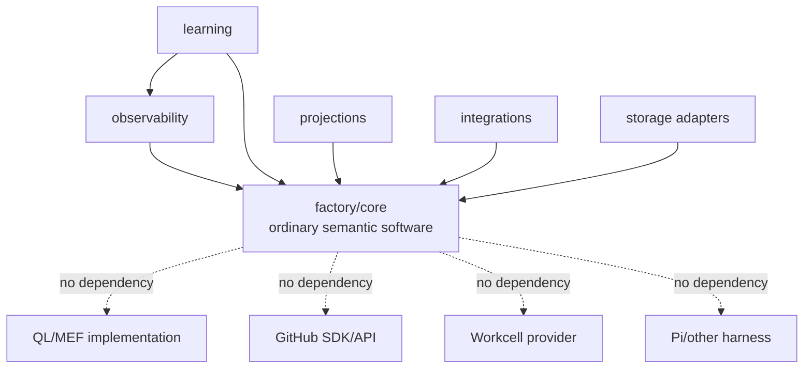
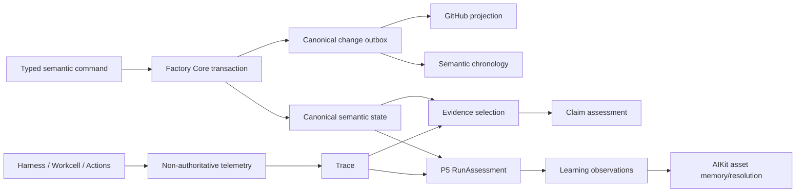
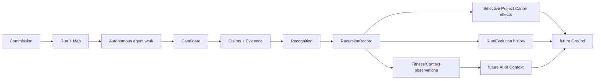
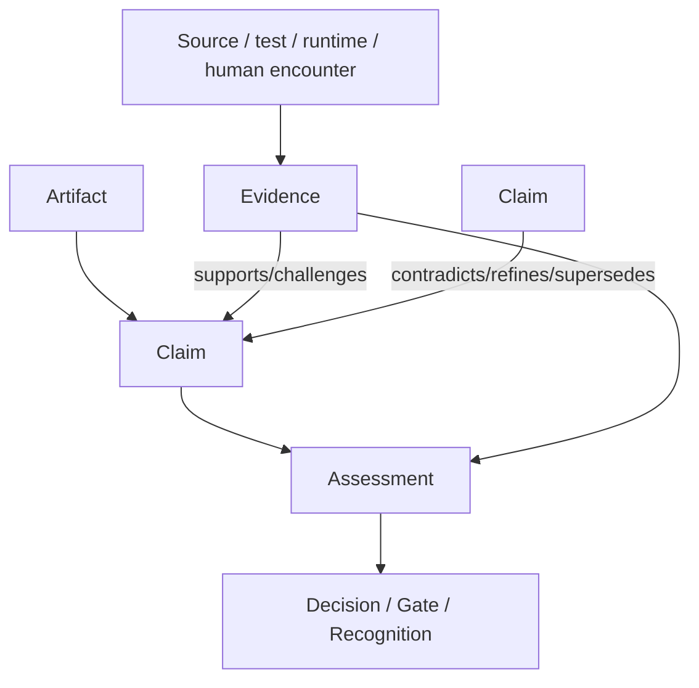

# QL Software Factory — Wayfinder Map 1
## Factory Semantic Core, Run Spine, Epistemics & Learning

**Status:** definitive repo-design map for combined threads `A · C · G · J`  
**Authority:** `QL-SOFTWARE-FACTORY-CONSTITUTIONAL-INDEX.md` governs precedence; companion specifications supply current detailed design.  
**Scope:** Factory semantic/developmental state, Run topology, Claim/Evidence epistemics, Event/Trace observability, Recursion and learned ergonomics.  
**Executable namespace:** `A.* · C.* · G.* · J.*`  
**Primary proof:** `Commission → autonomous work → Candidate → Claim-oriented Recognition → retained Recursion → altered future Ground/Context`.

---

# 0. Constitutional territory

## 0.1 Source precedence and status

This map treats the supplied corpus as a developmental body rather than a flat requirement list.

1. **Constitutional Index** — governing telos, current terminology, precedence, thread boundaries and repo handoff.
2. **Primitive Relations** — governing experienced ontology: identity, ownership, lifetimes, canon/derived/materialised/projected distinctions, Claims/Evidence, Refs, Events/Trace and asset memory.
3. **Deep QL Integration Foundations** — governing QL/MEF framing, current operational lens roles, Claim refraction and the rule that ordinary Factory objects retain identity independent of QL.
4. **Architecture Specification** — richest earlier detail for position contracts, source/store topology, Run Map, telemetry kernel, human apertures and repository shape; later terminology refinements in the Index govern where they differ.
5. **Workcell Module Specification** — authoritative only inside the materialisation boundary and for the Workcell-facing semantic contract.

Anything not fixed by that order is classified in the Decision Ledger rather than silently invented by an implementation ticket.

## 0.2 What A/C/G/J jointly are

The four threads form one **developmental memory circuit**:

```text
Project intention / current Ground
          │
          ▼
      canonical Run
          │
          ▼
 canonical Run Map ────────► Decisions / Candidates
          │                         │
          │                         ▼
          ├──────────────► Claims ↔ Evidence
          │                         │
          ▼                         ▼
    domain changes             Recognition
          │                         │
          ├──── telemetry/Trace ────┤
          │                         ▼
          │                     Recursion
          │                         │
          └──── RunAssessment / learning observations
                                    │
                                    ▼
                         future Ground / Context
```

The unity is semantic, not a reason to collapse storage or authority. The architecture keeps five distinctions hard:

1. **canonical semantic state** — Project/Run/Decision/Candidate/Claim/etc.;
2. **authored Project Canon** — recognised durable project orientation in Git/files/wiki/config;
3. **derived readings** — frontier, Project Evolution, L3/L3′/L4′ views, aggregates and suggestions;
4. **projected state** — GitHub, TUI, HTML, Hermes and other interfaces;
5. **telemetry/material evidence** — events, traces, logs and runtime observations.

No projection, index, trace or learned ranking becomes a second semantic authority.

## 0.3 Constitutional invariants

The combined map MUST preserve:

- Project identity is larger than repository identity.
- A Run is a durable intended transformation and survives sessions, harnesses and hosts.
- The Factory owns one canonical Run Map per Run; GitHub is a rich bidirectional projection.
- Agent identity, Agency and execution are separate.
- Artifact is a produced form; Claim is an epistemic assertion; Evidence bears on a Claim; Trace reconstructs occurrences.
- `intended · observed · verified` are never collapsed into one truth flag.
- Consequential agent output enters durable state as Claims/relations/artifacts, not truth-by-field-name.
- Candidate is a coherent possible reality, not a branch name or Environment.
- Decision is durable semantics; HumanRequest is a channel object for obtaining a determination.
- Human attention is concentrated at genuine authorship and Recognition.
- Recursion selectively promotes retained difference; it does not dump a Run into Project Canon.
- `trust · fitness · preference · frecency · contextual relevance · availability` remain independent signals.
- MEF is a refraction of ordinary Factory objects, not a replacement ontology and not an operational prerequisite for Factory Core.
- Workcell materialisation remains beneath semantic Context and never owns Candidate or Run identity.
- Telemetry failure never rolls back or invalidates canonical authored/core state.

---

# 1. Ground + Intent artifacts

## 1.1 Intent

Build a semantic spine in which humans and agents inhabit the same durable developmental reality: a Project has addressable Runs; each Run has a canonical topology; work advances Claims against Evidence; materially distinct possibilities become Candidates; consequential results are recognised or returned; retained differences are folded into future project entry; operational history improves later navigation without rewriting authorship.

The semantic core must be useful with:

```text
QL service unavailable
GitHub unavailable
Workcell unavailable
one local host only
one simple harness
no Bimba/Neo4j
```

Those systems enrich or project the core; none defines it.

## 1.2 Success conditions

The map is successful when all of the following are demonstrable with fixtures and executable acceptance tests:

1. A human prompt can commission a Run without redundant confirmation.
2. An agent can read the same Run frontier, Claims, Decisions and Evidence through a machine-facing Context packet.
3. The agent can autonomously create a Candidate and advance/evaluate Claims.
4. A human can see the Candidate through a Claim → Evidence recognition surface without reading raw tool logs.
5. Recognition can explicitly accept, return, defer or choose/synthesise Candidates.
6. Recursion retains selected project changes, history and learning while preserving discarded branches.
7. The next Context/Ground changes because of explicit retained effects, not because an opaque model “remembered”.
8. The Run Map remains coherent through returns, branches and nested Runs.
9. GitHub can disappear and later return without becoming the ontology.
10. Raw telemetry can be incomplete or corrupt while canonical Run/Claim/Decision state remains valid.
11. The system can explain why an asset is suggested by showing distinct trust, availability, preference, relevance, fitness and frecency facets.
12. QL/MEF can be disabled and all core contract tests still pass.

## 1.3 Principal human journeys

### H1 — Commission and leave

```text
Open Project
  → prompt “improve X”
  → system shows destination + inferred Ground/Intent
  → no authorial ambiguity: Run becomes active
  → human leaves
```

The user does not approve routine decomposition, tool use, environment selection or reversible local engineering choices.

### H2 — Resolve a consequential Decision

```text
Run blocked at an authorial frontier
  → one HumanRequest surfaces
  → meaningful alternatives + rationale + evidence/prototype
  → human resolves at product/architectural altitude
  → Decision persists; request channel becomes historical provenance
```

### H3 — Compare and recognise Candidates

```text
Candidate lineup
  → open Candidate A/B/C
  → read consequential Claims
  → inspect supporting/challenging Evidence
  → recognise / return / defer / synthesise
```

Merge state, test greenness and agent confidence are evidence, not substitutes for Recognition.

### H4 — Return after months away

```text
Open Project
  → current Ground
  → active frontier
  → “since you last viewed” change summary
  → live/dead branches
  → decisive Decisions and Returns
  → recognised Candidates
  → current open Claims
```

The human does not reconstruct history from commits or chat transcripts.

### H5 — Ask “why?”

```text
Claim / change / suggestion
  → why is this here?
  → provenance
  → supporting/challenging Evidence
  → Decision/Run lineage
  → Trace drill-down only if desired
```

## 1.4 Principal agent journeys

### AG1 — Enter a Run

Agent receives a compact `AgentRunView` containing:

```text
identity / Agency
Project Ref
Run Ref + canonical revision
Destination
active frontier
blocking Decisions
standing Intent/Design Claims
open/challenged Claims
required Evidence
relevant Artifacts/Candidates
available mutation commands
human-authority policy
```

### AG2 — Update topology

Agent does not edit a graph file. It issues typed Run commands against an expected Run revision. Failed optimistic concurrency returns the current revision and a semantic conflict.

### AG3 — Make epistemic progress

Agent asserts a Claim with mode/provenance, requests or attaches Evidence, may challenge another Claim, and produces a separate Assessment. It cannot transform its own confident prose directly into “verified”.

### AG4 — Develop/compare Candidates

Agent creates Candidate identities before physical materialisation, associates source/design/development refs, asks Workcell for a material world when required, and records observed behaviour as Evidence-bearing Claims.

### AG5 — Recurse

P5-oriented agent receives the complete semantic Run plus available Trace, produces `RunAssessment` and proposed `RecursionRecord`. Only effects permitted by recognition/authority are integrated. Suggestions and fitness observations do not silently mutate Project Canon.

---

# 2. Architectural form

## 2.1 Module/package boundary

The first implementation should use one cohesive semantic core with explicit internal ownership rather than a field of tiny mutually dependent crates/packages.

```text
factory/
├── core/
│   ├── identity/        Ref, typed IDs, revisions, tombstones
│   ├── project/         Project identity + canon references
│   ├── run/             Run lifecycle + aggregate transactions
│   ├── runmap/          canonical topology + graph invariants
│   ├── decision/        Decision + HumanRequest relation
│   ├── candidate/       Candidate identity/lineage/state
│   ├── artifact/        Artifact metadata/durability/ref integrity
│   ├── epistemics/      Claim, Evidence, Assessment, relations
│   ├── recognition/     Recognition records and authority outcome
│   ├── recursion/       RecursionRecord + retained effects
│   └── ports/           persistence/read/projection interfaces only
│
├── observability/
│   ├── envelope/        portable Event envelope
│   ├── telemetry/       non-authoritative runtime event ingestion
│   ├── trace/           causal/temporal Trace construction
│   └── export/          optional external telemetry adapters
│
├── learning/
│   ├── assessment/      RunAssessment
│   ├── observations/    UsageSignal/Fitness/Context observations
│   └── suggestion/      transparent multi-factor ranking policy
│
├── projections/
│   ├── github/          Run/Decision/Candidate projection + reconcile
│   └── surface/         read models for TUI/HTML/Hermes/product UI
│
├── integrations/
│   ├── aikit/
│   ├── project-map/
│   ├── actions/
│   ├── harness/
│   ├── workcell/
│   ├── source-integration/
│   └── ql/
│
└── storage/
    ├── sqlite/          canonical/operational store implementation
    ├── ledger/          raw event/artifact ledger implementation
    └── files/           artifact/project-canon references/adapters
```

### Dependency direction



`core` defines semantic ports. Adapters depend inward. No adapter may be imported by core domain modules.

## 2.2 Canonical identity and Ref syntax

### Identity

Every addressable core object receives an immutable typed ID at creation. V1 uses a time-sortable 128-bit identifier (ULID-compatible representation) generated locally without a central server.

Canonical string form:

```text
project:<id>
run:<id>
decision:<id>
candidate:<id>
artifact:<id>
claim:<id>
evidence:<id>
human-request:<id>
recognition:<id>
recursion:<id>
event:<id>
```

Human names/slugs are aliases and MAY change. IDs never encode host, repository, GitHub number, path, branch, model or provider.

### Revision

Mutable canonical objects carry an integer `revision`, starting at `1`, advanced by successful semantic mutation. A version-specific reference is represented semantically as `(Ref, revision)`; string serialisation MAY use `ref@revision` but identity remains the base Ref.

### No ID reuse

Deleted/archived/tombstoned IDs are never reused. A new materially distinct Candidate receives a new Candidate ID; rematerialising the same Candidate in a new Environment does not.

## 2.3 Aggregate ownership

| Object | Semantic owner | Mutation authority | Lifetime |
|---|---|---|---|
| Project | `core/project` | Project use-case command; canon promotions subject to Recognition/authority | enduring |
| Run | `core/run` | Run commands with optimistic revision | active hours–months; history enduring |
| Run Map | `core/runmap`, 1:1 child of Run | Run commands only | same as Run |
| Decision | `core/decision` | resolver class declared on Decision | historical enduring |
| HumanRequest | `core/decision` | system creates; channel response resolves request, not Decision directly | until resolved; summary retained |
| Candidate | `core/candidate`, owned by Run | Run/candidate commands | history enduring; material world optional/ephemeral |
| Artifact metadata | `core/artifact` | producer creates; durability/promotion through lifecycle command | as policy; canonical artifacts enduring |
| Claim | `core/epistemics` | any authorised actor may assert; statement immutable after assertion | historical enduring unless privacy purge |
| Evidence | `core/epistemics` | capture creates immutable Evidence; attachment is separate relation | policy-scoped |
| Assessment | `core/epistemics` | authorised assessor/gate/human; append/supersede, never rewrite old assessment | enduring history |
| Recognition | `core/recognition` | authority specified by RecognitionPolicy; human by default for materially authorial changes | enduring |
| RecursionRecord | `core/recursion` | P5 proposes; integration validates authority of each effect | enduring |
| Event | `observability` / core outbox according to class | emitted from committed mutation or runtime observer | retention-class dependent |
| Trace | derived in `observability/trace` | no direct mutation; rebuilt from events | rebuildable |

## 2.4 Run lifecycle is not the developmental graph

A single stage enum cannot represent parallel branches, returns and nested processes. V1 therefore separates **Run lifecycle** from **Run Map node state**.

### Run lifecycle

```text
seeded
  ↓
active ───────► waiting_human
  │                 │
  │                 └────► active
  ├──────────► suspended ─► active
  ├──────────► finishing ─► finished ─► archived
  └──────────► aborted ────────────────► archived
```

`waiting_human` is derived when all runnable frontier is blocked by human-authority Decisions; it MAY be persisted as a cached lifecycle state but MUST be derivable.

### Developmental position

Ground/Intent/Design/Development/Application/Recursion are **Factory developmental contracts** attached to map nodes. They are not the invariant semantic names of QL positions. A core node may also carry optional `ql_ref` metadata understood only through the QL seam.

## 2.5 Canonical persistence and transaction rule

### Canonical semantic store

V1 canonical mutable semantic state is persisted transactionally in the Factory/AIKit operational SQLite store on the Run’s current write-owning host. The store contains Projects/Run aggregates/Decisions/Candidates/Claim records/Projection bindings and indexes required for core operation.

### Single-writer active Run semantics

An active Run has one `write_owner` host and one `authority_epoch` at a time. Other hosts/projections may read and may queue mutation intents; they do not concurrently commit canonical Run mutations.

This is deliberately simpler than multi-master merging. Host transfer is explicit:

```text
checkpoint canonical Run bundle
  → seal old authority epoch
  → import/verify on target host
  → advance authority epoch
  → resume writes
```

Every mutation uses `(run_ref, expected_revision, command_id)` for idempotency and optimistic concurrency.

### Portable Run bundle

A portable bundle contains semantic snapshots and change history sufficient to restore core state without telemetry:

```text
Project Ref + required project references
Run + RunMap
Decisions + HumanRequests summaries
Candidates
Artifact metadata + content refs
Claims + Evidence metadata + Assessments
Recognitions + Recursion records
Projection bindings
canonical change sequence
schema/version manifest
content hashes
```

Raw tool logs, token streams and Workcell resources are not required to restore semantic validity.

### Domain change outbox vs telemetry

A semantic mutation commits:

```text
canonical state mutation
+ canonical_change record/outbox
```

in the same database transaction. This small change record is not optional telemetry; it drives projections, replication and semantic chronology.

High-volume runtime/tool/model events are written separately. Their failure never rolls back the canonical mutation.

---

# 3. Exact primitive semantics

## 3.1 Project

Project is the enduring authored whole. Core stores identity, status, source constituent Refs, current Canon refs, Run refs and policy refs. It does not store a universal flattened copy of source/wiki/Project Map data.

Lifecycle:

```text
bootstrap_pending → bootstrapping → operable → active ↔ dormant → archived
```

Archive is normal; hard deletion is a separate explicit destructive Procedure.

## 3.2 Run

Run owns:

```text
Run identity
Project Ref
destination
lifecycle
authority epoch/write owner
1 canonical RunMap
created/finished metadata
RecognitionPolicy Ref
RecursionRecord refs
```

Run references Decisions, Candidates, Artifacts, Claims, Evidence and Events but does not duplicate their bodies.

## 3.3 Decision

```text
identified → open → resolved
                 ↘ superseded/reopened → open
```

A Decision contains:

```text
question/determination
alternatives
relevant Claim/Evidence refs
resolver_class = agent | evidence | human | prototype_recognition
resolution
rationale
consequence refs
supersedes/reopens refs
```

Resolution is append-like: previous resolution history is retained when reopened/superseded.

## 3.4 HumanRequest

HumanRequest references exactly one semantic need (normally one Decision or Recognition request) and may have many channel projections. A channel message cannot create a competing Decision identity.

States:

```text
queued → delivered → answered | withdrawn | expired
```

Resolved request body/message history may follow channel retention; a minimal durable summary remains attached to the Decision.

## 3.5 Candidate

States:

```text
proposed → building → runnable → under_application
                                  ├─ recognised → integrated
                                  ├─ returned → building | discarded
                                  └─ discarded
```

Candidate identity binds a coherent possible reality through source/revision refs, design/development artifact refs, Claims/Evidence, producing Executions and optional current materialisation. Environment/Checkout changes do not change identity unless the represented product state materially changes.

## 3.6 Artifact

Artifact has immutable content-addressed revisions and mutable lifecycle metadata:

```text
working → run_durable → recognised → project_canonical
              └────────► superseded / retained_history
```

A new content body is a new Artifact revision, never silent in-place replacement.

## 3.7 Claim

### Claim representation

```text
Claim {
  id
  project_ref
  run_ref?
  statement
  mode
  scope
  subject_refs[]
  provenance
  asserted_at
  ql_ref?            # optional; opaque to core
  supersedes?[]
}
```

`mode` is semantic, not confidence:

```text
intent
observation
design
causal
hypothesis
prediction
evaluation
recognition
proposal
```

Claim statement/provenance are immutable after assertion. Correction creates a new Claim with `supersedes`/`refines` relation.

### Claim relations

Small canonical vocabulary:

```text
supports       # Claim-to-Claim argumentative support
contradicts    # Claims cannot both hold in stated scope without qualification
refines        # later/more precise formulation
supersedes     # later Claim becomes governing formulation while history remains
specialises    # narrower scope
corresponds_to # explicitly non-identity relation; use sparingly
```

No generic semantic `related_to` edge is allowed in core epistemics.

### Assessment

Claim standing is represented by append-only Assessments, not by changing the Claim statement:

```text
unassessed
supported
challenged
unresolved
verified
refuted
superseded
```

Assessment records assessor, criteria, supporting/challenging Evidence relations and time. “Verified” always means verified **for a stated claim, scope and criterion**, not metaphysical truth.

### Intended / observed / verified

These remain three different things:

```text
intended
  = an intent/design Claim establishes what should be true

observed
  = an observation Claim states what inspection/runtime actually showed

verified
  = an Assessment concludes that relevant Evidence sufficiently supports a Claim under explicit criteria
```

A derived `EpistemicTriadView(subject)` MAY show all three side by side. It MUST NOT store them as one status field.

## 3.8 Evidence

Evidence is immutable captured material selected because it bears on a Claim.

```text
Evidence {
  id
  kind
  source_ref
  captured_at
  provenance
  integrity_hash?
  sensitivity
  retention_class
  availability_state
}

EvidenceRelation {
  claim_ref
  evidence_ref
  polarity = supports | challenges
  rationale
  scope
  created_by
}
```

Deterministic tests do not write `claim.verified=true`. A test run emits an observation Claim such as “suite X exited successfully against revision Y”, backed by the test output Evidence. A separate Gate/Assessment may use it to verify a higher-level Claim.

## 3.9 Recognition

Recognition is a specialised semantic determination, not an inference from merge/green CI.

```text
Recognition {
  id
  run_ref
  candidate_refs[]
  intent_claim_refs[]
  decision_ref
  resolver
  outcome = recognise | return | defer | synthesise
  rationale
  evidence_refs[]
  recognised_effect_refs[]
}
```

Recognition owns no Project mutation itself. It authorises or denies effects which Recursion may integrate.

## 3.10 RecursionRecord and retained difference

```text
RecursionRecord {
  id
  run_ref
  recognition_refs[]
  run_assessment_ref?
  effects[]
  new_prompt_claim_refs[]
  integrated_at?
}
```

Effect kinds are deliberately explicit:

```text
PromoteCanonArtifact
PromoteDecision
AdoptSourceRevision
UpdateProjectSemanticRef
PublishRunHistory
InvalidateDerivedIndex
EmitFitnessObservation
EmitContextObservation
ProposeProfileChange        # proposal only; AIKit Procedure required
SeedFutureRun               # creates prompt/proposal; does not silently author Intent
```

Future Ground/Context changes through these explicit paths:

```text
Recognition
  → RecursionRecord
      ├─ canon effects ─────────────► authored Project orientation
      ├─ history effects ───────────► prior Run/Evolution horizon
      ├─ index invalidation ────────► rebuilt Project Map/Code/knowledge views
      └─ learning observations ─────► AIKit contextual resolution
                                           │
                                           ▼
                                   future resolved Context
                                           │
                                           ▼
                                     future Ground
```

A learned observation can influence a suggestion; it cannot rewrite Project Canon or explicit preference/trust.

---

# 4. Canonical Run Map / Wayfinder

## 4.1 One Run, one map identity

`RunMap` is a 1:1 owned component of Run and is addressed as `run:<id>/map`; it does not receive a second independent global identity. This prevents Run and Run Map from drifting into duplicate authorities.

## 4.2 Topology nodes

Only things which participate in developmental topology are first-class map nodes.

```text
DestinationNode   exactly one root intent/destination statement
PositionNode      Factory developmental contract position; optional QL Ref
WorkNode          executable/decomposable work whose completion changes the route
DecisionNode      references one canonical Decision
CandidateNode     references one canonical Candidate
GateNode          transition criterion/assessment point
AuthorityNode     commission/recognition/other explicit human-authority aperture
NestedRunNode     references one child Run
```

Artifacts, Claims, Evidence, HumanRequests, Traces and source refs are **attachments** to nodes/edges, not default topology nodes. They remain independently addressable canonical objects.

## 4.3 Work/Position node state

```text
planned
ready
active
blocked
waiting
satisfied
returned
superseded
abandoned
```

Decision/Candidate/Authority node status is read from the referenced canonical object rather than duplicated inside the map.

## 4.4 Edge vocabulary

The canonical process graph uses a deliberately small typed edge set:

```text
requires      A requires B; dependency direction A → B
branches_to   A creates a materially distinct developmental branch B
returns_to    later node returns responsibility to earlier node; carries reason/Evidence refs
nests         parent node delegates a durable sub-transformation to child Run
converges_to  two or more branches feed a synthesis/integration node
realises      Candidate realises a design/work branch
supersedes    newer topology node replaces prior route while preserving history
```

Attachments use separate roles:

```text
input_artifact
output_artifact
advances_claim
requires_evidence
evidenced_by
human_request
trace
source
```

No generic `edge.type = "related"` is permitted.

## 4.5 Graph invariants

1. Exactly one DestinationNode.
2. Every non-root process node is reachable from Destination through topology edges ignoring `returns_to` back-edges.
3. `requires` edges are acyclic within one snapshot; loops are represented by `returns_to`, not dependency cycles.
4. A `NestedRunNode` references a different Run and the child records `parent_run_ref`; recursive self-reference is prohibited.
5. Every CandidateNode references a Candidate owned by the same Run unless explicitly marked imported-comparison.
6. Every DecisionNode references one Decision; no inline duplicate alternatives/resolution.
7. A closed/abandoned branch remains addressable.
8. A branch cannot be physically deleted while referenced by a Decision, Claim, Evidence, Candidate, Recognition or Recursion record.
9. `frontier` is derived, never a second manually curated list.
10. Project Evolution is derived from Run Maps/semantic changes, never authored as an independent historical truth.

## 4.6 Frontier

A node is in the executable frontier when:

```text
node state ∈ {planned, ready}
AND all `requires` prerequisites are satisfied
AND no governing open Decision blocks it
AND no parent branch is abandoned/superseded
AND actor policy/authority allows execution
```

The human frontier view groups:

```text
Runnable now
Waiting on evidence/external dependency
Waiting on human authorship
Active agent work
```

## 4.7 Branch liveness

Derived branch state:

```text
live        has active/ready descendants or recognised Candidate
waiting     no executable descendant but unresolved dependency remains
returned    route explicitly sent back to earlier responsibility
superseded  later route replaced it
abandoned   explicit termination
historical  completed/dead route retained only for lineage
```

## 4.8 Reopening and return

A return is not “set stage backwards”. It is a durable `returns_to` edge plus:

```text
reason Claim
Evidence refs
responsible target node
affected Decision/Claim refs
originating Candidate/Application refs
```

The target may be reopened or a successor revision node may be created. Historical topology remains visible.

## 4.9 Nested processes

Use a `NestedRunNode` only when the sub-process merits its own durable destination, Decisions, Claims, Candidates or independent resumption. Small decomposition stays within WorkNodes. This avoids ceremonial recursive Runs.

## 4.10 Canonical vs derived views

| View | Status | Derivation |
|---|---|---|
| Run Map process graph | canonical topology | core RunMap state |
| frontier | derived | node state + `requires` + Decision state |
| live/dead branch view | derived | topology + object states |
| L3 Processual | derived refraction | transformations/branches/returns/nesting/convergence |
| L3′ Chronological | derived | canonical change sequence + available telemetry |
| L4′ Knowledge Work | derived/refraction | Prompt/Trace/Challenge/Pattern/Discovery/Insight markers over Claims/Events/Artifacts |
| Project Evolution | derived | Runs + Decisions + Recognitions + Recursions + selected Git refs |
| GitHub mirror | projected | Projection bindings |
| HTML/TUI view | projected | read models |

---

# 5. L3, L3′ and L4′ views

## 5.1 L3 Processual

L3 asks “what is becoming?” and should emphasise:

```text
transformations
branch creation
returns/reopenings
nested Runs
candidate divergence
branch convergence
recursion/foldback
```

The L3 view hides chronological noise by default. It is the best agent/human view for understanding process shape.

## 5.2 L3′ Chronological

L3′ combines the canonical semantic change order with runtime events without pretending distributed wall clocks are perfect.

Ordering rules:

1. canonical mutation sequence orders semantic changes;
2. `causation_ref` orders causally linked Events;
3. per-stream `sequence` orders local events;
4. timestamps are display/tie-break information, not the sole source of causality.

The view marks telemetry gaps explicitly rather than inventing missing history.

## 5.3 L4′ Knowledge Work

Canonical conditions:

```text
Prompts → Traces → Challenges → Patterns → Discovery → Insight
```

They are a refraction of intelligence within the Run, **not a second workflow**.

Operational binding:

| L4′ condition | Factory material |
|---|---|
| Prompts | initiating prompts, research questions, Decision questions, proposal Claims |
| Traces | retrieval/execution Trace refs and source/evidence trails relevant to inquiry |
| Challenges | failed Gates, contradictory Claims, unresolved Decisions, returned branches |
| Patterns | repeated structures/failure patterns, pattern Claims, clustered observations |
| Discovery | newly established evidence-backed facts/relations/possibilities |
| Insight | synthesised Claims or Recursion learnings which change understanding/future orientation |

A `KnowledgeMarker` MAY persist an agent/human annotation that a specific Ref exemplifies one condition. The original objects remain canonical; markers are derived/refraction metadata.

---

# 6. GitHub bidirectional projection

## 6.1 Projection identity

```text
ProjectionBinding {
  id
  canonical_ref
  canonical_subref?       # e.g. run node
  provider = github
  repository_ref
  entity_kind = issue | pull_request
  external_id
  projection_schema_version
  last_synced_canonical_revision
  last_seen_remote_revision
  state = healthy | pending | stale | diverged | orphaned | unreachable
}
```

A hidden machine-readable marker in the GitHub entity MUST carry the canonical Run/node Ref and projection schema so mapping can be re-established after local projection-index loss. Display title/number never defines identity.

## 6.2 Default mapping

```text
Run / Destination        ↔ parent issue
independent Decision     ↔ child issue when discussion/work merits it
vertical Work slice      ↔ issue
Candidate implementation ↔ branch/PR references
Candidate                ↔ one or more PR/runtime refs, never identical to PR
Recognition              ↔ explicit Factory semantic record; may be summarised to GitHub
```

A merged PR is an observed fact/evidence. It is not Recognition and does not finish a Run by implication.

## 6.3 Field authority

### Canonical-only semantic fields

GitHub may display but not implicitly own:

```text
Refs/identity
node kind
Decision resolver/resolution
Candidate identity
Recognition outcome
Claim/Evidence relations
return edges
Recursion effects
Project/Run ownership
```

Remote edits to these must arrive as explicit typed Factory commands or become a projection conflict/proposal.

### Round-trippable collaborative fields

```text
display title
human-readable description/notes
work-node open/closed status
non-semantic tags
assignee hints
comments/discussion refs
```

Closing an issue that mirrors a WorkNode can satisfy that WorkNode only when configured acceptance/gate criteria are already met; otherwise it becomes an incoming “close requested” intent and the canonical node remains unsatisfied.

### Remote-only fields

Provider-specific metadata with no canonical meaning remains remote and may be indexed for UX without entering core state.

## 6.4 Outgoing sync

```text
canonical command commits
  → canonical_change outbox
  → projection adapter computes idempotent patch
  → remote apply
  → ProjectionBinding advances sync revisions
```

Network failure sets `pending/stale`; it never rolls back canonical state.

## 6.5 Incoming sync

Webhook or poll results become `ProjectionIntent` records. The adapter:

1. resolves binding by embedded canonical marker/external ID;
2. classifies changed fields by authority;
3. converts allowed edits into typed core commands;
4. rejects/records canonical-only mutations not expressed as valid commands;
5. advances remote revision only after successful reconcile.

No remote webhook writes the canonical store directly through SQL.

## 6.6 Conflict handling

For each round-trippable field, reconcile from the pair:

```text
last_synced canonical revision
last_seen remote revision
```

Rules:

- one side changed: apply that change;
- append-only comments/tags: merge when semantically commutative;
- both changed same scalar field: preserve canonical current value, create `ProjectionConflict`, retain remote value as a note/proposal;
- canonical-only field diverged remotely: canonical wins; emit visible sync warning;
- external entity deleted: binding becomes `orphaned`; canonical object remains intact;
- mapping marker missing/ambiguous: do not guess by title; require deterministic recovery or explicit human link.

ProjectionConflict is operational state, not automatically a human-authorial Decision. It blocks only the affected projection field unless semantic intent is genuinely ambiguous.

## 6.7 Offline and partial operation

The canonical Run remains fully operable offline. Outgoing projection changes queue by canonical revision. Incoming changes are reconciled when connectivity returns.

If GitHub is unavailable for a week, agents can still create/resolve Decisions, develop Candidates, record Claims/Evidence and recognise/return work locally.

## 6.8 Reconstruction after long absence

```text
load canonical Run + ProjectionBindings
fetch remote entities changed since last-seen revision
validate embedded canonical markers
reconcile round-trippable fields
record conflicts/orphans
re-emit missing outbound patches
produce a human/agent sync report
```

If canonical Factory state is lost but GitHub remains, the mirror can recover a **projection skeleton** and external history where markers exist. It cannot truthfully reconstruct Claims, Evidence, Recognition, returns or Recursion that were never projected. Recovery MUST label such material `recovered/observed`, not pretend GitHub was canonical.

---

# 7. Claim/Evidence epistemic plumbing

## 7.1 Agent-facing Claim Context

Every serious agent invocation should receive a structured epistemic section in addition to ordinary prose/artifacts:

```text
RECOGNISED INTENT CLAIMS
OBSERVED IMPLEMENTATION CLAIMS
VERIFIED BEHAVIOUR CLAIMS
OPEN / HYPOTHESIS CLAIMS
CHALLENGED / CONTRADICTORY CLAIMS
CLAIMS REQUIRING EVIDENCE
CURRENT DECISIONS
REQUIRED GATES
```

The packet includes stable Refs so the agent can operate on the same Claims the human later sees.

## 7.2 Claim-oriented output contract

Consequential agent output should be able to emit:

```text
assert_claim
challenge_claim
relate_claims
attach_evidence
request_evidence
propose_assessment
propose_decision
produce_artifact
```

Free prose remains allowed; the harness/agent prompt asks the agent to explicitly elevate consequential statements rather than relying on post-hoc extraction.

## 7.3 Contradiction/refutation/supersession

- Contradiction is a Claim↔Claim relation.
- Challenging Evidence does not automatically refute a Claim.
- Refutation is an Assessment with criteria/evidence.
- Supersession preserves the old Claim and points to its successor.
- A refuted Claim can remain valuable historical Evidence for why a route changed.

## 7.4 Gates are Claim assessments

A Gate defines:

```text
claim being assessed
criteria
required Evidence classes
assessor type = deterministic | agent | human | composite
result
unmet conditions
return target on failure
```

The gate result is itself an observation/evaluation Claim plus Assessment. `pass/fail` alone is not sufficient provenance.

---

# 8. MEF refraction architecture

## 8.1 Core independence

No core table/state machine requires MEF. The core stores only optional QL/refraction references. If the QL/MEF implementation is missing, unavailable or upgraded, Run/Claim/Candidate behaviour remains valid.

## 8.2 Refraction object

```text
RefractionRequest {
  target_ref
  lens_ref
  purpose
  context_refs[]
  requested_by
}

RefractionResult {
  id
  target_ref                # original identity preserved
  lens_ref
  ql_kernel_or_form_version
  interpretation_artifact_ref
  distinctions[]
  resulting_claim_refs[]
  evidence_refs[]
  produced_at
}
```

A RefractionResult is **derived interpretation**. It never replaces the target object.

## 8.3 Current ratified operational roles

The canonical corpus currently supports these Factory-wide roles:

```text
L0   Investigative — questioning, search, missing evidence, self-orientation
L1   Causal — causal constitution/role within a relation
L2   Logical — IS / IS-NOT / BOTH / NEITHER dispositions and competing Claims
L3   Processual — transformation, branching, return, nesting, convergence
L3′  Chronological — actual unfolding, ancestry, sequence, developmental history
L4′  Knowledge Work — Prompts → Traces → Challenges → Patterns → Discovery → Insight
L5   Articulation / Vāk — movement from latent capacity/intention to explicit marks and their return into future context
```

The remaining five lens anchors are structurally first-class in MEF, but this corpus does not ratify a Factory-wide operational role for each. This map therefore records them as **available refractive coordinates with no invented software label**. The initial design pass must exercise them through the QL/MEF source/service and persist a LensRoleBinding only where a distinct natural operational role is actually disclosed.

## 8.4 Full first-pass refraction ledger

The following ledger records where the currently ratified roles already reveal concrete functionality. Each primitive is still a target for all twelve lenses; “—” for unratified roles means *inspect full MEF source, do not invent symmetry*.

| Primitive | L0 Investigative | L1 Causal | L2 Logical | L3 Processual | L3′ Chronological | L4′ Knowledge | L5 Articulation |
|---|---|---|---|---|---|---|---|
| Project | open questions/gaps | constituent causes/conditions | conflicting project claims | developmental becoming | project evolution | knowledge state | canon/code/wiki crystallisation |
| Context | missing horizon/evidence | what conditions availability/relevance | competing contextual assumptions | context transformation | context-at-time | prompt/retrieval trajectory | projection into prompt/tools/marks |
| Run | investigative frontier | causes/constraints of transformation | competing routes/claims | primary process topology | primary temporal history | whole inquiry trajectory | intent→artifacts→persistent result |
| Run Map | fog/frontier | dependency/causal reading | branch alternative logic | canonical process view | canonical chronology view | knowledge-work overlay | map as explicit durable articulation |
| Decision | what remains unknown | consequences/causal stakes | live alternatives incl BOTH/NEITHER | route change | resolution/reopening history | prompts/challenges/insight basis | resolution crystallised into route |
| Agent | self-orientation | causal role in an act | conflicting agent claims | participation in transformation | execution history | inquiry contributions | utterance/action/code production |
| Agency | stance/capability questions | local causal function | competing stances | local act trajectory | use history | pattern of successful inquiry | situated identity made operational |
| Capability | discovery need | what power produces what effect | contradictory capability claims | invocation in process | use history | trace→fitness learning | tool result becomes marks/artifacts |
| Action | intent/required operation | domain effect | pre/postcondition tensions | domain transformation | invocation history | prompts/traces/challenges | canonical operation across surfaces |
| Artifact | questions it answers/opens | causal role/material/form | contradictory artifact claims | artifact transformations | version lineage | knowledge condition | strongest natural L5 object |
| Claim | missing evidence/questions | causal claims/conditions | primary L2 object | standing changes through process | assessment history | primary L4′ object | proposition→explicit/persistent mark |
| Evidence | what evidence is missing | origin/causal relevance | support/challenge tension | capture/selection process | evidence timeline | Trace/Challenge/Discovery relation | raw occurrence→addressable evidence |
| Candidate | what should be tested | why behaviour arises | alternative candidate dispositions | branch becoming | candidate lineage | experiment/discovery trajectory | design possibility→experienced form |
| HumanRequest | what truly requires human | consequence of response | alternative field | blocking/resolution process | request/respond history | Prompt/Challenge | authorial response→Decision mark |
| Project Map | where to investigate | source/index dependencies | conflicting navigational claims | project relation/process view | evolution view | knowledge navigation | project intelligibility crystallised |
| SourceIntegration | source questions/gaps | upstream/local causality | source claims vs observed reality | integration lifecycle | drift/upgrade history | research/discovery trail | upstream form→local executable seam |

## 8.5 Compact human/agent synthesis

Human surface shows at most the few refractions that materially change understanding:

```text
Claim
  Default synthesis
  Investigative questions (L0)
  Causal account (L1)          [only if useful]
  Logical tension (L2)         [only if live]
  History (L3′)
  Knowledge trajectory (L4′)
```

Agent receives:

```text
active lens/purpose
original target Ref
standing synthesis
new distinctions
claims/evidence changed by the refraction
```

The system never dumps twelve ceremonial paragraphs into every prompt.

---

# 9. Event, Trace and telemetry

## 9.1 Portable Event envelope

```text
EventEnvelope {
  event_ref
  schema_version
  class = domain_change | execution | observation | projection | system
  kind

  occurred_at
  emitted_at
  stream_ref
  stream_sequence

  project_ref?
  run_ref?
  run_node_ref?
  candidate_ref?
  claim_ref?

  actor_ref?
  agency_ref?
  harness_ref?
  model_ref?
  host_ref?
  environment_ref?
  capability_refs[]
  action_ref?

  correlation_ref?
  causation_ref?
  parent_span_ref?

  input_refs[]
  output_refs[]
  payload_ref?
  status?
  error_ref?

  sensitivity
  portability
}
```

IDs/Refs and semantic relations are portable. Host PIDs, absolute paths and secret-bearing payloads are not.

## 9.2 Event classes

### `domain_change`

Small, durable record emitted transactionally after a canonical mutation. Required for projections/semantic chronology. Not high-volume tracing.

Examples:

```text
run.created
run.lifecycle_changed
runmap.node_added
runmap.edge_added
decision.opened
decision.resolved
candidate.created
claim.asserted
evidence.attached
recognition.recorded
recursion.integrated
```

### `execution`

High-volume runtime observability:

```text
agent.started
agent.ended
tool.called
tool.returned
harness.handoff
gate.started
gate.completed
process.error
model.usage
```

### `observation`

Normalized occurrences used to form Claims/learning:

```text
capability.used
action.invoked
context.source_retrieved
candidate.opened
human.intervened
```

### `projection`

GitHub/HTML/Hermes synchronization and conflicts.

## 9.3 Trace construction

Trace is a derived causal/temporal view over Events and execution records.

```text
Trace {
  target_ref
  event_refs[]
  root_event_refs[]
  gap_markers[]
  completeness = complete | partial | known_gap | corrupt_tail
  built_from_ledger_revision
}
```

Construction respects `causation_ref`, `parent_span_ref`, local stream sequence and canonical domain-change order. Missing events yield explicit gap markers.

## 9.4 Continuous collection vs Recursion interpretation

### Continuously recorded (subject to retention/privacy)

```text
canonical domain changes
agent/harness/model/Agency selection
capability/action invocation start/end
context source retrieval
candidate creation/exposure/open
Gate execution/results
human request/respond/intervention
errors/returns
usage/token/cost/resource summary where available
Workcell observed state/evidence refs
projection sync state
```

### Interpreted primarily at Recursion

```text
outcome quality
intent fidelity
design fidelity
return/rework pattern
human-intervention quality/density
model fitness
Capability fitness
Action fitness
Agency fitness
context-source usefulness
recurring failure pattern
reusable Run pattern
suggestion/routing implications
```

### Ephemeral by default

```text
UI redraw events
heartbeat chatter
raw token deltas after final message reconstruction
high-frequency process metrics with no retained diagnostic policy
transient availability probes
```

Structured tool invocations, final messages/artifacts and Gate Evidence remain independently retainable.

## 9.5 Retention / privacy / portability

| Material | Default scope | Portability | Retention |
|---|---|---|---|
| canonical Run/Decision/Claim metadata | project/factory | portable | enduring/history |
| authored Project Canon | project | normal project/source rules | enduring/versioned |
| domain-change sequence | project/run | portable | enduring with Run history |
| normalized execution Events | run | portable after secret stripping | configurable, medium/long |
| raw model/tool payloads | local/run | private by default | configurable/shorter |
| secrets/credentials | never event payload | non-portable | external secret store only |
| host PID/absolute path/resource lease | host | non-portable detail | short/operational |
| Evidence | claim/project/run | portable by Ref when policy permits | per evidence class |
| UsageSignal | user/project/profile/host according to asset | selectively portable | rolling + aggregate |
| FitnessObservation | project/profile/demand | portable normalized form | long enough to learn |
| explicit preference/trust | AIKit user/project scope | policy-controlled | until changed/revoked |

A privacy purge may redact Evidence/raw payload while retaining an immutable tombstone, hash if appropriate, purge reason and affected Assessments. Historical “verified at time T” can remain historical, while current verification views must show required evidence as unavailable when that matters.

---

# 10. RunAssessment and learned ergonomics

## 10.1 RunAssessment

```text
RunAssessment {
  run_ref
  produced_at
  assessor_refs[]
  outcome_quality
  intent_fidelity
  design_fidelity
  returns[]
  human_interventions[]
  model_observations[]
  capability_observations[]
  action_observations[]
  agency_observations[]
  harness_observations[]
  context_observations[]
  failure_patterns[]
  reusable_learning_refs[]
  source_event_range
  trace_completeness
}
```

If Trace is incomplete, Assessment states that limitation. Missing telemetry lowers evidential coverage; it does not invalidate the Run.

## 10.2 Distinct learning signals

### Trust

Categorical permission/review state. Owned operationally by AIKit policy. **Never inferred upward from successful outcomes.**

### Availability

Current reachability/compatibility. Supplied by AIKit/Workcell/providers. Dynamic, often ephemeral.

### Preference

Explicit human/project choice. Typed as `require | prefer | neutral | avoid | forbid`. Only explicit user/project mutation or an approved Procedure changes it.

### Contextual relevance

Derived relation between asset and current demand/context based on scope, prior use and semantic match. Not quality.

### Fitness

Contextual outcome evidence for a demand class. Stored as observations/distributions/assessments, never a universal asset score.

### Frecency

Deterministic recency/frequency memory of use. Familiarity only.

## 10.3 Default suggestion/ranking policy

No opaque weighted mega-score.

```text
1. Eligibility filter
   trust permits AND availability satisfies hard requirements AND no `forbid`

2. Hard/explicit preference
   `require`/pinned project choice where compatible

3. Demand fitness evidence
   prefer assets/compositions with stronger relevant outcome evidence

4. Contextual relevance
   prefer assets historically/semantically relevant to this project/Agency/task

5. Soft preference
   `prefer` before neutral before `avoid`

6. Frecency
   tie-break for ergonomic ordering/autocomplete

7. Stable deterministic ID tie-break
```

Every suggestion exposes the independent facets that produced its ordering.

## 10.4 Observation ownership boundary with AIKit

Factory J owns the **semantic observation models, RunAssessment production and ranking policy contract**. AIKit owns the cross-scope asset index/resolver, storage of user/project trust and preference, live availability resolution and presentation/autocompletion surfaces.

Factory publishes:

```text
UsageSignal
FitnessObservation
ContextObservation
RunPatternObservation
```

AIKit returns:

```text
asset identity
trust state
availability
explicit preference
frecency/context history
ranked/suggested effective view with explanation
```

P5 can propose a profile change; AIKit Procedure/authority must enact it.

---

# 11. Deletion, retention and supersession

## 11.1 General rule

Normal semantic history is append/supersede/archive, not destructive deletion.

## 11.2 Project

`archive` hides from ordinary active views but retains identity/history. Hard purge requires an explicit destructive Procedure and produces tombstone/audit metadata where policy permits.

## 11.3 Run / Run Map

Runs are aborted/finished/archived, never silently deleted if any consequential history exists. Completed map branches remain historical.

## 11.4 Decisions / Claims / Recognitions / Recursion

Immutable historical semantics. Corrections happen through supersession/reopening/new records. Privacy/legal purge may redact payload while preserving non-sensitive tombstone/reference integrity.

## 11.5 Candidates

Live Environments/Checkouts may be destroyed. Candidate metadata, lineage, consequential Claims/Evidence and Decision/Recognition links remain.

## 11.6 Artifacts / Evidence

Content can follow retention class. If content is collected by GC/purge, the Ref becomes an unavailable/tombstoned historical reference rather than being rebound to new content.

## 11.7 Telemetry

High-volume raw telemetry may expire independently from semantic Run history. Derived fitness observations must retain enough provenance to state the source Run/Trace coverage even after raw payload expiry.

## 11.8 GitHub

Deleting/closing a GitHub entity never deletes canonical Factory state. Projection becomes orphaned or closed according to mapping policy.

---

# 12. Human + agent product surfaces

## 12.1 Run-at-a-glance read model

```text
RUN 184 · Improve session model switching
Active · autonomous work in progress

Destination
  Preserve session identity while allowing provider/model switching.

Frontier
  ✓ Ground recovered
  ✓ Intent recognised
  ● Candidate B application tests
  ◌ Decision D7 — provider-specific fallback (not blocking B)

Branches
  A — discarded: context loss
  B — runnable, current recommendation
  C — returned to Design: persistence mismatch

Claims
  8 supported · 1 challenged · 2 open

Why the route changed
  C returned to Design because Evidence E91 contradicted Claim C44.

Candidates
  [Open B] [Compare A/B/C] [Evidence]
```

## 12.2 Recognition read model

```text
Candidate B

Intent Claim
  “Switching model/provider preserves the logical session.”

Observed
  ✓ session ID stable in provider A→B test
  ✓ recovery suite passes
  ? provider C not exercised

Assessment
  supported / partially verified

Meaningful delta
  + explicit SessionRuntime abstraction
  + recovery contract
  - provider C remains open

[Recognise] [Return to Design] [Compare] [Discuss] [Defer]
```

## 12.3 Agent Run packet

Machine form MUST include:

```text
run_ref + revision
writable node/claim/decision refs
frontier with dependency explanations
canonical destination
standing Claims grouped by mode/assessment
required Evidence/Gates
Candidate lineage
source/project map refs
resolved Actions/Capabilities refs supplied by AIKit
mutation command schema
```

Agents never infer mutation authority from prose alone.

---

# 13. Architecture diagrams

## 13.1 Semantic state and observability



## 13.2 Recognition and recursion



## 13.3 Claim/Evidence



---

# 14. Interface Ledger

| Name | Owner | Consumers | Semantic meaning | Identity | Lifetime/cardinality | Authoritative state owner | Mutation authority | Projection/adaptation | Failure semantics | Compatibility/version | Naming issues |
|---|---|---|---|---|---|---|---|---|---|---|---|
| `ContextResolutionRequest` | AIKit map | Factory/agents | ask what operative/information world is available for actor+Run focus | request ID + Project/Run/Agency refs | many per Run | AIKit | resolver inputs by project/user policy | projected into harness Context | unavailable assets omitted/explained; core Run remains valid | versioned envelope | harmonise “Generation” as material snapshot, not Context |
| `LearningObservationFeed` | J semantic contract / AIKit operational store | AIKit resolver | outcome/usage evidence about assets | observation Ref | many per Execution/Run | normalized observation owner: Factory; index: AIKit | P5/observers append; no preference/trust mutation | AIKit aggregates/ranks | loss reduces learning only | additive schema | fitness vs relevance must stay distinct |
| `ProjectEvolutionProvider` | C | Project Map | derived developmental history from Runs | Project Ref + view version | 1 derived view per Project | no separate authority | rebuild only | Project Map/TUI/HTML | stale view marked, rebuildable | view schema | do not call it canonical Project History store |
| `ActionInvocationObservation` | Agent-Native project owns Action; J observes | Run/Claims/AIKit | domain operation occurred with caller lineage/outcome | Action Ref + event Ref | many | project owns Action; Factory owns observation | Action runtime emits | projected as Capability through AIKit | missing telemetry cannot falsify core Action semantics | action schema version | Action remains subset/source of capability field |
| `AgentRunView` | A/C/G read model | Agent/Agency/Harness | machine-readable Run frontier + epistemic state | Run Ref + revision | many snapshots | Core state | none; read-only | harness-specific prompt/tool projection | stale revision rejected on mutation | versioned | avoid “agent context blob” as authority |
| `AgentMutationCommands` | A/C/G | Harness/agents | typed semantic mutation surface | command ID | many | Core | actor permissions + optimistic revision | Pi/other harness adapter | conflict returns current revision; no silent merge | versioned commands | no generic manager/orchestrator API |
| `CandidateMaterialisationDemand` | Workcell interface; semantic request assembled outside Workcell | Workcell | make a Candidate experienceable without changing identity | Candidate Ref + demand ID | 0..n materialisations per Candidate | Candidate: Core; Binding: Workcell | Factory/Execution requests, Workcell binds | Environment/Binding refs attached | materialisation failure becomes observation/evidence, Candidate remains | demand/binding version | Candidate ≠ Environment |
| `WorkcellObservationBundle` | Workcell | G/J/Application | observed infrastructure/runtime state as evidence-bearing material | execution/binding refs | many | Workcell observations; Claim assessment in Factory | Workcell emits observations only | normalized to Evidence/Claims | partial observation marked | versioned offer/observation | desired/observed not “truth” fields |
| `SourceIntegrationEvidence` | Source Integration map | G/A/Project Map | what upstream seam/version actually supports a claim/build | SourceIntegration Ref | many evidence items | source integration record owner | source verification process | linked to Claims/Artifacts | unavailable source challenges verification, not identity | pinned revision + adapter schema | no local imitation under upstream name |
| `QLRefractionPort` | QL kernel/service map | G/C/A | derive a lens reading without owning target | request/result Ref | many per target | original target in Core; result in refraction store | caller requests; QL returns derived interpretation | human/agent surface chooses useful views | unavailable QL yields no refraction; core unaffected | QL form/kernel version mandatory | QLAddress must not be conflated with Factory stage |
| `GitHubProjectionPort` | C projection adapter | GitHub/humans/agents | project selected Run semantics into Issues/PRs and reconcile allowed edits | ProjectionBinding Ref | many bindings | Core remains authoritative | adapter converts allowed remote intent into Core commands | bidirectional by field authority | offline queue/stale/diverged/orphaned | projection schema + remote API adapter | Issue/PR never canonical Run/Candidate |
| `HumanAttentionPort` | Human+Agent Product Surface / AIKit inbox | Human/Hermes/cmux/GitHub projection | present one authorial need or Recognition request | HumanRequest Ref | 0..n projections per request | Decision/Recognition in Core | human response resolves through typed command | channel adapters | channel failure leaves request queued | channel schema independent | Decision ≠ inbox message |
| `ProjectMapRunLens` | Project Map consumes C | Human/agent Project Map | navigate Run/Evolution from broader project map | Project/Run refs | derived | Core Runs remain authority | no direct mutation | TUI/wiki/HTML links | staleness visible | view schema | Project Map remains index, not universal graph |
| `HarnessEventStream` | Agent/Harness map | J/G | execution occurrences and outputs | AgentSession/Execution/event refs | many | harness for raw stream; Factory normalized copy | runtime append only | Pi/other adapters | stream loss => Trace gap, no canonical rollback | adapter version | Agent identity ≠ harness session |

---

# 15. Decision Ledger

## 15.1 RESOLVED BY CANON

| ID | Decision |
|---|---|
| DC-01 | Factory owns canonical Run Map; GitHub is default bidirectional projection. |
| DC-02 | Project > repository; Run survives sessions/hosts. |
| DC-03 | Claim is primary epistemic seam; Evidence bears on Claims; Trace is distinct. |
| DC-04 | Agents receive Claim/Evidence/Decision language directly. |
| DC-05 | `intended · observed · verified` remain distinct. |
| DC-06 | Candidate is coherent possible reality; Environment/Checkout are material support. |
| DC-07 | P5 interprets telemetry; collection is continuous/deterministic. |
| DC-08 | Trust, fitness, preference, frecency, relevance and availability remain distinct. |
| DC-09 | MEF is whole and additive; Run Map remains ordinary software independent of MEF. |
| DC-10 | Workcell materialises semantic demand and does not own Factory identity. |
| DC-11 | AIKit is context resolver/index and learned-operating substrate, not business-logic owner. |
| DC-12 | Project Evolution is derived from Run Maps/history, not a separate truth store. |

## 15.2 RESOLVED BY THIS MAP

### DM-01 — typed ULID-style immutable IDs

**Decision:** use locally generatable time-sortable typed IDs; aliases are mutable display names.  
**Rationale:** Runs must be created offline, moved across hosts and mirrored without central allocation.  
**Rejected:** database autoincrement (host-bound); GitHub number (projection-bound); path/slug identity (mutable); random human names (collision/ambiguity).

### DM-02 — Run lifecycle separated from developmental position

**Decision:** small Run lifecycle + graph node state; no global “current stage” as authority.  
**Rationale:** branches, returns, nested Runs and parallel Candidates make one stage enum false.  
**Rejected:** six-stage FSM as sole Run state; hidden ad hoc exceptions for parallelism.

### DM-03 — one RunMap identity per Run, not separate global RunMap ID

**Rationale:** source canon says Run has exactly one canonical map; separate independent identity invites drift.  
**Rejected:** independent RunMap aggregate that can outlive/rebind to a Run.

### DM-04 — attachments separated from process topology

**Decision:** Artifact/Claim/Evidence/Trace/HumanRequest are attached by typed roles rather than becoming default process nodes.  
**Rationale:** keeps process topology readable while preserving object identity.  
**Rejected:** universal graph where every Ref is an undifferentiated node/edge.

### DM-05 — frontier is derived

**Rationale:** manually storing frontier duplicates dependency/Decision/node state and inevitably drifts.  
**Rejected:** mutable `frontier[]` as second authority.

### DM-06 — canonical semantic mutation independent of telemetry

**Decision:** canonical state + small transactional change outbox; runtime telemetry separate.  
**Rationale:** satisfies both projection/recovery and “telemetry failure cannot invalidate authored state”.  
**Rejected:** event-only telemetry stream as sole source of truth; state transaction that fails because tracer is down.

### DM-07 — V1 single-writer active Run with authority epoch

**Rationale:** provides clear mutation authority and offline operation without inventing distributed CRDT semantics.  
**Rejected:** silent multi-master merge of semantic Decisions/Claims; shared SQLite on network filesystem.

### DM-08 — Claim statement immutable; standing is append-only Assessment

**Rationale:** preserves provenance and lets evidence/authority differ by Claim mode.  
**Rejected:** mutable `claim.status` plus overwritten statement; boolean `verified` field.

### DM-09 — deterministic result becomes observation Claim + Evidence

**Rationale:** a successful command is evidence for a scoped proposition, not universal truth.  
**Rejected:** “tests_passed=true” treated as proof of all acceptance Claims.

### DM-10 — Recognition is specialised semantic determination; merge is not Recognition

**Rationale:** aligns human/product authority with Candidate experience.  
**Rejected:** infer acceptance from PR merge, CI or agent verdict.

### DM-11 — explicit Recursion effects

**Rationale:** makes recognised difference inspectable and shows exactly how later Ground/Context changes.  
**Rejected:** opaque “memory update”; dump entire Run into Project Canon.

### DM-12 — GitHub field-authority contract

**Rationale:** “bidirectional” must not mean GitHub can mutate every semantic field by accident.  
**Rejected:** last-write-wins whole issue body; canonical always-wins with no useful inbound edits.

### DM-13 — L3/L3′/L4′ are derived views over one map

**Rationale:** preserves object identity and avoids three maps.  
**Rejected:** separate process map, timeline store and knowledge-work workflow.

### DM-14 — no invented software labels for unratified MEF roles

**Rationale:** canon explicitly requires full-lens exploration without false symmetry.  
**Rejected:** filling a 12×N matrix with speculative role names to make it look complete.

### DM-15 — ranking uses eligibility + ordered facets, not one composite score

**Rationale:** trust/availability/preference have different meanings from fitness/relevance/frecency.  
**Rejected:** weighted “best asset score”.

### DM-16 — normal deletion is archive/tombstone/supersede

**Rationale:** developmental history and Ref integrity are constitutional.  
**Rejected:** cascade delete of Runs/Claims/Candidates; reusing IDs.

### DM-17 — durable child process requires a child Run

**Rationale:** nested processes that need their own destination/Decisions/resumption deserve independent identity; small decomposition stays WorkNodes.  
**Rejected:** infinitely recursive inline submaps or ceremonial Run creation for every task.

## 15.3 REQUIRES CROSS-MAP HARMONISATION

| ID | Need |
|---|---|
| XH-01 | AIKit exact storage/API for trust, preference, frecency, context relevance and fitness observations. |
| XH-02 | Project Map read-model contract for Run/Evolution and Claim navigation. |
| XH-03 | Agent-Native Action event/caller-lineage envelope and Action Ref syntax alignment. |
| XH-04 | Agent/Agency/Harness command and event adapters, especially Pi session resume semantics. |
| XH-05 | Workcell execution-demand/observation schemas and Candidate exposure lifecycle. |
| XH-06 | Human+Agent Product Surface visual component contract for Run/Recognition/long-absence views. |
| XH-07 | SourceIntegration Ref/verification evidence shape. |

## 15.4 REQUIRES SOURCE INSPECTION

| ID | Need |
|---|---|
| SI-01 | Actual Factory repo language/workspace shape before freezing crate/package names. Semantic boundaries above are fixed. |
| SI-02 | Actual AIKit SQLite schema/resolver/event implementation before migrations are ticketed. |
| SI-03 | SSSF tracer/event code and licences before lifting/adapting telemetry kernel. |
| SI-04 | GitHub adapter/library and current issue/PR relationship APIs before concrete wire schema. |
| SI-05 | Full canonical QL/MEF source/service for the five lens anchors whose Factory roles are not ratified in this corpus. |

## 15.5 REQUIRES HUMAN AUTHORSHIP

**None blocks the semantic architecture in this map.** Visual styling, preference defaults and any change to the constitutional human-authority policy belong to the Product Surface/human design map; they must not be invented in coding tickets.

## 15.6 RESEARCH / NOT REQUIRED TO BUILD

```text
QL-native/conjugate agent-loop experiments
harmonic runtime operators
new MEF lens-role bindings beyond naturally disclosed roles
Bimba-expanded cross-project semantic inference
multi-master distributed semantic state / CRDT Runs
learned automatic lens selection beyond transparent suggestions
```

---

# 16. Acceptance architecture before implementation

## 16.1 Canonical fixture set

```text
tests/fixtures/semantic-core/
├── run-minimal-success/
├── run-branch-return/
├── run-parallel-candidates/
├── run-nested-child/
├── run-long-absence/
├── run-aborted-history/
├── claim-intended-observed-verified/
├── claim-contradiction/
├── claim-refutation-supersession/
├── evidence-expired/
├── github-roundtrip/
├── github-scalar-conflict/
├── github-offline-replay/
├── github-orphaned-remote/
├── event-golden-complete/
├── event-golden-gap/
├── event-corrupt-tail/
├── telemetry-down-core-up/
├── learning-ranking/
├── trust-availability-filter/
└── recursion-future-ground/
```

## 16.2 Factory Core contract tests

- Ref round-trip, type safety, non-reuse, alias mutation.
- optimistic revision/idempotent command behaviour.
- aggregate ownership: no cross-aggregate silent mutation.
- Run lifecycle transitions and illegal transitions.
- Decision reopen/supersede history.
- Candidate identity survives Environment rematerialisation.
- Artifact immutable revision and promotion chain.
- Recognition cannot be inferred from PR/CI state.
- Recursion effects require recognised/allowed authority.
- hard deletion forbidden through ordinary API.

## 16.3 Run graph invariant tests

- one Destination only;
- every node reachable;
- `requires` acyclic;
- return loop represented only with `returns_to`;
- no self-nesting Run;
- frontier deterministic from same snapshot;
- abandoned/superseded branch excluded from frontier;
- Decision/Candidate node status agrees with canonical referenced object;
- Project Evolution rebuild produces stable equivalent view.

## 16.4 GitHub round-trip fixtures

1. canonical title edit → remote patch → sync revisions advance;
2. allowed remote title edit → typed core command → canonical revision advances;
3. canonical and remote title edit concurrently → ProjectionConflict, no silent last-write-wins;
4. remote closes Work issue with unmet Gate → close-request intent; canonical Work remains unsatisfied;
5. remote deletes issue → orphaned binding; Run remains intact;
6. week offline → queued outbound changes applied idempotently;
7. projection index lost → embedded marker restores mapping;
8. canonical store lost → mirror recovers skeleton only and labels epistemic gaps.

## 16.5 Claim/Evidence fixtures

### `claim-intended-observed-verified`

Proves:

```text
Intent Claim: feature should preserve session identity
Observation Claim: test observed stable ID
Evidence: test artifact
Assessment: verified for provider A/B scope
provider C remains unverified
```

### `claim-contradiction`

Two Claims can remain contradictory while both have support; L2 view shows BOTH/live tension rather than forcing early binary resolution.

### `claim-refutation-supersession`

Refutation does not delete Claim; later refined Claim supersedes it with explicit lineage.

## 16.6 MEF fixtures

- same Claim Ref survives L0/L1/L2/L3/L3′/L4′/L5 refractions;
- refraction unavailable does not alter Claim/Run;
- synthesis cites resulting Claim/Evidence refs and QL form/kernel version;
- no test expects arbitrary labels for unratified lens roles;
- L3/L3′/L4′ views over the complex Run fixture agree on object identities.

## 16.7 Golden event streams / Trace tests

- exact normalized envelope sequence for minimal circuit;
- cross-host stream with causal links and skewed timestamps reconstructs same semantic chronology;
- missing `tool.returned` produces gap marker, not invented event;
- corrupt JSONL tail preserves all prior valid events;
- duplicate event ID is idempotently rejected;
- Trace rebuild is deterministic;
- domain state remains complete when telemetry writer is disabled.

## 16.8 RunAssessment/observation fixtures

- repeated P3→P2 return produces contextual negative fitness evidence for a composition without changing trust/preference;
- successful Action use increments frecency and produces usage observation but not fitness until outcome assessed;
- explicit human correction appears in RunAssessment;
- incomplete Trace marks assessment coverage.

## 16.9 Suggestion ranking fixtures

Must prove:

```text
untrusted-but-fit asset excluded
trusted-but-unavailable asset excluded
explicit required preference wins when compatible
high-fitness relevant asset outranks merely frequent asset
frecency breaks otherwise equivalent suggestions
avoid preference lowers ordering but does not imply distrust
stable ID tie-break makes deterministic result
```

## 16.10 Failure/recovery scenarios

- SQLite transaction succeeds, telemetry filesystem unavailable → semantic state valid; warning emitted when possible.
- raw event ledger corrupt → core loads, Trace partial.
- GitHub unreachable → local Run proceeds.
- Workcell Candidate Environment destroyed → Candidate remains rematerialisable/history-valid.
- QL service unavailable → core and GitHub mirror work; refraction controls disabled.
- AIKit suggestion store unavailable → explicit Context can still be supplied; core Run unaffected.
- host transfer of active Run → authority epoch prevents old host from later committing stale mutations.

## 16.11 Static/type/lint/format

Repo-native checks are mandatory. If implementation is Rust as expected from adjacent architecture, this means formatting, Clippy/lints, tests and type checks with warnings treated according to repo policy; final exact commands require source inspection.

---

# 17. Hard code-health / taste gate

A slice cannot merge unless all are true:

### Responsibility

- every module header states `Owns`, `Does not own`, `Inputs`, `Outputs`, `Invariants`;
- exactly one semantic owner exists for each canonical mutation;
- adapters cannot reach around ports to mutate another module’s database tables.

### Public surfaces

- public APIs expose domain commands/read models, not database rows;
- no wildcard/bulk “update object” mutation for canonical primitives;
- no generic property bags for Claims, map nodes or Evidence relations where a typed vocabulary is defined.

### Naming

- no exported `Manager`, `Orchestrator`, `Service`, `Helper`, `Utils` or `Engine` unless an ADR states exact owned authority and why the name is semantically precise;
- `Run`, `RunMap`, `Trace`, `Evidence`, `Candidate`, `Context`, `Generation`, `Projection`, `Recognition` retain their constitutional meanings.

### Dependency direction

- core has zero imports from GitHub/QL/Workcell/Harness/AIKit concrete adapters;
- learning may consume core/Trace read models but cannot mutate Project Canon directly;
- projections mutate only through typed core commands.

### Determinism

- frontier, ranking tie-breaks, Trace reconstruction and Project Evolution builds are deterministic from identical inputs;
- test fixtures do not depend on wall-clock sleeps or live external services except explicitly marked integration suites.

### Source quality

- module/file headers provide cheap entry context and source/upstream provenance where adapted;
- copied/adapted upstream logic names source revision/path and has source-fidelity tests.

### Accidental complexity

- no event bus, cache, Redis, graph database or distributed coordinator is introduced merely because the architecture mentions future distributed operation;
- no speculative generic abstraction without at least a canonical requirement or two concrete consumers;
- no duplicate “status” field when state is derived from a canonical object.

### Semantic authority

Architecture tests MUST fail if:

```text
GitHub issue state is treated as Run authority
Trace writes canonical Claim truth directly
MEF result replaces target identity
Workcell Environment becomes Candidate identity
AIKit preference/trust is inferred from fitness
frontier is separately mutable
Recognition is inferred from merge/CI
```

---

# 18. Vertical development slices

## Slice S0 — Smallest complete semantic circuit

**Goal:** prove the constitutional circuit locally with no GitHub, QL service or Workcell.

```text
human Commission
  → Project + Run
  → RunMap destination/frontier
  → agent emits Artifact + Candidate + Claims/Evidence
  → claim-oriented Recognition
  → RecursionRecord
  → Project Canon/history effects
  → next Context/Ground fixture includes retained difference
```

Required executable nodes: `A.1 A.2 A.3 A.4 A.5 A.6 G.1 G.2`.

## Slice S1 — Run topology as shared human/agent object

Add typed node/edge commands, derived frontier, returns, Candidate branching, nested child Run and read models. Human and agent views operate over same revision.

Nodes: `C.1 C.2 C.3 C.4`.

## Slice S2 — Claim-oriented Recognition surface

Add EpistemicTriad, contradiction/refutation, Gate assessment and static HTML/TUI-ready read model.

Nodes: `G.3 G.4 G.5`.

## Slice S3 — GitHub rich projection

One Run parent issue + work/decision issues + Candidate PR refs; round-trip, conflict/offline/recovery fixtures.

Nodes: `C.5 C.6 C.7`.

## Slice S4 — Trace and P5 learning

Normalize harness events, reconstruct Trace, survive gaps, build RunAssessment and raw observations.

Nodes: `J.1 J.2 J.3 J.4`.

## Slice S5 — Learned ergonomics via AIKit

Publish observations; receive distinct trust/preference/availability/frecency/relevance/fitness facets; deterministic explained suggestions.

Nodes: `J.5 J.6` plus AIKit interface harmonisation.

## Slice S6 — MEF as derived refraction

Implement QLRefractionPort stub + real adapter when source exists; L3/L3′/L4′ views and compact Claim synthesis. Core test suite runs with adapter off.

Nodes: `G.6 G.7 C.8`.

## Slice S7 — Project Evolution / long absence

Aggregate multiple Run histories, recognise live/dead branches and produce “since last seen” read model. GitHub staleness is visible but not authoritative.

Nodes: `C.9 J.7`.

---

# 19. Executable Wayfinder nodes

The following are planning-complete nodes. Local implementation technique is allowed; semantic design is not.

## A.* — Factory Core

### A.1 — Typed identity and revision kernel

- **purpose:** implement immutable typed IDs/Refs, aliases, revisions, tombstones and optimistic command IDs.
- **owner/system:** `factory/core/identity`.
- **inputs:** primitive registry; DM-01/DM-16.
- **outputs:** typed Ref API, revision type, serialization, tombstone metadata.
- **dependencies:** none.
- **interfaces:** all core modules.
- **source basis:** Primitive Relations §15/§20/§21; Index Thread A.
- **acceptance:** Ref round-trip/non-reuse/version tests.
- **test artifacts:** `ref-contract`, `tombstone-fixture`.
- **decisions already resolved:** ULID-style typed IDs; aliases noncanonical.
- **prohibited hidden decisions:** no host/path/GitHub-derived identity; no ID reuse.

### A.2 — Canonical core store + transactional change outbox

- **purpose:** atomically persist semantic mutations and canonical change records independently of telemetry.
- **owner/system:** core ports + `storage/sqlite`.
- **inputs:** A.1; domain aggregates.
- **outputs:** transaction API, change sequence, portable snapshot/export.
- **dependencies:** A.1.
- **interfaces:** projections, replication/export, semantic chronology.
- **source basis:** Architecture storage; Primitive Store/Event; telemetry-failure requirement.
- **acceptance:** tracer disabled while semantic command succeeds; idempotent command replay.
- **test artifacts:** `telemetry-down-core-up`, `store-recovery`.
- **decisions already resolved:** DM-06/DM-07.
- **prohibited hidden decisions:** no event-only source of truth; no shared-network SQLite.

### A.3 — Project and Run aggregates

- **purpose:** implement Project identity/lifecycle and Run lifecycle/ownership without encoding graph stage as Run state.
- **owner/system:** `core/project`, `core/run`.
- **inputs:** A.1/A.2.
- **outputs:** CreateProject/SeedRun/Suspend/Resume/Finish/Abort/Archive commands.
- **dependencies:** A.1 A.2.
- **interfaces:** AIKit Project Ref, C RunMap, Recursion.
- **source basis:** Primitive Relations §§1,3,25,30.
- **acceptance:** Run survives session refs changing; illegal lifecycle transitions rejected.
- **test artifacts:** `run-minimal-success`, `run-aborted-history`.
- **decisions already resolved:** DM-02.
- **prohibited hidden decisions:** no global current QL/Factory stage field as authority.

### A.4 — Decision + HumanRequest semantics

- **purpose:** durable determination and channel-independent request mechanism.
- **owner/system:** `core/decision`.
- **inputs:** A.3, Claim refs.
- **outputs:** Decision lifecycle, HumanRequest lifecycle, resolver enforcement.
- **dependencies:** A.3, G.1 refs.
- **interfaces:** HumanAttentionPort, RunMap DecisionNode.
- **source basis:** Primitive Relations §8.
- **acceptance:** one Decision projected to multiple channels resolves once; reopen preserves history.
- **test artifacts:** `decision-lifecycle`, `human-request-multi-channel`.
- **decisions already resolved:** Decision ≠ request/message.
- **prohibited hidden decisions:** no automatic human escalation for reversible local engineering.

### A.5 — Candidate + Artifact durability

- **purpose:** address possible realities independently of runtime, and preserve artifact revision/durability.
- **owner/system:** `core/candidate`, `core/artifact`.
- **inputs:** Run/Design/Development refs.
- **outputs:** Candidate lifecycle/lineage; Artifact revision/promotion metadata.
- **dependencies:** A.3, A.1.
- **interfaces:** Workcell, G Claims/Evidence, product surface.
- **source basis:** Primitive Relations §§9–10; Workcell §11.
- **acceptance:** rematerialised Environment keeps Candidate identity; discarded Candidate history remains.
- **test artifacts:** `run-parallel-candidates`, `candidate-rematerialise`.
- **decisions already resolved:** Candidate ≠ branch/PR/Environment.
- **prohibited hidden decisions:** no provider info in Candidate ID.

### A.6 — Recognition + Recursion integration

- **purpose:** make acceptance/return explicit and fold retained difference into future project entry.
- **owner/system:** `core/recognition`, `core/recursion`.
- **inputs:** Candidate, Claims/Evidence, RecognitionPolicy, RunAssessment optional.
- **outputs:** Recognition, RecursionRecord, authorised effects.
- **dependencies:** A.3 A.5 G.1 G.2.
- **interfaces:** Project Canon, Project Map invalidation, J observations, AIKit Procedure proposals.
- **source basis:** human authority and P5 selective promotion across corpus.
- **acceptance:** minimal semantic circuit changes next Ground; unrecognised proposal cannot mutate canon.
- **test artifacts:** `recursion-future-ground`.
- **decisions already resolved:** DM-10/DM-11.
- **prohibited hidden decisions:** merge/CI is not Recognition; learning cannot rewrite preference/canon.

### A.7 — Retention/tombstone policy

- **purpose:** preserve Ref integrity while allowing archive, GC and privacy purge.
- **owner/system:** core identity/artifact/epistemics storage policy.
- **inputs:** retention class/sensitivity/purge Procedure.
- **outputs:** archive/tombstone/redaction states.
- **dependencies:** A.1 A.2 G.1 G.2.
- **interfaces:** storage, human product, source/project history.
- **source basis:** Primitive lifetimes/canon; prompt deletion requirement.
- **acceptance:** purged Evidence never rebinds; history clearly marks unavailable content.
- **test artifacts:** `evidence-expired`, `privacy-redaction`.
- **decisions already resolved:** DM-16.
- **prohibited hidden decisions:** no cascade-delete semantic history.

## C.* — Run Map / Wayfinder / GitHub

### C.1 — Canonical RunMap topology model

- **purpose:** implement exact node/edge/attachment vocabulary and graph invariants.
- **owner/system:** `core/runmap`.
- **inputs:** A.3/A.4/A.5 refs.
- **outputs:** map snapshot + typed mutation commands.
- **dependencies:** A.1 A.3.
- **interfaces:** AgentRunView, human read model, Project Evolution.
- **source basis:** Run Map sections across Index/Architecture/Primitive/Deep QL.
- **acceptance:** invariant suite passes complex fixture.
- **test artifacts:** `run-branch-return`, `run-nested-child`.
- **decisions already resolved:** DM-03/04/17.
- **prohibited hidden decisions:** no generic relation edge; no inline duplicate Decision/Candidate state.

### C.2 — Node-state and return mechanics

- **purpose:** represent readiness/blocking/satisfaction/returns without mutating history away.
- **owner/system:** `core/runmap`.
- **inputs:** C.1, Decision/Gate/Candidate states.
- **outputs:** Work/Position node transitions; Return record/edge.
- **dependencies:** C.1 A.4.
- **interfaces:** Application/Gates, agent commands.
- **source basis:** QL return topology and Run lifecycle corpus.
- **acceptance:** P4→P2 return preserves original route/evidence and reopens correct successor.
- **test artifacts:** `run-branch-return`.
- **decisions already resolved:** returns are topology, not “stage--”.
- **prohibited hidden decisions:** no dependency cycles to represent returns.

### C.3 — Derived frontier and liveness

- **purpose:** deterministic runnable/waiting/live/dead derivation.
- **owner/system:** runmap read model.
- **inputs:** map snapshot + referenced object states.
- **outputs:** frontier/liveness read model with explanations.
- **dependencies:** C.1 C.2.
- **interfaces:** human/agent surfaces.
- **source basis:** Wayfinder frontier + Index UX.
- **acceptance:** same snapshot always yields same frontier; no stored frontier divergence.
- **test artifacts:** `frontier-golden`.
- **decisions already resolved:** DM-05.
- **prohibited hidden decisions:** no manual frontier field.

### C.4 — Human/agent Run read models

- **purpose:** same semantics at different information density.
- **owner/system:** `projections/surface`.
- **inputs:** C.1–C.3, G views.
- **outputs:** Run-at-glance, AgentRunView.
- **dependencies:** C.3 G.3.
- **interfaces:** TUI/HTML/Harness/Product Surface.
- **source basis:** dual-UX invariant.
- **acceptance:** human and agent views reference identical canonical Refs/revision.
- **test artifacts:** snapshot/golden read models.
- **decisions already resolved:** projection ≠ canon.
- **prohibited hidden decisions:** no separate UI-owned status.

### C.5 — GitHub ProjectionBinding + external marker

- **purpose:** durable mapping between canonical refs and GitHub entities.
- **owner/system:** `projections/github`.
- **inputs:** C.1, repository identity.
- **outputs:** bindings/markers/states.
- **dependencies:** A.2 C.1.
- **interfaces:** GitHub adapter.
- **source basis:** canonical mirror requirement.
- **acceptance:** mapping recoverable after local binding-index loss.
- **test artifacts:** `github-roundtrip`.
- **decisions already resolved:** external number/title not identity.
- **prohibited hidden decisions:** no title heuristic auto-link.

### C.6 — GitHub outbound/inbound reconcile

- **purpose:** idempotent bidirectional sync under explicit field authority.
- **owner/system:** `projections/github`.
- **inputs:** canonical_change outbox, webhooks/poll results.
- **outputs:** remote patches, ProjectionIntents, conflicts.
- **dependencies:** A.2 C.5.
- **interfaces:** typed core commands only.
- **source basis:** prompt mirror/conflict/offline requirements.
- **acceptance:** round-trip/conflict/offline fixtures.
- **test artifacts:** `github-scalar-conflict`, `github-offline-replay`.
- **decisions already resolved:** DM-12.
- **prohibited hidden decisions:** no raw SQL/webhook mutation; no global last-write-wins.

### C.7 — GitHub stale/orphan/recovery

- **purpose:** long-absence and partial failure semantics.
- **owner/system:** GitHub projection adapter.
- **inputs:** projection bindings + remote current state.
- **outputs:** health state, recovery report, outbound repairs.
- **dependencies:** C.5 C.6.
- **interfaces:** human/agent sync view.
- **source basis:** offline/long absence constitutional experience.
- **acceptance:** orphaned issue does not alter core; skeleton recovery labels epistemic gaps.
- **test artifacts:** `github-orphaned-remote`, `run-long-absence`.
- **decisions already resolved:** mirror can never fully substitute for lost unprojected semantics.
- **prohibited hidden decisions:** no fabricated Claims/Recognition from GitHub history.

### C.8 — L3/L3′/L4′ Run views

- **purpose:** derive process, chronology and knowledge-work readings over same map.
- **owner/system:** runmap views + QL adapter seam.
- **inputs:** C.1, canonical changes, Trace, KnowledgeMarkers.
- **outputs:** three views preserving refs.
- **dependencies:** C.1 J.2 G.6.
- **interfaces:** human/agent product surfaces.
- **source basis:** Deep QL §§9–10.
- **acceptance:** fixture identities match across all views.
- **test artifacts:** `mef-run-views-golden`.
- **decisions already resolved:** DM-13.
- **prohibited hidden decisions:** no separate L4′ workflow store.

### C.9 — Project Evolution aggregation

- **purpose:** derive long-term developmental topology across Runs.
- **owner/system:** C read-model provider consumed by Project Map.
- **inputs:** Runs, Decisions, Returns, Candidates, Recognitions, Recursions, selected Git refs.
- **outputs:** evolution graph/timeline and “since last seen” delta.
- **dependencies:** C.1 C.8 A.6.
- **interfaces:** Project Map/Product Surface.
- **source basis:** Index/Primitive Evolution sections.
- **acceptance:** rebuild stable; dead branches/rationale recoverable.
- **test artifacts:** `run-long-absence`, `project-evolution-golden`.
- **decisions already resolved:** evolution derived, not separately authored.
- **prohibited hidden decisions:** no commit-log-only history.

## G.* — Claims, Evidence, MEF

### G.1 — Claim + relation + Assessment model

- **purpose:** implement immutable assertion, provenance, mode and append-only standing.
- **owner/system:** `core/epistemics`.
- **inputs:** A.1.
- **outputs:** Claim/ClaimRelation/Assessment commands and read model.
- **dependencies:** A.1 A.2.
- **interfaces:** RunMap attachments, agents, Decisions/Gates.
- **source basis:** Primitive §7; Deep QL Claims.
- **acceptance:** intended/observed/verified fixture.
- **test artifacts:** `claim-intended-observed-verified`, `claim-refutation-supersession`.
- **decisions already resolved:** DM-08.
- **prohibited hidden decisions:** no mutable truth flag; no generic related_to.

### G.2 — Evidence capture/relations

- **purpose:** address immutable evidence separately from Trace and attach support/challenge relations.
- **owner/system:** `core/epistemics`.
- **inputs:** source/runtime/test/human refs.
- **outputs:** Evidence/EvidenceRelation records.
- **dependencies:** G.1 A.2.
- **interfaces:** Workcell observations, source integrations, Gates.
- **source basis:** Primitive §7.4/7.5.
- **acceptance:** deterministic test produces observation Claim+Evidence, not truth field.
- **test artifacts:** evidence fixtures.
- **decisions already resolved:** DM-09.
- **prohibited hidden decisions:** Trace ≠ Evidence.

### G.3 — Agent Claim Context/output protocol

- **purpose:** make epistemic architecture the language agents actually inhabit.
- **owner/system:** G read model + Harness interface.
- **inputs:** Claims/Evidence/Decisions/Run frontier.
- **outputs:** claim-oriented context packet; typed epistemic commands.
- **dependencies:** G.1 G.2 C.3.
- **interfaces:** Agent/Agency/Harness map.
- **source basis:** Claim-language invariant.
- **acceptance:** agent fixture can challenge/assert/attach without post-hoc NLP extraction.
- **test artifacts:** `agent-claim-context-golden`.
- **decisions already resolved:** structured consequential output is first-class; prose still allowed.
- **prohibited hidden decisions:** no database-only epistemics invisible to agent.

### G.4 — Gate epistemic contract

- **purpose:** every Gate explains Claim, criteria, Evidence and return target.
- **owner/system:** core epistemics/runmap boundary.
- **inputs:** Claim/Evidence refs, criterion definition.
- **outputs:** Gate result Claim/Assessment.
- **dependencies:** G.1 G.2 C.2.
- **interfaces:** deterministic commands, agent evaluator, Recognition.
- **source basis:** Primitive §8.5; Architecture position gates.
- **acceptance:** pass/fail alone rejected by type/API.
- **test artifacts:** `gate-evidence-contract`.
- **decisions already resolved:** Gate results evidence-bearing.
- **prohibited hidden decisions:** no status-only gate.

### G.5 — Contradiction and EpistemicTriad views

- **purpose:** compact human/agent views for contradictory Claims and intended/observed/verified.
- **owner/system:** epistemics derived views.
- **inputs:** G.1/G.2.
- **outputs:** L2-ready contradiction field; triad read model.
- **dependencies:** G.1 G.2.
- **interfaces:** Recognition surface/agents.
- **source basis:** Deep QL L2; corpus evidential triad.
- **acceptance:** BOTH/NEITHER can remain live without premature collapse.
- **test artifacts:** `claim-contradiction`.
- **decisions already resolved:** contradiction relation ≠ refutation.
- **prohibited hidden decisions:** no boolean truth collapse.

### G.6 — Refraction request/result seam

- **purpose:** stable optional bridge to executable QL/MEF.
- **owner/system:** `integrations/ql` port + derived result store.
- **inputs:** target Ref, lens Ref, purpose/context.
- **outputs:** versioned RefractionResult.
- **dependencies:** A.1 G.1.
- **interfaces:** QL kernel/service map.
- **source basis:** Deep QL §§14–19, §50.3–50.6.
- **acceptance:** core works with adapter absent; same target identity preserved.
- **test artifacts:** `refraction-offline`, `refraction-identity`.
- **decisions already resolved:** DM-14.
- **prohibited hidden decisions:** no MEF field required on ordinary objects.

### G.7 — MEF synthesis/read models

- **purpose:** human/agent synthesis of only materially useful refractions.
- **owner/system:** G derived surface.
- **inputs:** RefractionResults, Claims/Evidence.
- **outputs:** compact synthesis, LensRoleBinding observations.
- **dependencies:** G.6 G.5.
- **interfaces:** Product Surface, learning observations later.
- **source basis:** “synthesis, not tagging” principle.
- **acceptance:** no twelve-paragraph ceremonial output; unratified roles remain unlabeled.
- **test artifacts:** `mef-synthesis-golden`.
- **decisions already resolved:** no forced matrix symmetry.
- **prohibited hidden decisions:** no new canonical lens names from implementation convenience.

## J.* — Telemetry, fitness, learned ergonomics

### J.1 — Portable Event envelope + classifiers

- **purpose:** normalize domain/execution/observation/projection occurrences across hosts/harnesses.
- **owner/system:** `observability/envelope`.
- **inputs:** A change outbox + harness/workcell/action streams.
- **outputs:** versioned EventEnvelope.
- **dependencies:** A.1 A.2.
- **interfaces:** Trace, external telemetry, projection diagnostics.
- **source basis:** Architecture telemetry + Primitive Event.
- **acceptance:** portability/secret-stripping/schema tests.
- **test artifacts:** `event-golden-complete`.
- **decisions already resolved:** domain-change vs telemetry classes.
- **prohibited hidden decisions:** no secrets in payload; no global clock assumption.

### J.2 — Trace builder and gap semantics

- **purpose:** deterministic causal/temporal reconstruction.
- **owner/system:** `observability/trace`.
- **inputs:** normalized Events/raw ledger.
- **outputs:** Trace + completeness/gaps.
- **dependencies:** J.1.
- **interfaces:** Evidence selection, debugging, RunAssessment, L3′.
- **source basis:** Primitive Trace + SSSF observability pattern.
- **acceptance:** corrupt/incomplete fixtures deterministic.
- **test artifacts:** `event-golden-gap`, `event-corrupt-tail`.
- **decisions already resolved:** Trace is derived and may be partial.
- **prohibited hidden decisions:** no invented missing events.

### J.3 — Continuous observation adapters

- **purpose:** normalize model/Capability/Action/Agency/context/human intervention occurrences.
- **owner/system:** observability adapters.
- **inputs:** harness, AIKit, Workcell, Agent-Native Action events.
- **outputs:** UsageSignals/observation events and Evidence refs when relevant.
- **dependencies:** J.1.
- **interfaces:** cross-map adapters.
- **source basis:** Thread J fronts.
- **acceptance:** same semantic observation shape across two fake harness/providers.
- **test artifacts:** `observation-normalisation`.
- **decisions already resolved:** observation does not itself claim fitness.
- **prohibited hidden decisions:** no provider-specific IDs in semantic asset identity.

### J.4 — P5 RunAssessment

- **purpose:** interpret completed/recognised Run evidence into outcome/fidelity/fitness observations.
- **owner/system:** `learning/assessment`.
- **inputs:** semantic Run snapshot, Trace coverage, Recognition, Claims/Evidence.
- **outputs:** RunAssessment and observation records.
- **dependencies:** A.6 G.1 G.2 J.2.
- **interfaces:** AIKit learning feed, RecursionRecord.
- **source basis:** Architecture §14.3.
- **acceptance:** incomplete Trace limitation visible; no trust/preference mutation.
- **test artifacts:** `run-assessment-golden`.
- **decisions already resolved:** P5 interprets; tracer does not.
- **prohibited hidden decisions:** no universal model/capability score.

### J.5 — Asset memory signal contracts

- **purpose:** exact independent representations of usage/frecency/relevance/fitness/preference/trust/availability.
- **owner/system:** semantic contracts in J; operational indexing with AIKit.
- **inputs:** J.3/J.4 + AIKit state.
- **outputs:** inspectable facet set per asset/context.
- **dependencies:** J.3 J.4.
- **interfaces:** AIKit.
- **source basis:** Primitive §18; Index §33/Thread J.
- **acceptance:** each signal changes independently in fixtures.
- **test artifacts:** `trust-availability-filter`, `learning-ranking`.
- **decisions already resolved:** no mega-score.
- **prohibited hidden decisions:** success cannot raise trust or create preference.

### J.6 — Explained suggestion/autocompletion policy

- **purpose:** progressively easier human/agent navigation using ordered independent facets.
- **owner/system:** `learning/suggestion` contract; AIKit surface implementation.
- **inputs:** J.5 + Execution/Context demand.
- **outputs:** ranked suggestions with facet explanation.
- **dependencies:** J.5.
- **interfaces:** AIKit CLI/TUI/headless resolver.
- **source basis:** learned ergonomics corpus.
- **acceptance:** ranking fixture exact/deterministic.
- **test artifacts:** `suggestion-ranking-golden`.
- **decisions already resolved:** DM-15.
- **prohibited hidden decisions:** no opaque weighted score.

### J.7 — Retention/privacy/portability policy

- **purpose:** classify event/trace/observation material by retention and movement scope.
- **owner/system:** observability/learning storage policy.
- **inputs:** Event sensitivity/portability; project/user policy.
- **outputs:** retention decisions/redaction/export bundles.
- **dependencies:** J.1 A.7.
- **interfaces:** storage, host sync, privacy Procedure.
- **source basis:** prompt + per-host architecture.
- **acceptance:** secret payload cannot enter portable export; expired raw telemetry does not delete Run semantics.
- **test artifacts:** `privacy-redaction`, `portable-run-bundle`.
- **decisions already resolved:** table in §9.5.
- **prohibited hidden decisions:** no “retain everything forever” default.

---

# 20. Minimum whole-system integration test

The semantic core is **not READY TO BUILD as complete** until the first integration harness can execute this exact journey:

```text
1. Commission
   Human prompt supplies determinate Intent.
   → Project/Run created; no redundant HumanRequest.

2. Autonomous orientation
   Agent receives AgentRunView + Claim Context.
   → records observed Ground Claims/Evidence.

3. Development
   Agent creates Candidate B + Artifact refs.
   → deterministic test produces observation Claim + Evidence.

4. Application
   Candidate is made openable (fake/local materialisation is sufficient for S0).
   → evaluative Claim remains partially verified where fixture intentionally lacks one provider.

5. Recognition
   Human sees Claim → Evidence surface and records `recognise`.

6. Recursion
   P5 produces RunAssessment + RecursionRecord.
   → recognised artifact/decision promoted; Run history published; fitness observation emitted.

7. Future entry
   Resolve a new Context for same Project.
   → current Ground includes recognised project delta.
   → asset suggestion may reflect fitness observation.
   → explicit preference/trust unchanged.

8. Failure variant
   Repeat with telemetry writer disabled.
   → all canonical semantic results above remain correct.
```

This is the constitutional proof of the A/C/G/J map.

---

# 21. Status gates

## READY TO BUILD

The following are semantically determined and may become tickets immediately after actual repo/source inspection maps them to concrete language packages:

```text
A.1 Typed identity/revision
A.3 Project/Run aggregate semantics
A.4 Decision/HumanRequest
A.5 Candidate/Artifact
A.6 Recognition/Recursion
C.1–C.4 canonical RunMap/frontier/read models
G.1–G.5 Claim/Evidence/Gate/triad semantics
J.1–J.2 Event envelope/Trace semantics
acceptance fixture skeleton and architecture tests
```

## MUST RESOLVE FIRST

```text
actual repo/package workspace and current implementation inventory           [SOURCE INSPECTION]
AIKit current schema and asset-memory/resolver seams                        [SOURCE INSPECTION + CROSS-MAP]
SSSF tracer code/licence/reusable seam                                      [SOURCE INSPECTION]
GitHub adapter/API implementation choice                                    [SOURCE INSPECTION]
Action/Agency/Workcell exact envelope harmonisation                         [CROSS-MAP]
```

None of these reopens the semantic decisions in this map.

## OPEN SOCKETS

```text
QL/MEF kernel/service adapter
remaining MEF lens-role bindings
additional harnesses
additional projection providers
multi-Workcell event aggregation
external OpenTelemetry export
future distributed canonical-state replication beyond V1 authority transfer
```

## RESEARCH CLAIMS

```text
specific QL-native/conjugate agent loops
harmonic operators as computational runtime semantics
learned automatic MEF lens selection
Bimba-derived cross-project epistemic inference
multi-master semantic Run CRDTs
```

## INTEGRATION TESTS REQUIRED

```text
AIKit Context + learned signals
Project Map Evolution lens
Agent-Native Action invocation/caller lineage
Pi/alternate Harness AgentRunView + event stream
Workcell Candidate materialisation + observed Claims
SourceIntegration verification Evidence
GitHub issue/PR round-trip/offline/conflict/recovery
Human product Run/Recognition/long-absence surfaces
QL refraction adapter disabled/enabled parity
```

---

# 22. Final architectural statement

The semantic centre of the Factory is not an orchestrator object. It is the **coherence of a small number of owned semantic things**.

A Project has a durable identity. A Run is one intended transformation. Its one canonical Run Map makes the process inspectable without pretending that the process is linear. Decisions fix or reopen routes. Candidates make possible realities addressable. Artifacts carry forms. Claims state what is intended, observed, inferred, evaluated or recognised. Evidence bears on those Claims. Recognition makes consequential acceptance explicit. Recursion records exactly what is retained and therefore exactly how the next Ground and Context can differ.

Events and Traces make the movement reconstructable, but they do not own the movement. Learning makes future entry easier, but it does not silently author the Project. GitHub makes the map socially useful, but it does not become the map. MEF can disclose deeper dimensions of every primitive, but none of those primitives needs MEF in order to remain excellent ordinary software.

That is the smallest whole capable of carrying the Factory’s developmental memory without either losing epistemic depth or turning every useful view into another competing source of truth.
