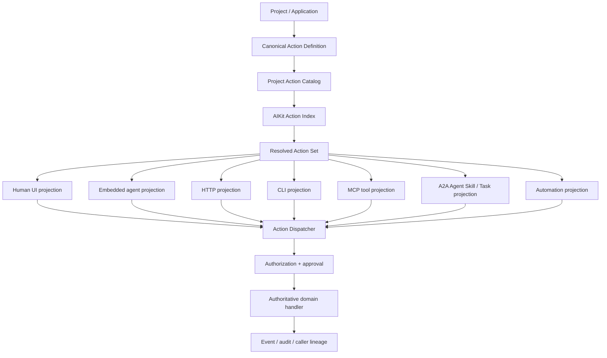
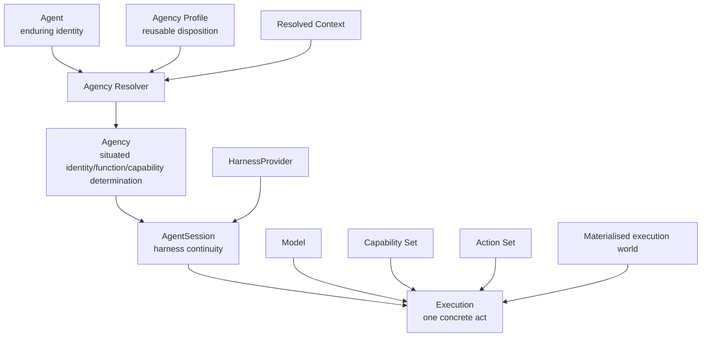
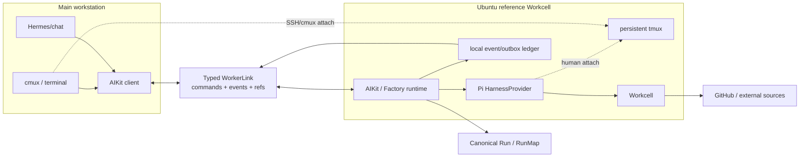
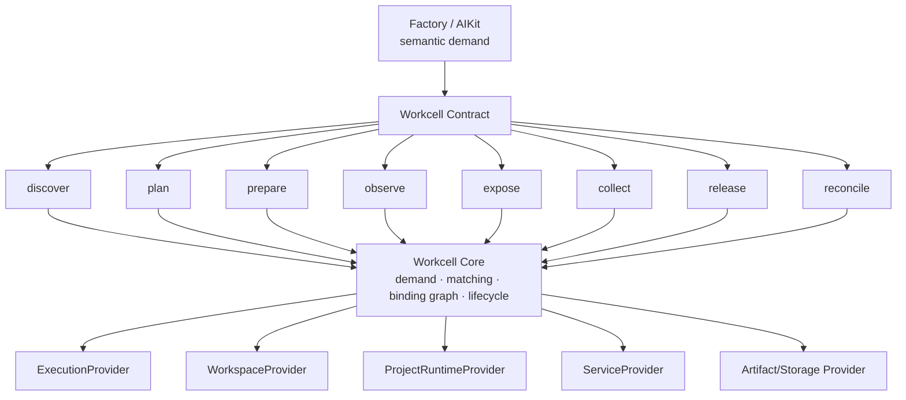
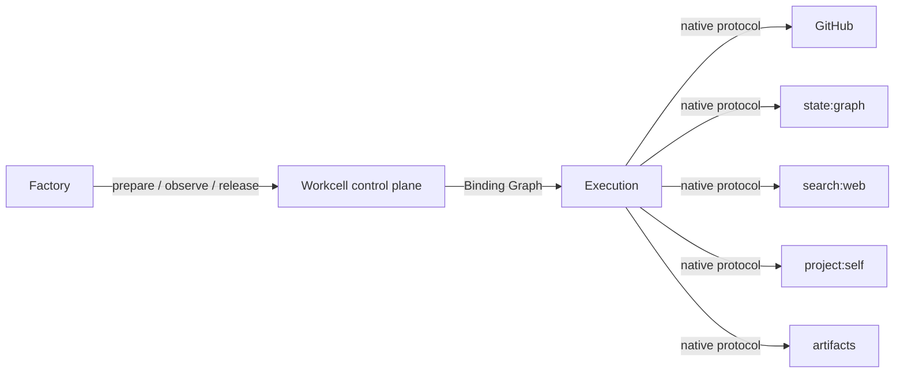
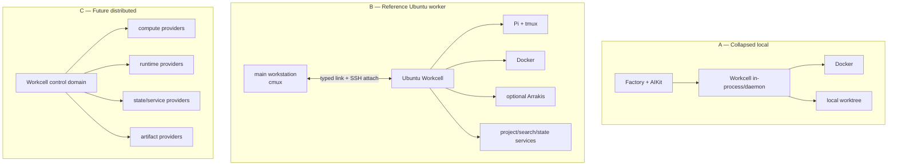
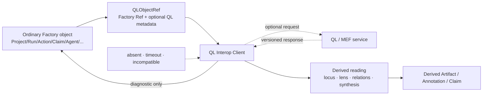
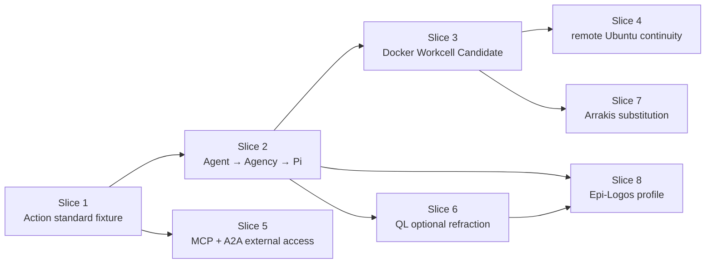

# WAYFINDER MAP — Agentic Execution Body

**Territories:** `E · F · H · I`  
**Status:** repo-entry architecture / development-map candidate  
**Governing corpus:** Constitutional Index → Architecture Spec → Primitive Relations → Workcell Module Spec → Deep QL Integration Foundations  
**Primary joined question:**

> How does a persistent actor receive a coherent semantic world, invoke meaningful domain operations, execute through changing models/harnesses/material environments, and remain compatible with progressively deeper QL operation without ordinary software becoming dependent on unfinished QL research?

---

# 0. Constitutional determination

The answer is one composed execution body:

```text
PROJECT
  │
  ├── canonical domain Actions
  ├── Agents / Agency profiles
  ├── context sources
  └── Run / Candidate purpose
  │
  ▼
AIKIT
context-scoped semantic resolver
  │
  ├── resolved Agency
  ├── Action Set
  ├── Capability Set
  ├── information horizon
  ├── model / harness candidates
  └── material affordance demand
  │
  ▼
EXECUTION
Agent identity + Agency + Context
+ AgentSession + Model + Harness
+ Capabilities
  │
  ├───────────────────────────────┐
  │                               │
  ▼                               ▼
ACTION DISPATCH                 WORKCELL
domain operation               materialisation
  │                               │
  │                               ├── workspace
  │                               ├── execution provider
  │                               ├── project runtime
  │                               ├── service bindings
  │                               └── candidate endpoint
  │                               │
  └───────────────┬───────────────┘
                  ▼
           APPLICATION / WORLD
                  │
             events/evidence
                  │
                  ▼
                RUN
                  │
                  ▼
        optional QL / MEF seam
       derived readings only
```

Four identity/materiality distinctions are load-bearing:

```text
Action        ≠ transport/projection
Agent         ≠ model/harness/session
Candidate     ≠ environment/provider binding
Factory object ≠ QL reading of that object
```

The Constitutional Index makes those distinctions governing: Agent identity persists through changing execution composition; Actions remain project-owned semantics indexed by AIKit; Workcell details remain beneath semantic Context; and QL may deepen without becoming required for ordinary operation. 
The Primitive Relations document gives the lifetime rule which this map makes executable: a Run can outlive SessionSpaces, AgentSessions, environments, hosts and models; Agent identity is enduring while Agency is its local scoped determination.

The Workcell specification makes the corresponding material rule: Factory/AIKit expresses what world is semantically required; Workcell resolves that demand into current providers and bindings, and those provider details must not become Project, Run or Candidate identity.

The QL foundations complete the boundary: QL is bimba; software is pratibimba; the executable QL kernel is a versioned formalisation rather than the canon itself; and its absence must leave Factory software operationally sufficient.

---

# 1. Ground determination

## 1.1 Already constitutional

The following are **not open design questions** in this map.

| Determination | Status |
|---|---|
| `Action` is a first-class project/application domain operation | constitutional |
| `Capability` is broader than `Action` | constitutional |
| Actions belong to their Project/Application | constitutional |
| AIKit indexes/resolves Actions; it does not own their domain meaning | constitutional |
| Human and agent surfaces should converge on one operation | constitutional |
| Agent identity survives model, harness, host and local capability changes | constitutional |
| Agency is the local/scoped determination between Agent and Execution | constitutional |
| Epi-Logos six-agent constellation is profile-specific | constitutional |
| Pi is the preferred first HarnessProvider | current design |
| SessionSpace and AgentSession are different primitives | constitutional |
| Run is more durable than either | constitutional |
| Hermes is a front-door/orchestration surface, not Factory identity | current design |
| cmux is the rich local observation surface; tmux is persistent remote substrate | current design |
| Workcell vocabulary remains module-local | constitutional |
| Workcell receives semantic demands, not provider prescriptions | constitutional |
| Docker is the first general provider path | current design |
| Arrakis is an optional stronger isolation provider | current design, source-dependent |
| Candidate semantic identity survives rematerialisation | constitutional |
| QL integration is compatibility, not conformance/certification | constitutional |
| QL service may return readings but may not own Factory objects | constitutional |
| ordinary Factory execution must survive QL absence | constitutional |
| experimental native/conjugate/nested loops remain pluggable research | constitutional |

The source corpus explicitly calls the Action schema/catalog, QL service seam, full Workcell contract and Agent/Agency/Harness surface active development fronts while keeping specific QL-native Pi loops and unresolved harmonic runtime operators outside the blocking implementation chain.

## 1.2 Current upstream reality

The external precedents support the proposed seams rather than requiring local imitation.

Builder.io's current Agent-Native project demonstrates the useful core precedent: define one typed Action and project it across UI, agent, HTTP, MCP, A2A and CLI. The Factory adopts the operation/projection principle but not that framework as its ontology.

Pi exposes a real headless RPC mode using strict JSONL over stdin/stdout, while its session files are persistent JSONL trees with `id`/`parentId` branching. This gives the first HarnessProvider a real integration seam rather than requiring terminal scraping.

cmux explicitly supports remote SSH workspaces and attachment to remote tmux sessions; tmux itself preserves programs across detach/reattach. These are therefore valid SessionSpace adapters, not metaphors for persistence.

Hermes currently exposes Telegram interaction, scheduling, profiles which can package skills and MCP connections, and persistent agent-facing surfaces. That makes it a useful front door while giving no architectural reason to make Hermes state authoritative for Factory Runs or Agents.

Docker Compose provides actual services/networks/volumes and service discovery; Arrakis exposes a REST API, Python SDK and MCP server over MicroVM sandboxes with snapshot/restore. Both can therefore sit behind provider interfaces without being reproduced inside Workcell Core. 
The current MCP specification is `2026-07-28` and has a stateless core rather than protocol sessions. A2A v1 is an agent-interoperability protocol organised around agents, Agent Skills, Messages and Tasks. Therefore MCP is the direct Action-as-tool projection; A2A is an agent-to-agent wrapper over selected Actions, not a second tool protocol. 
---

# 2. Intent artifacts

The P0 intent set for this territory consists of six directly judgeable experiences.

## 2.1 Human experiences

**HUX-E1 — One operation, many surfaces**

A person changes a domain object in the UI. An embedded agent can perform the same operation. An external MCP caller can perform the same operation. All three executions carry the same Action identity, validate against the same input contract, execute the same authoritative domain seam and produce comparable audit events.

**HUX-I1 — Start and leave**

The human can initiate:

```text
> improve the identity matrix interaction
```

observe that a named Agent/Agency has taken ownership, close the local workspace, return later from cmux/Hermes/terminal, and see the same Run rather than reconstructing state from a chat transcript.

**HUX-I2 — Intervene remotely**

```text
phone / Hermes
     │
     ▼
"what is Nara working on?"
     │
     ▼
Run status + Candidate + current Decision
     │
     ▼
"return this to design; mobile layout is wrong"
```

The intervention changes canonical Run state; it does not depend on manipulating the worker's terminal.

**HUX-F1 — Candidate without infrastructure vocabulary**

The user sees:

```text
Candidate B
Running · Open · Tests 74/74
```

not:

```text
arrakis-9842
10.33.0.18:4173
bridge factory_b
```

**HUX-F2 — Same Candidate, different provider**

A Candidate materialised with Docker can later be rematerialised under Arrakis without becoming a different Candidate solely because the provider changed.

**HUX-H1 — QL adds depth without fragility**

A QL-aware view can show:

```text
L2 refraction available
L3/L3′ process reading available
kernel 0.x.y
```

while stopping the QL service leaves Action dispatch, Run progression, agent execution and Candidate runtime intact.

---

# 3. Actor / Action architecture



The invariant is:

> **Projection adapters translate interaction shape; they do not implement domain behaviour.**

---

# 4. Canonical Action contract

## 4.1 Identity

Canonical Action identity is a composite semantic identity:

```ts
type ActionRef = {
  project: ProjectRef
  key: string        // stable project-local key, e.g. "work_item.update"
  major: number      // breaking-contract generation
}
```

Exact external Ref string encoding remains a shared Factory concern; Action semantics must not depend on it.

Transport names are derived mappings:

```text
ActionRef                 action key
UI                         work_item.update
embedded agent             work_item.update
HTTP                       PATCH /...           projection only
CLI                        work-item update     projection only
MCP                         work_item_update     projection only
A2A                         skill/work-item     projection only
```

A route, CLI command or MCP tool name is never the Action identity.

## 4.2 Manifest

```ts
type ActionManifest = {
  schema_version: 1
  ref: ActionRef
  title: string
  description: string

  input_schema: JsonSchema
  output_schema?: JsonSchema

  effects: {
    class:
      | "read"
      | "local_write"
      | "external_write"
      | "destructive"

    reversibility:
      | "reversible"
      | "compensatable"
      | "irreversible"

    idempotency:
      | "idempotent"
      | "idempotency_key"
      | "non_idempotent"

    concurrency:
      | "parallel_safe"
      | "serialized"
  }

  authorization_policy: PolicyRef

  approval:
    | { mode: "none" }
    | { mode: "policy"; policy: PolicyRef }

  exposure: {
    ui?: ProjectionPolicy
    embedded_agent?: ProjectionPolicy
    http?: ProjectionPolicy
    cli?: ProjectionPolicy
    mcp?: ProjectionPolicy
    a2a?: ProjectionPolicy
    automation?: ProjectionPolicy
  }

  implementation: DomainOperationRef

  tags?: string[]
}
```

Non-read Actions **must explicitly declare** their approval mode; omission is invalid. `authorization` and `approval` remain different: authority answers *may this principal perform it?*; approval answers *must a human intervene before this otherwise-authorised invocation becomes effective?*

## 4.3 Invocation

```ts
type ActionInvocation = {
  id: InvocationRef
  action: ActionRef

  actor?: ActorRef
  agency?: AgencyRef

  input: JsonValue

  lineage: {
    trace: TraceRef
    parent_invocation?: InvocationRef

    surface:
      | "ui"
      | "embedded_agent"
      | "http"
      | "cli"
      | "mcp"
      | "a2a"
      | "automation"

    run?: RunRef
    agent_session?: AgentSessionRef
    session_space?: SessionSpaceRef

    external?: {
      protocol?: string
      peer?: string
      correlation_id?: string
      provenance: "verified" | "asserted" | "unknown"
    }

    automation?: Ref
  }

  idempotency_key?: string
}
```

Every projection normalises into this envelope before authorization or execution.

---

# 5. One canonical operation — cross-surface proof

The reference Agent-Native fixture is a deliberately small project:

```text
fixtures/agent-native-workboard/
```

Canonical operation:

```text
ActionRef:
  project = fixture-workboard
  key     = work_item.update
  major   = 1
```

Input:

```json
{
  "workItem": "WI-42",
  "patch": {
    "status": "in_review",
    "assignee": "nara"
  }
}
```

Authoritative implementation:

```text
WorkItemService.update(...)
```

No UI callback, agent tool, HTTP route, MCP tool or A2A handler contains separate update logic.

### Human

```text
Work Item WI-42

Status      [ In Review ▼ ]
Assignee    [ Nara      ▼ ]

[ Save ]
```

`Save` invokes `work_item.update@1`.

### Embedded agent

```text
Available Action:
  work_item.update@1

Use when an existing work item must be mutated.
```

The tool adapter invokes the same dispatcher.

### MCP

```text
tools/list
  → work_item_update

tools/call
  name: work_item_update
  arguments: { ... }
```

The MCP adapter preserves the canonical `ActionRef` as metadata and maps the call into `ActionInvocation`. MCP's current stateless core means Factory `AgentSession` must never be inferred from MCP protocol state.

### A2A

The Workboard project agent advertises a selected **Agent Skill** such as:

```text
id: work-item-management
description: update and inspect Workboard work items
```

A2A Message structured data requests `work_item.update@1`; the project agent validates the requested operation, obtains its own Agency/permissions, and dispatches the same Action. A2A Task identity remains protocol task identity and does not replace Factory Run, ActionInvocation or AgentSession identity. A2A explicitly supports structured Parts, Agent Skills and durable Tasks.

---

# 6. E — Agent-Native Standard & Action Architecture

## E.01 — Canonical Action Definition

**id:** `E.01`  
**purpose:** establish stable Action identity, typed contracts, effects, policy and one authoritative implementation seam.  
**owner/system:** Project/Application domain layer.  
**inputs:** domain operation; ProjectRef; JSON Schemas; side-effect semantics; policy refs.  
**outputs:** `ActionManifest`; `ActionRef`; `DomainOperationRef`.  
**dependencies:** core `Ref`, Project identity, policy abstraction.  
**interfaces:** `ActionProvider.describe()`, Action Catalog ingestion.  
**source basis:** Constitutional Index / Deep QL Agent-Native determination; Builder Agent-Native precedent for single Action/multi-surface form. **acceptance:** same manifest drives at least UI + embedded agent + one external projection; no transport identifier appears in Action identity.  
**test artifacts:** manifest golden files; schema compatibility tests; effects validation fixture.  
**decisions already resolved:** composite identity `(ProjectRef,key,major)`; explicit effects; explicit approval declaration; single implementation seam.  
**prohibited hidden decisions:** inventing Action IDs from HTTP paths; generating a second agent-only domain implementation; treating Action as synonymous with Capability.

## E.02 — Project Action Catalog

**id:** `E.02`  
**purpose:** expose the authoritative discoverable inventory of Project Actions.  
**owner/system:** Project/Application.  
**inputs:** native ActionProviders, verified adapters, manifest revisions.  
**outputs:** versioned Catalog snapshot + provenance.  
**dependencies:** `E.01`, SourceIntegration records.  
**interfaces:** `ActionProvider.list()`, `ActionProvider.get(ref)`.  
**source basis:** corpus requires Action Catalog and states AIKit indexes rather than reimplements native catalogs.
**acceptance:** Catalog is discoverable without scraping UI; every entry resolves to real source/implementation; stale entries detectable.  
**test artifacts:** catalog fixture; duplicate-ref rejection; stale-provider fixture.  
**decisions already resolved:** Project is semantic owner; catalogs can aggregate several project-local providers.  
**prohibited hidden decisions:** AIKit becoming the master Action authoring database; silently synthesising executable Actions from documentation alone.

## E.03 — AIKit Action Index & Action Set Resolution

**id:** `E.03`  
**purpose:** index Action catalogs and resolve only the Actions relevant and permitted in the current Context.  
**owner/system:** AIKit.  
**inputs:** Catalog snapshots; Project/Profile/Scope; Agent/Agency; Run/focus; permissions; availability; learned relevance.  
**outputs:** `ActionSetSnapshot`.  
**dependencies:** `E.02`, Agency resolution `I.02`, AIKit context resolver.  
**interfaces:** `index_catalog`, `resolve_action_set`, `explain_resolution`.  
**source basis:** AIKit is explicitly the context-scoped Action/resource index rather than the domain owner.
**acceptance:** same Project catalog yields different Action Sets for different Agencies/permissions without altering the catalog.  
**test artifacts:** ActionSet fixtures for human, generic coding agent, Epi-Logos agent; permission omission tests.  
**decisions already resolved:** availability/discoverability/invocability are separate; ActionSet is materialised resolution, not new canonical semantics.  
**prohibited hidden decisions:** using QL position as a hard allow/deny taxonomy; treating frecency as authority.

## E.04 — Action Dispatcher, Authorization, Approval & Lineage

**id:** `E.04`  
**purpose:** provide the one trusted invocation choke point for all projections.  
**owner/system:** Project runtime / Factory Action runtime library.  
**inputs:** `ActionInvocation`; manifest; caller principal; policy state.  
**outputs:** result/error/pending approval + Event records.  
**dependencies:** `E.01`, Event/Trace substrate, HumanRequest/Decision for approval.  
**interfaces:** `dispatch(invocation)`.  
**source basis:** corpus requires permissions, caller lineage, approval and audit; consequential Action approval uses existing human-authority machinery.
**acceptance:** no projection can bypass validation/authorization/approval/audit; lineage survives nested Action calls.  
**test artifacts:** privilege matrix; caller-lineage chain; approval fail-closed fixture; idempotency tests.  
**decisions already resolved:** authorization ≠ approval; surface visibility ≠ invocability; external caller identity can be marked unverified rather than trusted implicitly.  
**prohibited hidden decisions:** “agent means trusted”; silently treating automation as pre-approved; performing destructive effects before approval resolves.

## E.05 — Projection Adapters

**id:** `E.05`  
**purpose:** translate one Action into selected UI, embedded-agent, HTTP, CLI, MCP, A2A and automation affordances.  
**owner/system:** projection layer.  
**inputs:** manifest + projection policy.  
**outputs:** transport-specific descriptions/adapters.  
**dependencies:** `E.01`, `E.04`.  
**interfaces:** `ActionProjection` providers.  
**source basis:** constitutional multi-surface standard; Builder precedent validates the shape. **acceptance:** parity tests prove identical validation, handler invocation and result semantics across enabled surfaces.  
**test artifacts:** cross-surface golden invocation suite.  
**decisions already resolved:** projections are individually opt-in; not every Action appears everywhere.  
**prohibited hidden decisions:** adding transport-specific business rules; assuming HTTP semantics define domain semantics.

## E.05a — MCP Projection

**id:** `E.05a`  
**purpose:** expose selected Actions as MCP tools.  
**owner/system:** Factory MCP projection adapter.  
**inputs:** Action manifest / ActionSet.  
**outputs:** MCP tool descriptors and tool-call dispatch.  
**dependencies:** `E.04`; current MCP protocol SourceIntegration.  
**interfaces:** MCP `tools/list`, `tools/call`, optional current Task/MRTR extensions where available.  
**source basis:** MCP 2026-07-28 is the current authoritative stateless specification.
**acceptance:** MCP tool invocation produces the same `InvocationRef`, effect and audit shape as UI/agent invocation; no Factory session semantics are derived from MCP.  
**test artifacts:** MCP conformance fixture; approval-pending fixture; stateless reconnect fixture.  
**decisions already resolved:** MCP = tool projection; protocol version is pinned by SourceIntegration.  
**prohibited hidden decisions:** treating MCP connections as AgentSessions; allowing MCP client metadata to become trusted Factory Agent identity automatically.

## E.05b — A2A Projection

**id:** `E.05b`  
**purpose:** allow external agents to request selected Project operations through a real project/application agent boundary.  
**owner/system:** Project A2A agent adapter.  
**inputs:** approved Action subset; Agent Card / Skill configuration; incoming Message/Task.  
**outputs:** A2A response/Task backed by audited ActionInvocation(s).  
**dependencies:** `I.01–I.04`, `E.04`, A2A SourceIntegration.  
**interfaces:** A2A Agent Card / Skills / Messages / Tasks.  
**source basis:** A2A v1 is agent-to-agent interoperability, with Agent Skills and Tasks rather than an MCP-style tool registry.
**acceptance:** A2A Task identity and Factory Run/Action identities remain distinct but linked; caller lineage records remote agent/protocol provenance.  
**test artifacts:** Agent Card fixture; structured-message Action invocation; async Task fixture; permission denial.  
**decisions already resolved:** selected Actions are surfaced as an A2A agent capability/skill, not blindly advertised as protocol tools.  
**prohibited hidden decisions:** one A2A Task = one Factory Run; remote A2A agent = local canonical Agent.

## E.06 — Legacy Action Recovery

**id:** `E.06`  
**purpose:** discover candidate domain operations in non-Agent-Native projects without fabricating semantics.  
**owner/system:** Project Bootstrap / analysis agent.  
**inputs:** source; OpenAPI/routes; CLI; MCP tools; service methods; UI mutations; docs; tests.  
**outputs:** `ProposedAction` Claims + Evidence.  
**dependencies:** Project Map/source integration; Claim/Evidence core.  
**interfaces:** bootstrap discovery provider.  
**source basis:** the Constitutional Index explicitly says recovered Actions remain Claims until verified.
**acceptance:** recovered Action cannot enter executable catalog without verification against real source/behaviour.  
**test artifacts:** legacy REST app; CLI app; UI-only app; intentionally duplicated business-logic fixture.  
**decisions already resolved:** recovery is evidence-led; where a strong native operation exists, adapt it instead of rewriting it.  
**prohibited hidden decisions:** generating fake “agent tools” simply to satisfy catalog coverage.

## E.07 — Agent Resource Discovery

**id:** `E.07`  
**purpose:** let project-local instructions, Agencies, context sources, MCP connections and Action Sets participate in the same resolved actor world.  
**owner/system:** AIKit resource index.  
**inputs:** project resources/providers.  
**outputs:** resolved resource view attached to Context.  
**dependencies:** AIKit Context, `E.03`, `I.02`.  
**interfaces:** generic `ResourceProvider`/resource index seam to be harmonised with existing AIKit code.  
**source basis:** Deep QL foundations explicitly place agent resources under AIKit's context-scoped resolution.
**acceptance:** agent gets a coherent compact declaration of relevant Actions/resources rather than an indiscriminate project dump.  
**test artifacts:** project/profile/session scope fixtures.  
**decisions already resolved:** agent resources are Project surfaces; context inclusion remains progressive.  
**prohibited hidden decisions:** loading every available resource into every prompt.

## E.08 — Reference Agent-Native Project

**id:** `E.08`  
**purpose:** provide the cross-surface golden fixture for the standard.  
**owner/system:** Factory fixtures/test workspace.  
**inputs:** `work_item.update`, read and destructive companion Actions.  
**outputs:** UI, embedded agent, MCP, HTTP/CLI and A2A demonstrations.  
**dependencies:** `E.01–E.07`.  
**interfaces:** all Action projections.  
**source basis:** test requirement from prompt + Agent-Native constitutional standard.  
**acceptance:** one domain state transition is byte/semantic-equivalent regardless of originating surface, modulo caller lineage.  
**test artifacts:** fixture itself is the artifact.  
**decisions already resolved:** simple Workboard domain; independent of QL.  
**prohibited hidden decisions:** making the fixture depend on Factory-internal privilege or Epi-Logos semantics.

---

# 7. Agent → Agency → Execution architecture



An Execution can change Model without changing Agent.  
A new AgentSession can recover the same Run without pretending conversational identity survived.  
A new Agency can represent a genuinely different local stance/function without creating a new canonical Agent.

This implements the Primitive Relations distinction directly.

---

# 8. I — Agent / Agency / Harness & Personal Orchestration

## I.01 — Agent Identity

**id:** `I.01`  
**purpose:** give actors enduring identity independent of execution composition.  
**owner/system:** Project for project-local Agents; reusable/global Agent registry where appropriate.  
**inputs:** identity artifact; stable AgentRef; project/profile associations.  
**outputs:** `AgentDefinition`.  
**dependencies:** Ref, Artifact, Project.  
**interfaces:** Agent registry/query.  
**source basis:** Agent explicitly persists beyond model/harness/session.
**acceptance:** model/harness/host substitution does not change AgentRef.  
**test artifacts:** identity-survival matrix.  
**decisions already resolved:** six Epi agents are profile-specific identities, not Factory positions.  
**prohibited hidden decisions:** embedding provider/model name into Agent ID.

## I.02 — Agency Resolution

**id:** `I.02`  
**purpose:** determine the local identity/function/capability disposition through which an Agent acts here.  
**owner/system:** AIKit + Factory semantic resolver.  
**inputs:** AgentRef; Project/Profile/Scope; Run/focus; role/function; capability/action availability; optional identity profile.  
**outputs:** `AgencySnapshot`.  
**dependencies:** `I.01`, `E.03`, AIKit Context.  
**interfaces:** `resolve_agency(request)`, `explain_agency(ref)`.  
**source basis:** Agency is the middle layer between persistent identity and concrete execution.
**acceptance:** equivalent semantic inputs resolve deterministically absent explicitly non-deterministic policy; resolution explains included capabilities/actions.  
**test artifacts:** generic coder, investigator, UI-experience and Epi-Logos Agency fixtures.  
**decisions already resolved:** Agency may change while Agent persists; capability composition is part of Agency but does not exhaust it.  
**prohibited hidden decisions:** creating a new Agent per capability combination.

## I.03 — Optional Sixfold Identity Extension

**id:** `I.03`  
**purpose:** let richer profiles carry versioned sixfold identity forms without generic Factory dependence.  
**owner/system:** Project profile / QLForm registry.  
**inputs:** optional `QLFormRef` + identity values/artifacts.  
**outputs:** opaque/typed identity-extension attachment to Agency.  
**dependencies:** `I.02`; H types only for explicit QL forms.  
**interfaces:** Agency extension field.  
**source basis:** Primitive Relations and Constitutional Index reserve this seam for richer Epi-Logos identity while keeping generic Agency ordinary.
**acceptance:** deleting/omitting extension still yields valid generic Agency.  
**test artifacts:** generic vs Epi profile parity fixture.  
**decisions already resolved:** extension is optional and profile-specific.  
**prohibited hidden decisions:** universalising Anuttara→Epii as generic Factory role definitions.

## I.04 — HarnessProvider Contract

**id:** `I.04`  
**purpose:** separate Agent/Run semantics from conversational/runtime harness implementation.  
**owner/system:** Factory runtime.  
**inputs:** `AgentSessionSpec`, context refs, execution input.  
**outputs:** opaque provider session handle; execution handle; typed event stream.  
**dependencies:** Agent/Agency, Event/Trace.  
**interfaces:**

```text
capabilities()
start(spec)
resume(session,input)
stream(execution)
interrupt(execution)
stop(session)
```

Optional capability:

```text
fork(session, point)
```

**source basis:** architecture's `HarnessProvider` is explicitly start/resume/stream/stop; this map adds interrupt and optional fork as capabilities rather than universal assumptions.
**acceptance:** mock harness and Pi satisfy same contract; Run/Action/Claim types contain no Pi-specific fields.  
**test artifacts:** Harness contract test suite.  
**decisions already resolved:** provider session handle is opaque; optional features negotiated.  
**prohibited hidden decisions:** assuming every harness has branching, resumability, tools or one fixed model.

## I.05 — Pi HarnessProvider

**id:** `I.05`  
**purpose:** production-first implementation of `I.04`.  
**owner/system:** Factory Pi adapter.  
**inputs:** AgentSessionSpec; resolved context; Pi installation/source pin.  
**outputs:** Pi provider session handle; Pi execution/event mapping.  
**dependencies:** actual Pi RPC upstream; existing SSSF adapter if available.  
**interfaces:** initial integration via Pi RPC strict JSONL; later extension/SDK optional.  
**source basis:** corpus specifies Pi first and asks reuse of existing SSSF adapter where proven; Pi's actual RPC and JSONL session seams are documented upstream. **acceptance:** start/resume/stream/interrupt; tool/lifecycle events mapped to Factory events; Pi session corruption never erases Run state.  
**test artifacts:** RPC golden transcript; crash/restart; model switch; branching fixture.  
**decisions already resolved:** Level 1/2 initial seam = subprocess/RPC; Factory identity remains outside Pi session.  
**prohibited hidden decisions:** importing Pi's own `AgentSession` type as the Factory ontology; parsing terminal text when RPC is available.

## I.06 — AgentSession Modes

**id:** `I.06`  
**purpose:** represent fresh, resumed, conjugate, nested and alternate execution contexts without conflating them.  
**owner/system:** Factory runtime.  
**inputs:** Agent/Agency/Run refs; HarnessProvider; relation to existing AgentSession.  
**outputs:** Factory `AgentSession`.  
**dependencies:** `I.04`.  
**interfaces:**

```text
relation =
  primary
  fresh
  resumed
  conjugate_of:<session>
  nested_under:<session>
  alternate_of:<session>
```

**source basis:** corpus explicitly requires fresh/conjugate/nested/alternate-loop compatibility while keeping experimental semantics pluggable.
**acceptance:** conjugate session can be created on a harness with no native branching support.  
**test artifacts:** session topology fixture.  
**decisions already resolved:** a conjugate session is **fresh by default**, receiving explicit canonical refs but not the sibling's raw transcript; harness-native branching may be used for ordinary branching but does not define epistemic conjugacy.  
**prohibited hidden decisions:** equating Pi branch with QL conjugation.

## I.07 — SessionSpace

**id:** `I.07`  
**purpose:** project persistent Runs and active AgentSessions into human-operable workspaces.  
**owner/system:** AIKit session-space adapters.  
**inputs:** Project/Run/AgentSession/Candidate refs.  
**outputs:** workspace layout/projection references.  
**dependencies:** cmux/tmux/terminal adapters.  
**interfaces:** create/reconcile/open/attach; never canonical state mutation by pane scraping.  
**source basis:** SessionSpace views/controls Runs but does not own them. cmux and tmux are concrete fitting adapters. **acceptance:** destroying local cmux layout leaves Run intact; workspace can be reconstructed from canonical state.  
**test artifacts:** layout reconstruction fixture; no-cmux fallback.  
**decisions already resolved:** cmux preferred rich local surface; tmux reference remote persistence; plain terminal remains valid.  
**prohibited hidden decisions:** pane identity becoming AgentSession identity.

## I.08 — Remote Worker Link & Event Continuity

**id:** `I.08`  
**purpose:** allow main and worker hosts to exchange typed commands/events without shared database pages or terminal scraping.  
**owner/system:** Factory/AIKit host link.  
**inputs:** typed event/outbox records; control requests; artifact refs.  
**outputs:** acknowledged/replayed event stream and remote commands.  
**dependencies:** per-host durable state; Host refs; network transport provider.  
**interfaces:** logical `WorkerLink`; first transport may be authenticated SSH/stdio or another repo-approved transport.  
**source basis:** architecture already fixes per-host SQLite/raw ledgers and typed sync rather than network-mounted SQLite.
**acceptance:** disconnect, continue worker execution, reconnect and replay without duplicate canonical events.  
**test artifacts:** network-partition/replay fixture; event sequence-gap fixture.  
**decisions already resolved:** typed sync is semantic contract; transport is replaceable.  
**prohibited hidden decisions:** reading tmux screen output as canonical event stream; shared SQLite filesystem.

## I.09 — Hermes Front Door

**id:** `I.09`  
**purpose:** let a human initiate, inspect and intervene in Factory work through persistent messaging.  
**owner/system:** Hermes projection adapter.  
**inputs:** user message; Factory project/run operations.  
**outputs:** human-readable responses + canonical Factory commands.  
**dependencies:** Hermes SourceIntegration; Factory orchestration API or MCP surface.  
**interfaces:** preferred seam: Factory exposes a narrow MCP/orchestration surface which Hermes can consume; CLI adapter remains fallback.  
**source basis:** Hermes currently supports Telegram and distributable profiles including MCP connections.
**acceptance:** `status`, `start/resume`, `intervene`, `open candidate`, `answer HumanRequest` can occur without Hermes owning the Run.  
**test artifacts:** fake Hermes client / MCP invocation fixture; lost-Hermes-state recovery.  
**decisions already resolved:** Hermes is front door, not Agent identity or canonical Run store.  
**prohibited hidden decisions:** importing Hermes memory/profile state as Factory Project Canon automatically.

## I.10 — Recovery & Identity Survival

**id:** `I.10`  
**purpose:** prove durable actor meaning survives transient execution loss.  
**owner/system:** Factory runtime.  
**inputs:** canonical Run/Agent/Agency/Context refs; surviving session handles if any.  
**outputs:** resumed or reconstructed AgentSession with continuity classification.  
**dependencies:** `I.01–I.08`.  
**interfaces:** `recover_session`, `reconstruct_execution_context`.  
**source basis:** corpus explicitly requires Runs to outlive AgentSessions, hosts and models.
**acceptance:** kill Pi → new Pi session can re-enter same Run; change model → Agent identity unchanged; move host → same semantic Agency can execute.  
**test artifacts:** full identity-survival matrix.  
**decisions already resolved:** recovery distinguishes `resumed` from `reconstructed`; it never lies that lost conversational state survived.  
**prohibited hidden decisions:** storing the only copy of a consequential Decision or Run frontier in harness history.

---

# 9. SessionSpace / remote continuity



cmux/tmux are observation and persistence aids.  
`WorkerLink + Run state` provides semantic continuity.

---

# 10. Workcell external architecture



The Workcell contract uses **semantic requirements**:

```yaml
required:
  - writable_project_workspace
  - shell
  - git
  - internet
  - connection: project:self

preferred:
  - strong_isolation
  - snapshot_restore
  - browser_surface

optional:
  - gpu
```

not:

```yaml
provider: arrakis
bridge: factory-net-2
ip: 10.4.0.18
path: /home/me/projects/foo
```

---

# 11. Control plane / data plane



The Workcell resolves reachability; it does not proxy every packet.

---

# 12. F — Workcell Runtime

## F.01 — Workcell External Contract

**id:** `F.01`  
**purpose:** provide a small provider-neutral materialisation API.  
**owner/system:** Workcell Core.  
**inputs:** semantic execution/materialisation demand.  
**outputs:** offers, plans, materialised-world refs, observations, bindings.  
**dependencies:** Host, Environment/Execution refs, events.  
**interfaces:** `discover / plan / prepare / observe / expose / collect / release / reconcile`.  
**source basis:** directly specified by Workcell module.
**acceptance:** no higher caller must name Docker/Arrakis/network/path to request ordinary execution.  
**test artifacts:** API/trait contract fixtures.  
**decisions already resolved:** this replaces older broad `EnvironmentProvider` as the stronger subsystem boundary.  
**prohibited hidden decisions:** Workcell reimplementing Factory Context, Agency, Candidate or Run.

## F.02 — Execution / Materialisation Demand

**id:** `F.02`  
**purpose:** translate semantic Context into material requirements without provider leakage.  
**owner/system:** Factory → Workcell boundary.  
**inputs:** Project/Run/Candidate/Execution refs; affordances; connectivity; workspace; persistence; exposure; isolation; resources.  
**outputs:** `MaterialisationDemand`.  
**dependencies:** `F.01`; AIKit resolution.  
**interfaces:** demand schema.  
**source basis:** Workcell spec's required/preferred/optional demand model.
**acceptance:** same demand is valid against Docker and Arrakis offers.  
**test artifacts:** portable-demand fixture.  
**decisions already resolved:** `required`, `preferred`, `optional` are explicit.  
**prohibited hidden decisions:** provider name masquerading as an affordance.

## F.03 — Provider Port Algebra

**id:** `F.03`  
**purpose:** isolate material technologies behind narrow provider families.  
**owner/system:** Workcell Core.  
**inputs:** portion of plan/demand.  
**outputs:** provider-local resource refs and generic Bindings.  
**dependencies:** `F.01–F.02`.  
**interfaces:** `ExecutionProvider`, `WorkspaceProvider`, `ProjectRuntimeProvider`, `ServiceProvider`, `Artifact/StorageProvider`; secret provider only where needed.  
**source basis:** Workcell module explicitly proposes this ports-and-adapters division.
**acceptance:** provider adapter can be removed without recompiling semantic Factory types except registration/config.  
**test artifacts:** common provider-contract suite.  
**decisions already resolved:** provider APIs remain module-local.  
**prohibited hidden decisions:** exporting Docker container IDs as Candidate IDs.

## F.04 — Workspace Provider

**id:** `F.04`  
**purpose:** resolve source/workspace semantics into a writable or read-only workspace.  
**owner/system:** Workcell.  
**inputs:** Project source refs; revision; workspace requirements.  
**outputs:** `workspace:<logical-ref>` Binding.  
**dependencies:** Git/source integration.  
**interfaces:** prepare/observe/release.  
**source basis:** Workcell first implementation explicitly calls for Git worktree workspace provider.
**acceptance:** Git worktree and ordinary-directory fixtures satisfy same logical binding contract.  
**test artifacts:** dirty-tree, deleted-worktree, rematerialisation tests.  
**decisions already resolved:** physical path is provider state/provenance only.  
**prohibited hidden decisions:** encoding absolute path in Project identity.

## F.05 — Docker Providers

**id:** `F.05`  
**purpose:** provide the first broadly available isolated execution and project-runtime implementation.  
**owner/system:** Workcell Docker adapters.  
**inputs:** generic execution/runtime plans.  
**outputs:** generic Binding Graph backed by Docker resources.  
**dependencies:** Docker SourceIntegration.  
**interfaces:** Docker Engine API for execution/resource control; Compose-facing adapter for project stacks.  
**source basis:** Docker Compose natively manages services/networks/volumes and service-name discovery.
**acceptance:** no Docker bridge/container/port identity escapes generic binding interfaces; restart/inspect/cleanup tests pass.  
**test artifacts:** provider suite; networking fixture; project-stack fixture.  
**decisions already resolved:** Docker is first provider path, not universal isolation ontology.  
**prohibited hidden decisions:** direct Docker manipulation from Agent/Project code.

## F.06 — Arrakis ExecutionProvider

**id:** `F.06`  
**purpose:** supply stronger MicroVM/snapshot execution where requirements justify it.  
**owner/system:** optional Workcell provider adapter.  
**inputs:** generic isolation/snapshot execution plan.  
**outputs:** generic environment/endpoints/bindings backed by Arrakis.  
**dependencies:** pinned Arrakis SourceIntegration; Linux/KVM-compatible deployment; project licensing/operational review.  
**interfaces:** upstream REST API preferred for language-neutral integration; do not reimplement sandbox management.  
**source basis:** upstream exposes REST, Python SDK and MCP and provides MicroVM snapshot/restore semantics.
**acceptance:** same Candidate fixture passes under Docker and Arrakis when its requirements allow both; snapshots remain provider capability, not Candidate semantics.  
**test artifacts:** provider substitution; snapshot/restore; unavailable-KVM fixture.  
**decisions already resolved:** Arrakis optional; unavailable Arrakis removes the offer rather than corrupting higher state.  
**prohibited hidden decisions:** `Candidate::Arrakis`; Project manifests demanding Arrakis instead of required affordances.

## F.07 — Project Runtime & Service Binding

**id:** `F.07`  
**purpose:** materialise `project:self` and named logical dependencies.  
**owner/system:** Workcell.  
**inputs:** runtime mode; Project runtime description; logical connections such as `state:graph`, `search:web`.  
**outputs:** service Bindings/endpoints.  
**dependencies:** `F.03`; Project runtime description.  
**interfaces:** ensure/observe/expose/stop; `ServiceProvider.bind(logical_ref)`.  
**source basis:** Workcell specification's project-runtime and Binding model.
**acceptance:** agent receives logical service names and resolved connection material without provider topology assumptions.  
**test artifacts:** network/service-binding matrix.  
**decisions already resolved:** networking is expressed as relationships; data plane stays native.  
**prohibited hidden decisions:** fixed IPs or bridge names in Project config.

## F.08 — Binding Graph & Materialised Execution World

**id:** `F.08`  
**purpose:** record exactly what material world an Execution/Candidate inhabited.  
**owner/system:** Workcell.  
**inputs:** provider allocations and logical demand.  
**outputs:** `BindingGraph`, `MaterialisedWorldRef`.  
**dependencies:** provider ports.  
**interfaces:** query/export/provenance.  
**source basis:** Workcell Binding Graph is the explicit deployment answer to semantic demand.
**acceptance:** later Evidence can answer workspace, connectivity, service and endpoint questions without relying on ephemeral runtime state.  
**test artifacts:** binding-graph golden fixture; destroyed-world provenance test.  
**decisions already resolved:** logical binding identity survives physical relocation where semantically equivalent.  
**prohibited hidden decisions:** making the Binding Graph a new Project ontology graph.

## F.09 — Candidate Materialisation

**id:** `F.09`  
**purpose:** give a semantic Candidate one or more recreatable runtime exposures.  
**owner/system:** Factory Candidate + Workcell materialisation relation.  
**inputs:** CandidateRef; source/revision refs; demand.  
**outputs:** MaterialisedWorldRef + application endpoints.  
**dependencies:** `F.01–F.08`.  
**interfaces:** prepare/expose/release/rematerialise.  
**source basis:** Primitive Relations states Candidate can be recreated in another Environment without becoming a different Candidate when relevant state is unchanged.
**acceptance:** destroy materialisation, rematerialise and preserve CandidateRef.  
**test artifacts:** Candidate portability fixture.  
**decisions already resolved:** materially changed implementation = Candidate revision/new Candidate according to Candidate layer, not Workcell.  
**prohibited hidden decisions:** runtime allocation defining Candidate identity.

## F.10 — Desired / Observed State Reconciliation

**id:** `F.10`  
**purpose:** recover persistent Workcell resources deterministically after drift/reboot.  
**owner/system:** Workcell reconciler.  
**inputs:** desired-state declarations; observed provider state.  
**outputs:** reconciliation plan/actions + Claims/Evidence/events.  
**dependencies:** `F.03`, durable Workcell state.  
**interfaces:** `reconcile(desired_state)`.  
**source basis:** Workcell module explicitly adopts desired/observed state and infrastructure observations as claims/evidence.
**acceptance:** reboot reference worker; declared persistent project services return; lost ephemeral executions are marked lost rather than silently recreated as identical processes.  
**test artifacts:** reboot; resource disappearance; partial-failure tests.  
**decisions already resolved:** reconciliation is infrastructure-level, not Project-semantic recursion.  
**prohibited hidden decisions:** Kubernetes-like control ontology leaking upward.

## F.11 — Deployment Profiles

**id:** `F.11`  
**purpose:** prove one contract across collapsed local, Ubuntu reference and future distributed deployments.  
**owner/system:** Workcell deployment configuration.  
**inputs:** same Workcell contract/provider registrations.  
**outputs:** three deployment manifests/reference diagrams.  
**dependencies:** `F.01–F.10`.  
**interfaces:** provider discovery/registration.  
**source basis:** Workcell spec explicitly treats the laptop as a specimen rather than ontology.
**acceptance:** semantic test suite unchanged across profiles; only available offers differ.  
**test artifacts:** deployment smoke suite.  
**decisions already resolved:** distributed deployment is placement/provider extension, not “become Kubernetes.”  
**prohibited hidden decisions:** introducing cluster abstractions before a concrete need.

---

# 13. Materialisation profiles



No Project/Run/Candidate schema changes between A, B and C.

---

# 14. QL kernel/service seam



There is **no edge from QL service into canonical mutation**.

---

# 15. Stable QL interop forms

## 15.1 QLObjectRef

```ts
type QLObjectRef = {
  factory_ref: Ref

  form?: QLFormRef
  address?: QLAddress

  face?: "bimba" | "pratibimba"

  locus?: string
}
```

Only `factory_ref` is universally required.

## 15.2 QL request envelope

```ts
type QLRequest = {
  protocol: "factory-ql/1"
  request_id: string

  operation:
    | "locate"
    | "refract"
    | "relate"
    | "synthesise"
    | { extension: string }

  subjects: QLObjectRef[]

  lens?: LensRef
  frame?: Ref

  options?: Record<string, JsonValue>
}
```

## 15.3 Response

```ts
type QLResponse = {
  protocol: "factory-ql/1"

  kernel: {
    implementation: string
    version: string
  }

  supported_canon_refs: string[]
  supported_forms: QLFormRef[]

  request_id: string

  readings: QLReading[]
  warnings: QLWarning[]
}
```

The **kernel has a version**.

The **canon is referred to**, not treated as a replaceable software package version.

A `QLForm`, by contrast, may be explicitly versioned.

## 15.4 Derived QL annotation

```ts
type QLAnnotation = {
  namespace: string
  kind: string
  value: JsonValue

  derived_from: {
    subjects: Ref[]
    request?: string
    kernel_version?: string
    form?: QLFormRef
  }
}
```

A QL annotation never becomes authoritative merely because a QL kernel emitted it.

---

# 16. QL dependency firewall

## Category 1 — ordinary Factory software may rely on this now

These are **stable interoperability structures**, not QL reasoning results:

```text
QLObjectRef can wrap a Factory Ref
QLFormRef / QLAddress can be carried where already defined
events/artifacts may carry optional QL annotations
QL client has explicit available/unavailable/incompatible states
QL results retain kernel/form provenance
all QL outputs are derived unless explicitly promoted through normal Factory mechanisms
```

No ordinary Action, Run transition, permission check, Agent identity operation, Candidate lifecycle or Workcell reconciliation may require a successful QL response.

## Category 2 — optional enrichment now

```text
locate
refract by MEF lens
relate two canonical objects
multi-refraction synthesis
compact QL/MEF context supplied to an agent
L3/L3′ Run views
L4′ knowledge-work views
L0/L1/L2/L5 readings
QL-informed explanatory metadata
```

Failure changes **available interpretation**, not ordinary software correctness.

## Category 3 — research / future operation

```text
QL-native control loop
automatic conjugate-loop semantics
nested QL loop kernel
operator-driven next-position selection
runtime harmonic computation
36/64/64′ execution operators
canonical harmonic masks
automatic QL Action selection
deep closure/re-entry control
experimental Pi nesting protocol
```

The socket exists; the semantics do not become implementation requirements by anticipation.

This is the exact compatibility posture established by the Deep QL document.

---

# 17. H — QL Kernel / Service Seam

## H.01 — QL Interop Types

**id:** `H.01`  
**purpose:** make canonical Factory objects safely referenceable by QL machinery.  
**owner/system:** shared Factory QL interop package.  
**inputs:** Factory Ref; optional QLForm/Address.  
**outputs:** `QLObjectRef`, `QLAnnotation`, `LensRef`.  
**dependencies:** shared Ref / QLForm definitions.  
**interfaces:** serialization only.  
**source basis:** QL service receives references and must not own objects.
**acceptance:** any canonical primitive can be referenced without altering its schema or existence semantics.  
**test artifacts:** round-trip fixtures for Project/Run/Action/Agent/Candidate/Claim.  
**decisions already resolved:** QL metadata is relational/optional.  
**prohibited hidden decisions:** replacing Factory Ref with QL address.

## H.02 — Service Capability & Version Boundary

**id:** `H.02`  
**purpose:** discover whether a QL implementation can answer a request meaningfully.  
**owner/system:** QL client/service adapter.  
**inputs:** protocol version; requested form/lens/operation.  
**outputs:** compatibility result and kernel provenance.  
**dependencies:** `H.01`.  
**interfaces:** `capabilities()` / protocol envelope.  
**source basis:** canon ≠ versioned executable kernel; QLForm may be versioned.
**acceptance:** incompatible kernel is detected before result interpretation; old derived readings remain interpretable with provenance.  
**test artifacts:** version matrix.  
**decisions already resolved:** `kernel_version` is software version; `canon_ref` is a reference, not “canon semver.”  
**prohibited hidden decisions:** declaring Factory conformance to a kernel build.

## H.03 — Refraction / Relation Calls

**id:** `H.03`  
**purpose:** expose the immediately useful optional QL/MEF operations.  
**owner/system:** QL service provider.  
**inputs:** QLObjectRefs, lens/frame.  
**outputs:** typed derived readings.  
**dependencies:** `H.01–H.02`.  
**interfaces:** `locate`, `refract`, `relate`, `synthesise`.  
**source basis:** Deep QL document provides these as the natural service seam, while calling names illustrative.
**acceptance:** result round-trips subject identity; service cannot mutate source object.  
**test artifacts:** refraction round-trip; relation fixture; unsupported-lens case.  
**decisions already resolved:** only these ordinary analytical forms enter the initial stable protocol; more speculative operators use extension namespace.  
**prohibited hidden decisions:** implementing `conjugate` or harmonic operators with invented semantics simply to fill endpoints.

## H.04 — Object / Locus / Derived Reading Relation

**id:** `H.04`  
**purpose:** preserve identity while relating an object to one or more QL loci/readings.  
**owner/system:** Factory QL adapter / Artifact-Claim layer.  
**inputs:** QLResponse.  
**outputs:** derived Artifact/Annotation/Claim with provenance.  
**dependencies:** Claims/Evidence elsewhere in Factory.  
**interfaces:** `record_reading`.  
**source basis:** alignment/refraction rather than translation is governing.
**acceptance:** applying two lenses produces two readings of one Action/Claim, never cloned object identities.  
**test artifacts:** multi-lens identity fixture.  
**decisions already resolved:** QL reading is derived state.  
**prohibited hidden decisions:** `Action@L2` becoming a distinct Action.

## H.05 — Event / Trace Compatibility

**id:** `H.05`  
**purpose:** allow current and future QL operations to appear inside the ordinary event stream without creating a second telemetry system.  
**owner/system:** Factory Event/Trace schema.  
**inputs:** QL request/result lifecycle.  
**outputs:** events with optional `ql` metadata and source refs.  
**dependencies:** Event/Trace core.  
**interfaces:** existing Factory event envelope extension.  
**source basis:** QL seam explicitly requires trace/event compatibility.
**acceptance:** traces reconstruct ordinary work with or without QL events; QL metadata loss cannot invalidate authored state.  
**test artifacts:** traces with/without QL.  
**decisions already resolved:** no QL-only event store.  
**prohibited hidden decisions:** QL trace being canonical RunMap.

## H.06 — Absence / Timeout / Upgrade Degradation

**id:** `H.06`  
**purpose:** enforce software sufficiency when QL is absent or unhealthy.  
**owner/system:** QL client adapter.  
**inputs:** QL requests; service availability/errors.  
**outputs:** `available | unavailable | incompatible | failed` result plus diagnostic event.  
**dependencies:** `H.02`.  
**interfaces:** best-effort client call with configurable execution policy.  
**source basis:** Deep QL invariants explicitly require ordinary software correctness without deeper QL.
**acceptance:** kill QL service during Action, agent execution and Workcell reconciliation suites; all ordinary invariants pass.  
**test artifacts:** absence, timeout, malformed response, version mismatch, rolling-upgrade tests.  
**decisions already resolved:** cached derived reading may be displayed as stale but never used for permission/lifecycle invariants.  
**prohibited hidden decisions:** retry loops that block Run execution indefinitely.

## H.07 — Future Operator Extension Socket

**id:** `H.07`  
**purpose:** avoid architectural surgery when deeper QL operators become executable.  
**owner/system:** QL protocol extension namespace.  
**inputs:** extension identifier + typed payload.  
**outputs:** provider-specific typed derived result.  
**dependencies:** `H.01–H.02`.  
**interfaces:** `{ extension: "..." }`.  
**source basis:** corpus requires future conjugacy, nesting and harmonic operations remain admissible but non-blocking.
**acceptance:** unknown extensions are rejected cleanly without affecting base protocol.  
**test artifacts:** unknown-extension fixture.  
**decisions already resolved:** extension point exists now; semantics do not.  
**prohibited hidden decisions:** reserving current core types around guessed harmonic implementation.

## H.08 — Factory Dependency Firewall

**id:** `H.08`  
**purpose:** mechanically ensure no forbidden hard dependency on QL enters ordinary modules.  
**owner/system:** architecture/lint/test layer.  
**inputs:** module dependency graph and test configurations.  
**outputs:** dependency violations.  
**dependencies:** module boundaries.  
**interfaces:** build/lint rule + no-QL integration test profile.  
**source basis:** constitutional requirement that QL absence cannot make the Factory unable to run.
**acceptance:** build and whole ordinary test suite pass with QL service/package provider disabled, leaving only common passive interop types where required.  
**test artifacts:** `factory-no-ql` CI lane.  
**decisions already resolved:** Workcell has zero runtime dependency on QL service; Action dispatch has zero runtime dependency; core Agent identity has zero runtime dependency.  
**prohibited hidden decisions:** importing live QL client into domain handler or Workcell provider code.

---

# 18. Human journey

```mermaid
sequenceDiagram
    actor H as Human
    participant S as cmux/Hermes
    participant A as AIKit/Factory
    participant R as Run
    participant G as Agent/Agency
    participant P as Pi Harness
    participant W as Workcell

    H->>S: improve the identity matrix interaction
    S->>A: commission
    A->>R: create/resume Run
    A->>A: resolve Context + Agency + ActionSet + Capabilities
    A->>P: start AgentSession
    P->>W: request material world
    W-->>P: bindings/workspace/runtime
    P-->>A: typed events/evidence
    A-->>S: meaningful status

    Note over H,S: Human leaves.

    P->>A: work continues
    A->>R: update canonical frontier

    H->>S: what's happening?
    S->>A: Run status
    A-->>H: Candidate B ready; one design decision remains

    H->>S: open Candidate B
    S->>W: expose Candidate
    W-->>H: application surface

    H->>S: return to design — mobile layout is wrong
    S->>R: canonical return/Decision
```

The human never has to preserve Pi state manually and never has to understand which Docker network or MicroVM supplies the Candidate.

---

# 19. Agent journey

The Agent receives a compact world resembling:

```yaml
actor:
  agent: agent:nara
  agency: agency:nara/ui-application-review
  project: epi-logos
  run: run:184

focus:
  candidate: candidate:184-B
  purpose: evaluate identity-matrix interaction

actions:
  - identity_profile.open@1
  - identity_profile.update@2
  - candidate.comment.add@1

capabilities:
  - browser
  - gitnexus.context
  - project-map
  - screenshots
  - test-runner

information_horizon:
  project_map: ref:...
  design: ref:...
  prior_decisions: ref:...

execution:
  harness: pi
  material_world: world:...
  logical_services:
    project:self: binding:...
    state:graph: binding:...

ql:
  service: optional
  available: true
  recommended_lens: L4
```

The QL block may disappear completely without invalidating the rest.

---

# 20. Action HTML intent prototype

```html
<!doctype html>
<html lang="en">
<head>
  <meta charset="utf-8" />
  <title>Factory — Action Catalog</title>
  <style>
    body { font-family: system-ui, sans-serif; margin: 40px; max-width: 1080px; }
    header, section { margin-bottom: 28px; }
    .meta, .badges { display: flex; gap: 8px; flex-wrap: wrap; }
    .badge { border: 1px solid #bbb; border-radius: 999px; padding: 4px 9px; }
    .grid { display: grid; grid-template-columns: 1.2fr .8fr; gap: 24px; }
    article { border: 1px solid #ccc; border-radius: 12px; padding: 18px; }
    label { display: block; margin: 12px 0 4px; }
    input, select { width: 100%; padding: 8px; }
    button { margin-top: 16px; padding: 9px 14px; }
    pre { white-space: pre-wrap; background: #f4f4f4; padding: 12px; }
  </style>
</head>
<body>
  <header>
    <h1>work_item.update <small>@1</small></h1>
    <p>Update a Workboard work item through one canonical domain operation.</p>
    <div class="badges">
      <span class="badge">UI</span>
      <span class="badge">Agent</span>
      <span class="badge">HTTP</span>
      <span class="badge">MCP</span>
      <span class="badge">A2A skill</span>
      <span class="badge">CLI</span>
    </div>
  </header>

  <div class="grid">
    <article>
      <h2>Invoke</h2>
      <label>Work item</label>
      <input value="WI-42">

      <label>Status</label>
      <select>
        <option>In progress</option>
        <option selected>In review</option>
        <option>Done</option>
      </select>

      <label>Assignee</label>
      <input value="nara">

      <button>Invoke Action</button>
    </article>

    <article>
      <h2>Semantics</h2>
      <p><strong>Effect:</strong> local_write / reversible</p>
      <p><strong>Authorization:</strong> workboard.editor</p>
      <p><strong>Approval:</strong> none</p>
      <p><strong>Implementation:</strong> WorkItemService.update</p>
      <p><strong>Action identity:</strong> work_item.update@1</p>
    </article>
  </div>

  <section>
    <h2>Latest invocation</h2>
    <pre>
Invocation inv_0184
Action     work_item.update@1
Actor      agent:nara
Agency     nara/ui-application-review
Surface    embedded_agent
Run        run:184
Result     success
    </pre>
  </section>
</body>
</html>
```

Acceptance criterion: replacing the `Surface` with `ui`, `mcp`, `http` or `a2a` must not change the operation's domain semantics.

---

# 21. Candidate / runtime prototype

Semantic Candidate:

```yaml
candidate:
  ref: candidate:run-184:B
  run: run:184
  source:
    revision: ref:git/...
  design:
    - ref:artifact/design/...
  claims:
    - ref:claim/...
```

Materialisation demand:

```yaml
subject: candidate:run-184:B

required:
  workspace: writable
  execution:
    shell: true
    git: true
  connect:
    - internet
    - project:self

preferred:
  isolation: strong
  snapshot_restore: true

expose:
  - browser_application

persistence:
  workspace: candidate
  scratch: ephemeral
```

Docker result:

```yaml
materialised_world: world:9f2
subject: candidate:run-184:B

bindings:
  workspace: binding:ws-9
  project:self: binding:project-19
  browser_application: binding:endpoint-81

provider_provenance:
  execution: docker
```

Arrakis result later:

```yaml
materialised_world: world:b13
subject: candidate:run-184:B

bindings:
  workspace: binding:ws-31
  project:self: binding:project-44
  browser_application: binding:endpoint-102

provider_provenance:
  execution: arrakis
```

`candidate:run-184:B` does not change.

---

# 22. Shared Interface Ledger

| ID | Interface | Producer / owner | Consumer | Stable semantic payload | Provider/transport freedom | Failure rule |
|---|---|---|---|---|---|---|
| `E.IF.01` | `ActionProvider` | Project | Action Catalog | manifests + provenance | framework/native provider | unavailable provider marks catalog stale |
| `E.IF.02` | Action Catalog index | Project → AIKit | AIKit | ActionRef + manifest | local/native/remote | index failure cannot rewrite project semantics |
| `E.IF.03` | ActionSet resolution | AIKit | Agent/UI | permitted relevant Action refs | projection-specific | empty set is valid |
| `E.IF.04` | `ActionDispatcher` | Project runtime | all surfaces | ActionInvocation | surface-neutral | fail closed on auth/approval |
| `E.IF.05` | approval bridge | dispatcher | HumanRequest/Decision | invocation + reason | inbox/Hermes/UI | no side effect before approval |
| `E.IF.06` | Action events | dispatcher | Trace/Evidence | invocation/result lineage | local/remote event transport | audit write failure follows explicit durability policy |
| `E.IF.07` | MCP projection | Action runtime | MCP clients | selected Actions as tools | MCP 2026-07-28 | no Factory session inferred |
| `E.IF.08` | A2A projection | Project agent | A2A agents | Agent Skill + Message/Task → invocation | A2A v1 bindings | remote task never replaces Run |
| `I.IF.01` | Agency resolver | AIKit/Factory | execution runtime | AgencySnapshot | deterministic implementation | explain resolution |
| `I.IF.02` | HarnessProvider | Factory | Pi/other harnesses | session/execution/event abstraction | subprocess/RPC/SDK/etc. | provider loss recoverable from Run |
| `I.IF.03` | AgentSession relation | Factory | harness/Run | persistent semantic session metadata | provider handle opaque | reconstructed ≠ resumed |
| `I.IF.04` | SessionSpace adapter | AIKit | cmux/tmux/terminal | projections of Runs/sessions | multiple clients | loss cannot lose Run |
| `I.IF.05` | WorkerLink | main/worker | each other | typed events/commands/refs | SSH/stdio/HTTP/etc. | replay after disconnect |
| `I.IF.06` | Hermes front door | Hermes adapter | human | orchestration operations | MCP/CLI | Hermes does not own state |
| `F.IF.01` | Workcell contract | Workcell | Factory | discover/plan/prepare/etc. | daemon/inproc/remote | unavailable Workcell is explicit |
| `F.IF.02` | MaterialisationDemand | Factory | Workcell | semantic requirements | provider-neutral | unsatisfied required affordance fails plan |
| `F.IF.03` | Provider ports | Workcell Core | adapters | local provider contract | Docker/Arrakis/etc. | provider failure contained |
| `F.IF.04` | Binding Graph | Workcell | Execution/Factory | logical→material resolution | arbitrary provider | historical provenance survives release |
| `F.IF.05` | Candidate exposure | Workcell | human/agent | generic endpoint refs | local/remote | endpoint loss does not erase Candidate |
| `H.IF.01` | QL interop envelope | Factory | QL service | Factory refs + optional QL refs | local/HTTP/RPC/etc. | optional |
| `H.IF.02` | QL capability/version | QL service | client | protocol/kernel/forms | provider-specific | incompatibility → skip |
| `H.IF.03` | refraction response | QL service | Claims/Artifacts/agent context | derived readings | any kernel | never canonical mutation |
| `H.IF.04` | QL event metadata | QL client | Trace | optional annotations | normal event transport | droppable without canonical loss |

---

# 23. Decision Ledger

| ID | Decision | Status | Rationale / consequence |
|---|---|---|---|
| `E.D01` | Action semantics are owned by Project/Application | **resolved** | prevents AIKit becoming a second business-logic layer |
| `E.D02` | AIKit indexes catalogs and resolves Action Sets | **resolved** | matches its context-scoped resolver role |
| `E.D03` | Action identity is independent of transport | **resolved** | projection replacement does not change semantics |
| `E.D04` | one authoritative domain seam per Action | **resolved** | eliminates UI/tool drift |
| `E.D05` | authorization, approval and discoverability are distinct | **resolved** | avoids accidental authority |
| `E.D06` | non-read Actions must explicitly state approval policy | **resolved** | no implicit dangerous defaults |
| `E.D07` | MCP Action projection is direct tool projection | **resolved** | MCP is the tool-facing standard |
| `E.D08` | A2A projection goes through project/application Agent Skills and Tasks | **resolved** | respects A2A's agent-to-agent semantics |
| `E.D09` | legacy recovered Actions remain Claims until verified | **constitutional** | no invented domain semantics |
| `I.D01` | Agent identity excludes model/harness/host/session | **constitutional** | makes actors persistent |
| `I.D02` | Agency is resolved between Agent and Execution | **constitutional** | avoids agent explosion |
| `I.D03` | sixfold identity is optional profile extension | **constitutional** | generic and Epi agents coexist |
| `I.D04` | Pi RPC is first concrete harness seam | **resolved** | real structured upstream protocol |
| `I.D05` | conjugate sessions are independent fresh contexts by default | **resolved** | preserves genuine independent encounter |
| `I.D06` | Pi native branching does not define conjugacy | **resolved** | separates transport/harness affordance from QL meaning |
| `I.D07` | SessionSpace is a projection, not Run ownership | **constitutional** | remote/local UI can disappear safely |
| `I.D08` | typed WorkerLink carries semantics; tmux carries process persistence | **resolved** | no terminal scraping architecture |
| `I.D09` | Hermes is a front door, not the Factory harness or store | **constitutional/current design** | preserves replaceability |
| `F.D01` | Workcell vocabulary remains module-local | **constitutional** | provider ontology cannot colonise Factory |
| `F.D02` | semantic demand uses required/preferred/optional affordances | **resolved** | explicit degradation |
| `F.D03` | Workcell has several narrow provider ports | **resolved** | stronger than legacy monolithic EnvironmentProvider |
| `F.D04` | Docker is first general provider implementation | **current design** | proves contract cheaply |
| `F.D05` | Arrakis is optional provider, not requirement | **current design** | strong isolation remains substitutable |
| `F.D06` | Binding provenance may reveal provider, callers may not depend on it | **resolved** | observability without leakage |
| `F.D07` | Candidate survives materialisation loss/provider substitution | **constitutional** | semantic/material identity separation |
| `F.D08` | control plane resolves; workload uses native data plane | **constitutional** | Workcell stays narrow |
| `H.D01` | QL compatibility, not certification | **constitutional** | no artificial gatekeeping relation |
| `H.D02` | executable kernel version is distinct from canon | **constitutional** | software can evolve without “versioning truth” |
| `H.D03` | QL response is derived unless normally promoted elsewhere | **resolved** | service cannot silently author the Project |
| `H.D04` | no Action/permission/Workcell invariant may depend on live QL | **constitutional** | ordinary software remains sufficient |
| `H.D05` | initial stable ops: locate/refract/relate/synthesise | **resolved for interop v1** | enough current utility without speculative semantics |
| `H.D06` | conjugate/native/nested/harmonic operators use future extensions | **resolved boundary** | sockets open without fake implementation |

---

# 24. SourceIntegration Ledger

Each implementation ticket referring to these systems must resolve a `SourceIntegration` record containing exact upstream URL/repository, revision/tag, integration mode, adopted seam and upgrade test.

| ID | Upstream | Integration mode | Adopt | Do not imitate | Current disposition |
|---|---|---|---|---|---|
| `source/agent-native-precedent` | BuilderIO/agent-native | reference implementation / precedent | one typed operation → multiple surfaces | framework runtime itself unless independently chosen | **READY as precedent** |
| `source/pi` | badlogic/pi-mono coding-agent | protocol adapter | RPC JSONL, session/event semantics | terminal scraping | **READY once revision pinned** |
| `source/cmux` | cmux | CLI/session adapter | SSH workspace / remote tmux observation | private cmux session machinery | **READY once revision/version pinned** |
| `source/tmux` | tmux | CLI/control/session adapter | named persistent sessions, attach/detach | home-grown terminal multiplexer | **READY** |
| `source/hermes` | NousResearch/hermes-agent | external front-door adapter | messaging/profile/MCP-facing use | Hermes memory/state as Factory truth | **READY once version pinned** |
| `source/docker` | Docker Engine/Compose | provider adapter | actual Engine/Compose runtime/network seams | local container orchestration clone | **READY** |
| `source/arrakis` | abshkbh/arrakis | REST provider adapter | sandbox create/exec/snapshot/expose | MicroVM management implementation | **OPTIONAL / pin and evaluate first** |
| `source/mcp` | Model Context Protocol | standards adapter | 2026-07-28 tools + current extensions | legacy session assumptions | **READY** |
| `source/a2a` | Agent2Agent Protocol | standards adapter | v1 Agent Card/Skills/Messages/Tasks | treating A2A as MCP-style tool registry | **READY** |
| `source/sssf-pi-adapter` | existing SSSF source named in corpus | direct reuse/fork as actual code reveals | proven Pi adapter/tracer seams | rewriting before inspection | **IMPLEMENTATION-BLOCKED: source not supplied here** |
| `source/ql-kernel` | executable QL implementation | service/provider | actual supported operations | fake QL semantics | **IMPLEMENTATION-BLOCKED: executable source/schema not supplied** |

---

# 25. Testing and acceptance programme

## 25.1 Action architecture

```text
E-T01 Action manifest schema golden fixtures
E-T02 duplicate/stale ActionRef rejection
E-T03 Action Catalog provenance
E-T04 ActionSet permission filtering
E-T05 UI ↔ embedded-agent parity
E-T06 UI ↔ MCP parity
E-T07 HTTP/CLI parity
E-T08 A2A → project agent → Action lineage
E-T09 authorization deny
E-T10 approval pause / resolve / reject
E-T11 approval fail-closed
E-T12 idempotency-key replay
E-T13 nested caller-lineage
E-T14 audit reconstructability
E-T15 legacy recovery: API
E-T16 legacy recovery: CLI
E-T17 legacy recovery: MCP
E-T18 legacy recovery never auto-promotes an unverified Claim
```

## 25.2 Agent / Agency / harness

```text
I-T01 generic Agent resolution
I-T02 Epi-Logos profile resolution
I-T03 Agent survives model switch
I-T04 Agent survives harness switch
I-T05 Agent survives host switch
I-T06 Agent survives AgentSession replacement
I-T07 Agency changes without Agent change
I-T08 Pi RPC start
I-T09 Pi resume
I-T10 Pi event streaming
I-T11 Pi crash + Factory reconstruction
I-T12 fresh session independence
I-T13 conjugate session independence
I-T14 nested session lineage
I-T15 SessionSpace destruction/recreation
I-T16 tmux detach/reattach
I-T17 cmux remote attach
I-T18 WorkerLink disconnect/replay
I-T19 Hermes status/intervention
I-T20 Run persists when Hermes/Pi/cmux all disappear
```

## 25.3 Workcell

```text
F-T01 discover offers
F-T02 required affordance failure
F-T03 preferred affordance degradation
F-T04 workspace provider contract
F-T05 Docker execution provider
F-T06 Docker project runtime
F-T07 logical service binding
F-T08 no provider details in semantic demand
F-T09 Candidate materialise/destroy/rematerialise
F-T10 Docker → Arrakis Candidate portability
F-T11 Arrakis unavailable → offer disappears
F-T12 network relationship fixture
F-T13 browser endpoint exposure
F-T14 artifact collection
F-T15 release retention policies
F-T16 reboot persistent services
F-T17 reconcile partial state
F-T18 cleanup orphan resource
F-T19 local collapsed profile
F-T20 Ubuntu laptop profile
F-T21 distributed fake-provider profile
```

## 25.4 QL

```text
H-T01 QLObjectRef round trip
H-T02 kernel capability negotiation
H-T03 incompatible protocol
H-T04 incompatible QLForm
H-T05 refraction preserves Factory identity
H-T06 multi-lens readings preserve one subject
H-T07 response provenance records kernel
H-T08 QL absence
H-T09 QL timeout
H-T10 malformed result
H-T11 service upgrade while Run active
H-T12 stale reading marked stale
H-T13 unknown future extension
H-T14 full Factory ordinary suite under --no-ql
```

---

# 26. Cross-stack integration tests

These are the load-bearing tests for this entire joined map.

## X.01 — One Action, three surfaces

```text
Workboard UI
  ─┐
embedded Pi agent
  ├──► work_item.update@1
MCP client
  ─┘

same handler
same validation
same resulting state
different caller lineage
```

## X.02 — Durable Agent through harness loss

```text
Agent Nara
→ Agency A
→ Pi session P1
→ work
→ kill Pi
→ reconstruct Pi session P2
→ same Run
→ same Agent
→ explicit reconstructed continuity
```

## X.03 — Model substitution

```text
Agent X + Agency A + Run R
Model 1
   ↓
switch
   ↓
Model 2

AgentRef unchanged
Agency unchanged unless resolver intentionally changes it
Execution provenance differs
```

## X.04 — Provider substitution

```text
Candidate C
+ MaterialisationDemand D
    │
    ├── Docker → World A
    └── Arrakis → World B

CandidateRef identical
required logical bindings equivalent
provider provenance different
```

## X.05 — Remote continuity

```text
main cmux closes
network disconnects
worker Pi continues
typed events accumulate
main reconnects
event replay
Run frontier reconstructed
tmux can attach for raw inspection
```

## X.06 — QL degradation

Run simultaneously:

```text
Action dispatch
Pi agent
Docker Candidate
Run transition
```

then:

```text
kill QL service
```

Expected:

```text
all four ordinary operations continue
QL view shows unavailable
one diagnostic event recorded
no canonical object becomes invalid
```

## X.07 — Deepening without surgery

Start with no-op QL provider.

Later register an implementation supporting `refract(L2)`.

Expected:

```text
Action unchanged
Agent unchanged
Run unchanged
Candidate unchanged
Workcell unchanged

new derived L2 reading becomes available
```

## X.08 — Epi-Logos profile over generic architecture

```text
generic Factory Agent
    and
Epi-Logos / Parāśakti

both:
Agent → Agency → AgentSession → Execution

Epi variant additionally:
sixfold identity extension
optional Bimba horizon
optional QL readings
```

No alternate agent runtime architecture is introduced.

---

# 27. Code-health / taste gates

A merge fails architecture review if it violates any of these.

### Semantic identity

```text
ActionRef must not derive from route name.
AgentRef must not derive from model.
CandidateRef must not derive from container/VM.
RunRef must not derive from Pi session.
```

### Surface containment

```text
UI component does not contain business logic duplicated from Action.
MCP adapter does not contain project-specific mutation logic.
A2A adapter does not become a second agent runtime.
```

### Workcell containment

```text
no Docker package imported from Factory Core
no Arrakis type in Project/Run/Candidate modules
no bridge/IP/absolute host path in semantic demand
```

### QL optionality

```text
no domain operation blocks on QL
no permission decision depends on a QL reading
no Workcell reconciliation calls QL
no generic Agent requires an Epi sixfold form
```

### Public API discipline

Prefer:

```text
ActionProvider
ActionDispatcher
AgencyResolver
HarnessProvider
WorkerLink
WorkcellClient
QLInteropClient
```

over public forests of provider-specific implementation types.

### Deterministic recovery

Every persistent state machine must have:

```text
desired state
observed state
explicit transition
idempotency/replay behaviour
crash fixture
```

where the subsystem requires persistence.

### Upstream taste

If upstream already exposes the required operation:

```text
call it
adapt it
test it
pin it
```

Do not:

```text
approximate it locally
silently fork its semantics
or recreate enough of it to make a ticket look complete
```

---

# 28. Development topology

The implementation order should remain vertical.



## Slice 1 — Agent-Native fixture

Build `E.01–E.05` around Workboard.

Proof:

```text
human UI + embedded test agent + MCP
→ one operation
→ one audit trail
```

No Workcell or QL required.

## Slice 2 — real persistent actor

Build:

```text
I.01
I.02
I.04
I.05
I.06
```

Proof:

```text
Agent
→ Agency
→ Pi RPC
→ event stream
→ kill/recover session
```

## Slice 3 — real Candidate

Build:

```text
F.01–F.05
F.07–F.10
```

Proof:

```text
same Run/Agent
→ semantic demand
→ Docker world
→ application endpoint
→ evidence
→ release/rematerialise
```

## Slice 4 — reference laptop

Build:

```text
I.07–I.10
F.11 Ubuntu profile
```

Proof:

```text
launch locally
leave
continue remotely
reconnect
intervene
```

## Slice 5 — external actor parity

Add MCP and A2A.

Proof:

```text
external MCP caller invokes selected Action
external A2A agent delegates selected capability
caller lineage stays coherent
```

## Slice 6 — QL seam

Build:

```text
H.01
H.02
H.06
H.08
```

first against:

```text
NoQLProvider
FixtureQLProvider
```

then connect a real QL implementation only when its actual source/schema is available.

## Slice 7 — provider substitution

Add Arrakis only after Docker proves the Workcell abstraction.

Proof:

```text
same Candidate / same demand
Docker ↔ Arrakis
```

## Slice 8 — Epi-Logos profile

Activate:

```text
six canonical Agents
Agency profiles
optional sixfold identity form
optional QL service
optional Bimba/context horizon
```

without forking the generic runtime.

---

# 29. READY TO BUILD

The following architecture is sufficiently determined to become repo tickets once the actual repo insertion points are known:

```text
E.01 canonical Action manifest
E.02 Project Action Catalog
E.03 AIKit ActionSet model
E.04 dispatch / auth / approval / lineage contract
E.05 UI + embedded + HTTP/CLI projection abstraction
E.05a MCP projection
E.05b A2A project-agent projection
E.06 legacy Action recovery contract
E.08 reference Workboard fixture

I.01 Agent identity
I.02 Agency resolver contract
I.03 optional identity-extension seam
I.04 HarnessProvider
I.06 Factory AgentSession relations
I.07 SessionSpace abstraction
I.10 identity/recovery semantics

F.01 Workcell external contract
F.02 semantic MaterialisationDemand
F.03 provider port families
F.04 workspace provider contract
F.05 Docker provider design
F.07 project-runtime/service bindings
F.08 Binding Graph
F.09 Candidate materialisation
F.10 reconciliation semantics
F.11 deployment-profile abstraction

H.01 QL interop references/types
H.02 protocol/kernel/form capability boundary
H.03 base locate/refract/relate/synthesise envelope
H.04 derived-reading relation
H.05 event compatibility
H.06 degradation contract
H.07 future extension socket
H.08 no-QL dependency firewall
```

---

# 30. MUST RESOLVE FIRST

These are not invitations for execution agents to improvise.

## M.01 — Actual AIKit repository placement

The corpus describes existing AIKit Rust architecture and SQLite/state abstractions, but this session has not been given the current repository source.

Before implementing:

```text
E.03
E.07
I.02
I.07
I.08
```

the repo Ground pass must identify:

```text
existing project/profile/scope modules
capability index/resolver
inbox
session adapters
SQLite migrations
events
current public interfaces
```

Tickets may specify the interface now but **must not invent parallel AIKit state**.

## M.02 — Existing SSSF Pi adapter

The Architecture Spec explicitly says to reuse the proven SSSF Pi adapter first.

Its actual source was not supplied in this corpus.

`I.05` must therefore locate and pin that source before deciding whether to:

```text
lift directly
fork
wrap
or replace
```

No local Pi adapter should be written merely because the source is inconvenient to retrieve.

## M.03 — Executable QL provider

No actual executable QL kernel/service implementation or stable existing API is supplied here.

Therefore:

```text
H interop contracts
NoQLProvider
FixtureQLProvider
```

are buildable.

A real:

```text
QLKernelProvider
```

remains blocked until the relevant executable source/schema is available.

## M.04 — Arrakis revision and deployment suitability

The upstream seam is real, but the repo must still settle:

```text
pinned revision/version
host compatibility
operational/security review
licensing compatibility
exact REST API surface
```

before `F.06` moves from optional integration ticket to mergeable production provider.

It does **not** block the Workcell.

## M.05 — Action implementation placement in legacy projects

`E.06` may discover domain-operation Claims.

An execution agent may not decide by taste that the “real” implementation should move to a new service layer.

For each adopted Action, the Project design must establish whether its authoritative seam is:

```text
existing domain method
existing command
existing service endpoint
existing framework-native Action
or a deliberate refactor
```

---

# 31. OPEN SOCKETS

These interfaces must remain open but do not block the first Factory.

```text
alternate HarnessProviders
Codex/Claude/other harness adapters
direct Pi TypeScript SDK integration
Pi extension carrying deeper AIKit/QL controls

non-cmux rich SessionSpace
mobile Run/Candidate surface

remote/distributed WorkerLink transports
multi-Workcell scheduling

additional ExecutionProviders
cloud VM providers
external sandbox providers
GPU providers
non-Docker ProjectRuntimeProviders

A2A richer collaboration mappings
future MCP extensions

dynamic MEF lens selection
QL-informed context retrieval
QL-informed capability/action selection

conjugate/native QL harness
nested QL execution
operator traces
harmonic computation
36/64/64′ executable fields

Bimba-backed Epi-Logos context
richer sixfold Agency identity
```

An open socket is **not** permission to invent the implementation now.

---

# 32. RESEARCH CLAIMS

The following remain research rather than current software requirements.

### R.01 — QL-native agent loop

The Factory must permit one.

It does not presently require one.

### R.02 — Conjugate-session semantics beyond independent fresh encounter

This map fixes the software seam:

```text
conjugate_of
+ independent Context
```

It does not claim that this exhausts the eventual QL-native conjugation operator.

### R.03 — Automatic lens choice

MEF refraction is available.

Automatic selection of the “right” lens from task state remains empirical/research territory.

### R.04 — Harmonic runtime operators

The canonical harmonic material can inform future executable work.

No execution agent should derive runtime operators merely from numerical resemblance.

### R.05 — QL-informed Action selection

It is a promising future use of optional QL/MEF information.

Initial Action Set resolution remains an ordinary AIKit semantic/policy operation.

### R.06 — QL closure/re-entry controlling Run transitions

Current Run semantics already possess return/recursion behaviour.

Whether an executable QL kernel should directly control such transitions is a later experiment, not a current dependency.

---

# 33. INTEGRATION TESTS REQUIRED

Before this whole joined territory can be called ratified, CI or reference-system evidence must demonstrate all of the following:

```text
1. One Project-owned Action executes from:
      UI
      embedded agent
      MCP
   through one domain implementation.

2. Caller lineage distinguishes the surfaces without changing Action identity.

3. Authorization denial is identical across projections.

4. A consequential Action pauses for HumanRequest approval
   before side effects.

5. One Agent executes with model A and then model B
   without identity change.

6. The same Agent resumes the Run through a new Pi AgentSession
   after loss of the old session.

7. A conjugate AgentSession receives independent context
   and does not silently inherit sibling transcript state.

8. A Run survives destruction of:
      cmux workspace
      tmux client
      Pi session
      live Candidate environment.

9. A WorkerLink disconnects while work continues and later
   deterministically replays typed events.

10. The same semantic MaterialisationDemand succeeds against
    two provider implementations or a real + fake provider pair.

11. The same Candidate is destroyed and rematerialised
    without identity change.

12. Docker network/service details remain absent from
    Project/Run/Candidate semantic fixtures.

13. Reference Ubuntu worker reboots and Workcell reconciliation
    restores declared persistent resources.

14. Required-vs-preferred provider degradation is explicit.

15. QL service absent:
      Action suite passes
      Agent suite passes
      Workcell suite passes
      Run suite passes.

16. QL service incompatible:
      one diagnostic path
      no canonical corruption.

17. QL refraction round-trip preserves the original Factory Ref.

18. Two lens readings coexist over one object identity.

19. Epi-Logos profile and generic profile both execute through
    the same Agent → Agency → Harness → Workcell architecture.

20. Arrakis, when enabled, is exercised through its actual
    upstream seam rather than a local behavioural imitation.

21. Pi integration is exercised through actual RPC/adapter source.

22. cmux/tmux tests operate the actual upstream programs
    where platform CI permits.

23. MCP tests target the pinned current protocol version.

24. A2A tests target the pinned v1 protocol definitions
    and preserve the distinction:
      remote Task ≠ Factory Run
      remote agent ≠ canonical local Agent.

25. Whole-system reference journey:
      human commissions work
      leaves
      worker continues
      human returns remotely
      opens Candidate
      intervenes
      recognises/returns result
   without babysitting terminal execution.
```

---

# 34. Final whole-system form

The joined architecture can now be read as one invariant relation:

```text
                        PROJECT
                           │
             ┌─────────────┴─────────────┐
             │                           │
          ACTIONS                     AGENTS
    meaningful domain powers      enduring identities
             │                           │
             ▼                           ▼
        AIKit indexes              Agency resolves
             │                           │
             └─────────────┬─────────────┘
                           ▼
                        CONTEXT
        semantic world + Action Set + capabilities
                           │
                           ▼
                       EXECUTION
                  model + harness are
                 contingent composition
                           │
                           ▼
                        WORKCELL
                 semantic material demand
                           │
                           ▼
                 providers + bindings
                           │
                           ▼
                 APPLICATION / CANDIDATE
                           │
                           ▼
                  evidence / experience
                           │
                           ▼
                           RUN
                           │
               optional refraction through
                           ▼
                        QL / MEF
                           │
                    derived readings
                           │
                  ─────────┘
```

The Actor therefore survives changes in its instruments.

The Action survives changes in its surfaces.

The Candidate survives changes in its material host.

The Project and Run survive loss of their current sessions.

And ordinary software survives the absence of its deepest QL interpretation.

That is the seam this Wayfinder Map fixes.