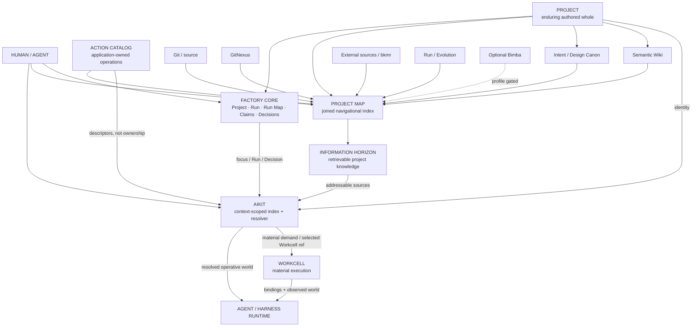
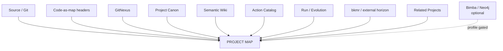
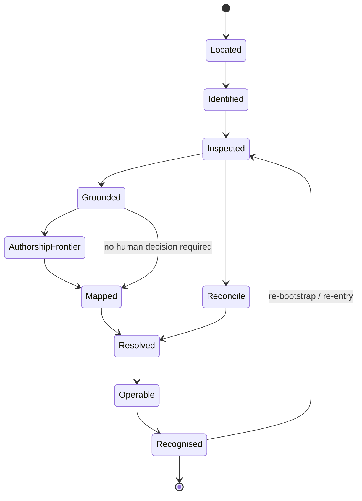
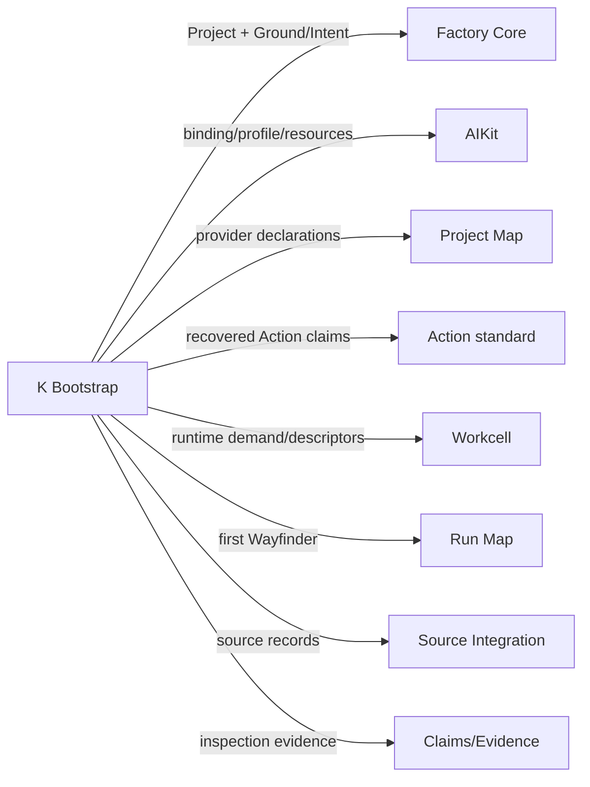
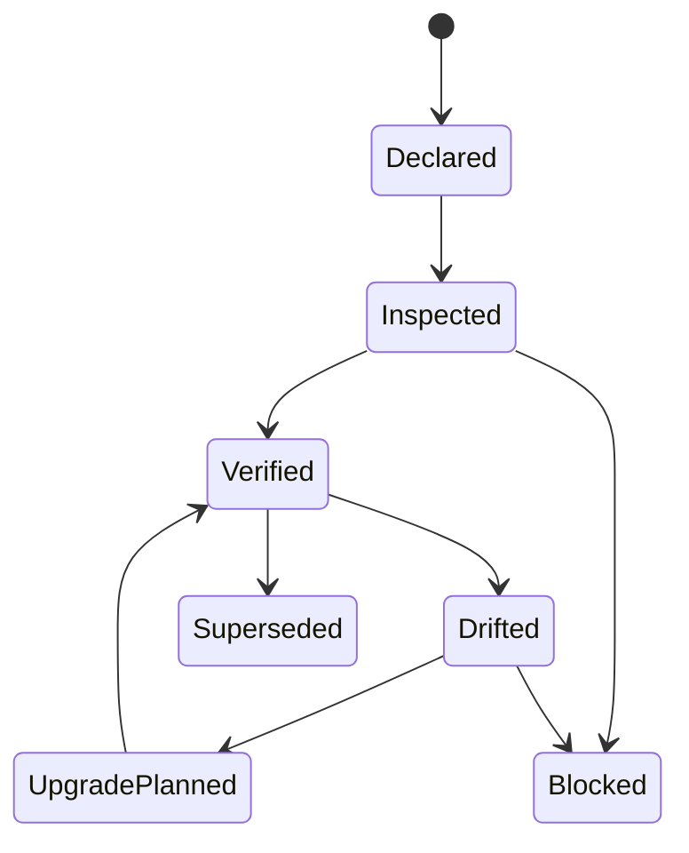
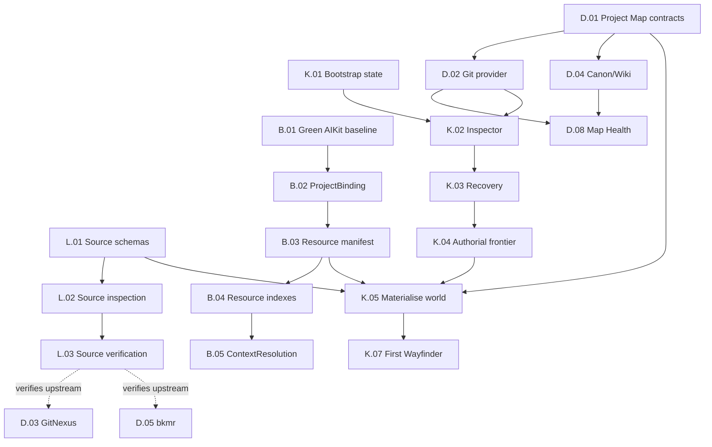

# WAYFINDER MAP — PROJECT WORLD  
## AIKit · Project Map · Bootstrap · Source Fidelity

**Namespaces:** `B.* · D.* · K.* · L.*`  
**Status:** definitive parallel Wayfinder Map for later whole-system reconciliation  
**Scope:** how an arbitrary repository, directory, or fresh software intention becomes a durable authored Project which humans and agents can enter, understand, navigate, reproduce, and operate without reconstructing its world by hand.

---

# 0. Authority, source basis, and determination discipline

This map reads the suite developmentally.

The **Constitutional Index is the precedence/control body**. Architecture and Primitive Relations retain the detailed architecture they establish except where the Index or later Deep QL document explicitly refines their vocabulary or ownership. The Workcell specification is authoritative inside its material-execution boundary. Deep QL is governing for the later `Action`, Agent-Native, QL/MEF, and Claims/refraction relations. Earlier language is not flattened into simultaneous requirements. 
For the executable map below, source bases are abbreviated:

| Key | Source basis |
|---|---|
| `C-IDX` | Constitutional Index — suite authority and current subsystem boundaries. |
| `C-ARCH` | Constitutional Architecture — detailed product architecture and source-integration seams. |
| `C-PRIM` | Primitive Relations — experienced ontology, Project, Context, Project Map, SourceIntegration. |
| `C-DEEP` | Deep QL / Agent-Native — Action, Action resources, QL-compatible extension seams. |
| `C-WORK` | Workcell specification — semantic-resolution/materialisation boundary. |
| `AIKIT@0ff819` | Live `EpiLogos/ai-kit` source inspected at commit `0ff819bb72763162b28491629ccc09ee93451808`. |

Four determination levels are used throughout:

```text
CONSTITUTIONAL
    governing determination from the current corpus

CURRENT DESIGN
    determined here sufficiently for implementation;
    may be moved structurally by whole-map reconciliation,
    but execution agents may not silently redesign it

OBSERVED
    directly present in inspected source or behaviour

VERIFIED
    directly exercised by an appropriate test/acceptance gate

RESEARCH / INTENDED
    legitimate architectural target or upstream claim,
    not yet implementation evidence
```

An upstream documentation statement is never promoted from `intended` to `verified` merely because it appears precise.

---

# 1. Joined constitutional answer

The joined question is:

> **How does an arbitrary repository/project become a durable authored Project which both human and agent can enter, understand, navigate and operate without repeatedly reconstructing its world by hand?**

The answer is:

```text
physical / external starting point
        │
        ▼
evidence-led Project Bootstrap
        │
        ├── establishes durable Project identity
        ├── recovers or creates Ground / Intent / Design
        ├── records real Source Integrations
        ├── creates the Project Map
        ├── establishes semantic/project knowledge
        ├── discovers Actions and Capabilities
        ├── discovers runtime requirements
        └── establishes AIKit binding/profile/resources
        │
        ▼
authored Project
        │
        ├──────── Project Canon
        ├──────── Project Map
        ├──────── Source Integration locks
        ├──────── semantic wiki
        ├──────── Run / Evolution history
        ├──────── Action Catalog
        └──────── AIKit operating declarations
        │
        ▼
AIKit resolves the world available HERE and NOW
        │
        ├── project/profile/scope
        ├── Agent / Agency resources
        ├── Capabilities / Actions
        ├── models / harnesses
        ├── hosts / Workcells
        ├── context sources
        ├── trust / preference / availability
        └── target projections
        │
        ▼
Context
 = Operative World
 + Information Horizon
 + Focus
        │
        ├── broad world is ADDRESSABLE
        │
        └── only relevant evidence is RETRIEVED / LOADED
        │
        ▼
human and agent can act without world reconstruction
```

The foundational boundaries are non-negotiable:

1. **Project is larger than repository.**
2. **AIKit resolves and indexes; it does not own Project meaning.**
3. **Project Map joins authoritative surfaces; it does not become their replacement database.**
4. **Application Actions remain application-owned. AIKit indexes/resolves them.**
5. **Factory Run/Run Map semantics remain Factory-owned. AIKit may index and project them.**
6. **Workcell materialises execution. AIKit does not become an infrastructure scheduler.**
7. **Available information is not equivalent to loaded model context.**
8. **Derived indexes can be destroyed and rebuilt without destroying authored truth.**
9. **An upstream integration is not satisfied by an approximate local imitation.**
10. **Project Bootstrap asks humans only where evidence and reversible engineering judgement genuinely stop.**

These relations follow directly from the current Project, Context, Project Map and AIKit definitions. 
---

# 2. Constitutional ownership map



## 2.1 Ownership table

| Object | Canonical owner | What AIKit may do | What AIKit may not do |
|---|---|---|---|
| `Project` | Factory/Project | identify, bind, resolve resources | redefine project meaning from directory layout |
| `Project Canon` | Project | index and retrieve references | rewrite intent/design as resolver state |
| `Run / RunMap` | Factory Core | index, surface, resolve focus | become canonical Run state machine |
| `ProjectMap` | Project/Factory contract | expose/query/project it | turn its cache into source truth |
| `Action` | application/project | discover, index, resolve, invoke through real adapter | copy business logic into AIKit |
| `Capability` | capability source/AIKit registry | catalogue, trust, resolve, project | silently change upstream semantics |
| `Context` | cross-system product primitive | perform operative resolution and resource indexing | imply that everything addressable is prompt-loaded |
| `InformationHorizon` | Project Map + source providers | search/resolve available sources | replace provider source truth |
| `Model/Harness` | execution-resource source | index availability/preferences and resolve candidates | make model identity Agent identity |
| `Workcell` | Workcell module | index its identity/offers | manage Docker/MicroVM internals itself |
| `SourceIntegration` | Project/Factory | index and enforce lock/gate state | infer that an imitation is equivalent |
| `Generation` | AIKit | own capability-projection materialisation | use Generation as canonical Project state |

The Workcell boundary remains especially exact:

```text
AIKit:
"What should this actor be able to do here?"

Workcell:
"How can this deployment materially make that true?"
```

That distinction is constitutional.

---

# 3. Precise vocabulary harmonisation

Several current AIKit names are close to, but not identical with, the later Factory ontology. They must be disambiguated before the Factory builds on them.

## 3.1 Project vocabulary

### `Project`

The canonical product primitive.

> An enduring authored identity around which source, intention, design, semantic knowledge, Actions, history, context sources and developmental work gather.

Repository is a constituent.

### `ProjectManifest`

**Current-design addition for repo materialisation.**

The committed Factory-facing declaration of Project identity and its canonical entry surfaces.

Target path:

```text
.factory/project.toml
```

It contains references, not duplicated source content:

```toml
schema = 1
id = "project/nara"
name = "Nara"

source_roots = ["."]
project_map = ".factory/project-map.toml"
source_integrations = ".factory/sources.toml"
source_lock = ".factory/sources.lock.toml"
semantic_wiki = "wiki/"
```

It may reference runtime descriptors already owned elsewhere:

```toml
runtime_descriptors = [
  "docker-compose.yml",
  "package.json",
  "Makefile"
]
```

It must **not** copy commands or APIs from those files merely to look comprehensive.

### `ProjectBinding`

The AIKit concept presently named `ProjectSpec`.

The live source shows that current `ProjectSpec` contains:

```text
id
directory matchers
repository matchers
default/inherited skill sets
```

and is used to resolve a working directory into an AIKit project. That is operational binding, not the complete canonical Project. 

Therefore:

```text
current public concept:
Project Specification

target precise concept:
Project Binding
```

Target Rust/public vocabulary:

```text
ProjectBinding
ProjectMatch
```

Migration must retain existing serialized schema compatibility.

`aikit project bind` remains a good command name.

### `ProjectProfile`

The AIKit scoped disposition of capabilities/resources for a Project.

It remains distinct from Project identity.

### `ProjectResourceManifest`

Target AIKit project-local declaration:

```text
.aikit/project.toml
```

This file is **AIKit-owned operating configuration**, not Project Canon.

It may declare:

```toml
schema = 1
project = "project/nara"

[integrations.bkmr]
db = "nara"

[action_sources]
...

[context_sources]
...
```

The live bkmr contribution already describes `.aikit/project.toml` as the intended future location for project-scoped bkmr integration, while explicitly noting that this schema has not yet landed and current integration is carried through `.aikit/profile.toml`. 

This distinction prevents `.aikit/` from becoming the place where Project meaning is authored.

---

## 3.2 Context vocabulary

### `Context`

Canonical product primitive:

```text
Context
 = OperativeWorld
 + InformationHorizon
 + Focus
```

### `ContextDescriptor`

Retain the existing AIKit type and meaning.

It describes the operational coordinates AIKit needs to resolve:

```text
context id
session
project
project root
task
isolation
platform
targets
multiplexer
host
```

That meaning is already implemented and tested. 

### `ResolvedView`

Retain the existing AIKit type.

It is the deterministic result of capability resolution:

```text
active
declared
unavailable
selection log
catalog index
skill overlays
warnings
resolution hash
catalog revision
```

It is **not** the whole canonical Context.

The current resolver already explicitly enforces explainability, policy denials, dependency failure, visible conflicts, and the rule that discovery/ranking does not itself activate a capability. 

### `ContextResolution`

New integration envelope.

```ts
type ContextResolution = {
  descriptor: ContextDescriptor
  capability_view: ResolvedViewRef

  actions: ActionView
  agents: AgentResourceView
  agencies: AgencyResourceView
  execution_resources: ExecutionResourceView
  context_sources: ContextSourceView

  project_map: ProjectMapRef
  information_horizon: InformationHorizonRef
  focus: FocusRef[]

  projections: ProjectionStatus[]
  explanation: ResolutionExplanation
}
```

This is the AIKit answer to:

> What world is available for this actor here?

It contains references to Project Map/horizon state rather than absorbing the source content.

---

## 3.3 Available, retrieved and loaded

These are three different relations.

### Available

A source belongs to the current information horizon and is addressable.

### Retrieved

Content has been requested from its provider for the current act.

### Loaded

Some retrieved representation has actually entered a specific model/harness context.

There must **not** be a mutable global `loaded=true` field on a source.

Loading is execution-relative:

```ts
type ContextLoad = {
  execution: ExecutionRef
  focus: Ref[]
  sources: LoadedSource[]
  retrievals: RetrievalRef[]
  transformations: ContextTransform[]
  approximate_tokens?: u64
  created_at: Timestamp
}

type LoadedSource = {
  source: SourceRef
  retrieved_revision: String
  freshness: FreshnessState
  reason: string
  representation: Ref
}
```

This makes it possible to answer:

```text
Available to the agent:
  2,431 project sources

Retrieved for this Decision:
  14

Actually loaded into this model turn:
  7
```

without confusing searchability with attention.

---

# 4. Target repository/project metadata surfaces

The Project world should have a small committed skeleton.

```text
<project>/
│
├── .factory/
│   ├── project.toml
│   ├── project-map.toml
│   ├── sources.toml
│   └── sources.lock.toml
│
├── .aikit/
│   ├── profile.toml
│   ├── profile.local.toml       # optional / ignored
│   └── project.toml             # target AIKit resource declarations
│
├── docs/
│   ├── canon/
│   │   ├── intent.md
│   │   └── architecture.md
│   └── design/
│
├── wiki/
│   ├── index.md
│   ├── concepts/
│   ├── modules/
│   ├── flows/
│   ├── decisions/
│   ├── experiences/
│   └── glossary.md
│
└── ordinary project source...
```

These are **control/index documents, not another knowledge database**.

Derived operational data remains where its owner belongs:

```text
AIKit SQLite/index/generations
    → AIKit operational state

GitNexus graph/index
    → GitNexus derived code index

bkmr database
    → bkmr retrieval index

Workcell bindings
    → Workcell operational state

Factory Run/event state
    → Factory Core

Git
    → source history
```

Every one of those derived surfaces must be reconstructable from its own authoritative sources where the provider supports reconstruction.

---

# 5. B — AIKit co-development

## 5.1 Current live implementation assessment

The current source strongly validates the constitutional direction.

AIKit is presently a five-crate Rust workspace:

```text
aikit-core
aikit-store
aikit-adapters
aikit-tui
aikit-cli
```

with `MIT OR Apache-2.0` workspace licensing. 

`aikit-core` explicitly describes itself as an I/O-free context-scoped capability router. The current context is roughly:

```text
user
+ host
+ project scope chain
+ session space
+ task
+ target client
```

and resolution returns a graph, explanation and deterministic hash. 

The current scope precedence is already exact:

```text
managed policy
   ↓
global
host
project
project-local
session
task
one-shot
```

with lower levels applied first and later levels overriding ordinary declarations. Project/global mutations require confirmation; session/project-local mutations are deliberately cheap. 

The store already maintains the correct canonical/derived distinction: manifests, payloads, profiles and project declarations are canonical files; SQLite indexes and materialised generations are derived. Atomic generation application and stale-base rejection are explicit invariants. 

The projection layer also already distinguishes:

```text
active in AIKit
    ≠
loaded/active in every client
```

through explicit activation effects such as immediate, live-reload, restart-required, next-session-only, brokered and unsupported. 

The CLI has a global `--json` surface and a substantial implemented command tree, including project binding, profiles, sources, capabilities, context, sessions, tasks, inbox, trust-adjacent workflows and Procedures. 

The current TUI is deliberately a transient **palette rather than a dashboard**, and shares one application service with the CLI rather than shelling out or reimplementing resolver logic. That architectural discipline should be preserved even as richer Project/Run views appear around it. 

Real cmux and tmux adapter implementations are present. 

### Current verification caveat

At current main:

```text
cargo test ...       PASS
clippy -D warnings   FAIL
release build        skipped after failure
diff check           skipped after failure
```

Therefore the current source is an **observed and behaviorally substantial baseline, not a green code-health baseline**. 

---

## 5.2 AIKit intended / observed / verified matrix

| Capability | Intended | Observed now | Verified now | Map determination |
|---|---:|---:|---:|---|
| Context-scoped resolution | yes | yes | strong | retain |
| Scope precedence | yes | yes | strong | retain exactly |
| Capability catalogue | yes | yes | partial/strong | extend, do not replace |
| Trust/quarantine | yes | yes | partial | retain |
| Profiles | yes | yes | partial | extend |
| Capability/skill sets | yes | yes | partial | generalise vocabulary carefully |
| Immutable generations | yes | yes | partial/strong | retain |
| Projection planning | yes | yes | partial/strong | retain |
| Project directory/repo binding | yes | yes | partial | rename semantic concept to `ProjectBinding` |
| Canonical authored Project | yes | **no** | no | Factory integration required |
| Procedures | yes | yes | partial | retain |
| Inbox | yes | yes | partial | extend with Factory Human Requests |
| CLI | yes | yes | yes at surface level | retain one shared app service |
| global machine JSON | yes | yes | observed | make schema-contract tests explicit |
| TUI palette | yes | yes | behavior tests present | retain as transient palette |
| Project/Run-rich TUI | yes | no | no | add as projection, not resolver |
| tmux | yes | yes | partial | retain adapter |
| cmux | yes | yes | partial | retain adapter |
| generic headless resource API | yes | partial through CLI JSON/app service | no | add stable contracts |
| Action indexing | yes | no | no | add |
| Action Sets | yes | no | no | add |
| Agent resource indexing | yes | no | no | add |
| Agency resource indexing | yes | no | no | add |
| context-source indexing | yes | partial | no | add generic contract |
| bkmr project shim | yes | contribution exists | not core-complete | finish real seam |
| model indexing | yes | client/provider fragments only | no | add |
| harness indexing | yes | clients exist | no | add semantic catalog |
| Workcell awareness | yes | host/mux only | no | add Workcell resource index |
| asset memory | yes | frecency/usage foundations exist | partial | extend |
| frecency | yes | yes | partial | retain distinct |
| contextual relevance | yes | pieces exist | no full contract | add |
| fitness | yes | no general resource fitness | no | integrate with J map |
| explicit preference | yes | scopes/config partially express it | no unified record | add |
| availability | yes | capability target availability exists | partial | generalise carefully |
| Project Map resolution | yes | no canonical provider layer | no | D thread |
| Run awareness | yes | no canonical Factory Run layer | no | reference only; C owns semantics |

“Verified now” above means evidence present in the inspected source/test path, not that the final Factory acceptance tests already exist.

---

## 5.3 Existing AIKit algebra to preserve

The resolver is not a rewrite target.

The following must remain invariant unless a separate architectural Decision explicitly supersedes them:

```text
explicit declarations beat fuzzy discovery

managed denials cannot be overridden

required disabled dependencies fail visibly

conflicts fail visibly

tag/search matching never activates capabilities by itself

every final activation decision is explainable

context resolution is deterministic for identical inputs

resolution has a stable content hash

store does not decide resolver semantics

TUI and CLI do not maintain separate semantic engines
```

Those are unusually strong foundations for the Factory.

---

## 5.4 New resource-index plane

AIKit needs to become broader without converting everything into a `Capsule`.

The target composition is:

```text
AIKit INDEXED WORLD
│
├── Capability Catalog
│   └── things an actor can use
│
├── Action Catalog Index
│   └── project/application-owned domain operations
│
├── Actor Resources
│   ├── Agent
│   └── Agency
│
├── Execution Resources
│   ├── Model
│   ├── Harness
│   ├── Host
│   └── Workcell
│
└── Context Sources
    ├── Project Map providers
    ├── bkmr sources
    ├── external docs
    ├── related Projects
    └── other retrievable knowledge
```

These share indexing/resolution infrastructure where useful, but not one flattened ontology.

### `Capability`

Something the actor can be given power to use.

### `Action`

A canonical domain operation whose source remains the application/project.

### `AgentResource`

An addressable enduring Agent identity.

### `AgencyResource`

An addressable local/scoped Agent determination.

### `ContextSource`

An addressable source available for retrieval.

### `ExecutionResource`

A Model, Harness, Host or Workcell descriptor available for execution selection.

---

## 5.5 Resolution request

```ts
type ContextResolutionRequest = {
  project: ProjectRef
  descriptor: ContextDescriptor

  profile_overlays: ProfileRef[]
  explicit_overrides: ResolutionOverride[]

  actor?: AgentRef
  agency?: AgencyRef

  focus: Ref[]

  requested_use_types?: UseType[]
  required_actions?: ActionRef[]
  required_capabilities?: CapabilityRef[]

  execution_demand?: ExecutionDemandRef
}
```

AIKit resolves:

```text
declared scopes
+ project binding
+ project/resource declarations
+ catalogues
+ trust/policy
+ source availability
+ explicit preference
+ learned ranking signals
+ current host/workcell availability
```

into a `ContextResolution`.

### Hard versus soft inputs

Hard resolution inputs:

```text
policy
trust
explicit declarations
platform compatibility
dependencies/conflicts
required interfaces
availability
```

Soft ranking inputs:

```text
frecency
contextual relevance
fitness
preference
historical successful use
```

A soft ranking signal can reorder suggestions.

It cannot silently convert an unavailable, denied or undeclared resource into an active one.

---

## 5.6 Capability Set and Action Set

`SkillSet` is currently real AIKit vocabulary.

Target vocabulary:

```text
CapabilitySet
    general reusable set of AIKit Capabilities

SkillSet
    compatibility/specialised form for skill-only ecosystems

ActionSet
    collection of application-owned Actions selected for a Context
```

An Action Set must not be serialized as if AIKit authored the Actions.

It is a reference selection over an external Action Catalog.

---

## 5.7 AIKit ↔ Project Map

AIKit consumes:

```ts
type ProjectMapIndex = {
  project: ProjectRef
  providers: ProjectMapProviderDescriptor[]
  entries: MapEntrySummary[]
  freshness: ProviderFreshness[]
}
```

AIKit may then answer:

```text
where can I look?
what is available?
which sources are relevant to this focus?
is this index stale?
```

It does **not** answer:

```text
what is true because my cache says so?
```

without preserving provider provenance.

---

## 5.8 AIKit ↔ Run Map

Run Map remains external.

AIKit receives:

```ts
type RunFocus = {
  run: RunRef
  frontier?: Ref
  position?: Ref
  decisions?: DecisionRef[]
  claims?: ClaimRef[]
}
```

It uses the focus to resolve resources.

It does not progress the Run.

---

## 5.9 AIKit ↔ Action Catalog

```ts
trait ActionCatalogProvider {
  fn identify(&self, project: ProjectRef) -> Result<ActionCatalogDescriptor>;
  fn list(&self, project: ProjectRef) -> Result<Vec<ActionDescriptor>>;
  fn describe(&self, action: ActionRef) -> Result<ActionDescriptor>;
  fn invoke_surface(&self, action: ActionRef) -> Result<ActionInvocationBinding>;
  fn freshness(&self, project: ProjectRef) -> Result<FreshnessStamp>;
}
```

`ActionInvocationBinding` points to the real seam:

```text
native function
HTTP
MCP
CLI
A2A
other declared protocol
```

AIKit never copies the Action implementation.

---

## 5.10 AIKit ↔ Workcell

AIKit indexes Workcells through a deliberately narrow surface:

```ts
type WorkcellResource = {
  id: WorkcellRef
  status: Availability
  offers: Vec<OperationalOffer>
  location: HostRef
  provider_version: String
}
```

The Factory supplies an `ExecutionDemand`.

AIKit can resolve plausible Workcell resources.

The Workcell itself performs:

```text
plan
prepare
bind
observe
expose
collect
release
reconcile
```

No Docker bridge, Arrakis MicroVM, IP address or filesystem placement leaks into semantic Project configuration.

---

# 6. D — Project Map and Information Horizon

## 6.1 Definition

The Project Map answers:

> **Where should I enter to understand or act on this Project?**

It is one joined navigational index over sources whose authorities remain distinct.



The corpus explicitly establishes this index-not-database relation.

---

## 6.2 Project Map manifest

Target committed declaration:

```toml
# .factory/project-map.toml
schema = 1
project = "project/nara"

[[provider]]
id = "source/git"
kind = "source"
authority_domains = ["source-state"]
required = true

[[provider]]
id = "code/gitnexus"
kind = "code-index"
authority_domains = ["code-structure"]
source_integration = "source/gitnexus"
required = true

[[provider]]
id = "canon/project"
kind = "canon"
authority_domains = ["intent", "design", "project-language"]

[[provider]]
id = "wiki/project"
kind = "semantic-wiki"
root = "wiki/"

[[provider]]
id = "actions/project"
kind = "action-catalog"
required = false

[[provider]]
id = "knowledge/bkmr"
kind = "information-horizon"
source_integration = "source/bkmr"
required = false

[[provider]]
id = "evolution/factory"
kind = "run-history"

[[provider]]
id = "semantic/bimba"
kind = "semantic-horizon"
profile_gate = "epi-logos"
required = false
```

This file declares **where meaning is found**, not a copy of the meaning.

---

## 6.3 Source address

Every mapped item becomes addressable through a provider-qualified source address.

```ts
type SourceAddress = {
  project: ProjectRef
  provider: ProjectMapProviderRef

  namespace: String
  locator: String

  revision?: String
  fragment?: String
}
```

Examples:

```text
source/git :: src/session/runtime.rs@<commit>
gitnexus  :: symbol:SessionRuntime@<index revision>
canon     :: docs/canon/intent.md#identity-matrix
wiki      :: concepts/session-identity
run       :: run/184/decision/7
bkmr      :: source/handbook/chapter-4
actions   :: action/session.resume
bimba     :: <profile-specific coordinate/ref>
```

---

## 6.4 Provenance envelope

Every provider result carries:

```ts
type Provenance = {
  source: SourceAddress

  provider_version: String
  source_revision?: String
  content_digest?: String

  authoritative_for: AuthorityDomain[]
  derived_from: SourceAddress[]

  retrieved_at?: Timestamp
  indexed_at?: Timestamp

  freshness: FreshnessState
}
```

This is mandatory even where the UX hides most fields by default.

---

## 6.5 No single authority ranking

Authority is **question-typed**, not one universal score.

| Question | Primary authority |
|---|---|
| What source currently exists? | Git/source tree |
| What changed? | Git history/diff |
| What is structurally connected in code? | GitNexus, derived from the current source revision |
| What is the project trying to become? | recognised Project Canon |
| What does this project term mean? | recognised semantic wiki/canon |
| What can the app canonically do? | application Action Catalog |
| Why did we choose this? | Factory Decision/Run history |
| What external material informed this? | source refs + SourceIntegration/provenance |
| What is currently running? | Workcell/runtime observations |
| What resources can this actor use? | AIKit ContextResolution |
| What does Bimba say? | Bimba itself, only inside a profile that enables that horizon |

The Project Map cannot “resolve” a contradiction by giving itself greater authority than the sources it indexes.

---

## 6.6 Provider contract

```ts
trait ProjectMapProvider {
  fn descriptor(&self, project: ProjectRef)
    -> Result<ProjectMapProviderDescriptor>;

  fn index(
    &self,
    project: ProjectRef,
    previous: Option<FreshnessToken>
  ) -> Result<IndexDelta>;

  fn lookup(
    &self,
    project: ProjectRef,
    query: MapQuery
  ) -> Result<Vec<MapEntry>>;

  fn resolve(
    &self,
    address: SourceAddress
  ) -> Result<SourceRef>;

  fn freshness(
    &self,
    project: ProjectRef
  ) -> Result<ProviderFreshness>;
}
```

A provider that can retrieve content additionally implements:

```ts
trait InformationHorizonProvider {
  fn search(
    &self,
    query: RetrievalQuery
  ) -> Result<Vec<RetrievalHit>>;

  fn retrieve(
    &self,
    sources: &[SourceRef],
    budget: RetrievalBudget
  ) -> Result<RetrievedMaterial>;
}
```

Not every Project Map provider needs to be a knowledge-search engine.

---

## 6.7 Freshness

Each provider defines a meaningful source fingerprint.

Examples:

```text
Git
    HEAD + dirty-tree fingerprint

GitNexus
    indexed source revision
    + tool/index schema revision

Project Canon
    file/content hashes + Git revision

Wiki
    linked-file/content hashes

Action Catalog
    owning source revision + schema digest

Factory Evolution
    Run/Event store generation

bkmr
    bound database identity
    + source/index generation
    + provider version

external document provider
    content hash / ETag / revision where available

Bimba
    graph/index revision where supported
```

Freshness states:

```text
fresh
possibly-stale
stale
unavailable
unknown
```

`unknown` is not silently treated as `fresh`.

---

## 6.8 Stale-index reconciliation

A stale derived provider follows:

```text
detect source delta
      │
      ▼
mark provider stale
      │
      ├── current query permits stale data
      │      └── return with explicit warning/provenance
      │
      └── current query requires fresh data
             └── refresh provider
                    │
                    ├── success → fresh
                    └── failure → unavailable/stale + evidence
```

Staleness does not delete prior evidence.

---

## 6.9 GitNexus

GitNexus is the structural code-intelligence provider.

The intended real seam already named by the corpus includes:

```text
analyze
context
impact
trace
detect-changes
query
wiki
MCP
```

It must remain GitNexus doing the code-graph work.

AIKit/Project Map adds:

```text
Project identity
stable refs
freshness
source-fidelity verification
links to canon/wiki/runs/actions
```

It must not implement a weaker home-grown call graph.

---

## 6.10 Code-as-map

Code remains the cheapest direct portal.

Module roots should carry small high-value orientation:

```rust
//! # session_runtime
//!
//! Owns creation, suspension and recovery of sessions.
//!
//! Design: docs/design/session-runtime.md
//! Semantic: wiki/modules/session-runtime.md
```

The intended exploration path is:

```text
tree
 ↓
search / grep
 ↓
open source
 ↓
follow import/reference
 ↓
GitNexus context / impact / trace
 ↓
canon / wiki / evolution when needed
```

There is deliberately no generated prose twin for every source file.

---

## 6.11 Semantic wiki

The wiki owns project-local semantic articulation.

Minimum shape:

```text
wiki/
  index.md
  concepts/
  modules/
  flows/
  decisions/
  experiences/
  glossary.md
```

Requirements:

```text
plain Markdown readable
Obsidian-compatible
Git-versioned
stable links
references source/design/runs
no requirement for Obsidian runtime
agent editable
human editable
```

Project Bootstrap may create a sparse scaffold.

It must not hallucinate a giant semantic wiki merely to complete setup.

---

## 6.12 bkmr horizon

bkmr sits behind the generic information-horizon interface.

The currently inspected AIKit contribution already makes the right central move: one project gets an explicit bound bkmr database rather than sharing an ambiguous global active database, and search results are JSON-capable. It also explicitly states that the target `.aikit/project.toml` integration has not yet landed. 

Target relation:

```text
Project
  │
  └── ContextSource declarations
          │
          ▼
        AIKit
          │
          ▼
   bkmr Horizon Adapter
          │
          ▼
 project-bound bkmr DB(s)
```

`bkmr` is never synonymous with `Project Map`.

---

# 7. Progressive retrieval

## 7.1 Retrieval planner

A retrieval request is driven by Focus:

```ts
type RetrievalQuery = {
  project: ProjectRef
  focus: Ref[]
  question: String

  authority_domains?: AuthorityDomain[]
  preferred_sources?: SourceRef[]
  exclusions?: SourceRef[]

  freshness_requirement: FreshnessRequirement
  budget: RetrievalBudget
}
```

The planner may use:

```text
Project Map topology
authority domain
semantic relevance
GitNexus proximity
Run/Decision relations
human/project preferences
frecency
known source quality
```

but each retrieval remains provenance-bearing.

---

## 7.2 Decision-focused retrieval

Example:

```text
Decision:
"Should session identity survive model switching?"
```

The agent should not receive the entire Project.

It receives an orienting packet such as:

```text
PROJECT
Nara

FOCUS
decision/run-184/7

STANDING CANON
3 refs

CODE
2 modules + GitNexus context

PRIOR DECISIONS
2 refs

EXTERNAL SOURCES
1 relevant source

OPEN CLAIMS
4

AVAILABLE BUT NOT LOADED
2,417 additional sources
```

The agent can request more.

This is the practical meaning of a large information horizon with a small active context.

---

# 8. Canonical Project-entry journeys

## 8.1 “I returned after six months; show me where to enter.”

`aikit open <project>` produces a `ProjectEntryPacket`:

```ts
type ProjectEntryPacket = {
  project: ProjectRef

  current_ground: Ref
  intent: Ref[]
  design: Ref[]

  active_runs: RunRef[]
  current_frontiers: Ref[]

  since_last_seen: EvolutionDelta
  last_recognition?: Ref

  project_map_health: ProjectMapHealth
  source_health: SourceHealth

  context_resolution: ContextResolutionRef

  recommended_entries: EntryPoint[]
}
```

Human view:

```text
NARA

Since you were last here
  11 recognised changes
   2 design decisions
   1 abandoned branch
   3 current runs

Current frontier
  Identity Matrix       implementation
  Session continuity    decision required
  Agent Actions         source verification

Project health
  Git              fresh
  GitNexus         fresh
  Wiki             fresh
  bkmr             stale: 3 external sources changed
  Source locks     1 upstream drift notice

Enter:
  [Current frontier]
  [Evolution]
  [Intent]
  [Project Map]
```

The user is not shown six months of logs.

---

## 8.2 “What does this module mean?”

```text
source module
   │
   ├── module header
   ├── GitNexus context
   ├── design refs
   ├── wiki module/concept refs
   ├── Action refs
   └── Runs/Decisions that shaped it
```

The answer makes the source itself primary and layers richer context around it.

---

## 8.3 “What changed this concept?”

```text
wiki concept
    │
    ▼
Project Map cross-links
    │
    ├── Decision history
    ├── Run branches
    ├── relevant design revisions
    ├── source changes
    └── external source refs
```

The Evolution provider answers the developmental question.

---

## 8.4 “Which source is authoritative?”

The answer is domain-specific:

```text
For current implementation:
    Git source at <revision>

For intended behaviour:
    recognised Intent Artifact <ref>

For structural code relationship:
    GitNexus index <rev>, derived from Git <rev>

For this historical design choice:
    Decision <ref>

For the external algorithm:
    SourceIntegration <ref>, upstream <revision>
```

---

## 8.5 “What external material informed this design?”

A Design/Claim should be traceable:

```text
Design Claim
   │
   ├── evidence/source refs
   │      ├── paper
   │      ├── docs
   │      └── upstream source
   │
   └── SourceIntegration / provenance
```

No answer should be forced to rely on recollection of which web page an agent once read.

---

# 9. K — Project Bootstrap

## 9.1 Bootstrap definition

Project Bootstrap is the Factory's first developmental act upon:

```text
mature external repository
sparse / weakly documented repository
fresh project
existing Factory project re-entered later
```

It is not an installer.

Its destination is:

> **A visioned, source-grounded, context-resolved Project which humans and agents can enter meaningfully.**

The current Constitution explicitly requires evidence-led inspection before interrogation.

---

## 9.2 Bootstrap state machine



State meanings:

```text
Located
    source path/repository/new-project destination exists

Identified
    durable Project identity assigned or recovered

Inspected
    evidence inventory complete enough to reason from

Grounded
    current state and existing intent/design claims recovered

AuthorshipFrontier
    only genuine human determinations remain

Mapped
    Project Map/provider declarations established

Resolved
    AIKit binding/profile/resources resolve correctly

Operable
    runtime/action/capability surfaces can be entered

Recognised
    Bootstrap result belongs to the Project
```

---

## 9.3 Bootstrap never waits to create Project identity

A fresh or imported source receives a durable Project ID at the start of Bootstrap.

The Project does not need to be “complete” before it can have identity.

This allows the Bootstrap traversal itself to be a normal Factory Run attached to the Project.

Recognition closes the Bootstrap Run; it does not retroactively create the Project.

---

## 9.4 Inspection order

For an existing repository:

```text
1 source/Git identity and history
2 repository tree
3 build/package manifests
4 README / docs / ADR / design material
5 tests and CI
6 application surfaces
7 APIs / CLIs / user operations
8 existing Action-like operations
9 agent/AI instructions and skills
10 project/runtime/deployment definitions
11 existing semantic maps/wiki
12 GitHub issues/PRs where available
13 external source references
14 source integrations
15 AIKit declarations
16 Factory declarations if already present
```

Only after that evidence pass does the system formulate authorial questions.

---

## 9.5 Bootstrap evidence classes

Each recovered statement is typed:

```text
OBSERVED
    directly in code/config/runtime

DOCUMENTED
    asserted by existing project material

RECOGNISED
    current Project Canon

INFERRED
    supported synthesis requiring no authorship

CONFLICTING
    sources disagree

MISSING
    no adequate evidence

AUTHORIAL
    evidence cannot determine which future is intended
```

The human is principally asked about the last category.

---

## 9.6 Human-question policy

### Forbidden human questions

Do not ask:

```text
Which package manager does this repo use?
What test command exists?
What API routes are defined?
Where is the app entry point?
What did this ADR decide?
Which skills already exist?
Does this repo use Docker?
What did the prior Run decide?
```

if the repository can answer them.

### Agent-owned questions

Agents decide:

```text
which files need reading
which search query to run
which GitNexus command to use
whether an index needs refresh
how to order evidence gathering
ordinary reversible implementation details
```

### Human-owned questions

Human attention is reserved for:

```text
What is this product fundamentally for?
Which genuinely viable product future is intended?
Which user experience should define success?
Which foundational architectural commitment should hold?
Do you recognise this recovered account of the project?
```

---

## 9.7 Bootstrap artifacts

### Run artifacts

Bootstrap creates ordinary typed Factory artifacts:

```text
Bootstrap GroundArtifact
Recovered IntentArtifact
Recovered/Created DesignArtifact
SourceInspectionArtifact
RuntimeDiscoveryArtifact
ActionDiscoveryArtifact
CapabilityDiscoveryArtifact
ProjectMapPlan
SourceIntegrationPlan
BootstrapRecognitionPacket
```

### Recognised committed surfaces

Once established:

```text
.factory/project.toml
.factory/project-map.toml
.factory/sources.toml
.factory/sources.lock.toml

.aikit/profile.toml
.aikit/project.toml         # once target AIKit schema exists

wiki/index.md

docs/canon/intent.md        # only if Project needs such a committed canon form
docs/canon/architecture.md  # likewise

existing runtime files remain canonical where already adequate
```

Generated inspection debris stays in Run artifacts, not the repository.

---

## 9.8 Bootstrap handoffs



Bootstrap must not implement any of those downstream owners internally.

---

## 9.9 Case 1 — mature external repository

Expected behavior:

```text
inspect richly
recover most Ground
recover Intent/Design from docs/history
index source
recover existing operations
create minimal semantic map
ask zero or very few authorial questions
establish AIKit resolution
produce first Wayfinder
```

The system must prefer:

> “I recovered these three explicit product commitments. They conflict here.”

over:

> “Tell me what your project does.”

---

## 9.10 Case 2 — sparse repository

Expected behavior:

```text
derive implementation facts from code/tests
distinguish observed behaviour from intended meaning
create explicit missing-intent frontier
ask human about product/architecture meaning only
do not invent missing canon from code structure alone
```

---

## 9.11 Case 3 — fresh project

Expected behavior:

```text
create Project identity
vision product intent
prototype user experience when appropriate
establish foundational program architecture
create source/runtime skeleton
establish AIKit/Project Map surfaces
produce first development Wayfinder
```

Fresh-project Bootstrap naturally contains more human authorship.

---

## 9.12 Case 4 — re-entry / re-bootstrap

Expected behavior:

```text
recover existing Project identity
do not replace recognised canon
inspect source delta since previous Bootstrap
refresh providers
detect stale integrations
detect new Actions/Capabilities/runtime surfaces
show developmental delta
reconcile AIKit bindings
create a new Run only where change warrants one
```

Re-bootstrap is reconciliation, not reinstallation.

---

## 9.13 Idempotence

Bootstrap has an input fingerprint:

```ts
type BootstrapFingerprint = {
  bootstrap_schema: u32
  project: ProjectRef
  source_roots: Vec<SourceFingerprint>
  project_manifest_digest?: String
  aikit_declaration_digest?: String
  map_manifest_digest?: String
  source_lock_digest?: String
}
```

Repeated Bootstrap over the same evidence must:

```text
preserve Project ID
preserve recognised canon
preserve existing SourceIntegration IDs
preserve Project Map provider IDs
avoid duplicate wiki scaffolding
avoid duplicate AIKit bindings
produce no new human questions
report "no material reconciliation required"
```

unless a relevant input has changed.

---

# 10. L — Source Integration and reproducibility

## 10.1 SourceIntegration definition

A `SourceIntegration` is:

> A durable declaration that the Project intentionally incorporates or depends upon a real external codebase, system, protocol, knowledge source or tool through a named seam.

It exists specifically to stop:

```text
"integrate GitNexus"
        ↓
agent writes homemade symbol scanner
```

or:

```text
"use Pi"
        ↓
agent creates bespoke one-off subprocess wrapper
that ignores Pi's real session/RPC/extension model
```

unless an explicit Decision authorises the substitution.

---

## 10.2 Authored source declaration

Target:

```text
.factory/sources.toml
```

Example:

```toml
schema = 1

[[integration]]
id = "source/gitnexus"
kind = "git"
upstream = "nxpatterns/gitnexus"

mode = "cli+protocol"

reuse = [
  "analyze",
  "context",
  "impact",
  "trace",
  "detect-changes"
]

augment = [
  "Project identity binding",
  "stable Factory refs",
  "freshness handling",
  "links to canon/wiki/runs"
]

upgrade = "reviewed-pin"
```

---

## 10.3 Resolved source lock

Target:

```text
.factory/sources.lock.toml
```

Conceptual schema:

```toml
schema = 1
generated_at = "..."
project = "project/software-factory"

[[source]]
id = "source/aikit"

[source.upstream]
kind = "git"
repository = "EpiLogos/ai-kit"

[source.pin]
requested = "0ff819bb72763162b28491629ccc09ee93451808"
resolved_commit = "0ff819bb72763162b28491629ccc09ee93451808"

[source.license]
spdx = "MIT OR Apache-2.0"
files = ["LICENSE-MIT", "LICENSE-APACHE"]

[source.integration]
mode = "source-mount"
seams = [
  "crates/aikit-core",
  "crates/aikit-store",
  "crates/aikit-adapters",
  "crates/aikit-tui",
  "crates/aikit-cli"
]

[source.verification]
inspected = true
source_smoke = true
behaviour_tests = true
code_health = false

[source.drift]
status = "pinned"
last_checked = "..."
```

The AIKit licence declaration is directly verified in the live workspace manifest. 

---

## 10.4 SourceIntegration lifecycle



Meanings:

```text
Declared
    intended source and seam named

Inspected
    real source/API/CLI/protocol inspected

Verified
    real seam exercised by compatibility/smoke tests

Drifted
    upstream or local interface changed

UpgradePlanned
    explicit migration/rebase/update exists

Blocked
    implementation depending on this seam cannot proceed safely

Superseded
    recognised replacement exists
```

---

## 10.5 Source-fidelity build gate

For every executable node:

```ts
type SourceRequirement = {
  integration: SourceIntegrationRef
  minimum_status: "verified"
}
```

Readiness:

```text
for source in node.requires_sources:
    if source.status != verified:
        node = BLOCKED
```

The only override is a recorded architectural Decision:

```text
SourceSubstitutionDecision
```

which must state:

```text
why the upstream cannot be used
what semantics are being replaced
what fidelity is intentionally lost
why the substitute is architectural rather than expedient
how future convergence will work
```

No coding agent gets to make that Decision implicitly.

---

## 10.6 Intended upstream ecosystem ledger

| Source | Intended role/mode | Current evidence in this mapping pass | Implementation posture |
|---|---|---|---|
| **AIKit — `EpiLogos/ai-kit`** | source mount/co-development | real source inspected at `0ff819…`; architecture verified; current CI clippy red | usable architectural seam; code-health gate first |
| **SSSF — `az9713/sssf-demo`** | reference/source-level reuse of deterministic runner contracts | corpus source claim only in this pass | **BLOCKED pending L inspection** |
| **Pi — `badlogic/pi-mono`** | harness through real binary/RPC/SDK/extensions | corpus source claim | **BLOCKED pending L inspection** |
| **GitNexus — `nxpatterns/gitnexus`** | real CLI/MCP code-index provider | detailed corpus seam, not live-inspected here | **BLOCKED pending L inspection** |
| **Matt Pocock skills — `mattpocock/skills`** | AIKit capability source | corpus seam | **BLOCKED pending pin/trust verification** |
| **HumanLayer/Dexter material** | reference/capability source for design discipline | corpus seam | verify exact sources/revisions before importing |
| **cmux — `manaflow-ai/cmux`** | multiplexer/application surface | AIKit adapter source exists; upstream not inspected here | adapter observed; source integration still requires pin |
| **tmux** | multiplexer CLI/protocol | substantial AIKit adapter observed | deployment version/protocol compatibility lock required |
| **Hermes — `NousResearch/hermes-agent`** | personal orchestrator/messaging projection | corpus intent | **BLOCKED pending source inspection** |
| **bkmr — `sysid/bkmr`** | information-horizon provider | real AIKit contrib adapter/capsules inspected; target core seam incomplete | finish verified SourceIntegration before D provider ships |
| **Agent-Native precedent** | reference implementation/design evidence | current constitutional source says precedent, not universal dependency | reference mode unless an actual adapter is adopted |
| **Neo4j/Bimba** | optional project/profile semantic horizon | constitutional optional role | verify connector/version only for profiles enabling it |
| **Docker** | Workcell execution/runtime provider | Workcell constitutional provider role | provider integration must name real engine/API/CLI seam |
| **Arrakis or selected MicroVM provider** | optional strong-isolation Workcell provider | architecture intent only | **BLOCKED until exact upstream/version/API is inspected** |

The canonical source ledger already identifies AIKit, SSSF, Pi, Matt Pocock skills, HumanLayer/Dexter, GitNexus, cmux, Hermes, Neo4j and sandbox-provider roles. This map preserves those roles but refuses to promote the uninspected source claims to implementation evidence.

---

# 11. Reproducibility

## 11.1 Project-level reproducibility

A Project is reconstructable from:

```text
ProjectManifest
Git source/revisions
Project Canon
ProjectMap manifest
SourceIntegration declarations + lock
AIKit ProjectBinding/profile/resource declarations
semantic wiki
Run/Decision history
runtime descriptors
```

Derived GitNexus/bkmr/AIKit indexes can be regenerated.

---

## 11.2 SourceIntegration-level reproducibility

A source seam records:

```text
source identity
exact pin
content/version hash
licence
mode
real API/CLI/protocol/path
local augmentation
verification command/results
known compatibility range
upgrade method
local patch stack if forked
```

Floating `main`, `latest`, unpinned package ranges, or remembered local installs are insufficient for recognised integrations.

---

## 11.3 Execution-level reproducibility

An execution record retains:

```text
Project source revision / dirty diff
Run/Candidate
AIKit ContextDescriptor
AIKit resolution hash / generation
active Capability revisions
Action source revisions
model/provider/version identity
harness/version/session metadata
Workcell and provider bindings
environment/image/runtime digests
logical service bindings
commands/gates
ContextLoad provenance
SourceIntegration refs
```

For nondeterministic agents, reproducibility means:

> **the same grounded world and execution envelope can be reconstructed and the evidence trail inspected**

—not that an LLM is forced to emit identical tokens.

---

## 11.4 Deployment-level reproducibility

Retain:

```text
Workcell desired state
provider versions
container/image digests
runtime modes
network relationships
persistence scopes
service identities
configuration references
migration versions
secret references
```

Secret values are not embedded into reproducibility records.

---

# 12. Source drift and upgrades

Checking drift is read-only:

```text
source check
   ↓
inspect upstream
   ↓
compare locked pin and interface
   ↓
report:
    no drift
    upstream changed
    seam changed
    licence changed
    compatibility unknown
```

Updating is separate:

```text
source update plan <id>
     │
     ├── proposed pin
     ├── upstream diff
     ├── local augmentation impact
     ├── compatibility tests
     └── migration notes
     │
     ▼
explicit Decision / normal technical approval
     │
     ▼
source update apply
     │
     ▼
all verification gates
     │
     ▼
new lock
```

No drift check mutates the Project by itself.

---

# 13. Human/agent product intent

## 13.1 Enter Project

Target:

```text
$ aikit open nara
```

The command:

```text
resolve ProjectBinding
load ProjectManifest
health-check Project Map
resolve AIKit world
identify/resume normal Session Space
surface current frontier
materialise only required client projections
return human to work
```

If the project is not yet Factory-authored:

```text
$ aikit open ./foreign-repo

This repository is not yet a Factory Project.

Evidence recovered:
  source              yes
  test system         yes
  product docs        yes
  architecture        partial
  Action surface      14 candidates
  runtime             Docker Compose
  AIKit profile       none

One authorial determination remains:
  [Review recovered product intent]

[Open recovered intent]  [Bootstrap]
```

The product should not ask ten setup questions first.

---

# 14. CLI target surface

Existing commands remain compatible.

New/extended semantic surface:

```text
aikit open <project|path>

aikit project bind ...
aikit project show
aikit project bootstrap <path|repo>
aikit project bootstrap --new <name>
aikit project reenter
aikit project health

aikit context resolve
aikit context explain
aikit context loaded

aikit map project
aikit map lookup <ref>
aikit map health
aikit map refresh [provider]

aikit horizon search <query>
aikit horizon retrieve <ref>
aikit horizon explain <ref>

aikit actions list
aikit actions show <ref>

aikit source integration list
aikit source integration show <id>
aikit source integration check [id]
aikit source integration verify <id>
aikit source integration update-plan <id>

aikit agent list
aikit agency list
aikit harness list
aikit model list
aikit workcell list
```

Every substantive command continues the existing global `--json` discipline.

---

## 14.1 Existing `aikit adopt` collision

The current top-level `aikit adopt` does **not** adopt a Project.

It moves authority for a foreign **Agent Skills root** into AIKit through a reversible Procedure. The source code is explicit about this. 

Therefore:

```text
Project adoption
    product concept:
    Project Bootstrap

command:
    aikit project bootstrap

existing foreign-skill adoption
    target command:
    aikit skill adopt

existing `aikit adopt`
    retained temporarily as compatibility alias
```

This naming correction is mandatory before the two concepts become further entangled.

---

# 15. TUI intent

Preserve the current thin/transient philosophy.

Do **not** mutate `aikit-tui` into a permanent operational dashboard.

Use the TUI for momentary high-value views:

```text
Project Entry
Project Map
Context
Capabilities
Actions
Sources
Inbox
Run/Decision summary
Candidate launcher
```

Persistent work remains in:

```text
terminal
cmux/tmux Session Space
browser/application
editor
GitHub
other natural surfaces
```

A useful top-level palette view:

```text
┌─ Nara ────────────────────────────────────────────────────────┐
│ Context: project/nara · session · worker-laptop · Pi         │
│                                                              │
│ > identity matrix                                            │
│                                                              │
│ PROJECT                                                      │
│   Identity Matrix                           concept           │
│   Identity Matrix UI                        module            │
│                                                              │
│ RUNS                                                         │
│   Improve Identity Matrix interaction       active           │
│                                                              │
│ ACTIONS                                                      │
│   identity.addSystem                      available           │
│                                                              │
│ SOURCES                                                      │
│   Identity architecture canon               fresh            │
│   identity research corpus                  horizon           │
│                                                              │
│ Enter open · Tab scope · ^M details · ^R retrieve            │
└──────────────────────────────────────────────────────────────┘
```

---

# 16. Headless intent

An agent can enter the same world without TUI assumptions:

```text
aikit project show --json
aikit context resolve --json
aikit map project --json
aikit horizon search ... --json
aikit capabilities list --json
aikit actions list --json
aikit source integration list --json
```

The response must contain stable typed identities rather than terminal-formatted text.

The shared application service remains the single semantic backend, preserving the current CLI/TUI discipline. 

---

# 17. Ground + Intent HTML prototype suite

These are **intent artifacts**, not framework decisions.

## 17.1 `prototype/bootstrap.html`

```html
<!doctype html>
<html lang="en">
<head>
<meta charset="utf-8">
<meta name="viewport" content="width=device-width, initial-scale=1">
<title>Project Bootstrap</title>
<style>
body { font: 16px system-ui; max-width: 1100px; margin: 40px auto; padding: 0 24px; }
header, section { margin-bottom: 32px; }
.grid { display:grid; grid-template-columns:repeat(auto-fit,minmax(220px,1fr)); gap:16px; }
.card { border:1px solid #bbb; border-radius:12px; padding:16px; }
small { opacity:.7; }
button { padding:10px 16px; margin-right:8px; }
.ok::before { content:"✓ "; }
.warn::before { content:"△ "; }
</style>
</head>
<body>
<header>
  <small>PROJECT BOOTSTRAP</small>
  <h1>payments-service</h1>
  <p>Most of this project was recoverable from existing evidence.</p>
</header>

<section class="grid">
  <article class="card ok"><strong>Source</strong><p>Git repository · 6 years history</p></article>
  <article class="card ok"><strong>Runtime</strong><p>Docker Compose · documented</p></article>
  <article class="card ok"><strong>Tests</strong><p>Unit + integration + CI</p></article>
  <article class="card ok"><strong>Product intent</strong><p>Recovered from README + ADRs</p></article>
  <article class="card warn"><strong>Architecture</strong><p>Two conflicting current claims</p></article>
  <article class="card ok"><strong>Actions</strong><p>23 operations discovered</p></article>
</section>

<section>
  <small>AUTHORIAL FRONTIER</small>
  <h2>One determination needs you</h2>
  <p>
    The current API and deployment documents disagree about whether account
    deletion should be immediately destructive or enter a 30-day recovery state.
  </p>
  <button>Inspect evidence</button>
  <button>Discuss</button>
</section>

<section>
  <small>READY AFTER RECOGNITION</small>
  <p>
    Project identity · Project Map · AIKit profile · semantic wiki · source locks
    · runtime discovery · first Wayfinder Map
  </p>
</section>
</body>
</html>
```

Intent:

> Bootstrap should feel like reviewing an intelligent recovery of the Project, not filling out a setup form.

---

## 17.2 `prototype/return.html`

```html
<!doctype html>
<html lang="en">
<head>
<meta charset="utf-8">
<meta name="viewport" content="width=device-width, initial-scale=1">
<title>Return to Project</title>
<style>
body { font: 16px system-ui; max-width: 1100px; margin: 40px auto; padding:0 24px; }
.columns { display:grid; grid-template-columns:2fr 1fr; gap:24px; }
.card { border:1px solid #bbb; border-radius:12px; padding:18px; margin-bottom:14px; }
ul { padding-left:20px; }
button { padding:10px 14px; margin:4px; }
</style>
</head>
<body>
<header>
  <small>WELCOME BACK</small>
  <h1>Nara</h1>
  <p>You last entered this Project six months ago.</p>
</header>

<div class="columns">
<main>
  <section class="card">
    <h2>What changed</h2>
    <ul>
      <li>11 recognised changes</li>
      <li>2 architectural decisions</li>
      <li>1 branch abandoned after application evidence</li>
      <li>3 active developmental fronts</li>
    </ul>
  </section>

  <section class="card">
    <h2>Current frontier</h2>
    <p><strong>Identity Matrix</strong> — development</p>
    <p><strong>Session continuity</strong> — Decision required</p>
    <p><strong>Agent Actions</strong> — upstream verification</p>
  </section>
</main>

<aside>
  <section class="card">
    <h2>Project health</h2>
    <p>Git · fresh</p>
    <p>GitNexus · fresh</p>
    <p>Wiki · fresh</p>
    <p>bkmr · stale</p>
    <p>Sources · 1 drift</p>
  </section>

  <button>Enter frontier</button>
  <button>View evolution</button>
  <button>Open Project Map</button>
</aside>
</div>
</body>
</html>
```

Intent:

> “Return after absence” is a developmental orientation experience, not a Git log viewer.

---

## 17.3 `prototype/horizon.html`

```html
<!doctype html>
<html lang="en">
<head>
<meta charset="utf-8">
<meta name="viewport" content="width=device-width, initial-scale=1">
<title>Information Horizon</title>
<style>
body { font: 16px system-ui; max-width: 1100px; margin:40px auto; padding:0 24px; }
.row { border-bottom:1px solid #ddd; padding:14px 0; display:grid;
       grid-template-columns:2fr 1fr 1fr 1fr; gap:12px; }
.badge { border:1px solid #aaa; border-radius:99px; padding:2px 8px; width:max-content; }
</style>
</head>
<body>
<header>
  <small>CONTEXT · DECISION RUN-184/7</small>
  <h1>What should session identity survive?</h1>
  <p>2,431 sources are addressable. 14 were retrieved. 7 are loaded.</p>
</header>

<section>
  <div class="row"><strong>Source</strong><strong>Authority</strong><strong>Freshness</strong><strong>Context</strong></div>
  <div class="row"><span>Session identity canon</span><span>Design</span><span>Fresh</span><span class="badge">Loaded</span></div>
  <div class="row"><span>SessionRuntime</span><span>Source</span><span>Fresh</span><span class="badge">Loaded</span></div>
  <div class="row"><span>Run 91 decision</span><span>History</span><span>Fresh</span><span class="badge">Retrieved</span></div>
  <div class="row"><span>Pi session docs</span><span>External</span><span>Fresh</span><span class="badge">Available</span></div>
  <div class="row"><span>Old session proposal</span><span>Superseded</span><span>Stale</span><span class="badge">Available</span></div>
</section>
</body>
</html>
```

Intent:

> The user and agent should always be able to distinguish “the system can find this” from “this was actually used in this reasoning act.”

---

# 18. Executable node map

The following nodes are ticket-level implementation units.

Every node carries the required execution-agent contract.

---

## B.* — AIKit

### B.01 — Restore and freeze a green AIKit baseline

**purpose:** establish the live co-development source as a clean reproducible starting point.  
**owner/system:** AIKit.  
**inputs:** `AIKIT@0ff819`, current CI results.  
**outputs:** green baseline commit; recorded source pin; baseline acceptance report.  
**dependencies:** none beyond current AIKit toolchain.  
**interfaces:** Cargo workspace/CI only.  
**source basis:** `C-IDX`, `C-ARCH`, `AIKIT@0ff819`.  
**acceptance:** all current tests, clippy `-D warnings`, release build, diff check pass.  
**test artifacts:** CI run; local verification transcript.  
**decisions already resolved:** existing five-crate structure and resolver algebra are retained.  
**prohibited hidden decisions:** no opportunistic architectural rewrite while fixing warnings.

### B.02 — Rename Project Specification semantics to Project Binding

**purpose:** stop the existing AIKit matcher object colliding with canonical `Project`.  
**owner/system:** `aikit-core`/`aikit-cli`.  
**inputs:** current `ProjectSpec`, canonical Project definition.  
**outputs:** `ProjectBinding`; backwards-compatible decode/migration.  
**dependencies:** B.01.  
**interfaces:** `aikit project bind/show`; discovery.  
**source basis:** `C-PRIM`, `AIKIT@0ff819`.  
**acceptance:** old bindings resolve identically; new JSON/docs use precise terminology.  
**test artifacts:** old-schema migration golden; ambiguity fixture; repository matcher fixture.  
**decisions already resolved:** this object is operational matching, not authored Project truth.  
**prohibited hidden decisions:** adding intent/design/canon fields to AIKit binding.

### B.03 — Project Resource Manifest

**purpose:** add `.aikit/project.toml` for AIKit-specific project resources.  
**owner/system:** AIKit.  
**inputs:** ProjectRef, context-source declarations, Action source declarations, integration config.  
**outputs:** parsed `ProjectResourceManifest`.  
**dependencies:** B.02.  
**interfaces:** resource indexes, profile resolution.  
**source basis:** `C-IDX`, bkmr observed target schema.  
**acceptance:** deterministic merge with project/profile scopes; no Project Canon content accepted.  
**test artifacts:** manifest fixtures; schema migration fixtures; bad-resource tests.  
**decisions already resolved:** `.aikit/project.toml` is resolver configuration only.  
**prohibited hidden decisions:** using it as Factory ProjectManifest.

### B.04 — Typed resource indexes

**purpose:** index Actions, Agents, Agencies, context sources, Models, Harnesses and Workcells without flattening them into capsules.  
**owner/system:** AIKit core/store.  
**inputs:** typed provider descriptors.  
**outputs:** typed derived resource indexes.  
**dependencies:** B.01, B.03, cross-map Action/Agent contracts.  
**interfaces:** B.I04–B.I09.  
**source basis:** `C-IDX`, `C-DEEP`.  
**acceptance:** each resource keeps source owner/provenance and is rebuildable.  
**test artifacts:** mixed-resource index golden; deletion/rebuild; duplicate-ID conflict.  
**decisions already resolved:** Capability remains broad power primitive; Action retains separate identity.  
**prohibited hidden decisions:** “everything is a Capsule” or universal untyped resource blobs.

### B.05 — Extended Context Resolution

**purpose:** compose current capability resolution with typed resource views and Project focus.  
**owner/system:** AIKit.  
**inputs:** `ContextResolutionRequest`.  
**outputs:** `ContextResolution`.  
**dependencies:** B.04, D.01, cross-map Focus/ExecutionDemand contracts.  
**interfaces:** Project Map, Factory Core, agent runtime.  
**source basis:** `C-PRIM`, current `ContextDescriptor`/`ResolvedView`.  
**acceptance:** existing capability resolution hash remains deterministic; new resource layers have deterministic explanation.  
**test artifacts:** complete scope/profile/resource precedence goldens.  
**decisions already resolved:** current resolver remains capability authority.  
**prohibited hidden decisions:** changing hard activation based on frecency/fitness.

### B.06 — Action/Capability set harmonisation

**purpose:** expose `CapabilitySet`, compatibility `SkillSet`, and `ActionSet`.  
**owner/system:** AIKit.  
**inputs:** existing SkillSets; external ActionCatalog refs.  
**outputs:** resolved sets.  
**dependencies:** B.04, Action contract from E.  
**interfaces:** project/profile resolution.  
**source basis:** `C-IDX`, `C-DEEP`, AIKit existing skillset implementation.  
**acceptance:** existing SkillSets preserve behaviour; Actions are referenced not copied.  
**test artifacts:** set-resolution fixtures; provenance/trust fixtures.  
**decisions already resolved:** sets aggregate identity without transferring source ownership.  
**prohibited hidden decisions:** Action semantics inferred from Capability kind.

### B.07 — Project entry service

**purpose:** implement `aikit open` and `ProjectEntryPacket`.  
**owner/system:** AIKit application service + Factory integration adapter.  
**inputs:** ProjectBinding, ProjectManifest, Project Map, current Runs, usage signal.  
**outputs:** resolved Project entry/session action.  
**dependencies:** B.05, D.08, K.06.  
**interfaces:** cmux/tmux, Factory Run summaries, Project Map.  
**source basis:** constitutional north-star.  
**acceptance:** returning user can enter fixture project from one command; no duplicated resolver.  
**test artifacts:** entry E2E; unavailable Workcell; stale map; no prior `last_seen`.  
**decisions already resolved:** TUI remains transient; Session Space may persist.  
**prohibited hidden decisions:** TUI becomes canonical project state.

### B.08 — CLI/TUI/headless parity

**purpose:** make all new project/resource operations available through one application service and structured output.  
**owner/system:** AIKit.  
**inputs:** B.03–B.07 services.  
**outputs:** CLI, palette/views, JSON contracts.  
**dependencies:** B.07.  
**interfaces:** humans and agents.  
**source basis:** current shared application-service architecture.  
**acceptance:** same request through CLI/headless/TUI returns identical semantic identity and explanation.  
**test artifacts:** JSON snapshots; reducer tests; CLI/TUI parity tests.  
**decisions already resolved:** no TUI shelling out to CLI.  
**prohibited hidden decisions:** frontend-specific resolver logic.

### B.09 — Learned ergonomics without authority collapse

**purpose:** extend usage/frecency foundations across typed resources.  
**owner/system:** AIKit + J telemetry contract.  
**inputs:** UsageSignals, FitnessObservations, explicit preferences, availability.  
**outputs:** suggestions/rankings.  
**dependencies:** B.04, J interface.  
**interfaces:** search, palette, ContextResolution soft ranking.  
**source basis:** `C-IDX`, AIKit `frecency` foundation.  
**acceptance:** trust, fitness, preference, frecency and relevance remain independently inspectable.  
**test artifacts:** ranking goldens; contradictory-signal fixtures.  
**decisions already resolved:** learning influences suggestion, not hard authority.  
**prohibited hidden decisions:** one universal “AI score”.

---

## D.* — Project Map

### D.01 — Project Map manifest and core contracts

**purpose:** establish `.factory/project-map.toml`, addresses, provider and freshness contracts.  
**owner/system:** Project Map.  
**inputs:** ProjectRef, provider declarations.  
**outputs:** validated ProjectMap.  
**dependencies:** cross-map Ref/Project contract.  
**interfaces:** AIKit, providers, Bootstrap.  
**source basis:** `C-IDX`, `C-PRIM`.  
**acceptance:** provider identities are stable and no embedded source copies required.  
**test artifacts:** schema goldens; unknown provider; duplicate provider.  
**decisions already resolved:** Project Map is an index.  
**prohibited hidden decisions:** universal graph database.

### D.02 — Git/source and code-as-map provider

**purpose:** make source tree/revision/module headers first-class map entries.  
**owner/system:** Project Map adapter over Git/filesystem.  
**inputs:** Project source roots.  
**outputs:** source `MapEntry`s and `SourceAddress`es.  
**dependencies:** D.01.  
**interfaces:** Git, source reader.  
**source basis:** `C-IDX`, `C-ARCH`.  
**acceptance:** dirty worktree and commit revisions accurately distinguished.  
**test artifacts:** clean/dirty repo fixtures; nested repo fixture.  
**decisions already resolved:** code remains its own portal.  
**prohibited hidden decisions:** generated prose mirror of every module.

### D.03 — GitNexus provider

**purpose:** real structural code intelligence.  
**owner/system:** Project Map GitNexus adapter.  
**inputs:** project/revision, real GitNexus SourceIntegration.  
**outputs:** structural MapEntries, impact/context/trace results.  
**dependencies:** D.01, L record for GitNexus.  
**interfaces:** real GitNexus CLI/MCP.  
**source basis:** `C-ARCH`.  
**acceptance:** actual upstream integration exercised against fixture repository.  
**test artifacts:** code-context, impact, trace, stale-index fixtures.  
**decisions already resolved:** GitNexus owns graph extraction.  
**prohibited hidden decisions:** local replacement implementation.  
**readiness:** BLOCKED until SourceIntegration verified.

### D.04 — Canon and semantic-wiki providers

**purpose:** expose project meaning and recognised design without flattening files into resolver state.  
**owner/system:** Project Map.  
**inputs:** canon refs; `wiki/`.  
**outputs:** semantic/design MapEntries.  
**dependencies:** D.01.  
**interfaces:** Markdown/frontmatter/wiki links.  
**source basis:** `C-PRIM`.  
**acceptance:** broken refs detected; source files remain directly readable.  
**test artifacts:** semantic-wiki fixture; superseded canon fixture.  
**decisions already resolved:** recognised canon governs current project orientation.  
**prohibited hidden decisions:** agent-generated wiki text automatically becomes canon.

### D.05 — Information-horizon provider interface + bkmr

**purpose:** progressive search/retrieval over heterogeneous knowledge.  
**owner/system:** Project Map/AIKit adapter.  
**inputs:** ContextSource declarations.  
**outputs:** provenance-bearing RetrievalHits/Material.  
**dependencies:** D.01, B.03, L bkmr integration.  
**interfaces:** bkmr first provider, others pluggable.  
**source basis:** `C-PRIM`, observed AIKit bkmr contribution.  
**acceptance:** two projects never share hidden mutable bkmr “current” state.  
**test artifacts:** project DB isolation; text/semantic retrieval; provenance fixture.  
**decisions already resolved:** bkmr is provider, not Context definition.  
**prohibited hidden decisions:** global mutable active DB.  
**readiness:** adapter design ready; production integration blocked pending L verification.

### D.06 — Action Catalog provider

**purpose:** index the project's operational surface.  
**owner/system:** Project Map adapter; Action remains app-owned.  
**inputs:** ActionCatalogProvider.  
**outputs:** Action MapEntries.  
**dependencies:** E Action standard.  
**interfaces:** AIKit ActionIndex.  
**source basis:** `C-DEEP`.  
**acceptance:** same ActionRef resolves to native owner and its surfaces.  
**test artifacts:** native/recovered Action fixture.  
**decisions already resolved:** no second agent-only operation system.  
**prohibited hidden decisions:** copying business logic.  
**readiness:** interface-plannable; blocked on E contract for production.

### D.07 — Evolution provider

**purpose:** answer how the Project became its current form.  
**owner/system:** Project Map adapter over Factory Run history.  
**inputs:** RunMaps, Decisions, recognition events.  
**outputs:** evolution entries/paths.  
**dependencies:** C Run Map API.  
**interfaces:** Factory Core/Run Map.  
**source basis:** `C-IDX`.  
**acceptance:** current state is explainable without deriving history from commits alone.  
**test artifacts:** branching/supersession/return fixture.  
**decisions already resolved:** Run Map remains canonical in Factory.  
**prohibited hidden decisions:** Git history used as substitute for Decisions.

### D.08 — Project Map health and authority service

**purpose:** combine provider freshness, integrity and authority into one entry summary.  
**owner/system:** Project Map.  
**inputs:** D.02–D.07 provider health.  
**outputs:** `ProjectMapHealth`, typed authority answers.  
**dependencies:** providers.  
**interfaces:** AIKit ProjectEntryPacket, Bootstrap.  
**source basis:** joined map constitution.  
**acceptance:** stale/unknown providers visibly distinguished.  
**test artifacts:** corrupt provider; stale GitNexus; missing wiki; unavailable external service.  
**decisions already resolved:** no universal authority score.  
**prohibited hidden decisions:** stale derived data silently treated as current.

### D.09 — Progressive retrieval / ContextLoad

**purpose:** make availability/retrieval/loading inspectable.  
**owner/system:** Project Map retrieval service + harness/J trace interface.  
**inputs:** Focus, horizon, RetrievalBudget.  
**outputs:** RetrievedMaterial; ContextLoad.  
**dependencies:** D.05, harness interface.  
**interfaces:** AIKit/harness/J telemetry.  
**source basis:** `C-PRIM`, `C-IDX`.  
**acceptance:** every loaded source can be traced to an addressable provider result.  
**test artifacts:** budget fixture; stale-result fixture; retrieval failure; partial context.  
**decisions already resolved:** horizon membership is not model-context membership.  
**prohibited hidden decisions:** maximal prompt stuffing.

---

## K.* — Bootstrap

### K.01 — Bootstrap state and fingerprint

**purpose:** make Bootstrap repeatable/resumable/idempotent.  
**owner/system:** Project Bootstrap.  
**inputs:** entrance + source fingerprints.  
**outputs:** BootstrapRun state/fingerprint.  
**dependencies:** Project/Run IDs from A.  
**interfaces:** Factory Core.  
**source basis:** `C-IDX`, `C-PRIM`.  
**acceptance:** repeated identical input produces no duplicate authored state.  
**test artifacts:** four fixture repositories.  
**decisions already resolved:** Bootstrap is a Factory Run.  
**prohibited hidden decisions:** separate installer ontology.

### K.02 — Evidence inspector

**purpose:** inspect code/history/docs/tests/runtime/Actions/capabilities before questioning.  
**owner/system:** Bootstrap.  
**inputs:** source roots, Git, project files, available providers.  
**outputs:** `SourceInspectionArtifact`.  
**dependencies:** D.02; optional verified upstream providers.  
**interfaces:** Git, Project Map.  
**source basis:** `C-IDX`.  
**acceptance:** all fixture-determinable facts recovered without human input.  
**test artifacts:** mature/sparse/reentry inspection goldens.  
**decisions already resolved:** evidence first.  
**prohibited hidden decisions:** asking user for code facts.

### K.03 — Ground/Intent/Design recovery

**purpose:** classify existing project claims and recover current orientation.  
**owner/system:** Bootstrap + normal Factory agent capabilities.  
**inputs:** K.02 evidence.  
**outputs:** Ground/Intent/Design recovery artifacts.  
**dependencies:** Claims/Artifact contracts.  
**interfaces:** A/G maps.  
**source basis:** `C-ARCH`, `C-IDX`.  
**acceptance:** observed behaviour never silently becomes intended behaviour.  
**test artifacts:** conflicting-doc fixture; sparse-code fixture.  
**decisions already resolved:** uncertainty remains explicit.  
**prohibited hidden decisions:** model invents missing project vision.

### K.04 — Authorial frontier

**purpose:** produce the minimum genuinely human question set.  
**owner/system:** Bootstrap.  
**inputs:** recovered claims/conflicts/missing intent.  
**outputs:** HumanRequests/Decisions.  
**dependencies:** K.03, A HumanRequest contract.  
**interfaces:** AIKit inbox.  
**source basis:** human-authority constitution.  
**acceptance:** fixture question set equals its explicit minimal authorial frontier.  
**test artifacts:** `expected-human-questions.json` for each fixture.  
**decisions already resolved:** human altitude is product/experience/foundational architecture/recognition.  
**prohibited hidden decisions:** “ask user to confirm everything.”

### K.05 — Project-world materialisation

**purpose:** create recognised ProjectManifest/Map/source/profile/wiki surfaces.  
**owner/system:** Bootstrap coordinating owners.  
**inputs:** recovered/created artifacts and Decisions.  
**outputs:** `.factory/*`, `.aikit/*`, wiki scaffold.  
**dependencies:** B.03, D.01, L.01.  
**interfaces:** file owners.  
**source basis:** joined map.  
**acceptance:** files are minimal, valid, and non-duplicative.  
**test artifacts:** exact tree goldens.  
**decisions already resolved:** `.factory` owns Factory project metadata; `.aikit` owns AIKit context resolution.  
**prohibited hidden decisions:** stuffing source-derived content into metadata.

### K.06 — Runtime/Action/Capability discovery and handoff

**purpose:** make the Project operable without Bootstrap owning downstream semantics.  
**owner/system:** Bootstrap.  
**inputs:** source/runtime/action evidence.  
**outputs:** RuntimeDiscoveryArtifact, Action discovery claims, Capability inventory, source plans.  
**dependencies:** K.02, E/F interfaces.  
**interfaces:** Workcell, Action Catalog, AIKit.  
**source basis:** `C-IDX`, `C-WORK`, `C-DEEP`.  
**acceptance:** existing source-defined runtime commands are referenced rather than reimplemented.  
**test artifacts:** Compose/project-script/CLI fixtures.  
**decisions already resolved:** discoveries are claims until downstream owner recognises/adopts them.  
**prohibited hidden decisions:** Bootstrap creates new business APIs.

### K.07 — First Wayfinder and recognition

**purpose:** transition Bootstrap into ordinary development.  
**owner/system:** Bootstrap + Run Map.  
**inputs:** complete Project world.  
**outputs:** first root Wayfinder; RecognitionPacket; current Ground.  
**dependencies:** C Run Map.  
**interfaces:** Factory Core.  
**source basis:** `C-IDX`.  
**acceptance:** next agent can begin without repeating bootstrap investigation.  
**test artifacts:** end-to-end fixture assertions.  
**decisions already resolved:** first Wayfinder is developmental control map, not document-heading dump.  
**prohibited hidden decisions:** issue-per-heading generation.

### K.08 — Re-bootstrap / return reconciliation

**purpose:** re-enter an authored Project after drift/absence.  
**owner/system:** Bootstrap + AIKit Project Entry.  
**inputs:** existing Project + current evidence + previous fingerprint.  
**outputs:** ReconciliationDelta, refreshed health, optional new Run.  
**dependencies:** K.01–K.07, B.07, D.08, L.04.  
**interfaces:** all map providers.  
**source basis:** current re-entry constitution.  
**acceptance:** identity and canon preserved; only real deltas surfaced.  
**test artifacts:** six-month-change fixture; missing derived indexes; changed upstream.  
**decisions already resolved:** re-entry is reconciliation.  
**prohibited hidden decisions:** destructive rebootstrap.

---

## L.* — Source fidelity

### L.01 — SourceIntegration declaration + lock schemas

**purpose:** establish enforceable source records.  
**owner/system:** Source Integration.  
**inputs:** source plans.  
**outputs:** `.factory/sources.toml`, `.factory/sources.lock.toml`.  
**dependencies:** Ref/Project IDs.  
**interfaces:** every integration consumer.  
**source basis:** `C-ARCH`, `C-PRIM`.  
**acceptance:** schema covers all seven source modes and provenance/licence fields.  
**test artifacts:** schema goldens.  
**decisions already resolved:** authored declaration and resolved lock are distinct.  
**prohibited hidden decisions:** floating unrecorded source versions.

### L.02 — Source inspector

**purpose:** inspect actual source before implementation.  
**owner/system:** Source Integration.  
**inputs:** declared integration.  
**outputs:** inspected revision, seam inventory, licence evidence.  
**dependencies:** L.01.  
**interfaces:** Git/package/binary/protocol-specific inspectors.  
**source basis:** source-fidelity constitution.  
**acceptance:** named reused API/CLI/path corresponds to actual source.  
**test artifacts:** intentionally wrong seam; moved API; unknown licence.  
**decisions already resolved:** documentation claims are not enough.  
**prohibited hidden decisions:** guessing source shape.

### L.03 — Integration verifier

**purpose:** exercise actual seam.  
**owner/system:** Source Integration + owning adapter.  
**inputs:** inspected source and adapter.  
**outputs:** `verified` SourceIntegration state.  
**dependencies:** L.02.  
**interfaces:** real upstream seam.  
**source basis:** source-fidelity gate.  
**acceptance:** representative smoke/compatibility operation succeeds against real source.  
**test artifacts:** upstream smoke suite.  
**decisions already resolved:** implementation is blocked before this state.  
**prohibited hidden decisions:** mocked proof that only restates adapter code.

### L.04 — Drift and upgrade planning

**purpose:** detect source movement without automatic mutation.  
**owner/system:** Source Integration.  
**inputs:** verified lock + upstream.  
**outputs:** DriftReport / UpgradePlan.  
**dependencies:** L.03.  
**interfaces:** upstream source.  
**source basis:** joined L design.  
**acceptance:** changed upstream never silently changes local pin.  
**test artifacts:** upstream moved; compatible bump; breaking bump; licence change.  
**decisions already resolved:** checking and updating are separate.  
**prohibited hidden decisions:** auto-follow latest.

### L.05 — Reproducibility envelope

**purpose:** reconstruct Project/source/execution/deployment conditions.  
**owner/system:** Source Integration coordinating A/B/F/J records.  
**inputs:** Project lock, ContextResolution, execution and Workcell evidence.  
**outputs:** `ReproducibilityEnvelope`.  
**dependencies:** cross-map execution/event schemas.  
**interfaces:** Run/Candidate evidence.  
**source basis:** `C-ARCH`, `C-WORK`.  
**acceptance:** fixture Candidate can be rematerialised to equivalent declared environment.  
**test artifacts:** local→second Workcell replay; missing source; incompatible provider.  
**decisions already resolved:** nondeterministic output itself need not be bit-identical.  
**prohibited hidden decisions:** calling unrecorded environment “reproducible.”

### L.06 — Universal source-fidelity gate

**purpose:** mechanically block implementation against unverified named upstreams.  
**owner/system:** Factory gate integration.  
**inputs:** node SourceRequirements + lock status.  
**outputs:** pass/block evidence.  
**dependencies:** L.03.  
**interfaces:** Run Map/development gates.  
**source basis:** constitutional L requirement.  
**acceptance:** deliberately unverified source blocks implementation fixture.  
**test artifacts:** verified/unverified/substitution fixtures.  
**decisions already resolved:** architectural planning may precede source verification; implementation may not.  
**prohibited hidden decisions:** “temporary” imitation without Decision.

---

# 19. Interface Ledger

| ID | Producer → Consumer | Contract | Ownership invariant | Failure behavior |
|---|---|---|---|---|
| `B.I01` | Factory Project → AIKit | `ProjectRef` + ProjectBinding | AIKit identifies; Project owns meaning | unresolved/ambiguous binding fails visibly |
| `B.I02` | AIKit scopes → resolver | `ContextDescriptor + ScopeLayer[]` | existing precedence retained | explicit conflicts fail |
| `B.I03` | Capability sources → AIKit | Capability descriptors | source retains provenance/trust revision | unavailable ≠ silently inactive without reason |
| `B.I04` | Action Catalog → AIKit | `ActionDescriptor` | application owns Action | missing native seam marks unavailable |
| `B.I05` | Agent/Agency map → AIKit | actor-resource descriptors | Agent identity external | no model identity substitution |
| `B.I06` | Model/Harness sources → AIKit | execution-resource descriptors | AIKit indexes | unavailable provider visible |
| `B.I07` | Workcell → AIKit | identity + current offers | Workcell owns material semantics | stale offer cannot be assumed live |
| `B.I08` | Project Map → AIKit | provider index/horizon refs | Project Map owns joins | stale providers exposed |
| `B.I09` | Factory Run → AIKit | Focus/Run refs | Factory owns progression | missing Run does not create local shadow Run |
| `B.I10` | AIKit → harness | ContextResolution / projections | harness receives resolved world | projection effect explicit |
| `D.I01` | Git → Project Map | source state | Git authoritative | dirty state explicit |
| `D.I02` | GitNexus → Project Map | code graph context | GitNexus owns graph | stale index flagged |
| `D.I03` | Canon → Project Map | recognised intent/design refs | Canon retains authority | conflicts remain claims |
| `D.I04` | Wiki → Project Map | semantic refs | Markdown is source | broken links reported |
| `D.I05` | bkmr → Project Map | RetrievalHits | bkmr owns retrieval index | no global DB fallback |
| `D.I06` | Run Map → Project Map | evolution refs | Factory canonical | mirror divergence does not rewrite Run |
| `D.I07` | Action Catalog → Project Map | action refs | app canonical | recovered candidate Action labelled as such |
| `K.I01` | Bootstrap → Factory Core | Project + Bootstrap Run artifacts | Core owns primitives | failure leaves resumable state |
| `K.I02` | Bootstrap → AIKit | ProjectBinding/profile/resources | AIKit owns resolver config | no canon transfer |
| `K.I03` | Bootstrap → Project Map | provider manifest | Map owns join | partial providers allowed with health |
| `K.I04` | Bootstrap → Action map | discovered Action claims | E owns Action adoption | no automatic business-logic creation |
| `K.I05` | Bootstrap → Workcell | runtime discovery / demand refs | Workcell owns materialisation | unsupported demand explicit |
| `K.I06` | Bootstrap → Source Integration | source plans | L owns verification | dependent implementation blocked |
| `L.I01` | SourceIntegration → every development node | source status | L authoritative for source fidelity | unverified dependency blocks |
| `L.I02` | SourceIntegration → Project Map | upstream provenance | source stays external | drift flagged |
| `L.I03` | execution → Reproducibility | exact source refs | execution never mutates lock | incomplete envelope visible |

---

# 20. Decision Ledger

| ID | Determination | Status |
|---|---|---|
| `B.DEC-01` | Existing AIKit resolver/scope algebra is retained, not rewritten. | RESOLVED |
| `B.DEC-02` | Current AIKit `ProjectSpec` is semantically a `ProjectBinding`. | RESOLVED |
| `B.DEC-03` | `.aikit/` contains AIKit operating declarations, never Project Canon. | RESOLVED |
| `B.DEC-04` | CLI, TUI and headless surfaces share one application/service semantics. | RESOLVED |
| `B.DEC-05` | Current transient palette principle remains; rich persistent working space belongs in session/application surfaces. | RESOLVED |
| `B.DEC-06` | Capability, Action, Agent, Agency, context source and execution resource remain typed identities rather than one universal capsule type. | RESOLVED |
| `B.DEC-07` | Soft learning signals cannot override policy/trust/explicit declarations. | RESOLVED |
| `B.DEC-08` | Existing top-level `aikit adopt` must cease being the unqualified Project-adoption word. | RESOLVED |
| `D.DEC-01` | Project Map is an index, not a universal knowledge database. | CONSTITUTIONAL |
| `D.DEC-02` | Authority is domain/question-specific, not one numeric rank. | RESOLVED |
| `D.DEC-03` | Availability, retrieval and model loading are separate relations. | RESOLVED |
| `D.DEC-04` | Derived provider caches remain provider-owned and reconstructable. | RESOLVED |
| `D.DEC-05` | Git/source remains primary source-state authority. | RESOLVED |
| `D.DEC-06` | Bimba is optional/profile-gated. | CONSTITUTIONAL |
| `K.DEC-01` | Bootstrap is a Factory Run, not a setup wizard ontology. | CONSTITUTIONAL |
| `K.DEC-02` | Project identity exists from Bootstrap start; recognition completes the traversal. | RESOLVED |
| `K.DEC-03` | Bootstrap performs evidence recovery before human questioning. | CONSTITUTIONAL |
| `K.DEC-04` | Bootstrap may create sparse wiki/map scaffolding but not fabricate semantic completeness. | RESOLVED |
| `K.DEC-05` | `.factory/` is the current-design committed namespace for Factory Project metadata; `.aikit/` remains AIKit-specific. | CURRENT DESIGN — reconcile in Z |
| `K.DEC-06` | Bootstrap idempotence is based on durable IDs + source/evidence fingerprints. | RESOLVED |
| `L.DEC-01` | Source declaration and resolved lock are distinct files. | RESOLVED |
| `L.DEC-02` | Upstream source inspection and real smoke testing are separate steps. | RESOLVED |
| `L.DEC-03` | Named upstream dependency blocks implementation until verified. | CONSTITUTIONAL |
| `L.DEC-04` | Reference-implementation mode is explicit and does not pretend to be direct integration. | RESOLVED |
| `L.DEC-05` | Source drift checks never mutate the pin. | RESOLVED |
| `L.DEC-06` | Reproducibility of agent work means reconstructable conditions/evidence, not deterministic LLM text. | RESOLVED |

---

# 21. Required test architecture

## 21.1 Canonical fixture tree

```text
tests/fixtures/project-world/
│
├── reference-project/
│
├── bootstrap/
│   ├── mature/
│   ├── sparse/
│   ├── fresh/
│   └── reentry/
│
├── aikit-resolution/
│   ├── scope-precedence/
│   ├── profile-precedence/
│   ├── project-binding/
│   ├── capability-sets/
│   └── foreign-capabilities/
│
├── project-map/
│   ├── source-git/
│   ├── semantic-wiki/
│   ├── gitnexus/
│   ├── bkmr/
│   ├── action-catalog/
│   └── evolution/
│
└── source-integration/
    ├── pinned/
    ├── drift/
    ├── breaking-upgrade/
    ├── bad-license/
    ├── missing-source/
    └── forbidden-imitation/
```

---

## 21.2 Canonical reference project

The reference Project must intentionally contain enough surfaces to test the complete joined architecture:

```text
small real source tree
Git history
one canonical intent document
one design document
small semantic wiki
one native Action Catalog
one CLI/API surface
one runtime descriptor
one external source
one pinned SourceIntegration
several capabilities
one prior Run/Decision chain
one stale derived-provider scenario
```

It should remain small enough that failures are understandable.

---

## 21.3 AIKit resolution goldens

Prove:

```text
global < host < project < project-local < session < task < one-shot

managed denial remains absolute

nested project depth behaves deterministically

explicitly disabled dependency is never silently re-enabled

conflicts fail

search result alone cannot activate

trust/quarantine remains independent of preference

identical inputs produce identical ResolutionHash

cosmetic generation labels do not change content identity

ProjectBinding ambiguity fails

one project cannot inherit another project's local context source

target projection effect is explicit
```

---

## 21.4 Generation/materialisation tests

Prove:

```text
stale base commit is refused
failed generation apply changes nothing
current generation switch is atomic
rebuild from canonical files preserves authored state
target cannot escape projection root
shared tree never pretends to provide per-task isolation
```

These align with existing AIKit invariants rather than inventing new behavior.

---

## 21.5 Foreign capability compatibility

Fixtures must cover:

```text
valid Agent Skill
invalid Agent Skill
unreviewed behaviour-changing skill
trusted skill
adopted skill authority
reversible adoption
Claude/Codex/native projection differences
brokered fallback
```

---

## 21.6 Project Map integrity

Prove:

```text
every entry names provider + address
authority domain exists
provider freshness is visible
broken source refs detected
derived index source revision matches canonical source
stale index cannot claim fresh
provider cache can be deleted and rebuilt
one provider cannot overwrite another's source identity
```

---

## 21.7 Semantic wiki

Prove:

```text
plain Markdown reading
wiki link resolution
frontmatter parsing where used
broken-link detection
code/design/run cross-links
superseded semantic claims remain traceable
```

---

## 21.8 GitNexus integration

Once L-verification clears it:

```text
index real fixture repository
context known symbol
impact known change
trace known call path
change source without reindex
detect stale state
refresh
verify new results
```

No mock GitNexus implementation counts as the integration test.

---

## 21.9 bkmr

Prove:

```text
project A and project B bind different DBs
search returns provenance
no hidden mutable global current database
database unavailable → explicit failure
text retrieval works offline
semantic capability accurately reports availability
stale source/index reconciliation works
```

---

## 21.10 Bootstrap fixtures

### Mature

Evidence includes:

```text
good README
ADRs
tests
runtime
Actions
docs
Git history
```

Expected human-question golden:

```text
only unresolved consequential conflict(s)
```

### Sparse

Evidence includes:

```text
working code
tests
little product documentation
```

Expected human questions:

```text
product meaning and foundational intent only
```

### Fresh

Evidence:

```text
empty/new Project
```

Expected questions:

```text
vision
intended experience
foundational architecture where necessary
```

### Re-entry

Evidence:

```text
existing .factory
existing .aikit
prior Run history
stale GitNexus/bkmr
changed upstream source
```

Expected:

```text
no identity recreation
no repeated vision questionnaire
provider/source reconciliation
clear "what changed" summary
```

---

## 21.11 Minimal-questioning test

The fixture owns the expected set:

```json
{
  "expected_authorial_questions": [
    "Which of the two documented deletion behaviours is intended?"
  ],
  "forbidden_questions": [
    "What test command does this repository use?",
    "Does the repository use Docker?"
  ]
}
```

Acceptance is semantic set equality, not merely “fewer than N questions.”

---

## 21.12 Adoption idempotence

For every fixture:

```text
bootstrap once
snapshot committed metadata
bootstrap again without source change
assert:
  same Project ID
  same provider IDs
  same source IDs
  same recognised canon
  zero new HumanRequests
  no duplicate files
```

---

## 21.13 Source-fidelity tests

Prove:

```text
unverified upstream blocks dependent node
verified upstream passes
upstream seam renamed → compatibility failure
unknown licence blocks recognition where policy requires
vendored fork records upstream base
reference implementation cannot masquerade as direct dependency
upgrade does not mutate old lock until accepted
```

---

# 22. Code-health and taste gate

Every B/D/K/L implementation slice must pass both mechanical health and architectural taste.

## 22.1 Mechanical

```text
tests
type checking/compiler
lint
format/diff checks
real integration tests
migration tests
fixture goldens
source-fidelity checks
```

For AIKit specifically, the existing repository standard remains:

```text
cargo test --locked --workspace --all-targets --no-fail-fast
cargo clippy --locked --workspace --all-targets -- -D warnings
cargo build --locked --workspace --release
git diff --check
```

The latest source currently fails this gate at clippy, which is why B.01 exists.

---

## 22.2 Architectural taste

Reject a change if it introduces:

```text
AIKit-owned Project meaning
AIKit-owned application business logic
AIKit-owned Run semantics
AIKit material execution/provider logic

a second source-of-truth Project database
a synthetic code database duplicating GitNexus
an Action copy in AIKit
an undocumented global active context
a generic "manager" with unclear authority
a generic "resource" blob replacing typed nouns
an unpinned external integration
a fake upstream adapter exercised only against mocks
a cache treated as canonical
a provider-specific Workcell concept in Project manifests
a source/document copied into several registries without reason
a model prompt containing the entire Project by default
an inferred preference that overrides trust
an implementation convenience that mutates the ontology
```

Prefer:

```text
small explicit modules
typed boundaries
provider adapters
stable refs
derived rebuildable indexes
direct source links
deterministic resolution
clear provenance
boring file formats
real integration seams
high-value headers
deletable accidental complexity
```

---

# 23. Dependency graph and build programme



---

# 24. Recommended vertical slices

## Slice 0 — Clean Ground

Prove:

```text
current AIKit passes its own health gate
SourceIntegration schema can describe AIKit itself
current AIKit pin is recorded
```

No new feature work before this is green.

---

## Slice 1 — Project identity without takeover

Prove:

```text
canonical ProjectManifest
    ↕
AIKit ProjectBinding
    ↕
existing scope resolver
```

Journey:

```text
enter repository
AIKit resolves Project
Project identity survives directory/repository matcher changes
```

---

## Slice 2 — Source + Canon Project Map

Add only:

```text
Git/source
code headers
Project Canon
semantic wiki
Project Map health
```

Before GitNexus or bkmr.

This proves the provider architecture without external dependencies.

---

## Slice 3 — “Return after absence”

Using a fixture with prior Run history:

```text
aikit open reference-project
    ↓
ProjectEntryPacket
    ↓
what changed
current frontier
map/source health
```

This is one of the strongest early product demonstrations.

---

## Slice 4 — Real GitNexus

Only after `source/gitnexus` is verified.

Prove:

```text
source module
 ↕
GitNexus structural context
 ↕
canon/wiki/run links
```

---

## Slice 5 — Progressive information horizon

Verify bkmr and then demonstrate:

```text
large addressable horizon
small retrieved subset
smaller loaded subset
full provenance
```

---

## Slice 6 — Mature-repository Bootstrap

Run the first complete adoption journey.

Success means:

```text
repo
 ↓
inspection
 ↓
recovered intent/design
 ↓
minimal human frontier
 ↓
Project Map
 ↓
AIKit Context
 ↓
source locks
 ↓
first Wayfinder
```

---

## Slice 7 — Sparse and fresh Bootstrap

Only after the mature path works.

This proves that the system can distinguish:

```text
recovery
from
authorship
```

rather than treating all projects as blank forms.

---

## Slice 8 — Re-bootstrap

Destroy derived indexes, modify source, advance one upstream integration and return after simulated absence.

The Project must still be intelligible.

---

# 25. Vocabulary requiring reconciliation with the other maps

## With A — Factory Core

Must share exact identity/reference semantics for:

```text
Project
Context
Ref
Claim
Evidence
Decision
HumanRequest
Artifact
Candidate
SourceIntegrationRef
```

This map does **not** define their persistence tables.

---

## With C — Run Map

Must share:

```text
RunRef
RunMapRef
Focus/frontier refs
Evolution provider contract
first Wayfinder handoff
ProjectEntry current-frontier summary
```

AIKit never owns Run progression.

---

## With E — Agent-Native

Must share:

```text
ActionRef
ActionDescriptor
ActionCatalog
ActionSet
ActionInvocationBinding
Action resource provenance
```

Recovered Actions from Bootstrap are candidate Claims until E accepts them.

---

## With F — Workcell

Must share:

```text
WorkcellRef
ExecutionDemand
OperationalOffer
Materialised Execution World / binding refs
runtime health
```

Provider-specific nouns remain in F.

---

## With G/H — Claims, MEF and QL

Must permit:

```text
Claims about map/source state
Claim provenance through SourceAddress
QL/MEF metadata/refraction over Project/Context/Source/Action
```

but ordinary Project Map and AIKit resolution must work with the QL service absent.

Current L4′ vocabulary, where used, is:

```text
Prompts → Traces → Challenges → Patterns → Discovery → Insight
```

not the earlier `Questions` formulation.

---

## With I — Agents and harnesses

Must share:

```text
AgentRef
AgencyRef
ModelRef
HarnessRef
AgentSessionRef
ExecutionDemand
ContextLoad
```

AIKit indexes/chooses resources; identity remains external.

---

## With J — telemetry / learned ergonomics

Must share separate types for:

```text
UsageSignal
Frecency
ContextualRelevance
FitnessObservation
Preference
Trust
Availability
RetrievalObservation
ContextLoad
```

No single blended score.

---

## With M — product experience

M must consume and validate:

```text
ProjectEntryPacket
Bootstrap Recognition surface
Project Map health
available/retrieved/loaded distinction
minimal-questioning behavior
```

The HTML prototypes in this map are B/D/K intent inputs to M, not a competing product-surface constitution.

---

# 26. READY TO BUILD

The following architecture is sufficiently determined **once B.01 establishes a green AIKit baseline and the shared A-level identity contracts are available**:

```text
B.02 ProjectBinding semantic correction
B.03 AIKit Project Resource Manifest
D.01 Project Map manifest/provider contracts
D.02 Git/source provider
D.04 Canon/wiki providers
D.08 Project Map health
K.01 Bootstrap state/fingerprint
K.02 deterministic evidence inspector using native sources
K.03 recovery classification
K.04 minimal authorial frontier
L.01 SourceIntegration declaration/lock format
L.02 source-inspection framework
L.06 universal source-fidelity gate
```

These do not need unverified third-party integrations to be designed or implemented.

---

# 27. MUST RESOLVE FIRST

1. **Restore current AIKit to green code health.**  
   Tests pass on current main, but clippy currently fails. No broad co-development should begin from a knowingly red baseline. 

2. **Ratify shared Factory `ProjectRef` / `Ref` / `Context` serialization with Map A.**

3. **Ratify `ActionDescriptor`/Action Catalog contract with Map E before production B.06/D.06.**

4. **Ratify Run/Focus API with Map C before Evolution/ProjectEntry production work.**

5. **Ratify Workcell offer/demand boundary with Map F before B Workcell resource indexing.**

6. **Verify GitNexus real source seam before D.03 implementation.**

7. **Verify bkmr upstream/version/API contract before D.05 production integration.**

8. **Resolve the actual Factory↔AIKit source-mount Git mechanism** — submodule, adjacent checkout/workspace mount, or another explicit mechanism. The architecture fixes independent upstream identity, not this physical Git choice.

9. **Whole-map reconciliation should ratify `.factory/` as the committed Factory metadata namespace.** Its semantic separation from `.aikit/` is fixed by this map even if Z relocates the exact directory.

---

# 28. OPEN SOCKETS

These are intentionally explicit rather than left for execution agents:

```text
exact Factory Ref syntax
exact Factory project-store persistence
Action Catalog standard from E
Agent/Agency descriptor schema from I
model/harness fitness schema from I/J
RunMap query API from C
Workcell discovery transport from F
Bimba provider protocol
MEF/refraction metadata envelope
cross-host AIKit resource synchronization
remote Project Map cache strategy
Project-specific source-access policy
exact source-mount Git mechanism
long-term API versioning policy for headless AIKit
```

The sockets are named interfaces.

They are not permission for an implementation agent to improvise new ontology.

---

# 29. RESEARCH CLAIMS

The following remain architectural/source Claims until L verifies them against current upstreams:

```text
SSSF exact reusable modules and current behaviour
Pi current RPC/extension/session APIs
GitNexus current CLI/MCP command contracts
Matt Pocock skills current structure/revisions
HumanLayer/Dexter exact importable source structure
cmux current automation interface/version
Hermes current profile/task/messaging seams
bkmr 7.x semantic API and compatibility
Builder/Steve Sewell Agent-Native current framework APIs
Neo4j/Bimba connector/version requirements
Docker provider API/version posture
exact Arrakis/MicroVM provider source and API
```

The corpus provides warrant to plan against these intended seams.

It does not satisfy the source-fidelity gate for their implementation.

---

# 30. INTEGRATION TESTS REQUIRED

Before this joined subsystem can be called complete, the whole stack must prove:

```text
1.
arbitrary mature repository
→ Project Bootstrap
→ recognised Project

2.
Project
→ AIKit ProjectBinding/profile
→ deterministic ContextResolution

3.
Project
→ Project Map
→ Git + real GitNexus + wiki + bkmr + Actions + Run history

4.
large information horizon
→ focused retrieval
→ recorded ContextLoad

5.
same Project on two session/host contexts
→ appropriately different operative resolutions
→ same Project identity

6.
Action available through AIKit
→ invocation resolves to real application Action owner
→ no duplicated AIKit business logic

7.
ExecutionDemand
→ AIKit resolves viable Workcell
→ Workcell materialises provider-specific world
→ provider details do not enter Project meaning

8.
unverified upstream dependency
→ source-fidelity gate blocks development

9.
upstream drift
→ Project still opens
→ source health shows drift
→ existing pin remains unchanged

10.
delete AIKit derived index
delete GitNexus derived index
delete bkmr derived index
→ reconstruct them
→ authored Project identity/canon remain unchanged

11.
return after six months
→ one ProjectEntryPacket
→ meaningful present frontier without log archaeology

12.
re-bootstrap
→ no duplicate identity/canon/source/wiki/profile artifacts

13.
sparse repository
→ human asked only for irrecoverable product/foundational meaning

14.
fresh project
→ visioning creates the missing authored world rather than pretending it was recovered

15.
human and agent query the same Project Map/Context
→ same typed refs, authority, provenance and freshness semantics

16.
current AIKit suite
→ tests + clippy + release + diff gate all green
```

---

# 31. Final architectural statement

The joined B/D/K/L system has one function:

> **Turn “a directory with some code” into a Project that remembers what it is, knows where its meanings and powers live, can explain how it became its present form, can reconstruct the sources on which it depends, and can resolve the right subset of that world for whichever human or agent enters it now.**

The resulting whole should feel simple precisely because its ownership is disciplined.

```text
Project
    authors the enduring world

Project Map
    tells us where that world can be encountered

AIKit
    tells this actor what part of that world is operatively available now

Information Horizon
    keeps far more knowledge addressable than any one model context loads

Bootstrap
    establishes or recovers the world without making the human reconstruct it

SourceIntegration
    keeps every borrowed power tied to its real source

Workcell
    makes the selected operative world materially real
```

The critical negative architecture is equally important:

```text
AIKit is not the Project.
Project Map is not the Project database.
bkmr is not the Project Map.
GitNexus is not source truth.
GitHub is not the Run.
Action descriptors are not Action implementations.
Workcell bindings are not Context identity.
a model context is not the Information Horizon.
an upstream name is not an integration.
a generated approximation is not source fidelity.
```

With those distinctions kept exact, the Project becomes progressively easier for both human and agent to inhabit while remaining reproducible, inspectable and authored rather than collapsing into accumulated agent convenience.